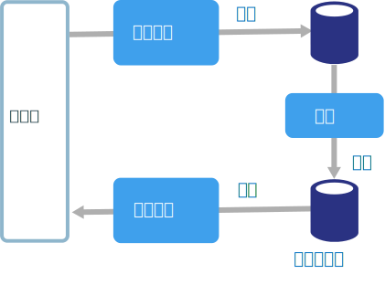
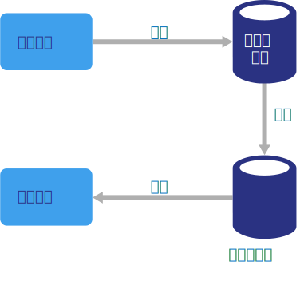

# CQRS 架構樣式

命令和查詢責任隔離 (CQRS) 是可從寫入作業分隔讀取作業的架構樣式。

在傳統架構中，相同資料模型是用來查詢和更新資料庫。 那很簡單，而且對基本 CRUD 作業可運作良好。 不過，在更複雜的應用程式中，此方法可能會變得不便。 比方說，在讀取端，應用程式可能會執行許多不同的查詢，傳回具有不同圖形的資料傳輸物件 (DTO)。 物件對應可能會變得複雜。 在寫入端，模型可能會實作複雜的驗證和商務邏輯。 如此一來，您可能會獲得執行太多作業、過於複雜的模型。

另一個潛在的問題是，讀取和寫入工作負載通常是不對稱的，具有非常不同的效能和調整需求。

CQRS 可解決這些問題，方法是將讀取和寫入分隔至個別的模型，使用 **命令** 來更新資料，以及使用**查詢**來讀取資料。

- 命令應該以工作為基礎，而不是以資料為中心。 (「預訂旅館房間」而不是「將保留狀態設為已保留」。) 命令可能會放在佇列上以進行非同步處理，而不是同步處理。

- 查詢永遠不會修改資料庫。 查詢會傳回不會封裝任何網域知識的 DTO。

如需更好的隔離，您可以實際上將讀取資料與寫入資料分隔。 在該情況下，讀取資料庫可以使用自己已對查詢最佳化的資料結構描述。 例如，它可以儲存資料的[具體化檢視][materialized-view]，以避免複雜的聯結或複雜的 O/RM 對應。 它甚至可能會使用不同類型的資料存放區。 例如，寫入資料庫可能為關聯式，而讀取資料庫為文件資料庫。

如果使用個別的讀取和寫入資料庫，它們必須保持同步。通常其實現方式為每當更新資料庫時便由寫入模型發佈事件。 更新資料庫和發佈事件必須在單一交易中發生。

CQRS 的某些實作使用[事件來源模式][event-sourcing]。 利用此模式，應用程式狀態會儲存為一系列的事件。 每個事件代表對資料的一組變更。 目前狀態則是透過重新執行事件來建構。 在 CQRS 內容中，事件來源的其中一個優點是，相同事件可以用來通知其他元件 &mdash; 特別是通知讀取模型。 讀取模型使用事件來建立目前狀態的快照集，這對查詢更有效率。 不過，事件來源會增加設計的複雜性。

## 使用此架構的時機

考慮將 CQRS 用於許多使用者存取相同資料的共同作業網域，特別是當讀取和寫入的工作負載是不對稱時。

CQRS 不是可適用整個系統的最上層結構。 僅將 CQRS 套用至將讀取和寫入分隔有明顯價值的子系統中。 否則，您便是在產生額外的複雜性，但沒有任何好處。

## 優點

- **獨立調整**。 CQRS 允許讀取和寫入工作負載，以獨立調整，並可能導致較少的鎖定爭用。
- **最佳化資料結構描述**。 讀取端可以使用已針對查詢最佳化的結構描述，同時寫入端可使用已針對更新最佳化的結構描述。
- **安全性**。 要確保只有適當的網域實體會對資料執行寫入更輕鬆。
- **考量分隔**。 分隔讀取和寫入端，會導致更容易維護且更具彈性的模型。 大部分的複雜商務邏輯進入寫入模型。 讀取模型可以是相當簡單。
- **較簡單的查詢**。 藉由將具體化檢視儲存在讀取資料庫，查詢時應用程式可以避免複雜的聯結。

## 挑戰

- **複雜度**。 CQRS 的基本概念很簡單。 但是，它可能會導致更複雜的應用程式設計，特別是如果它們包含事件來源模式。

- **傳訊**。 雖然 CQRS 不需要傳訊，通常會使用傳訊來處理命令訊息並發佈更新事件。 在該情況下，應用程式必須處理訊息失敗或重複的訊息。

- **最終一致性**。 如果您將讀取和寫入資料庫分隔，讀取資料可能會過時。

## 最佳作法

- 如需實作 CQRS 的詳細資訊，請參閱 [CQRS 模式][cqrs-pattern]。

- 考慮使用[事件來源][event-sourcing]模式以避免發生更新衝突。

- 考慮對讀取模型使用[具體化檢視模式][materialized-view]，用來將查詢的結構描述最佳化。

## 微服務中的 CQRS

在[微服務架構][microservices]中，CQRS 特別有用。 微服務的其中一個準則是服務無法直接存取另一個服務的資料存放區。

在下列表中，服務 A 會寫入資料存放區，而服務 B 會保留資料的具體化檢視。 服務 A 會在寫入資料存放區時發佈事件。 服務 B 訂閱此事件。

<!-- links -->

[cqrs-pattern]: ../../patterns/cqrs.md
[event-sourcing]: ../../patterns/event-sourcing.md
[materialized-view]: ../../patterns/materialized-view.md
[microservices]: ./microservices.md
