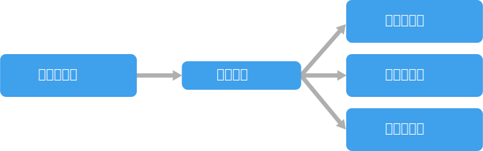

# 事件驅動架構樣式Event-driven architecture style

事件驅動架構包含產生事件串流的**事件產生者**，以及接聽事件的**事件取用者**。An event-driven architecture consists of **event producers** that generate a stream of events, and **event consumers** that listen for the events.

事件會以幾近即時的方式傳遞，讓取用者可以在事件發生時立即做出回應。Events are delivered in near real time, so consumers can respond immediately to events as they occur. 產生者會與取用者分離，也就是說，產生者並不會知道是哪一個取用者在接聽。Producers are decoupled from consumers &mdash; a producer doesn't know which consumers are listening. 取用者也會彼此分離，而且每個取用者都會看到所有事件。Consumers are also decoupled from each other, and every consumer sees all of the events. 這與[競爭取用者][competing-consumers]模式不同，競爭取用者模式的取用者會從佇列提取訊息，而且一個訊息只會處理一次 (在沒有錯誤的前提下)。This differs from a [Competing Consumers][competing-consumers] pattern, where consumers pull messages from a queue and a message is processed just once (assuming no errors). 某些系統 (例如 IoT) 必須極為大量地擷取事件。In some systems, such as IoT, events must be ingested at very high volumes.

事件驅動架構可以使用發行/訂閱模型或事件串流模型。An event driven architecture can use a pub/sub model or an event stream model.

- **發行/訂閱**：傳訊基礎結構會追蹤訂用帳戶。**Pub/sub**: The messaging infrastructure keeps track of subscriptions. 有事件發行時，它就會將該事件傳送給每個訂閱者。When an event is published, it sends the event to each subscriber. 事件經過接收後就無法重新執行，因此新的訂閱者不會看到該事件。After an event is received, it cannot be replayed, and new subscribers do not see the event.

- **事件串流**：事件會寫入記錄中。**Event streaming**: Events are written to a log. 事件有嚴格的排序 (在資料分割內) 並具有持久性。Events are strictly ordered (within a partition) and durable. 用戶端不會訂閱串流，相反地，用戶端可以讀取串流的任何部分。Clients don't subscribe to the stream, instead a client can read from any part of the stream. 用戶端負責讓其在串流中的位置前進。The client is responsible for advancing its position in the stream. 這表示用戶端可以在任何時間加入，並可重新執行事件。That means a client can join at any time, and can replay events.

在取用者端，則有一些常見的變化：On the consumer side, there are some common variations:

- **簡單事件處理**。**Simple event processing**. 事件會立即在取用者中觸發動作。An event immediately triggers an action in the consumer. 例如，您可以使用 Azure Functions 並搭配服務匯流排觸發程序，以便在每當有訊息發佈至服務匯流排主題時執行函式。For example, you could use Azure Functions with a Service Bus trigger, so that a function executes whenever a message is published to a Service Bus topic.

- **複雜事件處理**。**Complex event processing**. 取用者會處理一系列的事件，使用 Azure 串流分析或 Apache Storm 之類的技術尋找事件資料的模式。A consumer processes a series of events, looking for patterns in the event data, using a technology such as Azure Stream Analytics or Apache Storm. 例如，您可以彙總內嵌裝置在一段時間內的數據，並在移動平均值超過特定閾值時產生通知。For example, you could aggregate readings from an embedded device over a time window, and generate a notification if the moving average crosses a certain threshold.

- **事件串流處理**。**Event stream processing**. 使用資料串流平台 (例如 Azure IoT 中樞或 Apache Kafka) 做為管線，以擷取事件並饋送至串流處理器。Use a data streaming platform, such as Azure IoT Hub or Apache Kafka, as a pipeline to ingest events and feed them to stream processors. 串流處理器會採取行動，以處理或轉換串流。The stream processors act to process or transform the stream. 不同的應用程式子系統可能會有多個串流處理器。There may be multiple stream processors for different subsystems of the application. 這個方法很適合用於 IoT 工作負載。This approach is a good fit for IoT workloads.

事件的來源可能是系統外部，例如 IoT 解決方案中的實體裝置。The source of the events may be external to the system, such as physical devices in an IoT solution. 在此情況下，系統必須能夠以資料來源所需要的數量和輸送量擷取資料。In that case, the system must be able to ingest the data at the volume and throughput that is required by the data source.

在上述邏輯圖中，每種類型的取用者各顯示為一個方塊。In the logical diagram above, each type of consumer is shown as a single box. 實際上，取用者經常會有多個執行個體，以免取用者成為系統中的單一失敗點。In practice, it's common to have multiple instances of a consumer, to avoid having the consumer become a single point of failure in system. 可能也必須有多個執行個體才能處理事件的數量和頻率。Multiple instances might also be necessary to handle the volume and frequency of events. 此外，單一取用者也可以在多個執行緒上處理事件。Also, a single consumer might process events on multiple threads. 如果事件必須按順序處理，或需要正好一次的語意，這可能會產生困難。This can create challenges if events must be processed in order, or require exactly-once semantics. 請參閱[最小化協調][minimize-coordination]。See [Minimize Coordination][minimize-coordination].

## 使用此架構的時機When to use this architecture

- 多個子系統必須處理相同的事件。Multiple subsystems must process the same events.
- 具有最小延遲時間的即時處理。Real-time processing with minimum time lag.
- 複雜事件處理，例如模式比對或一段時間的彙總。Complex event processing, such as pattern matching or aggregation over time windows.
- 大量和高速度的資料，例如 IoT。High volume and high velocity of data, such as IoT.

## 優點Benefits

- 產生者和取用者分離。Producers and consumers are decoupled.
- 沒有點對點整合。No point-to point-integrations. 可以輕鬆地將新的取用者新增至系統。It's easy to add new consumers to the system.
- 取用者可以在事件到達時立即做出回應。Consumers can respond to events immediately as they arrive.
- 高度延展性且分散。Highly scalable and distributed.
- 子系統有獨立的事件串流檢視。Subsystems have independent views of the event stream.

## 挑戰Challenges

- 有保證的傳遞。Guaranteed delivery. 在某些系統上，尤其是在 IoT 案例中，保證事件的傳遞是相當重要的事。In some systems, especially in IoT scenarios, it's crucial to guarantee that events are delivered.
- 按順序處理事件，或只處理一次。Processing events in order or exactly once. 每個取用者類型通常會在多個執行個體中執行，以便擁有復原功能和延展性。Each consumer type typically runs in multiple instances, for resiliency and scalability. 如果事件必須按順序處理 (在某個取用者類型中)，或如果處理邏輯不是等冪的，這會產生挑戰。This can create a challenge if the events must be processed in order (within a consumer type), or if the processing logic is not idempotent.

 <!-- links -->

[competing-consumers]: ../../patterns/competing-consumers.md
[minimize-coordination]: ../design-principles/minimize-coordination.md
