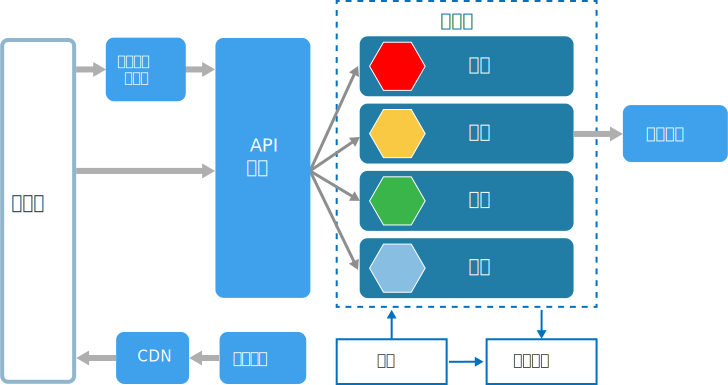
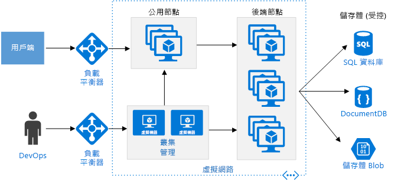
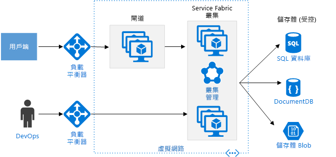

# 微服務架構樣式Microservices architecture style

微服務架構是由一組小型的自發服務所組成。A microservices architecture consists of a collection of small, autonomous services. 每個服務各自獨立，並且應該實作單一的商務功能。Each service is self-contained and should implement a single business capability. 如需在 Azure 上建置微服務架構的詳細指引，請參閱[在 Azure 上設計、建置及操作微服務](../../microservices/index.md)。For detailed guidance about building a microservices architecture on Azure, see [Designing, building, and operating microservices on Azure](../../microservices/index.md).

 
在某些方面，微服務算是服務導向架構 (SOA) 的自然演化，但微服務和 SOA 之間存有差異。In some ways, microservices are the natural evolution of service oriented architectures (SOA), but there are differences between microservices and SOA. 以下是微服務的一些定義特性：Here are some defining characteristics of a microservice:

- 微服務架構中的服務屬於小型、獨立且鬆散結合的服務。In a microservices architecture, services are small, independent, and loosely coupled.

- 每個服務都是個別的程式碼基底，可由小型的開發小組負責管理。Each service is a separate codebase, which can be managed by a small development team.

- 服務可以獨立部署。Services can be deployed independently. 小組可以直接更新現有服務，而不需要重建和重新部署整個應用程式。A team can update an existing service without rebuilding and redeploying the entire application.

- 服務需負責保存自己的資料或外部狀態。Services are responsible for persisting their own data or external state. 這一點不同於傳統模型，傳統模型是由個別資料層處理資料持續性。This differs from the traditional model, where a separate data layer handles data persistence.

- 服務會使用妥善定義的 API 來彼此通訊。Services communicate with each other by using well-defined APIs. 每個服務的內部實作詳細資料都會對其他服務隱藏。Internal implementation details of each service are hidden from other services.

- 服務不需要共用相同的技術堆疊、程式庫或架構。Services don't need to share the same technology stack, libraries, or frameworks.

除了服務本身外，典型的微服務架構中還會出現一些其他元件：Besides for the services themselves, some other components appear in a typical microservices architecture:

**管理**。**Management**. 管理元件負責將服務放在節點上、識別失敗、跨節點重新平衡服務等等。The management component is responsible for placing services on nodes, identifying failures, rebalancing services across nodes, and so forth.  

**服務探索**。**Service Discovery**.  保有服務及其所在節點的清單。Maintains a list of services and which nodes they are located on. 可進行服務查閱來尋找服務端點。Enables service lookup to find the endpoint for a service. 

**API 閘道**。**API Gateway**. API 閘道是用戶端的進入點。The API gateway is the entry point for clients. 用戶端不會直接呼叫服務。Clients don't call services directly. 相反地，它們會呼叫 API 閘道，API 閘道再將呼叫轉送至後端的適當服務。Instead, they call the API gateway, which forwards the call to the appropriate services on the back end. API 閘道可能會彙總數個服務的回應，並傳回彙總的回應。The API gateway might aggregate the responses from several services and return the aggregated response. 

使用 API 閘道的優點包括：The advantages of using an API gateway include:

- 它可讓用戶端與服務分離。It decouples clients from services. 服務可以控制版本或重構，而不需要更新所有的用戶端。Services can be versioned or refactored without needing to update all of the clients.

-  服務可使用非專供 Web 使用的傳訊通訊協定，例如 AMQP。Services can use messaging protocols that are not web friendly, such as AMQP.

- API 閘道可以執行其他跨領域功能，例如驗證、記錄、SSL 終止和負載平衡。The API Gateway can perform other cross-cutting functions such as authentication, logging, SSL termination, and load balancing.

## 使用此架構的時機When to use this architecture

請考慮將此架構樣式用於：Consider this architecture style for:

- 需要高發行速度的大型應用程式。Large applications that require a high release velocity.

- 需要具有高擴充性的複雜應用程式。Complex applications that need to be highly scalable.

- 具有豐富網域或許多子網域的應用程式。Applications with rich domains or many subdomains.

- 由小型開發小組所組成的組織。An organization that consists of small development teams.

## 優點Benefits 

- **獨立部署**。**Independent deployments**. 您可以逕自更新服務而不必重新部署整個應用程式，並於發生錯誤時復原或向前復原。You can update a service without redeploying the entire application, and roll back or roll forward an update if something goes wrong. 錯誤修正和功能版本會更容易管理且風險較低。Bug fixes and feature releases are more manageable and less risky.

- **獨立開發**。**Independent development**. 單一開發小組可以建置、測試及部署服務。A single development team can build, test, and deploy a service. 結果便是不斷創新和更快速的發行頻率。The result is continuous innovation and a faster release cadence. 

- **小型焦點小組**。**Small, focused teams**. 小組可以專注於一項服務。Teams can focus on one service. 每個服務的範圍越小，就能更容易了解程式碼基底，並讓新的小組成員容易跟上進展。The smaller scope of each service makes the code base easier to understand, and it's easier for new team members to ramp up.

- **錯誤隔離**。**Fault isolation**. 如果服務停止運作，不必因此取出整個應用程式。If a service goes down, it won't take out the entire application. 不過，這並非表示您可以不必付出代價就完成復原。However, that doesn't mean you get resiliency for free. 您仍需遵循復原功能的最佳做法和設計模式。You still need to follow resiliency best practices and design patterns. 請參閱[為 Azure 設計復原應用程式][resiliency-overview]。See [Designing resilient applications for Azure][resiliency-overview].

- **混合技術堆疊**。**Mixed technology stacks**. 小組可以挑選最適合其服務使用的技術。Teams can pick the technology that best fits their service. 

- **細微調整**。**Granular scaling**. 服務可以獨立調整。Services can be scaled independently. 同時，每個 VM 的服務密度越高，代表 VM 資源已充分運用。At the same time, the higher density of services per VM means that VM resources are fully utilized. 使用放置條件約束，服務即可對應至 VM 設定檔 (高 CPU、高記憶體等等)。Using placement constraints, a services can be matched to a VM profile (high CPU, high memory, and so on).

## 挑戰Challenges

- **複雜度**。**Complexity**. 微服務應用程式的變動組件數量比同等單體式應用程式的還多。A microservices application has more moving parts than the equivalent monolithic application. 每個服務會更為簡單，但是系統整個會變得更複雜。Each service is simpler, but the entire system as a whole is more complex.

- **開發和測試**。**Development and test**. 根據服務相依性來進行開發需要不同的方法。Developing against service dependencies requires a different approach. 現有工具的設計不一定可處理服務相依性。Existing tools are not necessarily designed to work with service dependencies. 跨服務界限進行重構會很困難。Refactoring across service boundaries can be difficult. 測試服務相依性也會很困難，尤其是當應用程式的演變速度很快時。It is also challenging to test service dependencies, especially when the application is evolving quickly.

- **缺乏控管**。**Lack of governance**. 微服務的非集中式建置方法有其優點，卻也可能導致問題發生。The decentralized approach to building microservices has advantages, but it can also lead to problems. 您最終可能會有很多不同的語言和架構，而讓應用程式變得難以維護。You may end up with so many different languages and frameworks that the application becomes hard to maintain. 備有某些適用於全部專案的標準，而不要過度限制小組的彈性，這樣的做法可能會有幫助。It may be useful to put some project-wide standards in place, without overly restricting teams' flexibility. 這特別適用於跨領域功能，例如記錄。This especially applies to cross-cutting functionality such as logging.

- **網路壅塞與延遲**。**Network congestion and latency**. 使用許多小型且細微的服務可能會導致服務之間需要更多通訊。The use of many small, granular services can result in more interservice communication. 此外，如果服務相依性鏈結太長 (服務 A 呼叫 B、B 再呼叫 C...)，額外的延遲可能成為問題。Also, if the chain of service dependencies gets too long (service A calls B, which calls C...), the additional latency can become a problem. 您將必須謹慎地設計 API。You will need to design APIs carefully. 請避免對話過度的 API、考慮使用序列化格式，並找找看有沒有地方可以使用非同步的通訊模式。Avoid overly chatty APIs, think about serialization formats, and look for places to use asynchronous communication patterns.

- **資料完整性**。**Data integrity**. 每個微服務負責維持自己的資料持續性。With each microservice responsible for its own data persistence. 因此，維持資料一致性會成為挑戰。As a result, data consistency can be a challenge. 可能的話，請採用最終一致性。Embrace eventual consistency where possible.

- **管理**。**Management**. 想要成功運用微服務，就必須有成熟的 DevOps 文化。To be successful with microservices requires a mature DevOps culture. 在服務之間建立關聯式記錄會非常困難。Correlated logging across services can be challenging. 一般而言，記錄必須將多個服務呼叫相互關聯到單一使用者作業。Typically, logging must correlate multiple service calls for a single user operation.

- **版本控制**。**Versioning**. 服務的更新不得打斷與其相依的服務。Updates to a service must not break services that depend on it. 多個服務有可能在同一時間一起更新，因此若未謹慎設計，便可能發生回溯相容性或往後相容性問題。Multiple services could be updated at any given time, so without careful design, you might have problems with backward or forward compatibility.

- **技能集**。**Skillset**. 微服務是高度分散的系統。Microservices are highly distributed systems. 請謹慎評估小組是否有技能和經驗能夠成功。Carefully evaluate whether the team has the skills and experience to be successful.

## 最佳作法Best practices

- 根據商業領域建立服務的模型。Model services around the business domain. 

- 將所有項目拆開。Decentralize everything. 由個別小組負責設計和建置服務。Individual teams are responsible for designing and building services. 避免共用程式碼或資料結構描述。Avoid sharing code or data schemas. 

- 資料儲存體應該為擁有資料的服務私用。Data storage should be private to the service that owns the data. 針對每個服務和資料類型使用最佳的儲存體。Use the best storage for each service and data type. 

- 服務應透過設計良好的 API 進行通訊。Services communicate through well-designed APIs. 避免洩漏實作詳細資料。Avoid leaking implementation details. API 應該建立網域的模型，而不是建立服務內部實作的模型。APIs should model the domain, not the internal implementation of the service.

- 避免服務彼此結合。Avoid coupling between services. 結合的原因包括共用資料庫結構描述和固定的通訊協定。Causes of coupling include shared database schemas and rigid communication protocols.

- 將跨領域考量 (例如驗證和 SSL 終止) 卸載給閘道。Offload cross-cutting concerns, such as authentication and SSL termination, to the gateway.

- 不要在閘道中暴露網域資訊。Keep domain knowledge out of the gateway. 閘道應該在不知道商務規則或網域邏輯的情況下處理和路由傳送用戶端要求。The gateway should handle and route client requests without any knowledge of the business rules or domain logic. 否則，閘道會成為相依項目，而讓服務彼此結合。Otherwise, the gateway becomes a dependency and can cause coupling between services.

- 服務應該具有鬆散結合和高度功能一致性的特性。Services should have loose coupling and high functional cohesion. 可能會一起變更的功能應該一起封裝和部署。Functions that are likely to change together should be packaged and deployed together. 如果這些功能分居不同服務，它們最後會緊密結合，因為對某項服務進行變更就會需要更新其他服務。If they reside in separate services, those services end up being tightly coupled, because a change in one service will require updating the other service. 兩個服務之間對話過度可能是緊密結合和低一致性的徵兆。Overly chatty communication between two services may be a symptom of tight coupling and low cohesion. 

- 隔離失敗。Isolate failures. 請使用復原策略來避免某個服務的失敗產生連鎖反應。Use resiliency strategies to prevent failures within a service from cascading. 請參閱[恢復模式][resiliency-patterns]和[設計復原應用程式][resiliency-overview]。See [Resiliency patterns][resiliency-patterns] and [Designing resilient applications][resiliency-overview].

## 使用 Azure Container Service 的微服務Microservices using Azure Container Service 

您可以使用 [Azure Container Service](/azure/container-service/) 來設定和佈建 Docker 叢集。You can use [Azure Container Service](/azure/container-service/) to configure and provision a Docker cluster. Azure Container Service 支援數種熱門的容器 Orchestrator，包括 Kubernetes、DC/OS 和 Docker Swarm。Azure Container Services supports several popular container orchestrators, including Kubernetes, DC/OS, and Docker Swarm.

 
**公用節點**。**Public nodes**. 這些節點可透過對外公開的負載平衡器來聯繫到。These nodes are reachable through a public-facing load balancer. API 閘道裝載在這些節點上。The API gateway is hosted on these nodes.

**後端節點**。**Backend nodes**. 這些節點會執行用戶端透過 API 閘道所連線的服務。These nodes run services that clients reach via the API gateway. 這些節點不會直接收到網際網路流量。These nodes don't receive Internet traffic directly. 後端節點可能會包含不只一個的 VM 集區，其各有不同的硬體設定檔。The backend nodes might include more than one pool of VMs, each with a different hardware profile. 例如，您可以建立不同的集區來應付一般的計算工作負載、高 CPU 的工作負載和高記憶體的工作負載。For example, you could create separate pools for general compute workloads, high CPU workloads, and high memory workloads. 

**管理 VM**。**Management VMs**. 這些 VM 會執行容器 Orchestrator 的主要節點。These VMs run the master nodes for the container orchestrator. 

**網路**。**Networking**. 公用節點、後端節點和管理 VM 會位於相同虛擬網路 (VNet) 內的不同子網路。The public nodes, backend nodes, and management VMs are placed in separate subnets within the same virtual network (VNet). 

**負載平衡器**。**Load balancers**.  對外公開的負載平衡器位於公用節點前面。An externally facing load balancer sits in front of the public nodes. 它會將網際網路要求散發給公用節點。It distributes internet requests to the public nodes. 另一個負載平衡器會位於管理 VM，以使用 NAT 規則允許安全殼層 (ssh) 流量進入管理 VM。Another load balancer is placed in front of the management VMs, to allow secure shell (ssh) traffic to the management VMs, using NAT rules.

為了保有可靠性和延展性，每個服務都會跨多個 VM 來複寫。For reliability and scalability, each service is replicated across multiple VMs. 不過，由於這些服務相當輕量 (相較於單體式應用程式)，因此通常會將多個服務封裝到單一 VM 中。However, because services are also relatively lightweight (compared with a monolithic application), multiple services are usually packed into a single VM. 密度越高，資源使用率就越好。Higher density allows better resource utilization. 如果特定服務不會使用大量資源，您就不需要專門準備一整個 VM 來執行該服務。If a particular service doesn't use a lot of resources, you don't need to dedicate an entire VM to running that service.

下圖顯示執行了四個不同服務的三個節點 (以不同形狀表示)。The following diagram shows three nodes running four different services (indicated by different shapes). 請注意每個服務都有至少兩個執行個體。Notice that each service has at least two instances. 
 

## 使用 Azure Service Fabric 的微服務Microservices using Azure Service Fabric

下圖顯示使用 [Azure Service Fabric](/azure/service-fabric/) 的微服務架構。The following diagram shows a microservices architecture using [Azure Service Fabric](/azure/service-fabric/).

Service Fabric 叢集會部署到一個或多個虛擬機器擴展集。The Service Fabric cluster is deployed to one or more VM scale sets. 您可以在叢集中放入多個 VM 擴展集，以便混用 VM 類型。You might have more than one VM scale set in the cluster, in order to have a mix of VM types. API 閘道會位於 Service Fabric 叢集前面，並有外部負載平衡器可接收用戶端要求。An API Gateway is placed in front of the Service Fabric cluster, with an external load balancer to receive client requests.

Service Fabric 執行階段會執行叢集管理，包括服務放置、節點容錯移轉以及健康情況監視。The Service Fabric runtime performs cluster management, including service placement, node failover, and health monitoring. 執行階段會部署在叢集節點本身之中。The runtime is deployed on the cluster nodes themselves. 沒有不同組的叢集管理 VM。There isn't a separate set of cluster management VMs.

服務會使用內建於 Service Fabric 的反向 Proxy 彼此通訊。Services communicate with each other using the reverse proxy that is built into Service Fabric. Service Fabric 會提供可解析具名服務端點的探索服務。Service Fabric provides a discovery service that can resolve the endpoint for a named service.

<!-- links -->

[resiliency-overview]: ../../resiliency/index.md
[resiliency-patterns]: ../../patterns/category/resiliency.md

