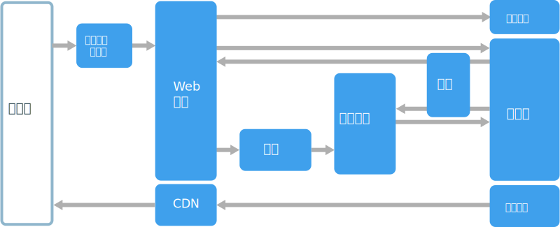
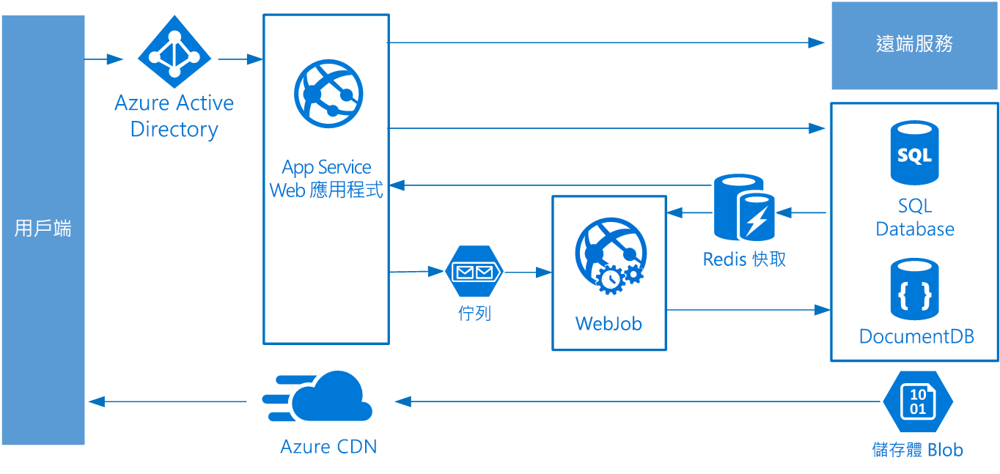

# Web-佇列-背景工作角色架構樣式

這個架構的核心元件是**Web 前端**和**背景工作角色**，前者負責用戶端要求，後者則執行需要大量資源的工作、長時間執行工作流程或批次作業。  Web 前端透過**訊息佇列**與背景工作角色通訊。  

其他經常併入這個架構的元件包括：

- 一或多個資料庫。 
- 快取，儲存資料庫中之值以利快速讀取。
- CDN，處理靜態內容
- 遠端服務，例如電子郵件或 SMS 服務。 通常這些是由第三方提供。
- 識別提供者，用於驗證。

Web 和背景工作角色都是無狀態。 工作階段狀態可以儲存在分散式快取中。 任何長時間執行的工作都是由背景工作角色以非同步方式完成。 背景工作角色可由佇列上的訊息觸發，或在批次處理中依照排程執行。 背景工作角色是選擇性元件。 如果沒有長時間執行的作業，就可以省略背景工作角色。  

前端可能包含 Web API。 在用戶端，可以透過會發出 AJAX 呼叫的單一頁面應用程式取用 Web API，或由原生用戶端應用程式取用 Web API。

## 使用此架構的時機

「Web-佇列-背景工作角色」架構的實作，通常是使用受管理的計算服務：Azure App Service 或 Azure 雲端服務實作。 

請考慮將此架構樣式用於：

- 具備相對簡單網域的應用程式。
- 有一些長時間執行工作流程或批次作業的應用程式。
- 當您想要使用受管理的服務，而不是基礎結構即服務 (IaaS)。

## 優點

- 相對簡單的架構相當容易理解。
- 容易部署及管理。
- 清楚區分重要事項。
- 使用非同步傳訊就可以分開前端和背景工作角色。
- 可以獨立調整前端和背景工作角色。

## 挑戰

- 若設計不慎，前端與背景工作角色可能會成為難以維護及更新的大型整合元件。
- 如果前端和背景工作共用資料結構描述或程式碼模組，則可能會隱藏的相依性。 

## 最佳作法

- 向用戶端公開設計良好的 API。 請參閱 [API 設計最佳作法][api-design]。
- 使用自動調整來因應負載的改變。 請參閱[自動調整最佳作法][autoscaling]。
- 快取半靜態資料。 請參閱[快取最佳作法][caching]。
- 使用 CDN 來裝載靜態內容。 請參閱 [CDN 最佳作法][cdn]。
- 適當的時候使用 polyglot persistence。 請參閱[使用作業的最佳資料存放區][polyglot]。
- 分割資料以改善延展性、減少爭用，以及最佳化效能。 請參閱[資料分割的最佳作法][data-partition]。

## Azure App Service 上的 Web-佇列-背景工作角色

本節描述建議的 Web-佇列-背景工作角色架構，它使用 Azure App Service。 

前端實作成 Azure App Service Web 應用程式，而背景工作角色實作為 WebJob。 Web 應用程式和 WebJob 都與提供 VM 執行個體的 App Service 方案相關聯。 

您可以使用 Azure 服務匯流排或 Azure 儲存體佇列來提供訊息佇列。 (圖中為 Azure 儲存體佇列。)

Azure Redis 快取會儲存工作階段狀態和其他需要低延遲存取的資料。

Azure CDN 用於快取靜態內容，例如影像、CSS 或 HTML。

在儲存體方面，選擇最符合應用程式需求的儲存體技術。 您可以使用多個儲存體技術 (polyglot persistence)。 為了說明這個概念，圖中顯示 Azure SQL Database 和 Azure Cosmos DB。  

如需詳細資訊，請參閱 [App Service Web 應用程式參考架構][scalable-web-app]。

### 其他考量

- 並非每個交易皆必須透過佇列和背景工作角色移至儲存體。 Web 前端可以直接執行簡單的讀取/寫入作業。 背景工作角色專為需要大量資源的工作或長時間執行的工作流程而設計。 在某些情況下，您可能根本不需要背景工作角色。

- 使用 App Service 內建的自動調整功能，相應放大 VM 的執行個體數目。 如果應用程式的負載有固定可預測的模式，使用依排程執行的自動調整。 如果負載無法預期，使用依計量執行的自動調整規則。      

- 請考慮將 Web 應用程式和 WebJob 放入不同的 App Service 方案。 這樣一來，它們裝載在不同的 VM 執行個體上，可以獨立調整。 

- 生產和測試請使用不同的 App Service 方案。 否則，如果您在生產和測試使用相同方案，表示您的測試會在生產環境的 VM 上執行。

- 使用部署位置管理部署。 這可讓您將更新後的版本部署到預備位置，然後換到新的版本。 如果更新發生問題，它也讓您可以換回先前的版本。

<!-- links -->

[api-design]: ../../best-practices/api-design.md
[autoscaling]: ../../best-practices/auto-scaling.md
[caching]: ../../best-practices/caching.md
[cdn]: ../../best-practices/cdn.md
[data-partition]: ../../best-practices/data-partitioning.md
[polyglot]: ../design-principles/use-the-best-data-store.md
[scalable-web-app]: ../../reference-architectures/app-service-web-app/scalable-web-app.md