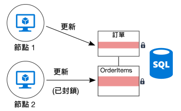
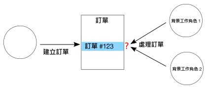

# 最小化協調

## 將來應用程式服務之間的協調最小化，以達成延展性

大多數雲端應用程式包含多個應用程式服務 &mdash; Web 前端、資料庫、商務程序、報告和分析，依此類推。 若要達到延展性和可靠性，這些服務的每個應該在多個執行個體上執行。

當兩個執行個體嘗試執行會影響某些共用狀態的並行作業時，會發生什麼事？ 在某些情況下，節點間必須有協調，例如，為了保留 ACID 保證。 在此圖中，`Node2` 正在等候 `Node1` 釋放資料庫鎖定：

協調會限制水平調整的好處，並產生瓶頸。 在此範例中，隨著您將應用程式相應放大，並新增更多執行個體，您會看到鎖定爭用增加。 在最差的情況下，前端執行個體將會花費最多時間等待鎖定。

「正好一次」語意是另一個常見的協調來源。 例如，訂單必須處理正好一次。 兩個背景工作正在接聽新的訂單。 `Worker1` 會揀取訂單進行處理。 應用程式必須確定 `Worker2` 不會重複工作，同時，如果 `Worker1` 損毀，不會捨棄訂單。

您可以使用模式，例如[排程器代理程式監督員][sas-pattern]來在背景工作之間協調，但在此情況下，更好的方法可能是分割工作。 每個背景工作會獲指派特定範圍的訂單 (例如，依計費區域)。 如果某個背景工作損毀，新執行個體會揀取前一個執行個體離開的位置，但多個執行個體不會競爭。

## 建議

**擁有最終一致性**。 當資料為分散式時，它會採用協調來強制強式一致性保證。 例如，假設某個作業會更新兩個資料庫。 不要將該作業放入單一交易範圍，最好系統可以提供最終一致性，也許是透過使用[補償交易][compensating-transaction]模式在失敗之後以邏輯方式復原。

**使用網域事件來同步處理狀態**。 [網域事件][domain-event]是一種事件，當網域中發生具有意義的事情發生時會加以記錄。 相關服務可以接聽該事件，而不是使用全域交易來跨多個服務進行協調。 如果使用此方法，系統必須可以容忍最終一致性 (請參閱上一個項目)。

**考慮 CQRS 和事件來源之類模式**。 這兩種模式可以協助減少讀取工作負載與寫入工作負載之間的競爭。

- [CQRS 模式][cqrs-pattern] 會將讀取作業從寫入作業中分隔。 在某些實作中，讀取資料實際上是與寫入資料分隔的。

- 在[事件來源模式][event-sourcing]中，會將狀態變更記錄為一系列的事件至僅附加的資料存放區。 將事件附加至資料流是不可部分完成的作業，需要最基本的鎖定。

這兩個模式彼此互補。 如果 CQRS 中的唯寫存放區會使用事件來源，在唯讀存放區可以接聽相同事件，以建立目前狀態可讀取的快照集 (針對查詢最佳化)。 不過，採用 CQRS 或事件來源之前，請注意此方法的挑戰。 如需詳細資訊，請參閱 [CQRS 架構樣式][cqrs-style]。

**分割資料**。  避免將所有的資料放入一個跨許多應用程式服務共用的資料結構描述中。 微服務架構會藉由讓每項服務負責自己的資料存放區來強制此原則。 在單一資料庫內，將資料分割為分區可以改善並行存取，因為寫入一個分區的服務不會影響寫入至不同分區的服務。

**設計等冪性作業**。 如果可能的話，請將作業設計為等冪性。 這樣一來，可以使用在至少一次語意處理作業。 例如，您可以將工作項目放在佇列上。 如果某個背景工作在作業中途損毀，另一個背景工作只需撿取工作項目。

**使用非同步平行處理**。 如果作業需要執行以非同步方式 (例如遠端服務呼叫中) 的多個步驟，您可以以平行方式呼叫它們，然後彙總結果。 此方法會假設每個步驟不會仰賴於上一個步驟的結果。

**可能時使用開放式並行存取**。 悲觀並行控制會使用資料庫鎖定來防止衝突。 這會造成效能不佳，並且降低可用性。 利用開放式並行存取控制，每個交易會修改資料的副本或快照集。 認可交易時，資料庫引擎會驗證交易，並拒絕會影響資料庫一致性的任何交易。

Azure SQL Database 和 SQL Server 透過[快照集隔離][sql-snapshot-isolation]支援開放式並行存取。 某些 Azure 儲存體服務透過使用 Etag (包含 [Azure Cosmos DB][cosmosdb-faq] 和 [Azure 儲存體][storage-concurrency]) 支援開放式並行存取。

**考慮 MapReduce 或其他平行、分散式演算法**。 根據資料和要執行的工作類型，您可以將工作分割成可以由多個平行運作的節點執行的獨立工作。 請參閱 [Big Compute 架構樣式][big-compute]。

**使用選出領導者進行協調**。 在您要協調作業的情況下，請確定協調器不會成為應用程式中的單一失敗點。 使用[選出領導者模式][leader-election]，某個執行個體是任何時間的領導者，並且做為協調器。 如果領導者失敗，會選取新執行個體做為領導者。

<!-- links -->

[big-compute]: ../architecture-styles/big-compute.md
[compensating-transaction]: ../../patterns/compensating-transaction.md
[cqrs-style]: ../architecture-styles/cqrs.md
[cqrs-pattern]: ../../patterns/cqrs.md
[cosmosdb-faq]: /azure/cosmos-db/faq
[domain-event]: https://martinfowler.com/eaaDev/DomainEvent.html
[event-sourcing]: ../../patterns/event-sourcing.md
[leader-election]: ../../patterns/leader-election.md
[sas-pattern]: ../../patterns/scheduler-agent-supervisor.md
[sql-snapshot-isolation]: /sql/t-sql/statements/set-transaction-isolation-level-transact-sql
[storage-concurrency]: https://azure.microsoft.com/blog/managing-concurrency-in-microsoft-azure-storage-2/