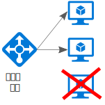
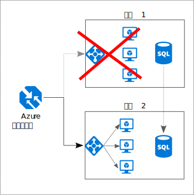

# 讓各個項目都有備援

## 將備援建置到您的應用程式中，以避免發生單一失敗點

復原應用程式會環繞著失敗路由。 識別您的應用程式中的關鍵路徑。 路徑中的每個點上有備援嗎？ 如果子系統失敗，應用程式是否將容錯移轉到其他項目？

## 建議

**考慮商務需求**。 系統內建的備援數量可能同時影響成本和複雜度。 您的架構應根據商務需求，例如復原時間目標 (RTO)。 比方說，多區域部署成本高於單一區域部署，並且管理更為複雜。 您將需要作業程序來處理容錯移轉和容錯回復。 額外的成本和複雜度對一些商務情節可能合理，但對其他情節則不適用。

**將 VM 放在負載平衡器後**。 請勿對關鍵任務工作負載使用單一 VM。 相反地，請將多個 VM 放置在負載平衡器後方。 如果任何 VM 變得無法使用，負載平衡器會將流量散發至其餘狀況良好的 VM。 若要了解如何部署此設定，請參閱[用於延展性和可用性的多個 VM][multi-vm-blueprint]。

**複寫資料庫**。 Azure SQL Database 和 Cosmos DB 會自動複寫區域內的資料，而且您可以跨區域啟用異地複寫。 如果您使用 IaaS 資料庫解決方案，請選擇一個支援複寫和容錯移轉的解決方案，例如 [SQL Server Alwayson 可用性群組][sql-always-on]。

**啟用異地複寫**。 [Azure SQL Database][sql-geo-replication] 和 [Cosmos DB][cosmosdb-geo-replication] 的異地複寫會在一或多個次要區域中建立資料的次要可讀取複本。 如果發生中斷，資料庫可以容錯移轉到次要區域以進行寫入。

**針對可用性的分割**。 資料庫分割通常用來改善延展性，但它也可以提升可用性。 如果一個分區關閉，其他分區仍可供存取。 一個分區失敗只會中斷交易總計的子集。

**部署到多個區域**。 如需最高的可用性，請將應用程式部署到多個區域。 這樣一來，在極少數的情況下，如果問題會影響整個區域，應用程式可以容錯移轉到另一個區域。 下圖顯示使用 Azure 流量管理員來處理容錯移轉的多重區域應用程式。

**同步處理前端和後端容錯移轉**。 使用 Azure 流量管理員來將前端容錯移轉。 如果一個區域中的後端變成無法連線，流量管理員會將新的要求路由至次要區域。 根據您的資料庫解決方案，您可能需要對資料庫協調容錯移轉。

**使用自動容錯移轉但手動容錯回復**。 對自動容錯移轉 (而不要對自動容錯回復) 使用流量管理員。 自動容錯回復帶有的風險是，您可能會在區域完全狀況良好之前切換到主要區域。 相反地，請確認所有的應用程式子系統狀況良好，然後再手動進行容錯回復。 此外，根據資料庫，在容錯移轉之前，您可能需要檢查資料的一致性。

**包含流量管理員的備援**。 流量管理員是可能的失敗點。 檢閱流量管理員 SLA，並判斷單獨使用流量管理員是否符合您獲得高可用性的商務需求。 如果沒有，請考慮新增另一個流量管理解決方案作為容錯回復。 如果 Azure 流量管理員服務失敗，在 DNS 中變更您的 CNAME 記錄，以指向其他流量管理服務。

<!-- links -->

[multi-vm-blueprint]: ../../reference-architectures/virtual-machines-windows/multi-vm.md

[cassandra]: https://cassandra.apache.org/
[cosmosdb-geo-replication]: /azure/cosmos-db/distribute-data-globally
[sql-always-on]: https://msdn.microsoft.com/library/hh510230.aspx
[sql-geo-replication]: /azure/sql-database/sql-database-geo-replication-overview
