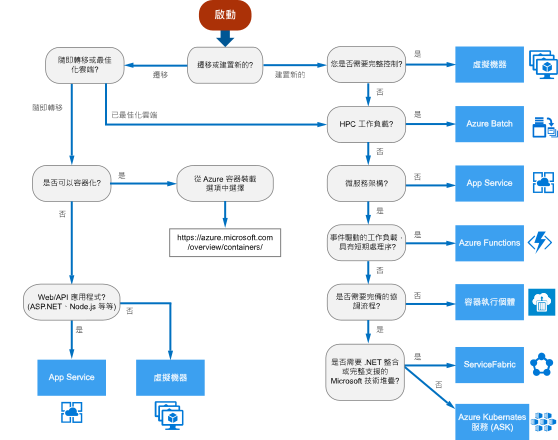

# Azure 計算服務的決策樹

Azure 提供了多種方式來裝載您的應用程式程式碼。 *計算*一詞是指您的應用程式執行所在運算資源的裝載模型。 下列流程圖可協助您選擇應用程式適用的計算服務。 此流程圖會引導您完成一組重要決策準則，以導出建議事項。 

**將此流程圖視為起始點。** 每個應用程式各有不同的需求，因此將此建議視為起始點。 接著，請執行詳細評估，查看如下的層面：
 
- 功能集
- [服務限制](/azure/azure-subscription-service-limits)
- [成本](https://azure.microsoft.com/pricing/)
- [SLA](https://azure.microsoft.com/support/legal/sla/)
- [區域可用性](https://azure.microsoft.com/global-infrastructure/services/)
- 開發人員生態系統和小組技能
- [計算比較資料表](./compute-comparison.md)

如果您的應用程式包含多個工作負載，請個別評估每個工作負載。 完整的解決方案可能會納入兩個或更多計算服務。

如需在 Azure 中裝載容器選項的詳細資訊，請參閱＜ https://azure.microsoft.com/overview/containers/＞。

## 流程圖

## 定義

- **隨即轉移**是一種將工作負載移轉至雲端，而不需要重新設計應用程式或變更程式碼的策略。 也稱為*重新裝載*。 如需詳細資訊，請參閱 [Azure 移轉中心](https://azure.microsoft.com/migration/)。

- **雲端最佳化**是透過重構應用程式以充分利用雲端原生功能來移轉至雲端的策略。

## 後續步驟

如要考量其他準則，請參閱[選擇 Azure 計算服務的準則](./compute-comparison.md)。
