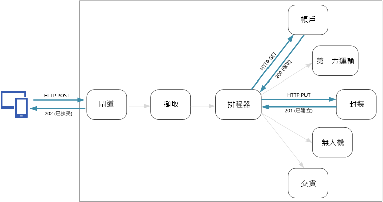
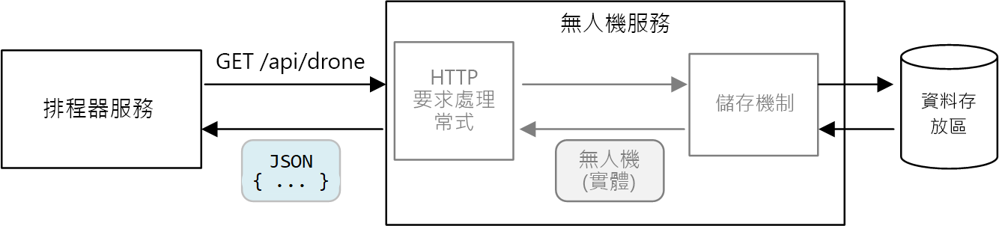
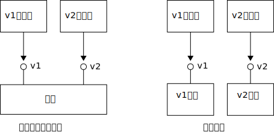

# <a name="designing-microservices-api-design"></a><span data-ttu-id="ccd7a-103">設計微服務：API 設計</span><span class="sxs-lookup"><span data-stu-id="ccd7a-103">Designing microservices: API design</span></span>

<span data-ttu-id="ccd7a-104">微服務架構中良好的 API 設計很重要，因為服務之間的所有資料交換都會透過訊息或 API 進行。</span><span class="sxs-lookup"><span data-stu-id="ccd7a-104">Good API design is important in a microservices architecture, because all data exchange between services happens either through messages or API calls.</span></span> <span data-ttu-id="ccd7a-105">API 必須很有效率才可避免建立[多對話 I/O](../antipatterns/chatty-io/index.md)。</span><span class="sxs-lookup"><span data-stu-id="ccd7a-105">APIs must be efficient to avoid creating [chatty I/O](../antipatterns/chatty-io/index.md).</span></span> <span data-ttu-id="ccd7a-106">因為服務是由獨立運作的小組所設計，所以 API 必須具備妥善定義的語意和版本控制配置，這樣更新時才不會中斷其他服務。</span><span class="sxs-lookup"><span data-stu-id="ccd7a-106">Because services are designed by teams working independently, APIs must have well-defined semantics and versioning schemes, so that updates don't break other services.</span></span>



<span data-ttu-id="ccd7a-107">請務必區分兩種 API 類型：</span><span class="sxs-lookup"><span data-stu-id="ccd7a-107">It's important to distinguish between two types of API:</span></span>

- <span data-ttu-id="ccd7a-108">用戶端應用程式呼叫的公用 API。</span><span class="sxs-lookup"><span data-stu-id="ccd7a-108">Public APIs that client applications call.</span></span> 
- <span data-ttu-id="ccd7a-109">服務間通訊所使用的後端 API。</span><span class="sxs-lookup"><span data-stu-id="ccd7a-109">Backend APIs that are used for interservice communication.</span></span>

<span data-ttu-id="ccd7a-110">這兩個使用案例有稍微不同的需求。</span><span class="sxs-lookup"><span data-stu-id="ccd7a-110">These two use cases have somewhat different requirements.</span></span> <span data-ttu-id="ccd7a-111">公用 API 必須與用戶端應用程式相容 (通常是指瀏覽器應用程式或原生行動裝置應用程式)。</span><span class="sxs-lookup"><span data-stu-id="ccd7a-111">A public API must be compatible with client applications, typically browser applications or native mobile applications.</span></span> <span data-ttu-id="ccd7a-112">大部分的情況下，這表示公用 API 會使用 REST over HTTP。</span><span class="sxs-lookup"><span data-stu-id="ccd7a-112">Most of the time, that means the public API will use REST over HTTP.</span></span> <span data-ttu-id="ccd7a-113">不過，對於後端 API，您需要將網路效能納入考量。</span><span class="sxs-lookup"><span data-stu-id="ccd7a-113">For the backend APIs, however, you need to take network performance into account.</span></span> <span data-ttu-id="ccd7a-114">視您服務的精細度而定，服務間通訊可能會導致大量網路流量。</span><span class="sxs-lookup"><span data-stu-id="ccd7a-114">Depending on the granularity of your services, interservice communication can result in a lot of network traffic.</span></span> <span data-ttu-id="ccd7a-115">服務可能會快速地變成 I/O 密集型 (I/O Bound)。</span><span class="sxs-lookup"><span data-stu-id="ccd7a-115">Services can quickly become I/O bound.</span></span> <span data-ttu-id="ccd7a-116">基於這個理由，諸如序列化速度和承載大小等考量變得更加重要。</span><span class="sxs-lookup"><span data-stu-id="ccd7a-116">For that reason, considerations such as serialization speed and payload size become more important.</span></span> <span data-ttu-id="ccd7a-117">可取代 REST over HTTP 的一些常用方案包括 gRPC、Apache Avro 和 Apache Thrift。</span><span class="sxs-lookup"><span data-stu-id="ccd7a-117">Some popular alternatives to using REST over HTTP include gRPC, Apache Avro, and Apache Thrift.</span></span> <span data-ttu-id="ccd7a-118">這些通訊協定可支援二進位序列化，且通常比 HTTP 更有效率。</span><span class="sxs-lookup"><span data-stu-id="ccd7a-118">These protocols support binary serialization and are generally more efficient than HTTP.</span></span>

## <a name="considerations"></a><span data-ttu-id="ccd7a-119">考量</span><span class="sxs-lookup"><span data-stu-id="ccd7a-119">Considerations</span></span>

<span data-ttu-id="ccd7a-120">以下是在選擇如何實作 API 時所要思考的一些事項。</span><span class="sxs-lookup"><span data-stu-id="ccd7a-120">Here are some things to think about when choosing how to implement an API.</span></span>

<span data-ttu-id="ccd7a-121">**REST 與 RPC**。</span><span class="sxs-lookup"><span data-stu-id="ccd7a-121">**REST vs RPC**.</span></span> <span data-ttu-id="ccd7a-122">請考慮使用 REST 樣式介面與 RPC 樣式介面之間的利弊。</span><span class="sxs-lookup"><span data-stu-id="ccd7a-122">Consider the tradeoffs between using a REST-style interface versus an RPC-style interface.</span></span>

- <span data-ttu-id="ccd7a-123">REST 可塑造資源，這可以是表達網域模型的自然方式。</span><span class="sxs-lookup"><span data-stu-id="ccd7a-123">REST models resources, which can be a natural way express your domain model.</span></span> <span data-ttu-id="ccd7a-124">它會根據 HTTP 指令動詞來定義統一介面，進而提升進化能力。</span><span class="sxs-lookup"><span data-stu-id="ccd7a-124">It defines a uniform interface based on HTTP verbs, which encourages evolvability.</span></span> <span data-ttu-id="ccd7a-125">就冪等性、副作用和回應碼而論，它都有妥善定義的語意。</span><span class="sxs-lookup"><span data-stu-id="ccd7a-125">It has well-defined semantics in terms of idempotency, side effects, and response codes.</span></span> <span data-ttu-id="ccd7a-126">而且會強制執行無狀態通訊，進而改善延展性。</span><span class="sxs-lookup"><span data-stu-id="ccd7a-126">And it enforces stateless communication, which improves scalability.</span></span> 

- <span data-ttu-id="ccd7a-127">RPC 更加以作業或命令為導向。</span><span class="sxs-lookup"><span data-stu-id="ccd7a-127">RPC is more oriented around operations or commands.</span></span> <span data-ttu-id="ccd7a-128">因為 RPC 介面看似區域方法呼叫，所以可能會導致您設計過多對話的 API。</span><span class="sxs-lookup"><span data-stu-id="ccd7a-128">Because RPC interfaces look like local method calls, it may lead you to design overly chatty APIs.</span></span> <span data-ttu-id="ccd7a-129">不過，這不表示 RPC 必須是多對話。</span><span class="sxs-lookup"><span data-stu-id="ccd7a-129">However, that doesn't mean RPC must be chatty.</span></span> <span data-ttu-id="ccd7a-130">這只是表示您在設計介面時必須小心翼翼。</span><span class="sxs-lookup"><span data-stu-id="ccd7a-130">It just means you need to use care when designing the interface.</span></span>

<span data-ttu-id="ccd7a-131">若為 RESTful 介面，最常見的選擇是使用 JSON 的 REST over HTTP。</span><span class="sxs-lookup"><span data-stu-id="ccd7a-131">For a RESTful interface, the most common choice is REST over HTTP using JSON.</span></span> <span data-ttu-id="ccd7a-132">若為 RPC 樣式介面，則有數個常用的架構，包括 gRPC、Apache Avro 和 Apache Thrift。</span><span class="sxs-lookup"><span data-stu-id="ccd7a-132">For an RPC-style interface, there are several popular frameworks, including gRPC, Apache  Avro, and Apache Thrift.</span></span>

<span data-ttu-id="ccd7a-133">**效率**。</span><span class="sxs-lookup"><span data-stu-id="ccd7a-133">**Efficiency**.</span></span> <span data-ttu-id="ccd7a-134">請從速度、記憶體和承載大小方面來考慮效率。</span><span class="sxs-lookup"><span data-stu-id="ccd7a-134">Consider efficiency in terms of speed, memory, and payload size.</span></span> <span data-ttu-id="ccd7a-135">通常以 gRPC 為基礎的介面比 REST over HTTP 快速。</span><span class="sxs-lookup"><span data-stu-id="ccd7a-135">Typically a gRPC-based interface is faster than REST over HTTP.</span></span>

<span data-ttu-id="ccd7a-136">**介面定義語言 (IDL)**。</span><span class="sxs-lookup"><span data-stu-id="ccd7a-136">**Interface definition language (IDL)**.</span></span> <span data-ttu-id="ccd7a-137">IDL 會用來定義 API 的方法、參數和傳回值。</span><span class="sxs-lookup"><span data-stu-id="ccd7a-137">An IDL is used to define the methods, parameters, and return values of an API.</span></span> <span data-ttu-id="ccd7a-138">IDL 可用來產生用戶端程式碼、序列化程式碼和 API 文件。</span><span class="sxs-lookup"><span data-stu-id="ccd7a-138">An IDL can be used to generate client code, serialization code, and API documentation.</span></span> <span data-ttu-id="ccd7a-139">IDL 也可供 API 測試工具 (例如 Postman) 使用。</span><span class="sxs-lookup"><span data-stu-id="ccd7a-139">IDLs can also be consumed by API testing tools such as Postman.</span></span> <span data-ttu-id="ccd7a-140">諸如 gRPC、Avro 和 Thrift 等架構會定義自己的 IDL 規格。</span><span class="sxs-lookup"><span data-stu-id="ccd7a-140">Frameworks such as gRPC, Avro, and Thrift define their own IDL specifications.</span></span> <span data-ttu-id="ccd7a-141">REST over HTTP 沒有標準的 IDL 格式，但 OpenAPI 是常見的選擇 (先前為 Swagger)。</span><span class="sxs-lookup"><span data-stu-id="ccd7a-141">REST over HTTP does not have a standard IDL format, but a common choice is OpenAPI (formerly Swagger).</span></span> <span data-ttu-id="ccd7a-142">您不使用正式定義語言，也可以建立 HTTP REST API，但之後會喪失程式碼產生和測試的優勢。</span><span class="sxs-lookup"><span data-stu-id="ccd7a-142">You can also create an HTTP REST API without using a formal definition language, but then you lose the benefits of code generation and testing.</span></span>

<span data-ttu-id="ccd7a-143">**序列化**。</span><span class="sxs-lookup"><span data-stu-id="ccd7a-143">**Serialization**.</span></span> <span data-ttu-id="ccd7a-144">如何透過連線將物件序列化？</span><span class="sxs-lookup"><span data-stu-id="ccd7a-144">How are objects serialized over the wire?</span></span> <span data-ttu-id="ccd7a-145">您可以選擇以文字為基礎的格式 (主要是 JSON) 和二進位格式 (例如通訊協定緩衝區)。</span><span class="sxs-lookup"><span data-stu-id="ccd7a-145">Options include text-based formats (primarily JSON) and binary formats such as protocol buffer.</span></span> <span data-ttu-id="ccd7a-146">二進位格式通常比以文字為基礎的格式快速。</span><span class="sxs-lookup"><span data-stu-id="ccd7a-146">Binary formats are generally faster than text-based formats.</span></span> <span data-ttu-id="ccd7a-147">不過，JSON 有互通性方面的優勢，因為大部分語言和架構都支援 JSON 序列化。</span><span class="sxs-lookup"><span data-stu-id="ccd7a-147">However, JSON has advantages in terms of interoperability, because most languages and frameworks support JSON serialization.</span></span> <span data-ttu-id="ccd7a-148">有些序列化格式需要固定的結構描述，而有些序列化格式需要編譯結構描述定義檔。</span><span class="sxs-lookup"><span data-stu-id="ccd7a-148">Some serialization formats require a fixed schema, and some require compiling a schema definition file.</span></span> <span data-ttu-id="ccd7a-149">在此情況下，您必須將這個步驟併入您的建置程序中。</span><span class="sxs-lookup"><span data-stu-id="ccd7a-149">In that case, you'll need to incorporate this step into your build process.</span></span> 

<span data-ttu-id="ccd7a-150">**架構和語言支援**。</span><span class="sxs-lookup"><span data-stu-id="ccd7a-150">**Framework and language support**.</span></span> <span data-ttu-id="ccd7a-151">幾乎每個架構和語言都支援 HTTP。</span><span class="sxs-lookup"><span data-stu-id="ccd7a-151">HTTP is supported in nearly every framework and language.</span></span> <span data-ttu-id="ccd7a-152">gRPC、Avro 和 Thrift 全都有 C++、C#、Java 和 Python 的程式庫。</span><span class="sxs-lookup"><span data-stu-id="ccd7a-152">gRPC, Avro, and Thrift all have libraries for C++, C#, Java, and Python.</span></span> <span data-ttu-id="ccd7a-153">Thrift 和 gRPC 也支援 Go。</span><span class="sxs-lookup"><span data-stu-id="ccd7a-153">Thrift and gRPC also support Go.</span></span> 

<span data-ttu-id="ccd7a-154">**相容性和互通性**。</span><span class="sxs-lookup"><span data-stu-id="ccd7a-154">**Compatibility and interoperability**.</span></span> <span data-ttu-id="ccd7a-155">如果您選擇 gRPC 之類的通訊協定，您可能需要公用 API 與後端之間的通訊協定轉譯層。</span><span class="sxs-lookup"><span data-stu-id="ccd7a-155">If you choose a protocol like gRPC, you may need a protocol translation layer between the public API and the back end.</span></span> <span data-ttu-id="ccd7a-156">[閘道](./gateway.md)可以執行該項功能。</span><span class="sxs-lookup"><span data-stu-id="ccd7a-156">A [gateway](./gateway.md) can perform that function.</span></span> <span data-ttu-id="ccd7a-157">如果您使用服務網格，請考慮有哪些通訊協定與服務網格相容。</span><span class="sxs-lookup"><span data-stu-id="ccd7a-157">If you are using a service mesh, consider which protocols are compatible with the service mesh.</span></span> <span data-ttu-id="ccd7a-158">例如，linkerd 有 HTTP、Thrift 和 gRPC 的內建支援。</span><span class="sxs-lookup"><span data-stu-id="ccd7a-158">For example, linkerd has built-in support for HTTP, Thrift, and gRPC.</span></span> 

<span data-ttu-id="ccd7a-159">我們的基準建議是選擇 REST over HTTP，除非您需要二進位通訊協定的效能優勢。</span><span class="sxs-lookup"><span data-stu-id="ccd7a-159">Our baseline recommendation is to choose REST over HTTP unless you need the performance benefits of a binary protocol.</span></span> <span data-ttu-id="ccd7a-160">REST over HTTP 不需要任何特殊程式庫。</span><span class="sxs-lookup"><span data-stu-id="ccd7a-160">REST over HTTP requires no special libraries.</span></span> <span data-ttu-id="ccd7a-161">其產生的結合程度最低，因為呼叫端不需要用戶端虛設常式來與服務進行通訊。</span><span class="sxs-lookup"><span data-stu-id="ccd7a-161">It creates minimal coupling, because callers don't need a client stub to communicate with the service.</span></span> <span data-ttu-id="ccd7a-162">有豐富的工具生態系統，可支援 RESTful HTTP 端點的結構描述定義、測試及監視。</span><span class="sxs-lookup"><span data-stu-id="ccd7a-162">There is rich ecosystems of tools to support schema definitions, testing, and monitoring of RESTful HTTP endpoints.</span></span> <span data-ttu-id="ccd7a-163">最後，HTTP 與瀏覽器用戶端相容，因此您不需要用戶端與後端之間的通訊協定轉譯層。</span><span class="sxs-lookup"><span data-stu-id="ccd7a-163">Finally, HTTP is compatible with browser clients, so you don't need a protocol translation layer between the client and the backend.</span></span> 

<span data-ttu-id="ccd7a-164">不過，如果您選擇 REST over HTTP，您應在開發程序初期進行效能和載入測試，以驗證該項目在您案例中的效能是否夠好。</span><span class="sxs-lookup"><span data-stu-id="ccd7a-164">However, if you choose REST over HTTP, you should do performance and load testing early in the development process, to validate whether it performs well enough for your scenario.</span></span>

## <a name="restful-api-design"></a><span data-ttu-id="ccd7a-165">RESTful API 設計</span><span class="sxs-lookup"><span data-stu-id="ccd7a-165">RESTful API design</span></span>

<span data-ttu-id="ccd7a-166">有許多資源可用來設計 RESTful API。</span><span class="sxs-lookup"><span data-stu-id="ccd7a-166">There are many resources for designing RESTful APIs.</span></span> <span data-ttu-id="ccd7a-167">以下是一些您會覺得有用的資源：</span><span class="sxs-lookup"><span data-stu-id="ccd7a-167">Here are some that you might find helpful:</span></span>

- [<span data-ttu-id="ccd7a-168">API 設計</span><span class="sxs-lookup"><span data-stu-id="ccd7a-168">API design</span></span>](../best-practices/api-design.md) 

- [<span data-ttu-id="ccd7a-169">API 實作</span><span class="sxs-lookup"><span data-stu-id="ccd7a-169">API implementation</span></span>](../best-practices/api-implementation.md) 

- [<span data-ttu-id="ccd7a-170">Microsoft REST API 指引</span><span class="sxs-lookup"><span data-stu-id="ccd7a-170">Microsoft REST API Guidelines</span></span>](https://github.com/Microsoft/api-guidelines)

<span data-ttu-id="ccd7a-171">以下是一些要記住的特定考量。</span><span class="sxs-lookup"><span data-stu-id="ccd7a-171">Here are some specific considerations to keep in mind.</span></span>

- <span data-ttu-id="ccd7a-172">請留意流失內部實作詳細資料或只是鏡映內部資料庫結構描述的 API。</span><span class="sxs-lookup"><span data-stu-id="ccd7a-172">Watch out for APIs that leak internal implementation details or simply mirror an internal database schema.</span></span> <span data-ttu-id="ccd7a-173">API 應塑造網域。</span><span class="sxs-lookup"><span data-stu-id="ccd7a-173">The API should model the domain.</span></span> <span data-ttu-id="ccd7a-174">這是服務之間的合約，而且最理想的狀況是只在新增功能時變更，而不只是因為您重構部分程式碼或正規化資料庫資料表而進行變更。</span><span class="sxs-lookup"><span data-stu-id="ccd7a-174">It's a contract between services, and ideally should only change when new functionality is added, not just because you refactored some code or normalized a database table.</span></span> 

- <span data-ttu-id="ccd7a-175">不同類型的用戶端 (例如行動裝置應用程式和桌面網頁瀏覽器) 可能需要不同的承載大小或互動模式。</span><span class="sxs-lookup"><span data-stu-id="ccd7a-175">Different types of client, such as mobile application and desktop web browser, may require different payload sizes or interaction patterns.</span></span> <span data-ttu-id="ccd7a-176">請考慮使用 [Backend for Frontend (BFF) 模式](../patterns/backends-for-frontends.md)來為每個用戶端建立個別的後端，以公開該用戶端的最佳介面。</span><span class="sxs-lookup"><span data-stu-id="ccd7a-176">Consider using the [Backends for Frontends pattern](../patterns/backends-for-frontends.md) to create separate backends for each client, that expose an optimal interface for that client.</span></span>

- <span data-ttu-id="ccd7a-177">對於有副作用的作業，請考慮讓其具有冪等性並當作 PUT 方法加以實作。</span><span class="sxs-lookup"><span data-stu-id="ccd7a-177">For operations with side effects, consider making them idempotent and implementing them as PUT methods.</span></span> <span data-ttu-id="ccd7a-178">這麼做就能夠安全重試，並可改善恢復功能。</span><span class="sxs-lookup"><span data-stu-id="ccd7a-178">That will enable safe retries and can improve resiliency.</span></span> <span data-ttu-id="ccd7a-179">[擷取與工作流程](./ingestion-workflow.md#idempotent-vs-non-idempotent-operations)和[服務間通訊](./interservice-communication.md)章節會更詳細討論這個問題。</span><span class="sxs-lookup"><span data-stu-id="ccd7a-179">The chapters [Ingestion and workflow](./ingestion-workflow.md#idempotent-vs-non-idempotent-operations) and [Interservice communication](./interservice-communication.md) discuss this issue in more detail.</span></span>

- <span data-ttu-id="ccd7a-180">HTTP 方法可以有非同步語意，其中方法會立即傳回回應，但服務不會同步完成此作業。</span><span class="sxs-lookup"><span data-stu-id="ccd7a-180">HTTP methods can have asynchronous semantics, where the method returns a response immediately, but the service carries out the operation asynchronously.</span></span> <span data-ttu-id="ccd7a-181">在此情況下，方法應傳回 [HTTP 202](https://www.w3.org/Protocols/rfc2616/rfc2616-sec10.html) 回應碼，表示已接受要求進行處理，但處理尚未完成。</span><span class="sxs-lookup"><span data-stu-id="ccd7a-181">In that case, the method should return an [HTTP 202](https://www.w3.org/Protocols/rfc2616/rfc2616-sec10.html) response code, which indicates the request was accepted for processing, but the processing is not yet completed.</span></span>

## <a name="mapping-rest-to-ddd-patterns"></a><span data-ttu-id="ccd7a-182">將 REST 對應至 DDD 模式</span><span class="sxs-lookup"><span data-stu-id="ccd7a-182">Mapping REST to DDD patterns</span></span>

<span data-ttu-id="ccd7a-183">實體、彙總及值物件等模式是設計用來對網域模型中的物件加上特定條件約束。</span><span class="sxs-lookup"><span data-stu-id="ccd7a-183">Patterns such as entity, aggregate, and value object are designed to place certain constraints on the objects in your domain model.</span></span> <span data-ttu-id="ccd7a-184">在許多 DDD 討論中，模式是使用物件導向 (OO) 語言概念 (像是建構函式或屬性 getter 和 setter) 來塑型。</span><span class="sxs-lookup"><span data-stu-id="ccd7a-184">In many discussions of DDD, the patterns are modeled using object-oriented (OO) language concepts like constructors or property getters and setters.</span></span> <span data-ttu-id="ccd7a-185">例如，「值物件」應不可變。</span><span class="sxs-lookup"><span data-stu-id="ccd7a-185">For example, *value objects* are supposed to be immutable.</span></span> <span data-ttu-id="ccd7a-186">在 OO 程式設計語言中，您就會在建構函式中指派值並且讓屬性變成唯讀，以強制執行這點：</span><span class="sxs-lookup"><span data-stu-id="ccd7a-186">In an OO programming language, you would enforce this by assigning the values in the constructor and making the properties read-only:</span></span>

```ts
export class Location {
    readonly latitude: number;
    readonly longitude: number;

    constructor(latitude: number, longitude: number) {
        if (latitude < -90 || latitude > 90) {
            throw new RangeError('latitude must be between -90 and 90');
        }
        if (longitude < -180 || longitude > 180) {
            throw new RangeError('longitude must be between -180 and 180');
        }
        this.latitude = latitude;
        this.longitude = longitude;
    }
}
```

<span data-ttu-id="ccd7a-187">在建置傳統的單體式應用程式時，這類編碼實務特別重要。</span><span class="sxs-lookup"><span data-stu-id="ccd7a-187">These sorts of coding practices are particularly important when building a traditional monolithic application.</span></span> <span data-ttu-id="ccd7a-188">以大型程式碼為基底，許多子系統可能會使用 `Location` 物件，所以物件務必強制執行正確的行為。</span><span class="sxs-lookup"><span data-stu-id="ccd7a-188">With a large code base, many subsystems might use the `Location` object, so it's important for the object to enforce correct behavior.</span></span> 

<span data-ttu-id="ccd7a-189">另一個範例是存放庫模式，可確保應用程式的其他部分不會直接讀取或寫入資料存放區：</span><span class="sxs-lookup"><span data-stu-id="ccd7a-189">Another example is the Repository pattern, which ensures that other parts of the application do not make direct reads or writes to the data store:</span></span>


<span data-ttu-id="ccd7a-190">不過，在微服務架構中，服務不會共用相同的程式碼基底，也不會共用資料存放區。</span><span class="sxs-lookup"><span data-stu-id="ccd7a-190">In a microservices architecture, however, services don't share the same code base and don't share data stores.</span></span> <span data-ttu-id="ccd7a-191">相反地，服務會透過 API 通訊。</span><span class="sxs-lookup"><span data-stu-id="ccd7a-191">Instead, they communicate through APIs.</span></span> <span data-ttu-id="ccd7a-192">舉例來說，排程器服務向無人機服務要求無人機的相關資訊。</span><span class="sxs-lookup"><span data-stu-id="ccd7a-192">Consider the case where the Scheduler service requests information about a drone from the Drone service.</span></span> <span data-ttu-id="ccd7a-193">無人機服務有自己的無人機內部模型 (透過程式碼表示)。</span><span class="sxs-lookup"><span data-stu-id="ccd7a-193">The Drone service has its internal model of a drone, expressed through code.</span></span> <span data-ttu-id="ccd7a-194">但排程器不會看到該模型。</span><span class="sxs-lookup"><span data-stu-id="ccd7a-194">But the Scheduler doesn't see that.</span></span> <span data-ttu-id="ccd7a-195">相反地，排程器會取回無人機實體的「表示法」&mdash;，或許是 HTTP 回應中的 JSON 物件。</span><span class="sxs-lookup"><span data-stu-id="ccd7a-195">Instead, it gets back a *representation* of the drone entity &mdash; perhaps a JSON object in an HTTP response.</span></span>



<span data-ttu-id="ccd7a-196">排程器服務無法修改無人機服務的內部模型，或寫入無人機服務的資料存放區。</span><span class="sxs-lookup"><span data-stu-id="ccd7a-196">The Scheduler service can't modify the Drone service's internal models, or write to the Drone service's data store.</span></span> <span data-ttu-id="ccd7a-197">這表示實作無人機服務的程式碼具有的公開介面區較小 (相較於傳統單體中的程式碼)。</span><span class="sxs-lookup"><span data-stu-id="ccd7a-197">That means the code that implements the Drone service has a smaller exposed surface area, compared with code in a traditional monolith.</span></span> <span data-ttu-id="ccd7a-198">如果無人機服務定義了「位置」類別，該類別的範圍會受到限制 &mdash; 沒有其他服務會直接取用該類別。</span><span class="sxs-lookup"><span data-stu-id="ccd7a-198">If the Drone service defines a Location class, the scope of that class is limited &mdash; no other service will directly consume the class.</span></span> 

<span data-ttu-id="ccd7a-199">基於這些原因，此指引並不注重編碼實務，因為編碼實務與戰略性 DDD 模式相關。</span><span class="sxs-lookup"><span data-stu-id="ccd7a-199">For these reasons, this guidance doesn't focus much on coding practices as they relate to the tactical DDD patterns.</span></span> <span data-ttu-id="ccd7a-200">但結果是您也可以透過 REST API 塑造許多 DDD 模式。</span><span class="sxs-lookup"><span data-stu-id="ccd7a-200">But it turns out that you can also model many of the DDD patterns through REST APIs.</span></span> 

<span data-ttu-id="ccd7a-201">例如︰</span><span class="sxs-lookup"><span data-stu-id="ccd7a-201">For example:</span></span>

- <span data-ttu-id="ccd7a-202">彙總會自然對應至 REST 中的「資源」。</span><span class="sxs-lookup"><span data-stu-id="ccd7a-202">Aggregates map naturally to *resources* in REST.</span></span> <span data-ttu-id="ccd7a-203">例如，傳遞彙總會經由傳遞 API 以資源形式公開。</span><span class="sxs-lookup"><span data-stu-id="ccd7a-203">For example, the Delivery aggregate would be exposed as a resource by the Delivery API.</span></span>

- <span data-ttu-id="ccd7a-204">彙總是一致性界限。</span><span class="sxs-lookup"><span data-stu-id="ccd7a-204">Aggregates are consistency boundaries.</span></span> <span data-ttu-id="ccd7a-205">彙總上的作業絕不會讓任何一個彙總處於不一致的狀態。</span><span class="sxs-lookup"><span data-stu-id="ccd7a-205">Operations on aggregates should never leave an aggregate in an inconsistent state.</span></span> <span data-ttu-id="ccd7a-206">因此，您應該避免建立允許用戶端操控彙總內部狀態的 API。</span><span class="sxs-lookup"><span data-stu-id="ccd7a-206">Therefore, you should avoid creating APIs that allow a client to manipulate the internal state of an aggregate.</span></span> <span data-ttu-id="ccd7a-207">反而要偏愛以資源形式公開彙總的粗糙 API。</span><span class="sxs-lookup"><span data-stu-id="ccd7a-207">Instead, favor coarse-grained APIs that expose aggregates as resources.</span></span>

- <span data-ttu-id="ccd7a-208">實體具有唯一的身分識別。</span><span class="sxs-lookup"><span data-stu-id="ccd7a-208">Entities have unique identities.</span></span> <span data-ttu-id="ccd7a-209">在 REST 中，資源有 URL 形式的唯一身分識別。</span><span class="sxs-lookup"><span data-stu-id="ccd7a-209">In REST, resources have unique identifiers in the form of URLs.</span></span> <span data-ttu-id="ccd7a-210">建立可對應至實體網域身分識別的資源 URL。</span><span class="sxs-lookup"><span data-stu-id="ccd7a-210">Create resource URLs that correspond to an entity's domain identity.</span></span> <span data-ttu-id="ccd7a-211">對用戶端而言，從 URL 到網域身分識別的對應可能不透明。</span><span class="sxs-lookup"><span data-stu-id="ccd7a-211">The mapping from URL to domain identity may be opaque to client.</span></span>

- <span data-ttu-id="ccd7a-212">從根實體瀏覽，即可觸達彙總的子實體。</span><span class="sxs-lookup"><span data-stu-id="ccd7a-212">Child entities of an aggregate can be reached by navigating from the root entity.</span></span> <span data-ttu-id="ccd7a-213">如果您遵循 [HATEOAS](https://en.wikipedia.org/wiki/HATEOAS) 原則，可以透過父實體表示法中的連結來觸達子實體。</span><span class="sxs-lookup"><span data-stu-id="ccd7a-213">If you follow [HATEOAS](https://en.wikipedia.org/wiki/HATEOAS) principles, child entities can be reached via links in the representation of the parent entity.</span></span> 

- <span data-ttu-id="ccd7a-214">因為值物件不可變，所以藉由取代整個值物件來執行更新。</span><span class="sxs-lookup"><span data-stu-id="ccd7a-214">Because value objects are immutable, updates are performed by replacing the entire value object.</span></span> <span data-ttu-id="ccd7a-215">在 REST 中，透過 PUT 或 PATCH 要求來實作更新。</span><span class="sxs-lookup"><span data-stu-id="ccd7a-215">In REST, implement updates through PUT or PATCH requests.</span></span> 

- <span data-ttu-id="ccd7a-216">存放庫可讓用戶端查詢、新增或移除集合中的物件，以及擷取基礎資料存放區的詳細資料。</span><span class="sxs-lookup"><span data-stu-id="ccd7a-216">A repository lets clients query, add, or remove objects in a collection, abstracting the details of the underlying data store.</span></span> <span data-ttu-id="ccd7a-217">在 REST 中，集合可以是與眾不同的資源，具有可供查詢集合或將實體新增至集合的方法。</span><span class="sxs-lookup"><span data-stu-id="ccd7a-217">In REST, a collection can be a distinct resource, with methods for querying the collection or adding new entities to the collection.</span></span>

<span data-ttu-id="ccd7a-218">當您設計 API 時，請思考 API 如何表示網域模型 (而不只是模型內的資料)，但也要考量資料的商務作業和條件約束。</span><span class="sxs-lookup"><span data-stu-id="ccd7a-218">When you design your APIs, think about how they express the domain model, not just the data inside the model, but also the business operations and the constraints on the data.</span></span>

| <span data-ttu-id="ccd7a-219">DDD 概念</span><span class="sxs-lookup"><span data-stu-id="ccd7a-219">DDD concept</span></span> | <span data-ttu-id="ccd7a-220">REST 對等項目</span><span class="sxs-lookup"><span data-stu-id="ccd7a-220">REST equivalent</span></span> | <span data-ttu-id="ccd7a-221">範例</span><span class="sxs-lookup"><span data-stu-id="ccd7a-221">Example</span></span> | 
|-------------|-----------------|---------|
| <span data-ttu-id="ccd7a-222">彙總</span><span class="sxs-lookup"><span data-stu-id="ccd7a-222">Aggregate</span></span> | <span data-ttu-id="ccd7a-223">資源</span><span class="sxs-lookup"><span data-stu-id="ccd7a-223">Resource</span></span> | `{ "1":1234, "status":"pending"... }` | 
| <span data-ttu-id="ccd7a-224">身分識別</span><span class="sxs-lookup"><span data-stu-id="ccd7a-224">Identity</span></span> | <span data-ttu-id="ccd7a-225">URL</span><span class="sxs-lookup"><span data-stu-id="ccd7a-225">URL</span></span> | `https://delivery-service/deliveries/1` |
| <span data-ttu-id="ccd7a-226">子實體</span><span class="sxs-lookup"><span data-stu-id="ccd7a-226">Child entities</span></span> | <span data-ttu-id="ccd7a-227">連結</span><span class="sxs-lookup"><span data-stu-id="ccd7a-227">Links</span></span> | `{ "href": "/deliveries/1/confirmation" }` |
| <span data-ttu-id="ccd7a-228">更新值物件</span><span class="sxs-lookup"><span data-stu-id="ccd7a-228">Update value objects</span></span> | <span data-ttu-id="ccd7a-229">PUT 或 PATCH</span><span class="sxs-lookup"><span data-stu-id="ccd7a-229">PUT or PATCH</span></span> | `PUT https://delivery-service/deliveries/1/dropoff` |
| <span data-ttu-id="ccd7a-230">存放庫</span><span class="sxs-lookup"><span data-stu-id="ccd7a-230">Repository</span></span> | <span data-ttu-id="ccd7a-231">集合</span><span class="sxs-lookup"><span data-stu-id="ccd7a-231">Collection</span></span> | `https://delivery-service/deliveries?status=pending` |


## <a name="api-versioning"></a><span data-ttu-id="ccd7a-232">API 版本控制</span><span class="sxs-lookup"><span data-stu-id="ccd7a-232">API versioning</span></span>

<span data-ttu-id="ccd7a-233">API 是服務與該服務用戶端或取用者之間的合約。</span><span class="sxs-lookup"><span data-stu-id="ccd7a-233">An API is a contract between a service and clients or consumers of that service.</span></span> <span data-ttu-id="ccd7a-234">如果 API 變更，則有可能中斷相依於 API 的用戶端 (不論是外部用戶端或其他微服務)。</span><span class="sxs-lookup"><span data-stu-id="ccd7a-234">If an API changes, there is a risk of breaking clients that depend on the API, whether those are external clients or other microservices.</span></span> <span data-ttu-id="ccd7a-235">因此，最好將 API 變更數目降至最低。</span><span class="sxs-lookup"><span data-stu-id="ccd7a-235">Therefore, it's a good idea to minimize the number of API changes that you make.</span></span> <span data-ttu-id="ccd7a-236">通常，基礎實作中的變更不需要任何 API 變更。</span><span class="sxs-lookup"><span data-stu-id="ccd7a-236">Often, changes in the underlying implementation don't require any changes to the API.</span></span> <span data-ttu-id="ccd7a-237">不過，實際上在某個時間點，您會想要新增需要變更現有 API 的新功能。</span><span class="sxs-lookup"><span data-stu-id="ccd7a-237">Realistically, however, at some point you will want to add new features or new capabilities that require changing an existing API.</span></span>

<span data-ttu-id="ccd7a-238">可能的話，讓 API 變更具有回溯相容性。</span><span class="sxs-lookup"><span data-stu-id="ccd7a-238">Whenever possible, make API changes backward compatible.</span></span> <span data-ttu-id="ccd7a-239">例如，避免從模型中移除欄位，因為這可能會使預期有該欄位的用戶端中斷。</span><span class="sxs-lookup"><span data-stu-id="ccd7a-239">For example, avoid removing a field from a model, because that can break clients that expect the field to be there.</span></span> <span data-ttu-id="ccd7a-240">新增欄位不會中斷相容性，因為用戶端應忽略回應中他們所不了解的欄位。</span><span class="sxs-lookup"><span data-stu-id="ccd7a-240">Adding a field does not break compatibility, because clients should ignore any fields they don't understand in a response.</span></span> <span data-ttu-id="ccd7a-241">不過，服務必須處理要求中較舊用戶端略過新欄位的情況。</span><span class="sxs-lookup"><span data-stu-id="ccd7a-241">However, the service must handle the case where an older client omits the new field in a request.</span></span> 

<span data-ttu-id="ccd7a-242">在您的 API 合約中支援版本控制。</span><span class="sxs-lookup"><span data-stu-id="ccd7a-242">Support versioning in your API contract.</span></span> <span data-ttu-id="ccd7a-243">如果您引入重大 API 變更，請引入新的 API 版本。</span><span class="sxs-lookup"><span data-stu-id="ccd7a-243">If you introduce a breaking API change, introduce a new API version.</span></span> <span data-ttu-id="ccd7a-244">繼續支援前一個版本，並且讓用戶端選取要呼叫哪個版本。</span><span class="sxs-lookup"><span data-stu-id="ccd7a-244">Continue to support the previous version, and let clients select which version to call.</span></span> <span data-ttu-id="ccd7a-245">有好幾種方法可執行這項操作。</span><span class="sxs-lookup"><span data-stu-id="ccd7a-245">There are a couple of ways to do this.</span></span> <span data-ttu-id="ccd7a-246">其中一種方法是只要在相同服務中公開兩個版本。</span><span class="sxs-lookup"><span data-stu-id="ccd7a-246">One is simply to expose both versions in the same service.</span></span> <span data-ttu-id="ccd7a-247">另一個選項是並排執行服務的兩個版本，並根據 HTTP 路由規則，將要求路由至其中一個或另一個版本。</span><span class="sxs-lookup"><span data-stu-id="ccd7a-247">Another option is to run two versions of the service side-by-side, and route requests to one or the other version, based on HTTP routing rules.</span></span> 



<span data-ttu-id="ccd7a-248">支援多個版本會產生開發人員時間、測試和操作額外負荷方面的成本。</span><span class="sxs-lookup"><span data-stu-id="ccd7a-248">There's a cost to supporting multiple versions, in terms of developer time, testing, and operational overhead.</span></span> <span data-ttu-id="ccd7a-249">因此，最好盡快淘汰舊的版本。</span><span class="sxs-lookup"><span data-stu-id="ccd7a-249">Therefore, it's good to deprecate old versions as quickly as possible.</span></span> <span data-ttu-id="ccd7a-250">若為內部 API，擁有該 API 的小組可與其他小組合作，協助他們遷移到新的版本。</span><span class="sxs-lookup"><span data-stu-id="ccd7a-250">For internal APIs, the team that owns the API can work with other teams to help them migrate to the new version.</span></span> <span data-ttu-id="ccd7a-251">這時擁有跨小組控管程序很有用。</span><span class="sxs-lookup"><span data-stu-id="ccd7a-251">This is when having a cross-team governance process is useful.</span></span> <span data-ttu-id="ccd7a-252">若為外部 (公用) API，可能更加難以淘汰 API 版本，特別是在 API 由第三方或原生用戶端應用程式取用時。</span><span class="sxs-lookup"><span data-stu-id="ccd7a-252">For external (public) APIs, it can be harder to deprecate an API version, especially if the API is consumed by third parties or by native client applications.</span></span> 

<span data-ttu-id="ccd7a-253">當服務實作變更時，以版本標記變更很實用。</span><span class="sxs-lookup"><span data-stu-id="ccd7a-253">When a service implementation changes, it's useful to tag the change with a version.</span></span> <span data-ttu-id="ccd7a-254">針對錯誤進行疑難排解時，版本會提供重要資訊。</span><span class="sxs-lookup"><span data-stu-id="ccd7a-254">The version provides important information when troubleshooting errors.</span></span> <span data-ttu-id="ccd7a-255">這對於根本原因分析很有幫助，可精確得知已呼叫哪個服務版本。</span><span class="sxs-lookup"><span data-stu-id="ccd7a-255">It can be very helpful for root cause analysis to know exactly which version of the service was called.</span></span> <span data-ttu-id="ccd7a-256">請考慮對服務版本使用[語意版本設定](https://semver.org/)。</span><span class="sxs-lookup"><span data-stu-id="ccd7a-256">Consider using [semantic versioning](https://semver.org/) for service versions.</span></span> <span data-ttu-id="ccd7a-257">語意版本設定使用 *MAJOR.MINOR.PATCH* 格式。</span><span class="sxs-lookup"><span data-stu-id="ccd7a-257">Semantic versioning uses a *MAJOR.MINOR.PATCH* format.</span></span> <span data-ttu-id="ccd7a-258">不過，用戶端只能依照主要版本號碼選取 API，或如果次要版本之間有重大 (但不間斷) 變更，則可能依照次要版本選取 API。</span><span class="sxs-lookup"><span data-stu-id="ccd7a-258">However, clients should only select an API by the major version number, or possibly the minor version if there are significant (but non-breaking) changes between minor versions.</span></span> <span data-ttu-id="ccd7a-259">換句話說，用戶端在第 1 版和第 2 版 API 之間選取很合理，但選取 2.1.3 版就不合理。</span><span class="sxs-lookup"><span data-stu-id="ccd7a-259">In other words, it's reasonable for clients to select between version 1 and version 2 of an API, but not to select version 2.1.3.</span></span> <span data-ttu-id="ccd7a-260">如果您允許此層級的精細度，您可能有必須支援版本擴散的風險。</span><span class="sxs-lookup"><span data-stu-id="ccd7a-260">If you allow that level of granularity, you risk having to support a proliferation of versions.</span></span> 

<span data-ttu-id="ccd7a-261">如需 API 版本控制的進一步討論，請參閱 [RESTful Web API 版本控制](../best-practices/api-design.md#versioning-a-restful-web-api)。</span><span class="sxs-lookup"><span data-stu-id="ccd7a-261">For further discussion of API versioning, see [Versioning a RESTful web API](../best-practices/api-design.md#versioning-a-restful-web-api).</span></span>

> [!div class="nextstepaction"]
> [<span data-ttu-id="ccd7a-262">擷取與工作流程</span><span class="sxs-lookup"><span data-stu-id="ccd7a-262">Ingestion and workflow</span></span>](./ingestion-workflow.md)