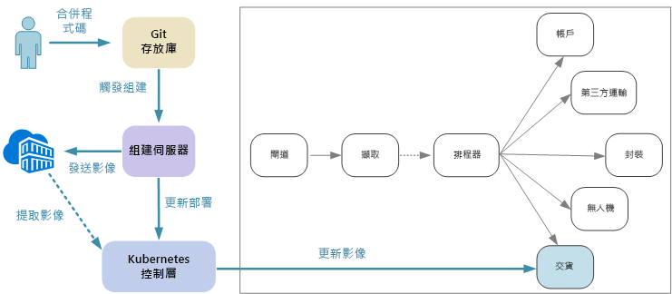
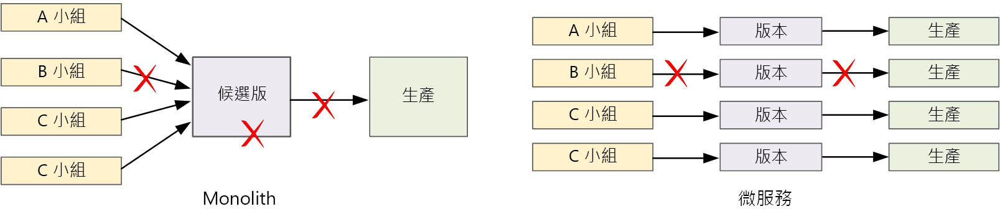

# 設計微服務：持續整合Designing microservices: Continuous integration

持續整合與持續傳遞 (CI/CD) 是透過微服務獲得成功的關鍵需求。Continuous integration and continuous delivery (CI/CD) are a key requirement for achieving success with microservices. 若沒有完善的 CI/CD 程序，您就無法達到微服務所承諾的靈活度。Without a good CI/CD process, you will not achieve the agility that microservices promise. 微服務的某些 CI/CD 挑戰是來自於各種服務的多個程式碼基底及各式各樣的建置環境。Some of the CI/CD challenges for microservices arise from having multiple code bases and heterogenous build environments for the various services. 本章描述一些挑戰，並建議可解決問題的一些方法。This chapter describes the challenges and recommends some approaches to the problem.

更快速的發行週期是採用微服務架構的最大原因之一。Faster release cycles are one of the biggest reasons to adopt a microservices architecture. 

純粹單體式應用程式中有一個建置管線，其輸出是應用程式可執行檔。In a purely monolithic application, there is a single build pipeline whose output is the application executable. 所有開發工作都會饋送到此管線中。All development work feeds into this pipeline. 如果發現高優先順序的錯誤 (bug)，則必須整合、測試及發行修正程式，這可能會延遲新功能的發行。If a high-priority bug is found, a fix must be integrated, tested, and published, which can delay the release of new features. 您的確可藉由擁有構造良好的模組以及使用功能分支來緩和這些問題，進而將程式碼變更的影響降到最低。It's true that you can mitigate these problems by having well-factored modules and using feature branches to minimize the impact of code changes. 但隨著應用程式日益複雜，並新增了更多功能，單體的發行程序就變得更加脆弱並可能中斷。But as the application grows more complex, and more features are added, the release process for a monolith tends to become more brittle and likely to break. 

根據微服務的原理，絕不會有每個小組都必須排隊的冗長發行序列。Following the microservices philosophy, there should never be a long release train where every team has to get in line. 建立服務 "A" 的小組可以隨時發行更新，而不需等待服務 "B" 的變更來進行合併、測試和部署。The team that builds service "A" can release an update at any time, without waiting for changes in service "B" to be merged, tested, and deployed. CI/CD 程序是達成此目的的關鍵。The CI/CD process is critical to making this possible. 發行管線必須自動化且高度可靠，才能將部署更新的風險降到最低。Your release pipeline must be automated and highly reliable, so that the risks of deploying updates are minimized. 如果您是每天或一天多次地對生產環境進行發行，則退回或服務中斷的狀況必定要非常罕見。If you are releasing to production daily or multiple times a day, regressions or service disruptions must be very rare. 同時，如果部署了錯誤的更新，您必須有可靠的方法能快速復原或向前復原至舊版的服務。At the same time, if a bad update does get deployed, you must have a reliable way to quickly roll back or roll forward to a previous version of a service.

當我們談論 CI/CD 時，我們實際會談論數個相關程序：持續整合、持續傳遞和持續部署。When we talk about CI/CD, we are really talking about several related processes: Continuous integration, continuous delivery, and continuous deployment.

- 持續整合意味著程式碼變更經常會併入主要分支中，使用自動化建置和測試程序來確保主要分支中的程式碼一律具有良好的生產品質。Continuous integration means that code changes are frequently merged into the main branch, using automated build and test processes to ensure that  code in the main branch is always production-quality.

- 持續傳遞意味著傳遞 CI 程序的程式碼變更會自動發佈到類似生產的環境。Continuous delivery means that code changes that pass the CI process are automatically published to a production-like environment. 部署至即時生產環境可能需要手動核准，除此之外皆是自動化作業。Deployment into the live production environment may require manual approval, but is otherwise automated. 這麼做的目的是，您的程式碼應該總是「準備好」部署到生產環境。The goal is that your code should always be *ready* to deploy into production.

- 持續部署意味著傳遞 CI/CD 程序的程式碼變更會自動發佈到生產環境中。Continuous deployment means that code changes that pass the CI/CD process are automatically deployed into production.

在 Kubernetes 和微服務的內容中，CI 階段涉及建立和測試容器映像，並將這些映像推送到容器登錄。In the context of Kubernetes and microservices, the CI stage is concerned with building and testing container images, and pushing those images to a container registry. 在部署階段中，pod 規格會進行更新，以取得最新的生產映像。In the deployment stage, pod specs are updated to pick up the latest production image.

## 挑戰Challenges

- **許多小型獨立的程式碼基底**。**Many small independent code bases**. 每個小組需利用自己的建置管線，負責建立自己的服務。Each team is responsible for building its own service, with its own build pipeline. 在某些組織中，小組可以使用不同的程式碼存放庫。In some organizations, teams may use separate code repositories. 這可能會導致一個情況，就是如何建置系統的知識已散佈到各小組，但組織中沒有人知道如何部署整個應用程式。This could lead to a situation where the knowledge of how to build the system is spread across teams, and nobody in the organization knows how to deploy the entire application. 例如，如果您需要快速部署到新的叢集，災害復原案例會發生什麼情況？For example, what happens in a disaster recovery scenario, if you need to quickly deploy to a new cluster?   

- **多個語言和架構**。**Multiple languages and frameworks**. 如果每個小組都使用自己的各項技術，則可能很難建立適用於整個組織的單一建置程序。With each team using its own mix of technologies, it can be difficult to create a single build process that works across the organization. 建置程序必須有足夠的彈性，每個小組才能針對其選擇的語言或架構進行調整。The build process must be flexible enough that every team can adapt it for their choice of language or framework. 

- **整合及負載測試**。**Integration and load testing**. 如果小組依照自己的步調發行更新，則要設計強固的端對端測試可能具有挑戰性，特別是在服務相依於其他服務時。With teams releasing updates at their own pace, it can be challenging to design robust end-to-end testing, especially when services have dependencies on other services. 此外，執行完整生產叢集可能很耗費資源，因此，如果只作為測試用，不太可能每個小組都能夠以生產規模執行自己的完整叢集。Moreover, running a full production cluster can be expensive, so it's unlikely that every team will be able to run its own full cluster at production scales, just for testing. 

- **發行管理**。**Release management**. 每個小組應該都要能夠將更新部署到生產環境。Every team should have the ability to deploy an update to production. 但這不表示每個小組成員都有權限這麼做。That doesn't mean that every team member has permissions to do so. 不過，擁有集中的發行管理員角色可能會降低部署的速度。But having a centralized Release Manager role can reduce the velocity of deployments. 因此您的 CI/CD 程序愈加自動化和可靠，中央授權的需求就愈低。The more that your CI/CD process is automated and reliable, the less there should be a need for a central authority. 儘管如此，您可能使用不同的原則來發行主要功能更新和次要錯誤修正。That said, you might have different policies for releasing major feature updates versus minor bug fixes. 分散管理並不表示就是零治理。Being decentralized does not mean there should be zero governance.

- **容器映像版本控制**。**Container image versioning**. 在開發和測試週期內，CI/CD 程序將會建立許多容器映像。During the development and test cycle, the CI/CD process will build many container images. 其中只有一些映像是發行候選項目，然而只有其中一些發行候選項目會推送到生產環境中。Only some of those are candidates for release, and then only some of those release candidates will get pushed into production. 您應該有明確的版本控制策略，好讓您知道哪些映像目前已部署至生產環境，而且可以視需要復原至先前的版本。You should have a clear versioning strategy, so that you know which images are currently deployed to production, and can roll back to a previous version if necessary. 

- **服務更新**。**Service updates**. 當您將服務更新為新版本時，其不得中斷與其相依的其他服務。When you update a service to a new version, it shouldn't break other services that depend on it. 如果您執行輪流更新，則會有一段時間執行混合的版本。If you do a rolling update, there will be a period of time when a mix of versions is running. 
 
這些挑戰反映出主要壓力。These challenges reflect a fundamental tension. 一方面，小組必須盡可能獨立運作。On the one hand, teams need to work as independently as possible. 另一方面則需要一些協調，以便單一人員執行一些工作，例如執行整合測試、將整個解決方案重新部署到新叢集，或復原錯誤的更新。On the other hand, some coordination is needed so that a single person can do tasks like running an integration test, redeploying the entire solution to a new cluster, or rolling back a bad update. 
 
## 微服務的 CI/CD 方法CI/CD approaches for microservices

每個服務小組最好能將其建置環境容器化。It's a good practice for every service team to containerize their build environment. 此容器應具有為其服務建立程式碼成品所需的所有建置工具。This container should have all of the build tools necessary to build the code artifacts for their service. 您通常可以找到您語言和架構的正式 Docker 映像。Often you can find an official Docker image for your language and framework. 然後您可以使用 `docker run` 或 Docker Compose 來執行組建。Then you can use `docker run` or Docker Compose to run the build. 

使用此方法時，設定新建置環境是件小事。With this approach, it's trivial to set up a new build environment. 為您建立程式碼的開發人員並不需要安裝一組建置工具，只要執行容器映像即可。A developer who wants to build your code doesn't need to install a set of build tools, but simply runs the container image. 可能更重要的是，您的組建伺服器可設定為執行相同的動作。Perhaps more importantly, your build server can be configured to do the same thing. 這樣一來，您就不需要將這些工具安裝到組建伺服器，或管理衝突的工具版本。That way, you don't need to install those tools onto the build server, or manage conflicting versions of tools. 

進行本機開發和測試時，可使用 Docker 在容器內執行服務。For local development and testing, use Docker to run the service inside a container. 在此程序中，您可能需要執行其他容器，因為這些容器具有本機測試所需的模擬服務或測試資料庫。As part of this process, you may need to run other containers that have mock services or test databases needed for local testing. 您可以使用 Docker Compose 來協調這些容器，或使用 Minikube 在本機執行 Kubernetes。You could use Docker Compose to coordinate these containers, or use Minikube to run Kubernetes locally. 

備妥程式碼時，發起提取要求並且併入主檔中。When the code is ready, open a pull request and merge into master. 這會在組建伺服器上啟動一項作業：This will start a job on the build server:

1. 建置程式碼資產。Build the code assets. 
2. 對程式碼執行單元測試。Run unit tests against the code.
3. 建置容器映像。Build the container image.
4. 在執行中的容器上執行功能測試，以測試容器映像。Test the container image by running functional tests on a running container. 此步驟可以攔截 Docker 檔案中的錯誤，例如錯誤的進入點。This step can catch errors in the Docker file, such as a bad entry point.
5. 將映像推送至容器登錄。Push the image to a container registry.
6. 使用新的映像來更新測試叢集，以執行整合測試。Update the test cluster with the new image to run integration tests.

當映像準備好移入生產環境時，請視需要更新部署檔案，以指定最新的映像，包括任何 Kubernetes 設定檔。When the image is ready to go into production, update the deployment files as needed to specify the latest image, including any Kubernetes configuration files. 然後將更新套用到生產叢集。Then apply the update to the production cluster.

以下是讓部署更可靠的一些建議：Here are some recommendations for making deployments more reliable:
 
- 為部署到叢集 (Pod、服務等等) 的資源，定義容器標籤、版本控制和命名慣例的組織通用慣例。Define organization-wide conventions for container tags, versioning, and naming conventions for resources deployed to the cluster (pods, services, and so on). 這可讓您更輕鬆地診斷部署問題。That can make it easier to diagnose deployment issues. 

- 建立兩個不同的容器登錄，一個用於開發/測試，一個用於生產。Create two separate container registries, one for development/testing and one for production. 在您準備好將映像部署到生產環境之前，請勿將它推送到生產登錄。Don't push an image to the production registry until you're ready to deploy it into production. 如果您結合這種做法與容器映像的語意版本控制，就能盡量避免意外部署到未獲准發行的版本。If you combine this practice with semantic versioning of container images, it can reduce the chance of accidentally deploying a version that wasn't approved for release.

## 更新服務Updating services

有各種策略可用來更新已在生產環境中的服務。There are various strategies for updating a service that's already in production. 我們在此討論三個常見的選項：輪流更新、藍綠色部署和 Canary 版本。Here we discuss three common options: Rolling update, blue-green deployment, and canary release.

### 輪流更新Rolling update 

在輪流更新中，您會部署新的服務執行個體，而新的執行個體會立刻開始接收要求。In a rolling update, you deploy new instances of a service, and the new instances start receiving requests right away. 隨著新執行個體的出現，系統會移除先前的執行個體。As the new instances come up, the previous instances are removed.

當您更新部署的 pod 規格時，輪流更新是 Kubernetes 中的預設行為。Rolling updates are the default behavior in Kubernetes when you update the pod spec for a Deployment. 部署控制器會為已更新的 pod 建立新的 ReplicaSet。The Deployment controller creates a new ReplicaSet for the updated pods. 然後它會相應增加新的 ReplicaSet，同時相應減少舊的 ReplicaSet，以維持所需的複本計數。Then it scales up the new ReplicaSet while scaling down the old one, to maintain the desired replica count. 在新的 pod 備妥之前，舊的 pod 不會遭到刪除。It doesn't delete old pods until the new ones are ready. Kubernetes 會保存更新歷程記錄，因此您可以視需要使用 kubectl 來復原更新。Kubernetes keeps a history of the update, so you can use kubectl to roll back an update if needed. 

如果您的服務執行長時間的啟動工作，您可以定義整備探查。If your service performs a long startup task, you can define a readiness probe. 當容器準備好開始接收流量時，就會回報整備探查。The readiness probe reports when the container is ready to start receiving traffic. 在探查回報成功之前，Kubernetes 不會將流量傳送至 pod。Kubernetes won't send traffic to the pod until the probe reports success. 

輪流更新的其中一項挑戰就是在更新過程中，新舊版本會混合執行及接收流量。One challenge of rolling updates is that during the update process, a mix of old and new versions are running and receiving traffic. 在這段期間，所有要求會路由傳送至任一個版本。During this period, any request could get routed to either of the two versions. 根據兩個版本之間的變動範圍而定，這或許可能會造成問題。That may or may not cause problems, depending on the scope of the changes between the two versions. 

### 藍綠部署Blue-green deployment

在藍綠色部署中，您可以一起部署新版本與前一個版本。In a blue-green deployment, you deploy the new version alongside the previous version. 在您驗證新版本之後，立刻將所有流量從前一個版本切換到新版本。After you validate the new version, you switch all traffic at once from the previous version to the new version. 切換之後，您可監視應用程式是否有任何問題。After the switch, you monitor the application for any problems. 如果發生錯誤，您可以換回舊版本。If something goes wrong, you can swap back to the old version. 假設沒有任何問題，您可以刪除舊版本。Assuming there are no problems, you can delete the old version.

使用更傳統的單體式或多層式架構應用程式，藍綠部署通常是指佈建兩個相同的環境。With a more traditional monolithic or N-tier application, blue-green deployment generally meant provisioning two identical environments. 您會將新版本部署到預備環境，然後將用戶端流量重新導向至預備環境 &mdash; 例如，藉由交換 VIP 位址。You would deploy the new version to a staging environment, then redirect client traffic to the staging environment &mdash; for example, by swapping VIP addresses.

在 Kubernetes 中，您不需佈建個別的叢集來進行藍綠部署。In Kubernetes, you don't need to provision a separate cluster to do blue-green deployments. 您反而可以利用選取器。Instead, you can take advantage of selectors. 利用新的 pod 規格和一組不同的標籤，建立新的部署資源。Create a new Deployment resource with a new pod spec and a different set of labels. 建立此部署，而不需刪除先前的部署，或修改指向它的服務。Create this deployment, without deleting the previous deployment or modifying the service that points to it. 當新的 pod 執行時，您可以更新服務的選取器，以符合新的部署。Once the new pods are running, you can update the service's selector to match the new deployment. 

藍綠部署的優點是服務可同時切換所有 pod。An advantage of blue-green deployments is that the service switches all the pods at the same time. 更新此服務後，所有新的要求都會路由傳送至新的版本。After the service is updated, all new requests get routed to the new version. 但有一個缺點，在更新期間您會對服務執行兩倍的 pod 數目 (目前和下一個)。One drawback is that during the update, you are running twice as many pods for the service (current and next). 如果 pod 需要大量 CPU 或記憶體資源，您可能需要暫時相應放大叢集，以處理資源耗用。If the pods require a lot of CPU or memory resources, you may need to scale out the cluster temporarily to handle the resource consumption. 

### Canary 版本Canary release

在 Canary 版本中，您會向少數用戶端推出更新的版本。In a canary release, you roll out an updated version to a small number of clients. 然後您會先監視新服務的行為，然後再向所有的用戶端推出該服務。Then you monitor the behavior of the new service before rolling it out to all clients. 這可讓您以控制方式進行緩慢推出、觀察實際資料，以及在所有客戶受影響之前找出問題。This lets you do a slow rollout in a controlled fashion, observe real data, and spot problems before all customers are affected.

Canary 版本的管理比藍綠或輪流更新更複雜，因為您必須動態將要求路由傳送到不同的服務版本。A canary release is more complex to manage than either blue-green or rolling update, because you must dynamically route requests to different versions of the service. 在 Kubernetes 中，您可以將服務設定為橫跨兩個複本集 (每個版本各一個) 並手動調整複本計數。In Kubernetes, you can configure a Service to span two replica sets (one for each version) and adjust the replica counts manually. 不過，此方法會因為 Kubernetes 在 pod 間進行平衡負載的方式而顯得相當粗糙。However, this approach is rather coarse-grained, because of the way Kubernetes load balances across pods. 例如，如果總計有十個複本，您只可透過 10% 的增量轉換流量。For example, if you have a total of ten replicas, you can only shift traffic in 10% increments. 如果您使用服務網格，則可以使用服務網格路由規則，實作更精緻的 Canary 版本策略。If you are using a service mesh, you can use the service mesh routing rules to implement a more sophisticated canary release strategy. 以下是一些可能有所幫助的資源：Here are some resources that may be helpful:

- 沒有服務網格的 Kubernetes：[Canary 部署](https://kubernetes.io/docs/concepts/cluster-administration/manage-deployment/#canary-deployments)Kubernetes without service mesh: [Canary deployments](https://kubernetes.io/docs/concepts/cluster-administration/manage-deployment/#canary-deployments)
- Linkerd：[動態要求路由](https://linkerd.io/features/routing/)Linkerd: [Dynamic request routing](https://linkerd.io/features/routing/)
- Istio：[使用 Istio 的 Canary 部署](https://istio.io/blog/canary-deployments-using-istio.html)Istio: [Canary Deployments using Istio](https://istio.io/blog/canary-deployments-using-istio.html)

## 結論Conclusion

近年來，產業經歷大幅變動，從建置「記錄系統」移向建置「協作系統」。In recent years, there has been a sea change in the industry, a movement from building *systems of record* to building *systems of engagement*.

記錄系統是傳統的後台資料管理應用程式。Systems of record are traditional back-office data management applications. 這些系統的核心通常有 RDBMS，而這是單一資料來源。At the heart of these systems there often sits an RDBMS that is the single source of truth. 「協作系統」一詞出自 Geoffrey Moore 在其 2011 年發表的 Systems of Engagement and the Future of Enterprise IT 論文中。The term "system of engagement" is credited to Geoffrey Moore, in his 2011 paper *Systems of Engagement and the Future of Enterprise IT*. 協作系統是著重於溝通和共同作業的應用程式。Systems of engagement are applications focused on communication and collaboration. 這類系統可即時聯繫人員。They connect people in real time. 必須全天候可供使用。They must be available 24/7. 定期引進新功能，且應用程式不需離線。New features are introduced regularly without taking the application offline. 因此，使用者的期望更高，且對於非預期的延遲或停機更沒有耐心。Users expect more and are less patient of unexpected delays or downtime.

在取用者領域中，較佳的使用者體驗可能帶來可衡量的商務價值。In the consumer space, a better user experience can have measurable business value. 使用者使用應用程式的時間量可能會直接轉換成營收。The amount of time that a user engages with an application may translate directly into revenue. 而且在商務系統的領域中，使用者的期望已改變。And in the realm of business systems, users' expectations have changed. 如果這些系統致力於促進溝通和共同作業，則必須從取用者面向的應用程式取得其提示。If these systems aim to foster communication and collaboration, they must take their cue from consumer-facing applications.

微服務回應了此不斷變動的情勢。Microservices are a response to this changing landscape. 將單體式應用程式分解成鬆散偶合的服務群組，我們可以控制每項服務的發行週期，並能夠頻繁更新，而不需要停機或重大變更。By decomposing a monolithic application into a group of loosely coupled services, we can control the release cycle of each service, and enable frequent updates without downtime or breaking changes. 微服務也有助於延展性、失敗隔離和復原。Microservices also help with scalability, failure isolation, and resiliency. 同時，雲端平台可自動佈建計算資源、容器即服務，以及事件驅動的無伺服器環境，讓您更輕鬆地建置和執行微服務。Meanwhile, cloud platforms are making it easier to build and run microservices, with automated provisioning of compute resources, container orchestrators as a service, and event-driven serverless environments.

但如我們所見，微服務架構也具有許多挑戰。But as we've seen, microservices architectures also being a lot of challenges. 若要成功，您必須從堅實的設計著手。To succeed, you must start from a solid design. 您必須在分析網域、選擇技術、建立資料模型、設計 API，以及建立成熟的 DevOps 文化特性時深思熟慮。You must put careful thought into analyzing the domain, choosing technologies, modeling data, designing APIs, and building a mature DevOps culture. 我們希望這份指南以及隨附的[參考實作](https://github.com/mspnp/microservices-reference-implementation)，已協助您順利完成旅程。We hope that this guide, and the accompanying [reference implementation](https://github.com/mspnp/microservices-reference-implementation), has helped to illuminate the journey. 

