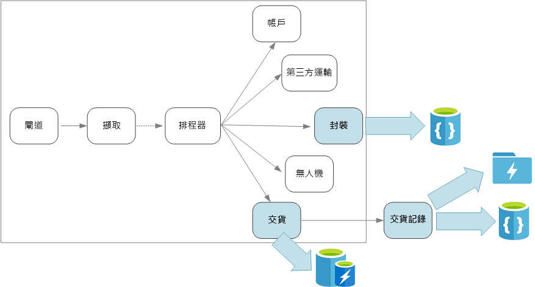

# 設計微服務：資料考量

本章說明在微服務架構中管理資料時的考量。 因為每個微服務都會管理自己的資料，因此非常難以維持資料完整性和資料一致性。

微服務的基本原則是每個服務要管理自己的資料。 兩項服務不應共用一個資料存放區。 相反地，每項服務都要負責自己的私用資料存放區，不可由其他服務直接存取。

之所以有此規則，是為了避免服務彼此意外結合，如果服務共用相同的基礎資料結構描述，就會導致這種情況發生。 如果資料結構描述有變更，則必須在依賴該資料庫的每個服務之間協調該項變更。 藉由隔離每個服務的資料存放區，我們可以限制變更的範圍，並保留真正獨立部署的靈活度。 另一個原因是，每個微服務都可能會有自己的資料模型、查詢、或讀取/寫入模式。 使用共用的資料存放區會讓每個小組受到限制，而無法針對其特定的服務將資料儲存體最佳化。 

這種方法會自然帶來[多語言持續性](https://martinfowler.com/bliki/PolyglotPersistence.html)，亦即在單一應用程式中使用多個資料儲存體技術的特性。 某項服務可能需要文件資料庫的「讀取時建立結構描述 (schema-on-read)」功能。 另一項服務則可能需要 RDBMS 所提供的參考完整性。 每個小組可自由選擇最適合其服務使用的語言。 如需多語言持續性一般原則的詳細資訊，請參閱[使用作業的最佳資料存放區](../guide/design-principles/use-the-best-data-store.md)。 

> [!NOTE]
> 服務共用相同的實體資料庫伺服器並無大礙。 當服務共用相同的結構描述、或讀取和寫入至同一組資料庫資料表時才會發生問題。

## 挑戰

這種分散管理資料的方法會引發一些挑戰。 首先，資料存放區之間可能會有冗餘，以致同一個資料項目出現在多個位置。 例如，資料可能會儲存作為交易的一部分，然後又儲存在其他地方以進行分析、報告或封存。 重複或分割的資料可能會導致資料完整性和一致性的問題發生。 當資料關聯性跨越多個服務時，您就無法使用傳統的資料管理技術來強制執行關聯性。

傳統的資料模型化方法會使用「一地一事實」的規則。 每個實體就只會在結構描述中出現一次。 其他實體可保有對該實體的參考，但不能加以複製。 傳統方法的明顯優勢是更新只會在一地進行，因此可避免發生資料一致性問題。 在微服務架構中，您必須考慮要如何將更新傳播到各個服務，以及要如何在資料出現於多地而沒有強式一致性時管理最終一致性。 

## 管理資料的方法

沒有任何一個方法可以一體適用所有情況，但在微服務架構中管理資料時有一些通用的指導方針。

- 可能的話，請採用最終一致性。 了解系統的哪些地方需要強式一致性或 ACID 交易，哪些地方則可接受最終一致性。

- 當您需要強式一致性保證時，某項服務可能代表給定實體的真實來源，並透過 API 公開。 其他服務則可自己保有該資料或資料子集的複本，並最終與主要資料保持一致，但不會考慮真實來源。 例如，讓我們設想有一個電子商務系統具有客戶訂單服務和建議服務。 建議服務可能會接聽訂單服務的事件，但如果客戶要求退款，則具有完整交易記錄的是訂單服務，而非建議服務。

- 針對交易，請使用[排程器代理程式監督員](../patterns/scheduler-agent-supervisor.md)和[補償交易](../patterns/compensating-transaction.md)等模式來確保數個服務之間的資料能保持一致。  您可能需要另外儲存一塊資料來擷取跨越多個服務的工作單位狀態，以免多個服務之間發生局部失敗。 例如，在多步驟交易進行時，於長期佇列上保留工作項目。 

- 僅儲存服務所需的資料。 服務可能只需要領域實體的一部分相關資訊。 例如，在「出貨」限界內容中，我們需要知道哪些客戶與特定的遞送有關聯。 但我們不需要客戶的帳單地址 (地址是由「帳戶」限界內容負責管理)。 在這裡，仔細思考領域並使用 DDD 方法會有所幫助。 

- 請想想您的服務是否一致且鬆散結合。 如果有兩個服務會持續彼此交換資訊，而導致頻繁通訊的 API，您可能需要合併這兩個服務或重構其功能，以便重繪服務的界限。

- 請使用[事件驅動架構樣式](../guide/architecture-styles/event-driven.md)。 在此架構樣式中，服務會在其公用模型或實體有所變更時發佈事件。 有相關的服務可以訂閱這些事件。 例如，另一個服務可以使用這些事件來建構資料的具體化檢視，這會更適合查詢使用。 

- 擁有事件的服務應該要發佈結構描述，以供用來將事件自動序列化和還原序列化，避免發行者和訂閱者緊密結合。 您可以考慮使用 JSON 結構描述或是 [Microsoft Bond](https://github.com/Microsoft/bond)、Protobuf、Avro 之類的架構。  
 
- 若規模很大，事件可能會成為系統的瓶頸，因此請考慮使用彙總或批次處理，以降低總負載。 

## 無人機遞送：選擇資料存放區 

雖然只有幾項服務，但出貨限界內容還是能說明本節所討論的幾項要點。 

當使用者在安排新的遞送時，用戶端要求中會包含有關遞送的資訊 (例如，取貨和卸貨位置) 以及有關包裹的資訊 (例如，大小和重量)。 這些資訊會定義工作單位，並由「擷取」服務傳送至事件中樞。 當排程器服務在執行工作流程時，工作單位必須留在永續性儲存體中，以免有任何遞送要求遺失。 如需更多有關工作流程的討論，請參閱[擷取與工作流程](./ingestion-workflow.md)。 

不同的後端服務會關心不同部分的要求資訊，並且也會具有不同的讀取和寫入設定檔。 

### 遞送服務

遞送服務會儲存目前排定或進行中之遞送的相關資訊。 它會接聽無人機的事件，並追蹤進行中遞送的狀態。 它也會透過遞送狀態更新傳送領域事件。

使用者應該會在等待包裹時頻繁地檢查遞送狀態。 因此，遞送服務所需的資料存放區必須著重在長期儲存體的輸送量 (讀取和寫入)。 此外，遞送服務不會執行任何複雜的查詢或分析，其只會擷取給定遞送的最新狀態。 遞送服務小組選擇使用 Azure Redis 快取，因為它具有優秀的讀寫效能。 儲存於 Redis 的資訊存留時間會較短。 遞送完成後，「遞送記錄」服務即為記錄系統。

### 遞送記錄服務

遞送記錄服務會接聽遞送服務的遞送狀態事件。 其會將此資料儲存於長期儲存體中。 此記錄資料有兩個不同的使用案例，其各有不同的資料儲存體需求。 

第一個案例是為了進行資料分析而彙總資料，以便進行業務最佳化或改善服務品質。 請注意，遞送記錄服務不會實際地對資料執行分析。 它只負責擷取和儲存。 在此案例中，儲存體必須進行最佳化以便能針對大型資料集進行資料分析，使用「讀取時建立結構描述」方法來因應各種資料來源。 此案例很適合使用 [Azure Data Lake Store](/azure/data-lake-store/)。 Data Lake Store 是與 Hadoop Distributed File System (HDFS) 相容的 Apache Hadoop 檔案系統，並已針對資料分析案例的效能做過調整。 

另一個案例則可讓使用者在遞送完成後，查詢遞送的記錄。 Azure Data Lake 並未特別針對此案例進行最佳化。 為了達到最佳效能，Microsoft 建議您將時間序列資料儲存在 Data Lake 中依日期區分的資料夾內。 (請參閱[針對效能目的調整 Azure Data Lake Store](/azure/data-lake-store/data-lake-store-performance-tuning-guidance))。 不過，該結構不太適合用來依識別碼查閱個別記錄。 除非您還知道時間戳記，否則依識別碼進行查閱時必須掃描整個集合。 因此，遞送記錄服務也會將記錄資料的一部分儲存在 Cosmos DB 中，以便您可以快速查閱。 記錄不需要永遠留在 Cosmos DB 中。 比如說，您可以在一個月後將較舊的遞送資料封存。 您可以透過偶爾執行批次程序來進行此作業。

### 包裹服務

包裹服務會儲存所有包裹的相關資訊。 包裹的儲存體需求如下： 

- 長期儲存體。
- 能夠處理大量包裹，這需要很高的寫入輸送量。
- 支援依包裹識別碼進行簡單查詢。 沒有複雜的參考完整性聯結或需求。

因為包裹資料沒有關聯性，因此適合使用文件導向的資料庫，而 Cosmos DB 可以使用分區化集合來實現極高的輸送量。 負責維護包裹服務的小組熟悉 MEAN 堆疊 (MongoDB、Express.js、AngularJS 和 Node.js)，因此他們會選取 [MongoDB API](/azure/cosmos-db/mongodb-introduction) 來用於 Cosmos DB。 這麼做可讓該小組運用其現有的 MongoDB 經驗，同時又獲得 Cosmos DB (一項受控 Azure 服務) 的好處。

> [!div class="nextstepaction"]
> [服務間通訊](./interservice-communication.md)