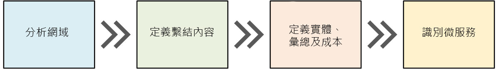
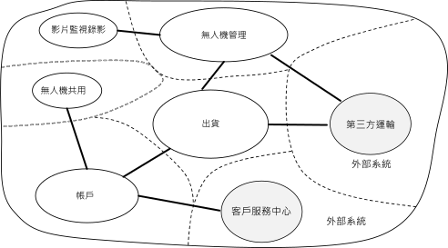
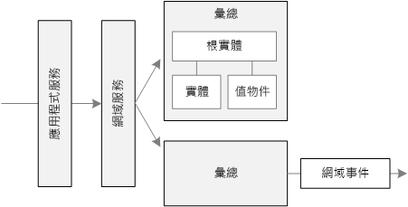
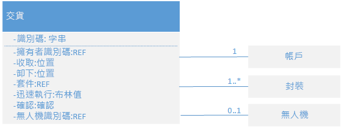
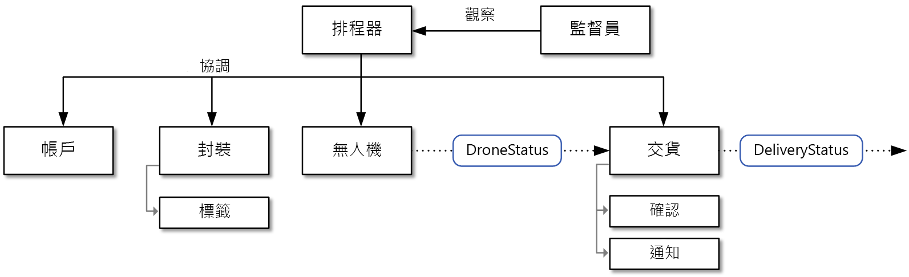

# 設計微服務：領域分析 

微服務最大的挑戰之一是如何定義個別服務之間的界限。 一般來說，一種服務應該「只做一件事」，但實際情況下這未必適用。 並沒有機械化的流程可以產生「正確的」設計。 您必須深入思考您的業務領域、需求和目標。 否則，您的設計可能會變成一場災難，表現出某些不理想的特性，例如在服務之間存有隱藏的相依性、彼此密不可分，或介面的設計不良。 在本章中，我們會以領域導向的方法來設計微服務。 

微服務應該依照商務功能來設計，而非依照水平層 (例如資料存取或傳訊)。 此外，微服務應該具有鬆散地結合和高度功能一致性的特性。 若您可以變更一項服務，而不需要同時更新其他服務，就表示微服務是「鬆散地結合」。 若微服務具有單一、明確定義的用途 (例如管理使用者帳戶或追蹤遞送記錄)，就表示微服務具有「一致性」。 服務應納入領域知識，並從用戶端摘錄該知識。 例如，即使用戶端不知道排程演算法的詳細資訊或管理無人機大隊的方式，也應該能夠排程無人機。

領域導向的設計 (DDD) 可提供一套架構，讓您設計良好的微服務。 DDD 有兩個不同的階段：策略階段和戰術階段。 在策略性 DDD 中，您會定義系統的大規模結構。 策略性 DDD 有助於確保您的架構持續聚焦在商務功能上。 戰術性 DDD 會提供一套可用來建立領域模型的設計模式。 這些模式包括實體、彙總和領域服務。 這些戰術性模式可協助您設計既是鬆散地結合，又具有一致性的微服務。

在這一章和下一章中，我們將逐步進行下列步驟，將其套用到無人機遞送應用程式： 

1. 先從分析業務領域開始，以了解應用程式的功能需求。 此步驟的結果是領域的非正式描述，可以精簡成更加正式的一套領域模型。 

2. 接下來，定義領域的「限界內容」。 每個限界內容都會包含領域模型，後者代表較大應用程式的特定子領域。 

3. 在限界內容中，套用戰術性 DDD 模式來定義實體、彙總和領域服務。 
 
4. 使用來自上一個步驟的結果，以識別應用程式中的微服務。

在本章中，我們會涵蓋最前面三個步驟，主要是針對 DDD。 在下一章中，我們會識別微服務。 不過，請務必記住 DDD 是種反覆且持續進行的流程。 服務界限並非一成不變的。 隨著應用程式的發展，您可能會決定將服務分割成數個較小的服務。

> [!NOTE]
> 本章的用意不是要顯示完整而全面的領域分析。 我們特意讓範例保持簡短以說明重點。 如需有關 DDD 的詳細背景資訊，我們推薦由 Eric Evans 所著、首先介紹 DDD 一詞的《Domain-Driven Design (領域導向的設計)》一書。 另一本良好的參考是 Vaughn Vernon 所著的《Implementing Domain-Driven Design (實作領域導向的設計)》。 

## 分析領域

使用 DDD 方法可協助您設計微服務，讓每個服務都能自然地貼近功能上的業務需求。 它可以協助您避開陷阱，讓您的設計不會受到組織界限或技術選擇的擺佈。

在撰寫任何程式碼之前，您需要以鳥瞰視野來檢視正在建立的系統。 DDD 一開始會先將業務領域模型化，並建立「領域模型」。 領域模型是業務領域的抽象模型。 它抽取並組織了領域知識，然後提供共通語言給開發人員和領域專家。 

先從對應所有商務功能及其連線開始。 這可能會是涉及領域專家、軟體架構設計人員和其他專案關係人的共同工作。 您無須使用任何特定的形式。  只需草繪圖表或在白板上繪圖即可。

繪出圖表後，您就可以開始識別不同的子領域。 有哪些功能是密切相關的？ 哪些功能是業務核心？又有哪些功能會提供附屬服務？ 什麼是相依性關係圖？ 在此初始階段，您不必擔心技術或實作細節。 話雖如此，您仍應注意應用程式需要在何處與外部系統 (例如 CRM、付款處理或計費系統) 整合。 

## 無人機遞送：分析業務領域。

Fabrikam 小組在進行一些初始領域分析後，提出了用以說明無人機遞送領域的概略草圖。

 

- 由於**出貨**是業務的核心，因此位於圖表的中央。 在圖表中的所有其他項目，都是為了達成這項功能而存在。
- **無人機管理**也是業務的核心。 與無人機管理密切相關的功能包括**無人機修復**，以及使用**預測性分析**來預測無人機何時需要維護和維修。 
- **預計到達時間分析**可提供預估的收件和遞送時間。 
- 若包裹無法完全交由無人機運送，**第三方運輸**會讓應用程式能夠排程替代運輸方式。
- **無人機共用**是核心業務可能的擴充功能。 公司在特定時段可能會有過剩的無人機，若不將其出租便會閒置。 在初始版本中不會有這項功能。
- **視訊監視**是公司稍後可能會擴及的另一個領域。
- **使用者帳戶**、**發票開立**和**話務中心**都是支援核心業務的子領域。
 
請注意，截至流程中的這個階段為止，我們尚未做出任何關於實作或技術的決策。 部分子系統可能會涉及外部軟體系統或第三方服務。 即便如此，應用程式仍需要與這些系統和服務互動，因此請務必將後兩者包含在領域模型中。 

> [!NOTE]
> 應用程式要依存外部系統時，會有外部系統的資料結構描述或 API 洩露到您應用程式中的風險，最後可能會導致架構設計受到危害。 對可能未遵照新式最佳做法，以及可能是使用複雜曲折的資料結構描述或過時 API 的繼承系統來說，風險尤其大。 在此情況下，請務必要在這些外部系統與應用程式之間，妥善定義出界限。 針對此目的，請考慮使用[扼制模式](../patterns/strangler.md)或[防損毀層模式](../patterns/anti-corruption-layer.md)。

## 定義限界內容

領域模型會包括真實世界中事物的代表 &mdash; 使用者、無人機、包裹等等。 但這並不表示針對相同的事物，系統的每個部分都需要使用相同的代表。 

例如，處理無人機修復和預測性分析的子系統會需要表示許多具有實體特性 (例如維修記錄、使用里程、壽命、型號、效能特性等等) 的無人機。 但在排程遞送時，我們不會在意這些特性。 正在排程的子系統只需要知道無人機是否可用，以及收件和遞送的預計到達時間。 

若我們嘗試針對這兩個子系統建立單一模型，該模型會過於複雜。 這也會讓模型難以隨著時間而進化，因為任何變更都需要能夠讓在不同子系統上工作的多個小組滿意。 因此，設計不同的模型，來代表兩個不同內容中的同一個真實世界實體 (在此案例中是無人機)，通常是較好的方式。 每一個模型都只包含在其特定內容中相關的功能和屬性。

此時 DDD 的「限界內容」概念就可派上用場。 限界內容只是領域內的界限，系統會在此套用特定的領域模型。 對照先前的圖表，我們可以根據各種功能是否會共用單一的領域模型，來將功能分組。 

 
 
限界內容之間不一定彼此獨立。 在此圖中，連接限界內容的實心線條，代表兩個限界內容彼此互動的位置。 例如，「出貨」會依賴「使用者帳戶」來取得關於客戶的資訊，並依賴「無人機管理」對無人機大隊中的無人機進行排程。

在《Domain Driven Design (領域導向的設計)》一書中，Eric Evans 描述了在與其他限界內容互動時，數種維護領域模型完整性的模式。 其中一個微服務的主要原則是，服務會透過妥善定義的 API 進行通訊。 此方法可對應到 Evans 稱為「開放主機服務」和「發行的語言」的兩種模式。 開放主機服務的概念是子系統會為了與其通訊的其他子系統，定義正式的通訊協定 (API)。 發行的語言則延伸了此概念，以其他小組可用以寫入用戶端的形式來發行 API。 在 [API 設計](./api-design.md)一章中，我們討論了使用 [OpenAPI 規格](https://www.openapis.org/specification/repo) (先前稱為 Swagger)，針對 REST API 定義適用於各種語言的介面描述，並以 JSON 或 YAML 格式表示。

在本章的其餘部分，我們將著重在「出貨」限界內容。 

## 戰術性 DDD

在 DDD 的策略性階段期間，您會對應業務領域並為領域模型定義限界內容。 在戰術性 DDD 中則會更加精確地定義領域模型。 戰術性模式會在單一限界內容中套用。 在微服務架構中，我們對實體和彙總模式特別感興趣。 套用這些模式可協助我們識別應用程式中服務的自然界限 (請參閱[下一章](./microservice-boundaries.md))。 一般來說，微服務應大於彙總，且小於限界內容。 首先，我們會檢閱戰術性模式。 然後我們會將其套用到無人機遞送應用程式中的「出貨」限界內容。 

### 戰術性模式概觀

本節提供了戰術性 DDD 模式的簡短摘要，因此若您已很熟悉 DDD，可以略過本節。 模式在 Eric Evan 書中的第 5 &ndash; 6 章中，以及 Vaughn Vernon 所著的《Implementing Domain-Driven Design (實作領域導向的設計)》一書中會詳加說明。 

**實體**。 實體是具有唯一的身分識別，且會持續一段時間的物件。 例如，在銀行應用程式中，客戶和帳戶會是實體。 

- 實體在系統中具有唯一識別碼 (可用來查看或擷取實體)。 這並不表示識別碼一律會直接公開給使用者。 而可能是資料庫中的 GUID 或主索引鍵。 
- 身分識別可能會跨越多個限界內容，且持續時間可能會超過應用程式的存留期。 例如，銀行帳戶號碼或政府所發行的 ID 就不會繫結到特定應用程式的存留期。
- 實體的屬性可能會隨著時間變更。 例如，某人的姓名或地址可能會變更，但他仍是同一個人。 
- 實體可以擁有其他實體的參考。
 
**值物件**。 值物件沒有任何身分識別。 其只會由其屬性的值所定義。 值物件也是不可變的。 若要更新值物件，請一律要建立新執行個體來取代舊執行個體。 值物件可以具有封裝領域邏輯的方法，但這些方法對物件狀態必須沒有副作用。 值物件的典型範例包括色彩、日期和時間，以及貨幣值。 

**彙總**。 彙總定義了一或多個實體周圍的一致性界限。 彙總中只有一個的實體是根目錄。 使用根目錄實體的識別碼即可查看。 彙總內的任何其他實體都是根目錄的子項目，並可透過追隨根目錄的指標加以參考。 

彙總的目的是將交易的不變項目模型化。 真實世界中的事物關係錯綜複雜。 客戶會建立訂單、訂單會包含產品、產品會有供應商，依此類推。 若應用程式修改了數個相關的物件，要如何保證一致性？ 我們要如何追蹤不變項目並加以強制執行？  

以前傳統應用程式通常會使用資料庫交易來強制確保一致性。 然而，在分散式應用程式中，這通常不可行。 單一商業交易可能會跨越多個資料存放區、可能會長時間執行，或可能涉及第三方服務。 最後是取決於應用程式 (而非資料層) 來強制執行領域所需的不變項目。 這就是彙總要模型化的項目。

> [!NOTE]
> 彙總可能會由單一實體所組成，而不包含子實體。 是因為交易的界限才使其成為彙總。

**領域和應用程式服務**。 在 DDD 術語中，服務是指會實作某些邏輯，而不保留任何狀態的物件。 Evans 將「領域服務」(會封裝領域邏輯) 和「應用程式服務」(會提供技術功能，例如使用者驗證或傳送簡訊) 兩者加以區分。 領域服務通常會用以將跨越多個實體的行為模型化。 

> [!NOTE]
> 「服務」一詞在軟體開發中已過度使用。 在此的定義與微服務並無直接關聯。

**領域事件**。 領域事件可用以通知系統的其他部分有情況發生。 正如其名，領域事件應代表領域中所發生的事物。 例如，「已將記錄插入資料表中」就不是領域事件。 「已取消遞送」則是領域事件。 領域事件在微服務架構中特別具有關聯性。 因為微服務是分散式的且不會共用資料存放區，因此領域事件可提供方式讓微服務相互協調。 在[服務間通訊](./interservice-communication.md)一章中會詳加討論非同步傳訊。
 
有幾種其他 DDD 模式未在此處列出，包括處理站、存放庫和模組。 在實作微服務時這些會是很有用的模式，但在設計微服務之間的界限時則較不相關。

## 無人機遞送：套用模式

我們先從「出貨」限界內容必須處理的案例開始。

- 客戶可以要求無人機從已向無人機遞送服務註冊的企業收件。
- 寄件者可產生要放在包裹上的標籤 (條碼或 RFID)。 
- 無人機會從來源位置收取包裹，並遞送到目的地位置。
- 客戶在排程遞送時，系統會根據路線資訊、天氣狀況和歷史資料，來提供預計的到達時間。 
- 無人機在飛行時，使用者可以追蹤其目前位置和最新的預計到達時間。 
- 到無人機收取包裹之前，客戶都可以取消遞送。
- 遞送完成時會通知客戶。
- 寄件者能以簽章或指紋形式，向客戶要求遞送確認。
- 使用者可以查看已完成之遞送的記錄。

開發小組從上述案例中，識別出下列**實體**。

- 遞送
- Package
- 無人機
- 帳戶
- 確認
- 通知
- Tag

前四個實體：遞送、包裹、無人機和帳戶，全都是代表交易一致性界限的**彙總**。 「確認」和「通知」是「遞送」的子實體，而「標籤」則是「包裹」的子實體。 

在此設計中的**值物件**包括 Location、ETA、PackageWeight 和 PackageSize。 

為了說明，以下是「遞送」彙總的 UML 圖表。 請注意，「遞送」保留了其他彙總 (包括「帳戶」、「包裹」和「無人機」) 的參考。

有兩個領域事件：

- 無人機在飛行時，「無人機」實體會傳送描述無人機位置和狀態 (飛行中、已著陸) 的 DroneStatus 事件。

- 只要遞送階段有所變更，「遞送」實體就會隨時傳送 DeliveryTracking 事件。 包括有 DeliveryCreated、DeliveryRescheduled、DeliveryHeadedToDropoff 和 DeliveryCompleted。 

請注意，這些事件會描述領域模型中有意義的事物。 這些事件會描述關於領域的事物，且不會繫結到特定的程式設計語言建構。

開發小組還識別出另一個功能領域，但無法明確歸類為目前為止所描述的任何實體。 系統的某些部分必須協調排程或更新遞送時所涉及的所有步驟。 因此，開發小組已在設計中新增兩個**領域服務**：用以協調步驟的「排程器」，以及用以監視每個步驟狀態的「監督員」；以便偵測是否有任何步驟失敗或逾時。這是[排程器代理程式監督員模式](../patterns/scheduler-agent-supervisor.md)的變化情形。

> [!div class="nextstepaction"]
> [識別微服務界限](./microservice-boundaries.md)
