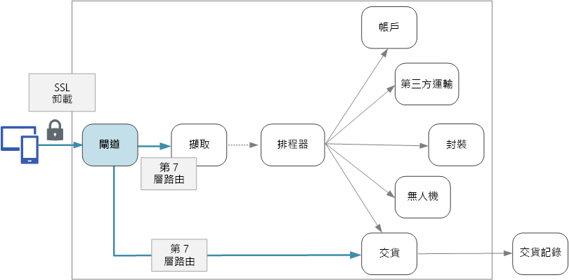

# 設計微服務：API 閘道Designing microservices: API gateways

在微服務架構中，用戶端可能會與多個前端服務互動。In a microservices architecture, a client might interact with more than one front-end service. 因此，用戶端要如何知道應該呼叫哪些端點？Given this fact, how does a client know what endpoints to call? 引進新的服務或重構現有服務時，會發生什麼事？What happens when new services are introduced, or existing services are refactored? 服務如何處理 SSL 終止、驗證和其他考量？How do services handle SSL termination, authentication, and other concerns? 「API 閘道」可協助您解決這些挑戰。An *API gateway* can help to address these challenges. 

## 什麼是 API 閘道？What is an API gateway?

API 閘道位於用戶端和服務之間。An API gateway sits between clients and services. 它會作為反向 Proxy，將要求從用戶端路由傳送到服務。It acts as a reverse proxy, routing requests from clients to services. 它也會執行各種跨領域工作，例如驗證、SSL 終止和速率限制。It may also perform various cross-cutting tasks such as authentication, SSL termination, and rate limiting. 如果您未部署閘道，用戶端就必須將要求直接傳送給前端服務。If you don't deploy a gateway, clients must send requests directly to front-end services. 不過，直接向用戶端公開服務會有一些潛在問題：However, there are some potential problems with exposing services directly to clients:

- 它會導致複雜的用戶端程式碼。It can result in complex client code. 用戶端必須追蹤多個端點，並以彈性的方式處理失敗。The client must keep track of multiple endpoints, and handle failures in a resilient way. 
- 它會讓用戶端與後端發生結合。It creates coupling between the client and the backend. 用戶端需要知道個別服務的分解方式。The client needs to know how the individual services are decomposed. 這會讓您難以維護用戶端，也較不容易重構服務。That makes it harder to maintain the client and also harder to refactor services.
- 單一作業可能需要呼叫多個服務。A single operation might require calls to multiple services. 此動作會讓用戶端與伺服器之間有多次網路往返，而大幅增加延遲時間。That can result in multiple network round trips between the client and the server, adding significant latency. 
- 每個公眾對應的服務都必須處理各種考量，例如驗證、SSL 及用戶端速率限制。Each public-facing service must handle concerns such as authentication, SSL, and client rate limiting. 
- 服務必須公開用戶端熟悉的通訊協定，例如 HTTP 或 WebSocket。Services must expose a client-friendly protocol such as HTTP or WebSocket. 這會限制[通訊協定](./interservice-communication.md)的選擇。This limits the choice of [communication protocols](./interservice-communication.md). 
- 具有公用端點的服務是潛在的受攻擊面，因此必須予以強化。Services with public endpoints are a potential attack surface, and must be hardened.

閘道可透過讓用戶端與服務分離來協助解決這些問題。A gateway helps to address these issues by decoupling clients from services. 閘道可以執行幾種不同的功能，您不一定需要全部使用。Gateways can perform a number of different functions, and you may not need all of them. 功能可分為下列設計模式：The functions can be grouped into the following design patterns:

[閘道路由](../patterns/gateway-routing.md)。[Gateway Routing](../patterns/gateway-routing.md). 將閘道作為反向 Proxy，以使用第 7 層路由將要求路由傳送至一或多個後端服務。Use the gateway as a reverse proxy to route requests to one or more backend services, using layer 7 routing. 閘道會為用戶端提供單一端點，並有助於讓用戶端與服務分離。The gateway provides a single endpoint for clients, and helps to decouple clients from services. 

[閘道彙總](../patterns/gateway-aggregation.md)。[Gateway Aggregation](../patterns/gateway-aggregation.md). 您可以使用閘道將多個個別要求彙總為單一要求。Use the gateway to aggregate multiple individual requests into a single request. 當單一作業需要呼叫多個後端服務時，便適用此模式。This pattern applies when a single operation requires calls to multiple backend services. 用戶端會將一個要求傳送至閘道。The client sends one request to the gateway. 閘道會將要求分派至各種後端系統，然後彙總結果並傳回給用戶端。The gateway dispatches requests to the various backend services, and then aggregates the results and sends them back to the client. 這有助於減少用戶端與後端之間的通訊頻率。This helps to reduce chattiness between the client and the backend. 

[閘道卸載](../patterns/gateway-offloading.md)。[Gateway Offloading](../patterns/gateway-offloading.md). 您可以使用閘道將功能從個別服務卸載到閘道 (特別是在有跨領域考量時)。Use the gateway to offload functionality from individual services to the gateway, particularly cross-cutting concerns. 它可用來將這些功能合併到一個地方，而不是讓每項服務負責實作這些功能。It can be useful to consolidate these functions into one place, rather than making every service responsible for implementing them. 對於需要專門技術才能正確實作的功能 (例如驗證和授權)，尤其應該這麼做。This is particularly true for features that requires specialized skills to implement correctly, such as authentication and authorization. 

以下是可以卸載到閘道的一些功能範例：Here are some examples of functionality that could be offloaded to a gateway:

- SSL 終止SSL termination
- 驗證Authentication
- IP 允許清單IP whitelisting
- 用戶端速率限制 (節流)Client rate limiting (throttling)
- 記錄和監視Logging and monitoring
- 回應快取Response caching
- Web 應用程式防火牆Web application firewall
- GZip 壓縮GZIP compression
- 提供靜態內容Servicing static content

## 選擇閘道技術Choosing a gateway technology

以下是在應用程式中實作 API 閘道的一些選項。Here are some options for implementing an API gateway in your application.

- **反向 Proxy 伺服器**。**Reverse proxy server**. Nginx 和 HAProxy 等熱門的反向 Proxy 伺服器可支援負載平衡、SSL 和第 7 層路由等功能。Nginx and HAProxy are popular reverse proxy servers that support features such as load balancing, SSL, and layer 7 routing. 兩者都是免費的開放原始碼產品，而其付費版則會提供額外的功能和支援選項。They are both free, open-source products, with paid editions that provide additional features and support options. Nginx 及 HAProxy 都是成熟的產品，並具有豐富的功能集和高效能。Nginx and HAProxy are both mature products with rich feature sets and high performance. 您可以透過第三方模組或在 Lua 中撰寫自訂指令碼來對兩者進行擴充。You can extend them with third-party modules or by writing custom scripts in Lua. Nginx 也支援稱為 NginScript 的 JavaScript 型指令碼模組。Nginx also supports a JavaScript-based scripting module called NginScript.

- **服務網格輸入控制器**。**Service mesh ingress controller**. 如果您要使用 linkerd 或 Istio 等服務網格，請考慮使用輸入控制器針對該服務網格所提供的功能。If you are using a service mesh such as linkerd or Istio, consider the features that are provided by the ingress controller for that service mesh. 例如，Istio 輸入控制器可支援第 7 層路由、HTTP 重新導向、重試和其他功能。For example, the Istio ingress controller supports layer 7 routing, HTTP redirects, retries, and other features. 

- [Azure 應用程式閘道](/azure/application-gateway/)。[Azure Application Gateway](/azure/application-gateway/). 應用程式閘道是受控的負載平衡服務，可執行第 7 層路由和 SSL 終止。Application Gateway is a managed load balancing service that can perform layer-7 routing and SSL termination. 此外，也會提供 Web 應用程式防火牆 (WAF)。It also provides a web application firewall (WAF).

- [Azure API 管理](/azure/api-management/)。[Azure API Management](/azure/api-management/). Azure API 管理是周全的解決方案，可將 API 發佈給外部及內部客戶。API Management is a turnkey solution for publishing APIs to external and internal customers. 它提供的功能可用於管理公眾對應 API，包括速率限制、IP 允許清單建立，以及使用 Azure Active Directory 或其他識別提供者來進行的驗證。It provides features that are useful for managing a public-facing API, including rate limiting, IP white listing, and authentication using Azure Active Directory or other identity providers. API 管理不會執行任何負載平衡作業，因此應該與負載平衡器搭配使用，例如應用程式閘道或反向 Proxy。API Management doesn't perform any load balancing, so it should be used in conjunction with a load balancer such as Application Gateway or a reverse proxy. 如需搭配使用 API 管理與應用程式閘道的相關資訊，請參閱[整合內部 VNET 中的 API 管理與應用程式閘道](/azure/api-management/api-management-howto-integrate-internal-vnet-appgateway)。For information about using API Management with Application Gateway, see [Integrate API Management in an internal VNET with Application Gateway](/azure/api-management/api-management-howto-integrate-internal-vnet-appgateway).

在選擇閘道技術時，請考慮下列因素：When choosing a gateway technology, consider the following:

**功能**。**Features**. 以上列出的選項皆支援第 7 層路由，但對於其他功能的支援則各不相同。The options listed above all support layer 7 routing, but support for other features will vary. 根據您所需要的功能，您可能會部署多個閘道。Depending on the features that you need, you might deploy more than one gateway. 

**部署**。**Deployment**. Azure 應用程式閘道與 API 管理是受控服務。Azure Application Gateway and API Management are managed services. Nginx 及 HAProxy 一般會在叢集內的容器中執行，但也可部署到叢集外的專用 VM。Nginx and HAProxy will typically run in containers inside the cluster, but can also be deployed to dedicated VMs outside of the cluster. 這麼做可將閘道與其他工作負載隔離開來，但會產生較高的管理負荷。This isolates the gateway from the rest of the workload, but incurs higher management overhead.

**管理**。**Management**. 當服務經過更新或有新增的服務時，您可能需要更新閘道路由規則。When services are updated or new services are added, the gateway routing rules may need to be updated. 請考慮該如何管理此程序。Consider how this process will be managed. 管理 SSL 憑證、IP 允許清單和其他組態部分也會有類似考量。Similar considerations apply to managing SSL certificates, IP whitelists, and other aspects of configuration.

## 將 Nginx 或 HAProxy 部署到 KubernetesDeploying Nginx or HAProxy to Kubernetes

您可以將 Nginx 或 HAProxy 部署至 Kubernetes 來作為 [ReplicaSet](https://kubernetes.io/docs/concepts/workloads/controllers/replicaset/) 或 [DaemonSet](https://kubernetes.io/docs/concepts/workloads/controllers/daemonset/)，以指定 Nginx 或 HAProxy 容器映像。You can deploy Nginx or HAProxy to Kubernetes as a [ReplicaSet](https://kubernetes.io/docs/concepts/workloads/controllers/replicaset/) or [DaemonSet](https://kubernetes.io/docs/concepts/workloads/controllers/daemonset/) that specifies the Nginx or HAProxy container image. 使用 ConfigMap 來儲存 Proxy 的組態檔，並將 ConfigMap 掛接為磁碟區。Use a ConfigMap to store the configuration file for the proxy, and mount the ConfigMap as a volume. 建立 LoadBalancer 類型的服務，以透過 Azure Load Balancer 公開閘道。Create a service of type LoadBalancer to expose the gateway through an Azure Load Balancer. 

另一種方法是建立輸入控制器。An alternative is to create an Ingress Controller. 輸入控制器是一種 Kubernetes 資源，可部署負載平衡器或反向 Proxy 伺服器。An Ingress Controller is a Kubernetes resource that deploys a load balancer or reverse proxy server. 存在的實作有好幾種，包括 Nginx 及 HAProxy。Several implementations exist, including Nginx and HAProxy. 另有稱為輸入的資源會定義輸入控制器的設定，例如路由規則和 TLS 憑證。A separate resource called an Ingress defines settings for the Ingress Controller, such as routing rules and TLS certificates. 這樣一來，您就不需要管理專屬於特定 Proxy 伺服器技術的複雜組態檔。That way, you don't need to manage complex configuration files that are specific to a particular proxy server technology.

閘道是系統中的潛在瓶頸或單一失敗點，因此請一律部署至少兩個複本以獲得高可用性。The gateway is a potential bottleneck or single point of failure in the system, so always deploy at least two replicas for high availability. 您可以視負載而定將複本進一步相應放大。You may need to scale out the replicas further, depending on the load. 

也請考慮在叢集中的一組專用節點上執行閘道。Also consider running the gateway on a dedicated set of nodes in the cluster. 此方法的好處包括：Benefits to this approach include:

- 隔離。Isolation. 所有輸入流量會流向一組固定節點，因而可以與後端服務隔開。All inbound traffic goes to a fixed set of nodes, which can be isolated from backend services.

- 穩定的設定。Stable configuration. 如果閘道的設定不正確，整個應用程式可能會變得無法使用。If the gateway is misconfigured, the entire application may become unavailable. 

- 效能。Performance. 基於效能的考量，建議您對閘道使用特定的 VM 設定。You may want to use a specific VM configuration for the gateway for performance reasons.

> [!div class="nextstepaction"]
> [記錄和監視Logging and monitoring](./logging-monitoring.md)
