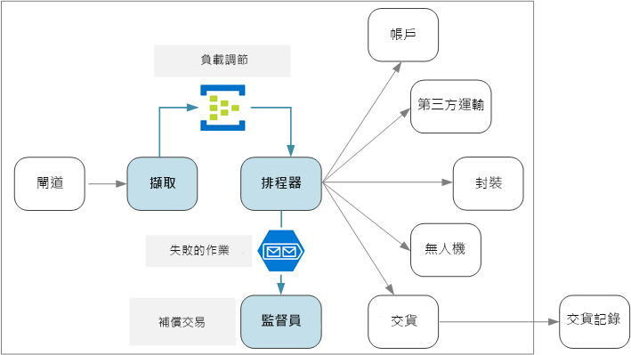
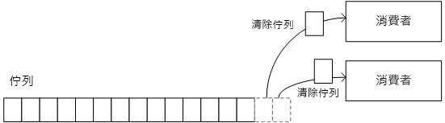
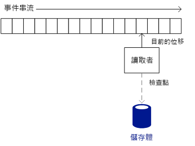
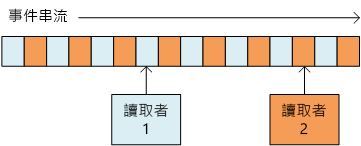

# <a name="designing-microservices-ingestion-and-workflow"></a><span data-ttu-id="095dc-103">設計微服務：擷取與工作流程</span><span class="sxs-lookup"><span data-stu-id="095dc-103">Designing microservices: Ingestion and workflow</span></span>

<span data-ttu-id="095dc-104">微服務通常會有個工作流程需針對單一交易橫跨多個服務。</span><span class="sxs-lookup"><span data-stu-id="095dc-104">Microservices often have a workflow that spans multiple services for a single transaction.</span></span> <span data-ttu-id="095dc-105">此工作流程必須很可靠；不能遺失交易，或讓交易處於部分完成狀態。</span><span class="sxs-lookup"><span data-stu-id="095dc-105">The workflow must be reliable; it can't lose transactions or leave them in a partially completed state.</span></span> <span data-ttu-id="095dc-106">此外，控制傳入要求的擷取率也很重要。</span><span class="sxs-lookup"><span data-stu-id="095dc-106">It's also critical to control the ingestion rate of incoming requests.</span></span> <span data-ttu-id="095dc-107">許多小型服務彼此通訊時，突然出現一批傳入要求可能會淹沒服務間通訊。</span><span class="sxs-lookup"><span data-stu-id="095dc-107">With many small services communicating with each other, a burst of incoming requests can overwhelm the interservice communication.</span></span>



## <a name="the-drone-delivery-workflow"></a><span data-ttu-id="095dc-109">無人機遞送工作流程</span><span class="sxs-lookup"><span data-stu-id="095dc-109">The drone delivery workflow</span></span>

<span data-ttu-id="095dc-110">在無人機遞送應用程式中，必須執行下列作業，才能排程遞送：</span><span class="sxs-lookup"><span data-stu-id="095dc-110">In the Drone Delivery application, the following operations must be performed to schedule a delivery:</span></span>

1. <span data-ttu-id="095dc-111">檢查客戶的帳戶狀態 (帳戶服務)。</span><span class="sxs-lookup"><span data-stu-id="095dc-111">Check the status of the customer's account (Account service).</span></span>
2. <span data-ttu-id="095dc-112">建立新的包裝實體 (包裝服務)。</span><span class="sxs-lookup"><span data-stu-id="095dc-112">Create a new package entity (Package service).</span></span>
3. <span data-ttu-id="095dc-113">根據取件和遞送位置，檢查此遞送是否需要任何第三方運輸 (第三方運輸服務)。</span><span class="sxs-lookup"><span data-stu-id="095dc-113">Check whether any third-party transportation is required for this delivery, based on the pickup and delivery locations (Third-party Transportation service).</span></span>
4. <span data-ttu-id="095dc-114">排程無人機取件 (無人機服務)。</span><span class="sxs-lookup"><span data-stu-id="095dc-114">Schedule a drone for pickup (Drone service).</span></span>
5. <span data-ttu-id="095dc-115">建立新的遞送實體 (遞送服務)。</span><span class="sxs-lookup"><span data-stu-id="095dc-115">Create a new delivery entity (Delivery service).</span></span>

<span data-ttu-id="095dc-116">這是整個應用程式的核心，所以端對端程序必定要具有良好效能，並且很可靠。</span><span class="sxs-lookup"><span data-stu-id="095dc-116">This is the core of the entire application, so the end-to-end process must be performant as well as reliable.</span></span> <span data-ttu-id="095dc-117">必須處理一些特定的挑戰：</span><span class="sxs-lookup"><span data-stu-id="095dc-117">Some particular challenges must be addressed:</span></span>

- <span data-ttu-id="095dc-118">**負載調節**。</span><span class="sxs-lookup"><span data-stu-id="095dc-118">**Load leveling**.</span></span> <span data-ttu-id="095dc-119">太多用戶端要求可能會讓服務間網路流量淹沒系統。</span><span class="sxs-lookup"><span data-stu-id="095dc-119">Too many client requests can overwhelm the system with interservice network traffic.</span></span> <span data-ttu-id="095dc-120">也可能會淹沒後端相依性，例如儲存體或遠端服務。</span><span class="sxs-lookup"><span data-stu-id="095dc-120">It can also overwhelm backend dependencies such as storage or remote services.</span></span> <span data-ttu-id="095dc-121">其回應方式為進行服務節流、呼叫服務、在系統中建立背壓。</span><span class="sxs-lookup"><span data-stu-id="095dc-121">These may react by throttling the services calling them, creating backpressure in the system.</span></span> <span data-ttu-id="095dc-122">因此，務必對進入系統的要求進行負載調節，做法將其放入緩衝區或佇列中進行處理。</span><span class="sxs-lookup"><span data-stu-id="095dc-122">Therefore, it's important to load level the requests coming into the system, by putting them into a buffer or queue for processing.</span></span>

- <span data-ttu-id="095dc-123">**保證遞送**。</span><span class="sxs-lookup"><span data-stu-id="095dc-123">**Guaranteed delivery**.</span></span> <span data-ttu-id="095dc-124">為避免遺漏任何用戶端要求，擷取元件必須保證至少傳遞訊息一次。</span><span class="sxs-lookup"><span data-stu-id="095dc-124">To avoid dropping any client requests, the ingestion component must guarantee at-least-once delivery of messages.</span></span>

- <span data-ttu-id="095dc-125">錯誤處理。</span><span class="sxs-lookup"><span data-stu-id="095dc-125">**Error handling**.</span></span> <span data-ttu-id="095dc-126">如果任何一項服務傳回錯誤碼，或發生非暫時性失敗，就無法排程傳遞。</span><span class="sxs-lookup"><span data-stu-id="095dc-126">If any of the services returns an error code or experiences a non-transient failure, the delivery cannot be scheduled.</span></span> <span data-ttu-id="095dc-127">錯誤碼可能會指出預期的錯誤狀況 (例如，客戶的帳戶已暫止) 或未預期的伺服器錯誤 (HTTP 5xx)。</span><span class="sxs-lookup"><span data-stu-id="095dc-127">An error code might indicate an expected error condition (for example, the customer's account is suspended) or an unexpected server error (HTTP 5xx).</span></span> <span data-ttu-id="095dc-128">服務也可能無法使用，而導致網路呼叫逾時。</span><span class="sxs-lookup"><span data-stu-id="095dc-128">A service might also be unavailable, causing the network call to time out.</span></span>

<span data-ttu-id="095dc-129">首先，我們會查看等式的擷取端 &mdash; 系統如何在高輸送量時內嵌傳入的使用者要求。</span><span class="sxs-lookup"><span data-stu-id="095dc-129">First we'll look at the ingestion side of the equation &mdash; how the system can ingest incoming user requests at high throughput.</span></span> <span data-ttu-id="095dc-130">然後我們會考慮無人機遞送應用程式如何實作可靠的工作流程。</span><span class="sxs-lookup"><span data-stu-id="095dc-130">Then we'll consider how the drone delivery application can implement a reliable workflow.</span></span> <span data-ttu-id="095dc-131">結果就是擷取子系統的設計會影響工作流程後端。</span><span class="sxs-lookup"><span data-stu-id="095dc-131">It turns out that the design of the ingestion subsystem affects the workflow backend.</span></span>

## <a name="ingestion"></a><span data-ttu-id="095dc-132">擷取</span><span class="sxs-lookup"><span data-stu-id="095dc-132">Ingestion</span></span>

<span data-ttu-id="095dc-133">根據商務需求，開發小組針對擷取找出了下列非功能性需求：</span><span class="sxs-lookup"><span data-stu-id="095dc-133">Based on business requirements, the development team identified the following non-functional requirements for ingestion:</span></span>

- <span data-ttu-id="095dc-134">每秒 10K 個要求的持續輸送量。</span><span class="sxs-lookup"><span data-stu-id="095dc-134">Sustained throughput of 10K requests/sec.</span></span>
- <span data-ttu-id="095dc-135">能夠處理高達 50K/秒的尖峰，但沒有遺漏用戶端要求或逾時。</span><span class="sxs-lookup"><span data-stu-id="095dc-135">Able to handle spikes of up to 50K/sec without dropping client requests or timing out.</span></span>
- <span data-ttu-id="095dc-136">小於 500 毫秒的延遲 (第 99 個百分位數)。</span><span class="sxs-lookup"><span data-stu-id="095dc-136">Less than 500ms latency in the 99th percentile.</span></span>

<span data-ttu-id="095dc-137">處理偶發流量尖峰需求是設計的一大挑戰。</span><span class="sxs-lookup"><span data-stu-id="095dc-137">The requirement to handle occasional spikes in traffic presents a design challenge.</span></span> <span data-ttu-id="095dc-138">理論上，可以將系統相應放大，以處理最大預期的流量。</span><span class="sxs-lookup"><span data-stu-id="095dc-138">In theory, the system could be scaled out to handle the maximum expected traffic.</span></span> <span data-ttu-id="095dc-139">不過，佈建這麼多資源會非常沒有效率。</span><span class="sxs-lookup"><span data-stu-id="095dc-139">However, provisioning that many resources would be very inefficient.</span></span> <span data-ttu-id="095dc-140">在大部分的情況下，應用程式不需要這麼多容量，因此會有閒置核心，這樣不僅耗費金錢，且也不會增加價值。</span><span class="sxs-lookup"><span data-stu-id="095dc-140">Most of the time, the application will not need that much capacity, so there would be idle cores, costing money without adding value.</span></span>

<span data-ttu-id="095dc-141">比較好的做法是將傳入要求放入緩衝區，並且讓緩衝區當作負載調節器。</span><span class="sxs-lookup"><span data-stu-id="095dc-141">A better approach is to put the incoming requests into a buffer, and let the buffer act as a load leveler.</span></span> <span data-ttu-id="095dc-142">採用此設計，擷取服務必須能夠處理短期間的最大擷取率，但後端服務只需要處理最大的持續性負載。</span><span class="sxs-lookup"><span data-stu-id="095dc-142">With this design, the Ingestion service must be able to handle the maximum ingestion rate over short periods, but the backend services only need to handle the maximum sustained load.</span></span> <span data-ttu-id="095dc-143">在前端進行緩衝處理時，後端服務不需要處理大量的流量尖峰。</span><span class="sxs-lookup"><span data-stu-id="095dc-143">By buffering at the front end, the backend services shouldn't need to handle large spikes in traffic.</span></span> <span data-ttu-id="095dc-144">對於無人機遞送應用程式所需的規模，[Azure 事件中樞](/azure/event-hubs/)是不錯的負載調節選擇。</span><span class="sxs-lookup"><span data-stu-id="095dc-144">At the scale required for the Drone Delivery application, [Azure Event Hubs](/azure/event-hubs/) is a good choice for load leveling.</span></span> <span data-ttu-id="095dc-145">事件中樞可提供低延遲和高輸送量，而且在高擷取量時是具有成本效益的解決方案。</span><span class="sxs-lookup"><span data-stu-id="095dc-145">Event Hubs offers low latency and high throughput, and is a cost effective solution at high ingestion volumes.</span></span>

<span data-ttu-id="095dc-146">在我們的測試中，我們使用了具有 32 個分割區和 100 個輸送量單位的標準層事件中樞。</span><span class="sxs-lookup"><span data-stu-id="095dc-146">For our testing, we used a Standard tier event hub with 32 partitions and 100 throughput units.</span></span> <span data-ttu-id="095dc-147">我們發現大約每秒擷取 32K 個事件時，會有約 90 毫秒的延遲。</span><span class="sxs-lookup"><span data-stu-id="095dc-147">We observed about 32K events / second ingestion, with latency around 90ms.</span></span> <span data-ttu-id="095dc-148">目前的預設限制為 20 個輸送量單位，但 Azure 客戶可藉由提出支援要求來要求額外的輸送量單位。</span><span class="sxs-lookup"><span data-stu-id="095dc-148">Currently the default limit is 20 throughput units, but Azure customers can request additional throughput units by filing a support request.</span></span> <span data-ttu-id="095dc-149">如需詳細資訊，請參閱[事件中樞配額](/azure/event-hubs/event-hubs-quotas)。</span><span class="sxs-lookup"><span data-stu-id="095dc-149">See [Event Hubs quotas](/azure/event-hubs/event-hubs-quotas) for more information.</span></span> <span data-ttu-id="095dc-150">如同所有的效能計量，許多因素 (例如訊息承載大小) 都有可能會影響效能，所以請勿將這些數字解譯成效能評定。</span><span class="sxs-lookup"><span data-stu-id="095dc-150">As with all performance metrics, many factors can affect performance, such as message payload size, so don't interpret these numbers as a benchmark.</span></span> <span data-ttu-id="095dc-151">如果需要更多輸送量，擷取服務可以在多個事件中樞間進行分區。</span><span class="sxs-lookup"><span data-stu-id="095dc-151">If more throughput is needed, the Ingestion service can shard across more than one event hub.</span></span> <span data-ttu-id="095dc-152">為達到更高的輸送率，[專用事件中樞](/azure/event-hubs/event-hubs-dedicated-overview)可提供單一租用戶部署，其每秒可以輸入超過 2 百萬個事件。</span><span class="sxs-lookup"><span data-stu-id="095dc-152">For even higher throughput rates, [Event Hubs Dedicated](/azure/event-hubs/event-hubs-dedicated-overview) offers single-tenant deployments that can ingress over 2 million events per second.</span></span>

<span data-ttu-id="095dc-153">請務必了解事件中樞如何達到這麼高的輸送量，因為這會影響用戶端應如何取用來自事件中樞的訊息。</span><span class="sxs-lookup"><span data-stu-id="095dc-153">It's important to understand how Event Hubs can achieve such high throughput, because that affects how a client should consume messages from Event Hubs.</span></span> <span data-ttu-id="095dc-154">事件中樞不會實作「佇列」。</span><span class="sxs-lookup"><span data-stu-id="095dc-154">Event Hubs does not implement a *queue*.</span></span> <span data-ttu-id="095dc-155">然而，它會實作「事件串流」。</span><span class="sxs-lookup"><span data-stu-id="095dc-155">Rather, it implements an *event stream*.</span></span>

<span data-ttu-id="095dc-156">透過採用佇列，個別取用者可以從佇列中移除訊息，而下一個取用者就看不到該訊息。</span><span class="sxs-lookup"><span data-stu-id="095dc-156">With a queue, an individual consumer can remove a message from the queue, and the next consumer won't see that message.</span></span> <span data-ttu-id="095dc-157">因此佇列可讓您使用[競爭取用者模式](../patterns/competing-consumers.md)來平行處理訊息並改善延展性。</span><span class="sxs-lookup"><span data-stu-id="095dc-157">Queues therefore allow you to use a [Competing Consumers pattern](../patterns/competing-consumers.md) to process messages in parallel and improve scalability.</span></span> <span data-ttu-id="095dc-158">為獲取較強大的復原功能，取用者可以鎖定訊息，而在完成訊息處理時解除鎖定。</span><span class="sxs-lookup"><span data-stu-id="095dc-158">For greater resiliency, the consumer holds a lock on the message and releases the lock when it's done processing the message.</span></span> <span data-ttu-id="095dc-159">如果取用者失敗 &mdash; 例如，其執行的所在節點毀損 &mdash; 則鎖定會逾時且訊息會回到佇列中。</span><span class="sxs-lookup"><span data-stu-id="095dc-159">If the consumer fails &mdash; for example, the node it's running on crashes &mdash; the lock times out and the message goes back onto the queue.</span></span>



<span data-ttu-id="095dc-161">另一方面，事件中樞會使用串流語意。</span><span class="sxs-lookup"><span data-stu-id="095dc-161">Event Hubs, on the other hand, uses streaming semantics.</span></span> <span data-ttu-id="095dc-162">取用者會依自己的步調獨立讀取串流。</span><span class="sxs-lookup"><span data-stu-id="095dc-162">Consumers read the stream independently at their own pace.</span></span> <span data-ttu-id="095dc-163">每個取用者都要負責追蹤其在串流中的目前位置。</span><span class="sxs-lookup"><span data-stu-id="095dc-163">Each consumer is responsible for keeping track of its current position in the stream.</span></span> <span data-ttu-id="095dc-164">取用者應以預先定義的間隔將其目前位置寫入永續性儲存體。</span><span class="sxs-lookup"><span data-stu-id="095dc-164">A consumer should write its current position to persistent storage at some predefined interval.</span></span> <span data-ttu-id="095dc-165">這樣一來，如果取用者遇到錯誤 (例如，取用者毀損或主機失敗)，則新的執行個體可以從最後記錄的位置繼續讀取。</span><span class="sxs-lookup"><span data-stu-id="095dc-165">That way, if the consumer experiences a fault (for example, the consumer crashes, or the host fails), then a new instance can resume reading the stream from the last recorded position.</span></span> <span data-ttu-id="095dc-166">此程序稱為「檢查點檢查」。</span><span class="sxs-lookup"><span data-stu-id="095dc-166">This process is called *checkpointing*.</span></span>

<span data-ttu-id="095dc-167">基於效能考量，取用者通常不會在每則訊息之後進行檢查點檢查。</span><span class="sxs-lookup"><span data-stu-id="095dc-167">For performance reasons, a consumer generally doesn't checkpoint after each message.</span></span> <span data-ttu-id="095dc-168">而是以固定間隔進行檢查點檢查，例如處理 n 則訊息之後，或每隔 n 秒。</span><span class="sxs-lookup"><span data-stu-id="095dc-168">Instead, it checkpoints at some fixed interval, for example after processing *n* messages, or every *n* seconds.</span></span> <span data-ttu-id="095dc-169">因此，如果取用者失敗，有些事件可能會處理兩次，因為新的執行個體一律從最後一個檢查點銜接。</span><span class="sxs-lookup"><span data-stu-id="095dc-169">As a consequence, if a consumer fails, some events may get processed twice, because a new instance always picks up from the last checkpoint.</span></span> <span data-ttu-id="095dc-170">權衡取捨：頻繁的檢查點會使效能降低，但疏鬆的檢查點表示您會在失敗後重新執行更多事件。</span><span class="sxs-lookup"><span data-stu-id="095dc-170">There is a tradeoff: Frequent checkpoints can hurt performance, but sparse checkpoints mean you will replay more events after a failure.</span></span>



<span data-ttu-id="095dc-172">事件中樞並非針對競爭取用者而設計。</span><span class="sxs-lookup"><span data-stu-id="095dc-172">Event Hubs is not designed for competing consumers.</span></span> <span data-ttu-id="095dc-173">雖然多個取用者可以讀取一個串流，但是會各自獨立周遊串流。</span><span class="sxs-lookup"><span data-stu-id="095dc-173">Although multiple consumers can read a stream, each traverses the stream independently.</span></span> <span data-ttu-id="095dc-174">事件中樞會改用分割式取用者模式。</span><span class="sxs-lookup"><span data-stu-id="095dc-174">Instead, Event Hubs uses a partitioned consumer pattern.</span></span> <span data-ttu-id="095dc-175">事件中樞最多有 32 個分割區。</span><span class="sxs-lookup"><span data-stu-id="095dc-175">An event hub has up to 32 partitions.</span></span> <span data-ttu-id="095dc-176">將個別取用者指派給每個分割區，即可達到橫向擴展。</span><span class="sxs-lookup"><span data-stu-id="095dc-176">Horizontal scale is achieved by assigning a separate consumer to each partition.</span></span>

<span data-ttu-id="095dc-177">這對無人機遞送工作流程有何意義？</span><span class="sxs-lookup"><span data-stu-id="095dc-177">What does this mean for the drone delivery workflow?</span></span> <span data-ttu-id="095dc-178">若要擁有事件中樞的完整優勢，遞送排程器就不能先等候每則訊息進行處理，再移到下一則訊息。</span><span class="sxs-lookup"><span data-stu-id="095dc-178">To get the full benefit of Event Hubs, the Delivery Scheduler cannot wait for each message to be processed before moving onto the next.</span></span> <span data-ttu-id="095dc-179">如果這麼做，將會花費大部分的時間等待網路呼叫完成。</span><span class="sxs-lookup"><span data-stu-id="095dc-179">If it does that, it will spend most of its time waiting for network calls to complete.</span></span> <span data-ttu-id="095dc-180">反而需要使用對後端服務的非同步呼叫，以平行方式處理數個訊息批次。</span><span class="sxs-lookup"><span data-stu-id="095dc-180">Instead, it needs to process batches of messages in parallel, using asynchronous calls to the backend services.</span></span> <span data-ttu-id="095dc-181">將如我們所見，選擇正確的檢查點檢查策略也很重要。</span><span class="sxs-lookup"><span data-stu-id="095dc-181">As we'll see, choosing the right checkpointing strategy is also important.</span></span>

## <a name="workflow"></a><span data-ttu-id="095dc-182">工作流程</span><span class="sxs-lookup"><span data-stu-id="095dc-182">Workflow</span></span>

<span data-ttu-id="095dc-183">我們已探討用於讀取和處理訊息的三個選項：事件處理器主機、服務匯流排佇列和 IoTHub React 程式庫。</span><span class="sxs-lookup"><span data-stu-id="095dc-183">We looked at three options for reading and processing the messages: Event Processor Host, Service Bus queues, and the IoTHub React library.</span></span> <span data-ttu-id="095dc-184">我們選擇了 IoTHub React，但為了解原因，就從事件處理器主機開始。</span><span class="sxs-lookup"><span data-stu-id="095dc-184">We chose IoTHub React, but to understand why, it helps to start with Event Processor Host.</span></span>

### <a name="event-processor-host"></a><span data-ttu-id="095dc-185">事件處理器主機</span><span class="sxs-lookup"><span data-stu-id="095dc-185">Event Processor Host</span></span>

<span data-ttu-id="095dc-186">事件處理器主機專為訊息批次處理所設計。</span><span class="sxs-lookup"><span data-stu-id="095dc-186">Event Processor Host is designed for message batching.</span></span> <span data-ttu-id="095dc-187">此應用程式會實作 `IEventProcessor` 介面，而處理器主機會為事件中樞的每個分割區，建立一個事件處理器執行個體。</span><span class="sxs-lookup"><span data-stu-id="095dc-187">The application implements the `IEventProcessor` interface, and the Processor Host creates one event processor instance for each partition in the event hub.</span></span> <span data-ttu-id="095dc-188">然後，事件處理器主機會以數批事件訊息，呼叫每個事件處理器的 `ProcessEventsAsync` 方法。</span><span class="sxs-lookup"><span data-stu-id="095dc-188">The Event Processor Host then calls each event processor's `ProcessEventsAsync` method with batches of event messages.</span></span> <span data-ttu-id="095dc-189">此應用程式可控制何時在 `ProcessEventsAsync` 方法內部進行檢查點檢查，而事件處理器主機會將檢查點寫入 Azure 儲存體。</span><span class="sxs-lookup"><span data-stu-id="095dc-189">The application controls when to checkpoint inside the `ProcessEventsAsync` method, and the Event Processor Host writes the checkpoints to Azure storage.</span></span>

<span data-ttu-id="095dc-190">在分割內，事件處理器主機會等候 `ProcessEventsAsync` 傳回後，再使用下一個批次再次進行呼叫。</span><span class="sxs-lookup"><span data-stu-id="095dc-190">Within a partition, Event Processor Host waits for `ProcessEventsAsync` to return before calling again with the next batch.</span></span> <span data-ttu-id="095dc-191">這種方法可簡化程式設計模型，因為不需要重新輸入您的事件處理程式碼。</span><span class="sxs-lookup"><span data-stu-id="095dc-191">This approach simplifies the programming model, because your event processing code doesn't need to be reentrant.</span></span> <span data-ttu-id="095dc-192">不過，這也表示事件處理器一次處理一個批次，而這會限制處理器主機可以提取訊息的速度。</span><span class="sxs-lookup"><span data-stu-id="095dc-192">However, it also means that the event processor handles one batch at a time, and this gates the speed at which the Processor Host can pump messages.</span></span>

> [!NOTE]
> <span data-ttu-id="095dc-193">處理器主機並不是真的在「等候」，而是封鎖執行緒。</span><span class="sxs-lookup"><span data-stu-id="095dc-193">The Processor Host doesn't actually *wait* in the sense of blocking a thread.</span></span> <span data-ttu-id="095dc-194">`ProcessEventsAsync` 方法是非同步的，因此在此方法即將完成時，處理器主機可以執行其他工作。</span><span class="sxs-lookup"><span data-stu-id="095dc-194">The `ProcessEventsAsync` method is asynchronous, so the Processor Host can do other work while the method is completing.</span></span> <span data-ttu-id="095dc-195">但是在方法傳回前，此方法並不會針對該分割區傳遞另一批訊息。</span><span class="sxs-lookup"><span data-stu-id="095dc-195">But it won't deliver another batch of messages for that partition until the method returns.</span></span>

<span data-ttu-id="095dc-196">在無人機應用程式中，系統可以平行處理一批訊息。</span><span class="sxs-lookup"><span data-stu-id="095dc-196">In the drone application, a batch of messages can be processed in parallel.</span></span> <span data-ttu-id="095dc-197">但是，等候整個批次完成仍可能造成效能瓶頸。</span><span class="sxs-lookup"><span data-stu-id="095dc-197">But waiting for the whole batch to complete can still cause a bottleneck.</span></span> <span data-ttu-id="095dc-198">處理只能與批次中最慢的訊息一樣快速。</span><span class="sxs-lookup"><span data-stu-id="095dc-198">Processing can only be as fast as the slowest message within a batch.</span></span> <span data-ttu-id="095dc-199">任何回應時間變化都可以形成「長尾」，其中有些緩慢回應會拖累整個系統。</span><span class="sxs-lookup"><span data-stu-id="095dc-199">Any variation in response times can create a "long tail," where a few slow responses drag down the entire system.</span></span> <span data-ttu-id="095dc-200">我們的效能測試顯示我們並未使用此方法來達成我們的目標輸送量。</span><span class="sxs-lookup"><span data-stu-id="095dc-200">Our performance tests showed that we did not achieve our target throughput using this approach.</span></span> <span data-ttu-id="095dc-201">這「不」表示您應該避免使用事件處理器主機。</span><span class="sxs-lookup"><span data-stu-id="095dc-201">This does *not* mean that you should avoid using Event Processor Host.</span></span> <span data-ttu-id="095dc-202">但如需高輸送量，請避免在 `ProcesssEventsAsync` 方法內進行任何長時間執行的工作。</span><span class="sxs-lookup"><span data-stu-id="095dc-202">But for high throughput, avoid doing any long-running tasks inside the `ProcesssEventsAsync` method.</span></span> <span data-ttu-id="095dc-203">以便快速地處理每個批次。</span><span class="sxs-lookup"><span data-stu-id="095dc-203">Process each batch quickly.</span></span>

### <a name="iothub-react"></a><span data-ttu-id="095dc-204">IoTHub React</span><span class="sxs-lookup"><span data-stu-id="095dc-204">IotHub React</span></span>

<span data-ttu-id="095dc-205">[IoTHub React](https://github.com/Azure/toketi-iothubreact) 是一個 Akka Streams 程式庫，可供從事件中樞讀取事件。</span><span class="sxs-lookup"><span data-stu-id="095dc-205">[IotHub React](https://github.com/Azure/toketi-iothubreact) is an Akka Streams library for reading events from Event Hub.</span></span> <span data-ttu-id="095dc-206">Akka Streams 是以串流為基礎並實作 [Reactive Streams](https://www.reactive-streams.org/) 規格的程式設計架構。</span><span class="sxs-lookup"><span data-stu-id="095dc-206">Akka Streams is a stream-based programming framework that implements the [Reactive Streams](https://www.reactive-streams.org/) specification.</span></span> <span data-ttu-id="095dc-207">可用來建置有效的串流管線，其中的所有串流作業會以非同步方式執行，而管線則會依正常程序處理背壓。</span><span class="sxs-lookup"><span data-stu-id="095dc-207">It provides a way to build efficient streaming pipelines, where all streaming operations are performed asynchronously, and the pipeline gracefully handles backpressure.</span></span> <span data-ttu-id="095dc-208">當事件來源產生事件的速率比下游取用者可接收事件的速率更快時，就會發生背壓 &mdash; 這正是無人機遞送系統有流量高峰時的情況。</span><span class="sxs-lookup"><span data-stu-id="095dc-208">Backpressure occurs when an event source produces events at a faster rate than the downstream consumers can receive them &mdash; which is exactly the situation when the drone delivery system has a spike in traffic.</span></span> <span data-ttu-id="095dc-209">如果後端服務變慢，IoTHub React 將會變慢。</span><span class="sxs-lookup"><span data-stu-id="095dc-209">If backend services go slower, IoTHub React will slow down.</span></span> <span data-ttu-id="095dc-210">如果容量增加，IoTHub React 將會透過管線推送更多訊息。</span><span class="sxs-lookup"><span data-stu-id="095dc-210">If capacity is increased, IoTHub React will push more messages through the pipeline.</span></span>

<span data-ttu-id="095dc-211">Akka Streams 也是非常自然的程式設計模型，可供從事件中樞串流事件。</span><span class="sxs-lookup"><span data-stu-id="095dc-211">Akka Streams is also a very natural programming model for streaming events from Event Hubs.</span></span> <span data-ttu-id="095dc-212">您可以定義一組將套用到每個事件的作業，並且讓 Akka Streams 處理串流，而不用對一批事件執行迴圈處理。</span><span class="sxs-lookup"><span data-stu-id="095dc-212">Instead of looping through a batch of events, you define a set of operations that will be applied to each event, and let Akka Streams handle the streaming.</span></span> <span data-ttu-id="095dc-213">Akka Streams 會從「來源」、「流程」和「接收」方面定義串流管線。</span><span class="sxs-lookup"><span data-stu-id="095dc-213">Akka Streams defines a streaming pipeline in terms of *Sources*, *Flows*, and *Sinks*.</span></span> <span data-ttu-id="095dc-214">來源會產生輸出串流、流程會處理輸入串流及產生輸出串流，而接收端會取用串流但不產生任何輸出。</span><span class="sxs-lookup"><span data-stu-id="095dc-214">A source generates an output stream, a flow processes an input stream and produces an output stream, and a sink consumes a stream without producing any output.</span></span>

<span data-ttu-id="095dc-215">以下是排程器服務中可設定 Akka Streams 管線的程式碼：</span><span class="sxs-lookup"><span data-stu-id="095dc-215">Here is the code in the Scheduler service that sets up the Akka Streams pipeline:</span></span>

```java
IoTHub iotHub = new IoTHub();
Source<MessageFromDevice, NotUsed> messages = iotHub.source(options);

messages.map(msg -> DeliveryRequestEventProcessor.parseDeliveryRequest(msg))
        .filter(ad -> ad.getDelivery() != null).via(deliveryProcessor()).to(iotHub.checkpointSink())
        .run(streamMaterializer);
```

<span data-ttu-id="095dc-216">此程式碼會將事件中樞設定為來源。</span><span class="sxs-lookup"><span data-stu-id="095dc-216">This code configures Event Hubs as a source.</span></span> <span data-ttu-id="095dc-217">`map` 陳述式會將每個事件訊息還原序列化成 Java 類別，以表示傳遞要求。</span><span class="sxs-lookup"><span data-stu-id="095dc-217">The `map` statement deserializes each event message into a Java class that represents a delivery request.</span></span> <span data-ttu-id="095dc-218">`filter` 陳述式會移除串流中的任何 `null` 物件；這可防範訊息無法還原序列化的狀況。</span><span class="sxs-lookup"><span data-stu-id="095dc-218">The `filter` statement removes any `null` objects from the stream; this guards against the case where a message can't be deserialized.</span></span> <span data-ttu-id="095dc-219">`via` 陳述式會將來源加入至可處理每個傳遞要求的流程。</span><span class="sxs-lookup"><span data-stu-id="095dc-219">The `via` statement joins the source to a flow that processes each delivery request.</span></span> <span data-ttu-id="095dc-220">`to` 方法會將流程加入至檢查點接收，這內建於 IoTHub React 中。</span><span class="sxs-lookup"><span data-stu-id="095dc-220">The `to` method joins the flow to the checkpoint sink, which is built into IoTHub React.</span></span>

<span data-ttu-id="095dc-221">IoTHub React 會使用與事件主機處理器不同的檢查點檢查策略。</span><span class="sxs-lookup"><span data-stu-id="095dc-221">IoTHub React uses a different checkpointing strategy than Event Host Processor.</span></span> <span data-ttu-id="095dc-222">檢查點是由檢查點接收寫入，這是管線中的終結階段。</span><span class="sxs-lookup"><span data-stu-id="095dc-222">Checkpoints are written by the checkpoint sink, which is the terminating stage in the pipeline.</span></span> <span data-ttu-id="095dc-223">Akka Streams 的設計允許當接收寫入檢查點時，管線可繼續串流資料。</span><span class="sxs-lookup"><span data-stu-id="095dc-223">The design of Akka Streams allows the pipeline to continue streaming data while the sink is writing the checkpoint.</span></span> <span data-ttu-id="095dc-224">這表示上游處理階段不需要等待進行檢查點檢查。</span><span class="sxs-lookup"><span data-stu-id="095dc-224">That means the upstream processing stages don't need to wait for checkpointing to happen.</span></span> <span data-ttu-id="095dc-225">您可以設定在逾時之後或已處理特定數量的訊息之後，進行檢查點檢查。</span><span class="sxs-lookup"><span data-stu-id="095dc-225">You can configure checkpointing to occur after a timeout or after a certain number of messages have been processed.</span></span>

<span data-ttu-id="095dc-226">`deliveryProcessor` 方法會建立 Akka Streams 流程：</span><span class="sxs-lookup"><span data-stu-id="095dc-226">The `deliveryProcessor` method creates the Akka Streams flow:</span></span>

```java
private static Flow<AkkaDelivery, MessageFromDevice, NotUsed> deliveryProcessor() {
    return Flow.of(AkkaDelivery.class).map(delivery -> {
        CompletableFuture<DeliverySchedule> completableSchedule = DeliveryRequestEventProcessor
                .processDeliveryRequestAsync(delivery.getDelivery(),
                        delivery.getMessageFromDevice().properties());

        completableSchedule.whenComplete((deliverySchedule,error) -> {
            if (error!=null){
                Log.info("failed delivery" + error.getStackTrace());
            }
            else{
                Log.info("Completed Delivery",deliverySchedule.toString());
            }

        });
        completableSchedule = null;
        return delivery.getMessageFromDevice();
    });
}
```

<span data-ttu-id="095dc-227">此流程會呼叫靜態 `processDeliveryRequestAsync` 方法，該方法會執行處理每則訊息的實際工作。</span><span class="sxs-lookup"><span data-stu-id="095dc-227">The flow calls a static `processDeliveryRequestAsync` method that does the actual work of processing each message.</span></span>

### <a name="scaling-with-iothub-react"></a><span data-ttu-id="095dc-228">透過 IoTHub React 調整</span><span class="sxs-lookup"><span data-stu-id="095dc-228">Scaling with IoTHub React</span></span>

<span data-ttu-id="095dc-229">此排程器服務已設計成每個容器執行個體可從單一分割區讀取。</span><span class="sxs-lookup"><span data-stu-id="095dc-229">The Scheduler service is designed so that each container instance reads from a single partition.</span></span> <span data-ttu-id="095dc-230">例如，如果事件中樞有 32 個分割區，則排程器服務會部署 32 個複本。</span><span class="sxs-lookup"><span data-stu-id="095dc-230">For example, if the Event Hub has 32 partitions, the Scheduler service is deployed with 32 replicas.</span></span> <span data-ttu-id="095dc-231">就橫向擴展而論，這可提供很大的彈性。</span><span class="sxs-lookup"><span data-stu-id="095dc-231">This allows for a lot of flexibility in terms of horizontal scaling.</span></span>

<span data-ttu-id="095dc-232">視叢集的大小而定，叢集中的節點可能有一個以上的排程器服務 pod 在其上執行。</span><span class="sxs-lookup"><span data-stu-id="095dc-232">Depending on the size of the cluster, a node in the cluster might have more than one Scheduler service pod running on it.</span></span> <span data-ttu-id="095dc-233">但如果排程器服務需要更多資源，則可將叢集相應放大，以將 pod 分散於多個節點。</span><span class="sxs-lookup"><span data-stu-id="095dc-233">But if the Scheduler service needs more resources, the cluster can be scaled out, in order to distribute the pods across more nodes.</span></span> <span data-ttu-id="095dc-234">我們的效能測試顯示，排程器服務受限於記憶體和執行緒，因此效能極度取決於 VM 大小和每個節點的 pod 數目。</span><span class="sxs-lookup"><span data-stu-id="095dc-234">Our performance tests showed that the Scheduler service is memory- and thread-bound, so performance depended greatly on the VM size and the number of pods per node.</span></span>

<span data-ttu-id="095dc-235">每個執行個體必須知道要讀取哪個事件中樞分割區。</span><span class="sxs-lookup"><span data-stu-id="095dc-235">Each instance needs to know which Event Hubs partition to read from.</span></span> <span data-ttu-id="095dc-236">為設定分割區編號，我們利用了 Kubernetes 中的 [StatefulSet](https://kubernetes.io/docs/concepts/workloads/controllers/statefulset/) 資源類型。</span><span class="sxs-lookup"><span data-stu-id="095dc-236">To configure the partition number, we took advantage of the [StatefulSet](https://kubernetes.io/docs/concepts/workloads/controllers/statefulset/) resource type in Kubernetes.</span></span> <span data-ttu-id="095dc-237">StatefulSet 中的 Pod 有一個持續性識別碼，其中包含數值索引。</span><span class="sxs-lookup"><span data-stu-id="095dc-237">Pods in a StatefulSet have a persistent identifier that includes a numeric index.</span></span> <span data-ttu-id="095dc-238">具體而言，pod 名稱為 `<statefulset name>-<index>`，而且此值可透過 Kubernetes [Downward API](https://kubernetes.io/docs/tasks/inject-data-application/downward-api-volume-expose-pod-information/) 提供給容器。</span><span class="sxs-lookup"><span data-stu-id="095dc-238">Specifically, the pod name is `<statefulset name>-<index>`, and this value is available to the container through the Kubernetes [Downward API](https://kubernetes.io/docs/tasks/inject-data-application/downward-api-volume-expose-pod-information/).</span></span> <span data-ttu-id="095dc-239">在執行階段，排程器服務會讀取 pod 名稱，並使用 pod 索引作為分割區識別碼。</span><span class="sxs-lookup"><span data-stu-id="095dc-239">At run time, the Scheduler services reads the pod name and uses the pod index as the partition ID.</span></span>

<span data-ttu-id="095dc-240">如果您需要更進一步相應放大排程器服務，您可依照每個事件中樞分割區指派一個以上的 pod，讓多個 pod 讀取每個分割區。</span><span class="sxs-lookup"><span data-stu-id="095dc-240">If you needed to scale out the Scheduler service even further, you could assign more than one pod per event hub partition, so that multiple pods are reading each partition.</span></span> <span data-ttu-id="095dc-241">不過，在此情況下，每個執行個體會讀取指派分割區中的所有事件。</span><span class="sxs-lookup"><span data-stu-id="095dc-241">However, in that case, each instance would read all of the events in the assigned partition.</span></span> <span data-ttu-id="095dc-242">若要避免重複處理，您必須使用雜湊演算法，以便每個執行個體略過部分的訊息。</span><span class="sxs-lookup"><span data-stu-id="095dc-242">To avoid duplicate processing, you would need to use a hashing algorithm, so that each instance skips over a portion of the messages.</span></span> <span data-ttu-id="095dc-243">這樣一來，多個讀取器就可以取用串流，但每則訊息只由一個執行個體處理。</span><span class="sxs-lookup"><span data-stu-id="095dc-243">That way, multiple readers can consume the stream, but every message is processed by only one instance.</span></span>



### <a name="service-bus-queues"></a><span data-ttu-id="095dc-245">服務匯流排佇列</span><span class="sxs-lookup"><span data-stu-id="095dc-245">Service Bus queues</span></span>

<span data-ttu-id="095dc-246">我們考慮的第三個選項是將訊息從事件中樞複製到服務匯流排佇列中，然後讓排程器服務從服務匯流排讀取訊息。</span><span class="sxs-lookup"><span data-stu-id="095dc-246">A third option that we considered was to copy messages from Event Hubs into a Service Bus queue, and then have the Scheduler service read the messages from Service Bus.</span></span> <span data-ttu-id="095dc-247">將傳入要求寫入事件中樞，只為了在服務匯流排中複製它們，似乎有點奇怪。</span><span class="sxs-lookup"><span data-stu-id="095dc-247">It might seem strange to writing the incoming requests into Event Hubs only to copy them in Service Bus.</span></span>  <span data-ttu-id="095dc-248">不過，此構想是要利用每個服務的不同優點：使用事件中樞來承受高流量尖峰，同時利用服務匯流排中的佇列語意來處理具有競爭取用者模式的工作負載。</span><span class="sxs-lookup"><span data-stu-id="095dc-248">However, the idea was to leverage the different strengths of each service: Use Event Hubs to absorb spikes of heavy traffic, while taking advantage of the queue semantics in Service Bus to process the workload with a competing consumers pattern.</span></span> <span data-ttu-id="095dc-249">請記住，我們對於持續輸送量的目標小於我們所預期的尖峰負載，因此處理服務匯流排佇列不需要與訊息擷取一樣快速。</span><span class="sxs-lookup"><span data-stu-id="095dc-249">Remember that our target for sustained throughput is less than our expected peak load, so processing the Service Bus queue would not need to be as fast the message ingestion.</span></span>

<span data-ttu-id="095dc-250">使用此方法，我們的概念證明實作已達到每秒大約 4K 作業。</span><span class="sxs-lookup"><span data-stu-id="095dc-250">With this approach, our proof-of-concept implementation achieved about 4K operations per second.</span></span> <span data-ttu-id="095dc-251">這些測試使用了未執行任何實際工作的模擬後端服務，但每個服務只新增了固定的延遲量。</span><span class="sxs-lookup"><span data-stu-id="095dc-251">These tests used mock backend services that did not do any real work, but simply added a fixed amount of latency per service.</span></span> <span data-ttu-id="095dc-252">請注意，我們的效能數字遠比服務匯流排的理論最大值小。</span><span class="sxs-lookup"><span data-stu-id="095dc-252">Note that our performance numbers were much less than the theoretical maximum for Service Bus.</span></span> <span data-ttu-id="095dc-253">可能的不一致原因包括：</span><span class="sxs-lookup"><span data-stu-id="095dc-253">Possible reasons for the discrepancy include:</span></span>

- <span data-ttu-id="095dc-254">各種用戶端參數沒有最佳值，例如連線集區限制、平行化程度、預先擷取計數和批次大小。</span><span class="sxs-lookup"><span data-stu-id="095dc-254">Not having optimal values for various client parameters, such as the connection pool limit, the degree of parallelization, the prefetch count, and the batch size.</span></span>

- <span data-ttu-id="095dc-255">網路 I/O 瓶頸。</span><span class="sxs-lookup"><span data-stu-id="095dc-255">Network I/O bottlenecks.</span></span>

- <span data-ttu-id="095dc-256">使用 [PeekLock](/rest/api/servicebus/peek-lock-message-non-destructive-read) 模式 (而非 [ReceiveAndDelete](/rest/api/servicebus/receive-and-delete-message-destructive-read))，這可確保至少一次的訊息傳遞。</span><span class="sxs-lookup"><span data-stu-id="095dc-256">Use of [PeekLock](/rest/api/servicebus/peek-lock-message-non-destructive-read) mode rather than [ReceiveAndDelete](/rest/api/servicebus/receive-and-delete-message-destructive-read), which was needed to ensure at-least-once delivery of messages.</span></span>

<span data-ttu-id="095dc-257">進一步效能測試可能會發現根本原因，並可讓我們解決這些問題。</span><span class="sxs-lookup"><span data-stu-id="095dc-257">Further performance tests might have discovered the root cause and allowed us to resolve these issues.</span></span> <span data-ttu-id="095dc-258">不過，IoTHub React 符合我們的效能目標，所以我們選擇了該選項。</span><span class="sxs-lookup"><span data-stu-id="095dc-258">However, IotHub React met our performance target, so we chose that option.</span></span> <span data-ttu-id="095dc-259">儘管如此，服務匯流排是此案例的可行選項。</span><span class="sxs-lookup"><span data-stu-id="095dc-259">That said, Service Bus is a viable option for this scenario.</span></span>

## <a name="handling-failures"></a><span data-ttu-id="095dc-260">處理失敗</span><span class="sxs-lookup"><span data-stu-id="095dc-260">Handling failures</span></span>

<span data-ttu-id="095dc-261">所要考慮的一般失敗類別有三種。</span><span class="sxs-lookup"><span data-stu-id="095dc-261">There are three general classes of failure to consider.</span></span>

1. <span data-ttu-id="095dc-262">下游服務可能會有非暫時性的失敗，這是不太可能自行消失的任何失敗。</span><span class="sxs-lookup"><span data-stu-id="095dc-262">A downstream service may have a non-transient failure, which is any failure that's unlikely to go away by itself.</span></span> <span data-ttu-id="095dc-263">非暫時性失敗包含一般錯誤狀況，例如方法的無效輸入。</span><span class="sxs-lookup"><span data-stu-id="095dc-263">Non-transient failures include normal error conditions, such as invalid input to a method.</span></span> <span data-ttu-id="095dc-264">這些也包括在應用程式程式碼中未處理的例外狀況或程序損毀。</span><span class="sxs-lookup"><span data-stu-id="095dc-264">They also include unhandled exceptions in application code or a process crashing.</span></span> <span data-ttu-id="095dc-265">如果發生這類錯誤，必須將整個商務交易標示為失敗。</span><span class="sxs-lookup"><span data-stu-id="095dc-265">If this type of error occurs, the entire business transaction must be marked as a failure.</span></span> <span data-ttu-id="095dc-266">有可能需要復原相同交易中其他已成功的步驟。</span><span class="sxs-lookup"><span data-stu-id="095dc-266">It may be necessary to undo other steps in the same transaction that already succeeded.</span></span> <span data-ttu-id="095dc-267">(請參閱下面的「補償交易」。)</span><span class="sxs-lookup"><span data-stu-id="095dc-267">(See Compensating Transactions, below.)</span></span>

2. <span data-ttu-id="095dc-268">下游服務可能會發生暫時性失敗，例如網路逾時。</span><span class="sxs-lookup"><span data-stu-id="095dc-268">A downstream service may experience a transient failure such as a network timeout.</span></span> <span data-ttu-id="095dc-269">通常，只要重試呼叫就可以解決這類錯誤。</span><span class="sxs-lookup"><span data-stu-id="095dc-269">These errors can often be resolved simply by retrying the call.</span></span> <span data-ttu-id="095dc-270">如果在嘗試數次之後，此作業仍然失敗，則會將此視為非暫時性失敗。</span><span class="sxs-lookup"><span data-stu-id="095dc-270">If the operation still fails after a certain number of attempts, it's considered a non-transient failure.</span></span>

3. <span data-ttu-id="095dc-271">排程器服務本身可能會發生錯誤 (例如，因為節點毀損)。</span><span class="sxs-lookup"><span data-stu-id="095dc-271">The Scheduler service itself might fault (for example, because a node crashes).</span></span> <span data-ttu-id="095dc-272">在此情況下，Kubernetes 會顯示服務的新執行個體。</span><span class="sxs-lookup"><span data-stu-id="095dc-272">In that case, Kubernetes will bring up a new instance of the service.</span></span> <span data-ttu-id="095dc-273">不過，任何已在進行中的交易都必須繼續。</span><span class="sxs-lookup"><span data-stu-id="095dc-273">However, any transactions that were already in progress must be resumed.</span></span>

## <a name="compensating-transactions"></a><span data-ttu-id="095dc-274">補償交易</span><span class="sxs-lookup"><span data-stu-id="095dc-274">Compensating transactions</span></span>

<span data-ttu-id="095dc-275">如果發生非暫時性失敗，目前的交易可能處於「部分失敗」狀態，因為其中一個或多個步驟已順利完成。</span><span class="sxs-lookup"><span data-stu-id="095dc-275">If a non-transient failure happens, the current transaction might be in a *partially failed* state, where one or more steps already completed successfully.</span></span> <span data-ttu-id="095dc-276">例如，如果無人機服務已排定無人機，則必須取消此無人機。</span><span class="sxs-lookup"><span data-stu-id="095dc-276">For example, if the Drone service already scheduled a drone, the drone must be canceled.</span></span> <span data-ttu-id="095dc-277">在此情況下，應用程式必須使用[補償交易](../patterns/compensating-transaction.md)來復原成功的步驟。</span><span class="sxs-lookup"><span data-stu-id="095dc-277">In that case, the application needs to undo the steps that succeeded, by using a [Compensating Transaction](../patterns/compensating-transaction.md).</span></span> <span data-ttu-id="095dc-278">在某些情況下，這必須經由外部系統或甚至經由手動程序完成。</span><span class="sxs-lookup"><span data-stu-id="095dc-278">In some cases, this must be done by an external system or even by a manual process.</span></span>

<span data-ttu-id="095dc-279">如果補償交易的邏輯很複雜，請考慮建立負責此程序的個別服務。</span><span class="sxs-lookup"><span data-stu-id="095dc-279">If the logic for compensating transactions is complex, consider creating a separate service that is responsible for this process.</span></span> <span data-ttu-id="095dc-280">在無人機遞送應用程式中，排程器服務會將失敗的作業放到專用佇列。</span><span class="sxs-lookup"><span data-stu-id="095dc-280">In the Drone Delivery application, the Scheduler service puts failed operations onto a dedicated queue.</span></span> <span data-ttu-id="095dc-281">個別的微服務 (稱為監督員) 會從此佇列讀取，並對需要補償的服務呼叫取消 API。</span><span class="sxs-lookup"><span data-stu-id="095dc-281">A separate microservice, called the Supervisor, reads from this queue and calls a cancellation API on the services that need to compensate.</span></span> <span data-ttu-id="095dc-282">這是[排程器代理程式監督員模式][scheduler-agent-supervisor]的變化情形。</span><span class="sxs-lookup"><span data-stu-id="095dc-282">This is a variation of the [Scheduler Agent Supervisor pattern][scheduler-agent-supervisor].</span></span> <span data-ttu-id="095dc-283">監督員服務可能也會採取其他動作，例如透過簡訊或電子郵件通知使用者，或將警示傳送到作業儀表板。</span><span class="sxs-lookup"><span data-stu-id="095dc-283">The Supervisor service might take other actions as well, such as notify the user by text or email, or send an alert to an operations dashboard.</span></span>


## <a name="idempotent-vs-non-idempotent-operations"></a><span data-ttu-id="095dc-285">冪等性與非冪等性作業</span><span class="sxs-lookup"><span data-stu-id="095dc-285">Idempotent vs non-idempotent operations</span></span>

<span data-ttu-id="095dc-286">為避免遺失任何要求，排程器服務必須保證所有訊息至少會處理一次。</span><span class="sxs-lookup"><span data-stu-id="095dc-286">To avoid losing any requests, the Scheduler service must guarantee that all messages are processed at least once.</span></span> <span data-ttu-id="095dc-287">如果用戶端正確進行檢查點檢查，則事件中樞可保證至少遞送一次。</span><span class="sxs-lookup"><span data-stu-id="095dc-287">Event Hubs can guarantee at-least-once delivery if the client checkpoints correctly.</span></span>

<span data-ttu-id="095dc-288">如果排程器服務毀損，有可能是發生在處理一或多個用戶端要求過程當中。</span><span class="sxs-lookup"><span data-stu-id="095dc-288">If the Scheduler service crashes, it may be in the middle of processing one or more client requests.</span></span> <span data-ttu-id="095dc-289">排程器的另一個執行個體將會取得這些訊息並重新處理。</span><span class="sxs-lookup"><span data-stu-id="095dc-289">Those messages will be picked up by another instance of the Scheduler and reprocessed.</span></span> <span data-ttu-id="095dc-290">如果處理要求兩次會怎樣？</span><span class="sxs-lookup"><span data-stu-id="095dc-290">What happens if a request is processed twice?</span></span> <span data-ttu-id="095dc-291">請務必避免重複任何工作。</span><span class="sxs-lookup"><span data-stu-id="095dc-291">It's important to avoid duplicating any work.</span></span> <span data-ttu-id="095dc-292">我們終究不希望系統對相同的包裹派遣兩架無人機。</span><span class="sxs-lookup"><span data-stu-id="095dc-292">After all, we don't want the system to send two drones for the same package.</span></span>

<span data-ttu-id="095dc-293">其中一種方法是將所有作業設計為冪等性。</span><span class="sxs-lookup"><span data-stu-id="095dc-293">One approach is to design all operations to be idempotent.</span></span> <span data-ttu-id="095dc-294">如果作業可以呼叫多次，但不會在第一次呼叫之後產生其他副作用，這就是冪等作業。</span><span class="sxs-lookup"><span data-stu-id="095dc-294">An operation is idempotent if it can be called multiple times without producing additional side-effects after the first call.</span></span> <span data-ttu-id="095dc-295">換句話說，用戶端可以叫用此作業一次、兩次或許多次，且結果會相同。</span><span class="sxs-lookup"><span data-stu-id="095dc-295">In other words, a client can invoke the operation once, twice, or many times, and the result will be the same.</span></span> <span data-ttu-id="095dc-296">基本上，服務應該忽略重複的呼叫。</span><span class="sxs-lookup"><span data-stu-id="095dc-296">Essentially, the service should ignore duplicate calls.</span></span> <span data-ttu-id="095dc-297">如果有副作用的方法具冪等性，服務必須能夠偵測重複的呼叫。</span><span class="sxs-lookup"><span data-stu-id="095dc-297">For a method with side effects to be idempotent, the service must be able to detect duplicate calls.</span></span> <span data-ttu-id="095dc-298">例如，您可以讓呼叫端指派識別碼，而不是讓服務產生新的識別碼。</span><span class="sxs-lookup"><span data-stu-id="095dc-298">For example, you can have the caller assign the ID, rather than having the service generate a new ID.</span></span> <span data-ttu-id="095dc-299">然後服務可以檢查重複的識別碼。</span><span class="sxs-lookup"><span data-stu-id="095dc-299">The service can then check for duplicate IDs.</span></span>

> [!NOTE]
> <span data-ttu-id="095dc-300">HTTP 規格規定 GET、PUT 和 DELETE 方法必須具冪等性。</span><span class="sxs-lookup"><span data-stu-id="095dc-300">The HTTP specification states that GET, PUT, and DELETE methods must be idempotent.</span></span> <span data-ttu-id="095dc-301">不保證 POST 方法都具冪等性。</span><span class="sxs-lookup"><span data-stu-id="095dc-301">POST methods are not guaranteed to be idempotent.</span></span> <span data-ttu-id="095dc-302">如果 POST 方法建立新的資源，通常不保證此作業具冪等性。</span><span class="sxs-lookup"><span data-stu-id="095dc-302">If a POST method creates a new resource, there is generally no guarantee that this operation is idempotent.</span></span>

<span data-ttu-id="095dc-303">並不是永遠都可直接撰寫冪等性方法。</span><span class="sxs-lookup"><span data-stu-id="095dc-303">It's not always straightforward to write idempotent method.</span></span> <span data-ttu-id="095dc-304">排程器的另一個選項是追蹤長期存放區中每筆交易的進度。</span><span class="sxs-lookup"><span data-stu-id="095dc-304">Another option is for the Scheduler to track the progress of every transaction in a durable store.</span></span> <span data-ttu-id="095dc-305">當排程器處理訊息時，會查閱持久存放區中的狀態。</span><span class="sxs-lookup"><span data-stu-id="095dc-305">Whenever it processes a message, it would look up the state in the durable store.</span></span> <span data-ttu-id="095dc-306">在每個步驟之後，它會將結果寫入存放區。</span><span class="sxs-lookup"><span data-stu-id="095dc-306">After each step, it would write the result to the store.</span></span> <span data-ttu-id="095dc-307">此方法可能會有效能影響。</span><span class="sxs-lookup"><span data-stu-id="095dc-307">There may be performance implications to this approach.</span></span>

## <a name="example-idempotent-operations"></a><span data-ttu-id="095dc-308">範例：等冪性作業</span><span class="sxs-lookup"><span data-stu-id="095dc-308">Example: Idempotent operations</span></span>

<span data-ttu-id="095dc-309">HTTP 規格規定 PUT 方法必須具冪等性。</span><span class="sxs-lookup"><span data-stu-id="095dc-309">The HTTP specification states that PUT methods must be idempotent.</span></span> <span data-ttu-id="095dc-310">此規格會這麼定義冪等性：</span><span class="sxs-lookup"><span data-stu-id="095dc-310">The specification defines idempotent this way:</span></span>

> <span data-ttu-id="095dc-311">具有「冪等性」的要求方法是指，使用該方法的多個相同要求在伺服器上的預期效果，皆與單一此種要求產生的效果一樣。</span><span class="sxs-lookup"><span data-stu-id="095dc-311">A request method is considered "idempotent" if the intended effect on the server of multiple identical requests with that method is the same as the effect for a single such request.</span></span> <span data-ttu-id="095dc-312">([RFC 7231](https://tools.ietf.org/html/rfc7231#section-4))</span><span class="sxs-lookup"><span data-stu-id="095dc-312">([RFC 7231](https://tools.ietf.org/html/rfc7231#section-4))</span></span>

<span data-ttu-id="095dc-313">請務必了解在建立新實體時 PUT 與 POST 語意之間的差別。</span><span class="sxs-lookup"><span data-stu-id="095dc-313">It's important to understand the difference between PUT and POST semantics when creating a new entity.</span></span> <span data-ttu-id="095dc-314">在這兩種情況下，用戶端都會在要求本文中傳送實體的表示法。</span><span class="sxs-lookup"><span data-stu-id="095dc-314">In both cases, the client sends a representation of an entity in the request body.</span></span> <span data-ttu-id="095dc-315">但是 URI 的意義不同。</span><span class="sxs-lookup"><span data-stu-id="095dc-315">But the meaning of the URI is different.</span></span>

- <span data-ttu-id="095dc-316">在 POST 方法中，URI 代表新實體的父資源，例如集合。</span><span class="sxs-lookup"><span data-stu-id="095dc-316">For a POST method, the URI represents a parent resource of the new entity, such as a collection.</span></span> <span data-ttu-id="095dc-317">例如，若要建立新的傳遞，URI 可能是 `/api/deliveries`。</span><span class="sxs-lookup"><span data-stu-id="095dc-317">For example, to create a new delivery, the URI might be `/api/deliveries`.</span></span> <span data-ttu-id="095dc-318">伺服器會建立實體並為它指派新 URI，例如 `/api/deliveries/39660`。</span><span class="sxs-lookup"><span data-stu-id="095dc-318">The server creates the entity and assigns it a new URI, such as `/api/deliveries/39660`.</span></span> <span data-ttu-id="095dc-319">此 URI 會在回應的位置標頭傳回。</span><span class="sxs-lookup"><span data-stu-id="095dc-319">This URI is returned in the Location header of the response.</span></span> <span data-ttu-id="095dc-320">每次用戶端傳送要求時，伺服器會使用新 URI 建立新實體。</span><span class="sxs-lookup"><span data-stu-id="095dc-320">Each time the client sends a request, the server will create a new entity with a new URI.</span></span>

- <span data-ttu-id="095dc-321">在 PUT 方法中，URI 會識別實體。</span><span class="sxs-lookup"><span data-stu-id="095dc-321">For a PUT method, the URI identifies the entity.</span></span> <span data-ttu-id="095dc-322">如果已存在具有該 URI 的實體，伺服器會以要求中的版本取代現有的實體。</span><span class="sxs-lookup"><span data-stu-id="095dc-322">If there already exists an entity with that URI, the server replaces the existing entity with the version in the request.</span></span> <span data-ttu-id="095dc-323">如果不存在具有該 URI 的實體，則伺服器會建立一個。</span><span class="sxs-lookup"><span data-stu-id="095dc-323">If no entity exists with that URI, the server creates one.</span></span> <span data-ttu-id="095dc-324">例如，假設用戶端會將 PUT 要求傳送到 `api/deliveries/39660`。</span><span class="sxs-lookup"><span data-stu-id="095dc-324">For example, suppose the client sends a PUT request to `api/deliveries/39660`.</span></span> <span data-ttu-id="095dc-325">假設沒有隨著該 URI 傳遞任何項目，則伺服器會建立一個新的傳遞。</span><span class="sxs-lookup"><span data-stu-id="095dc-325">Assuming there is no delivery with that URI, the server creates a new one.</span></span> <span data-ttu-id="095dc-326">現在，如果用戶端再次傳送相同的要求，則伺服器將會取代現有的實體。</span><span class="sxs-lookup"><span data-stu-id="095dc-326">Now if the client sends the same request again, the server will replace the existing entity.</span></span>

<span data-ttu-id="095dc-327">以下是 PUT 方法的傳遞服務實作。</span><span class="sxs-lookup"><span data-stu-id="095dc-327">Here is the Delivery service's implementation of the PUT method.</span></span>

```csharp
[HttpPut("{id}")]
[ProducesResponseType(typeof(Delivery), 201)]
[ProducesResponseType(typeof(void), 204)]
public async Task<IActionResult> Put([FromBody]Delivery delivery, string id)
{
    logger.LogInformation("In Put action with delivery {Id}: {@DeliveryInfo}", id, delivery.ToLogInfo());
    try
    {
        var internalDelivery = delivery.ToInternal();

        // Create the new delivery entity.
        await deliveryRepository.CreateAsync(internalDelivery);

        // Create a delivery status event.
        var deliveryStatusEvent = new DeliveryStatusEvent { DeliveryId = delivery.Id, Stage = DeliveryEventType.Created };
        await deliveryStatusEventRepository.AddAsync(deliveryStatusEvent);

        // Return HTTP 201 (Created)
        return CreatedAtRoute("GetDelivery", new { id= delivery.Id }, delivery);
    }
    catch (DuplicateResourceException)
    {
        // This method is mainly used to create deliveries. If the delivery already exists then update it.
        logger.LogInformation("Updating resource with delivery id: {DeliveryId}", id);

        var internalDelivery = delivery.ToInternal();
        await deliveryRepository.UpdateAsync(id, internalDelivery);

        // Return HTTP 204 (No Content)
        return NoContent();
    }
}
```

<span data-ttu-id="095dc-328">預計大部分的要求會建立新的實體，所以此方法會樂觀地在存放庫物件上呼叫 `CreateAsync`，然後藉由更新資源來處理資源重複的例外狀況。</span><span class="sxs-lookup"><span data-stu-id="095dc-328">It's expected that most requests will create a new entity, so the method optimistically calls `CreateAsync` on the repository object, and then handles any duplicate-resource exceptions by updating the resource instead.</span></span>

> [!div class="nextstepaction"]
> [<span data-ttu-id="095dc-329">API 閘道</span><span class="sxs-lookup"><span data-stu-id="095dc-329">API gateways</span></span>](./gateway.md)

<!-- links -->

[scheduler-agent-supervisor]: ../patterns/scheduler-agent-supervisor.md