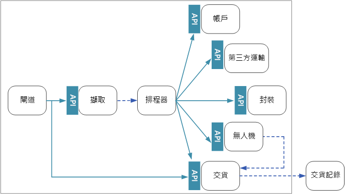
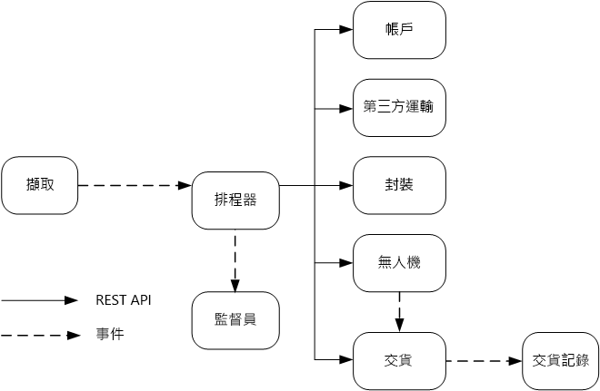

# 設計微服務：服務間通訊

微服務之間的通訊必須要有效率且強固。 因為會有許多小型服務進行互動以完成單一交易，這可能會是個挑戰。 在本章中，我們會關注非同步傳訊與同步 API 之間的取捨。 接著我們會關注在設計具有復原能力的服務間通訊時，會碰到的部分挑戰，以及服務網格所扮演的角色。

## 挑戰 

以下是一些服務對服務通訊時會面臨的主要挑戰。 本章中稍後說明的服務網格旨在處理當中的許多挑戰。

**復原能力。** 在任何一個微服務中，都有十幾個、甚至上百個執行個體。 會導致執行個體失敗的原因眾多。 有可能是節點層級失敗，例如硬體失敗或虛擬機器重新啟動。 執行個體可能會損毀，或因要求爆滿而無法處理任何新的要求。 其中任何一個事件都有可能導致網路呼叫失敗。 有兩種設計模式可協助讓服務對服務網路呼叫更具復原能力：

- **[重試](../patterns/retry.md)**。 網路呼叫可能會因為暫時性錯誤而失敗，而後者會自行解決。 通常呼叫者不會當場失敗，而會重試作業一定的次數，或是直到超過設定的逾時期間為止。 不過，若作業不具有等冪性，重試可能會導致非預期的副作用。 原始的呼叫可能已成功，但呼叫者卻未得到回應。 若呼叫者重試，則可能會叫用該作業兩次。 一般而言，重試 POST 或 PATCH 方法並不安全，因為這些方法不保證是等冪的。

- **[斷路器](../patterns/circuit-breaker.md)**。 失敗的要求過多可能會造成瓶頸，因為擱置中的要求會累積在佇列中。 這些已封鎖的要求可能會佔據重要的系統資源，例如記憶體、執行緒、資料庫連線等等，可能會造成串聯式失敗。 「斷路器」模式可防止服務重複嘗試很可能會失敗的作業。 

**負載平衡**。 服務「A」呼叫服務「B」時，要求必須觸達服務「B」的執行個體。 在 Kubernetes 中，`Service` 資源類型可為 Pod 群組提供穩定的 IP 位址。 通往服務 IP 位址的網路流量，會透過 iptable 規則轉送給 Pod。 依預設會隨機選擇 Pod。 服務網格 (請參閱下方) 可根據觀察到的延遲時間或其他度量，提供更加聰明的負載平衡演算法。

**分散式追蹤**。 單一交易可能會跨越多個服務。 這會讓您難以監視系統的整體效能和健康情況。 即使每個服務都會產生記錄和度量，若無法將其繫結在一起，則用途有限。 [記錄和監視](./logging-monitoring.md)一章中深入探討了分散式追蹤，但我們在此將其視為挑戰。

**服務版本設定**。 小組在部署新版本的服務時，必須避免中斷其他服務或依存該服務的外部用戶端。 此外，您可能會並存執行多個版本的服務，並將要求路由傳送到特定版本。 有關此問題的詳細討論，請參閱 [API 版本設定](./api-design.md#api-versioning)。

**TLS 加密和相互 TLS 驗證**。 基於安全性理由，建議您加密服務與 TLS 之間的流量，並使用相互 TLS 驗證來驗證呼叫者。

## 同步與非同步傳訊

微服務有兩種可用來與其他微服務進行通訊的基本傳訊模式。 

1. 同步通訊。 在此模式中，服務會使用 HTTP 或 gRPC 等通訊協定，來呼叫其他服務所公開的的 API。 這個選項是同步傳訊模式，因為呼叫者會等候來自接收者的回應。 

2. 非同步訊息傳遞。 在此模式中，服務會傳送訊息而不等候回應，且一或多個服務會以非同步方式處理訊息。

請務必區別非同步 I/O 和非同步通訊協定之間的不同。 非同步 I/O 指的是在 I/O 完成時不會封鎖呼叫執行緒。 這對效能而言很重要，但這是架構方面的實作詳細資料。 非同步通訊協定指的是傳送者不會等候回應。 即使 HTTP 用戶端在傳送要求時，可能會使用非同步 I/O，但 HTTP 仍屬同步通訊協定。 

每種模式都有其權衡取捨。 要求/回應是人們已充分理解的範例，因此我們可能會認為設計 API 比設計傳訊系統更好。 不過，非同步傳訊在微服務架構中具有某些非常有用的優勢：

- **可降低結合程度**。 訊息傳送者無須了解取用者。 

- **能有多個訂閱者**。 多個取用者可使用發行/訂閱模型來訂閱，以便接收事件。 請參閱[事件驅動架構樣式](/azure/architecture/guide/architecture-styles/event-driven)。

- **可隔離失敗**。 若取用者失敗，傳送者仍然可以傳送訊息。 取用者復原時就可得到訊息。 這項功能在微服務架構中特別有用，因為每個服務都有其自己的生命週期。 服務隨時都可能會停用，或由新版本的服務取代舊服務。 非同步傳訊可以處理間歇性停機。 相反地，同步 API 則需要下游服務可供使用，否則作業就會失敗。 
 
- **具有回應能力**。 若不等候下游服務，上游服務就可以更快回覆。 這在微服務架構中特別有用。 若有服務相依性鏈結存在 (服務 A 呼叫 B、服務 B 呼叫 C，依此類推)，則等候同步呼叫可能會導致無法接受的延遲。

- **負載調節**。 佇列可作為緩衝區來調節工作負載，讓接收者能以自己的步調來處理訊息。 

- **工作流程**。 透過在執行工作流程的每個步驟後對訊息進行檢查點設置，佇列可用來管理工作流程。

不過，想要有效使用非同步傳訊也有一些挑戰。

- **與傳訊基礎結構的結合程度**。 若使用特定的傳訊基礎結構，系統可能會與該基礎結構密不可分。 稍後要切換到其他傳訊基礎結構會很困難。

- **延遲**。 若訊息佇列已滿，作業的端對端延遲時間可能會變長。  

- **成本**。 輸送量很高時，傳訊基礎結構的貨幣成本可能會非常高。

- **複雜度**。 處理非同步傳訊不是簡單的工作。 例如，您必須處理重複的訊息 (無論是透過刪除重複資料，或是讓作業具有等冪性)。 此外，使用非同步傳訊也難以實作要求-回應語意。 若要傳送回應，您不但需要其他佇列，還需要能夠使要求和回應訊息相互關聯的方法。

- **輸送量**。 若訊息需要「佇列語意」，佇列可能會變成系統中的瓶頸。 每個訊息都需要至少一個佇列作業，以及一個清除佇列作業。 此外，在傳訊基礎結構內，佇列語意一般會需要某種鎖定機制。 如果佇列是受控服務，可能會有額外的延遲時間，因為佇列位在叢集的虛擬網路外部。 您可以批次處理訊息以減輕這些問題，但這會使程式碼變得很複雜。 若訊息不需要佇列語意，您也許可以使用 stream 事件來取代佇列。 如需詳細資訊，請參閱[事件驅動架構樣式](../guide/architecture-styles/event-driven.md)。  

## 無人機遞送：選擇傳訊模式

考量上述事項後，開發小組針對無人機遞送應用程式的設計，做出下列選擇

- 「擷取」服務會公開用戶端應用程式用來排程、更新或取消遞送的公用 REST API。

- 「擷取」服務會使用事件中樞將非同步訊息傳送到「排程器」服務。 要實作擷取所需的負載調節，會需要非同步訊息。 如需「擷取」和「排程器」服務的互動方式詳細資訊，請參閱[擷取與工作流程][ingestion-workflow]。

- 「帳戶」、「遞送」、「包裹」、「無人機」和「第三方運輸」服務全都會公開內部 REST API。 「排程器」服務會呼叫上述 API 來執行使用者要求。 使用同步 API 的原因之一是「排程器」需要得到來自各下游服務的回應。 若任何一個下游服務失敗，即代表整個作業失敗。 不過，潛在的問題是呼叫後端服務所造成的延遲時間。 

- 若任何一個下游服務具有非暫時性的失敗，就應該將整個交易標示為失敗。 為了處理這種情況，「排程器」服務會將非同步訊息傳送給「監督員」，讓「監督員」可以排程補償交易，如[擷取與工作流程][ingestion-workflow]一章中所述。   

- 「遞送」服務會公開用戶端可用以取得遞送狀態的公用 API。 在 [API 閘道](./gateway.md)一章中，我們會討論 API 閘道如何對用戶端隱藏基礎服務，如此用戶端就不會知道哪些服務公開了哪些 API。 

- 無人機在飛行的同時，「無人機」服務會傳送包含無人機目前位置和狀態的事件。 「遞送」服務會接聽這些事件，以便追蹤遞送狀態。

- 遞送狀態有所改變時，「遞送」服務會傳送遞送狀態事件 (例如 `DeliveryCreated` 或 `DeliveryCompleted`)。 任何服務都能訂閱這些事件。 在目前的設計中，「遞送」服務是唯一的訂閱者，但稍後可能會有其他訂閱者。 例如，系統可能會將事件傳送給即時分析服務。 而因為排程器無須等候回應，所以新增更多訂閱者並不會影響主要工作流程路徑。

請注意，遞送狀態事件是從無人機位置事件所衍生出來的。 例如，無人機到達遞送位置並丟下包裹時，「遞送」服務會將此行為轉譯成 DeliveryCompleted 事件。 這是以領域模型進行思考的範例。 如先前所述，無人機管理屬於不同的限界內容。 無人機事件會傳達無人機的實體位置。 相反地，遞送事件則代表遞送狀態的改變，而這是不同的商務實體。

## 使用服務網格

「服務網格」是種處理服務對服務通訊的軟體層。 服務網格旨在解決前一節中所列的許多疑慮，並將關於這些疑慮的責任從微服務本身移轉到共用層。 服務網格會扮演攔截叢集中微服務之間網路通訊的 Proxy 角色。 

> [!NOTE]
> 服務網格是[大使模式](../patterns/ambassador.md)的範例 &mdash; 這是種會代表應用程式傳送網路要求的協助程式服務。 

目前，Kubernetes 中服務網格的主要選項是 [linkerd](https://linkerd.io/) 和 [Istio](https://istio.io/)。 這兩種技術都在迅速發展中。 不過，linkerd 和 Istio 所具有的共通功能包括： 

- 根據觀察到的延遲時間或未處理的要求數目，在工作階段層級進行負載平衡。 這可以透過 Kubernetes 所提供的第 4 層負載平衡來改善效能。 

- 會根據 URL 路徑、主機標題、API 版本或其他應用程式層級的規則，來進行第 7 層路由傳送。

- 重試失敗的要求。 服務網格了解 HTTP 錯誤碼，並可自動重試失敗的要求。 您可以設定重試次數上限以及逾時期限，以便繫結延遲上限。 

- 進行斷路。 若執行個體的要求持續失敗，服務網格會暫時將其標示為停用。 輪詢期間過後，服務網格會重試執行個體。 您可以根據各種準則 (例如連續失敗次數) 來設定斷路器。  

- 服務網格會擷取關於服務間呼叫的度量，例如要求量、延遲、錯誤和成功率，以及回應大小。 服務網格也可透過在要求中新增每個躍點的相互關聯資訊，來實現分散式追蹤。

- 針對服務對服務呼叫，進行相互 TLS 驗證。

您需要服務網格嗎？ 網狀網格能為分散式系統帶來的附加價值肯定很吸引人。 若您沒有服務網格，就需要考量本章開頭所提到的各項挑戰。 就算沒有服務網格，仍可解決重試、斷路器和分散式追蹤之類的問題；但服務網格可將這些疑慮從個別服務移轉到專用層級中。 另一方面，服務網格仍是尚未完全成熟而相對較新的技術。 要部署服務網格會使設定和配置叢集更加複雜。 由於系統現在會透過服務網格 Proxy 來路由傳送要求，而且現在叢集中的每個節點上都有額外的服務在執行，因此這可能會對效能造成影響。 在生產環境中部署服務網格之前，您應該先徹底測試效能和負載。

> [!div class="nextstepaction"]
> [API 設計](./api-design.md)

<!-- links -->

[ingestion-workflow]: ./ingestion-workflow.md
