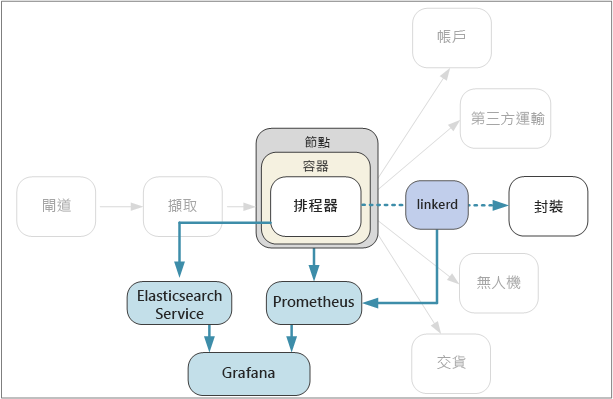

# <a name="designing-microservices-logging-and-monitoring"></a>設計微服務：記錄和監視

在任何複雜的應用程式中，總會有某個項目在某個時間點發生錯誤。 在微服務應用程式中，您需要追蹤數十項或甚至數百項服務的狀況。 記錄和監視都非常重要，可提供您系統的整體觀點。



在微服務架構中，要指出確切的錯誤原因或效能瓶頸特別具有挑戰性。 單一使用者作業可能橫跨多項服務。 服務可能會達到叢集內的網路 I/O 限制。 跨越服務的一連串呼叫可能會在系統中造成背壓，進而導致高延遲或連鎖性失敗。 此外，您通常不知道特定容器會在哪個節點中執行。 位於相同節點的容器可能會競爭有限的 CPU 或記憶體。

為了清楚了解發生什麼情況，您必須收集應用程式的遙測資料。  遙測資料可分為「記錄」和「計量」。 [Azure 監視器](/azure/monitoring-and-diagnostics/monitoring-overview)會在 Azure 平台收集記錄和計量。

**記錄**是在執行應用程式時發生的事件文字型記錄。 其中包括應用程式記錄 (追蹤陳述式) 或 Web 伺服器記錄之類的記錄。 記錄主要適合用於鑑證和根本原因分析。

「計量」是可以分析的數值。 您可以使用計量來即時 (或幾近即時) 觀察系統，或分析一段時間的效能趨勢。 計量可以進一步分類如下：

- **節點層級**計量，包括 CPU、記憶體、網路、磁碟和檔案系統使用狀況。 系統計量會協助您了解叢集中每個節點的資源配置，並針對極端值進行疑難排解。

- **容器**計量。 如果服務是在容器內執行，您需要在容器層級收集計量，而不只是在虛擬機器層級上收集。 您可以設定 Azure 監視器來監視 Azure Kubernetes Service (AKS) 中的容器工作負載。 如需詳細資訊，請參閱[適用於容器的 Azure 監視器概觀](/azure/monitoring/monitoring-container-insights-overview)。 對於其他容器協調器，請使用 [Log Analytics 中的容器監視解決方案](/azure/log-analytics/log-analytics-containers)。

- **應用程式**計量。 其中包括可了解服務行為的任何相關計量。 範例包括已排入佇列的輸入 HTTP 要求數目、要求延遲或訊息佇列長度。 應用程式也可以建立專屬於網域的自訂計量，例如每分鐘處理的商務交易數目。 使用 [Application Insights](/azure/application-insights/app-insights-overview) 啟用應用程式計量。

- **相依服務**計量。 服務可能會呼叫外部服務或端點，例如受控的 PaaS 服務或 SaaS 服務。 第三方服務可能會 (也可能不會) 提供任何計量。 若未提供，您必須憑藉自己的應用程式計量，來追蹤延遲和錯誤率的統計資料。

## <a name="considerations"></a>考量

[監視和診斷](../best-practices/monitoring.md)一文會說明監視應用程式的一般最佳做法。 以下是微服務架構內容中需要思考的一些特定事項。

**設定和管理**。 您將使用受控服務進行記錄和監視，或將記錄與監視元件部署為叢集內的容器嗎？ 如需這些選項的詳細討論，請參閱下面的[技術選項](#technology-options)一節。

**擷取率**。 輸送量是多少時，系統可以內嵌遙測事件？ 如果超出該比率會怎樣？ 例如，系統可能會使用戶端節流，在此情況下遙測資料會遺失，也可能縮小資料取樣。 有時候，您可藉由減少您所收集的資料量來減輕這個問題：

- 藉由計算統計資料 (例如平均值和標準差) 來彙總計量，並將該統計資料傳送到監視系統。
- 縮小資料取樣 &mdash; 也就是只處理某個百分比的事件。
- 將資料分批，以減少監視服務的網路呼叫次數。

**成本**。 內嵌和儲存遙測資料的成本很高，尤其需要大量磁碟區。 在某些情況下，甚至會超過執行應用程式的成本。 在此情況下，您可能需要藉由彙總、縮小資料取樣或將資料分批 (如上所述) 來減少遙測量。

**資料精確度**。 計量的精確度為何？ 使用平均值可避開極端值 (尤其是大規模資料)。 此外，如果取樣率太低，平均值可以讓資料中的波動變平滑。 看起來所有要求都有大約相同的端對端延遲，但實際上大部分的要求所費時間更長。

**延遲**。 若要啟用即時監視和警示，應該要能快速取得遙測資料。 資料出現在監視儀表板上要有多「即時」？ 經過幾秒鐘？ 超過一分鐘？

**儲存體。** 對記錄而言，最有效的做法是將記錄事件寫入叢集中的暫時儲存體，並且設定代理程式以將記錄檔送到更永續的儲存體。  資料最終應會移至長期儲存體，以便用於回溯分析。 微服務架構可產生大量的遙測資料，因此儲存該資料的成本是一大考量。 此外，也要考慮您查詢資料的方式。

**儀表板和視覺效果。** 您是否可以全面檢視系統 (涵蓋叢集內部和外部服務的所有服務)？ 如果您將遙測資料和記錄寫入到一個以上的位置，儀表板可以顯示所有位置且相互關聯嗎？ 監視儀表板至少應顯示下列資訊：

- 容量和擴增的整體資源配置。 這包括容器數目、檔案系統計量、網路及核心配置。
- 服務層級上相互關聯的容器計量。
- 與容器相互關聯的系統計量。
- 服務錯誤和極端值。

## <a name="distributed-tracing"></a>分散式追蹤

如先前所述，微服務的其中一項挑戰是了解跨服務的事件流程。 單一作業或交易可能牽涉到對多項服務的呼叫。 若要重新建構一連串完整的步驟，每項服務應該傳播「相互關聯識別碼」，以作為該作業的唯一識別碼。 相互關聯識別碼能進行跨服務的[分散式追蹤](https://microservices.io/patterns/observability/distributed-tracing.html)。

接收用戶端要求的第一項服務應產生相互關聯識別碼。 如果服務對另一項服務進行 HTTP 呼叫，它會將相互關聯識別碼放在要求標頭中。 同樣地，如果服務傳送非同步訊息，它會將相互關聯識別碼放在訊息中。 下游服務會繼續傳播相互關聯識別碼，使其流經整個系統。 此外，所有寫入應用程式計量或記錄事件的程式碼都應該包含相互關聯識別碼。

當服務呼叫相互關聯時，您可以計算作業計量，例如完整交易的端對端延遲、每秒中成功的交易數目，以及失敗交易的百分比。 在應用程式記錄中包含相互關聯識別碼，即可執行根本原因分析。 如果作業失敗，您可以找到相同作業下的所有服務呼叫記錄陳述式。

以下是實作分散式追蹤時的一些考量：

- 相互關聯識別碼目前沒有標準 HTTP 標頭。 您的小組應將自訂標頭值標準化。 您的記錄/監視架構或所選的服務網格可決定選項內容。

- 對於非同步的訊息，如果傳訊基礎結構支援將中繼資料新增到訊息，您應將相互關聯識別碼納入為中繼資料。 否則，將它納入為訊息結構描述的一部分。

- 您可能會傳送包含更豐富資訊的「相互關聯內容」 (例如呼叫端與被呼叫端的關聯性)，而不是單一不透明的識別碼。

- Azure Application Insights SDK 會自動將相互關聯內容插入至 HTTP 標頭中，並在 Application Insights 記錄中包含相互關聯識別碼。 如果您決定使用 Application Insights 內建的相互關聯功能，某些服務可能仍然需要明確地傳播相互關聯標頭 (視所使用的程式庫而定)。 如需詳細資訊，請參閱 [Application Insights 中的遙測相互關聯](/azure/application-insights/application-insights-correlation)。

- 如果您使用 Istio 或 linkerd 作為服務網格，這些技術會在透過服務網格 Proxy 路由傳送 HTTP 呼叫時自動產生相互關聯標頭。 服務應轉送相關的標頭。

  - Istio：[分散式要求追蹤](https://istio-releases.github.io/v0.1/docs/tasks/zipkin-tracing.html)
  - linkerd：[內容標頭](https://linkerd.io/config/1.3.0/linkerd/index.html#http-headers)

- 請考慮您彙總記錄的方式。 您可以將各小組在記錄中包含相互關聯識別碼的方式標準化。 使用結構化或半結構化格式 (例如 JSON)，並定義通用欄位以保留相互關聯識別碼。

## <a name="technology-options"></a>技術選項

**Application Insights** 是 Azure 中的受控服務，可內嵌和儲存遙測資料，並提供工具來分析及搜尋資料。 若要使用 Application Insights，請在您的應用程式中安裝檢測套件。 此套件會監視應用程式，並將遙測資料傳送至 Application Insights 服務。 它也可以從主機環境提取遙測資料。 Application Insights 會提供內建的相互關聯和相依性追蹤。 可讓您在同一個地方追蹤系統計量、應用程式計量及 Azure 服務計量。

如果資料速率超過最大限制，請留意 Application Insights 節流處理；如需詳細資訊，請參閱 [Application Insights 限制](/azure/azure-subscription-service-limits#application-insights-limits)。 單一作業可以產生多個遙測事件，所以如果應用程式遇到大量流量，就可能進行節流。 若要減輕這個問題，您可以執行取樣以減少遙測流量。 缺點是您的計量會比較不精確。 如需詳細資訊，請參閱[在 Application Insights 中取樣](/azure/application-insights/app-insights-sampling)。 您也可以預先彙總計量來減少資料量 &mdash; 也就是，計算統計資料值 (例如平均值和標準差)，以及傳送這些值 (而不是原始遙測資料)。 下列部落格文章說明大規模使用 Application Insights 的方法：[大規模使用 Azure 監視與分析](https://blogs.msdn.microsoft.com/azurecat/2017/05/11/azure-monitoring-and-analytics-at-scale/)/(英文)/。

此外，請確定您了解 Application Insights 的計價模型，因為您是根據資料量付費。 如需詳細資訊，請參閱[管理 Application Insights 中的價格和資料磁碟區](/azure/application-insights/app-insights-pricing)。 如果您的應用程式產生大量遙測，而您不想執行資料取樣或彙總，則 Application Insights 可能不是適當的選擇。

如果 Application Insights 不符合您的需求，以下是一些使用熱門開放原始碼技術的建議方法。

對於系統和容器計量，請考慮將計量匯出至時間序列資料庫，例如在叢集中執行的 **Prometheus** 或 **InfluxDB**。

- InfluxDB 是以推送為基礎的系統。 代理程式需要推送計量。 您可以使用 [Heapster][heapster]，這項服務會從 kubelet 收集整個叢集的計量、彙總此資料，並將它推送至 InfluxDB 或其他時間序列儲存體解決方案。 Azure Container Service 會將 Heapster 部署為叢集設定的一部份。 另一個選項是 [Telegraf](https://www.influxdata.com/time-series-platform/telegraf/)，這是用來收集和報告計量的代理程式。

- Prometheus 是以提取為基礎的系統。 它會定期從設定的位置抓取計量。 Prometheus 可以抓取 cAdvisor 或 kube-state-metrics 所產生的計量。 [kube-state-metrics][kube-state-metrics] 是一項服務，可從 Kubernetes API 伺服器收集計量並提供給 Prometheus (或與 Prometheus 用戶端端點相容的抓取工具) 使用。 有鑑於 Heapster 會彙總 Kubernetes 產生的計量並將它們轉送到接收，kube-state-metrics 會產生自己的計量並透過端點提供這些計量以便抓取。 對於系統計量，可使用[節點匯出工具](https://github.com/prometheus/node_exporter)，這是系統計量的 Prometheus 匯出工具。 Prometheus 支援浮點資料，但不支援字串資料，因此適用於系統計量，但不適用於記錄。

- 使用儀表板工具 (例如 **Kibana** 或 **Grafana**) 來視覺化和監視資料。 此儀表板服務也可以在叢集中的容器內執行。

對於應用程式記錄，請考慮使用 **Fluentd** 和 **Elasticsearch**。 Fluentd 是開放原始碼資料收集器，而 Elasticsearch 是為了作為搜尋引擎而最佳化的文件資料庫。 使用這個方法，每項服務都會將記錄傳送至 `stdout` 和 `stderr`，而 Kubernetes 會將這些串流寫入本機檔案系統。 Fluentd 可收集記錄，選擇性地以來自 Kubernetes 的其他中繼資料來豐富記錄，並將記錄傳送至 Elasticsearch。 使用 Kibana、Grafana 或類似工具來建立 Elasticsearch 的儀表板。 Fluentd 會在叢集中以 daemonset 的形式執行，這可確保每個節點都會被指派一個 Fluentd pod。 您可以將 Fluentd 設定為收集 kubelet 記錄和容器記錄。 若有大量記錄，將記錄寫入本機檔案系統可能形成效能瓶頸，特別是在相同節點上有多項服務正在執行時。 請在生產環境中監視磁碟延遲和檔案系統使用率。

使用 Fluentd 搭配 Elasticsearch 處理記錄的優點之一就是服務不需要任何額外的程式庫相依性。 每項服務只會寫入至 `stdout` 和 `stderr`，而 Fluentd 會執行將記錄匯出至 Elasticsearch 的程序。 此外，撰寫服務的小組不需要了解如何設定記錄基礎結構。 其中一項挑戰是針對生產部署設定 Elasticsearch 叢集，使其進行調整以處理您的流量。

另一個選項是將記錄傳送至 Operations Management Suite (OMS) Log Analytics。 [Log Analytics][log-analytics] 服務會將資料收集到中央存放庫中，也可將您應用程式使用的其他 Azure 服務資料合併在一起。 如需詳細資訊，請參閱[使用 Microsoft Operations Management Suite (OMS) 監視 Azure Container Service 叢集][k8s-to-oms]。

## <a name="example-logging-with-correlation-ids"></a>範例：記錄相互關聯識別碼

為了說明本章所討論的某些要點，以下是套件服務如何實作記錄功能的延伸範例。 套件服務是以 TypeScript 撰寫並使用 Node.js 適用的 [Koa](https://koajs.com/) Web 架構。 有幾個 Node.js 記錄程式庫可供選擇。 我們挑選了 [Winston](https://github.com/winstonjs/winston)，這是一個常見的記錄程式庫，經由測試，它可符合我們的效能需求。

為了封裝實作詳細資料，我們定義了抽象 `ILogger` 介面：

```ts
export interface ILogger {
    log(level: string, msg: string, meta?: any)
    debug(msg: string, meta?: any)
    info(msg: string, meta?: any)
    warn(msg: string, meta?: any)
    error(msg: string, meta?: any)
}
```

以下是可包裝 Winston 程式庫的 `ILogger` 實作。 其採用相互關聯識別碼作為建構函式參數，並將該識別碼插入至每則記錄訊息中。

```ts
class WinstonLogger implements ILogger {
    constructor(private correlationId: string) {}
    log(level: string, msg: string, payload?: any) {
        var meta : any = {};
        if (payload) { meta.payload = payload };
        if (this.correlationId) { meta.correlationId = this.correlationId }
        winston.log(level, msg, meta)
    }
  
    info(msg: string, payload?: any) {
        this.log('info', msg, payload);
    }
    debug(msg: string, payload?: any) {
        this.log('debug', msg, payload);
    }
    warn(msg: string, payload?: any) {
        this.log('warn', msg, payload);
    }
    error(msg: string, payload?: any) {
        this.log('error', msg, payload);
    }
}
```

封裝服務需要從 HTTP 要求擷取相互關聯識別碼。 例如，如果您使用 linkerd，則相互關聯識別碼會位於 `l5d-ctx-trace` 標頭。 在 Koa 中，HTTP 要求會儲存在內容物件中，以便通過要求處理管線。 我們可以定義中介軟體函式，以從內容取得相互關聯識別碼並初始化記錄器。 (Koa 中的中介軟體函式只是可針對每個要求執行的函式。)

```ts
export type CorrelationIdFn = (ctx: Context) => string;

export function logger(level: string, getCorrelationId: CorrelationIdFn) {
    winston.configure({
        level: level,
        transports: [new (winston.transports.Console)()]
        });
    return async function(ctx: any, next: any) {
        ctx.state.logger = new WinstonLogger(getCorrelationId(ctx));
        await next();
    }
}
```

此中介軟體會叫用呼叫端定義的函式 `getCorrelationId`，以取得相互關聯識別碼。 然後它會建立記錄器的執行個體及將它存放在 `ctx.state` 內，這是 Koa 中使用的索引鍵值字典，可透過管線傳遞資訊。

記錄器中介軟體會在啟動時新增至管線：

```ts
app.use(logger(Settings.logLevel(), function (ctx) {
    return ctx.headers[Settings.correlationHeader()];  
}));
```

一切設定好之後，就可以輕鬆地將記錄陳述式新增至程式碼。 例如，以下是查閱套件的方法。 其會呼叫 `ILogger.info` 方法兩次。

```ts
async getById(ctx: any, next: any) {
  var logger : ILogger = ctx.state.logger;
  var packageId = ctx.params.packageId;
  logger.info('Entering getById, packageId = %s', packageId);

  await next();

  let pkg = await this.repository.findPackage(ctx.params.packageId)

  if (pkg == null) {
    logger.info(`getById: %s not found`, packageId);
    ctx.response.status= 404;
    return;
  }

  ctx.response.status = 200;
  ctx.response.body = this.mapPackageDbToApi(pkg);
}
```

我們不需要在記錄陳述式中包含相互關聯識別碼，因為這是由中介軟體函式自動完成。 這會使記錄程式碼變得更整潔，並減少開發人員忘記包含相互關聯識別碼的機會。 而因為所有記錄陳述式都會使用抽象 `ILogger` 介面，所以之後可輕易取代記錄器實作。

> [!div class="nextstepaction"]
> [持續整合和傳遞](./ci-cd.md)

<!-- links -->

[app-insights]: /azure/application-insights/app-insights-overview
[heapster]: https://github.com/kubernetes/heapster
[kube-state-metrics]: https://github.com/kubernetes/kube-state-metrics
[k8s-to-oms]: /azure/container-service/kubernetes/container-service-kubernetes-oms
[log-analytics]: /azure/log-analytics/
