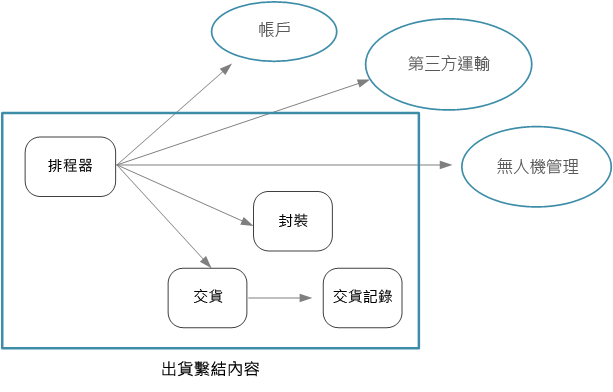
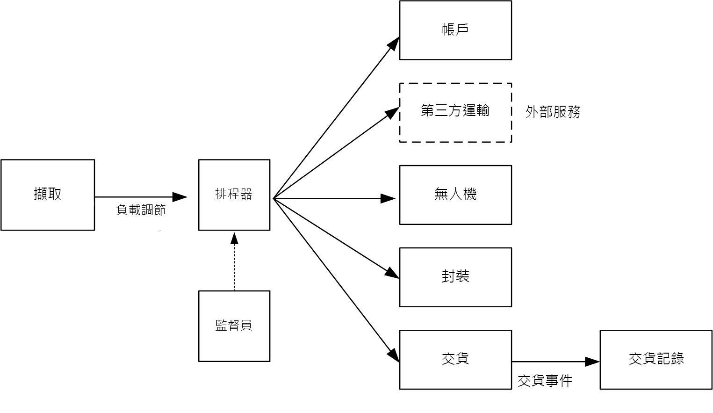

# 設計微服務：識別微服務界限

微服務的合適大小為何？ 您常會聽到「不要太大也不要太小」的說法，這麼說當然沒錯，然而這樣的說法在實務上沒什麼用處。 不過，如果您一開始就審慎設計領域模型，那麼您就可以更加容易地理解微服務。

## 從網域模型到微服務

在[上一章](./domain-analysis.md)中，我們已經定義一組供「無人機遞送」應用程式使用的限界內容。 接著，我們更仔細地查看了這些限界內容的其中一個 (也就是「出貨」限界內容)，並找出該限界內容的一組實體、彙總和領域服務。

而現在，我們已準備好從領域模型階段進入應用程式設計階段。 以下是可用來從領域模型衍生出微服務的方法。

1. 從限界內容來開始。 一般來說，微服務中的功能應該不會跨越多個限界內容。 根據定義，限界內容會標示特定領域模型的界限。 如果您發現某個微服務與不同的領域模型混合在一起，這表示您可能需要回頭重新琢磨您的領域分析。

2. 接著，查看領域模型中的彙總。 彙總通常很適合作為微服務。 設計良好的彙總會展現出擁有良好設計之微服務的許多特性，例如：

    - 彙總是衍生自商務需求而非出於技術方面的顧慮 (例如資料存取或傳訊)。  
    - 彙總應該要高度銜接各項功能。
    - 彙總是持續性的界限。
    - 彙總應該要鬆散結合。 
    
3. 領域服務也十分適合作為微服務。 領域服務是跨多個彙總的無狀態作業。 涉及數個微服務的工作流程便是典型的範例。 我們會在「無人機遞送」應用程式中看到這樣的範例。

4. 最後要考慮非功能性的需求。 審視各項因素，例如小組規模、資料類型、技術、延展性需求、可用性需求和安全性需求。 這些因素可能會讓您進一步將微服務分解成兩個以上較小的服務，或反過來將數個微服務合併成一個。 

在識別應用程式中的各個微服務後，請根據下列準則驗證您的設計：

- 每一項服務都各肩負一項責任。
- 服務之間不會頻繁地通訊。 如果將功能分割成兩個服務會使這兩個服務頻繁通訊，便可能表示這些功能應該放在同一個服務內。
- 每個服務都夠小，以便可由小型小組獨立工作來加以建置。
- 沒有交互相依性，因此不必將兩個以上的服務一起部署。 在部署某項服務時，應該要永遠不必重新部署任何其他服務。
- 服務未緊密結合，並且可以獨立進化。
- 您的服務界限不會產生資料一致性或完整性的問題。 有時候您必須透過將功能放入單一微服務中，以保持資料一致性。 話雖如此，請考慮您是否真的需要強式一致性。 您可以找到策略來解決分散式系統的最終一致性問題，而且拆解服務所能帶來的好處，通常會勝過管理最終一致性所帶來的麻煩。

最重要的是，務必要務實，並請記得領域導向的設計是反覆不斷的程序。 當您猶豫不定時，請從更粗略的微服務來開始著手。 將微服務分割成兩個較小的服務，會比重構數個現有微服務的功能來得簡單。
  
## 無人機遞送：定義微服務

請回想一下，開發小組已經識別出四個彙總 (分別是「遞送」、「包裹」、「無人機」和「帳戶」) 以及兩個領域服務 (分別是「排程器」和「監督員」)。 

遞送與包裹很明顯可作為微服務。 排程器和監督員會協調其他微服務所執行的活動，因此也應該將這些領域服務當做微服務來實作。  

無人機和帳戶則很有趣，因為這兩者屬於其他限界內容。 其中一個選項是讓排程器直接呼叫無人機和帳戶限界內容。 另一個選項則是在出貨限界內容中建立無人機和帳戶微服務。 這些微服務會居中協調限界內容，方法是藉由將更適合出貨內容的 API 或資料結構描述予以公開。

無人機和帳戶限界內容的詳細資料不再本指南的說明範圍內，因此我們在參考實作中為其建立了模擬服務。 但在此情況下，需要考量以下因素：

- 直接呼叫到另一個限界內容會有何網路負荷？ 

- 其他限界內容的資料結構描述是否適用於此內容，或是為此限界內容專門打造一個結構描述會更好？ 

- 其他限界內容是否為繼承系統？ 如果是，您可能要建立一項服務來作為[防損毀層](../patterns/anti-corruption-layer.md)，以在繼承系統和新型應用程式之間進行轉換。 

- 小組結構為何？ 是否能輕易地與負責其他限界內容的小組進行溝通？ 如果不行，則建立可居中協調兩個內容的服務會有助於減輕跨小組溝通的成本。

到目前為止，我們還未考慮過任何非功能性需求。 開發小組考慮到應用程式的輸送量需求，決定要建立個別的擷取微服務，來負責擷取用戶端要求。 此微服務會藉由將內送要求放入緩衝區進行處理，來實作[負載調節](../patterns/queue-based-load-leveling.md)。 排程器會從緩衝區讀取要求，並執行工作流程。 

非功能性需求導致開發小組額外建立了一項服務。 到目前為止的所有服務皆與即時排程和遞送包裹的程序有關。 但是，系統還必須將每一次遞送的記錄儲存在長期儲存體中，以便進行資料分析。 開發小組考慮由遞送服務負責這項工作。 不過，歷史分析作業和進行中之作業的資料儲存需求大不相同 (請參閱[資料考量](./data-considerations.md))。 因此，該小組決定另外建立一個遞送記錄服務，由其接聽遞送服務的 DeliveryTracking 事件，並將這些事件寫入長期儲存體中。

下圖顯示到目前為止的設計：
 

## 選擇計算選項

*計算*一詞是指您的應用程式執行所在運算資源的裝載模型。 應用在微服務架構方面，有兩種非常熱門的方法：

- 服務協調器，可管理專用節點 (VM) 上所執行的服務。
- 使用「函式即服務」(FaaS) 的無伺服器架構。 

雖然這兩種方法並不是唯一的選項，卻是已獲證實可行的微服務建置方法。 應用程式可同時包含這兩種方法。

### 服務協調器

協調器負責處理與一組服務的部署及管理有關的工作。 這些工作包括在節點上放置服務、監視服務的健康情況、重新啟動狀況不良的服務、在服務執行個體間負載平衡網路流量、服務探索、調整服務執行個體數目，以及套用組態更新。 熱門協調器包括 Kubernetes、Service Fabric、DC/OS 和 Docker Swarm。

在 Azure 平台上，請考慮下列選項：

- [Azure Kubernetes Service](/azure/aks/) (AKS) 是受控 Kubernetes 服務。 AKS 會佈建 Kubernetes 並公開 Kubernetes API 端點，但會裝載和管理 Kubernetes 控制平面，以便執行自動升級、自動修補、自動調整和其他管理工作。 您可以將 AKS 視為「Kubernetes API 即服務」。 

- [Service Fabric](/azure/service-fabric/) 是一個分散式系統平台，可讓您封裝、部署及管理微服務。 您可以將微服務部署至 Service Fabric，以作為容器、二進位可執行檔或作為 [Reliable Services](/azure/service-fabric/service-fabric-reliable-services-introduction)。 使用 Reliable Services 程式設計模型，服務便可直接使用 Service Fabric 程式設計 API 來查詢系統、回報健康情況、接收有關組態和程式碼變更的通知，並探索其他服務。 與 Service Fabric 的主要差異在於，其非常著重在使用 [Reliable Collections](/azure/service-fabric/service-fabric-reliable-services-reliable-collections) 來建置具狀態服務。

- [Azure Container Service](/azure/container-service/) (ACS) 這個 Azure 服務可讓您部署立即可以從事生產的 DC/OS、Docker Swarm 或 Kubernetes 叢集。 

  > [!NOTE]
  > 雖然 Kubernetes 由 ACS 支援，我們建議在 Azure 上執行 Kubernetes 時使用 AKS。 AKS 提供增強的管理功能和成本效益。

### 容器

有時候人們會將容器和微服務看作是一樣的東西。 雖然事實並非如此 (不需要容器就能建置微服務)，但容器的確具有和微服務極其相關的一些優點，例如：

- **可攜性**。 容器映像是不需要安裝程式庫或其他相依性就能執行的獨立套件。 這項特性使其部署作業變得簡單。 容器可以快速加以啟動和停止，因此您可以啟動新的執行個體，以處理更多負載或是從節點失敗中復原。 

- **密度**. 相較於執行虛擬機器，容器因為會共用作業系統資源，因此所需資源不多。 這項特性讓我們可以將多個容器封裝至單一節點，而這個能力在應用程式包含許多小型服務時會特別有用。

- **資源隔離**. 您可以限制容器可以使用的記憶體和 CPU 數量，這可協助確保失控程序不會耗盡主機資源。 如需詳細資訊，請參閱[隔艙模式](../patterns/bulkhead.md)。

### 無伺服器 (函式即服務)

使用[無伺服器](https://azure.microsoft.com/solutions/serverless/)架構時，您不需管理 VM 或虛擬網路基礎結構。 相反地，您會部署程式碼，而主機服務則負責將該程式碼放到 VM 並加以執行。 這種方法往往會偏好使用以事件型觸發程序來進行協調的小型函式。 例如，放到佇列的訊息可能會觸發函式，以讀取佇列並處理訊息。

[Azure Functions][functions] 是無伺服器的計算服務，可支援各種函式觸發程序，包括 HTTP 要求、服務匯流排佇列和事件中樞事件。 如需完整清單，請參閱 [Azure Functions 觸發程序和繫結概念][functions-triggers]。 也請考慮 [Azure Event Grid][event-grid]，這是 Azure 中的受控事件路由服務。

### 該選擇協調器還是無伺服器？

以下是在協調器方法與無伺服器方法之間做選擇時所要考慮的部分因素。

**管理性**。無伺服器應用程式管理容易，因為該平台會為您管理所有的計算資源。 雖然協調器會抽走某些叢集管理和設定工作，但它不會完全掩蓋掉基礎 VM。 使用協調器時，您必須考慮到負載平衡、CPU、記憶體使用量和網路等問題。

**彈性和控制**。 協調器可讓您極大程度地控制服務和叢集的設定及管理功能。 代價是複雜性會提高。 若使用無伺服器架構，您則要放棄某種程度的控制能力，因為這些詳細資料會被抽離。

**可攜性**。 此處所列的所有協調器 (Kubernetes、DC/OS、Docker Swarm 和 Service Fabric) 可在內部部署環境執行，也可以在多個公用雲端中執行。 

**應用程式整合**. 使用無伺服器架構來建置複雜的應用程式並不是件容易的事。 在 Azure 中進行此作業的其中一個方法是使用 [Azure Logic Apps](/azure/logic-apps/) 來協調一組 Azure Functions。 如需此方法的範例，請參閱[建立與 Azure Logic Apps 整合的函式](/azure/azure-functions/functions-twitter-email)。

**成本**。 使用協調器時，您需要為叢集中正在執行的 VM 支付費用。 使用無伺服器應用程式時，則只需為實際耗用的計算資源支付費用。 在這兩種情況中，您都需要考量任何其他服務 (例如，儲存體、資料庫和傳訊服務) 的成本。

**延展性**。 Azure Functions 會根據內送事件數量自動進行調整，以符合需求。 使用協調器時，您可以透過增加叢集中執行的服務執行個體數目，來進行相應放大。 您也可以透過對叢集新增額外的 VM 來進行調整。

我們的參考實作主要是使用 Kubernetes，但我們也的確有對某項服務 (也就是遞送記錄服務) 使用 Azure Functions。 Azure Functions 非常適合用於此特定服務，因為它是事件驅動的工作負載。 藉由使用事件中樞觸發程序來叫用函式，服務所需的程式碼數量已降至最低。 此外，遞送記錄服務並非主要工作流程的一部分，因此在 Kubernetes 叢集之外執行此服務並不會影響使用者所起始之作業的端對端延遲。 

> [!div class="nextstepaction"]
> [資料考量](./data-considerations.md)

<!-- links -->

[acs-engine]: https://github.com/Azure/acs-engine
[acs-faq]: /azure/container-service/dcos-swarm/container-service-faq
[event-grid]: /azure/event-grid/
[functions]: /azure/azure-functions/functions-overview
[functions-triggers]: /azure/azure-functions/functions-triggers-bindings
