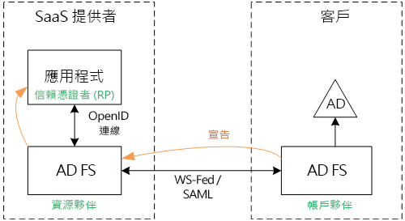
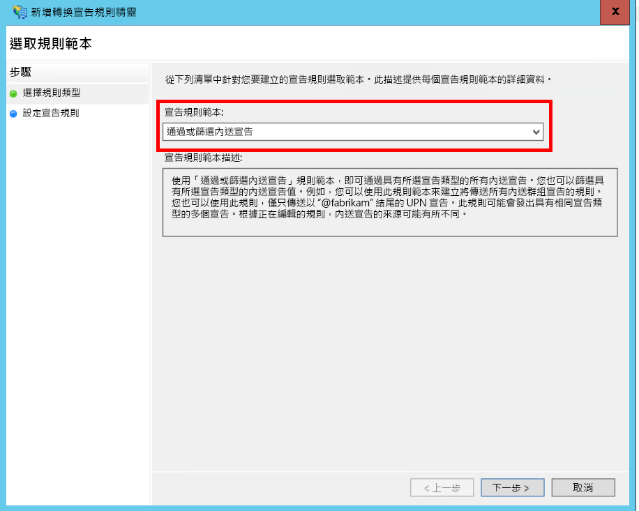
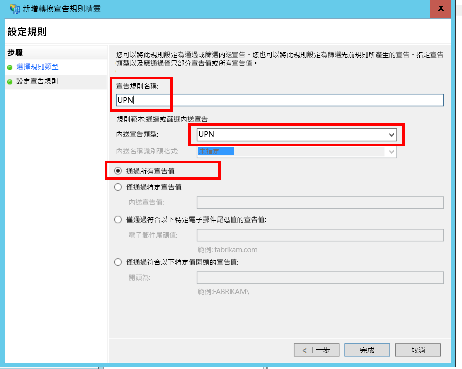
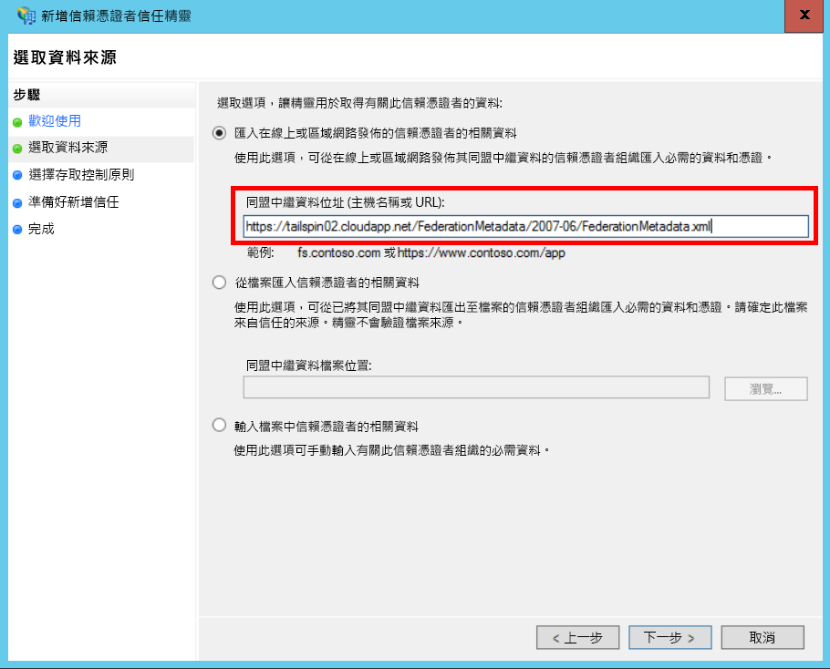
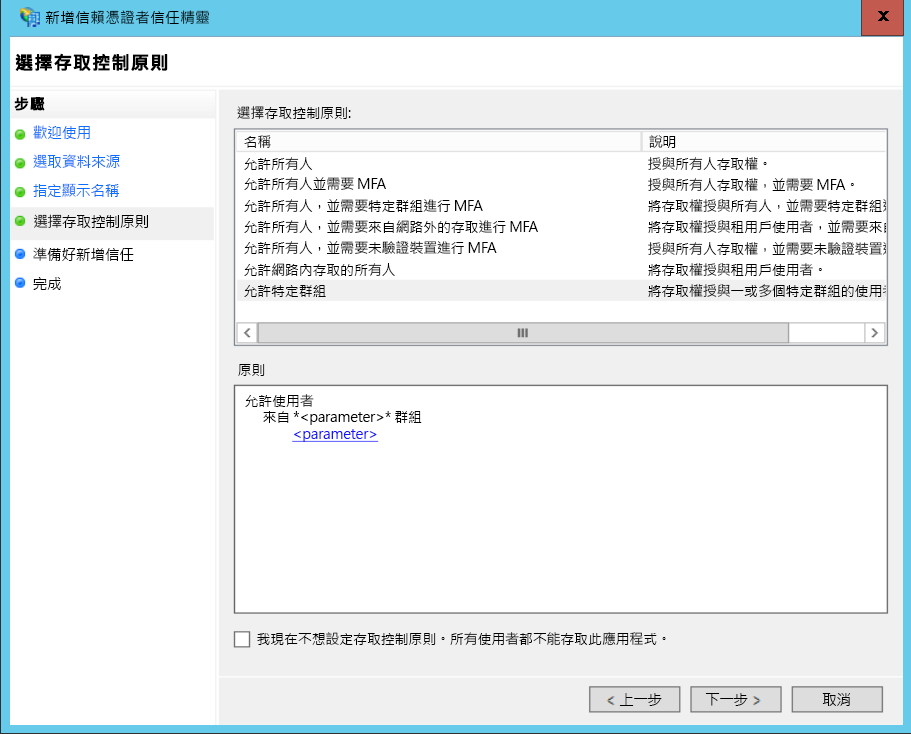
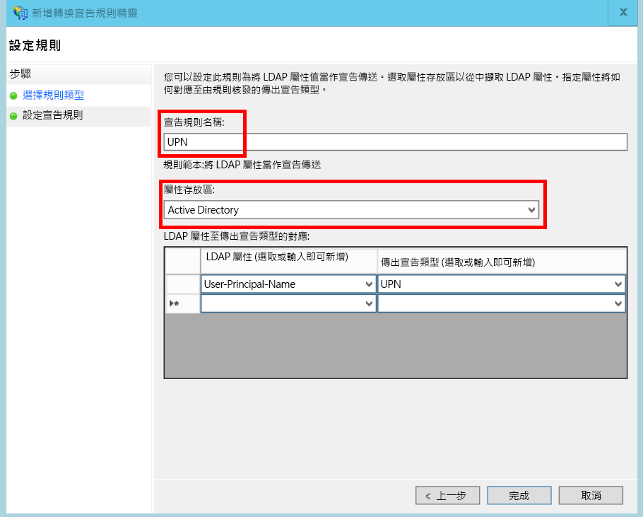
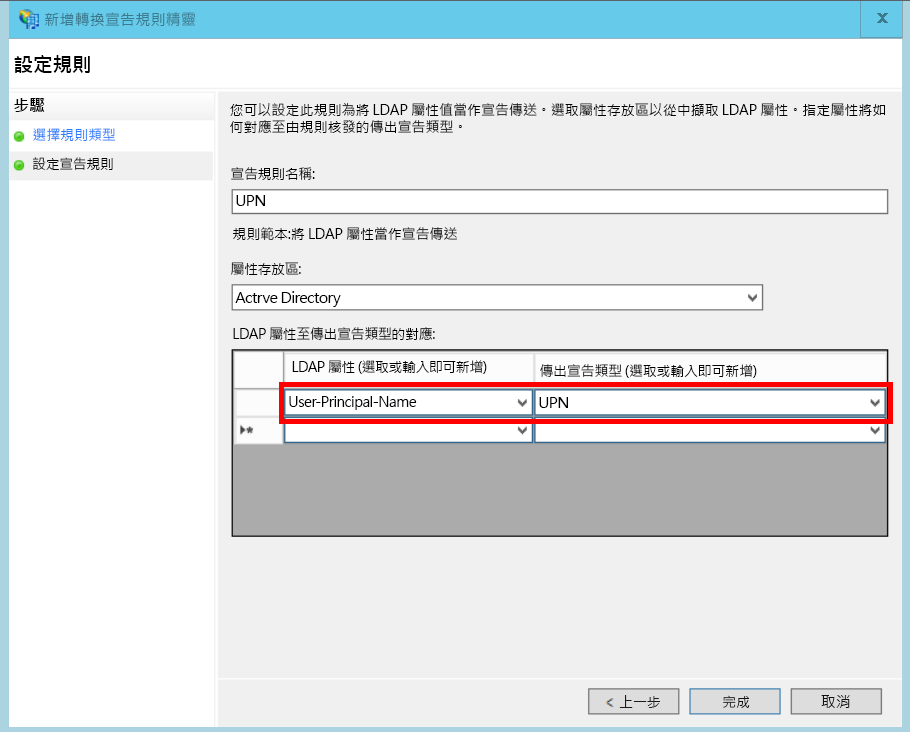

# <a name="federate-with-a-customers-ad-fs"></a><span data-ttu-id="e1cfd-103">與客戶的 AD FS 同盟</span><span class="sxs-lookup"><span data-stu-id="e1cfd-103">Federate with a customer's AD FS</span></span>

<span data-ttu-id="e1cfd-104">本文說明多租用戶 SaaS 應用程式如何透過 Active Directory 同盟服務 (AD FS) 支援驗證，以便與客戶的 AD FS 同盟。</span><span class="sxs-lookup"><span data-stu-id="e1cfd-104">This article describes how a multi-tenant SaaS application can support authentication via Active Directory Federation Services (AD FS), in order to federate with a customer's AD FS.</span></span>

## <a name="overview"></a><span data-ttu-id="e1cfd-105">概觀</span><span class="sxs-lookup"><span data-stu-id="e1cfd-105">Overview</span></span>
<span data-ttu-id="e1cfd-106">Azure Active Directory (Azure AD) 可輕鬆地登入 Azure AD 租用戶的使用者，包括 Office365 和 Dynamics CRM Online 客戶。</span><span class="sxs-lookup"><span data-stu-id="e1cfd-106">Azure Active Directory (Azure AD) makes it easy to sign in users from Azure AD tenants, including Office365 and Dynamics CRM Online customers.</span></span> <span data-ttu-id="e1cfd-107">但是在公司內部網路使用內部部署 Active Directory 的客戶如何呢？</span><span class="sxs-lookup"><span data-stu-id="e1cfd-107">But what about customers who use on-premise Active Directory on a corporate intranet?</span></span>

<span data-ttu-id="e1cfd-108">這些客戶的其中一個選項是使用 [Azure AD Connect]來同步處理其內部部署 AD 與 Azure AD。</span><span class="sxs-lookup"><span data-stu-id="e1cfd-108">One option is for these customers to sync their on-premise AD with Azure AD, using [Azure AD Connect].</span></span> <span data-ttu-id="e1cfd-109">不過，有些客戶可能會因為公司 IT 原則或其他原因而無法使用這種方式。</span><span class="sxs-lookup"><span data-stu-id="e1cfd-109">However, some customers may be unable to use this approach, due to corporate IT policy or other reasons.</span></span> <span data-ttu-id="e1cfd-110">在此情況下，另一個選項是透過 Active Directory 同盟服務 (AD FS) 建立同盟。</span><span class="sxs-lookup"><span data-stu-id="e1cfd-110">In that case, another option is to federate through Active Directory Federation Services (AD FS).</span></span>

<span data-ttu-id="e1cfd-111">若要啟用此案例：</span><span class="sxs-lookup"><span data-stu-id="e1cfd-111">To enable this scenario:</span></span>

* <span data-ttu-id="e1cfd-112">客戶必須有網際網路面向的 AD FS 伺服器陣列。</span><span class="sxs-lookup"><span data-stu-id="e1cfd-112">The customer must have an Internet-facing AD FS farm.</span></span>
* <span data-ttu-id="e1cfd-113">SaaS 提供者會部署自己的 AD FS 伺服器陣列。</span><span class="sxs-lookup"><span data-stu-id="e1cfd-113">The SaaS provider deploys their own AD FS farm.</span></span>
* <span data-ttu-id="e1cfd-114">客戶和 SaaS 提供者必須設定 [同盟信任]。</span><span class="sxs-lookup"><span data-stu-id="e1cfd-114">The customer and the SaaS provider must set up [federation trust].</span></span> <span data-ttu-id="e1cfd-115">這是手動程序。</span><span class="sxs-lookup"><span data-stu-id="e1cfd-115">This is a manual process.</span></span>

<span data-ttu-id="e1cfd-116">信任關係中有三個主要角色：</span><span class="sxs-lookup"><span data-stu-id="e1cfd-116">There are three main roles in the trust relation:</span></span>

* <span data-ttu-id="e1cfd-117">客戶的 AD FS 是 [帳戶夥伴]，負責驗證來自客戶 AD 的使用者，並使用使用者宣告建立安全性權杖。</span><span class="sxs-lookup"><span data-stu-id="e1cfd-117">The customer's AD FS is the [account partner], responsible for authenticating users from the customer's AD, and creating security tokens with user claims.</span></span>
* <span data-ttu-id="e1cfd-118">SaaS 提供者的 AD FS 是 [資源夥伴]，它會信任帳戶夥伴及接收使用者宣告。</span><span class="sxs-lookup"><span data-stu-id="e1cfd-118">The SaaS provider's AD FS is the [resource partner], which trusts the account partner and receives the user claims.</span></span>
* <span data-ttu-id="e1cfd-119">應用程式會設定為 SaaS 提供者的 AD FS 中的信賴憑證者 (RP)。</span><span class="sxs-lookup"><span data-stu-id="e1cfd-119">The application is configured as a relying party (RP) in the SaaS provider's AD FS.</span></span>
  
  

> [!NOTE]
> <span data-ttu-id="e1cfd-121">在本文中，我們假設應用程式會使用 OpenID Connect 做為驗證通訊協定。</span><span class="sxs-lookup"><span data-stu-id="e1cfd-121">In this article, we assume the application uses OpenID connect as the authentication protocol.</span></span> <span data-ttu-id="e1cfd-122">另一個選項是使用 WS-同盟。</span><span class="sxs-lookup"><span data-stu-id="e1cfd-122">Another option is to use WS-Federation.</span></span>
> 
> <span data-ttu-id="e1cfd-123">對於 OpenID Connect，SaaS 提供者必須使用在 Windows Server 2016 中執行的 AD FS 2016。</span><span class="sxs-lookup"><span data-stu-id="e1cfd-123">For OpenID Connect, the SaaS provider must use AD FS 2016, running in Windows Server 2016.</span></span> <span data-ttu-id="e1cfd-124">AD FS 3.0 不支援 OpenID Connect。</span><span class="sxs-lookup"><span data-stu-id="e1cfd-124">AD FS 3.0 does not support OpenID Connect.</span></span>
> 
> <span data-ttu-id="e1cfd-125">ASP.NET Core 不包含 WS-同盟的現成支援。</span><span class="sxs-lookup"><span data-stu-id="e1cfd-125">ASP.NET Core does not include out-of-the-box support for WS-Federation.</span></span>
> 
> 

<span data-ttu-id="e1cfd-126">如需搭配使用 WS-同盟與 ASP.NET 4 的範例，請參閱 [active-directory-dotnet-webapp-wsfederation 範例][active-directory-dotnet-webapp-wsfederation]。</span><span class="sxs-lookup"><span data-stu-id="e1cfd-126">For an example of using WS-Federation with ASP.NET 4, see the [active-directory-dotnet-webapp-wsfederation sample][active-directory-dotnet-webapp-wsfederation].</span></span>

## <a name="authentication-flow"></a><span data-ttu-id="e1cfd-127">驗證流程</span><span class="sxs-lookup"><span data-stu-id="e1cfd-127">Authentication flow</span></span>
1. <span data-ttu-id="e1cfd-128">當使用者按一下 [登入] 時，應用程式會重新導向至 SaaS 提供者的 AD FS 上的 OpenID Connect Endpoint。</span><span class="sxs-lookup"><span data-stu-id="e1cfd-128">When the user clicks "sign in", the application redirects to an OpenID Connect endpoint on the SaaS provider's AD FS.</span></span>
2. <span data-ttu-id="e1cfd-129">使用者會輸入自己的組織使用者名稱 ("`alice@corp.contoso.com`")。</span><span class="sxs-lookup"><span data-stu-id="e1cfd-129">The user enters his or her organizational user name ("`alice@corp.contoso.com`").</span></span> <span data-ttu-id="e1cfd-130">AD FS 會使用主領域探索來重新導向至客戶的 AD FS，以便使用者輸入其認證。</span><span class="sxs-lookup"><span data-stu-id="e1cfd-130">AD FS uses home realm discovery to redirect to the customer's AD FS, where the user enters their credentials.</span></span>
3. <span data-ttu-id="e1cfd-131">客戶的 AD FS 會使用 WF-同盟 (或 SAML)，將使用者宣告傳送至 SaaS 提供者的 AD FS。</span><span class="sxs-lookup"><span data-stu-id="e1cfd-131">The customer's AD FS sends user claims to the SaaS provider's AD FS, using WF-Federation (or SAML).</span></span>
4. <span data-ttu-id="e1cfd-132">宣告會使用 OpenID Connect 從 AD FS 流向應用程式。</span><span class="sxs-lookup"><span data-stu-id="e1cfd-132">Claims flow from AD FS to the app, using OpenID Connect.</span></span> <span data-ttu-id="e1cfd-133">這需要從 WS-同盟進行通訊協定轉換。</span><span class="sxs-lookup"><span data-stu-id="e1cfd-133">This requires a protocol transition from WS-Federation.</span></span>

## <a name="limitations"></a><span data-ttu-id="e1cfd-134">限制</span><span class="sxs-lookup"><span data-stu-id="e1cfd-134">Limitations</span></span>
<span data-ttu-id="e1cfd-135">根據預設，信賴憑證者應用程式只會收到下表所示之 id_token 中可用的一組固定宣告。</span><span class="sxs-lookup"><span data-stu-id="e1cfd-135">By default, the relying party application receives only a fixed set of claims available in the id_token, shown in the following table.</span></span> <span data-ttu-id="e1cfd-136">使用 AD FS 2016 時，您可以在 OpenID Connect 案例中自訂 id_token。</span><span class="sxs-lookup"><span data-stu-id="e1cfd-136">With AD FS 2016, you can customize the id_token in OpenID Connect scenarios.</span></span> <span data-ttu-id="e1cfd-137">如需詳細資訊，請參閱[在 AD FS 中自訂識別碼權杖](/windows-server/identity/ad-fs/development/customize-id-token-ad-fs-2016)。</span><span class="sxs-lookup"><span data-stu-id="e1cfd-137">For more information, see [Custom ID Tokens in AD FS](/windows-server/identity/ad-fs/development/customize-id-token-ad-fs-2016).</span></span>

| <span data-ttu-id="e1cfd-138">宣告</span><span class="sxs-lookup"><span data-stu-id="e1cfd-138">Claim</span></span> | <span data-ttu-id="e1cfd-139">說明</span><span class="sxs-lookup"><span data-stu-id="e1cfd-139">Description</span></span> |
| --- | --- |
| <span data-ttu-id="e1cfd-140">aud</span><span class="sxs-lookup"><span data-stu-id="e1cfd-140">aud</span></span> |<span data-ttu-id="e1cfd-141">對象。</span><span class="sxs-lookup"><span data-stu-id="e1cfd-141">Audience.</span></span> <span data-ttu-id="e1cfd-142">做為宣告發出對象的應用程式。</span><span class="sxs-lookup"><span data-stu-id="e1cfd-142">The application for which the claims were issued.</span></span> |
| <span data-ttu-id="e1cfd-143">authenticationinstant</span><span class="sxs-lookup"><span data-stu-id="e1cfd-143">authenticationinstant</span></span> |<span data-ttu-id="e1cfd-144">[驗證時刻]。</span><span class="sxs-lookup"><span data-stu-id="e1cfd-144">[Authentication instant].</span></span> <span data-ttu-id="e1cfd-145">發生驗證的時間。</span><span class="sxs-lookup"><span data-stu-id="e1cfd-145">The time at which authentication occurred.</span></span> |
| <span data-ttu-id="e1cfd-146">c_hash</span><span class="sxs-lookup"><span data-stu-id="e1cfd-146">c_hash</span></span> |<span data-ttu-id="e1cfd-147">程式碼的雜湊值。</span><span class="sxs-lookup"><span data-stu-id="e1cfd-147">Code hash value.</span></span> <span data-ttu-id="e1cfd-148">這是權杖內容的雜湊。</span><span class="sxs-lookup"><span data-stu-id="e1cfd-148">This is a hash of the token contents.</span></span> |
| <span data-ttu-id="e1cfd-149">exp</span><span class="sxs-lookup"><span data-stu-id="e1cfd-149">exp</span></span> |<span data-ttu-id="e1cfd-150">[到期時間]。</span><span class="sxs-lookup"><span data-stu-id="e1cfd-150">[Expiration time].</span></span> <span data-ttu-id="e1cfd-151">此時間過後，就不會再接受該權杖。</span><span class="sxs-lookup"><span data-stu-id="e1cfd-151">The time after which the token will no longer be accepted.</span></span> |
| <span data-ttu-id="e1cfd-152">iat</span><span class="sxs-lookup"><span data-stu-id="e1cfd-152">iat</span></span> |<span data-ttu-id="e1cfd-153">發出時間。</span><span class="sxs-lookup"><span data-stu-id="e1cfd-153">Issued at.</span></span> <span data-ttu-id="e1cfd-154">權杖的發出時間。</span><span class="sxs-lookup"><span data-stu-id="e1cfd-154">The time when the token was issued.</span></span> |
| <span data-ttu-id="e1cfd-155">iss</span><span class="sxs-lookup"><span data-stu-id="e1cfd-155">iss</span></span> |<span data-ttu-id="e1cfd-156">簽發者。</span><span class="sxs-lookup"><span data-stu-id="e1cfd-156">Issuer.</span></span> <span data-ttu-id="e1cfd-157">此宣告的值一律是資源夥伴的 AD FS。</span><span class="sxs-lookup"><span data-stu-id="e1cfd-157">The value of this claim is always the resource partner's AD FS.</span></span> |
| <span data-ttu-id="e1cfd-158">name</span><span class="sxs-lookup"><span data-stu-id="e1cfd-158">name</span></span> |<span data-ttu-id="e1cfd-159">使用者名稱。</span><span class="sxs-lookup"><span data-stu-id="e1cfd-159">User name.</span></span> <span data-ttu-id="e1cfd-160">範例： `john@corp.fabrikam.com`</span><span class="sxs-lookup"><span data-stu-id="e1cfd-160">Example: `john@corp.fabrikam.com`</span></span> |
| <span data-ttu-id="e1cfd-161">nameidentifier</span><span class="sxs-lookup"><span data-stu-id="e1cfd-161">nameidentifier</span></span> |<span data-ttu-id="e1cfd-162">[名稱識別碼]。</span><span class="sxs-lookup"><span data-stu-id="e1cfd-162">[Name identifier].</span></span> <span data-ttu-id="e1cfd-163">做為權杖發出對象之實體名稱的識別碼。</span><span class="sxs-lookup"><span data-stu-id="e1cfd-163">The identifier for the name of the entity for which the token was issued.</span></span> |
| <span data-ttu-id="e1cfd-164">nonce</span><span class="sxs-lookup"><span data-stu-id="e1cfd-164">nonce</span></span> |<span data-ttu-id="e1cfd-165">工作階段 nonce。</span><span class="sxs-lookup"><span data-stu-id="e1cfd-165">Session nonce.</span></span> <span data-ttu-id="e1cfd-166">AD FS 為了防止重新執行攻擊所產生的唯一值。</span><span class="sxs-lookup"><span data-stu-id="e1cfd-166">A unique value generated by AD FS to help prevent replay attacks.</span></span> |
| <span data-ttu-id="e1cfd-167">upn</span><span class="sxs-lookup"><span data-stu-id="e1cfd-167">upn</span></span> |<span data-ttu-id="e1cfd-168">使用者主體名稱 (UPN)。</span><span class="sxs-lookup"><span data-stu-id="e1cfd-168">User principal name (UPN).</span></span> <span data-ttu-id="e1cfd-169">範例： `john@corp.fabrikam.com`</span><span class="sxs-lookup"><span data-stu-id="e1cfd-169">Example: `john@corp.fabrikam.com`</span></span> |
| <span data-ttu-id="e1cfd-170">pwd_exp</span><span class="sxs-lookup"><span data-stu-id="e1cfd-170">pwd_exp</span></span> |<span data-ttu-id="e1cfd-171">密碼到期期間。</span><span class="sxs-lookup"><span data-stu-id="e1cfd-171">Password expiration period.</span></span> <span data-ttu-id="e1cfd-172">經過此秒數後，使用者的密碼或類似的驗證機密資訊 (例如 PIN) </span><span class="sxs-lookup"><span data-stu-id="e1cfd-172">The number of seconds until the user's password or a similar authentication secret, such as a PIN.</span></span> <span data-ttu-id="e1cfd-173">就會到期。</span><span class="sxs-lookup"><span data-stu-id="e1cfd-173">expires.</span></span> |

> [!NOTE]
> <span data-ttu-id="e1cfd-174">「iss」宣告包含合作夥伴的 AD FS (一般而言，這個宣告會將 SaaS 提供者識別為簽發者)。</span><span class="sxs-lookup"><span data-stu-id="e1cfd-174">The "iss" claim contains the AD FS of the partner (typically, this claim will identify the SaaS provider as the issuer).</span></span> <span data-ttu-id="e1cfd-175">它不會識別客戶的 AD FS。</span><span class="sxs-lookup"><span data-stu-id="e1cfd-175">It does not identify the customer's AD FS.</span></span> <span data-ttu-id="e1cfd-176">您可以在 UPN 中找到客戶的網域。</span><span class="sxs-lookup"><span data-stu-id="e1cfd-176">You can find the customer's domain as part of the UPN.</span></span>
> 
> 

<span data-ttu-id="e1cfd-177">本文的其餘部分將說明如何設定 RP (應用程式) 與帳戶夥伴 (客戶) 之間的信任關係。</span><span class="sxs-lookup"><span data-stu-id="e1cfd-177">The rest of this article describes how to set up the trust relationship between the RP (the app) and the account partner (the customer).</span></span>

## <a name="ad-fs-deployment"></a><span data-ttu-id="e1cfd-178">AD FS 部署</span><span class="sxs-lookup"><span data-stu-id="e1cfd-178">AD FS deployment</span></span>
<span data-ttu-id="e1cfd-179">SaaS 提供者可以在內部部署或 Azure VM 上部署 AD FS。</span><span class="sxs-lookup"><span data-stu-id="e1cfd-179">The SaaS provider can deploy AD FS either on-premise or on Azure VMs.</span></span> <span data-ttu-id="e1cfd-180">對於安全性和可用性而言，下列指導方針非常重要：</span><span class="sxs-lookup"><span data-stu-id="e1cfd-180">For security and availability, the following guidelines are important:</span></span>

* <span data-ttu-id="e1cfd-181">部署至少兩個 AD FS 伺服器和兩個 AD FS Proxy 伺服器，才可達到 AD FS 服務的最佳可用性。</span><span class="sxs-lookup"><span data-stu-id="e1cfd-181">Deploy at least two AD FS servers and two AD FS proxy servers to achieve the best availability of the AD FS service.</span></span>
* <span data-ttu-id="e1cfd-182">網域控制站和 AD FS 伺服器永遠不會對網際網路直接公開，而是應在具有直接存取權的虛擬網路中。</span><span class="sxs-lookup"><span data-stu-id="e1cfd-182">Domain controllers and AD FS servers should never be exposed directly to the Internet and should be in a virtual network with direct access to them.</span></span>
* <span data-ttu-id="e1cfd-183">必須使用 Web 應用程式 Proxy (先前為 AD FS Proxy) 將 AD FS 伺服器發佈到網際網路。</span><span class="sxs-lookup"><span data-stu-id="e1cfd-183">Web application proxies (previously AD FS proxies) must be used to publish AD FS servers to the Internet.</span></span>

<span data-ttu-id="e1cfd-184">若要在 Azure 中設定類似的拓撲，則需使用虛擬網路、NSG、azure VM 和可用性設定組。</span><span class="sxs-lookup"><span data-stu-id="e1cfd-184">To set up a similar topology in Azure requires the use of Virtual networks, NSG’s, azure VM’s and availability sets.</span></span> <span data-ttu-id="e1cfd-185">如需詳細資訊，請參閱[在 Azure 虛擬機器中部署 Windows Server Active Directory 的指導方針][active-directory-on-azure]。</span><span class="sxs-lookup"><span data-stu-id="e1cfd-185">For more details, see [Guidelines for Deploying Windows Server Active Directory on Azure Virtual Machines][active-directory-on-azure].</span></span>

## <a name="configure-openid-connect-authentication-with-ad-fs"></a><span data-ttu-id="e1cfd-186">設定使用 AD FS 來進行 OpenID Connect 驗證</span><span class="sxs-lookup"><span data-stu-id="e1cfd-186">Configure OpenID Connect authentication with AD FS</span></span>
<span data-ttu-id="e1cfd-187">SaaS 提供者必須啟用應用程式與 AD FS 之間的 OpenID Connect。</span><span class="sxs-lookup"><span data-stu-id="e1cfd-187">The SaaS provider must enable OpenID Connect between the application and AD FS.</span></span> <span data-ttu-id="e1cfd-188">若要這樣做，請在 AD FS 中新增應用程式群組。</span><span class="sxs-lookup"><span data-stu-id="e1cfd-188">To do so, add an application group in AD FS.</span></span>  <span data-ttu-id="e1cfd-189">您可以在此 [部落格文章]中的「在 AD FS 中設定 Web App for OpenId Connect 簽章」之下找到詳細的指示。</span><span class="sxs-lookup"><span data-stu-id="e1cfd-189">You can find detailed instructions in this [blog post], under " Setting up a Web App for OpenId Connect sign in AD FS."</span></span> 

<span data-ttu-id="e1cfd-190">接下來，設定 OpenID Connect 中介軟體。</span><span class="sxs-lookup"><span data-stu-id="e1cfd-190">Next, configure the OpenID Connect middleware.</span></span> <span data-ttu-id="e1cfd-191">中繼資料端點是 `https://domain/adfs/.well-known/openid-configuration`，其中網域是 SaaS 提供者的 AD FS 網域。</span><span class="sxs-lookup"><span data-stu-id="e1cfd-191">The metadata endpoint is `https://domain/adfs/.well-known/openid-configuration`, where domain is the SaaS provider's AD FS domain.</span></span>

<span data-ttu-id="e1cfd-192">您通常可以結合此端點與其他 OpenID Connect 端點 (例如 AAD)。</span><span class="sxs-lookup"><span data-stu-id="e1cfd-192">Typically you might combine this with other OpenID Connect endpoints (such as AAD).</span></span> <span data-ttu-id="e1cfd-193">您需要兩個不同的登入按鈕或其他方法來區別它們，才可將使用者傳送至正確的驗證端點。</span><span class="sxs-lookup"><span data-stu-id="e1cfd-193">You'll need two different sign-in buttons or some other way to distinguish them, so that the user is sent to the correct authentication endpoint.</span></span>

## <a name="configure-the-ad-fs-resource-partner"></a><span data-ttu-id="e1cfd-194">設定 AD FS 資源夥伴</span><span class="sxs-lookup"><span data-stu-id="e1cfd-194">Configure the AD FS Resource Partner</span></span>
<span data-ttu-id="e1cfd-195">SaaS 提供者必須對想要透過 ADFS 連接的每位客戶，執行下列作業：</span><span class="sxs-lookup"><span data-stu-id="e1cfd-195">The SaaS provider must do the following for each customer that wants to connect via ADFS:</span></span>

1. <span data-ttu-id="e1cfd-196">新增宣告提供者信任。</span><span class="sxs-lookup"><span data-stu-id="e1cfd-196">Add a claims provider trust.</span></span>
2. <span data-ttu-id="e1cfd-197">新增宣告規則。</span><span class="sxs-lookup"><span data-stu-id="e1cfd-197">Add claims rules.</span></span>
3. <span data-ttu-id="e1cfd-198">啟用主領域探索。</span><span class="sxs-lookup"><span data-stu-id="e1cfd-198">Enable home-realm discovery.</span></span>

<span data-ttu-id="e1cfd-199">更詳細的步驟如下：</span><span class="sxs-lookup"><span data-stu-id="e1cfd-199">Here are the steps in more detail.</span></span>

### <a name="add-the-claims-provider-trust"></a><span data-ttu-id="e1cfd-200">新增宣告提供者信任</span><span class="sxs-lookup"><span data-stu-id="e1cfd-200">Add the claims provider trust</span></span>
1. <span data-ttu-id="e1cfd-201">在 [伺服器管理員] 中按一下 [工具]，然後選取 [AD FS 管理]。</span><span class="sxs-lookup"><span data-stu-id="e1cfd-201">In Server Manager, click **Tools**, and then select **AD FS Management**.</span></span>
2. <span data-ttu-id="e1cfd-202">在主控台樹狀目錄的 [AD FS] 下，以滑鼠右鍵按一下 [宣告提供者信任]。</span><span class="sxs-lookup"><span data-stu-id="e1cfd-202">In the console tree, under **AD FS**, right click **Claims Provider Trusts**.</span></span> <span data-ttu-id="e1cfd-203">選取 [新增宣告提供者信任] 。</span><span class="sxs-lookup"><span data-stu-id="e1cfd-203">Select **Add Claims Provider Trust**.</span></span>
3. <span data-ttu-id="e1cfd-204">按一下 [啟動]  以啟動精靈。</span><span class="sxs-lookup"><span data-stu-id="e1cfd-204">Click **Start** to start the wizard.</span></span>
4. <span data-ttu-id="e1cfd-205">選取 [匯入有關宣告提供者在線上或區域網路上發佈的資料] 選項。</span><span class="sxs-lookup"><span data-stu-id="e1cfd-205">Select the option "Import data about the claims provider published online or on a local network".</span></span> <span data-ttu-id="e1cfd-206">輸入客戶的同盟中繼資料端點的 URI。</span><span class="sxs-lookup"><span data-stu-id="e1cfd-206">Enter the URI of the customer's federation metadata endpoint.</span></span> <span data-ttu-id="e1cfd-207">(範例：`https://contoso.com/FederationMetadata/2007-06/FederationMetadata.xml`。)您必須從客戶取得此值。</span><span class="sxs-lookup"><span data-stu-id="e1cfd-207">(Example: `https://contoso.com/FederationMetadata/2007-06/FederationMetadata.xml`.) You will need to get this from the customer.</span></span>
5. <span data-ttu-id="e1cfd-208">使用預設選項完成精靈。</span><span class="sxs-lookup"><span data-stu-id="e1cfd-208">Complete the wizard using the default options.</span></span>

### <a name="edit-claims-rules"></a><span data-ttu-id="e1cfd-209">編輯宣告規則</span><span class="sxs-lookup"><span data-stu-id="e1cfd-209">Edit claims rules</span></span>
1. <span data-ttu-id="e1cfd-210">以滑鼠右鍵按一下新增的宣告提供者信任，然後選取 [編輯宣告原則] 。</span><span class="sxs-lookup"><span data-stu-id="e1cfd-210">Right-click the newly added claims provider trust, and select **Edit Claims Rules**.</span></span>
2. <span data-ttu-id="e1cfd-211">按一下 [新增規則] 。</span><span class="sxs-lookup"><span data-stu-id="e1cfd-211">Click **Add Rule**.</span></span>
3. <span data-ttu-id="e1cfd-212">選取 [通過或篩選傳入宣告]，然後按 [下一步]。</span><span class="sxs-lookup"><span data-stu-id="e1cfd-212">Select "Pass Through or Filter an Incoming Claim" and click **Next**.</span></span>
   <span data-ttu-id="e1cfd-213"></span><span class="sxs-lookup"><span data-stu-id="e1cfd-213"></span></span>
4. <span data-ttu-id="e1cfd-214">輸入規則的名稱。</span><span class="sxs-lookup"><span data-stu-id="e1cfd-214">Enter a name for the rule.</span></span>
5. <span data-ttu-id="e1cfd-215">在 [傳入宣告類型] 之下選取 [UPN] 。</span><span class="sxs-lookup"><span data-stu-id="e1cfd-215">Under "Incoming claim type", select **UPN**.</span></span>
6. <span data-ttu-id="e1cfd-216">選取 [通過所有宣告值]。</span><span class="sxs-lookup"><span data-stu-id="e1cfd-216">Select "Pass through all claim values".</span></span>
   <span data-ttu-id="e1cfd-217"></span><span class="sxs-lookup"><span data-stu-id="e1cfd-217"></span></span>
7. <span data-ttu-id="e1cfd-218">按一下 [完成] 。</span><span class="sxs-lookup"><span data-stu-id="e1cfd-218">Click **Finish**.</span></span>
8. <span data-ttu-id="e1cfd-219">重複步驟 2 - 7，並針對傳入宣告類型指定 [錨點宣告類型]  。</span><span class="sxs-lookup"><span data-stu-id="e1cfd-219">Repeat steps 2 - 7, and specify **Anchor Claim Type** for the incoming claim type.</span></span>
9. <span data-ttu-id="e1cfd-220">按一下 [確定]  來完成精靈。</span><span class="sxs-lookup"><span data-stu-id="e1cfd-220">Click **OK** to complete the wizard.</span></span>

### <a name="enable-home-realm-discovery"></a><span data-ttu-id="e1cfd-221">啟用主領域探索。</span><span class="sxs-lookup"><span data-stu-id="e1cfd-221">Enable home-realm discovery</span></span>
<span data-ttu-id="e1cfd-222">執行下列 PowerShell 指令碼：</span><span class="sxs-lookup"><span data-stu-id="e1cfd-222">Run the following PowerShell script:</span></span>

```
Set-ADFSClaimsProviderTrust -TargetName "name" -OrganizationalAccountSuffix @("suffix")
```

<span data-ttu-id="e1cfd-223">其中 "name" 是好記的宣告提供者信任名稱，而 "suffix" 是客戶 AD 的 UPN 尾碼 (例如，"corp.fabrikam.com")。</span><span class="sxs-lookup"><span data-stu-id="e1cfd-223">where "name" is the friendly name of the claims provider trust, and "suffix" is the UPN suffix for the customer's AD (example, "corp.fabrikam.com").</span></span>

<span data-ttu-id="e1cfd-224">使用此組態，使用者可以輸入其組織帳戶，而 AD FS 會自動選取對應的宣告提供者。</span><span class="sxs-lookup"><span data-stu-id="e1cfd-224">With this configuration, end users can type in their organizational account, and AD FS automatically selects the corresponding claims provider.</span></span> <span data-ttu-id="e1cfd-225">請參閱 [自訂 AD FS 登入頁面]中的「設定識別提供者以使用特定電子郵件尾碼」一節。</span><span class="sxs-lookup"><span data-stu-id="e1cfd-225">See [Customizing the AD FS Sign-in Pages], under the section "Configure Identity Provider to use certain email suffixes".</span></span>

## <a name="configure-the-ad-fs-account-partner"></a><span data-ttu-id="e1cfd-226">設定 AD FS 帳戶夥伴</span><span class="sxs-lookup"><span data-stu-id="e1cfd-226">Configure the AD FS Account Partner</span></span>
<span data-ttu-id="e1cfd-227">使用者必須執行下列動作：</span><span class="sxs-lookup"><span data-stu-id="e1cfd-227">The customer must do the following:</span></span>

1. <span data-ttu-id="e1cfd-228">新增信賴憑證者 (RP) 信任。</span><span class="sxs-lookup"><span data-stu-id="e1cfd-228">Add a relying party (RP) trust.</span></span>
2. <span data-ttu-id="e1cfd-229">新增宣告規則。</span><span class="sxs-lookup"><span data-stu-id="e1cfd-229">Adds claims rules.</span></span>

### <a name="add-the-rp-trust"></a><span data-ttu-id="e1cfd-230">新增 RP 信任</span><span class="sxs-lookup"><span data-stu-id="e1cfd-230">Add the RP trust</span></span>
1. <span data-ttu-id="e1cfd-231">在 [伺服器管理員] 中按一下 [工具]，然後選取 [AD FS 管理]。</span><span class="sxs-lookup"><span data-stu-id="e1cfd-231">In Server Manager, click **Tools**, and then select **AD FS Management**.</span></span>
2. <span data-ttu-id="e1cfd-232">在主控台樹狀目錄的 [AD FS] 下，以滑鼠右鍵按一下 [信賴憑證者信任]。</span><span class="sxs-lookup"><span data-stu-id="e1cfd-232">In the console tree, under **AD FS**, right click **Relying Party Trusts**.</span></span> <span data-ttu-id="e1cfd-233">選取 [新增信賴憑證者信任] 。</span><span class="sxs-lookup"><span data-stu-id="e1cfd-233">Select **Add Relying Party Trust**.</span></span>
3. <span data-ttu-id="e1cfd-234">選取 [宣告感知]，然後按一下 [啟動]。</span><span class="sxs-lookup"><span data-stu-id="e1cfd-234">Select **Claims Aware** and click **Start**.</span></span>
4. <span data-ttu-id="e1cfd-235">在 [選取資料來源]  頁面上，選取 [匯入有關宣告提供者在線上或區域網路上發佈的資料] 選項。</span><span class="sxs-lookup"><span data-stu-id="e1cfd-235">On the **Select Data Source** page, select the option "Import data about the claims provider published online or on a local network".</span></span> <span data-ttu-id="e1cfd-236">輸入 SaaS 提供者的同盟中繼資料端點的 URI。</span><span class="sxs-lookup"><span data-stu-id="e1cfd-236">Enter the URI of the SaaS provider's federation metadata endpoint.</span></span>
   <span data-ttu-id="e1cfd-237"></span><span class="sxs-lookup"><span data-stu-id="e1cfd-237"></span></span>
5. <span data-ttu-id="e1cfd-238">在 [指定顯示名稱]  頁面上輸入任何名稱。</span><span class="sxs-lookup"><span data-stu-id="e1cfd-238">On the **Specify Display Name** page, enter any name.</span></span>
6. <span data-ttu-id="e1cfd-239">在 [選擇存取控制原則]  頁面上選擇原則。</span><span class="sxs-lookup"><span data-stu-id="e1cfd-239">On the **Choose Access Control Policy** page, choose a policy.</span></span> <span data-ttu-id="e1cfd-240">您可以允許組織中的每個人，或選擇特定安全性群組。</span><span class="sxs-lookup"><span data-stu-id="e1cfd-240">You could permit everyone in the organization, or choose a specific security group.</span></span>
   <span data-ttu-id="e1cfd-241"></span><span class="sxs-lookup"><span data-stu-id="e1cfd-241"></span></span>
7. <span data-ttu-id="e1cfd-242">在 [原則] 方塊中輸入所需的任何參數。</span><span class="sxs-lookup"><span data-stu-id="e1cfd-242">Enter any parameters required in the **Policy** box.</span></span>
8. <span data-ttu-id="e1cfd-243">按 [下一步]  來完成精靈。</span><span class="sxs-lookup"><span data-stu-id="e1cfd-243">Click **Next** to complete the wizard.</span></span>

### <a name="add-claims-rules"></a><span data-ttu-id="e1cfd-244">新增宣告規則</span><span class="sxs-lookup"><span data-stu-id="e1cfd-244">Add claims rules</span></span>
1. <span data-ttu-id="e1cfd-245">以滑鼠右鍵按一下新增的信賴憑證者信任，然後選取 [編輯宣告發佈原則] 。</span><span class="sxs-lookup"><span data-stu-id="e1cfd-245">Right-click the newly added relying party trust, and select **Edit Claim Issuance Policy**.</span></span>
2. <span data-ttu-id="e1cfd-246">按一下 [新增規則] 。</span><span class="sxs-lookup"><span data-stu-id="e1cfd-246">Click **Add Rule**.</span></span>
3. <span data-ttu-id="e1cfd-247">選取 [傳送 LDAP 屬性做為宣告]，然後按 [下一步] 。</span><span class="sxs-lookup"><span data-stu-id="e1cfd-247">Select "Send LDAP Attributes as Claims" and click **Next**.</span></span>
4. <span data-ttu-id="e1cfd-248">輸入規則名稱，例如 "UPN"。</span><span class="sxs-lookup"><span data-stu-id="e1cfd-248">Enter a name for the rule, such as "UPN".</span></span>
5. <span data-ttu-id="e1cfd-249">在 [屬性存放區] 下選取 [Active Directory]。</span><span class="sxs-lookup"><span data-stu-id="e1cfd-249">Under **Attribute store**, select **Active Directory**.</span></span>
   <span data-ttu-id="e1cfd-250"></span><span class="sxs-lookup"><span data-stu-id="e1cfd-250"></span></span>
6. <span data-ttu-id="e1cfd-251">在 [LDAP 屬性對應]  區段中：</span><span class="sxs-lookup"><span data-stu-id="e1cfd-251">In the **Mapping of LDAP attributes** section:</span></span>
   * <span data-ttu-id="e1cfd-252">在 [LDAP 屬性] 下選取 [使用者主體名稱]。</span><span class="sxs-lookup"><span data-stu-id="e1cfd-252">Under **LDAP Attribute**, select **User-Principal-Name**.</span></span>
   * <span data-ttu-id="e1cfd-253">在 [傳出宣告類型] 之下選取 [UPN]。</span><span class="sxs-lookup"><span data-stu-id="e1cfd-253">Under **Outgoing Claim Type**, select **UPN**.</span></span>
     <span data-ttu-id="e1cfd-254"></span><span class="sxs-lookup"><span data-stu-id="e1cfd-254"></span></span>
7. <span data-ttu-id="e1cfd-255">按一下 [完成] 。</span><span class="sxs-lookup"><span data-stu-id="e1cfd-255">Click **Finish**.</span></span>
8. <span data-ttu-id="e1cfd-256">再按一下 [新增規則]  。</span><span class="sxs-lookup"><span data-stu-id="e1cfd-256">Click **Add Rule** again.</span></span>
9. <span data-ttu-id="e1cfd-257">選取 [使用自訂規則傳送宣告] 並按 [下一步] 。</span><span class="sxs-lookup"><span data-stu-id="e1cfd-257">Select "Send Claims Using a Custom Rule" and click **Next**.</span></span>
10. <span data-ttu-id="e1cfd-258">輸入規則名稱，例如「錨點宣告類型」。</span><span class="sxs-lookup"><span data-stu-id="e1cfd-258">Enter a name for the rule, such as "Anchor Claim Type".</span></span>
11. <span data-ttu-id="e1cfd-259">在 [自訂規則] 之下輸入下列資料：</span><span class="sxs-lookup"><span data-stu-id="e1cfd-259">Under **Custom rule**, enter the following:</span></span>
    
    ```
    EXISTS([Type == "http://schemas.microsoft.com/ws/2014/01/identity/claims/anchorclaimtype"])=>
    issue (Type = "http://schemas.microsoft.com/ws/2014/01/identity/claims/anchorclaimtype",
          Value = "http://schemas.xmlsoap.org/ws/2005/05/identity/claims/upn");
    ```
    
    <span data-ttu-id="e1cfd-260">此規則會發出 `anchorclaimtype` 類型的宣告。</span><span class="sxs-lookup"><span data-stu-id="e1cfd-260">This rule issues a claim of type `anchorclaimtype`.</span></span> <span data-ttu-id="e1cfd-261">此宣告會通知信賴憑證者使用 UPN 做為使用者的固定識別碼。</span><span class="sxs-lookup"><span data-stu-id="e1cfd-261">The claim tells the relying party to use UPN as the user's immutable ID.</span></span>
12. <span data-ttu-id="e1cfd-262">按一下 [完成] 。</span><span class="sxs-lookup"><span data-stu-id="e1cfd-262">Click **Finish**.</span></span>
13. <span data-ttu-id="e1cfd-263">按一下 [確定]  來完成精靈。</span><span class="sxs-lookup"><span data-stu-id="e1cfd-263">Click **OK** to complete the wizard.</span></span>


<!-- Links -->
[Azure AD Connect]: /azure/active-directory/hybrid/whatis-hybrid-identity
[同盟信任]: https://technet.microsoft.com/library/cc770993(v=ws.11).aspx
[federation trust]: https://technet.microsoft.com/library/cc770993(v=ws.11).aspx
[帳戶夥伴]: https://technet.microsoft.com/library/cc731141(v=ws.11).aspx
[account partner]: https://technet.microsoft.com/library/cc731141(v=ws.11).aspx
[資源夥伴]: https://technet.microsoft.com/library/cc731141(v=ws.11).aspx
[resource partner]: https://technet.microsoft.com/library/cc731141(v=ws.11).aspx
[驗證時刻]: https://msdn.microsoft.com/library/system.security.claims.claimtypes.authenticationinstant%28v=vs.110%29.aspx
[Authentication instant]: https://msdn.microsoft.com/library/system.security.claims.claimtypes.authenticationinstant%28v=vs.110%29.aspx
[到期時間]: https://tools.ietf.org/html/draft-ietf-oauth-json-web-token-25#section-4.1.
[Expiration time]: https://tools.ietf.org/html/draft-ietf-oauth-json-web-token-25#section-4.1.
[名稱識別碼]: https://msdn.microsoft.com/library/system.security.claims.claimtypes.nameidentifier(v=vs.110).aspx
[Name identifier]: https://msdn.microsoft.com/library/system.security.claims.claimtypes.nameidentifier(v=vs.110).aspx
[active-directory-on-azure]: https://msdn.microsoft.com/library/azure/jj156090.aspx
[部落格文章]: https://www.cloudidentity.com/blog/2015/08/21/OPENID-CONNECT-WEB-SIGN-ON-WITH-ADFS-IN-WINDOWS-SERVER-2016-TP3/
[blog post]: https://www.cloudidentity.com/blog/2015/08/21/OPENID-CONNECT-WEB-SIGN-ON-WITH-ADFS-IN-WINDOWS-SERVER-2016-TP3/
[自訂 AD FS 登入頁面]: https://technet.microsoft.com/library/dn280950.aspx
[Customizing the AD FS Sign-in Pages]: https://technet.microsoft.com/library/dn280950.aspx
[sample application]: https://github.com/mspnp/multitenant-saas-guidance
[client assertion]: client-assertion.md
[active-directory-dotnet-webapp-wsfederation]: https://github.com/Azure-Samples/active-directory-dotnet-webapp-wsfederation
