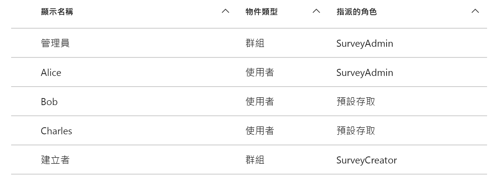
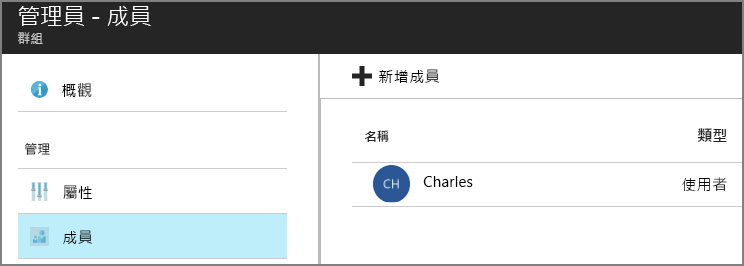

# <a name="application-roles"></a><span data-ttu-id="26ab8-103">應用程式角色</span><span class="sxs-lookup"><span data-stu-id="26ab8-103">Application roles</span></span>

<span data-ttu-id="26ab8-104">[ 程式碼範例][sample application]</span><span class="sxs-lookup"><span data-stu-id="26ab8-104">[ Sample code][sample application]</span></span>

<span data-ttu-id="26ab8-105">應用程式角色是用來指派權限給使用者。</span><span class="sxs-lookup"><span data-stu-id="26ab8-105">Application roles are used to assign permissions to users.</span></span> <span data-ttu-id="26ab8-106">例如，[Tailspin Surveys][tailspin] 應用程式會定義下列角色：</span><span class="sxs-lookup"><span data-stu-id="26ab8-106">For example, the [Tailspin Surveys][tailspin] application defines the following roles:</span></span>

* <span data-ttu-id="26ab8-107">系統管理員。</span><span class="sxs-lookup"><span data-stu-id="26ab8-107">Administrator.</span></span> <span data-ttu-id="26ab8-108">可在所有屬於該租用戶的問卷上執行所有 CRUD 作業。</span><span class="sxs-lookup"><span data-stu-id="26ab8-108">Can perform all CRUD operations on any survey that belongs to that tenant.</span></span>
* <span data-ttu-id="26ab8-109">建立者。</span><span class="sxs-lookup"><span data-stu-id="26ab8-109">Creator.</span></span> <span data-ttu-id="26ab8-110">可以建立新的問卷。</span><span class="sxs-lookup"><span data-stu-id="26ab8-110">Can create new surveys.</span></span>
* <span data-ttu-id="26ab8-111">讀取者。</span><span class="sxs-lookup"><span data-stu-id="26ab8-111">Reader.</span></span> <span data-ttu-id="26ab8-112">可以讀取任何屬於該租用戶的問卷。</span><span class="sxs-lookup"><span data-stu-id="26ab8-112">Can read any surveys that belong to that tenant.</span></span>

<span data-ttu-id="26ab8-113">您可以看出角色最終會在 [授權]期間轉譯成權限。</span><span class="sxs-lookup"><span data-stu-id="26ab8-113">You can see that roles ultimately get translated into permissions, during [authorization].</span></span> <span data-ttu-id="26ab8-114">但是第一個問題是如何指派及管理角色。</span><span class="sxs-lookup"><span data-stu-id="26ab8-114">But the first question is how to assign and manage roles.</span></span> <span data-ttu-id="26ab8-115">我們識別出三個主要選項：</span><span class="sxs-lookup"><span data-stu-id="26ab8-115">We identified three main options:</span></span>

* [<span data-ttu-id="26ab8-116">Azure AD 應用程式角色</span><span class="sxs-lookup"><span data-stu-id="26ab8-116">Azure AD App Roles</span></span>](#roles-using-azure-ad-app-roles)
* [<span data-ttu-id="26ab8-117">Azure AD 安全性群組</span><span class="sxs-lookup"><span data-stu-id="26ab8-117">Azure AD security groups</span></span>](#roles-using-azure-ad-security-groups)
* <span data-ttu-id="26ab8-118">[應用程式角色管理員](#roles-using-an-application-role-manager)。</span><span class="sxs-lookup"><span data-stu-id="26ab8-118">[Application role manager](#roles-using-an-application-role-manager).</span></span>

## <a name="roles-using-azure-ad-app-roles"></a><span data-ttu-id="26ab8-119">使用 Azure AD 應用程式角色的角色</span><span class="sxs-lookup"><span data-stu-id="26ab8-119">Roles using Azure AD App Roles</span></span>

<span data-ttu-id="26ab8-120">這是我們在 Tailspin Surveys 應用程式中使用的方法。</span><span class="sxs-lookup"><span data-stu-id="26ab8-120">This is the approach that we used in the Tailspin Surveys app.</span></span>

<span data-ttu-id="26ab8-121">在這個方法中，SaaS 提供者透過將應用程式角色加入應用程式資訊清單來定義它們。</span><span class="sxs-lookup"><span data-stu-id="26ab8-121">In this approach, The SaaS provider defines the application roles by adding them to the application manifest.</span></span> <span data-ttu-id="26ab8-122">客戶註冊之後，客戶所屬 AD 目錄的系統管理員會將使用者指派至角色。</span><span class="sxs-lookup"><span data-stu-id="26ab8-122">After a customer signs up, an admin for the customer's AD directory assigns users to the roles.</span></span> <span data-ttu-id="26ab8-123">當使用者登入時，指派給使用者的角色會以宣告方式傳送。</span><span class="sxs-lookup"><span data-stu-id="26ab8-123">When a user signs in, the user's assigned roles are sent as claims.</span></span>

> [!NOTE]
> <span data-ttu-id="26ab8-124">如果客戶有 Azure AD Premium，系統管理員可以將安全性群組指派給角色，而且群組的成員將會繼承應用程式角色。</span><span class="sxs-lookup"><span data-stu-id="26ab8-124">If the customer has Azure AD Premium, the admin can assign a security group to a role, and members of the group will inherit the app role.</span></span> <span data-ttu-id="26ab8-125">這是很方便的角色管理方式，因為群組擁有者不需要是 AD 系統管理員。</span><span class="sxs-lookup"><span data-stu-id="26ab8-125">This is a convenient way to manage roles, because the group owner doesn't need to be an AD admin.</span></span>

<span data-ttu-id="26ab8-126">此方法的優點：</span><span class="sxs-lookup"><span data-stu-id="26ab8-126">Advantages of this approach:</span></span>

* <span data-ttu-id="26ab8-127">簡單的程式設計模型。</span><span class="sxs-lookup"><span data-stu-id="26ab8-127">Simple programming model.</span></span>
* <span data-ttu-id="26ab8-128">角色是應用程式特定的。</span><span class="sxs-lookup"><span data-stu-id="26ab8-128">Roles are specific to the application.</span></span> <span data-ttu-id="26ab8-129">針對某一應用程式的角色宣告不會傳送至其他應用程式。</span><span class="sxs-lookup"><span data-stu-id="26ab8-129">The role claims for one application are not sent to another application.</span></span>
* <span data-ttu-id="26ab8-130">如果客戶將應用程式從他們的 AD 租用戶移除，角色就會消失。</span><span class="sxs-lookup"><span data-stu-id="26ab8-130">If the customer removes the application from their AD tenant, the roles go away.</span></span>
* <span data-ttu-id="26ab8-131">除了讀取使用者的設定檔之外，應用程式不需要任何額外的 Active Directory 權限。</span><span class="sxs-lookup"><span data-stu-id="26ab8-131">The application doesn't need any extra Active Directory permissions, other than reading the user's profile.</span></span>

<span data-ttu-id="26ab8-132">缺點：</span><span class="sxs-lookup"><span data-stu-id="26ab8-132">Drawbacks:</span></span>

* <span data-ttu-id="26ab8-133">沒有 Azure AD Premium 的客戶無法指派安全性群組至角色。</span><span class="sxs-lookup"><span data-stu-id="26ab8-133">Customers without Azure AD Premium cannot assign security groups to roles.</span></span> <span data-ttu-id="26ab8-134">對於這些客戶，所有的使用者指派都必須由 AD 系統管理員進行。</span><span class="sxs-lookup"><span data-stu-id="26ab8-134">For these customers, all user assignments must be done by an AD administrator.</span></span>
* <span data-ttu-id="26ab8-135">如果您有與 Web 應用程式分離的後端 Web API，針對 Web 應用程式的角色指派不會套用至 Web API。</span><span class="sxs-lookup"><span data-stu-id="26ab8-135">If you have a backend web API, which is separate from the web app, then role assignments for the web app don't apply to the web API.</span></span> <span data-ttu-id="26ab8-136">如需這方面的詳細討論，請參閱 [保護後端 Web API]。</span><span class="sxs-lookup"><span data-stu-id="26ab8-136">For more discussion of this point, see [Securing a backend web API].</span></span>

### <a name="implementation"></a><span data-ttu-id="26ab8-137">實作</span><span class="sxs-lookup"><span data-stu-id="26ab8-137">Implementation</span></span>

<span data-ttu-id="26ab8-138">**定義角色。**</span><span class="sxs-lookup"><span data-stu-id="26ab8-138">**Define the roles.**</span></span> <span data-ttu-id="26ab8-139">SaaS 提供者在[應用程式資訊清單]中宣告應用程式角色。</span><span class="sxs-lookup"><span data-stu-id="26ab8-139">The SaaS provider declares the app roles in the [application manifest].</span></span> <span data-ttu-id="26ab8-140">例如，以下是 Surveys 應用程式的資訊清單項目：</span><span class="sxs-lookup"><span data-stu-id="26ab8-140">For example, here is the manifest entry for the Surveys app:</span></span>

```json
"appRoles": [
  {
    "allowedMemberTypes": [
      "User"
    ],
    "description": "Creators can create Surveys",
    "displayName": "SurveyCreator",
    "id": "1b4f816e-5eaf-48b9-8613-7923830595ad",
    "isEnabled": true,
    "value": "SurveyCreator"
  },
  {
    "allowedMemberTypes": [
      "User"
    ],
    "description": "Administrators can manage the Surveys in their tenant",
    "displayName": "SurveyAdmin",
    "id": "c20e145e-5459-4a6c-a074-b942bbd4cfe1",
    "isEnabled": true,
    "value": "SurveyAdmin"
  }
],
```

<span data-ttu-id="26ab8-141">`value` 屬性出現在角色宣告中。</span><span class="sxs-lookup"><span data-stu-id="26ab8-141">The `value`  property appears in the role claim.</span></span> <span data-ttu-id="26ab8-142">`id` 屬性是已定義角色的唯一識別碼。</span><span class="sxs-lookup"><span data-stu-id="26ab8-142">The `id` property is the unique identifier for the defined role.</span></span> <span data-ttu-id="26ab8-143">一律會產生新的 GUID 值做為 `id`。</span><span class="sxs-lookup"><span data-stu-id="26ab8-143">Always generate a new GUID value for `id`.</span></span>

<span data-ttu-id="26ab8-144">**指派使用者**。</span><span class="sxs-lookup"><span data-stu-id="26ab8-144">**Assign users**.</span></span> <span data-ttu-id="26ab8-145">當新的客戶註冊時，該應用程式會在客戶的 AD 租用戶中註冊。</span><span class="sxs-lookup"><span data-stu-id="26ab8-145">When a new customer signs up, the application is registered in the customer's AD tenant.</span></span> <span data-ttu-id="26ab8-146">此時，該租用戶的 AD 系統管理員可以指派使用者至角色。</span><span class="sxs-lookup"><span data-stu-id="26ab8-146">At this point, an AD admin for that tenant can assign users to roles.</span></span>

> [!NOTE]
> <span data-ttu-id="26ab8-147">如稍早前所述，有 Azure AD Premium 的客戶也可以指派安全性群組至角色。</span><span class="sxs-lookup"><span data-stu-id="26ab8-147">As noted earlier, customers with Azure AD Premium can also assign security groups to roles.</span></span>

<span data-ttu-id="26ab8-148">下列 Azure 入口網站的螢幕擷取畫面顯示 Survey 應用程式的使用者和群組。</span><span class="sxs-lookup"><span data-stu-id="26ab8-148">The following screenshot from the Azure portal shows users and groups for the Survey application.</span></span> <span data-ttu-id="26ab8-149">「管理員」和「建立者」是分別指派給 SurveyAdmin 和 SurveyCreator 角色的群組。</span><span class="sxs-lookup"><span data-stu-id="26ab8-149">Admin and Creator are groups, assigned to SurveyAdmin and SurveyCreator roles respectively.</span></span> <span data-ttu-id="26ab8-150">Alice 是直接指派 SurveyAdmin 角色的使用者。</span><span class="sxs-lookup"><span data-stu-id="26ab8-150">Alice is a user who was assigned directly to the SurveyAdmin role.</span></span> <span data-ttu-id="26ab8-151">Bob 和 Charles 是沒有直接指派角色的使用者。</span><span class="sxs-lookup"><span data-stu-id="26ab8-151">Bob and Charles are users that have not been directly assigned to a role.</span></span>



<span data-ttu-id="26ab8-153">如以下螢幕擷取畫面所示，Charles 屬於系統管理員群組，故繼承 SurveyAdmin 角色。</span><span class="sxs-lookup"><span data-stu-id="26ab8-153">As shown in the following screenshot, Charles is part of the Admin group, so he inherits the SurveyAdmin role.</span></span> <span data-ttu-id="26ab8-154">而 Bob 尚未被指派角色。</span><span class="sxs-lookup"><span data-stu-id="26ab8-154">In the case of Bob, he has not been assigned a role yet.</span></span>



> [!NOTE]
> <span data-ttu-id="26ab8-156">另一個做法是，應用程式使用 Azure AD 圖形 API 以程式設計的方式指派角色。</span><span class="sxs-lookup"><span data-stu-id="26ab8-156">An alternative approach is for the application to assign roles programmatically, using the Azure AD Graph API.</span></span> <span data-ttu-id="26ab8-157">不過，這需要應用程式取得客戶的 AD 目錄的寫入權限。</span><span class="sxs-lookup"><span data-stu-id="26ab8-157">However, this requires the application to obtain write permissions for the customer's AD directory.</span></span> <span data-ttu-id="26ab8-158">具有這些權限的應用程式可以做許多胡來的事 &mdash; 客戶信任應用程式不會亂搞他們的目錄。</span><span class="sxs-lookup"><span data-stu-id="26ab8-158">An application with those permissions could do a lot of mischief &mdash; the customer is trusting the app not to mess up their directory.</span></span> <span data-ttu-id="26ab8-159">許多客戶可能不願意授予此層級的存取權。</span><span class="sxs-lookup"><span data-stu-id="26ab8-159">Many customers might be unwilling to grant this level of access.</span></span>

<span data-ttu-id="26ab8-160">**取得角色宣告**。</span><span class="sxs-lookup"><span data-stu-id="26ab8-160">**Get role claims**.</span></span> <span data-ttu-id="26ab8-161">當使用者登入時，應用程式會在宣告中收到類型為 `http://schemas.microsoft.com/ws/2008/06/identity/claims/role`的使用者指派角色。</span><span class="sxs-lookup"><span data-stu-id="26ab8-161">When a user signs in, the application receives the user's assigned role(s) in a claim with type `http://schemas.microsoft.com/ws/2008/06/identity/claims/role`.</span></span>

<span data-ttu-id="26ab8-162">使用者可以擁有多個角色，或沒有角色。</span><span class="sxs-lookup"><span data-stu-id="26ab8-162">A user can have multiple roles, or no role.</span></span> <span data-ttu-id="26ab8-163">在授權程式碼中，請不要假設使用者僅有一個角色宣告。</span><span class="sxs-lookup"><span data-stu-id="26ab8-163">In your authorization code, don't assume the user has exactly one role claim.</span></span> <span data-ttu-id="26ab8-164">請改為撰寫會檢查是否有特定宣告值的程式碼：</span><span class="sxs-lookup"><span data-stu-id="26ab8-164">Instead, write code that checks whether a particular claim value is present:</span></span>

```csharp
if (context.User.HasClaim(ClaimTypes.Role, "Admin")) { ... }
```

## <a name="roles-using-azure-ad-security-groups"></a><span data-ttu-id="26ab8-165">使用 Azure AD 安全性群組的角色</span><span class="sxs-lookup"><span data-stu-id="26ab8-165">Roles using Azure AD security groups</span></span>

<span data-ttu-id="26ab8-166">在此方法中，角色會以 AD 安全性群組呈現。</span><span class="sxs-lookup"><span data-stu-id="26ab8-166">In this approach, roles are represented as AD security groups.</span></span> <span data-ttu-id="26ab8-167">應用程式會根據使用者的安全性群組成員資格來將權限指派至使用者。</span><span class="sxs-lookup"><span data-stu-id="26ab8-167">The application assigns permissions to users based on their security group memberships.</span></span>

<span data-ttu-id="26ab8-168">優點：</span><span class="sxs-lookup"><span data-stu-id="26ab8-168">Advantages:</span></span>

* <span data-ttu-id="26ab8-169">對於沒有 Azure AD Premium 的客戶，此方法可讓客戶使用安全性群組來管理角色指派。</span><span class="sxs-lookup"><span data-stu-id="26ab8-169">For customers who do not have Azure AD Premium, this approach enables the customer to use security groups to manage role assignments.</span></span>

<span data-ttu-id="26ab8-170">缺點：</span><span class="sxs-lookup"><span data-stu-id="26ab8-170">Disadvantages:</span></span>

* <span data-ttu-id="26ab8-171">複雜度。</span><span class="sxs-lookup"><span data-stu-id="26ab8-171">Complexity.</span></span> <span data-ttu-id="26ab8-172">由於每個租用戶會傳送不同的群組宣告，因此應用程式必須針對每個租用戶持續追蹤安全性群組所對應的應用程式角色。</span><span class="sxs-lookup"><span data-stu-id="26ab8-172">Because every tenant sends different group claims, the app must keep track of which security groups correspond to which application roles, for each tenant.</span></span>
* <span data-ttu-id="26ab8-173">如果客戶將應用程式從其 AD 租用戶中移除，則安全性群組會留在其 AD 目錄中。</span><span class="sxs-lookup"><span data-stu-id="26ab8-173">If the customer removes the application from their AD tenant, the security groups are left in their AD directory.</span></span>

<!-- markdownlint-disable MD024 -->

### <a name="implementation"></a><span data-ttu-id="26ab8-174">實作</span><span class="sxs-lookup"><span data-stu-id="26ab8-174">Implementation</span></span>

<!-- markdownlint-enable MD024 -->

<span data-ttu-id="26ab8-175">在應用程式資訊清單中，將 `groupMembershipClaims` 屬性設為 "SecurityGroup"。</span><span class="sxs-lookup"><span data-stu-id="26ab8-175">In the application manifest, set the `groupMembershipClaims` property to "SecurityGroup".</span></span> <span data-ttu-id="26ab8-176">這樣才能從 AAD 取得群組成員資格宣告。</span><span class="sxs-lookup"><span data-stu-id="26ab8-176">This is needed to get group membership claims from AAD.</span></span>

```json
{
   // ...
   "groupMembershipClaims": "SecurityGroup",
}
```

<span data-ttu-id="26ab8-177">當新的客戶註冊時，應用程式會指示客戶為應用程式所需的角色建立安全性群組。</span><span class="sxs-lookup"><span data-stu-id="26ab8-177">When a new customer signs up, the application instructs the customer to create security groups for the roles needed by the application.</span></span> <span data-ttu-id="26ab8-178">客戶接著需要將群組物件識別碼輸入應用程式。</span><span class="sxs-lookup"><span data-stu-id="26ab8-178">The customer then needs to enter the group object IDs into the application.</span></span> <span data-ttu-id="26ab8-179">應用程式會依據租用戶將這些識別碼儲存在將群組識別碼對應至應用程式角色的資料表中。</span><span class="sxs-lookup"><span data-stu-id="26ab8-179">The application stores these in a table that maps group IDs to application roles, per tenant.</span></span>

> [!NOTE]
> <span data-ttu-id="26ab8-180">或者，應用程式可使用 Azure AD Graph API 來以程式設計的方式建立群組。</span><span class="sxs-lookup"><span data-stu-id="26ab8-180">Alternatively, the application could create the groups programmatically, using the Azure AD Graph API.</span></span>  <span data-ttu-id="26ab8-181">這樣比較不會出錯。</span><span class="sxs-lookup"><span data-stu-id="26ab8-181">This would be less error prone.</span></span> <span data-ttu-id="26ab8-182">不過，這需要應用程式取得客戶的 AD 目錄的「讀取及寫入所有群組」權限。</span><span class="sxs-lookup"><span data-stu-id="26ab8-182">However, it requires the application to obtain "read and write all groups" permissions for the customer's AD directory.</span></span> <span data-ttu-id="26ab8-183">許多客戶可能不願意授予此層級的存取權。</span><span class="sxs-lookup"><span data-stu-id="26ab8-183">Many customers might be unwilling to grant this level of access.</span></span>

<span data-ttu-id="26ab8-184">當使用者登入時：</span><span class="sxs-lookup"><span data-stu-id="26ab8-184">When a user signs in:</span></span>

1. <span data-ttu-id="26ab8-185">應用程式會以宣告方式收到使用者的群組。</span><span class="sxs-lookup"><span data-stu-id="26ab8-185">The application receives the user's groups as claims.</span></span> <span data-ttu-id="26ab8-186">每個宣告的值為群組的物件識別碼。</span><span class="sxs-lookup"><span data-stu-id="26ab8-186">The value of each claim is the object ID of a group.</span></span>
2. <span data-ttu-id="26ab8-187">Azure AD 會限制權杖中傳送之群組的數目。</span><span class="sxs-lookup"><span data-stu-id="26ab8-187">Azure AD limits the number of groups sent in the token.</span></span> <span data-ttu-id="26ab8-188">如果群組數目超過此限制，Azure AD 會傳送特殊的「超額」宣告。</span><span class="sxs-lookup"><span data-stu-id="26ab8-188">If the number of groups exceeds this limit, Azure AD sends a special "overage" claim.</span></span> <span data-ttu-id="26ab8-189">如果出現該宣告，應用程式就必須查詢 Azure AD Graph API 來取得該使用者所屬的所有群組。</span><span class="sxs-lookup"><span data-stu-id="26ab8-189">If that claim is present, the application must query the Azure AD Graph API to get all of the groups to which that user belongs.</span></span> <span data-ttu-id="26ab8-190">如需詳細資訊，請參閱＜在雲端應用程式中使用 AD 群組的授權＞中的＜群組宣告超額＞一節。</span><span class="sxs-lookup"><span data-stu-id="26ab8-190">For details, see [Authorization in Cloud Applications using AD Groups], under the section titled "Groups claim overage".</span></span>
3. <span data-ttu-id="26ab8-191">應用程式會在自己的資料庫中查閱物件識別碼，以尋找所對應要指派至使用者的應用程式角色</span><span class="sxs-lookup"><span data-stu-id="26ab8-191">The application looks up the object IDs in its own database, to find the corresponding application roles to assign to the user.</span></span>
4. <span data-ttu-id="26ab8-192">應用程式會將自訂的宣告值加入至表示應用程式角色的使用者主體。</span><span class="sxs-lookup"><span data-stu-id="26ab8-192">The application adds a custom claim value to the user principal that expresses the application role.</span></span> <span data-ttu-id="26ab8-193">例如： `survey_role` = "SurveyAdmin"。</span><span class="sxs-lookup"><span data-stu-id="26ab8-193">For example: `survey_role` = "SurveyAdmin".</span></span>

<span data-ttu-id="26ab8-194">授權原則應使用自訂的角色宣告，而不是群組宣告。</span><span class="sxs-lookup"><span data-stu-id="26ab8-194">Authorization policies should use the custom role claim, not the group claim.</span></span>

## <a name="roles-using-an-application-role-manager"></a><span data-ttu-id="26ab8-195">使用應用程式角色管理員的角色</span><span class="sxs-lookup"><span data-stu-id="26ab8-195">Roles using an application role manager</span></span>

<span data-ttu-id="26ab8-196">使用此方法時，應用程式角色不會儲存在 Azure AD 中。</span><span class="sxs-lookup"><span data-stu-id="26ab8-196">With this approach, application roles are not stored in Azure AD at all.</span></span> <span data-ttu-id="26ab8-197">相反地，應用程式會儲存每個使用者的角色指派在它自己的 DB 中 &mdash; 例如，在 ASP.NET 身分識別中使用 **RoleManager** 類別。</span><span class="sxs-lookup"><span data-stu-id="26ab8-197">Instead, the application stores the role assignments for each user in its own DB &mdash; for example, using the **RoleManager** class in ASP.NET Identity.</span></span>

<span data-ttu-id="26ab8-198">優點：</span><span class="sxs-lookup"><span data-stu-id="26ab8-198">Advantages:</span></span>

* <span data-ttu-id="26ab8-199">應用程式完全控制角色和使用者的指派。</span><span class="sxs-lookup"><span data-stu-id="26ab8-199">The app has full control over the roles and user assignments.</span></span>

<span data-ttu-id="26ab8-200">缺點：</span><span class="sxs-lookup"><span data-stu-id="26ab8-200">Drawbacks:</span></span>

* <span data-ttu-id="26ab8-201">更複雜、較難維護。</span><span class="sxs-lookup"><span data-stu-id="26ab8-201">More complex, harder to maintain.</span></span>
* <span data-ttu-id="26ab8-202">無法使用 AD 安全性群組管理角色指派。</span><span class="sxs-lookup"><span data-stu-id="26ab8-202">Cannot use AD security groups to manage role assignments.</span></span>
* <span data-ttu-id="26ab8-203">將使用者資訊儲存在應用程式資料庫，當新增或移除使用者時，資料庫可能不會與租用戶的 AD 目錄同步。</span><span class="sxs-lookup"><span data-stu-id="26ab8-203">Stores user information in the application database, where it can get out of sync with the tenant's AD directory, as users are added or removed.</span></span>

<span data-ttu-id="26ab8-204">[**下一步**][授權]</span><span class="sxs-lookup"><span data-stu-id="26ab8-204">[**Next**][authorization]</span></span>

<!-- links -->

[tailspin]: tailspin.md
[授權]: authorize.md
[authorization]: authorize.md
[保護後端 Web API]: web-api.md
[Securing a backend web API]: web-api.md
[應用程式資訊清單]: /azure/active-directory/active-directory-application-manifest/
[application manifest]: /azure/active-directory/active-directory-application-manifest/
[sample application]: https://github.com/mspnp/multitenant-saas-guidance
