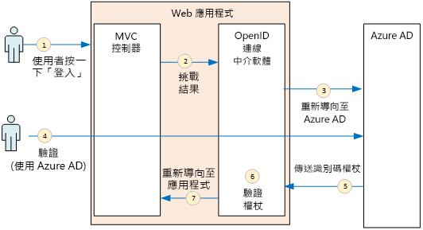
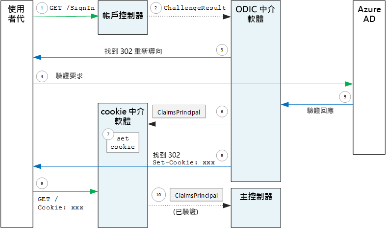

# <a name="authenticate-using-azure-ad-and-openid-connect"></a><span data-ttu-id="173ed-103">使用 Azure AD 和 OpenID Connect 進行驗證</span><span class="sxs-lookup"><span data-stu-id="173ed-103">Authenticate using Azure AD and OpenID Connect</span></span>

<span data-ttu-id="173ed-104">[ 程式碼範例][sample application]</span><span class="sxs-lookup"><span data-stu-id="173ed-104">[ Sample code][sample application]</span></span>

<span data-ttu-id="173ed-105">Surveys 應用程式會使用 OpenID Connect (OIDC) 通訊協定，透過 Azure Active Directory (Azure AD) 驗證使用者。</span><span class="sxs-lookup"><span data-stu-id="173ed-105">The Surveys application uses the OpenID Connect (OIDC) protocol to authenticate users with Azure Active Directory (Azure AD).</span></span> <span data-ttu-id="173ed-106">Surveys 應用程式會使用 ASP.NET Core，其具有內建的 OIDC 中介軟體。</span><span class="sxs-lookup"><span data-stu-id="173ed-106">The Surveys application uses ASP.NET Core, which has built-in middleware for OIDC.</span></span> <span data-ttu-id="173ed-107">下圖概括顯示使用者登入時會發生什麼情況。</span><span class="sxs-lookup"><span data-stu-id="173ed-107">The following diagram shows what happens when the user signs in, at a high level.</span></span>



1. <span data-ttu-id="173ed-109">使用者在應用程式中按一下 [登入] 按鈕。</span><span class="sxs-lookup"><span data-stu-id="173ed-109">The user clicks the "sign in" button in the app.</span></span> <span data-ttu-id="173ed-110">這個動作是由 MVC 控制器處理。</span><span class="sxs-lookup"><span data-stu-id="173ed-110">This action is handled by an MVC controller.</span></span>
2. <span data-ttu-id="173ed-111">MVC 控制器會傳回 **ChallengeResult** 動作。</span><span class="sxs-lookup"><span data-stu-id="173ed-111">The MVC controller returns a **ChallengeResult** action.</span></span>
3. <span data-ttu-id="173ed-112">中介軟體會攔截 **ChallengeResult** 並建立 302 回應，進而將使用者重新導向至 Azure AD 登入頁面。</span><span class="sxs-lookup"><span data-stu-id="173ed-112">The middleware intercepts the **ChallengeResult** and creates a 302 response, which redirects the user to the Azure AD sign-in page.</span></span>
4. <span data-ttu-id="173ed-113">使用者會向 Azure AD 進行驗證。</span><span class="sxs-lookup"><span data-stu-id="173ed-113">The user authenticates with Azure AD.</span></span>
5. <span data-ttu-id="173ed-114">Azure AD 會將 ID 權杖傳送至應用程式。</span><span class="sxs-lookup"><span data-stu-id="173ed-114">Azure AD sends an ID token to the application.</span></span>
6. <span data-ttu-id="173ed-115">中介軟體會驗證 ID 權杖。</span><span class="sxs-lookup"><span data-stu-id="173ed-115">The middleware validates the ID token.</span></span> <span data-ttu-id="173ed-116">此時，使用者已在應用程式內驗證。</span><span class="sxs-lookup"><span data-stu-id="173ed-116">At this point, the user is now authenticated inside the application.</span></span>
7. <span data-ttu-id="173ed-117">中介軟體會將使用者重新導向回到應用程式。</span><span class="sxs-lookup"><span data-stu-id="173ed-117">The middleware redirects the user back to application.</span></span>

## <a name="register-the-app-with-azure-ad"></a><span data-ttu-id="173ed-118">使用 Azure AD 註冊應用程式</span><span class="sxs-lookup"><span data-stu-id="173ed-118">Register the app with Azure AD</span></span>
<span data-ttu-id="173ed-119">若要啟用 OpenID Connect，SaaS 提供者會在自己的 Azure AD 租用戶內註冊應用程式。</span><span class="sxs-lookup"><span data-stu-id="173ed-119">To enable OpenID Connect, the SaaS provider registers the application inside their own Azure AD tenant.</span></span>

<span data-ttu-id="173ed-120">若要註冊應用程式，請遵循[整合應用程式與 Azure Active Directory](/azure/active-directory/active-directory-integrating-applications/) 之[新增應用程式](/azure/active-directory/active-directory-integrating-applications/#adding-an-application)一節中的步驟。</span><span class="sxs-lookup"><span data-stu-id="173ed-120">To register the application, follow the steps in [Integrating Applications with Azure Active Directory](/azure/active-directory/active-directory-integrating-applications/), in the section [Adding an Application](/azure/active-directory/active-directory-integrating-applications/#adding-an-application).</span></span>

<span data-ttu-id="173ed-121">請參閱[執行 Surveys 應用程式](./run-the-app.md)，以了解 Surveys 應用程式的特定步驟。</span><span class="sxs-lookup"><span data-stu-id="173ed-121">See [Run the Surveys application](./run-the-app.md) for the specific steps for the Surveys application.</span></span> <span data-ttu-id="173ed-122">請注意：</span><span class="sxs-lookup"><span data-stu-id="173ed-122">Note the following:</span></span>

- <span data-ttu-id="173ed-123">針對多租用戶應用程式，您必須明確地設定多租用戶選項。</span><span class="sxs-lookup"><span data-stu-id="173ed-123">For a multitenant application, you must configure the multi-tenanted option explicitly.</span></span> <span data-ttu-id="173ed-124">這可讓其他組織能夠存取該應用程式。</span><span class="sxs-lookup"><span data-stu-id="173ed-124">This enables other organizations to to access the application.</span></span>

- <span data-ttu-id="173ed-125">回覆 URL 是 Azure AD 要做為 OAuth 2.0 回應傳送目的地的 URL。</span><span class="sxs-lookup"><span data-stu-id="173ed-125">The reply URL is the URL where Azure AD will send OAuth 2.0 responses.</span></span> <span data-ttu-id="173ed-126">在使用 ASP.NET Core 時，這必須符合您在驗證中介軟體中設定的路徑 (請參閱下一節)。</span><span class="sxs-lookup"><span data-stu-id="173ed-126">When using the ASP.NET Core, this needs to match the path that you configure in the authentication middleware (see next section),</span></span> 

## <a name="configure-the-auth-middleware"></a><span data-ttu-id="173ed-127">設定驗證中介軟體</span><span class="sxs-lookup"><span data-stu-id="173ed-127">Configure the auth middleware</span></span>
<span data-ttu-id="173ed-128">本節說明如何在 ASP.NET Core 中設定驗證中介軟體，以便利用 OpenID Connect 進行多租用戶驗證。</span><span class="sxs-lookup"><span data-stu-id="173ed-128">This section describes how to configure the authentication middleware in ASP.NET Core for multitenant authentication with OpenID Connect.</span></span>

<span data-ttu-id="173ed-129">在您的[啟動類別](/aspnet/core/fundamentals/startup)中加入 OpenID Connect 中介軟體：</span><span class="sxs-lookup"><span data-stu-id="173ed-129">In your [startup class](/aspnet/core/fundamentals/startup), add the OpenID Connect middleware:</span></span>

```csharp
app.UseOpenIdConnectAuthentication(new OpenIdConnectOptions {
    ClientId = configOptions.AzureAd.ClientId,
    ClientSecret = configOptions.AzureAd.ClientSecret, // for code flow
    Authority = Constants.AuthEndpointPrefix,
    ResponseType = OpenIdConnectResponseType.CodeIdToken,
    PostLogoutRedirectUri = configOptions.AzureAd.PostLogoutRedirectUri,
    SignInScheme = CookieAuthenticationDefaults.AuthenticationScheme,
    TokenValidationParameters = new TokenValidationParameters { ValidateIssuer = false },
    Events = new SurveyAuthenticationEvents(configOptions.AzureAd, loggerFactory),
});
```

<span data-ttu-id="173ed-130">請注意，某些設定是取自執行階段的組態選項。</span><span class="sxs-lookup"><span data-stu-id="173ed-130">Notice that some of the settings are taken from runtime configuration options.</span></span> <span data-ttu-id="173ed-131">以下是中介軟體選項的意義：</span><span class="sxs-lookup"><span data-stu-id="173ed-131">Here's what the middleware options mean:</span></span>

* <span data-ttu-id="173ed-132">**ClientId**。</span><span class="sxs-lookup"><span data-stu-id="173ed-132">**ClientId**.</span></span> <span data-ttu-id="173ed-133">當您在 Azure AD 中註冊應用程式時所得到之應用程式的用戶端識別碼。</span><span class="sxs-lookup"><span data-stu-id="173ed-133">The application's client ID, which you got when you registered the application in Azure AD.</span></span>
* <span data-ttu-id="173ed-134">**Authority**。</span><span class="sxs-lookup"><span data-stu-id="173ed-134">**Authority**.</span></span> <span data-ttu-id="173ed-135">對於多租用戶應用程式，將此選項設定為 `https://login.microsoftonline.com/common/`。</span><span class="sxs-lookup"><span data-stu-id="173ed-135">For a multitenant application, set this to `https://login.microsoftonline.com/common/`.</span></span> <span data-ttu-id="173ed-136">這是 Azure AD 一般端點的 URL，可讓任何 Azure AD 租用戶的使用者進行登入。</span><span class="sxs-lookup"><span data-stu-id="173ed-136">This is the URL for the Azure AD common endpoint, which enables users from any Azure AD tenant to sign in.</span></span> <span data-ttu-id="173ed-137">如需一般端點的詳細資訊，請參閱 [此部落格文章](https://www.cloudidentity.com/blog/2014/08/26/the-common-endpoint-walks-like-a-tenant-talks-like-a-tenant-but-is-not-a-tenant/)。</span><span class="sxs-lookup"><span data-stu-id="173ed-137">For more information about the common endpoint, see [this blog post](https://www.cloudidentity.com/blog/2014/08/26/the-common-endpoint-walks-like-a-tenant-talks-like-a-tenant-but-is-not-a-tenant/).</span></span>
* <span data-ttu-id="173ed-138">在 **TokenValidationParameters** 中，將 **ValidateIssuer** 設為 false。</span><span class="sxs-lookup"><span data-stu-id="173ed-138">In **TokenValidationParameters**, set **ValidateIssuer** to false.</span></span> <span data-ttu-id="173ed-139">這表示應用程式將會負責驗證識別碼權杖中的簽發者值。</span><span class="sxs-lookup"><span data-stu-id="173ed-139">That means the app will be responsible for validating the issuer value in the ID token.</span></span> <span data-ttu-id="173ed-140">(中介軟體仍會驗證權杖本身)。如需驗證簽發者的詳細資訊，請參閱[簽發者驗證](claims.md#issuer-validation)。</span><span class="sxs-lookup"><span data-stu-id="173ed-140">(The middleware still validates the token itself.) For more information about validating the issuer, see [Issuer validation](claims.md#issuer-validation).</span></span>
* <span data-ttu-id="173ed-141">**PostLogoutRedirectUri**。</span><span class="sxs-lookup"><span data-stu-id="173ed-141">**PostLogoutRedirectUri**.</span></span> <span data-ttu-id="173ed-142">指定要在登出後重新導向使用者的 URL。這應該是允許匿名要求的頁面 &mdash; 通常是首頁。</span><span class="sxs-lookup"><span data-stu-id="173ed-142">Specify a URL to redirect users after the sign out. This should be a page that allows anonymous requests &mdash; typically the home page.</span></span>
* <span data-ttu-id="173ed-143">**SignInScheme**。</span><span class="sxs-lookup"><span data-stu-id="173ed-143">**SignInScheme**.</span></span> <span data-ttu-id="173ed-144">將此選項設定為 `CookieAuthenticationDefaults.AuthenticationScheme`。</span><span class="sxs-lookup"><span data-stu-id="173ed-144">Set this to `CookieAuthenticationDefaults.AuthenticationScheme`.</span></span> <span data-ttu-id="173ed-145">此設定表示在驗證使用者之後，使用者宣告就會儲存在本機在 Cookie 中。</span><span class="sxs-lookup"><span data-stu-id="173ed-145">This setting means that after the user is authenticated, the user claims are stored locally in a cookie.</span></span> <span data-ttu-id="173ed-146">此 Cookie 是使用者在瀏覽器工作階段期間保持已登入狀態的方法。</span><span class="sxs-lookup"><span data-stu-id="173ed-146">This cookie is how the user stays logged in during the browser session.</span></span>
* <span data-ttu-id="173ed-147">**事件。**</span><span class="sxs-lookup"><span data-stu-id="173ed-147">**Events.**</span></span> <span data-ttu-id="173ed-148">事件回呼；請參閱 [驗證事件](#authentication-events)。</span><span class="sxs-lookup"><span data-stu-id="173ed-148">Event callbacks; see [Authentication events](#authentication-events).</span></span>

<span data-ttu-id="173ed-149">此外，將 Cookie 驗證中介軟體新增至管線。</span><span class="sxs-lookup"><span data-stu-id="173ed-149">Also add the Cookie Authentication middleware to the pipeline.</span></span> <span data-ttu-id="173ed-150">此中介軟體負責將使用者宣告寫入至 Cookie，然後在後續頁面載入期間讀取 Cookie。</span><span class="sxs-lookup"><span data-stu-id="173ed-150">This middleware is responsible for writing the user claims to a cookie, and then reading the cookie during subsequent page loads.</span></span>

```csharp
app.UseCookieAuthentication(new CookieAuthenticationOptions {
    AutomaticAuthenticate = true,
    AutomaticChallenge = true,
    AccessDeniedPath = "/Home/Forbidden",
    CookieSecure = CookieSecurePolicy.Always,

    // The default setting for cookie expiration is 14 days. SlidingExpiration is set to true by default
    ExpireTimeSpan = TimeSpan.FromHours(1),
    SlidingExpiration = true
});
```

## <a name="initiate-the-authentication-flow"></a><span data-ttu-id="173ed-151">起始驗證流程</span><span class="sxs-lookup"><span data-stu-id="173ed-151">Initiate the authentication flow</span></span>
<span data-ttu-id="173ed-152">若要在 ASP.NET MVC 中開始驗證流程，請從控制器傳回 **ChallengeResult** ：</span><span class="sxs-lookup"><span data-stu-id="173ed-152">To start the authentication flow in ASP.NET MVC, return a **ChallengeResult** from the contoller:</span></span>

```csharp
[AllowAnonymous]
public IActionResult SignIn()
{
    return new ChallengeResult(
        OpenIdConnectDefaults.AuthenticationScheme,
        new AuthenticationProperties
        {
            IsPersistent = true,
            RedirectUri = Url.Action("SignInCallback", "Account")
        });
}
```

<span data-ttu-id="173ed-153">這會導致中介軟體傳回可重新導向至驗證端點的 302 (找到) 回應。</span><span class="sxs-lookup"><span data-stu-id="173ed-153">This causes the middleware to return a 302 (Found) response that redirects to the authentication endpoint.</span></span>

## <a name="user-login-sessions"></a><span data-ttu-id="173ed-154">使用者登入工作階段</span><span class="sxs-lookup"><span data-stu-id="173ed-154">User login sessions</span></span>
<span data-ttu-id="173ed-155">如上所述，當使用者第一次登入時，Cookie 驗證中介軟體會將使用者宣告寫入至 Cookie。</span><span class="sxs-lookup"><span data-stu-id="173ed-155">As mentioned, when the user first signs in, the Cookie Authentication middleware writes the user claims to a cookie.</span></span> <span data-ttu-id="173ed-156">之後，系統會藉由讀取 Cookie 來驗證 HTTP 要求。</span><span class="sxs-lookup"><span data-stu-id="173ed-156">After that, HTTP requests are authenticated by reading the cookie.</span></span>

<span data-ttu-id="173ed-157">根據預設，Cookie 中介軟體會寫入[工作階段 Cookie][session-cookie]，當使用者關閉瀏覽器後便會遭到刪除。</span><span class="sxs-lookup"><span data-stu-id="173ed-157">By default, the cookie middleware writes a [session cookie][session-cookie], which gets deleted once the user closes the browser.</span></span> <span data-ttu-id="173ed-158">使用者下次瀏覽網站時，則必須再次登入。</span><span class="sxs-lookup"><span data-stu-id="173ed-158">The next time the user next visits the site, they will have to sign in again.</span></span> <span data-ttu-id="173ed-159">不過，如果您將 **ChallengeResult** 中的 **IsPersistent** 設定為 true，中介軟體便會寫入永續性 Cookie，讓該名使用者在關閉瀏覽器之後仍保持登入。</span><span class="sxs-lookup"><span data-stu-id="173ed-159">However, if you set **IsPersistent** to true in the **ChallengeResult**, the middleware writes a persistent cookie, so the user stays logged in after closing the browser.</span></span> <span data-ttu-id="173ed-160">您可以設定 Cookie 到期日；請參閱[控制 Cookie 選項][cookie-options]。</span><span class="sxs-lookup"><span data-stu-id="173ed-160">You can configure the cookie expiration; see [Controlling cookie options][cookie-options].</span></span> <span data-ttu-id="173ed-161">持續性 Cookie 對使用者而言比較方便，但可能不適用於您希望使用者每次登入的一些應用程式 (例如，銀行應用程式)。</span><span class="sxs-lookup"><span data-stu-id="173ed-161">Persistent cookies are more convenient for the user, but may be inappropriate for some applications (say, a banking application) where you want the user to sign in every time.</span></span>

## <a name="about-the-openid-connect-middleware"></a><span data-ttu-id="173ed-162">關於 OpenID Connect 中介軟體</span><span class="sxs-lookup"><span data-stu-id="173ed-162">About the OpenID Connect middleware</span></span>
<span data-ttu-id="173ed-163">ASP.NET 中的 OpenID Connect 中介軟體會隱藏大部分的通訊協定詳細資料。</span><span class="sxs-lookup"><span data-stu-id="173ed-163">The OpenID Connect middleware in ASP.NET hides most of the protocol details.</span></span> <span data-ttu-id="173ed-164">本節包含一些有關實作的注意事項，這對於了解通訊協定流程很有幫助。</span><span class="sxs-lookup"><span data-stu-id="173ed-164">This section contains some notes about the implementation, that may be useful for understanding the protocol flow.</span></span>

<span data-ttu-id="173ed-165">首先，讓我們從 ASP.NET 的角度 (忽略應用程式與 Azure AD 之間的 OIDC 通訊協定流程細節) 檢查驗證流程。</span><span class="sxs-lookup"><span data-stu-id="173ed-165">First, let's examine the authentication flow in terms of ASP.NET (ignoring the details of the OIDC protocol flow between the app and Azure AD).</span></span> <span data-ttu-id="173ed-166">下圖顯示此程序。</span><span class="sxs-lookup"><span data-stu-id="173ed-166">The following diagram shows the process.</span></span>



<span data-ttu-id="173ed-168">在此圖中，有兩個 MVC 控制器。</span><span class="sxs-lookup"><span data-stu-id="173ed-168">In this diagram, there are two MVC controllers.</span></span> <span data-ttu-id="173ed-169">帳戶控制器會處理登入要求，而首頁控制器會為首頁提供服務。</span><span class="sxs-lookup"><span data-stu-id="173ed-169">The Account controller handles sign-in requests, and the Home controller serves up the home page.</span></span>

<span data-ttu-id="173ed-170">以下是驗證程序：</span><span class="sxs-lookup"><span data-stu-id="173ed-170">Here is the authentication process:</span></span>

1. <span data-ttu-id="173ed-171">使用者按一下「登入」按鈕，而瀏覽器會傳送 GET 要求。</span><span class="sxs-lookup"><span data-stu-id="173ed-171">The user clicks the "Sign in" button, and the browser sends a GET request.</span></span> <span data-ttu-id="173ed-172">例如： `GET /Account/SignIn/`。</span><span class="sxs-lookup"><span data-stu-id="173ed-172">For example: `GET /Account/SignIn/`.</span></span>
2. <span data-ttu-id="173ed-173">帳戶控制器會傳回 `ChallengeResult`。</span><span class="sxs-lookup"><span data-stu-id="173ed-173">The account controller returns a `ChallengeResult`.</span></span>
3. <span data-ttu-id="173ed-174">OIDC 中介軟體會傳回 HTTP 302 回應，並重新導向至 Azure AD。</span><span class="sxs-lookup"><span data-stu-id="173ed-174">The OIDC middleware returns an HTTP 302 response, redirecting to Azure AD.</span></span>
4. <span data-ttu-id="173ed-175">瀏覽器會將驗證要求傳送至 Azure AD</span><span class="sxs-lookup"><span data-stu-id="173ed-175">The browser sends the authentication request to Azure AD</span></span>
5. <span data-ttu-id="173ed-176">使用者登入 Azure AD，而 Azure AD 會送回驗證回應。</span><span class="sxs-lookup"><span data-stu-id="173ed-176">The user signs in to Azure AD, and Azure AD sends back an authentication response.</span></span>
6. <span data-ttu-id="173ed-177">OIDC 中介軟體會建立宣告主體，並將它傳遞給 Cookie 驗證中介軟體。</span><span class="sxs-lookup"><span data-stu-id="173ed-177">The OIDC middleware creates a claims principal and passes it to the Cookie Authentication middleware.</span></span>
7. <span data-ttu-id="173ed-178">Cookie 中介軟體會將宣告主體序列化並設定 Cookie。</span><span class="sxs-lookup"><span data-stu-id="173ed-178">The cookie middleware serializes the claims principal and sets a cookie.</span></span>
8. <span data-ttu-id="173ed-179">OIDC 中介軟體會重新導向至應用程式的回呼 URL。</span><span class="sxs-lookup"><span data-stu-id="173ed-179">The OIDC middleware redirects to the application's callback URL.</span></span>
9. <span data-ttu-id="173ed-180">瀏覽器會遵循重新導向，並在要求中傳送 Cookie。</span><span class="sxs-lookup"><span data-stu-id="173ed-180">The browser follows the redirect, sending the cookie in the request.</span></span>
10. <span data-ttu-id="173ed-181">Cookie 中介軟體會將此 Cookie 還原序列化為宣告主體，並設定 `HttpContext.User` 等於宣告主體。</span><span class="sxs-lookup"><span data-stu-id="173ed-181">The cookie middleware deserializes the cookie to a claims principal and sets `HttpContext.User` equal to the claims principal.</span></span> <span data-ttu-id="173ed-182">要求會路由傳送至 MVC 控制器。</span><span class="sxs-lookup"><span data-stu-id="173ed-182">The request is routed to an MVC controller.</span></span>

### <a name="authentication-ticket"></a><span data-ttu-id="173ed-183">驗證票證</span><span class="sxs-lookup"><span data-stu-id="173ed-183">Authentication ticket</span></span>
<span data-ttu-id="173ed-184">如果驗證成功，OIDC 中介軟體會建立驗證票證，其中包含保存使用者宣告的宣告主體。</span><span class="sxs-lookup"><span data-stu-id="173ed-184">If authentication succeeds, the OIDC middleware creates an authentication ticket, which contains a claims principal that holds the user's claims.</span></span> <span data-ttu-id="173ed-185">您可以存取 **AuthenticationValidated** 或 **TicketReceived** 事件內的票證。</span><span class="sxs-lookup"><span data-stu-id="173ed-185">You can access the ticket inside the **AuthenticationValidated** or **TicketReceived** event.</span></span>

> [!NOTE]
> <span data-ttu-id="173ed-186">在整個驗證流程完成之前，`HttpContext.User` 仍會保有匿名主體，而「不是」已驗證的使用者。</span><span class="sxs-lookup"><span data-stu-id="173ed-186">Until the entire authentication flow is completed, `HttpContext.User` still holds an anonymous principal, **not** the authenticated user.</span></span> <span data-ttu-id="173ed-187">匿名主體具有空的宣告集合。</span><span class="sxs-lookup"><span data-stu-id="173ed-187">The anonymous principal has an empty claims collection.</span></span> <span data-ttu-id="173ed-188">在驗證完成且應用程式重新導向之後，Cookie 中介軟體將驗證 Cookie 還原序列化並將 `HttpContext.User` 設定為代表已驗證使用者的宣告主體。</span><span class="sxs-lookup"><span data-stu-id="173ed-188">After authentication completes and the app redirects, the cookie middleware deserializes the authentication cookie and sets `HttpContext.User` to a claims principal that represents the authenticated user.</span></span>
> 
> 

### <a name="authentication-events"></a><span data-ttu-id="173ed-189">驗證事件</span><span class="sxs-lookup"><span data-stu-id="173ed-189">Authentication events</span></span>
<span data-ttu-id="173ed-190">在驗證過程中，OpenID Connect 中介軟體會引發一連串的事件：</span><span class="sxs-lookup"><span data-stu-id="173ed-190">During the authentication process, the OpenID Connect middleware raises a series of events:</span></span>

* <span data-ttu-id="173ed-191">**RedirectToIdentityProvider**。</span><span class="sxs-lookup"><span data-stu-id="173ed-191">**RedirectToIdentityProvider**.</span></span> <span data-ttu-id="173ed-192">緊接在中介軟體重新導向至驗證端點前呼叫。</span><span class="sxs-lookup"><span data-stu-id="173ed-192">Called right before the middleware redirects to the authentication endpoint.</span></span> <span data-ttu-id="173ed-193">您可以使用此事件來修改重新導向 URL；例如，以便新增要求參數。</span><span class="sxs-lookup"><span data-stu-id="173ed-193">You can use this event to modify the redirect URL; for example, to add request parameters.</span></span> <span data-ttu-id="173ed-194">請參閱[新增系統管理員同意提示](signup.md#adding-the-admin-consent-prompt)，以取得範例。</span><span class="sxs-lookup"><span data-stu-id="173ed-194">See [Adding the admin consent prompt](signup.md#adding-the-admin-consent-prompt) for an example.</span></span>
* <span data-ttu-id="173ed-195">**AuthorizationCodeReceived**。</span><span class="sxs-lookup"><span data-stu-id="173ed-195">**AuthorizationCodeReceived**.</span></span> <span data-ttu-id="173ed-196">使用授權碼來呼叫。</span><span class="sxs-lookup"><span data-stu-id="173ed-196">Called with the authorization code.</span></span>
* <span data-ttu-id="173ed-197">**TokenResponseReceived**。</span><span class="sxs-lookup"><span data-stu-id="173ed-197">**TokenResponseReceived**.</span></span> <span data-ttu-id="173ed-198">在中介軟體從 IDP 取得存取權杖後，但在其通過驗證前呼叫。</span><span class="sxs-lookup"><span data-stu-id="173ed-198">Called after the middleware gets an access token from the IDP, but before it is validated.</span></span> <span data-ttu-id="173ed-199">僅適用於授權碼流程。</span><span class="sxs-lookup"><span data-stu-id="173ed-199">Applies only to authorization code flow.</span></span>
* <span data-ttu-id="173ed-200">**TokenValidated**。</span><span class="sxs-lookup"><span data-stu-id="173ed-200">**TokenValidated**.</span></span> <span data-ttu-id="173ed-201">在中介軟體驗證 ID 權杖之後呼叫。</span><span class="sxs-lookup"><span data-stu-id="173ed-201">Called after the middleware validates the ID token.</span></span> <span data-ttu-id="173ed-202">此時，應用程式有一組關於使用者的已驗證宣告。</span><span class="sxs-lookup"><span data-stu-id="173ed-202">At this point, the application has a set of validated claims about the user.</span></span> <span data-ttu-id="173ed-203">您可以使用此事件對宣告執行額外的驗證，或轉換宣告。</span><span class="sxs-lookup"><span data-stu-id="173ed-203">You can use this event to perform additional validation on the claims, or to transform claims.</span></span> <span data-ttu-id="173ed-204">請參閱[使用宣告](claims.md)。</span><span class="sxs-lookup"><span data-stu-id="173ed-204">See [Working with claims](claims.md).</span></span>
* <span data-ttu-id="173ed-205">**UserInformationReceived**。</span><span class="sxs-lookup"><span data-stu-id="173ed-205">**UserInformationReceived**.</span></span> <span data-ttu-id="173ed-206">如果中介軟體從使用者資訊端點取得使用者設定檔，則會呼叫。</span><span class="sxs-lookup"><span data-stu-id="173ed-206">Called if the middleware gets the user profile from the user info endpoint.</span></span> <span data-ttu-id="173ed-207">僅適用於授權碼流程，而且只有在中介軟體選項中的 `GetClaimsFromUserInfoEndpoint = true` 時使用。</span><span class="sxs-lookup"><span data-stu-id="173ed-207">Applies only to authorization code flow, and only when `GetClaimsFromUserInfoEndpoint = true` in the middleware options.</span></span>
* <span data-ttu-id="173ed-208">**TicketReceived**。</span><span class="sxs-lookup"><span data-stu-id="173ed-208">**TicketReceived**.</span></span> <span data-ttu-id="173ed-209">在驗證完成時呼叫。</span><span class="sxs-lookup"><span data-stu-id="173ed-209">Called when authentication is completed.</span></span> <span data-ttu-id="173ed-210">這是最後一個事件，並假設驗證成功。</span><span class="sxs-lookup"><span data-stu-id="173ed-210">This is the last event, assuming that authentication succeeds.</span></span> <span data-ttu-id="173ed-211">在此事件處理之後，使用者就會登入應用程式。</span><span class="sxs-lookup"><span data-stu-id="173ed-211">After this event is handled, the user is signed into the app.</span></span>
* <span data-ttu-id="173ed-212">**AuthenticationFailed**。</span><span class="sxs-lookup"><span data-stu-id="173ed-212">**AuthenticationFailed**.</span></span> <span data-ttu-id="173ed-213">如果驗證失敗時，則會呼叫。</span><span class="sxs-lookup"><span data-stu-id="173ed-213">Called if authentication fails.</span></span> <span data-ttu-id="173ed-214">請使用此事件來處理驗證失敗，例如，藉由重新導向至錯誤頁面。</span><span class="sxs-lookup"><span data-stu-id="173ed-214">Use this event to handle authentication failures &mdash; for example, by redirecting to an error page.</span></span>

<span data-ttu-id="173ed-215">若要為這些事件提供回呼，請在中介軟體設定 [事件] 選項。</span><span class="sxs-lookup"><span data-stu-id="173ed-215">To provide callbacks for these events, set the **Events** option on the middleware.</span></span> <span data-ttu-id="173ed-216">有兩種不同的方式可宣告事件處理常式：使用 lambda 內嵌，或在衍生自 **OpenIdConnectEvents** 的類別中內嵌。</span><span class="sxs-lookup"><span data-stu-id="173ed-216">There are two different ways to declare the event handlers: Inline with lambdas, or in a class that derives from **OpenIdConnectEvents**.</span></span> <span data-ttu-id="173ed-217">如果事件回呼有任何實質邏輯，則建議使用第二種方法，如此才不會擾亂您的啟動類別。</span><span class="sxs-lookup"><span data-stu-id="173ed-217">The second approach is recommended if your event callbacks have any substantial logic, so they don't clutter your startup class.</span></span> <span data-ttu-id="173ed-218">我們的參考實作使用這種方法。</span><span class="sxs-lookup"><span data-stu-id="173ed-218">Our reference implementation uses this approach.</span></span>

### <a name="openid-connect-endpoints"></a><span data-ttu-id="173ed-219">OpenID Connect 端點</span><span class="sxs-lookup"><span data-stu-id="173ed-219">OpenID connect endpoints</span></span>
<span data-ttu-id="173ed-220">Azure AD 支援 [OpenID Connect 探索](https://openid.net/specs/openid-connect-discovery-1_0.html)，會由識別提供者 (IDP) 傳回[已知端點](https://openid.net/specs/openid-connect-discovery-1_0.html#ProviderConfig)的 JSON 中繼資料文件。</span><span class="sxs-lookup"><span data-stu-id="173ed-220">Azure AD supports [OpenID Connect Discovery](https://openid.net/specs/openid-connect-discovery-1_0.html), wherein the identity provider (IDP) returns a JSON metadata document from a [well-known endpoint](https://openid.net/specs/openid-connect-discovery-1_0.html#ProviderConfig).</span></span> <span data-ttu-id="173ed-221">中繼資料文件包含的資訊如下：</span><span class="sxs-lookup"><span data-stu-id="173ed-221">The metadata document contains information such as:</span></span>

* <span data-ttu-id="173ed-222">授權端點的 URL。</span><span class="sxs-lookup"><span data-stu-id="173ed-222">The URL of the authorization endpoint.</span></span> <span data-ttu-id="173ed-223">這是應用程式重新導向來驗證使用者的位置。</span><span class="sxs-lookup"><span data-stu-id="173ed-223">This is where the app redirects to authenticate the user.</span></span>
* <span data-ttu-id="173ed-224">「結束工作階段」端點的 URL，也就是應用程式即將登出使用者的位置。</span><span class="sxs-lookup"><span data-stu-id="173ed-224">The URL of the "end session" endpoint, where the app goes to log out the user.</span></span>
* <span data-ttu-id="173ed-225">用以取得簽署金鑰的 URL，而用戶端會使用這些金鑰來驗證它從 IDP 取得的 OIDC 權杖。</span><span class="sxs-lookup"><span data-stu-id="173ed-225">The URL to get the signing keys, which the client uses to validate the OIDC tokens that it gets from the IDP.</span></span>

<span data-ttu-id="173ed-226">根據預設，OIDC 中介軟體會知道如何擷取此中繼資料。</span><span class="sxs-lookup"><span data-stu-id="173ed-226">By default, the OIDC middleware knows how to fetch this metadata.</span></span> <span data-ttu-id="173ed-227">請在中介軟體中設定 [授權] 選項，中介軟體便會建構此中繼資料的 URL。</span><span class="sxs-lookup"><span data-stu-id="173ed-227">Set the **Authority** option in the middleware, and the middleware constructs the URL for the metadata.</span></span> <span data-ttu-id="173ed-228">(您可以藉由設定 **MetadataAddress** 選項來覆寫中繼資料 URL)。</span><span class="sxs-lookup"><span data-stu-id="173ed-228">(You can override the metadata URL by setting the **MetadataAddress** option.)</span></span>

### <a name="openid-connect-flows"></a><span data-ttu-id="173ed-229">OpenID Connect 流程</span><span class="sxs-lookup"><span data-stu-id="173ed-229">OpenID connect flows</span></span>
<span data-ttu-id="173ed-230">根據預設，OIDC 中介軟體會使用混合式流程搭配表單 POST 回應模式。</span><span class="sxs-lookup"><span data-stu-id="173ed-230">By default, the OIDC middleware uses hybrid flow with form post response mode.</span></span>

* <span data-ttu-id="173ed-231">「混合式流程」表示用戶端可以在同一回往返存取授權伺服器時取得 ID 權杖和授權碼。</span><span class="sxs-lookup"><span data-stu-id="173ed-231">*Hybrid flow* means the client can get an ID token and an authorization code in the same round-trip to the authorization server.</span></span>
* <span data-ttu-id="173ed-232">「表單 POST 回應模式」表示授權伺服器會使用 HTTP POST 要求將 ID 權杖和授權碼傳送至應用程式。</span><span class="sxs-lookup"><span data-stu-id="173ed-232">*Form post reponse mode* means the authorization server uses an HTTP POST request to send the ID token and authorization code to the app.</span></span> <span data-ttu-id="173ed-233">這些值會使用表單 URL 方式進行編碼 (content type = "application/x-www-form-urlencoded")。</span><span class="sxs-lookup"><span data-stu-id="173ed-233">The values are form-urlencoded (content type = "application/x-www-form-urlencoded").</span></span>

<span data-ttu-id="173ed-234">當 OIDC 中介軟體重新導向至授權端點時，重新導向 URL 會包含 OIDC 所需的所有查詢字串參數。</span><span class="sxs-lookup"><span data-stu-id="173ed-234">When the OIDC middleware redirects to the authorization endpoint, the redirect URL includes all of the query string parameters needed by OIDC.</span></span> <span data-ttu-id="173ed-235">混合式流程：</span><span class="sxs-lookup"><span data-stu-id="173ed-235">For hybrid flow:</span></span>

* <span data-ttu-id="173ed-236">client_id。</span><span class="sxs-lookup"><span data-stu-id="173ed-236">client_id.</span></span> <span data-ttu-id="173ed-237">這個值設定於 **ClientId** 選項</span><span class="sxs-lookup"><span data-stu-id="173ed-237">This value is set in the **ClientId** option</span></span>
* <span data-ttu-id="173ed-238">scope = "openid profile"，這表示它是 OIDC 要求而且我們想要使用者的設定檔。</span><span class="sxs-lookup"><span data-stu-id="173ed-238">scope = "openid profile", which means it's an OIDC request and we want the user's profile.</span></span>
* <span data-ttu-id="173ed-239">response_type  = "code id_token"。</span><span class="sxs-lookup"><span data-stu-id="173ed-239">response_type  = "code id_token".</span></span> <span data-ttu-id="173ed-240">這會指定混合式流程。</span><span class="sxs-lookup"><span data-stu-id="173ed-240">This specifies hybrid flow.</span></span>
* <span data-ttu-id="173ed-241">response_mode = "form_post"。</span><span class="sxs-lookup"><span data-stu-id="173ed-241">response_mode = "form_post".</span></span> <span data-ttu-id="173ed-242">這會指定表單 POST 回應。</span><span class="sxs-lookup"><span data-stu-id="173ed-242">This specifies form post response.</span></span>

<span data-ttu-id="173ed-243">若要指定不同的流程，請設定選項的 **ResponseType** 屬性。</span><span class="sxs-lookup"><span data-stu-id="173ed-243">To specify a different flow, set the **ResponseType** property on the options.</span></span> <span data-ttu-id="173ed-244">例如︰</span><span class="sxs-lookup"><span data-stu-id="173ed-244">For example:</span></span>

```csharp
app.UseOpenIdConnectAuthentication(options =>
{
    options.ResponseType = "code"; // Authorization code flow

    // Other options
}
```

<span data-ttu-id="173ed-245">[**下一主題**][claims]</span><span class="sxs-lookup"><span data-stu-id="173ed-245">[**Next**][claims]</span></span>

[claims]: claims.md
[cookie-options]: /aspnet/core/security/authentication/cookie#controlling-cookie-options
[session-cookie]: https://en.wikipedia.org/wiki/HTTP_cookie#Session_cookie
[sample application]: https://github.com/mspnp/multitenant-saas-guidance
