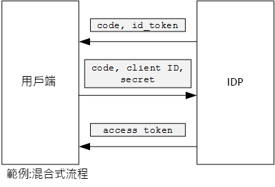

# <a name="use-client-assertion-to-get-access-tokens-from-azure-ad"></a>使用用戶端判斷提示從 Azure AD 取得存取權杖

[ 程式碼範例][sample application]

## <a name="background"></a>背景

在 OpenID Connect 中使用授權碼流程或混合式流程時，用戶端會交換授權碼以取得存取權杖。 在此步驟中，用戶端必須向伺服器驗證自身。



驗證用戶端的一種方法是使用用戶端密碼。 這是 [Tailspin Surveys][Surveys] 應用程式的預設設定。

以下是從用戶端向 IDP 提出的要求範例，要求存取權杖。 請注意 `client_secret` 參數。

```http
POST https://login.microsoftonline.com/b9bd2162xxx/oauth2/token HTTP/1.1
Content-Type: application/x-www-form-urlencoded

resource=https://tailspin.onmicrosoft.com/surveys.webapi
  &client_id=87df91dc-63de-4765-8701-b59cc8bd9e11
  &client_secret=i3Bf12Dn...
  &grant_type=authorization_code
  &code=PG8wJG6Y...
```

密碼只是一個字串，因此您必須確保不會洩漏值。 最佳做法是防止用戶端密碼進入原始檔控制中。 部署至 Azure 時，將密碼存放在[應用程式設定][configure-web-app]中。

不過，任何可存取 Azure 訂用帳戶的使用者，都可以檢視應用程式設定。 此外，一定會有嘗試將密碼簽入原始檔控制 (例如簽入部署指令碼中)，透過電子郵件共用它們等等。

為了增加安全性，您可以使用[用戶端判斷提示] 來取代用戶端密碼。 透過用戶端判斷提示，用戶端使用 X.509 憑證提供來自用戶端的權杖要求。 用戶端憑證會安裝在 Web 伺服器上。 一般而言，限制憑證的存取會比確保不讓任何人不慎揭露用戶端密碼更為容易。 如需在 Web 應用程式中設定憑證的相關資訊，請參閱 [在 Azure 網站應用程式中使用憑證][using-certs-in-websites]。

以下是使用用戶端判斷提示的權杖要求：

```http
POST https://login.microsoftonline.com/b9bd2162xxx/oauth2/token HTTP/1.1
Content-Type: application/x-www-form-urlencoded

resource=https://tailspin.onmicrosoft.com/surveys.webapi
  &client_id=87df91dc-63de-4765-8701-b59cc8bd9e11
  &client_assertion_type=urn:ietf:params:oauth:client-assertion-type:jwt-bearer
  &client_assertion=eyJhbGci...
  &grant_type=authorization_code
  &code= PG8wJG6Y...
```

請注意，不會再使用 `client_secret` 參數。 相反地， `client_assertion` 參數包含使用用戶端憑證簽署的 JWT 權杖。 `client_assertion_type` 參數會指定判斷提示的類型 &mdash; 在此案例中是 JWT 權杖。 伺服器會驗證 JWT 權杖。 若 JWT 權杖無效，權杖要求會傳回錯誤。

> [!NOTE]
> X.509 憑證並非唯一的用戶端判斷提示格式；我們在此將焦點放在其上，是因為它受 Azure AD 支援。

在執行時，Web 應用程式會從憑證存放區讀取憑證。 憑證必須與 Web 應用程式安裝在相同的電腦上。

Surveys 應用程式包含協助程式類別，會建立您可以傳遞給 [AuthenticationContext.AcquireTokenSilentAsync](/dotnet/api/microsoft.identitymodel.clients.activedirectory.authenticationcontext.acquiretokensilentasync) 方法的 [ClientAssertionCertificate](/dotnet/api/microsoft.identitymodel.clients.activedirectory.clientassertioncertificate)，以從 Azure AD 取得權杖。

```csharp
public class CertificateCredentialService : ICredentialService
{
    private Lazy<Task<AdalCredential>> _credential;

    public CertificateCredentialService(IOptions<ConfigurationOptions> options)
    {
        var aadOptions = options.Value?.AzureAd;
        _credential = new Lazy<Task<AdalCredential>>(() =>
        {
            X509Certificate2 cert = CertificateUtility.FindCertificateByThumbprint(
                aadOptions.Asymmetric.StoreName,
                aadOptions.Asymmetric.StoreLocation,
                aadOptions.Asymmetric.CertificateThumbprint,
                aadOptions.Asymmetric.ValidationRequired);
            string password = null;
            var certBytes = CertificateUtility.ExportCertificateWithPrivateKey(cert, out password);
            return Task.FromResult(new AdalCredential(new ClientAssertionCertificate(aadOptions.ClientId, new X509Certificate2(certBytes, password))));
        });
    }

    public async Task<AdalCredential> GetCredentialsAsync()
    {
        return await _credential.Value;
    }
}
```

如需在 Surveys 應用程式中設定用戶端判斷提示的詳細資訊，請參閱[使用 Azure Key Vault 保護應用程式密碼][key vault]。

[**下一主題**][key vault]

<!-- links -->

[configure-web-app]: /azure/app-service-web/web-sites-configure/
[azure-management-portal]: https://portal.azure.com
[用戶端判斷提示]: https://tools.ietf.org/html/rfc7521
[key vault]: key-vault.md
[Setup-KeyVault]: https://github.com/mspnp/multitenant-saas-guidance/blob/master/scripts/Setup-KeyVault.ps1
[Surveys]: tailspin.md
[using-certs-in-websites]: https://azure.microsoft.com/blog/using-certificates-in-azure-websites-applications/

[sample application]: https://github.com/mspnp/multitenant-saas-guidance
