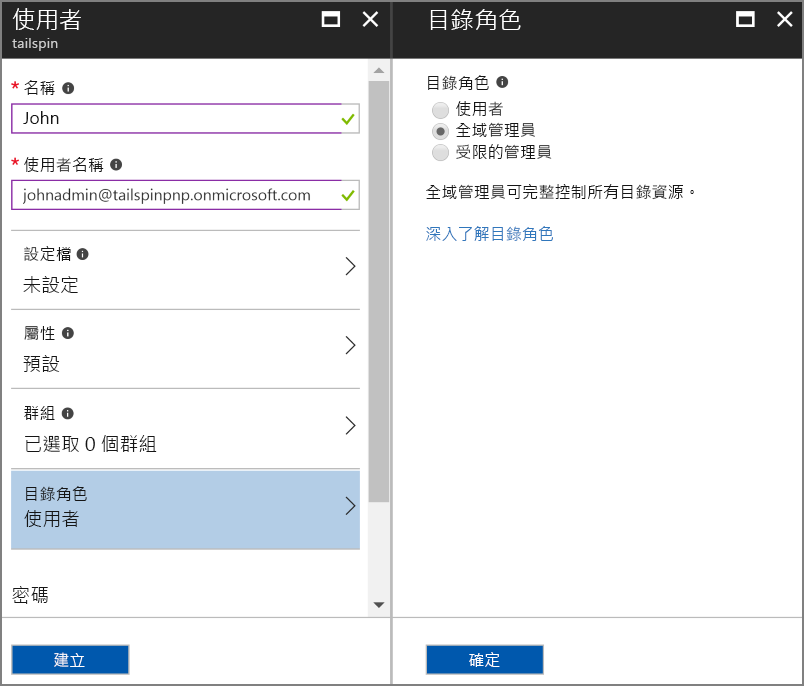
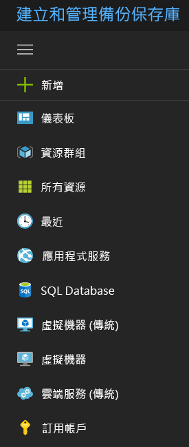

# <a name="use-azure-key-vault-to-protect-application-secrets"></a>使用 Azure Key Vault 來保護應用程式的機密資訊

[ 程式碼範例][sample application]

應用程式設定經常含有機密內容因此必須受到保護，例如：

* 資料庫連接字串
* 密碼
* 密碼編譯金鑰

安全性的最佳做法是永遠不要將這些機密資訊儲存在原始檔控制中。 即使您的原始程式碼存放庫是私用的，這些機密資訊也很容易外洩。 這不只是讓這些機密資訊無法公開取得的問題。 在較大型的專案中，您還可以限制有哪些開發人員和操作員可以存取生產機密資訊。 (測試或開發環境的設定不同)。

較安全的選項是將這些機密資訊儲存在 [Azure Key Vault][KeyVault]。 金鑰保存庫是用於管理密碼編譯金鑰和其他機密資訊的雲端託管服務。 本文說明如何使用金鑰保存庫來儲存應用程式的組態設定。

在 [Tailspin Surveys][Surveys] 應用程式中，以下設定是機密資訊：

* 資料庫連接字串。
* Redis 連接字串。
* Web 應用程式的用戶端密碼。

Surveys 應用程式會從下列位置載入組態設定：

* appsettings.json 檔案
* [使用者機密資訊存放區][user-secrets] (僅限開發環境；測試用)
* 裝載環境 (Azure Web Apps 中的應用程式設定)
* Key Vault (啟用時)

上述每一個位置都會覆寫前一個位置，以便儲存在金鑰保存庫中的設定會優先採用。

> [!NOTE]
> 依預設會停用金鑰保存庫組態提供者。 在本機執行應用程式時並不需要此項目。 在生產部署中則會予以啟用。

在啟動時，應用程式會從每個已註冊的組態提供者讀取設定，並使用它們來填入強型別的選項物件。 如需詳細資訊，請參閱[使用選項和組態物件][options]。

## <a name="setting-up-key-vault-in-the-surveys-app"></a>在 Surveys 應用程式中設定金鑰保存庫

必要條件：

* 安裝 [Azure Resource Manager Cmdlet][azure-rm-cmdlets]。
* 設定 Surveys 應用程式，如[執行 Surveys 應用程式][readme]所述。

高階步驟：

1. 設定租用戶中的系統管理員使用者。
2. 設定用戶端憑證。
3. 建立金鑰保存庫。
4. 將組態設定新增至金鑰保存庫。
5. 取消註解可啟用金鑰保存庫的程式碼。
6. 更新應用程式的使用者機密資訊。

### <a name="set-up-an-admin-user"></a>設定系統管理員使用者

> [!NOTE]
> 若要建立金鑰保存庫，您必須使用可管理 Azure 訂用帳戶的帳戶。 此外，任何您授權讀取金鑰保存庫的應用程式必須在和該帳戶相同的租用戶中註冊。

在此步驟中，您將確保在登入為 Surveys 應用程式註冊所在之租用戶的使用者時，您可以建立金鑰保存庫。

在 Surveys 應用程式註冊所在的 Azure AD 租用戶中建立系統管理員使用者。

1. 登入 [Azure 入口網站][azure-portal]。
2. 選取應用程式註冊所在的 Azure AD 租用戶。
3. 按一下 [更多服務] > [安全性 + 身分識別] > [Azure Active Directory] > [使用者和群組] > [所有使用者]。
4. 按一下入口網站頂端的 [新增使用者]。
5. 填寫欄位，然後將使用者指派至 [全域管理員] 目錄角色。
6. 按一下頁面底部的 [新增] 。



現在將此使用者指派為訂用帳戶擁有者。

1. 在 [中樞] 功能表中，選取 [訂用帳戶]。

    

2. 選取您想讓系統管理員存取的訂用帳戶。
3. 在 [訂用帳戶] 刀鋒視窗中，選取 [存取控制 (IAM)]。
4. 按一下 [新增] 。
5. 選取 [角色] 底下的 [擁有者]。
6. 輸入要新增為擁有者之使用者的電子郵件地址。
7. 選取使用者，然後按一下 [儲存]。

### <a name="set-up-a-client-certificate"></a>設定用戶端憑證

1. 執行 PowerShell 指令碼 [/Scripts/Setup-KeyVault.ps1][Setup-KeyVault]，如下所示：

    ```powershell
    .\Setup-KeyVault.ps1 -Subject <<subject>>
    ```
    針對 `Subject` 參數，輸入任何名稱，如「surveysapp」。 指令碼會產生自我簽署憑證，並將它儲存在「目前使用者/個人」憑證存放區。 指令碼的輸出是 JSON 片段。 複製這個值。

2. 在 [Azure 入口網站][azure-portal]中，於入口網站右上角選取您的帳戶，以切換至 Surveys 應用程式註冊所在的目錄。

3. 選取 [Azure Active Directory] > [應用程式註冊] > Surveys

4. 依序按一下 [資訊清單] 和 [編輯]。

5. 將指令碼的輸出貼入至 `keyCredentials` 屬性。 看起來應該會像下面這樣：

    ```json
    "keyCredentials": [
        {
        "type": "AsymmetricX509Cert",
        "usage": "Verify",
        "keyId": "29d4f7db-0539-455e-b708-....",
        "customKeyIdentifier": "ZEPpP/+KJe2fVDBNaPNOTDoJMac=",
        "value": "MIIDAjCCAeqgAwIBAgIQFxeRiU59eL.....
        }
    ],
    ```

6. 按一下 [檔案] 。

7. 重複步驟 3-6，將相同的 JSON 片段新增至 Web API (Surveys.WebAPI) 的應用程式資訊清單。

8. 從 PowerShell 視窗中執行下列命令，以取得憑證的指紋。

    ```powershell
    certutil -store -user my [subject]
    ```

    針對 `[subject]`，請使用您在 PowerShell 指令碼中為 Subject 所指定的值。 指紋會列在「Cert Hash(sha1)」之下。 複製這個值。 您稍後會使用指紋。

### <a name="create-a-key-vault"></a>建立金鑰保存庫

1. 執行 PowerShell 指令碼 [/Scripts/Setup-KeyVault.ps1][Setup-KeyVault]，如下所示：

    ```powershell
    .\Setup-KeyVault.ps1 -KeyVaultName <<key vault name>> -ResourceGroupName <<resource group name>> -Location <<location>>
    ```

    當系統提示您輸入認證時，以您稍早建立的 Azure AD 使用者身分登入。 指令碼會建立新的資源群組，而該資源群組內會有新的金鑰保存庫。

2. 再次執行 Setup-KeyVault.ps1，如下所示：

    ```powershell
    .\Setup-KeyVault.ps1 -KeyVaultName <<key vault name>> -ApplicationIds @("<<Surveys app id>>", "<<Surveys.WebAPI app ID>>")
    ```

    設定下列參數值：

       * 金鑰保存庫名稱 = 您在上一個步驟中提供給金鑰保存庫的名稱。
       * Surveys 應用程式識別碼 = Surveys Web 應用程式的應用程式識別碼。
       * Surveys.WebApi 應用程式識別碼 = Surveys.WebAPI 應用程式的應用程式識別碼。

    範例：

    ```powershell
     .\Setup-KeyVault.ps1 -KeyVaultName tailspinkv -ApplicationIds @("f84df9d1-91cc-4603-b662-302db51f1031", "8871a4c2-2a23-4650-8b46-0625ff3928a6")
    ```

    此指令碼會授權 Web 應用程式和 Web API 擷取金鑰保存庫中的機密資訊。 如需詳細資訊，請參閱[開始使用 Azure Key Vault](/azure/key-vault/key-vault-get-started/)。

### <a name="add-configuration-settings-to-your-key-vault"></a>將組態設定新增至金鑰保存庫

1. 執行 Setup-KeyVault.ps1，如下所示：

    ```powershell
    .\Setup-KeyVault.ps1 -KeyVaultName <<key vault name> -KeyName Redis--Configuration -KeyValue "<<Redis DNS name>>.redis.cache.windows.net,password=<<Redis access key>>,ssl=true"
    ```
    其中

   * 金鑰保存庫名稱 = 您在上一個步驟中提供給金鑰保存庫的名稱。
   * Redis DNS 名稱 = Redis 快取執行個體的 DNS 名稱。
   * Redis 存取金鑰 = Redis 快取執行個體的存取金鑰。

2. 這個階段很適合測試是否已成功將密碼儲存到金鑰保存庫。 執行下列 PowerShell 命令：

    ```powershell
    Get-AzureKeyVaultSecret <<key vault name>> Redis--Configuration | Select-Object *
    ```

3. 再次執行 Setup-KeyVault.ps1 以新增資料庫連接字串：

    ```powershell
    .\Setup-KeyVault.ps1 -KeyVaultName <<key vault name> -KeyName Data--SurveysConnectionString -KeyValue <<DB connection string>> -ConfigName "Data:SurveysConnectionString"
    ```

    其中 `<<DB connection string>>` 是資料庫連接字串的值。

    若要使用本機資料庫進行測試，請複製 Tailspin.Surveys.Web/appsettings.json 檔案中的連接字串。 如果您這樣做，請務必將雙反斜線 (\\\\) 變更為單一反斜線。 雙反斜線是 JSON 檔案中的逸出字元。

    範例：

    ```powershell
    .\Setup-KeyVault.ps1 -KeyVaultName mykeyvault -KeyName Data--SurveysConnectionString -KeyValue "Server=(localdb)\MSSQLLocalDB;Database=Tailspin.SurveysDB;Trusted_Connection=True;MultipleActiveResultSets=true"
    ```

### <a name="uncomment-the-code-that-enables-key-vault"></a>取消註解可啟用金鑰保存庫的程式碼

1. 開啟 Tailspin.Surveys 方案。
2. 在 Tailspin.Surveys.Web/Startup.cs 中，找出以下程式碼區塊並將它取消註解。

    ```csharp
    //var config = builder.Build();
    //builder.AddAzureKeyVault(
    //    $"https://{config["KeyVault:Name"]}.vault.azure.net/",
    //    config["AzureAd:ClientId"],
    //    config["AzureAd:ClientSecret"]);
    ```
3. 在 Tailspin.Surveys.Web/Startup.cs 中，找出註冊 `ICredentialService` 的程式碼。 將使用 `CertificateCredentialService` 的程式行取消註解，然後將使用 `ClientCredentialService` 的程式行註解化：

    ```csharp
    // Uncomment this:
    services.AddSingleton<ICredentialService, CertificateCredentialService>();
    // Comment out this:
    //services.AddSingleton<ICredentialService, ClientCredentialService>();
    ```

    這項變更可讓 Web 應用程式使用[用戶端判斷提示][client-assertion]來取得 OAuth 存取權杖。 使用用戶端判斷提示就不需要 OAuth 用戶端密碼。 或者，您可以將用戶端密碼儲存在金鑰保存庫中。 不過，金鑰保存庫和用戶端判斷提示都使用用戶端憑證，因此如果您啟用金鑰保存庫，則最好也啟用用戶端判斷提示。

### <a name="update-the-user-secrets"></a>更新使用者密碼

在 [方案總管] 中，以右鍵按一下 Tailspin.Surveys.Web 專案，然後選取 [管理使用者密碼] 。 在 secrets.json 檔案中，刪除現有 JSON 並貼上下列內容：

```json
{
  "AzureAd": {
    "ClientId": "[Surveys web app client ID]",
    "ClientSecret": "[Surveys web app client secret]",
    "PostLogoutRedirectUri": "https://localhost:44300/",
    "WebApiResourceId": "[App ID URI of your Surveys.WebAPI application]",
    "Asymmetric": {
      "CertificateThumbprint": "[certificate thumbprint. Example: 105b2ff3bc842c53582661716db1b7cdc6b43ec9]",
      "StoreName": "My",
      "StoreLocation": "CurrentUser",
      "ValidationRequired": "false"
    }
  },
  "KeyVault": {
    "Name": "[key vault name]"
  }
}
```

請將 [方括號] 中的項目更換為正確值。

* `AzureAd:ClientId`：Surveys 應用程式的用戶端識別碼。
* `AzureAd:ClientSecret`：在 Azure AD 中註冊問卷應用程式時產生的金鑰。
* `AzureAd:WebApiResourceId`：當您在 Azure AD 建立 Surveys.WebAPI 應用程式時所指定的應用程式識別碼 URI。
* `Asymmetric:CertificateThumbprint`：您先前在建立用戶端憑證時所取得的憑證指紋。
* `KeyVault:Name`：金鑰保存庫的名稱。

> [!NOTE]
> `Asymmetric:ValidationRequired` 為 false，因為您先前建立的憑證並未由根憑證授權單位 (CA) 簽署。 在生產環境中，使用由根 CA 簽署的憑證，並將 `ValidationRequired` 設為 true。

儲存更新後的 secrets.json 檔案。

接下來，在 [方案總管] 中以滑鼠右鍵按一下 Tailspin.Surveys.WebApi 專案，然後選取 [管理使用者密碼] 。 刪除現有 JSON 並貼上下列內容：

```json
{
  "AzureAd": {
    "ClientId": "[Surveys.WebAPI client ID]",
    "WebApiResourceId": "https://tailspin5.onmicrosoft.com/surveys.webapi",
    "Asymmetric": {
      "CertificateThumbprint": "[certificate thumbprint]",
      "StoreName": "My",
      "StoreLocation": "CurrentUser",
      "ValidationRequired": "false"
    }
  },
  "KeyVault": {
    "Name": "[key vault name]"
  }
}
```

更換 [方括號] 中的項目，並儲存 secrets.json 檔案。

> [!NOTE]
> 若為 Web API，請務必使用 Surveys.WebAPI 應用程式 (而非 Surveys 應用程式) 的用戶端識別碼。

[**下一主題**][adfs]

<!-- links -->

[adfs]: ./adfs.md
[authorize-app]: /azure/key-vault/key-vault-get-started//#authorize
[azure-portal]: https://portal.azure.com
[azure-rm-cmdlets]: https://msdn.microsoft.com/library/mt125356.aspx
[client-assertion]: client-assertion.md
[configuration]: /aspnet/core/fundamentals/configuration
[KeyVault]: https://azure.microsoft.com/services/key-vault/
[key-tags]: https://msdn.microsoft.com/library/azure/dn903623.aspx#BKMK_Keytags
[Microsoft.Azure.KeyVault]: https://www.nuget.org/packages/Microsoft.Azure.KeyVault/
[options]: /aspnet/core/fundamentals/configuration#using-options-and-configuration-objects
[readme]: ./run-the-app.md
[Setup-KeyVault]: https://github.com/mspnp/multitenant-saas-guidance/blob/master/scripts/Setup-KeyVault.ps1
[Surveys]: tailspin.md
[user-secrets]: /aspnet/core/security/app-secrets
[sample application]: https://github.com/mspnp/multitenant-saas-guidance
