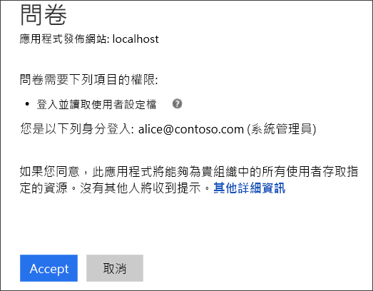
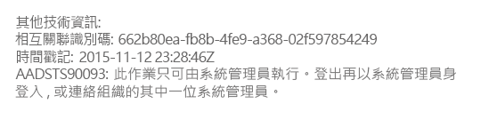
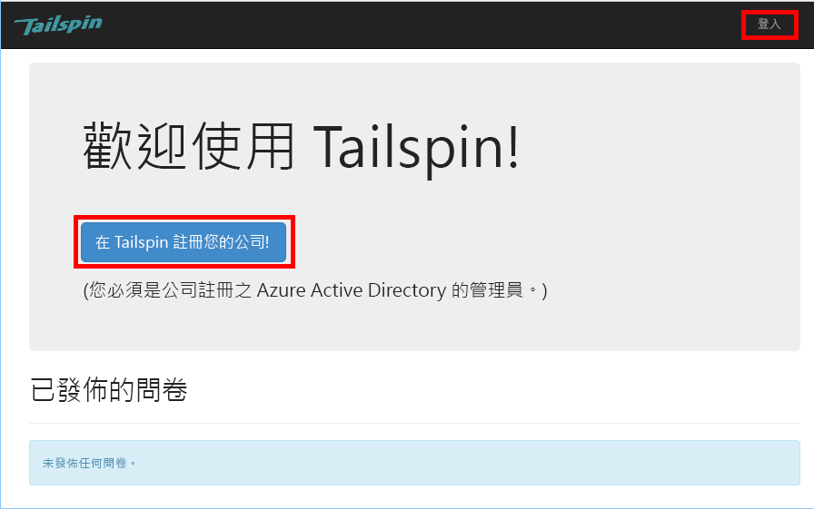

# <a name="tenant-sign-up-and-onboarding"></a><span data-ttu-id="0c8c7-103">租用戶註冊和上線</span><span class="sxs-lookup"><span data-stu-id="0c8c7-103">Tenant sign-up and onboarding</span></span>

<span data-ttu-id="0c8c7-104">[ 程式碼範例][sample application]</span><span class="sxs-lookup"><span data-stu-id="0c8c7-104">[ Sample code][sample application]</span></span>

<span data-ttu-id="0c8c7-105">此文章說明如何在多租用戶應用程式中實作「註冊」程序，允許客戶註冊其組織以使用您的應用程式。</span><span class="sxs-lookup"><span data-stu-id="0c8c7-105">This article describes how to implement a *sign-up* process in a multi-tenant application, which allows a customer to sign up their organization for your application.</span></span>
<span data-ttu-id="0c8c7-106">實作註冊程序的原因有幾個：</span><span class="sxs-lookup"><span data-stu-id="0c8c7-106">There are several reasons to implement a sign-up process:</span></span>

* <span data-ttu-id="0c8c7-107">讓 AD 系統管理員能夠同意客戶的整個組織使用應用程式。</span><span class="sxs-lookup"><span data-stu-id="0c8c7-107">Allow an AD admin to consent for the customer's entire organization to use the application.</span></span>
* <span data-ttu-id="0c8c7-108">收取信用卡付款或收集其他客戶資訊。</span><span class="sxs-lookup"><span data-stu-id="0c8c7-108">Collect credit card payment or other customer information.</span></span>
* <span data-ttu-id="0c8c7-109">執行您的應用程式所需的任何一次性個別租用戶設定。</span><span class="sxs-lookup"><span data-stu-id="0c8c7-109">Perform any one-time per-tenant setup needed by your application.</span></span>

## <a name="admin-consent-and-azure-ad-permissions"></a><span data-ttu-id="0c8c7-110">系統管理員同意與 Azure AD 權限</span><span class="sxs-lookup"><span data-stu-id="0c8c7-110">Admin consent and Azure AD permissions</span></span>
<span data-ttu-id="0c8c7-111">為了向 Azure AD 驗證，應用程式需要存取使用者的目錄。</span><span class="sxs-lookup"><span data-stu-id="0c8c7-111">In order to authenticate with Azure AD, an application needs access to the user's directory.</span></span> <span data-ttu-id="0c8c7-112">應用程式至少需有讀取使用者設定檔的權限。</span><span class="sxs-lookup"><span data-stu-id="0c8c7-112">At a minimum, the application needs permission to read the user's profile.</span></span> <span data-ttu-id="0c8c7-113">使用者第一次登入時，Azure AD 會顯示列出所要求之權限的同意頁面。</span><span class="sxs-lookup"><span data-stu-id="0c8c7-113">The first time that a user signs in, Azure AD shows a consent page that lists the permissions being requested.</span></span> <span data-ttu-id="0c8c7-114">按一下 [接受] ，使用者就會授與權限給應用程式。</span><span class="sxs-lookup"><span data-stu-id="0c8c7-114">By clicking **Accept**, the user grants permission to the application.</span></span>

<span data-ttu-id="0c8c7-115">依照預設，會以個別使用者為基礎來授與同意。</span><span class="sxs-lookup"><span data-stu-id="0c8c7-115">By default, consent is granted on a per-user basis.</span></span> <span data-ttu-id="0c8c7-116">每個登入的使用者都會看到同意頁面。</span><span class="sxs-lookup"><span data-stu-id="0c8c7-116">Every user who signs in sees the consent page.</span></span> <span data-ttu-id="0c8c7-117">但是，Azure AD 也支援「系統管理員同意」，可允許 AD 系統管理員代表整個組織來同意。</span><span class="sxs-lookup"><span data-stu-id="0c8c7-117">However, Azure AD also supports  *admin consent*, which allows an AD administrator to consent for an entire organization.</span></span>

<span data-ttu-id="0c8c7-118">使用系統管理員同意流程時，同意頁面會說明 AD 系統管理員正代表整個租用戶授與權限：</span><span class="sxs-lookup"><span data-stu-id="0c8c7-118">When the admin consent flow is used, the consent page states that the AD admin is granting permission on behalf of the entire tenant:</span></span>



<span data-ttu-id="0c8c7-120">在系統管理員按一下 [接受] 之後，同一租用戶內的其他使用者就都可以登入，且 Azure AD 將會略過同意畫面。</span><span class="sxs-lookup"><span data-stu-id="0c8c7-120">After the admin clicks **Accept**, other users within the same tenant can sign in, and Azure AD will skip the consent screen.</span></span>

<span data-ttu-id="0c8c7-121">只有 AD 系統管理員可以提供系統管理員同意，因為他可以代表整個組織授與權限。</span><span class="sxs-lookup"><span data-stu-id="0c8c7-121">Only an AD administrator can give admin consent, because it grants permission on behalf of the entire organization.</span></span> <span data-ttu-id="0c8c7-122">如果非系統管理員嘗試在系統管理員同意流程中驗證，Azure AD 會顯示錯誤：</span><span class="sxs-lookup"><span data-stu-id="0c8c7-122">If a non-administrator tries to authenticate with the admin consent flow, Azure AD displays an error:</span></span>



<span data-ttu-id="0c8c7-124">如果應用程式之後需要其他權限，客戶將需要再次註冊並同意已更新的權限。</span><span class="sxs-lookup"><span data-stu-id="0c8c7-124">If the application requires additional permissions at a later point, the customer will need to sign up again and consent to the updated permissions.</span></span>  

## <a name="implementing-tenant-sign-up"></a><span data-ttu-id="0c8c7-125">實作租用戶註冊</span><span class="sxs-lookup"><span data-stu-id="0c8c7-125">Implementing tenant sign-up</span></span>
<span data-ttu-id="0c8c7-126">對於 [Tailspin Surveys][Tailspin] 應用程式，我們定義了註冊程序的幾項需求：</span><span class="sxs-lookup"><span data-stu-id="0c8c7-126">For the [Tailspin Surveys][Tailspin] application,  we defined several requirements for the sign-up process:</span></span>

* <span data-ttu-id="0c8c7-127">租用戶必須先註冊，使用者才能登入。</span><span class="sxs-lookup"><span data-stu-id="0c8c7-127">A tenant must sign up before users can sign in.</span></span>
* <span data-ttu-id="0c8c7-128">註冊會使用系統管理員同意流程。</span><span class="sxs-lookup"><span data-stu-id="0c8c7-128">Sign-up uses the admin consent flow.</span></span>
* <span data-ttu-id="0c8c7-129">註冊會將使用者的租用戶新增至應用程式資料庫。</span><span class="sxs-lookup"><span data-stu-id="0c8c7-129">Sign-up adds the user's tenant to the application database.</span></span>
* <span data-ttu-id="0c8c7-130">在租用戶註冊之後，應用程式會顯示上架頁面。</span><span class="sxs-lookup"><span data-stu-id="0c8c7-130">After a tenant signs up, the application shows an onboarding page.</span></span>

<span data-ttu-id="0c8c7-131">我們將在本節中詳細說明登入程序的實作步驟。</span><span class="sxs-lookup"><span data-stu-id="0c8c7-131">In this section, we'll walk through our implementation of the sign-up process.</span></span>
<span data-ttu-id="0c8c7-132">請務必瞭解「註冊」與「登入」乃是應用程式的概念。</span><span class="sxs-lookup"><span data-stu-id="0c8c7-132">It's important to understand that "sign up" versus "sign in" is an application concept.</span></span> <span data-ttu-id="0c8c7-133">在驗證流程期間，Azure AD 不會知道使用者是否正處於註冊程序中。</span><span class="sxs-lookup"><span data-stu-id="0c8c7-133">During the authentication flow, Azure AD does not inherently know whether the user is in process of signing up.</span></span> <span data-ttu-id="0c8c7-134">需由應用程式持續追蹤相關內容。</span><span class="sxs-lookup"><span data-stu-id="0c8c7-134">It's up to the application to keep track of the context.</span></span>

<span data-ttu-id="0c8c7-135">當匿名使用者造訪 Surveys 應用程式時，會向使用者顯示兩個按鈕，一個用來登入，另一個用來註冊您的公司 (註冊)。</span><span class="sxs-lookup"><span data-stu-id="0c8c7-135">When an anonymous user visits the Surveys application, the user is shown two buttons, one to sign in, and one to "enroll your company" (sign up).</span></span>



<span data-ttu-id="0c8c7-137">這些按鈕會在 `AccountController` 類別中叫用動作。</span><span class="sxs-lookup"><span data-stu-id="0c8c7-137">These buttons invoke actions in the `AccountController` class.</span></span>

<span data-ttu-id="0c8c7-138">`SignIn` 動作會傳回 **ChallegeResult**，這會使 OpenID Connect 中介軟體重新導向到驗證端點。</span><span class="sxs-lookup"><span data-stu-id="0c8c7-138">The `SignIn` action returns a **ChallegeResult**, which causes the OpenID Connect middleware to redirect to the authentication endpoint.</span></span> <span data-ttu-id="0c8c7-139">這是 ASP.NET Core 中觸發驗證的預設方式。</span><span class="sxs-lookup"><span data-stu-id="0c8c7-139">This is the default way to trigger authentication in ASP.NET Core.</span></span>  

```csharp
[AllowAnonymous]
public IActionResult SignIn()
{
    return new ChallengeResult(
        OpenIdConnectDefaults.AuthenticationScheme,
        new AuthenticationProperties
        {
            IsPersistent = true,
            RedirectUri = Url.Action("SignInCallback", "Account")
        });
}
```

<span data-ttu-id="0c8c7-140">現在請比較 `SignUp` 動作：</span><span class="sxs-lookup"><span data-stu-id="0c8c7-140">Now compare the `SignUp` action:</span></span>

```csharp
[AllowAnonymous]
public IActionResult SignUp()
{
    var state = new Dictionary<string, string> { { "signup", "true" }};
    return new ChallengeResult(
        OpenIdConnectDefaults.AuthenticationScheme,
        new AuthenticationProperties(state)
        {
            RedirectUri = Url.Action(nameof(SignUpCallback), "Account")
        });
}
```

<span data-ttu-id="0c8c7-141">和 `SignIn` 一樣，`SignUp` 動作也會傳回 `ChallengeResult`。</span><span class="sxs-lookup"><span data-stu-id="0c8c7-141">Like `SignIn`, the `SignUp` action also returns a `ChallengeResult`.</span></span> <span data-ttu-id="0c8c7-142">但是這次，我們在中 `AuthenticationProperties` in the `ChallengeResult`：</span><span class="sxs-lookup"><span data-stu-id="0c8c7-142">But this time, we add a piece of state information to the `AuthenticationProperties` in the `ChallengeResult`:</span></span>

* <span data-ttu-id="0c8c7-143">signup: 這是一個布林值旗標，指示使用者已經開始註冊程序。</span><span class="sxs-lookup"><span data-stu-id="0c8c7-143">signup: A Boolean flag, indicating that the user has started the sign-up process.</span></span>

<span data-ttu-id="0c8c7-144">`AuthenticationProperties` 中的狀態資訊會新增至 OpenID Connect [state] 參數，該參數會在驗證流程中來回傳遞。</span><span class="sxs-lookup"><span data-stu-id="0c8c7-144">The state information in `AuthenticationProperties` gets added to the OpenID Connect [state] parameter, which round trips during the authentication flow.</span></span>


<span data-ttu-id="0c8c7-146">在使用者於 Azure AD 驗證並被重新導向回應用程式之後，驗證票證就會包含狀態。</span><span class="sxs-lookup"><span data-stu-id="0c8c7-146">After the user authenticates in Azure AD and gets redirected back to the application, the authentication ticket contains the state.</span></span> <span data-ttu-id="0c8c7-147">我們會使用此事實來確保 "signup" 值可在整個驗證流程中保留。</span><span class="sxs-lookup"><span data-stu-id="0c8c7-147">We are using this fact to make sure the "signup" value persists across the entire authentication flow.</span></span>

## <a name="adding-the-admin-consent-prompt"></a><span data-ttu-id="0c8c7-148">新增系統管理員同意提示</span><span class="sxs-lookup"><span data-stu-id="0c8c7-148">Adding the admin consent prompt</span></span>
<span data-ttu-id="0c8c7-149">在 Azure AD 中，是透過將 "prompt" 參數新增至驗證要求中的查詢字串來觸發系統管理員同意流程：</span><span class="sxs-lookup"><span data-stu-id="0c8c7-149">In Azure AD, the admin consent flow is triggered by adding a "prompt" parameter to the query string in the authentication request:</span></span>

```
/authorize?prompt=admin_consent&...
```

<span data-ttu-id="0c8c7-150">Surveys 應用程式會在 `RedirectToAuthenticationEndpoint` 事件期間新增提示。</span><span class="sxs-lookup"><span data-stu-id="0c8c7-150">The Surveys application adds the prompt during the `RedirectToAuthenticationEndpoint` event.</span></span> <span data-ttu-id="0c8c7-151">在中介軟體重新導向至驗證端點之前會呼叫此事件。</span><span class="sxs-lookup"><span data-stu-id="0c8c7-151">This event is called right before the middleware redirects to the authentication endpoint.</span></span>

```csharp
public override Task RedirectToAuthenticationEndpoint(RedirectContext context)
{
    if (context.IsSigningUp())
    {
        context.ProtocolMessage.Prompt = "admin_consent";
    }

    _logger.RedirectToIdentityProvider();
    return Task.FromResult(0);
}
```

<span data-ttu-id="0c8c7-152">設定` ProtocolMessage.Prompt` 可告知中介軟體將 "prompt" 參數新增至驗證要求。</span><span class="sxs-lookup"><span data-stu-id="0c8c7-152">Setting` ProtocolMessage.Prompt` tells the middleware to add the "prompt" parameter to the authentication request.</span></span>

<span data-ttu-id="0c8c7-153">請注意，只有在註冊期間才需要提示。</span><span class="sxs-lookup"><span data-stu-id="0c8c7-153">Note that the prompt is only needed during sign-up.</span></span> <span data-ttu-id="0c8c7-154">一般登入不應該包括提示。</span><span class="sxs-lookup"><span data-stu-id="0c8c7-154">Regular sign-in should not include it.</span></span> <span data-ttu-id="0c8c7-155">為區分它們，我們會檢查驗證狀態中的 `signup` 值。</span><span class="sxs-lookup"><span data-stu-id="0c8c7-155">To distinguish between them, we check for the `signup` value in the authentication state.</span></span> <span data-ttu-id="0c8c7-156">以下的擴充方法會檢查這個條件：</span><span class="sxs-lookup"><span data-stu-id="0c8c7-156">The following extension method checks for this condition:</span></span>

```csharp
internal static bool IsSigningUp(this BaseControlContext context)
{
    Guard.ArgumentNotNull(context, nameof(context));

    string signupValue;
    // Check the HTTP context and convert to string
    if ((context.Ticket == null) ||
        (!context.Ticket.Properties.Items.TryGetValue("signup", out signupValue)))
    {
        return false;
    }

    // We have found the value, so see if it's valid
    bool isSigningUp;
    if (!bool.TryParse(signupValue, out isSigningUp))
    {
        // The value for signup is not a valid boolean, throw                
        throw new InvalidOperationException($"'{signupValue}' is an invalid boolean value");
    }

    return isSigningUp;
}
```

## <a name="registering-a-tenant"></a><span data-ttu-id="0c8c7-157">註冊租用戶</span><span class="sxs-lookup"><span data-stu-id="0c8c7-157">Registering a Tenant</span></span>
<span data-ttu-id="0c8c7-158">Surveys 應用程式會將每個租用戶與使用者的一些相關資訊儲存在應用程式資料庫中。</span><span class="sxs-lookup"><span data-stu-id="0c8c7-158">The Surveys application stores some information about each tenant and user in the application database.</span></span>


<span data-ttu-id="0c8c7-160">在租用戶資料表中，IssuerValue 為簽發者為租用戶宣告的值。</span><span class="sxs-lookup"><span data-stu-id="0c8c7-160">In the Tenant table, IssuerValue is the value of the issuer claim for the tenant.</span></span> <span data-ttu-id="0c8c7-161">對於 Azure AD 而言，這是 `https://sts.windows.net/<tentantID>` 並為每個租用戶提供唯一的值。</span><span class="sxs-lookup"><span data-stu-id="0c8c7-161">For Azure AD, this is `https://sts.windows.net/<tentantID>` and gives a unique value per tenant.</span></span>

<span data-ttu-id="0c8c7-162">當新的租用戶註冊時，Surveys 應用程式就會將租用戶記錄寫入資料庫。</span><span class="sxs-lookup"><span data-stu-id="0c8c7-162">When a new tenant signs up, the Surveys application writes a tenant record to the database.</span></span> <span data-ttu-id="0c8c7-163">這是在 `AuthenticationValidated` 事件內部發生。</span><span class="sxs-lookup"><span data-stu-id="0c8c7-163">This happens inside the `AuthenticationValidated` event.</span></span> <span data-ttu-id="0c8c7-164">(請勿在此事件發生之前這樣做，因為識別碼權杖當時將尚未生效，所以您無法信任宣告值。</span><span class="sxs-lookup"><span data-stu-id="0c8c7-164">(Don't do it before this event, because the ID token won't be validated yet, so you can't trust the claim values.</span></span> <span data-ttu-id="0c8c7-165">請參閱 [驗證]。</span><span class="sxs-lookup"><span data-stu-id="0c8c7-165">See [Authentication].</span></span>

<span data-ttu-id="0c8c7-166">以下是來自 Surveys 應用程式的相關程式碼：</span><span class="sxs-lookup"><span data-stu-id="0c8c7-166">Here is the relevant code from the Surveys application:</span></span>

```csharp
public override async Task TokenValidated(TokenValidatedContext context)
{
    var principal = context.AuthenticationTicket.Principal;
    var userId = principal.GetObjectIdentifierValue();
    var tenantManager = context.HttpContext.RequestServices.GetService<TenantManager>();
    var userManager = context.HttpContext.RequestServices.GetService<UserManager>();
    var issuerValue = principal.GetIssuerValue();
    _logger.AuthenticationValidated(userId, issuerValue);

    // Normalize the claims first.
    NormalizeClaims(principal);
    var tenant = await tenantManager.FindByIssuerValueAsync(issuerValue)
        .ConfigureAwait(false);

    if (context.IsSigningUp())
    {
        if (tenant == null)
        {
            tenant = await SignUpTenantAsync(context, tenantManager)
                .ConfigureAwait(false);
        }

        // In this case, we need to go ahead and set up the user signing us up.
        await CreateOrUpdateUserAsync(context.Ticket, userManager, tenant)
            .ConfigureAwait(false);
    }
    else
    {
        if (tenant == null)
        {
            _logger.UnregisteredUserSignInAttempted(userId, issuerValue);
            throw new SecurityTokenValidationException($"Tenant {issuerValue} is not registered");
        }

        await CreateOrUpdateUserAsync(context.Ticket, userManager, tenant)
            .ConfigureAwait(false);
    }
}
```

<span data-ttu-id="0c8c7-167">此程式碼會執行以下動作：</span><span class="sxs-lookup"><span data-stu-id="0c8c7-167">This code does the following:</span></span>

1. <span data-ttu-id="0c8c7-168">檢查資料庫中是否已經有租用戶的簽發者值。</span><span class="sxs-lookup"><span data-stu-id="0c8c7-168">Check if the tenant's issuer value is already in the database.</span></span> <span data-ttu-id="0c8c7-169">如果租用戶尚未註冊， `FindByIssuerValueAsync` 會傳回 null。</span><span class="sxs-lookup"><span data-stu-id="0c8c7-169">If the tenant has not signed up, `FindByIssuerValueAsync` returns null.</span></span>
2. <span data-ttu-id="0c8c7-170">如果使用者正在註冊：</span><span class="sxs-lookup"><span data-stu-id="0c8c7-170">If the user is signing up:</span></span>
   1. <span data-ttu-id="0c8c7-171">將租用戶新增至資料庫 (`SignUpTenantAsync`)。</span><span class="sxs-lookup"><span data-stu-id="0c8c7-171">Add the tenant to the database (`SignUpTenantAsync`).</span></span>
   2. <span data-ttu-id="0c8c7-172">將已驗證的使用者新增至資料庫 (`CreateOrUpdateUserAsync`)。</span><span class="sxs-lookup"><span data-stu-id="0c8c7-172">Add the authenticated user to the database (`CreateOrUpdateUserAsync`).</span></span>
3. <span data-ttu-id="0c8c7-173">或者完成正常的登入流程：</span><span class="sxs-lookup"><span data-stu-id="0c8c7-173">Otherwise complete the normal sign-in flow:</span></span>
   1. <span data-ttu-id="0c8c7-174">如果資料庫中找不到租用戶的簽發者，這表示租用戶並未註冊，因此客戶需要註冊。</span><span class="sxs-lookup"><span data-stu-id="0c8c7-174">If the tenant's issuer was not found in the database, it means the tenant is not registered, and the customer needs to sign up.</span></span> <span data-ttu-id="0c8c7-175">在該情況下，會擲回例外狀況來導致驗證失敗。</span><span class="sxs-lookup"><span data-stu-id="0c8c7-175">In that case, throw an exception to cause the authentication to fail.</span></span>
   2. <span data-ttu-id="0c8c7-176">或者，如果還沒有使用者的話，就為此使用者建立資料庫記錄 (`CreateOrUpdateUserAsync`)。</span><span class="sxs-lookup"><span data-stu-id="0c8c7-176">Otherwise, create a database record for this user, if there isn't one already (`CreateOrUpdateUserAsync`).</span></span>

<span data-ttu-id="0c8c7-177">以下是將租用戶新增至資料庫的 `SignUpTenantAsync` 方法。</span><span class="sxs-lookup"><span data-stu-id="0c8c7-177">Here is the `SignUpTenantAsync` method that adds the tenant to the database.</span></span>

```csharp
private async Task<Tenant> SignUpTenantAsync(BaseControlContext context, TenantManager tenantManager)
{
    Guard.ArgumentNotNull(context, nameof(context));
    Guard.ArgumentNotNull(tenantManager, nameof(tenantManager));

    var principal = context.Ticket.Principal;
    var issuerValue = principal.GetIssuerValue();
    var tenant = new Tenant
    {
        IssuerValue = issuerValue,
        Created = DateTimeOffset.UtcNow
    };

    try
    {
        await tenantManager.CreateAsync(tenant)
            .ConfigureAwait(false);
    }
    catch(Exception ex)
    {
        _logger.SignUpTenantFailed(principal.GetObjectIdentifierValue(), issuerValue, ex);
        throw;
    }

    return tenant;
}
```

<span data-ttu-id="0c8c7-178">以下是 Surveys 應用程式中整個註冊流程的摘要：</span><span class="sxs-lookup"><span data-stu-id="0c8c7-178">Here is a summary of the entire sign-up flow in the Surveys application:</span></span>

1. <span data-ttu-id="0c8c7-179">使用者按一下 [註冊]  按鈕。</span><span class="sxs-lookup"><span data-stu-id="0c8c7-179">The user clicks the **Sign Up** button.</span></span>
2. <span data-ttu-id="0c8c7-180">`AccountController.SignUp` 動作傳回查問結果。</span><span class="sxs-lookup"><span data-stu-id="0c8c7-180">The `AccountController.SignUp` action returns a challege result.</span></span>  <span data-ttu-id="0c8c7-181">驗證狀態包括 "signup" 值。</span><span class="sxs-lookup"><span data-stu-id="0c8c7-181">The authentication state includes "signup" value.</span></span>
3. <span data-ttu-id="0c8c7-182">在 `RedirectToAuthenticationEndpoint` 事件中，加入 `admin_consent` 提示。</span><span class="sxs-lookup"><span data-stu-id="0c8c7-182">In the `RedirectToAuthenticationEndpoint` event, add the `admin_consent` prompt.</span></span>
4. <span data-ttu-id="0c8c7-183">OpenID Connect 中介軟體會重新導向到 Azure AD 與使用者驗證。</span><span class="sxs-lookup"><span data-stu-id="0c8c7-183">The OpenID Connect middleware redirects to Azure AD and the user authenticates.</span></span>
5. <span data-ttu-id="0c8c7-184">在 `AuthenticationValidated` 事件中，尋找 "signup" 狀態。</span><span class="sxs-lookup"><span data-stu-id="0c8c7-184">In the `AuthenticationValidated` event, look for the "signup" state.</span></span>
6. <span data-ttu-id="0c8c7-185">將租用戶新增至資料庫。</span><span class="sxs-lookup"><span data-stu-id="0c8c7-185">Add the tenant to the database.</span></span>

<span data-ttu-id="0c8c7-186">[**下一主題**][app roles]</span><span class="sxs-lookup"><span data-stu-id="0c8c7-186">[**Next**][app roles]</span></span>

<!-- Links -->
[app roles]: app-roles.md
[Tailspin]: tailspin.md

[state]: http://openid.net/specs/openid-connect-core-1_0.html#AuthRequest
[驗證]: authenticate.md
[sample application]: https://github.com/mspnp/multitenant-saas-guidance
