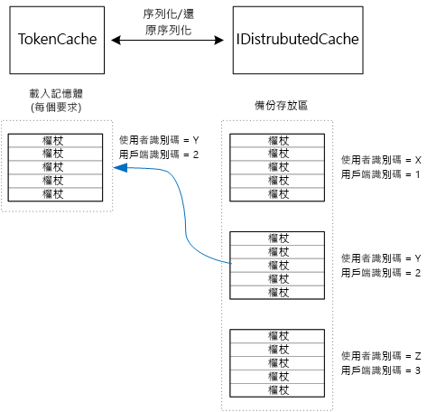

# <a name="cache-access-tokens"></a><span data-ttu-id="b1083-103">快取存取權杖</span><span class="sxs-lookup"><span data-stu-id="b1083-103">Cache access tokens</span></span>

<span data-ttu-id="b1083-104">[ 程式碼範例][sample application]</span><span class="sxs-lookup"><span data-stu-id="b1083-104">[ Sample code][sample application]</span></span>

<span data-ttu-id="b1083-105">相對於取得 OAuth 存取權杖，它的成本較高，因為它需要向權杖端點進行 HTTP 要求。</span><span class="sxs-lookup"><span data-stu-id="b1083-105">It's relatively expensive to get an OAuth access token, because it requires an HTTP request to the token endpoint.</span></span> <span data-ttu-id="b1083-106">因此，盡可能地快取權杖是不錯的做法。</span><span class="sxs-lookup"><span data-stu-id="b1083-106">Therefore, it's good to cache tokens whenever possible.</span></span> <span data-ttu-id="b1083-107">[Azure AD 驗證程式庫][ADAL] (ADAL) 會自動快取取自 Azure AD 的權杖，包括重新整理權杖。</span><span class="sxs-lookup"><span data-stu-id="b1083-107">The [Azure AD Authentication Library][ADAL] (ADAL)  automatically caches tokens obtained from Azure AD, including refresh tokens.</span></span>

<span data-ttu-id="b1083-108">ADAL 提供預設的權杖快取實作。</span><span class="sxs-lookup"><span data-stu-id="b1083-108">ADAL provides a default token cache implementation.</span></span> <span data-ttu-id="b1083-109">不過，此權杖快取是適用於原生用戶端應用程式，而「不」  適用於 Web 應用程式：</span><span class="sxs-lookup"><span data-stu-id="b1083-109">However, this token cache is intended for native client apps, and is **not** suitable for web apps:</span></span>

* <span data-ttu-id="b1083-110">它是靜態的執行個體，且不具備執行緒安全。</span><span class="sxs-lookup"><span data-stu-id="b1083-110">It is a static instance, and not thread safe.</span></span>
* <span data-ttu-id="b1083-111">它不適用於大量的使用者，因為所有使用者的權杖都會移入相同的字典。</span><span class="sxs-lookup"><span data-stu-id="b1083-111">It doesn't scale to large numbers of users, because tokens from all users go into the same dictionary.</span></span>
* <span data-ttu-id="b1083-112">它無法在伺服器陣列中的 Web 伺服器之間共用。</span><span class="sxs-lookup"><span data-stu-id="b1083-112">It can't be shared across web servers in a farm.</span></span>

<span data-ttu-id="b1083-113">相反地，您應該實作衍生自 ADAL `TokenCache` 類別，但適用於伺服器環境，並且在不同的使用者權杖之間提供所需之隔離層級的自訂權杖快取。</span><span class="sxs-lookup"><span data-stu-id="b1083-113">Instead, you should implement a custom token cache that derives from the ADAL `TokenCache` class but is suitable for a server environment and provides the desirable level of isolation between tokens for different users.</span></span>

<span data-ttu-id="b1083-114">`TokenCache` 類別會儲存權杖的字典，並以簽發者、資源、用戶端識別碼和使用者編制索引。</span><span class="sxs-lookup"><span data-stu-id="b1083-114">The `TokenCache` class stores a dictionary of tokens, indexed by issuer, resource, client ID, and user.</span></span> <span data-ttu-id="b1083-115">自訂權杖快取應該將此字典寫入至備份存放區，例如 Redis 快取。</span><span class="sxs-lookup"><span data-stu-id="b1083-115">A custom token cache should write this dictionary to a backing store, such as a Redis cache.</span></span>

<span data-ttu-id="b1083-116">在 Tailspin Surveys 應用程式中，`DistributedTokenCache` 類別會實作權杖快取。</span><span class="sxs-lookup"><span data-stu-id="b1083-116">In the Tailspin Surveys application, the `DistributedTokenCache` class implements the token cache.</span></span> <span data-ttu-id="b1083-117">此實作會使用來自 ASP.NET Core 的 [IDistributedCache][distributed-cache] 抽象。</span><span class="sxs-lookup"><span data-stu-id="b1083-117">This implementation uses the [IDistributedCache][distributed-cache] abstraction from ASP.NET Core.</span></span> <span data-ttu-id="b1083-118">這樣一來，任何 `IDistributedCache` 實作可用來當做備份存放區。</span><span class="sxs-lookup"><span data-stu-id="b1083-118">That way, any `IDistributedCache` implementation can be used as a backing store.</span></span>

* <span data-ttu-id="b1083-119">根據預設，Surveys 應用程式會使用 Redis 快取。</span><span class="sxs-lookup"><span data-stu-id="b1083-119">By default, the Surveys app uses a Redis cache.</span></span>
* <span data-ttu-id="b1083-120">針對單一執行個體 Web 伺服器，您可以使用 ASP.NET Core [記憶體中快取][in-memory-cache]。</span><span class="sxs-lookup"><span data-stu-id="b1083-120">For a single-instance web server, you could use the ASP.NET Core [in-memory cache][in-memory-cache].</span></span> <span data-ttu-id="b1083-121">(這也是在開發期間於本機執行應用程式的不錯選擇。)</span><span class="sxs-lookup"><span data-stu-id="b1083-121">(This is also a good option for running the app locally during development.)</span></span>

<span data-ttu-id="b1083-122">`DistributedTokenCache` 會將快取資料在備份存放區中儲存為索引鍵/值組。</span><span class="sxs-lookup"><span data-stu-id="b1083-122">`DistributedTokenCache` stores the cache data as key/value pairs in the backing store.</span></span> <span data-ttu-id="b1083-123">索引鍵是使用者識別碼加上用戶端識別碼，因此備份存放區會為每個唯一的使用者/用戶端組合保存個別的快取資料。</span><span class="sxs-lookup"><span data-stu-id="b1083-123">The key is the user ID plus client ID, so the backing store holds separate cache data for each unique combination of user/client.</span></span>



<span data-ttu-id="b1083-125">備份存放區是由使用者進行分割。</span><span class="sxs-lookup"><span data-stu-id="b1083-125">The backing store is partitioned by user.</span></span> <span data-ttu-id="b1083-126">針對每個 HTTP 要求，會從備份存放區讀取該使用者的權杖，然後載入至 `TokenCache` 字典。</span><span class="sxs-lookup"><span data-stu-id="b1083-126">For each HTTP request, the tokens for that user are read from the backing store and loaded into the `TokenCache` dictionary.</span></span> <span data-ttu-id="b1083-127">若將 Redis 作為備份存放區，在伺服器陣列中的每個伺服器執行個體會讀取/寫入相同的快取，而此方法適用於許多使用者。</span><span class="sxs-lookup"><span data-stu-id="b1083-127">If Redis is used as the backing store, every server instance in a server farm reads/writes to the same cache, and this approach scales to many users.</span></span>

## <a name="encrypting-cached-tokens"></a><span data-ttu-id="b1083-128">加密快取的權杖</span><span class="sxs-lookup"><span data-stu-id="b1083-128">Encrypting cached tokens</span></span>

<span data-ttu-id="b1083-129">權杖是敏感性資料，因為它們會授與使用者資源的存取權限。</span><span class="sxs-lookup"><span data-stu-id="b1083-129">Tokens are sensitive data, because they grant access to a user's resources.</span></span> <span data-ttu-id="b1083-130">(此外，不同於使用者的密碼，您無法只儲存權杖的雜湊。)因此，務必保護權杖不遭洩漏。</span><span class="sxs-lookup"><span data-stu-id="b1083-130">(Moreover, unlike a user's password, you can't just store a hash of the token.) Therefore, it's critical to protect tokens from being compromised.</span></span> <span data-ttu-id="b1083-131">Redis 備份的快取是以密碼保護，但如果有人取得密碼，他們就可以取得所有快取的存取權杖。</span><span class="sxs-lookup"><span data-stu-id="b1083-131">The Redis-backed cache is protected by a password, but if someone obtains the password, they could get all of the cached access tokens.</span></span> <span data-ttu-id="b1083-132">基於該理由， `DistributedTokenCache` 會加密其寫入至備份存放區的所有項目。</span><span class="sxs-lookup"><span data-stu-id="b1083-132">For that reason, the `DistributedTokenCache` encrypts everything that it writes to the backing store.</span></span> <span data-ttu-id="b1083-133">加密是使用 ASP.NET Core [資料保護][data-protection] API 完成。</span><span class="sxs-lookup"><span data-stu-id="b1083-133">Encryption is done using the ASP.NET Core [data protection][data-protection] APIs.</span></span>

> [!NOTE]
> <span data-ttu-id="b1083-134">如果您部署至 Azure 網站，加密金鑰會備份至網路儲存體，並在所有機器上同步處理 (請參閱[金鑰管理和存留期][key-management])。</span><span class="sxs-lookup"><span data-stu-id="b1083-134">If you deploy to Azure Web Sites, the encryption keys are backed up to network storage and synchronized across all machines (see [Key management and lifetime][key-management]).</span></span> <span data-ttu-id="b1083-135">根據預設，金鑰於 Azure 網站中執行時不會加密，不過您可以[使用 X.509 憑證啟用加密][x509-cert-encryption]。</span><span class="sxs-lookup"><span data-stu-id="b1083-135">By default, keys are not encrypted when running in Azure Web Sites, but you can [enable encryption using an X.509 certificate][x509-cert-encryption].</span></span>

## <a name="distributedtokencache-implementation"></a><span data-ttu-id="b1083-136">DistributedTokenCache 實作</span><span class="sxs-lookup"><span data-stu-id="b1083-136">DistributedTokenCache implementation</span></span>

<span data-ttu-id="b1083-137">`DistributedTokenCache` 類別衍生自 ADAL [TokenCache][tokencache-class] 類別。</span><span class="sxs-lookup"><span data-stu-id="b1083-137">The `DistributedTokenCache` class derives from the ADAL [TokenCache][tokencache-class] class.</span></span>

<span data-ttu-id="b1083-138">在建構函式中， `DistributedTokenCache` 會為目前的使用者建立索引鍵，並從備份存放區中載入快取：</span><span class="sxs-lookup"><span data-stu-id="b1083-138">In the constructor, the `DistributedTokenCache` class creates a key for the current user and loads the cache from the backing store:</span></span>

```csharp
public DistributedTokenCache(
    ClaimsPrincipal claimsPrincipal,
    IDistributedCache distributedCache,
    ILoggerFactory loggerFactory,
    IDataProtectionProvider dataProtectionProvider)
    : base()
{
    _claimsPrincipal = claimsPrincipal;
    _cacheKey = BuildCacheKey(_claimsPrincipal);
    _distributedCache = distributedCache;
    _logger = loggerFactory.CreateLogger<DistributedTokenCache>();
    _protector = dataProtectionProvider.CreateProtector(typeof(DistributedTokenCache).FullName);
    AfterAccess = AfterAccessNotification;
    LoadFromCache();
}
```

<span data-ttu-id="b1083-139">索引鍵是以使用者識別碼與用戶端識別碼串連建立。</span><span class="sxs-lookup"><span data-stu-id="b1083-139">The key is created by concatenating the user ID and client ID.</span></span> <span data-ttu-id="b1083-140">這兩者皆取自於使用者的 `ClaimsPrincipal`中找到的宣告：</span><span class="sxs-lookup"><span data-stu-id="b1083-140">Both of these are taken from claims found in the user's `ClaimsPrincipal`:</span></span>

```csharp
private static string BuildCacheKey(ClaimsPrincipal claimsPrincipal)
{
    string clientId = claimsPrincipal.FindFirstValue("aud", true);
    return string.Format(
        "UserId:{0}::ClientId:{1}",
        claimsPrincipal.GetObjectIdentifierValue(),
        clientId);
}
```

<span data-ttu-id="b1083-141">若要載入快取資料，請從備份存放區讀取序列化的 Blob，並呼叫 `TokenCache.Deserialize` 將 Blob 轉換為快取資料。</span><span class="sxs-lookup"><span data-stu-id="b1083-141">To load the cache data, read the serialized blob from the backing store, and call `TokenCache.Deserialize` to convert the blob into cache data.</span></span>

```csharp
private void LoadFromCache()
{
    byte[] cacheData = _distributedCache.Get(_cacheKey);
    if (cacheData != null)
    {
        this.Deserialize(_protector.Unprotect(cacheData));
    }
}
```

<span data-ttu-id="b1083-142">每當 ADAL 存取快取，它會引發 `AfterAccess` 事件。</span><span class="sxs-lookup"><span data-stu-id="b1083-142">Whenever ADAL access the cache, it fires an `AfterAccess` event.</span></span> <span data-ttu-id="b1083-143">如果快取資料已變更， `HasStateChanged` 屬性為 true。</span><span class="sxs-lookup"><span data-stu-id="b1083-143">If the cache data has changed, the `HasStateChanged` property is true.</span></span> <span data-ttu-id="b1083-144">在該情況下，請更新備份存放區以反映變更，然後將 `HasStateChanged` 設為 false。</span><span class="sxs-lookup"><span data-stu-id="b1083-144">In that case, update the backing store to reflect the change, and then set `HasStateChanged` to false.</span></span>

```csharp
public void AfterAccessNotification(TokenCacheNotificationArgs args)
{
    if (this.HasStateChanged)
    {
        try
        {
            if (this.Count > 0)
            {
                _distributedCache.Set(_cacheKey, _protector.Protect(this.Serialize()));
            }
            else
            {
                // There are no tokens for this user/client, so remove the item from the cache.
                _distributedCache.Remove(_cacheKey);
            }
            this.HasStateChanged = false;
        }
        catch (Exception exp)
        {
            _logger.WriteToCacheFailed(exp);
            throw;
        }
    }
}
```

<span data-ttu-id="b1083-145">TokenCache 會傳送兩個其他事件：</span><span class="sxs-lookup"><span data-stu-id="b1083-145">TokenCache sends two other events:</span></span>

* <span data-ttu-id="b1083-146">`BeforeWrite`。</span><span class="sxs-lookup"><span data-stu-id="b1083-146">`BeforeWrite`.</span></span> <span data-ttu-id="b1083-147">在 ADAL 寫入至快取前會立即呼叫。</span><span class="sxs-lookup"><span data-stu-id="b1083-147">Called immediately before ADAL writes to the cache.</span></span> <span data-ttu-id="b1083-148">您可以使用此事件來實作並行存取策略</span><span class="sxs-lookup"><span data-stu-id="b1083-148">You can use this to implement a concurrency strategy</span></span>
* <span data-ttu-id="b1083-149">`BeforeAccess`。</span><span class="sxs-lookup"><span data-stu-id="b1083-149">`BeforeAccess`.</span></span> <span data-ttu-id="b1083-150">在 ADAL 從快取讀取前會立即呼叫。</span><span class="sxs-lookup"><span data-stu-id="b1083-150">Called immediately before ADAL reads from the cache.</span></span> <span data-ttu-id="b1083-151">您可以在這裡重新載入快取，以取得最新版本。</span><span class="sxs-lookup"><span data-stu-id="b1083-151">Here you can reload the cache to get the latest version.</span></span>

<span data-ttu-id="b1083-152">在我們的案例中，我們決定不處理這兩個事件。</span><span class="sxs-lookup"><span data-stu-id="b1083-152">In our case, we decided not to handle these two events.</span></span>

* <span data-ttu-id="b1083-153">針對並行存取，以最後寫入者為準。</span><span class="sxs-lookup"><span data-stu-id="b1083-153">For concurrency, last write wins.</span></span> <span data-ttu-id="b1083-154">這是可行的，因為存取是針對每個使用者+用戶端獨立儲存，因此只有在同一使用者擁有兩個並行登入工作階段時才會發生衝突。</span><span class="sxs-lookup"><span data-stu-id="b1083-154">That's OK, because tokens are stored independently for each user + client, so a conflict would only happen if the same user had two concurrent login sessions.</span></span>
* <span data-ttu-id="b1083-155">針對讀取，我們會在每次要求時載入快取。</span><span class="sxs-lookup"><span data-stu-id="b1083-155">For reading, we load the cache on every request.</span></span> <span data-ttu-id="b1083-156">要求是短時間的。</span><span class="sxs-lookup"><span data-stu-id="b1083-156">Requests are short lived.</span></span> <span data-ttu-id="b1083-157">若快取在該時間內遭到修改，下一個要求將會挑選新的值。</span><span class="sxs-lookup"><span data-stu-id="b1083-157">If the cache gets modified in that time, the next request will pick up the new value.</span></span>

<span data-ttu-id="b1083-158">[**下一主題**][client-assertion]</span><span class="sxs-lookup"><span data-stu-id="b1083-158">[**Next**][client-assertion]</span></span>

<!-- links -->
[ADAL]: https://msdn.microsoft.com/library/azure/jj573266.aspx
[client-assertion]: ./client-assertion.md
[data-protection]: /aspnet/core/security/data-protection/
[distributed-cache]: /aspnet/core/performance/caching/distributed
[key-management]: /aspnet/core/security/data-protection/configuration/default-settings
[in-memory-cache]: /aspnet/core/performance/caching/memory
[tokencache-class]: https://msdn.microsoft.com/library/azure/microsoft.identitymodel.clients.activedirectory.tokencache.aspx
[x509-cert-encryption]: /aspnet/core/security/data-protection/implementation/key-encryption-at-rest#x509-certificate
[sample application]: https://github.com/mspnp/multitenant-saas-guidance
