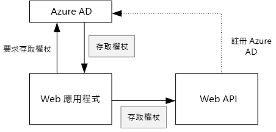
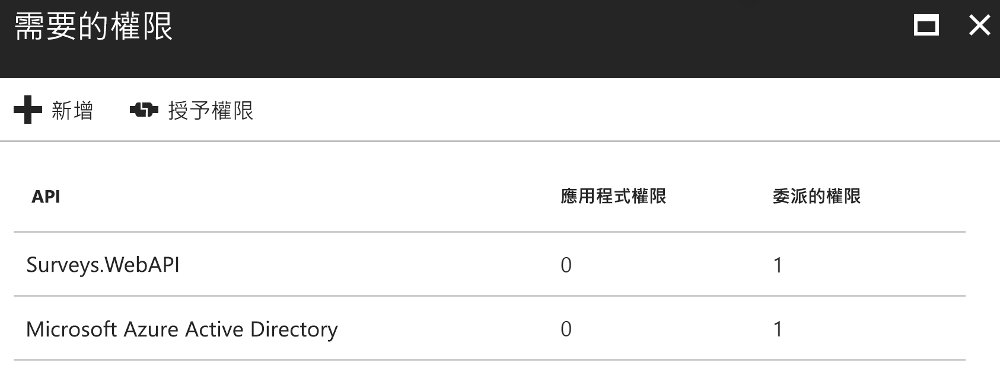

# <a name="secure-a-backend-web-api"></a><span data-ttu-id="4dbf0-103">保護後端 Web API</span><span class="sxs-lookup"><span data-stu-id="4dbf0-103">Secure a backend web API</span></span>

<span data-ttu-id="4dbf0-104">[ 程式碼範例][sample application]</span><span class="sxs-lookup"><span data-stu-id="4dbf0-104">[ Sample code][sample application]</span></span>

<span data-ttu-id="4dbf0-105">[Tailspin Surveys] 應用程式使用後端 Web API 來管理問卷的 CRUD 作業。</span><span class="sxs-lookup"><span data-stu-id="4dbf0-105">The [Tailspin Surveys] application uses a backend web API to manage CRUD operations on surveys.</span></span> <span data-ttu-id="4dbf0-106">例如，當使用者按一下 [我的問卷調查] 時，Web 應用程式會傳送 HTTP 要求到 Web API：</span><span class="sxs-lookup"><span data-stu-id="4dbf0-106">For example, when a user clicks "My Surveys", the web application sends an HTTP request to the web API:</span></span>

```
GET /users/{userId}/surveys
```

<span data-ttu-id="4dbf0-107">Web API 會傳回 JSON 物件：</span><span class="sxs-lookup"><span data-stu-id="4dbf0-107">The web API returns a JSON object:</span></span>

```
{
  "Published":[],
  "Own":[
    {"Id":1,"Title":"Survey 1"},
    {"Id":3,"Title":"Survey 3"},
    ],
  "Contribute": [{"Id":8,"Title":"My survey"}]
}
```

<span data-ttu-id="4dbf0-108">Web API 不允許匿名要求，因此 Web 應用程式必須使用 OAuth 2 持有人權杖來驗證自己。</span><span class="sxs-lookup"><span data-stu-id="4dbf0-108">The web API does not allow anonymous requests, so the web app must authenticate itself using OAuth 2 bearer tokens.</span></span>

> [!NOTE]
> <span data-ttu-id="4dbf0-109">這是伺服器對伺服器案例。</span><span class="sxs-lookup"><span data-stu-id="4dbf0-109">This is a server-to-server scenario.</span></span> <span data-ttu-id="4dbf0-110">應用程式不會從瀏覽器用戶端對 API 進行任何 AJAX 呼叫。</span><span class="sxs-lookup"><span data-stu-id="4dbf0-110">The application does not make any AJAX calls to the API from the browser client.</span></span>
> 
> 

<span data-ttu-id="4dbf0-111">您可以採取兩種主要方式：</span><span class="sxs-lookup"><span data-stu-id="4dbf0-111">There are two main approaches you can take:</span></span>

* <span data-ttu-id="4dbf0-112">委派的使用者識別。</span><span class="sxs-lookup"><span data-stu-id="4dbf0-112">Delegated user identity.</span></span> <span data-ttu-id="4dbf0-113">Web 應用程式會驗證使用者的身分識別。</span><span class="sxs-lookup"><span data-stu-id="4dbf0-113">The web application authenticates with the user's identity.</span></span>
* <span data-ttu-id="4dbf0-114">應用程式識別碼。</span><span class="sxs-lookup"><span data-stu-id="4dbf0-114">Application identity.</span></span> <span data-ttu-id="4dbf0-115">Web 應用程式會使用 OAuth2 用戶端認證流程驗證其用戶端識別碼。</span><span class="sxs-lookup"><span data-stu-id="4dbf0-115">The web application authenticates with its client ID, using OAuth2 client credential flow.</span></span>

<span data-ttu-id="4dbf0-116">Tailspin 應用程式實作委派的使用者識別。</span><span class="sxs-lookup"><span data-stu-id="4dbf0-116">The Tailspin application implements delegated user identity.</span></span> <span data-ttu-id="4dbf0-117">以下是兩者的主要差異：</span><span class="sxs-lookup"><span data-stu-id="4dbf0-117">Here are the main differences:</span></span>

<span data-ttu-id="4dbf0-118">**委派的使用者識別**</span><span class="sxs-lookup"><span data-stu-id="4dbf0-118">**Delegated user identity**</span></span>

* <span data-ttu-id="4dbf0-119">傳送給 Web API 的持有人權杖包含了使用者識別。</span><span class="sxs-lookup"><span data-stu-id="4dbf0-119">The bearer token sent to the web API contains the user identity.</span></span>
* <span data-ttu-id="4dbf0-120">Web API 會根據使用者識別進行授權決策。</span><span class="sxs-lookup"><span data-stu-id="4dbf0-120">The web API makes authorization decisions based on the user identity.</span></span>
* <span data-ttu-id="4dbf0-121">如果未授權使用者執行動作，Web 應用程式需要處理 Web API 的 403 (禁止) 錯誤。</span><span class="sxs-lookup"><span data-stu-id="4dbf0-121">The web application needs to handle 403 (Forbidden) errors from the web API, if the user is not authorized to perform an action.</span></span>
* <span data-ttu-id="4dbf0-122">一般而言，Web 應用程式仍會做出某些影響 UI的授權決策，例如顯示或隱藏 UI 項目。</span><span class="sxs-lookup"><span data-stu-id="4dbf0-122">Typically, the web application still makes some authorization decisions that affect UI, such as showing or hiding UI elements).</span></span>
* <span data-ttu-id="4dbf0-123">Web API 可能可以由不受信任的用戶端所使用，例如 JavaScript 應用程式或原生用戶端應用程式。</span><span class="sxs-lookup"><span data-stu-id="4dbf0-123">The web API can potentially be used by untrusted clients, such as a JavaScript application or a native client application.</span></span>

<span data-ttu-id="4dbf0-124">**應用程式識別碼**</span><span class="sxs-lookup"><span data-stu-id="4dbf0-124">**Application identity**</span></span>

* <span data-ttu-id="4dbf0-125">Web API 不會取得使用者的相關資訊。</span><span class="sxs-lookup"><span data-stu-id="4dbf0-125">The web API does not get information about the user.</span></span>
* <span data-ttu-id="4dbf0-126">Web API 不能執行任何根據使用者識別的授權。</span><span class="sxs-lookup"><span data-stu-id="4dbf0-126">The web API cannot perform any authorization based on the user identity.</span></span> <span data-ttu-id="4dbf0-127">所有的授權決策都是由 Web 應用程式所進行。</span><span class="sxs-lookup"><span data-stu-id="4dbf0-127">All authorization decisions are made by the web application.</span></span>  
* <span data-ttu-id="4dbf0-128">Web API 不能由未受信任的用戶端 (JavaScript 或原生用戶端應用程式) 使用。</span><span class="sxs-lookup"><span data-stu-id="4dbf0-128">The web API cannot be used by an untrusted client (JavaScript or native client application).</span></span>
* <span data-ttu-id="4dbf0-129">實作這種方法可能較為容易，因為 Web API 中沒有授權邏輯。</span><span class="sxs-lookup"><span data-stu-id="4dbf0-129">This approach may be somewhat simpler to implement, because there is no authorization logic in the Web API.</span></span>

<span data-ttu-id="4dbf0-130">這兩種方法中，Web 應用程式必須取得存取權杖，也就是呼叫 Web API 所需的認證。</span><span class="sxs-lookup"><span data-stu-id="4dbf0-130">In either approach, the web application must get an access token, which is the credential needed to call the web API.</span></span>

* <span data-ttu-id="4dbf0-131">如果是委派的使用者識別，權杖必須來自可代表使用者發行權杖的 IDP。</span><span class="sxs-lookup"><span data-stu-id="4dbf0-131">For delegated user identity, the token has to come from the IDP, which can issue a token on behalf of the user.</span></span>
* <span data-ttu-id="4dbf0-132">如果是用戶端認證，應用程式可能會從 IDP 取得權杖，或主控自己的權杖伺服器。</span><span class="sxs-lookup"><span data-stu-id="4dbf0-132">For client credentials, an application might get the token from the IDP or host its own token server.</span></span> <span data-ttu-id="4dbf0-133">(但請勿重頭開始撰寫權杖伺服器，請使用經完整測試的架構，例如 [IdentityServer3])。如果您使用 Azure AD 進行驗證，強烈建議從 Azure AD 取得存取權杖，即使是使用用戶端認證流程也一樣。</span><span class="sxs-lookup"><span data-stu-id="4dbf0-133">(But don't write a token server from scratch; use a well-tested framework like [IdentityServer3].) If you authenticate with Azure AD, it's strongly recommended to get the access token from Azure AD, even with client credential flow.</span></span>

<span data-ttu-id="4dbf0-134">本文的其餘部分假設應用程式透過 Azure AD 進行驗證。</span><span class="sxs-lookup"><span data-stu-id="4dbf0-134">The rest of this article assumes the application is authenticating with Azure AD.</span></span>



## <a name="register-the-web-api-in-azure-ad"></a><span data-ttu-id="4dbf0-136">在 Azure AD 中註冊 Web API</span><span class="sxs-lookup"><span data-stu-id="4dbf0-136">Register the web API in Azure AD</span></span>
<span data-ttu-id="4dbf0-137">為了讓 Azure AD 發行 Web API 的持有人權杖，您需要設定 Azure AD。</span><span class="sxs-lookup"><span data-stu-id="4dbf0-137">In order for Azure AD to issue a bearer token for the web API, you need to configure some things in Azure AD.</span></span>

1. <span data-ttu-id="4dbf0-138">在 Azure AD 中註冊 Web API。</span><span class="sxs-lookup"><span data-stu-id="4dbf0-138">Register the web API in Azure AD.</span></span>

2. <span data-ttu-id="4dbf0-139">新增 Web 應用程式的用戶端識別碼至 `knownClientApplications` 屬性中的 Web API 應用程式資訊清單。</span><span class="sxs-lookup"><span data-stu-id="4dbf0-139">Add the client ID of the web app to the web API application manifest, in the `knownClientApplications` property.</span></span> <span data-ttu-id="4dbf0-140">請參閱 [更新應用程式資訊清單]。</span><span class="sxs-lookup"><span data-stu-id="4dbf0-140">See [Update the application manifests].</span></span>

3. <span data-ttu-id="4dbf0-141">提供 Web 應用程式權限來呼叫 Web API。</span><span class="sxs-lookup"><span data-stu-id="4dbf0-141">Give the web application permission to call the web API.</span></span> <span data-ttu-id="4dbf0-142">在 Azure 管理入口網站中，您可以設定兩種類型的權限：適用於應用程式識別 (用戶端認證流程) 的「應用程式權限」或適用於委派之使用者識別的「委派權限」。</span><span class="sxs-lookup"><span data-stu-id="4dbf0-142">In the Azure Management Portal, you can set two types of permissions: "Application Permissions" for application identity (client credential flow), or "Delegated Permissions" for delegated user identity.</span></span>
   
   

## <a name="getting-an-access-token"></a><span data-ttu-id="4dbf0-144">取得存取權杖</span><span class="sxs-lookup"><span data-stu-id="4dbf0-144">Getting an access token</span></span>
<span data-ttu-id="4dbf0-145">呼叫 Web API 之前，Web 應用程式會從 Azure AD 取得存取權杖。</span><span class="sxs-lookup"><span data-stu-id="4dbf0-145">Before calling the web API, the web application gets an access token from Azure AD.</span></span> <span data-ttu-id="4dbf0-146">在 .NET 應用程式中，使用[適用於 .NET 的 Azure AD 驗證程式庫 (ADAL)][ADAL]。</span><span class="sxs-lookup"><span data-stu-id="4dbf0-146">In a .NET application, use the [Azure AD Authentication Library (ADAL) for .NET][ADAL].</span></span>

<span data-ttu-id="4dbf0-147">在 OAuth 2 授權程式碼流程中，應用程式會交換存取權杖的授權碼。</span><span class="sxs-lookup"><span data-stu-id="4dbf0-147">In the OAuth 2 authorization code flow, the application exchanges an authorization code for an access token.</span></span> <span data-ttu-id="4dbf0-148">下列程式碼會使用 ADAL 來取得存取權杖。</span><span class="sxs-lookup"><span data-stu-id="4dbf0-148">The following code uses ADAL to get the access token.</span></span> <span data-ttu-id="4dbf0-149">`AuthorizationCodeReceived` 事件期間會呼叫這個程式碼。</span><span class="sxs-lookup"><span data-stu-id="4dbf0-149">This code is called during the `AuthorizationCodeReceived` event.</span></span>

```csharp
// The OpenID Connect middleware sends this event when it gets the authorization code.   
public override async Task AuthorizationCodeReceived(AuthorizationCodeReceivedContext context)
{
    string authorizationCode = context.ProtocolMessage.Code;
    string authority = "https://login.microsoftonline.com/" + tenantID
    string resourceID = "https://tailspin.onmicrosoft.com/surveys.webapi" // App ID URI
    ClientCredential credential = new ClientCredential(clientId, clientSecret);

    AuthenticationContext authContext = new AuthenticationContext(authority, tokenCache);
    AuthenticationResult authResult = await authContext.AcquireTokenByAuthorizationCodeAsync(
        authorizationCode, new Uri(redirectUri), credential, resourceID);

    // If successful, the token is in authResult.AccessToken
}
```

<span data-ttu-id="4dbf0-150">以下是各種所需的參數：</span><span class="sxs-lookup"><span data-stu-id="4dbf0-150">Here are the various parameters that are needed:</span></span>

* <span data-ttu-id="4dbf0-151">`authority`。</span><span class="sxs-lookup"><span data-stu-id="4dbf0-151">`authority`.</span></span> <span data-ttu-id="4dbf0-152">衍生自已登入使用者的租用戶識別碼。</span><span class="sxs-lookup"><span data-stu-id="4dbf0-152">Derived from the tenant ID of the signed in user.</span></span> <span data-ttu-id="4dbf0-153">(非 SaaS 提供者的租用戶識別碼)</span><span class="sxs-lookup"><span data-stu-id="4dbf0-153">(Not the tenant ID of the SaaS provider)</span></span>  
* <span data-ttu-id="4dbf0-154">`authorizationCode`。</span><span class="sxs-lookup"><span data-stu-id="4dbf0-154">`authorizationCode`.</span></span> <span data-ttu-id="4dbf0-155">您從 IDP 取得的驗證程式碼。</span><span class="sxs-lookup"><span data-stu-id="4dbf0-155">the auth code that you got back from the IDP.</span></span>
* <span data-ttu-id="4dbf0-156">`clientId`。</span><span class="sxs-lookup"><span data-stu-id="4dbf0-156">`clientId`.</span></span> <span data-ttu-id="4dbf0-157">Web 應用程式的用戶端識別碼。</span><span class="sxs-lookup"><span data-stu-id="4dbf0-157">The web application's client ID.</span></span>
* <span data-ttu-id="4dbf0-158">`clientSecret`。</span><span class="sxs-lookup"><span data-stu-id="4dbf0-158">`clientSecret`.</span></span> <span data-ttu-id="4dbf0-159">Web 應用程式的用戶端密碼。</span><span class="sxs-lookup"><span data-stu-id="4dbf0-159">The web application's client secret.</span></span>
* <span data-ttu-id="4dbf0-160">`redirectUri`。</span><span class="sxs-lookup"><span data-stu-id="4dbf0-160">`redirectUri`.</span></span> <span data-ttu-id="4dbf0-161">您針對 OpenID Connect 設定的重新導向 URI。</span><span class="sxs-lookup"><span data-stu-id="4dbf0-161">The redirect URI that you set for OpenID connect.</span></span> <span data-ttu-id="4dbf0-162">這是 IDP 使用權杖進行回呼的位置。</span><span class="sxs-lookup"><span data-stu-id="4dbf0-162">This is where the IDP calls back with the token.</span></span>
* <span data-ttu-id="4dbf0-163">`resourceID`。</span><span class="sxs-lookup"><span data-stu-id="4dbf0-163">`resourceID`.</span></span> <span data-ttu-id="4dbf0-164">Web API 的應用程式識別碼 URI，當您在 Azure AD 中註冊 Web API 時所建立</span><span class="sxs-lookup"><span data-stu-id="4dbf0-164">The App ID URI of the web API, which you created when you registered the web API in Azure AD</span></span>
* <span data-ttu-id="4dbf0-165">`tokenCache`。</span><span class="sxs-lookup"><span data-stu-id="4dbf0-165">`tokenCache`.</span></span> <span data-ttu-id="4dbf0-166">快取存取權杖的物件。</span><span class="sxs-lookup"><span data-stu-id="4dbf0-166">An object that caches the access tokens.</span></span> <span data-ttu-id="4dbf0-167">請參閱 [權杖快取]。</span><span class="sxs-lookup"><span data-stu-id="4dbf0-167">See [Token caching].</span></span>

<span data-ttu-id="4dbf0-168">如果 `AcquireTokenByAuthorizationCodeAsync` 成功，ADAL 會快取權杖。</span><span class="sxs-lookup"><span data-stu-id="4dbf0-168">If `AcquireTokenByAuthorizationCodeAsync` succeeds, ADAL caches the token.</span></span> <span data-ttu-id="4dbf0-169">稍後，您可以藉由呼叫 AcquireTokenSilentAsync 從快取取得權杖：</span><span class="sxs-lookup"><span data-stu-id="4dbf0-169">Later, you can get the token from the cache by calling AcquireTokenSilentAsync:</span></span>

```csharp
AuthenticationContext authContext = new AuthenticationContext(authority, tokenCache);
var result = await authContext.AcquireTokenSilentAsync(resourceID, credential, new UserIdentifier(userId, UserIdentifierType.UniqueId));
```

<span data-ttu-id="4dbf0-170">其中的 `userId` 是使用者的物件識別碼，可在 `http://schemas.microsoft.com/identity/claims/objectidentifier` 宣告中找到。</span><span class="sxs-lookup"><span data-stu-id="4dbf0-170">where `userId` is the user's object ID, which is found in the `http://schemas.microsoft.com/identity/claims/objectidentifier` claim.</span></span>

## <a name="using-the-access-token-to-call-the-web-api"></a><span data-ttu-id="4dbf0-171">使用存取權杖呼叫 Web API</span><span class="sxs-lookup"><span data-stu-id="4dbf0-171">Using the access token to call the web API</span></span>
<span data-ttu-id="4dbf0-172">一旦您擁有權杖，請在 HTTP 要求的授權標頭中將它傳送至 Web API。</span><span class="sxs-lookup"><span data-stu-id="4dbf0-172">Once you have the token, send it in the Authorization header of the HTTP requests to the web API.</span></span>

```
Authorization: Bearer xxxxxxxxxx
```

<span data-ttu-id="4dbf0-173">下列的 Surveys 應用程式的擴充方法，會使用 **HttpClient** 類別在 HTTP 要求上設定授權標頭。</span><span class="sxs-lookup"><span data-stu-id="4dbf0-173">The following extension method from the Surveys application sets the Authorization header on an HTTP request, using the **HttpClient** class.</span></span>

```csharp
public static async Task<HttpResponseMessage> SendRequestWithBearerTokenAsync(this HttpClient httpClient, HttpMethod method, string path, object requestBody, string accessToken, CancellationToken ct)
{
    var request = new HttpRequestMessage(method, path);
    if (requestBody != null)
    {
        var json = JsonConvert.SerializeObject(requestBody, Formatting.None);
        var content = new StringContent(json, Encoding.UTF8, "application/json");
        request.Content = content;
    }

    request.Headers.Authorization = new AuthenticationHeaderValue("Bearer", accessToken);
    request.Headers.Accept.Add(new MediaTypeWithQualityHeaderValue("application/json"));

    var response = await httpClient.SendAsync(request, ct);
    return response;
}
```

## <a name="authenticating-in-the-web-api"></a><span data-ttu-id="4dbf0-174">在 Web API 中進行驗證</span><span class="sxs-lookup"><span data-stu-id="4dbf0-174">Authenticating in the web API</span></span>
<span data-ttu-id="4dbf0-175">Web API 必須驗證持有人權杖。</span><span class="sxs-lookup"><span data-stu-id="4dbf0-175">The web API has to authenticate the bearer token.</span></span> <span data-ttu-id="4dbf0-176">在 ASP.NET Core 中，您可以使用 [Microsoft.AspNet.Authentication.JwtBearer][JwtBearer] 套件。</span><span class="sxs-lookup"><span data-stu-id="4dbf0-176">In ASP.NET Core, you can use the [Microsoft.AspNet.Authentication.JwtBearer][JwtBearer] package.</span></span> <span data-ttu-id="4dbf0-177">此封裝提供中介軟體，讓應用程式能接收 OpenID Connect 持有人權杖。</span><span class="sxs-lookup"><span data-stu-id="4dbf0-177">This package provides middleware that enables the application to receive OpenID Connect bearer tokens.</span></span>

<span data-ttu-id="4dbf0-178">在您的 Web API `Startup` 類別中註冊中介軟體</span><span class="sxs-lookup"><span data-stu-id="4dbf0-178">Register the middleware in your web API `Startup` class.</span></span>

```csharp
public void Configure(IApplicationBuilder app, IHostingEnvironment env, ApplicationDbContext dbContext, ILoggerFactory loggerFactory)
{
    // ...

    app.UseJwtBearerAuthentication(new JwtBearerOptions {
        Audience = configOptions.AzureAd.WebApiResourceId,
        Authority = Constants.AuthEndpointPrefix,
        TokenValidationParameters = new TokenValidationParameters {
            ValidateIssuer = false
        },
        Events= new SurveysJwtBearerEvents(loggerFactory.CreateLogger<SurveysJwtBearerEvents>())
    });
    
    // ...
}
```

* <span data-ttu-id="4dbf0-179">**對象**。</span><span class="sxs-lookup"><span data-stu-id="4dbf0-179">**Audience**.</span></span> <span data-ttu-id="4dbf0-180">針對 Web API 將此選項設定為當您在 Azure AD 中註冊 Web API 時建立的應用程式識別碼 URL。</span><span class="sxs-lookup"><span data-stu-id="4dbf0-180">Set this to the App ID URL for the web API, which you created when you registered the web API with Azure AD.</span></span>
* <span data-ttu-id="4dbf0-181">**授權單位**。</span><span class="sxs-lookup"><span data-stu-id="4dbf0-181">**Authority**.</span></span> <span data-ttu-id="4dbf0-182">對於多租用戶應用程式，將此選項設定為 `https://login.microsoftonline.com/common/`。</span><span class="sxs-lookup"><span data-stu-id="4dbf0-182">For a multitenant application, set this to `https://login.microsoftonline.com/common/`.</span></span>
* <span data-ttu-id="4dbf0-183">**TokenValidationParameters**。</span><span class="sxs-lookup"><span data-stu-id="4dbf0-183">**TokenValidationParameters**.</span></span> <span data-ttu-id="4dbf0-184">對於多租用戶應用程式，請將 **ValidateIssuer** 設為 false。</span><span class="sxs-lookup"><span data-stu-id="4dbf0-184">For a multitenant application, set **ValidateIssuer** to false.</span></span> <span data-ttu-id="4dbf0-185">這表示應用程式會驗證簽發者。</span><span class="sxs-lookup"><span data-stu-id="4dbf0-185">That means the application will validate the issuer.</span></span>
* <span data-ttu-id="4dbf0-186">**Events** 是衍生自 **JwtBearerEvents** 的類別。</span><span class="sxs-lookup"><span data-stu-id="4dbf0-186">**Events** is a class that derives from **JwtBearerEvents**.</span></span>

### <a name="issuer-validation"></a><span data-ttu-id="4dbf0-187">簽發者驗證</span><span class="sxs-lookup"><span data-stu-id="4dbf0-187">Issuer validation</span></span>
<span data-ttu-id="4dbf0-188">驗證 **JwtBearerEvents.TokenValidated** 事件中的權杖簽發者。</span><span class="sxs-lookup"><span data-stu-id="4dbf0-188">Validate the token issuer in the **JwtBearerEvents.TokenValidated** event.</span></span> <span data-ttu-id="4dbf0-189">簽發者會在 "iss" 宣告中傳送。</span><span class="sxs-lookup"><span data-stu-id="4dbf0-189">The issuer is sent in the "iss" claim.</span></span>

<span data-ttu-id="4dbf0-190">在 Surveys 應用程式中，Web API 不會處理 [租用戶註冊]。</span><span class="sxs-lookup"><span data-stu-id="4dbf0-190">In the Surveys application, the web API doesn't handle [tenant sign-up].</span></span> <span data-ttu-id="4dbf0-191">因此，它只會檢查簽發者是否已經在應用程式資料庫中。</span><span class="sxs-lookup"><span data-stu-id="4dbf0-191">Therefore, it just checks if the issuer is already in the application database.</span></span> <span data-ttu-id="4dbf0-192">如果沒有，則會擲回例外狀況，這會導致驗證失敗。</span><span class="sxs-lookup"><span data-stu-id="4dbf0-192">If not, it throws an exception, which causes authentication to fail.</span></span>

```csharp
public override async Task TokenValidated(TokenValidatedContext context)
{
    var principal = context.Ticket.Principal;
    var tenantManager = context.HttpContext.RequestServices.GetService<TenantManager>();
    var userManager = context.HttpContext.RequestServices.GetService<UserManager>();
    var issuerValue = principal.GetIssuerValue();
    var tenant = await tenantManager.FindByIssuerValueAsync(issuerValue);

    if (tenant == null)
    {
        // The caller was not from a trusted issuer. Throw to block the authentication flow.
        throw new SecurityTokenValidationException();
    }

    var identity = principal.Identities.First();

    // Add new claim for survey_userid
    var registeredUser = await userManager.FindByObjectIdentifier(principal.GetObjectIdentifierValue());
    identity.AddClaim(new Claim(SurveyClaimTypes.SurveyUserIdClaimType, registeredUser.Id.ToString()));
    identity.AddClaim(new Claim(SurveyClaimTypes.SurveyTenantIdClaimType, registeredUser.TenantId.ToString()));

    // Add new claim for Email
    var email = principal.FindFirst(ClaimTypes.Upn)?.Value;
    if (!string.IsNullOrWhiteSpace(email))
    {
        identity.AddClaim(new Claim(ClaimTypes.Email, email));
    }
}
```

<span data-ttu-id="4dbf0-193">如本範例所示，您也可以使用 **TokenValidated** 事件來修改宣告。</span><span class="sxs-lookup"><span data-stu-id="4dbf0-193">As this example shows, you can also use the **TokenValidated** event to modify the claims.</span></span> <span data-ttu-id="4dbf0-194">請記住，宣告直接來自 Azure AD。</span><span class="sxs-lookup"><span data-stu-id="4dbf0-194">Remember that the claims come directly from Azure AD.</span></span> <span data-ttu-id="4dbf0-195">如果 Web 應用程式修改它所取得的宣告，這些變更將不會顯示在 Web API 接收的持有人權杖中。</span><span class="sxs-lookup"><span data-stu-id="4dbf0-195">If the web application modifies the claims that it gets, those changes won't show up in the bearer token that the web API receives.</span></span> <span data-ttu-id="4dbf0-196">如需詳細資訊，請參閱[宣告轉換][claims-transformation]。</span><span class="sxs-lookup"><span data-stu-id="4dbf0-196">For more information, see [Claims transformations][claims-transformation].</span></span>

## <a name="authorization"></a><span data-ttu-id="4dbf0-197">Authorization</span><span class="sxs-lookup"><span data-stu-id="4dbf0-197">Authorization</span></span>
<span data-ttu-id="4dbf0-198">如需授權的一般討論，請參閱[角色和資源型授權][Authorization]。</span><span class="sxs-lookup"><span data-stu-id="4dbf0-198">For a general discussion of authorization, see [Role-based and resource-based authorization][Authorization].</span></span> 

<span data-ttu-id="4dbf0-199">JwtBearer 中介軟體會處理授權回應。</span><span class="sxs-lookup"><span data-stu-id="4dbf0-199">The JwtBearer middleware handles the authorization responses.</span></span> <span data-ttu-id="4dbf0-200">例如，若要將控制器動作限制在已驗證的使用者，請使用 **[Authorize]** 屬性，並指定 **JwtBearerDefaults.AuthenticationScheme** 作為驗證配置：</span><span class="sxs-lookup"><span data-stu-id="4dbf0-200">For example, to restrict a controller action to authenticated users, use the **[Authorize]** atrribute and specify **JwtBearerDefaults.AuthenticationScheme** as the authentication scheme:</span></span>

```csharp
[Authorize(ActiveAuthenticationSchemes = JwtBearerDefaults.AuthenticationScheme)]
```

<span data-ttu-id="4dbf0-201">如果使用者未經過驗證，這樣就會傳回 401 狀態碼。</span><span class="sxs-lookup"><span data-stu-id="4dbf0-201">This returns a 401 status code if the user is not authenticated.</span></span>

<span data-ttu-id="4dbf0-202">若要依授權原則來限制控制器動作，請在 **[Authorize]** 屬性中指定原則名稱：</span><span class="sxs-lookup"><span data-stu-id="4dbf0-202">To restrict a controller action by authorizaton policy, specify the policy name in the **[Authorize]** attribute:</span></span>

```csharp
[Authorize(Policy = PolicyNames.RequireSurveyCreator)]
```

<span data-ttu-id="4dbf0-203">如果使用者未經過驗證，這樣就會傳回 401 狀態碼，如果使用者已經過驗證但未授權則會傳回 403 狀態碼。</span><span class="sxs-lookup"><span data-stu-id="4dbf0-203">This returns a 401 status code if the user is not authenticated, and 403 if the user is authenticated but not authorized.</span></span> <span data-ttu-id="4dbf0-204">啟動時註冊原則：</span><span class="sxs-lookup"><span data-stu-id="4dbf0-204">Register the policy on startup:</span></span>

```csharp
public void ConfigureServices(IServiceCollection services)
{
    services.AddAuthorization(options =>
    {
        options.AddPolicy(PolicyNames.RequireSurveyCreator,
            policy =>
            {
                policy.AddRequirements(new SurveyCreatorRequirement());
                policy.RequireAuthenticatedUser(); // Adds DenyAnonymousAuthorizationRequirement 
                policy.AddAuthenticationSchemes(JwtBearerDefaults.AuthenticationScheme);
            });
        options.AddPolicy(PolicyNames.RequireSurveyAdmin,
            policy =>
            {
                policy.AddRequirements(new SurveyAdminRequirement());
                policy.RequireAuthenticatedUser(); // Adds DenyAnonymousAuthorizationRequirement 
                policy.AddAuthenticationSchemes(JwtBearerDefaults.AuthenticationScheme);
            });
    });
    
    // ...
}
```

<span data-ttu-id="4dbf0-205">[**下一主題**][token cache]</span><span class="sxs-lookup"><span data-stu-id="4dbf0-205">[**Next**][token cache]</span></span>

<!-- links -->
[ADAL]: https://msdn.microsoft.com/library/azure/jj573266.aspx
[JwtBearer]: https://www.nuget.org/packages/Microsoft.AspNet.Authentication.JwtBearer

[Tailspin Surveys]: tailspin.md
[IdentityServer3]: https://github.com/IdentityServer/IdentityServer3
[更新應用程式資訊清單]: ./run-the-app.md#update-the-application-manifests
[Update the application manifests]: ./run-the-app.md#update-the-application-manifests
[權杖快取]: token-cache.md
[Token caching]: token-cache.md
[租用戶註冊]: signup.md
[tenant sign-up]: signup.md
[claims-transformation]: claims.md#claims-transformations
[Authorization]: authorize.md
[sample application]: https://github.com/mspnp/multitenant-saas-guidance
[token cache]: token-cache.md
