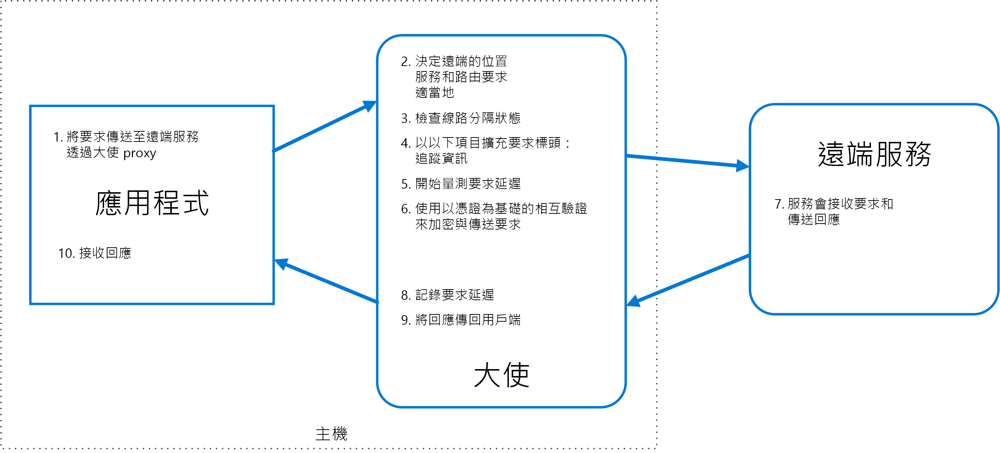

# 大使模式

建立會代表取用者服務或應用程式傳送網路要求的協助程式服務。 大使服務可以視為是與用戶端位於相同位置的處理序外 proxy。

此模式非常適合用於以與語言無關的方式卸載常見的用戶端連線工作，例如監視、記錄、路由、安全性 (如 TLS)、和[復原模式][resiliency-patterns]。 它通常會用於舊版的應用程式或其他難以修改應用程式，以擴充其網路功能。 它也可以讓專門的小組來實作這些功能。

## 內容和問題

具有復原功能的雲端型應用程式需要許多功能，像是[斷路][circuit-breaker]、路由、計量、監視，以及進行網路相關的設定更新能力。 舊版應用程式或現有的程式碼程式庫可能會難以或無法更新加入這些功能，因為程式碼已不再維護或無法由開發小組輕易修改。

網路呼叫也可能需要連線、驗證、授權方面的大幅度設定。 如果這些呼叫由多個應用程式使用，且是以多個語言和架構建立，則必須為牽涉到的每一個執行個體設定呼叫。 此外，您組織內的中心小組可能需要管理網路和安全性功能。 由於有大量的程式碼，讓小組人員更新他們不熟悉的應用程式程式碼風險很大。

## 方案

將用戶端架構和程式庫放入外部處理序，外部處理序此作為應用程式和外部服務之間的 proxy。 將 proxy 部署在與您的應用程式相同的主機環境上，以便控制路由、復原、安全性的功能，以及避免任何與主機相關的存取限制。 您也可以使用大使模式來將檢測設備標準化及擴充。 proxy 可以監視效能計量，例如延遲、資源使用狀況，而且監視發生在與應用程式相同的主機環境中。

卸載至大使的功能可以和應用程式分開獨立管理。 您可以更新並修改大使，而不會干擾應用程式的舊有功能。 它也可讓不同的專門小組實作和維護已移至大使的安全性、網路或驗證功能。

可將大使服務部署為[側車][sidecar]，伴隨著取用的應用程式或服務的生命週期。 或者，如果大使由共同主機上的多個個別處理序共用，可將它部署為精靈或 Windows 服務。 如果取用的服務已容器化，應該將大使建立為相同主機上的不同容器，並針對通訊設定適當的連結。

## 問題和考量

- proxy 會增加一些延遲負擔。 考慮用戶端程式庫 (直接由應用程式叫用) 是否為更好的做法。
- 考慮在 proxy 中加入一般化功能可能造成的影響。 例如，大使可以處理重試，但除非所有作業都是等冪，不然可能不安全。
- 考慮這個機制：允許用戶端傳遞一些內容到 proxy，也允許 proxy 傳給用戶端。 例如，加入 HTTP 要求標頭來退出重試，或指定重試的次數上限。
- 考慮您將如何封裝和部署 proxy。
- 考慮是否要使用單一共用執行個體讓所有用戶端共用，或是一個用戶端一個執行個體。

## 使用此模式的時機

使用此模式的時機包括：

- 需要建立一組常用的多語言或架構的用戶端連線功能。
- 需要將跨領域用戶端連線的重要項目卸載至基礎結構開發人員或其他更專業的小組。
- 需要在舊版應用程式或難以修改的應用程式中支援雲端或叢集的連線需求。

此模式可能不適合用於︰

- 當網路要求延遲很重要。 雖然很小，但 proxy 會帶來一些額外負荷，而在某些情況下，這可能會影響應用程式。
- 當用戶端連線功能是由單一語言耗用。 在此情況下，較好的選擇可能是以套件形式散發到開發小組的用戶端程式庫。
- 當連線功能無法一般化，且需要與用戶端應用程式更深入的整合。

## 範例

下圖顯示應用程式透過大使 proxy 向遠端服務提出要求。 大使提供路由、斷路、記錄。 它會呼叫遠端服務，然後將回應傳回用戶端應用程式：

 

## 相關的指引

- [側車模式](./sidecar.md)

<!-- links -->

[circuit-breaker]: ./circuit-breaker.md
[resiliency-patterns]: ./category/resiliency.md
[sidecar]: ./sidecar.md
