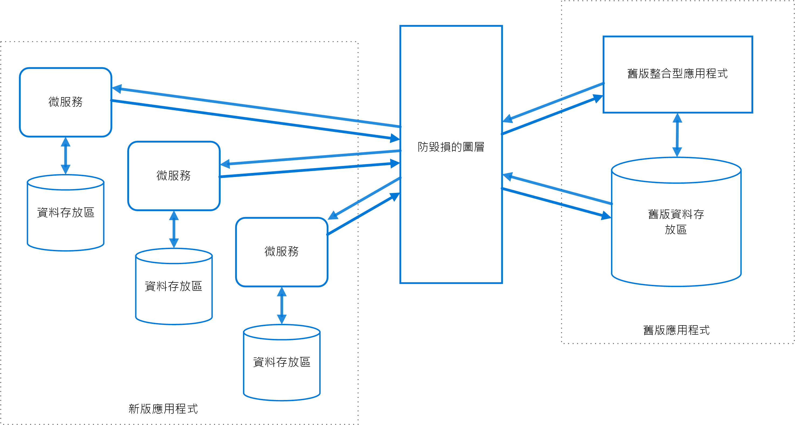

# 防損毀層模式

在不共用相同語意的不同子系統間實作外觀或配接層。 此層會轉譯一個子系統對其他子系統所提出的要求。 您可以使用此模式來確保應用程式的設計不會受限於外部子系統上的相依性。 此模式最早的相關描述，是在 Eric Evans 所著的《Domain-Driven Design (網域導向的設計)》一書中出現。

## 內容和問題

大部分的應用程式依賴其他系統提供某些資料或功能。 例如，將舊版應用程式移轉至現代系統時，仍可能需要現有的舊版資源。 新功能必須能夠呼叫舊版系統。 對於較大型應用程式的不同功能會隨著時間移動到現代系統的漸進式移轉尤其是如此。

通常這些舊版系統會為品質問題所苦，例如迂迴的資料結構描述或過時的 API。 舊版系統中所使用的功能和技術可能與更現代系統大不相同。 為了與舊版系統交互操作，新應用程式可能需要支援過時的基礎結構、通訊協定、資料模型、API 或是您不會放入現代應用程式的其他功能。

維護新版與舊版系統之間的存取權可以強制新系統遵守至少一些舊版系統的 API 或其他語意。 當這些舊版功能有品質問題時，支援它們發生「損毀」，否則可能需要全新設計的現代化應用程式。

不受您的開發小組控制的任何外部系統 (不只舊有系統) 都可能發生類似問題。

## 解決方法

藉由在它們之間放置防損毀層來隔離不同的子系統。 此層會轉譯兩個系統之間的通訊，讓一個系統維持不變，而另一個系統可以避免損害其設計和技術方法。

上圖顯示具有兩個子系統的應用程式。 子系統 A 會透過防損毀層呼叫子系統 B。 子系統 A 與防損毀層之間的通訊一律使用子系統 B 的資料模型和架構。由反損毀層對子系統 A 的呼叫會符合該子系統的資料模型或方法。 防損毀層包含在兩個系統之間進行轉譯所需的所有邏輯。 可以將層實作為應用程式內的元件或獨立的服務。

## 問題和考量

- 防損毀層可以對兩個系統之間的呼叫新增延遲。
- 防損毀層會新增必須管理和維護的一項額外服務。
- 考慮您的防損毀層如何將如何調整。
- 考慮您是否需要多個防損毀層。 您可能想要將功能分解成使用不同的技術或語言的多個服務，或分割防損毀層可能有其他原因。
- 考慮關於您的其他應用程式或服務，防損毀層的管理方式。 如何將它整合到您的監視、發行和設定程序？
- 確定會保有交易和資料的一致性，並且可加以監視。
- 考慮防損毀層是否需要處理不同子系統之間的通訊，或只需處理功能子集。
- 如果防損毀層是應用程式移轉策略的一部分，請考慮它會是永久的，或是會在移轉所有舊版功能之後遭到淘汰。

## 使用此模式的時機

使用此模式的時機包括：

- 移轉規劃分多個階段進行，但需要保有新版與舊版系統之間的整合。
- 兩個以上的子系統有不同的語意，但仍然需要進行通訊。

如果有新版與舊版系統之間沒有顯著的語意差異，此模式可能不適用。

## 相關的指引

- [扼制模式](./strangler.md)
