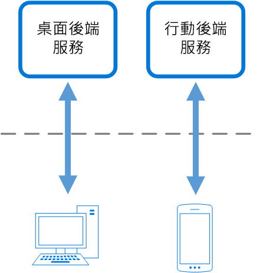

# 前端模式的後端

建立由特定前端應用程式或介面取用的個別後端服務。 想要避免為多個介面自訂單一後端時，此模式相當有用。 此模式最早是由 Sam Newman 所提及。

## 內容和問題

應用程式一開始的目標可能是桌面 Web UI。 一般而言，後端服務會平行開發，提供該 UI 所需的功能。 隨著應用程式的使用者數量成長，即會開發必須與相同後端互動的行動應用程式。 後端服務會變成一般用途的後端，同時為桌面和行動裝置介面的需求提供服務。

但行動裝置的功能與明顯桌面瀏覽器不同，就螢幕大小、效能與顯示限制而言。 因此，行動應用程式後端的需求與桌面 Web UI 的需求不同。

這些差異導致後端的競爭需求。 後端需要進行定期重大變更，才能同時對桌面 Web UI 和行動應用程式提供服務。 通常，個別介面小組會在每個前端上運作，導致後端變成開發程序中的瓶頸。 衝突的更新需求以及需要讓服務保持對這兩個前端運作，會導致花費大量精力於單一可部署資源上。

因為開發活動的重點在於後端服務，可能會建立個別小組來管理和維護後端。 最後，這會導致介面和後端開發小組之間無法連繫，在後端小組上增加負擔，以平衡不同 UI 小組之間的競爭需求。 當一個介面小組需要對後端進行變更時，必須先向其他介面小組驗證這些變更，之後才能將變更整合到後端。

## 解決方法

每個使用者介面建立一個後端。 微調每個後端的行為與效能，以最符合前端環境的需求，而不需擔心影響其他前端的體驗。

因為每個後端相對於一個特定介面，可以為該介面最佳化。 如此一來，它會較小、較簡單且可能快於嘗試滿足所有介面需求的一般後端。 每個介面小組有控制自己後端的自主權，並且不依賴於集中式後端開發小組。 這讓介面小組對於後端的語言選擇、發佈日程、工作負載的優先順序以及功能整合有彈性。

如需詳細資訊，請參閱[模式︰前端的後端](https://samnewman.io/patterns/architectural/bff/)。

## 問題和考量

- 考慮要部署的後端數量。
- 如果不同的介面 (例如行動用戶端) 將進行相同的要求，請考慮是否需要為每個介面實作後端，或單一後端即已足夠。
- 實作此模式時，服務間的程式碼很有高的可能性會重複。
- 以前端為焦點的後端服務應該只包含用戶端的特定邏輯和行為。 應該在您的應用程式中任意處管理一般商務邏輯和其他通用功能。
- 請思考此模式如何反映在開發小組的責任中。
- 考慮實作此模式需要的時間。 在您繼續支援現有的一般後端的同時，建立新後端的投入時間是否會衍生技術債務？

## 使用此模式的時機

使用此模式的時機包括：

- 共用或一般用途的後端服務必須以大量的開發負荷加以維護。
- 您想要針對特定用戶端介面的需求將後端最佳化。
- 自訂作業會對一般用途的後端進行，以容納多個介面。
- 替代語言更適合用於不同的使用者介面的後端。

此模式可能不適合下列時機：

- 當介面對後端進行相同或類似的要求時。
- 只有一個介面用來與後端互動時。

## 相關的指引

- [閘道彙總模式](./gateway-aggregation.md)
- [閘道卸載模式](./gateway-offloading.md)
- [閘道路由模式](./gateway-routing.md)
