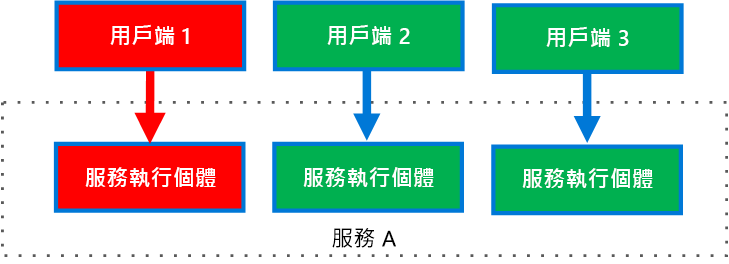

# <a name="bulkhead-pattern"></a>隔艙模式

將應用程式的元素隔離到集區中，以便在其中一個元素失敗時，其他元素可以繼續運作。

這種模式被命名為「隔艙」，因為它類似於船體的剖面分區。 如果船體受損，只有受損部分充滿水，這樣可以防止船舶沉沒。

## <a name="context-and-problem"></a>內容和問題

雲端式應用程式可能包含多個服務，每個服務具有一或多個取用者。 服務負載超量或失敗會影響服務的所有取用者。

此外，取用者可以使用每個要求的資源，同時向多個服務傳送要求。 當取用者向設定不正確或沒有回應的服務傳送要求時，用戶端要求使用的資源可能無法及時釋放。 隨著要求繼續傳送給服務，那些資源可能會耗盡。 例如，用戶端的連線集區可能會耗盡。 此時，取用者對其他服務的要求會受到影響。 最終取用者不能再向其他服務傳送要求，不僅僅是停止回應的原始服務。

相同的資源耗盡問題會影響具有多個取用者的服務。 來自一個用戶端的大量請求可能會耗盡服務中的可用資源。 其他取用者無法再取用該服務，導致連鎖性失效效應。

## <a name="solution"></a>解決方法

根據取用者負載和可用性需求，將服務執行個體分割成不同的群組。 這種設計可以幫助隔離失敗，並允許您為某些取用者維持服務功能，即使在失敗期間也是如此。

取用者也可以分割資源，以確保用來呼叫一個服務的資源，不會影響用來呼叫另一個服務的資源。 例如，呼叫多個服務的取用者可能會被指派每個服務的連線集區。 如果服務開始失敗，它只會影響針對該服務指派的連線集區，讓取用者繼續使用其他服務。

這種模式的好處包括：

- 將取用者和服務與連鎖性失效隔離。 影響取用者或服務的問題可以在其自身的隔艙內隔離，避免整個方案失敗。
- 允許您在服務失敗時保留某些功能。 其他服務和應用程式的功能將繼續運作。
- 可讓您部署為取用應用程式提供不同服務品質的服務。 高優先順序的取用者集區可以設定為使用高優先順序服務。

下圖顯示圍繞呼叫個別服務之連線集區建構的隔艙。 如果服務 A 失敗或造成其他問題，則連線集區將被隔離，因此只有使用指派給服務 A 之執行緒集區的工作負載會受到影響。 使用服務 B 和 C 的工作負載不會受到影響，且可以繼續工作，不會中斷。


下圖顯示呼叫單一服務的多個用戶端。 每個用戶端都被指派個別的服務執行個體。 用戶端 1 提出了太多的要求，而壓倒其執行個體。 由於每個服務執行個體相互隔離，其他用戶端可以繼續進行呼叫。



## <a name="issues-and-considerations"></a>問題和考量

- 定義圍繞應用程式之商務和技術需求的分割區。
- 在將服務或取用者分割到隔艙時，請考慮技術提供的隔離等級，以及成本、效能和管理性方面的額外負荷。
- 請考慮將隔艙與重試模式、斷路器模式和節流模式相結合，以提供更完善的錯誤處理。
- 將取用者分割到隔艙時，請考慮使用處理序、執行緒集區和旗號。 像 [Netflix Hystrix][hystrix] 和 [Polly][polly] 這樣的專案為建立取用者隔艙提供了一個架構。
- 將服務分割到隔艙時，請考慮將它們部署至不同的虛擬機器、容器或處理序。 容器在相當低的額外負荷下，提供了資源隔離的良好平衡。
- 使用非同步訊息進行通訊的服務可以透過不同的佇列集隔離。 每個佇列都可以有一組處理佇列訊息的專用執行個體，或者一組使用演算法來清除佇列並分派處理的執行個體。
- 決定隔艙的資料粒度層級。 例如，如果要在分割區之間分配租用戶，您可以將每個租用戶放入個別的分割區，或將多個租用戶放入一個分割區。
- 監視每個分割區的效能和 SLA。

## <a name="when-to-use-this-pattern"></a>使用此模式的時機

使用這種模式來：

- 隔離用於取用一組後端服務的資源，特別是當應用程式可以提供某種程度的功能，即使其中一個服務沒有回應。
- 隔離重要取用者與標準取用者。
- 保護應用程序免受連鎖性失效。

此模式可能不適用於下列時機︰

- 專案中不接受資源低效率使用。
- 增加的複雜性是沒有必要的

## <a name="example"></a>範例

下列 Kubernetes 設定檔會建立一個隔離容器來執行單一服務，並具有自己的 CPU 和記憶體資源與限制。

```yml
apiVersion: v1
kind: Pod
metadata:
  name: drone-management
spec:
  containers:
  - name: drone-management-container
    image: drone-service
    resources:
      requests:
        memory: "64Mi"
        cpu: "250m"
      limits:
        memory: "128Mi"
        cpu: "1"
```

## <a name="related-guidance"></a>相關的指引

- [為 Azure 設計有彈性的應用程式](../resiliency/index.md)
- [斷路器模式](./circuit-breaker.md)
- [重試模式](./retry.md)
- [節流模式](./throttling.md)

<!-- links -->

[hystrix]: https://github.com/Netflix/Hystrix
[polly]: https://github.com/App-vNext/Polly
