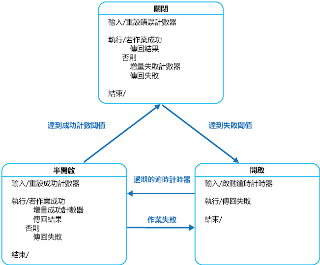

# <a name="circuit-breaker-pattern"></a>斷路器模式

在連線到遠端服務或資源時，處理可能需要不同時間來復原的錯誤。 這可以改善應用程式的穩定性和恢復功能。

## <a name="context-and-problem"></a>內容和問題

在分散式環境中，對遠端資源和服務進行的呼叫可能會因為暫時性錯誤而失敗，例如低速網路連線、逾時、資源過度認可或資源暫時無法使用。 這些錯誤通常會在短時間內自行修正，而強大的雲端應用程式應會使用[重試模式](./retry.md)來準備處理這些錯誤。

不過，也可能發生因為非預期事件導致的錯誤，這可能需要更長的時間來進行修正。 這些錯誤的嚴重性範圍包含失去部分連線到整個服務無法運作。 在這些情況下，持續重試不太可能成功的作業是無意義的，相反地，應用程式應快速接受作業失敗，並且據以處理此失敗事件。

此外，如果服務非常忙碌，則系統中某一部分的失敗可能會導致階層式失敗。 例如，叫用服務的作業可設定為能實作逾時，並在該服務無法在此期間內回應時，回覆失敗訊息。 不過，此策略可能會導致同個作業的許多並行要求遭到封鎖，直到逾時期限到期。 這些已封鎖的要求可能會佔據重要的系統資源，例如記憶體、執行緒、資料庫連線等等。 因此，這些資源可能會被耗盡，導致其他必須使用相同資源但可能不相關的部分系統作業失敗。 在這些情況下，作業最好能立即失敗，並只嘗試叫用可能成功的服務。 請注意，設定較短的逾時可能有助於解決此問題，但逾時不應該過短而造成作業一直失敗，即使服務要求最終會成功。

## <a name="solution"></a>解決方法

因 Michael Nygard 的著作《[Release It!](https://pragprog.com/book/mnee/release-it)》而廣受歡迎的斷路器模式，可防止應用程式重複嘗試執行可能會失敗的作業。 一旦判斷該錯誤會持續較長時間時，該模式會讓應用程式繼續執行，而不用等候錯誤修正或浪費 CPU 循環。 斷路器模式也可讓應用程式偵測錯誤是否已解決。 如果此問題已獲得修正，應用程式可以嘗試叫用作業。

> 斷路器模式的用途與重試模式不同。 重試模式會在預期作業會成功的情況下，讓應用程式重試作業。 斷路器模式會防止應用程式執行很可能會失敗的作業。 應用程式可以結合這兩種模式，透過斷路器使用重試模式來叫用作業。 不過，重試邏輯應對斷路器傳回的任何例外狀況十分敏感，並在斷路器指出錯誤並非暫時性時，放棄重試。

針對可能失敗的作業，斷路器會充當 Proxy。 Proxy 應監視最近發生的失敗數量，並使用此資訊來決定是否允許作業繼續，或是立即傳回例外狀況。

Proxy 可以實作為具有下列狀態的狀態機，模擬電力斷路器的功能：

- **已關閉**：來自應用程式的要求會路由至作業。 Proxy 會更新最近的失敗計數，如果作業呼叫不成功時，Proxy 就會增加此計數。 如果最近的失敗數量超出給定期間內的指定臨界值，則 Proxy 會置於**開啟**狀態。 此時的 Proxy 會啟動逾時計時器，當此計時器過期時，Proxy 會置於**半開啟**狀態。

    > 逾時計時器的用途是讓系統有時間修正造成失敗的問題，然後才能允許應用程式嘗試再次執行作業。

- **未處理**：來自應用程式的要求會立即失敗，並傳回例外狀況給應用程式。

- **半開啟**：允許來自應用程式的有限要求數量通過，並叫用作業。 如果這些要求成功，則會假設先前導致失敗的錯誤已修正，而且斷路器會切換為**已關閉**狀態 (失敗計數器會重設)。 如果有任何要求失敗，斷路器就會假設該錯誤仍然存在，因此還原成**開啟**狀態，並重新啟動時逾時計時器，讓系統有更多時間從失敗中復原。

    > **半開啟**狀態有助於防止復原服務突然出現許多要求。 服務在復原時可以支援有限的要求量，直到復原完成，但當復原正在進行時，大量的工作會造成服務逾時或再次失敗。



圖中**已關閉**狀態使用的失敗計數器是以時間為基礎。 它會定期自動重設。 這有助於防止斷路器在經歷偶爾的失敗時進入**開啟**狀態。 只有在指定時間間隔內發生指定的失敗數量時，會達到造成斷路器進入**開啟**狀態的失敗臨界值。 **半開啟**狀態使用的計數器會記錄成功嘗試叫用作業的數目。 在指定數量的連續作業引動過程成功後，斷路器會還原為**已關閉**狀態。 如果有任何引動過程失敗，斷路器便會立即進入**開啟**狀態，而成功計數器將會在斷路器下次進入**半開啟**狀態時重設。

> 系統復原的方式會在外部處理，可能是透過還原或重新啟動失敗的元件，或是修復網路連線。

當系統從失敗中復原時，斷路器模式可以使其保持穩定，並盡可能不影響效能。 斷路器模式有助於保持系統的回應時間，因為其會快速拒絕作業可能會失敗的要求，而不是等候作業逾時或永遠不傳回。 如果斷路器在每次變更狀態時都會引發事件，則此資訊可以用來監視受到斷路器保護的部分系統健康情況，或在斷路器進入**開啟**狀態向系統管理員發出警示。

模式可自訂，且可根據可能發生的失敗類型進行調整。 例如，您可以將遞增的逾時計時器套用至斷路器。 一開始您可以將斷路器置於**開啟**狀態約幾秒鐘的時間，如果失敗事件尚未解決，則將逾時時間增加至幾分鐘，以此類推。 在某些情況下，與其讓**開啟**狀態傳回失敗並引發例外狀況，傳回對應用程式有意義的預設值可能會比較實用。

## <a name="issues-and-considerations"></a>問題和考量

當您在決定如何實作此模式時，應考慮下列幾點：

**例外狀況處理**。 透過斷路器叫用作業的應用程式必須做好準備，以處理作業無法使用時引發的例外狀況。 每個應用程式都有專屬的例外狀況處理方式。 例如，應用程式可能會暫時降低功能、叫用替代作業來嘗試執行相同工作或取得相同資料，或提報例外狀況給使用者並要求他們稍後再試一次。

**例外狀況類型**。 要求失敗的原因可能有很多，其中有些原因所造成的失敗類型會比其他類型嚴重。 例如，要求可能會因為遠端服務當機而失敗，並將需要幾分鐘才能復原，或是因為服務暫時超載而發生逾時。 斷路器可能會檢查發生的例外狀況類型，並根據這些例外狀況的本質調整其策略。 例如，斷路器進入**開啟**狀態可能需要更大量的逾時例外狀況 (相較於服務完全無法使用造成的失敗數量)。

**記錄**。 斷路器應記錄所有失敗的要求 (和可能成功的要求)，讓系統管理員可監視作業的健康情況。

**可復原性**。 您應針對斷路器保護的作業，將斷路器設定為符合適當的復原模式。 例如，如果斷路器長時間維持在**開啟**狀態，則它可能會引發例外狀況，即使失敗的原因已解決。 同樣地，如果斷路器從**開啟**狀態切換至**半開啟**狀態的速度太快，則斷路器可能會變動和減少應用程式的回應次數。

**測試失敗的作業**。 在**開啟**狀態下，斷路器會定期偵測遠端服務或資源，以判斷這些項目是否又可以使用了，而不是使用計時器來判斷何時要切換至**半開啟**狀態。 此偵測作業 可能會採取的方式是嘗試叫用先前失敗的作業，或使用遠端服務 (專門用於測試該服務的健康情況) 所提供的特殊作業，如[健康情況端點監視模式](./health-endpoint-monitoring.md)中所述。

**手動覆寫**。 在失敗作業復原時間極為不同的系統中，十分適合提供手動重設選項，讓系統管理員可關閉斷路器 (和重設失敗計數器)。 同樣地，如果受斷路器保護的作業暫時無法使用，系統管理員也可以強制斷路器進入**開啟**狀態 (及重新啟動逾時計時器)。

**並行存取**。 大量的並行應用程式執行個體可存取同一個斷路器。 實作不應封鎖並行要求或將過多額外負荷新增至作業的每次呼叫中。

**資源差異**。 針對一種資源類型使用單一斷路器時請謹慎，因為其中可能有多個在根本上是獨立的提供者。 例如，在包含多個分區的資料存放區中，當一個分區發生暫時性問題時，另一個分區可能可以完整存取。 如果這些情況中的錯誤回應合併在一起，則應用程式可能會嘗試存取很可能發生失敗的部分分區，而存取其他可能成功的分區時可能會遭到封鎖。

**加速斷路**。 有時候失敗回應可能包含足以讓斷路器立即進行中斷的資訊，並在最短的時間內維持中斷狀態。 例如，分區資源若是因為負載過重而產生錯誤回應，則表示不建議立即重試，相反地，應用程式應稍待數分鐘後再試一次。

> [!NOTE]
> 如果服務正在對用戶端進行節流，則服務可能傳回 HTTP 429 (太多要求)，如果服務目前無法使用，則傳回 HTTP 503 (服務無法使用)。 回應可以包含其他資訊，例如預期的延遲時間。

**重新執行失敗的要求**。 在**開啟**狀態下，不是只有簡單地讓要求快速失敗，斷路器也會將每個要求的詳細資料記錄到日誌，並在遠端資源或服務可用時，安排重新執行這些要求。

**外部服務上不適當的逾時**。 如果外部服務上設定的逾時時間過長，當外部服務中發生作業失敗時，斷路器可能無法完全保護應用程式。 如果逾時時間太長，執行斷路器的執行緒可能會遭到更長時間的封鎖，然後才讓斷路器指示作業已失敗。 在這段時間內，其他許多應用程式執行個體也可能嘗試透過斷路器叫用服務，並在集結大量執行緒後全部失敗。

## <a name="when-to-use-this-pattern"></a>使用此模式的時機

使用此模式：

- 防止應用程式嘗試叫用遠端服務或存取共用資源 (如果此作業非常有可能失敗)。

不建議使用此模式：

- 處理應用程式中的本機私人資源存取，例如記憶體內的資料結構。 在此環境中，使用斷路器會增加您系統的額外負荷。
- 作為替代方來處理您應用程式的商務邏輯例外狀況。

## <a name="example"></a>範例

在 Web 應用程式中，有數個頁面會填入從外部服務擷取的資料。 如果系統實作最小快取，這些頁面大部分的命中數會造成服務往返。 Web 應用程式至服務的連線通常會設定逾時時間 (通常是 60 秒)，而且如果服務不在此時間內回應，每個網頁中的邏輯會假設服務無法使用，並擲回例外狀況。

不過，如果服務失敗且系統非常忙碌，則發生例外狀況前，系統會強制使用者等候 60 秒。 最後記憶體、連線和執行緒等資源可能會耗盡，並阻止其他使用者連線至系統，即使他們沒有存取從該服務擷取資料的頁面。

新增其他網頁伺服器和實作負載平衡來延展系統，可能會延遲資源耗盡的時間，但它不會解決此問題，因為使用者的要求仍然沒有回應，而且所有網頁伺服器最終仍會耗盡資源。

在斷路器中連線至服務並擷取資料的邏輯可能有助於解決此問題，並更從容地處理服務失敗。 使用者要求還是會失敗，但是這些要求會失敗地更快速，而且資源不會遭到封鎖。

`CircuitBreaker` 類別會在物件中維護斷路器的狀態資訊，該物件會實作 `ICircuitBreakerStateStore` 下列程式碼所示的介面。

```csharp
interface ICircuitBreakerStateStore
{
  CircuitBreakerStateEnum State { get; }

  Exception LastException { get; }

  DateTime LastStateChangedDateUtc { get; }

  void Trip(Exception ex);

  void Reset();

  void HalfOpen();

  bool IsClosed { get; }
}
```

`State` 屬性表示斷路器目前的狀態，可能是**開啟**、**半開啟**或**已關閉**，如同 `CircuitBreakerStateEnum` 列舉中所定義。 如果斷路器已關閉，`IsClosed` 屬性就是正確的，但如果是開啟或半開啟則不正確。 `Trip` 方法會將斷路器的狀態會切換成開啟狀態，並記錄導致狀態變更的例外狀況，包含發生例外狀況的日期和時間。 `LastException` 和 `LastStateChangedDateUtc` 屬性會傳回此資訊。 `Reset` 方法會關閉斷路器，而 `HalfOpen` 方法會將斷路器設定為半開啟。

範例中的 `InMemoryCircuitBreakerStateStore` 類別包含 `ICircuitBreakerStateStore` 介面的實作。 `CircuitBreaker` 類別會建立此類別的執行個體來保存斷路器的狀態。

`CircuitBreaker` 類別中的 `ExecuteAction` 方法會包裝作業，並指定為 `Action` 委派。 如果斷路器已關閉，`ExecuteAction` 會叫用`Action` 委派。 如果作業失敗，例外狀況處理常式會呼叫 `TrackException`，它會將斷路器狀態設為開啟。 下列程式碼範例會重點說明此流程。

```csharp
public class CircuitBreaker
{
  private readonly ICircuitBreakerStateStore stateStore =
    CircuitBreakerStateStoreFactory.GetCircuitBreakerStateStore();

  private readonly object halfOpenSyncObject = new object ();
  ...
  public bool IsClosed { get { return stateStore.IsClosed; } }

  public bool IsOpen { get { return !IsClosed; } }

  public void ExecuteAction(Action action)
  {
    ...
    if (IsOpen)
    {
      // The circuit breaker is Open.
      ... (see code sample below for details)
    }

    // The circuit breaker is Closed, execute the action.
    try
    {
      action();
    }
    catch (Exception ex)
    {
      // If an exception still occurs here, simply
      // retrip the breaker immediately.
      this.TrackException(ex);

      // Throw the exception so that the caller can tell
      // the type of exception that was thrown.
      throw;
    }
  }

  private void TrackException(Exception ex)
  {
    // For simplicity in this example, open the circuit breaker on the first exception.
    // In reality this would be more complex. A certain type of exception, such as one
    // that indicates a service is offline, might trip the circuit breaker immediately.
    // Alternatively it might count exceptions locally or across multiple instances and
    // use this value over time, or the exception/success ratio based on the exception
    // types, to open the circuit breaker.
    this.stateStore.Trip(ex);
  }
}
```

下列範例會示範斷路器未關閉時所執行的程式碼 (從上述範例作刪減)。 它會先檢查斷路器的開啟時間是否超過 `CircuitBreaker` 類別中本機 `OpenToHalfOpenWaitTime` 欄位所指定的時間。 如果是這種情況，`ExecuteAction` 方法會將斷路器設為半開啟，然後嘗試執行 `Action` 委派指定的作業。

如果作業成功，斷路器會重設為已關閉狀態。 如果作業失敗，斷路器會跳回開啟狀態，且發生例外狀況的時間會更新，如此一來，斷路器會在等待更長的時間之後，才嘗試再次執行作業。

如果斷路器只開啟一小段時間，小於 `OpenToHalfOpenWaitTime` 值，`ExecuteAction` 方法只會擲回 `CircuitBreakerOpenException` 例外狀況，並傳回造成斷路器轉換至開啟狀態的錯誤。

此外，它會使用鎖定來防止斷路器在半開啟時，對作業執行並行呼叫。 處理並行叫用作業嘗試的方式如同斷路器已開啟，作業會失敗並產生例外狀況，如稍後所述。

```csharp
    ...
    if (IsOpen)
    {
      // The circuit breaker is Open. Check if the Open timeout has expired.
      // If it has, set the state to HalfOpen. Another approach might be to
      // check for the HalfOpen state that had be set by some other operation.
      if (stateStore.LastStateChangedDateUtc + OpenToHalfOpenWaitTime < DateTime.UtcNow)
      {
        // The Open timeout has expired. Allow one operation to execute. Note that, in
        // this example, the circuit breaker is set to HalfOpen after being
        // in the Open state for some period of time. An alternative would be to set
        // this using some other approach such as a timer, test method, manually, and
        // so on, and check the state here to determine how to handle execution
        // of the action.
        // Limit the number of threads to be executed when the breaker is HalfOpen.
        // An alternative would be to use a more complex approach to determine which
        // threads or how many are allowed to execute, or to execute a simple test
        // method instead.
        bool lockTaken = false;
        try
        {
          Monitor.TryEnter(halfOpenSyncObject, ref lockTaken);
          if (lockTaken)
          {
            // Set the circuit breaker state to HalfOpen.
            stateStore.HalfOpen();

            // Attempt the operation.
            action();

            // If this action succeeds, reset the state and allow other operations.
            // In reality, instead of immediately returning to the Closed state, a counter
            // here would record the number of successful operations and return the
            // circuit breaker to the Closed state only after a specified number succeed.
            this.stateStore.Reset();
            return;
          }
        }
        catch (Exception ex)
        {
          // If there's still an exception, trip the breaker again immediately.
          this.stateStore.Trip(ex);

          // Throw the exception so that the caller knows which exception occurred.
          throw;
        }
        finally
        {
          if (lockTaken)
          {
            Monitor.Exit(halfOpenSyncObject);
          }
        }
      }
      // The Open timeout hasn't yet expired. Throw a CircuitBreakerOpen exception to
      // inform the caller that the call was not actually attempted,
      // and return the most recent exception received.
      throw new CircuitBreakerOpenException(stateStore.LastException);
    }
    ...
```

為使用 `CircuitBreaker` 物件保護作業，應用程式會建立 `CircuitBreaker` 類別的執行個體，並叫用 `ExecuteAction` 方法，指定要作為參數執行的作業。 應用程式應該準備好在作業失敗時攔截 `CircuitBreakerOpenException` 例外狀況，因為斷路器已開啟。 下列程式碼顯示一個範例：

```csharp
var breaker = new CircuitBreaker();

try
{
  breaker.ExecuteAction(() =>
  {
    // Operation protected by the circuit breaker.
    ...
  });
}
catch (CircuitBreakerOpenException ex)
{
  // Perform some different action when the breaker is open.
  // Last exception details are in the inner exception.
  ...
}
catch (Exception ex)
{
  ...
}
```

## <a name="related-patterns-and-guidance"></a>相關的模式和指導方針

下列模式在實作此模式時也很有用：

- [重試模式](./retry.md)。 說明應用程式為何可以在嘗試連線到服務或網路資源時，藉由明確地重試先前失敗的作業，處理預期的暫時性失敗。

- [健康情況端點監視模式](./health-endpoint-monitoring.md)。 斷路器可以藉由將要求傳送至服務所公開的端點，來測試服務的健康情況。 此服務應傳回指出其狀態的資訊。
