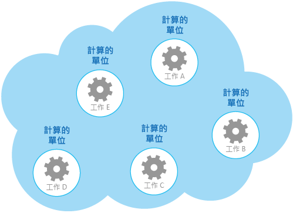
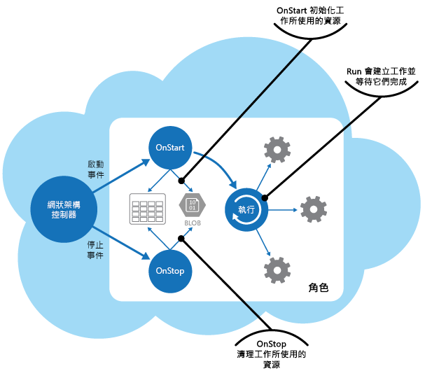

# <a name="compute-resource-consolidation-pattern"></a>計算資源彙總模式

[!INCLUDE [header](../_includes/header.md)]

將多個工作或作業合併為單一計算單位。 這可以提升計算資源使用率，並降低與雲端內主控的應用程式中執行計算處理相關聯的成本和管理額外負荷。

## <a name="context-and-problem"></a>內容和問題

雲端應用程式通常會實作各種作業。 在某些解決方案中，可以合理地在一開始依照重要性區隔的設計原則，將這些作業分割成分別主控和部署的個別計算單位 (例如，作為個別 App Service web 應用程式、個別虛擬機器或個別雲端服務角色)。 不過，雖然這項策略有助於簡化解決方案的邏輯設計，但在相同應用程式中部署大量的計算單位可能會增加執行階段主機成本，並使得系統管理更為複雜。

例如，此圖顯示雲端主控解決方案的簡化結構，是使用一個以上的計算單位進行實作。 每個計算的單位都會在它自己的虛擬環境中執行。 每個函式皆已實作為個別的工作 (標示為工作 A 到工作 E)，在它自己的計算單位中執行。




每個計算單位都會耗用收費的資源，即使在閒置或輕量使用時也一樣。 因此，這不一定是最具成本效益的解決方案。

在 Azure 中，這個考量也適用於雲端服務、應用程式服務和虛擬機器中的角色。 這些項目會在自己的虛擬環境中執行。 執行一系列專為執行一組妥善定義作業所設計的不同角色、網站或虛擬機器，但必須作為單一解決方案進行通訊及共同合作，可以會造成資源的使用效率不佳。

## <a name="solution"></a>解決方法

為協助降低成本、增加使用率、改善通訊速度並減少管理，可以將多個工作或作業合併為單一計算單位。

工作可以根據以環境所提供的功能以及與這些功能相關聯的成本作為基礎的準則進行分組。 常見方法是尋找具有類似關於其延展性、存留期和處理需求的設定檔工作。 將這些群組在一起，可讓它們作為一個單位進行調整。 許多雲端環所提供的彈性，可讓其他計算單位的執行個體根據工作負載啟動及停止。 例如，Azure 會提供自動調整，可讓您套用至雲端服務、應用程式服務和虛擬機器中的角色。 如需詳細資訊，請參閱[自動調整指導方針](https://msdn.microsoft.com/library/dn589774.aspx)。

作為顯示如何使用擴充性來判斷哪些作業不應分組在一起的相反範例，請考慮下列兩項工作：

- 工作 1 輪詢傳送至佇列的不頻繁、時間不緊迫訊息。
- 工作 2 處理大量暴增的網路流量。

第二項工作需要的彈性，可包含啟動和停止大量計算單位的執行個體。 將相同縮放比例套用至第一項工作只會導致更多工作在相同的佇列上接聽不頻繁訊息，並會浪費資源。

在許多雲端環境中，可能會就 CPU 核心數目、記憶體、磁碟空間等方面，指定可用於計算單位的資源。 一般而言，指定越多資源，成本就會越高。 為節省成本，務必將昂貴計算單位執行的工作最大化，並且不讓它長時間處於非作用中狀態。

如果有些工作暴增需要大量的 CPU 電源，請考慮將這些項目合併為單一計算單位，以提供必要的電源。 不過，如果它們過度負荷，請務必平衡這項需求，讓昂貴的資源不停處理可能發生的爭用。 例如，長時間執行、需要大量計算的工作不應該共用相同的計算單位。

## <a name="issues-and-considerations"></a>問題和考量

當您實作此模式時，請考慮下列幾點：

**延展性和彈性**。 許多雲端解決方案會在計算單位層級實作延展性和彈性，方法是啟動和停止單位的執行個體。 避免將相同計算單位中有衝突延展性需求的工作進行群組。

**存留期**。 雲端基礎結構會定期回收主控計算單位的虛擬環境。 當計算單位內有許多長時間執行的工作時，可能必須設定單位以防止它受到回收，直到完成這些工作為止。 或者，使用檢查點方法來設計工作，讓他們能夠完全停止，並且當計算單位重新啟動時，從中斷處繼續進行。

**版本日程**。 如果工作的實作或組態經常變更，可能必須停止主控更新之程式碼的計算單位、重新設定及重新部署單位，並再重新啟動它。 此程序也需要相同計算單位內的所有其他工作停止、重新部署並重新啟動。

**安全性**。 相同計算單位中的工作可能會共用相同的資訊安全內容，且能夠存取相同的資源。 工作之間必須有較高程度的信任，且有信心一個工作不會損毀或對另一個工作造成負面影響。 此外，增加計算單位中執行的工作數目會增加單位的攻擊面。 每項工作的安全程度只會相當於具有最多的工作。

**容錯**。 如果計算單位中有一個工作失敗或行為異常，可能會影響相同單位內執行的其他工作。 例如，如果一項工作無法正確啟動，它會造成計算單位的整個啟動邏輯失敗，並且使相同單位中的其他工作無法執行。

**爭用**。 避免造成工作之間的爭用，競爭相同計算單位中的資源。 在理想情況下，共用相同計算單位的工作應該會表現不同的資源使用率特性。 例如，兩個需要大量計算的工作可能不應該位於相同的單位計算中，且兩個工作都不應該耗用大量的記憶體。 不過，將需要大量計算的工作與需要大量記憶體的工作混用，是可行的組合。

> [!NOTE]
>  請考慮僅將已在生產環境中一段時間之系統的計算資源合併，讓操作員和開發人員可以監視系統，並建立_熱度圖_來識別每項工作如何利用不同的資源。 此圖可用來判斷哪些工作適合用於共用計算資源。

**複雜度**。 將多個工作結合成單一計算單位會使單位中的程式碼複雜度增加，可能會更加難以測試、偵錯及維護。

**穩定邏輯架構**。 在每個工作中設計和實作程式碼，使它不太需要變更，即使是工作在其中執行的環境有所變更也一樣。

**其他策略**。 將計算資源合併只是有助於減少同時執行多個工作相關成本的其中一種方式。 它需要仔細規劃並監視，以確保它仍然是有效的方法。 其他策略可能更合適，視工作的本質和執行這些工作的使用者所在位置而定。 例如，工作負載的功能性分解 (依[計算分割區指引](https://msdn.microsoft.com/library/dn589773.aspx)所述) 可能是更好的選項。

## <a name="when-to-use-this-pattern"></a>使用此模式的時機

如果工作在本身的計算單位中執行卻不符合成本效益，請使用此模式。 如果工作花費太多閒置時間，在專用的單位中執行此工作可能會很昂貴。

此模式可能不適用於執行關鍵容錯作業的工作，或是處理高度敏感或私人資料、且需要使用者本身安全性內容的工作。 這些工作應該在其自己的隔離環境中執行，並使用個別計算單位。

## <a name="example"></a>範例

在 Azure 上建置雲端服務時，可以將多個工作執行的處理合併成單一角色。 一般而言，這是背景工作角色，可執行背景或非同步處理工作。

> 在某些情況下，可能會包含 web 角色中的背景或非同步處理工作。 雖然這項技術可能會影響 web 角色所提供的公眾對應介面之延展性和回應性，但它有助於降低成本並簡化部署。 

角色負責啟動和停止工作。 當 Azure 網狀架構控制器載入角色時，會引發角色的 `Start` 事件。 您可以覆寫 `WebRole` 或 `WorkerRole` 類別的 `OnStart` 方法來處理此事件，或許還可以初始化這個方法中之工作所仰賴的資料和其他資源。

當 `OnStart` 方法完成時，角色就可以開始回應要求。 您可以在[將應用程式移動至雲端](https://msdn.microsoft.com/library/ff728592.aspx)模式和實務指南的[應用程式啟動流程](https://msdn.microsoft.com/library/ff803371.aspx#sec16)一節中，使用角色中的 `OnStart` 和 `Run` 方法，來找到詳細資訊和指引。

> 盡可能以簡明的 `OnStart` 方法來保留程式碼。 Azure 並不限制這個方法完成所花費的時間，但該角色將無法開始回應傳送給它的網路要求，直到這個方法完成為止。

當 `OnStart` 方法完成時，角色會執行 `Run` 方法。 此時，網狀架構控制器就可以開始將要求傳送至角色。

放置以 `Run` 方法實際建立工作的程式碼。 請注意，`Run` 方法會定義角色執行個體的存留期。 這個方法完成時，網狀架構控制器就會排列要關機的角色。

當角色關機或回收時，網狀架構控制器會阻止接收來自負載平衡器的任何其他連入要求，並且會引發 `Stop` 事件。 您可以在角色終止之前覆寫角色的 `OnStop` 方法，並執行任何必要的排列，來擷取這個事件。

> 在 `OnStop` 方法中執行的任何動作，都必須在五分鐘 (或如果您是使用本機電腦上的 Azure 模擬器，就是 30 秒) 內完成。 否則，Azure 網狀架構控制器就會假設角色延滯，並強制它停止。

工作會由 `Run` 方法啟動，等候工作完成。 這些工作會實作雲端服務的商務邏輯，並且可回應透過 Azure 負載平衡器向角色公佈的訊息。 此圖會顯示 Azure 雲端服務的角色中，工作和資源的生命週期。




_ComputeResourceConsolidation.Worker_ 專案中的 _WorkerRole.cs_ 檔案會顯示範例，說明如何在 Azure 雲端服務中實作此模式。

> _ComputeResourceConsolidation.Worker_ 專案屬於 _ComputeResourceConsolidation_ 解決方案，可從 [GitHub](https://github.com/mspnp/cloud-design-patterns/tree/master/compute-resource-consolidation) 下載。

`MyWorkerTask1` 和 `MyWorkerTask2` 方法會說明如何在相同的背景工作角色內執行不同的工作。 下列程式碼會示範 `MyWorkerTask1`。 這是簡單的工作，會進入睡眠狀態 30 秒，然後輸出追蹤訊息。 它會重複此程序，直到這項工作取消為止。 `MyWorkerTask2` 中的程式碼很類似。

```csharp
// A sample worker role task.
private static async Task MyWorkerTask1(CancellationToken ct)
{
  // Fixed interval to wake up and check for work and/or do work.
  var interval = TimeSpan.FromSeconds(30);

  try
  {
    while (!ct.IsCancellationRequested)
    {
      // Wake up and do some background processing if not canceled.
      // TASK PROCESSING CODE HERE
      Trace.TraceInformation("Doing Worker Task 1 Work");

      // Go back to sleep for a period of time unless asked to cancel.
      // Task.Delay will throw an OperationCanceledException when canceled.
      await Task.Delay(interval, ct);
    }
  }
  catch (OperationCanceledException)
  {
    // Expect this exception to be thrown in normal circumstances or check
    // the cancellation token. If the role instances are shutting down, a
    // cancellation request will be signaled.
    Trace.TraceInformation("Stopping service, cancellation requested");

    // Rethrow the exception.
    throw;
  }
}
```

> 範例程式碼會顯示背景程序的一般實作。 在真實世界的應用程式中，您可以遵循這個相同的結構，不同之處在於，您應該將自己的處理邏輯放置在等待取消要求的迴圈之主體中。

在背景工作角色將它所使用的資源初始化之後，`Run` 方法會同時啟動兩個工作，如下所示。

```csharp
/// <summary>
/// The cancellation token source use to cooperatively cancel running tasks
/// </summary>
private readonly CancellationTokenSource cts = new CancellationTokenSource();

/// <summary>
/// List of running tasks on the role instance
/// </summary>
private readonly List<Task> tasks = new List<Task>();

// RoleEntry Run() is called after OnStart().
// Returning from Run() will cause a role instance to recycle.
public override void Run()
{
  // Start worker tasks and add to the task list
  tasks.Add(MyWorkerTask1(cts.Token));
  tasks.Add(MyWorkerTask2(cts.Token));

  foreach (var worker in this.workerTasks)
  {
      this.tasks.Add(worker);
  }

  Trace.TraceInformation("Worker host tasks started");
  // The assumption is that all tasks should remain running and not return,
  // similar to role entry Run() behavior.
  try
  {
    Task.WaitAll(tasks.ToArray());
  }
  catch (AggregateException ex)
  {
    Trace.TraceError(ex.Message);

    // If any of the inner exceptions in the aggregate exception
    // are not cancellation exceptions then re-throw the exception.
    ex.Handle(innerEx => (innerEx is OperationCanceledException));
  }

  // If there wasn't a cancellation request, stop all tasks and return from Run()
  // An alternative to canceling and returning when a task exits would be to
  // restart the task.
  if (!cts.IsCancellationRequested)
  {
    Trace.TraceInformation("Task returned without cancellation request");
    Stop(TimeSpan.FromMinutes(5));
  }
}
...
```

在此範例中，`Run` 方法會等候工作完成。 如果工作已取消，`Run` 方法就會假設角色正在關機，並在完成前等候其餘的工作取消 (在終止前最多會等候五分鐘)。 如果工作因為預期的例外狀況而失敗，`Run` 方法就會取消工作。

> 您可以使用 `Run` 方法來實作更完整的監視和例外狀況處理策略，例如重新啟動已失敗的工作，或包含讓角色停止及啟動個別工作的程式碼。

當網狀架構控制器關閉角色執行個體 (會從 `OnStop` 方法叫用) 時，會呼叫下列程式碼中所示的 `Stop` 方法。 程式碼會取消每項工作，依正常程序加以停止。 如果任何工作花費超過五分鐘才完成，`Stop` 方法中的取消處理就會停止等候，且會終止該角色。

```csharp
// Stop running tasks and wait for tasks to complete before returning
// unless the timeout expires.
private void Stop(TimeSpan timeout)
{
  Trace.TraceInformation("Stop called. Canceling tasks.");
  // Cancel running tasks.
  cts.Cancel();

  Trace.TraceInformation("Waiting for canceled tasks to finish and return");

  // Wait for all the tasks to complete before returning. Note that the
  // emulator currently allows 30 seconds and Azure allows five
  // minutes for processing to complete.
  try
  {
    Task.WaitAll(tasks.ToArray(), timeout);
  }
  catch (AggregateException ex)
  {
    Trace.TraceError(ex.Message);

    // If any of the inner exceptions in the aggregate exception
    // are not cancellation exceptions then rethrow the exception.
    ex.Handle(innerEx => (innerEx is OperationCanceledException));
  }
}
```

## <a name="related-patterns-and-guidance"></a>相關的模式和指導方針

實作此模式時，下列模式和指導方針可能也相關：

- [自動調整指導方針](https://msdn.microsoft.com/library/dn589774.aspx)。 自動調整可用來根據預期的處理需求啟動及停止服務主控計算資源的執行個體。

- [計算分割指導方針](https://msdn.microsoft.com/library/dn589773.aspx)。 說明如何以有助於將執行成本降至最低，同時維持服務延展性、效能、可用性及安全性的方式，從而配置雲端服務中的服務和元件。

- 此模式包含可下載的[範例應用程式](https://github.com/mspnp/cloud-design-patterns/tree/master/compute-resource-consolidation)。
