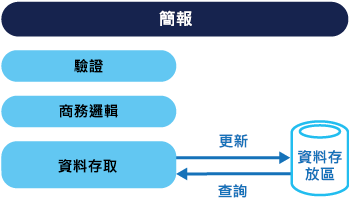

# <a name="command-and-query-responsibility-segregation-cqrs-pattern"></a>命令與查詢責任隔離 (CQRS) 模式

[!INCLUDE [header](../_includes/header.md)]

如果作業讀取的資料來自使用個別介面更新資料的作業，則隔離該作業。 這可以最大化效能、延展性及安全性。 支援系統隨著時間透過更高的彈性而進化，並且防止更新命令造成網域層級的合併衝突。

## <a name="context-and-problem"></a>內容和問題

在傳統資料管理系統中，命令 (資料的更新) 和查詢 (要求資料) 會針對單一資料存放庫中的相同實體集執行。 這些實體可以是關聯式資料庫 (例如 SQL Server) 中一個或多個資料表之資料列的子集。

通常在這些系統中，所有建立、讀取、更新和刪除 (CRUD) 作業會套用至實體的相同表示法。 例如，代表客戶的資料傳輸物件 (DTO) 會由資料存取層 (DAL) 從資料存放區擷取，並且在螢幕上顯示。 使用者更新 DTO 中的某些欄位 (可能是透過資料繫結)，然後 DTO 會由 DAL 儲存回資料存放區。 相同 DTO 用於讀取和寫入作業。 此圖說明傳統 CRUD 架構。



傳統 CRUD 設計只有在將有限的商務邏輯套用至資料作業時運作良好。 開發工具提供的 Scaffold 機制可以非常快速地建立資料存取碼，然後可以視需要自訂。

不過，傳統 CRUD 方法有一些缺點：

- 這通常代表資料的讀取和寫入表示法之間不相符，例如必須正確更新的額外資料行或屬性，即使它們並非作業的必要部分。

- 當記錄鎖定在共同作業網域中的資料存放區時，有資料爭用的風險，在該網域中多個執行者會在相同資料集上以平行方式運作。 或者更新衝突，這是由使用開放式鎖定時的並行更新所造成。 這些風險會隨著系統的複雜度和輸送量增加而提升。 此外，由於資料存放區和資料存取層上的負載，以及擷取資訊所需之查詢的複雜度，傳統方法對於效能會有負面影響。

- 因為每個實體受限於讀取和寫入作業，這些作業可能會在錯誤內容中公開資料，所以讓管理安全性和權限更加複雜。

> 若要更深入了解 CRUD 方法的限制，請參閱 [CRUD，只有當您可以負擔時](https://blogs.msdn.microsoft.com/maarten_mullender/2004/07/23/crud-only-when-you-can-afford-it-revisited/)。

## <a name="solution"></a>解決方法

命令與查詢責任隔離 (CQRS) 是一種模式，它會使用個別介面將讀取資料 (查詢) 的作業與更新資料 (命令) 的作業隔離。 這表示用於查詢和更新的資料模型不相同。 然後模型可以隔離，如下圖所示，雖然這不是絕對需求。


相較於以 CRUD 為基礎的系統中使用之單一資料模型，針對以 CQRS 為基礎的系統中之資料使用個別查詢和更新模型，可以簡化設計和實作。 不過，其中一個缺點是不同於 CRUD 設計，無法使用 Scaffold 機制自動產生 CQRS 程式碼。

讀取資料的查詢模型和寫入資料的更新模型可以存取相同實體存放區，可能是透過使用 SQL 檢視或是立即產生投影。 不過，將資料分隔成不同實體存放區以最大化效能、延展性及安全性很常見，如下一張圖中所示。


讀取存放區可以是寫入存放區的唯讀複本，或者讀取和寫入存放區可以有完全不同的結構。 使用讀取存放區的多個唯讀複本會大幅增加查詢效能和應用程式 UI 回應性，特別是在唯讀複本接近應用程式執行個體的分散式案例中。 某些資料庫系統 (SQL Server) 提供額外的功能，例如容錯移轉複本，以最大化可用性。

分隔讀取和寫入存放區也可以讓每個存放區適當地調整以符合負載。 例如，讀取存放區通常會遇到比寫入存放區更高的負載。

當查詢/讀取模型包含反正規化資料 (請參閱[具體化檢視模式](materialized-view.md))，當讀取應用程式中每個檢視的資料時，或查詢系統中的資料時，效能會最大化。

## <a name="issues-and-considerations"></a>問題和考量

當您決定如何實作此模式時，請考慮下列幾點：

- 將資料存放區分割成適用於讀取和寫入作業的個別實體存放區，可以增加系統的效能和安全性，但是也會增加復原和最終一致性方面的複雜度。 讀取模型存放區必須更新以反映對寫入模型存放區的變更，而且當使用者根據過時讀取資料發出要求時難以偵測，這表示無法完成作業。

    > 如需最終一致性的說明，請參閱[資料一致性入門](https://msdn.microsoft.com/library/dn589800.aspx)。

- 請考慮將 CQRS 套用至它在其中最有價值的系統有限區段。

- 部署最終一致性的典型方法是使用事件來源搭配 CQRS，讓寫入事件成為由執行命令所驅動的僅附加串流。 這些事件是用來更新作為讀取模型的具體化檢視。 如需詳細資訊，請參閱[事件來源和 CQRS](/azure/architecture/patterns/cqrs#event-sourcing-and-cqrs)。

## <a name="when-to-use-this-pattern"></a>使用此模式的時機

在下列情況下使用此模式：

- 共同作業網域，其中多個作業在相同資料上以平行方式執行。 CQRS 可讓您以足夠的細微性定義命令，以最小化網域層級的合併衝突 (發生的任何衝突可以由命令合併)，即使是在更新看似相同類型的資料時。

- 以工作為基礎的使用者介面，使用者會在其中透過一系列步驟或複雜網域模型引導完成複雜程序。 另外，對於已熟悉網域驅動設計 (DDD) 技術的小組也很有用。 寫入模型有完整命令處理堆疊，它具有商務邏輯、輸入驗證與商務驗證，以確保在寫入模型中每個彙總的所有項目永遠一致 (相關聯物件的每個叢集視為資料變更的單位)。 讀取模型沒有商務邏輯或驗證堆疊，只會傳回 DTO 以在檢視模型中使用。 讀取模型最終與寫入模型一致。

- 資料讀取效能必須有別於資料寫入效能單獨微調的案例，特別是當讀取/寫入比率非常高，以及需要水平延展時。 例如，許多系統中讀取作業數目比寫入作業數目大上數倍。 若要容納，請考慮向外延展讀取模型，但是只在一個或少數執行個體上執行寫入模型。 少量的寫入模型執行個體也有助於降低合併衝突的發生。

- 開發人員的其中一個小組可以專注於複雜網域模型 (屬於寫入模式)，而另一個小組可以專注於讀取模型和使用者介面的案例。

- 系統預期隨著時間進化，可能包含模型的多個版本，或商務規則會定期變更的案例。

- 與其他系統整合，特別是與事件來源結合，其中一個子系統的時態性失敗不應該影響其他子系統的可用性。

不建議在下列情況下使用此模式：

- 網域或商務規則都很簡單。

- 簡單 CRUD 樣式使用者介面及相關資料存取作業已足夠。

- 對於在整個系統實作。 在 CQRS 很有用的整體資料管理案例中有特定元件，但是它會在不需要時增加相當大而且不必要的複雜性。

## <a name="event-sourcing-and-cqrs"></a>事件來源和 CQRS

CQRS 模式通常與事件來源模式搭配使用。 以 CQRS 為基礎的系統會使用個別讀取和寫入資料模型，每個模型都針對相關工作量身打造，實體上通常位於不同存放區中。 當搭配[事件來源](event-sourcing.md)模式使用時，事件的存放區是寫入模型，而且是資訊的官方來源。 以 CQRS 為基礎的系統之讀取模型提供資料的具體化檢視，通常是高度反正規化檢視。 這些檢視針對應用程式的介面和顯示需求而量身打造，可協助最大化顯示和查詢效能。

使用事件的串流作為寫入存放區，而不是時間點上的實際資料，避免單一彙總上的更新衝突，以及最大化效能和延展性。 事件可用來以非同步方式產生資料的具體化檢視，該檢視是用來填入讀取存放區。

因為事件存放區是資訊的官方來源，所以可以刪除具體化檢視並重新執行所有過去的事件，以在系統進化或讀取模型必須變更時，建立目前狀態的新表示法。 具體化檢視在資料的耐久唯讀快取期間都有效。

搭配事件來源模式使用 CQRS 時，請考慮下列各項：

- 如同其寫入和讀取存放區是獨立的任何系統，以此模式為基礎的系統最終只會一致。 產生之事件和更新之資料存放區之間會有一些延遲。

- 模式會增加複雜性，因為必須建立程式碼才能起始和處理事件，並且組合或更新查詢或讀取模型所需的適當檢視或物件。 與事件來源模式搭配使用時的 CQRS 模式複雜性，會讓實作成功更加困難，並且需要不同的方法來設計系統。 不過，事件來源可以讓建立網域的模型更加容易，重建檢視或建立新的檢視也更加容易，因為會保留資料變更的意圖。

- 藉由重新執行及處理特定實體或實體集合的事件，產生具體化檢視以在資料的讀取模型或投影中使用，需要大量處理時間和資源使用量。 如果需要長時間的值總和或分析更是如此，因為可能需要檢查所有相關聯的事件。 藉由在排程間隔實作資料的快照集來解決這個情形，例如已發生之特定動作的總數，或實體的目前狀態。

## <a name="example"></a>範例

下列程式碼顯示 CQRS 實作範例的一些擷取，該實作針對讀取和寫入模型使用不同的定義。 模型介面不會聽寫基礎資料存放區中的任何功能，而且因為這些介面是分隔的，所以它們可以個別進化及微調。

下列程式碼顯示讀取模型定義。

```csharp
// Query interface
namespace ReadModel
{
  public interface ProductsDao
  {
    ProductDisplay FindById(int productId);
    ICollection<ProductDisplay> FindByName(string name);
    ICollection<ProductInventory> FindOutOfStockProducts();
    ICollection<ProductDisplay> FindRelatedProducts(int productId);
  }

  public class ProductDisplay
  {
    public int Id { get; set; }
    public string Name { get; set; }
    public string Description { get; set; }
    public decimal UnitPrice { get; set; }
    public bool IsOutOfStock { get; set; }
    public double UserRating { get; set; }
  }

  public class ProductInventory
  {
    public int Id { get; set; }
    public string Name { get; set; }
    public int CurrentStock { get; set; }
  }
}
```

系統允許使用者為產品評分。 應用程式程式碼使用在下列程式碼中顯示的 `RateProduct` 命令來完成這項操作。

```csharp
public interface ICommand
{
  Guid Id { get; }
}

public class RateProduct : ICommand
{
  public RateProduct()
  {
    this.Id = Guid.NewGuid();
  }
  public Guid Id { get; set; }
  public int ProductId { get; set; }
  public int Rating { get; set; }
  public int UserId {get; set; }
}
```

系統會使用 `ProductsCommandHandler` 類別來處理應用程式所傳送的命令。 用戶端通常會透過傳訊系統 (例如佇列) 將命令傳送至網域。 命令處理常式會接受這些命令，並且叫用網域介面的方法。 每個命令之細微性的設計目的是減少要求衝突的機會。 下列程式碼示範 `ProductsCommandHandler` 類別的大綱。

```csharp
public class ProductsCommandHandler :
    ICommandHandler<AddNewProduct>,
    ICommandHandler<RateProduct>,
    ICommandHandler<AddToInventory>,
    ICommandHandler<ConfirmItemShipped>,
    ICommandHandler<UpdateStockFromInventoryRecount>
{
  private readonly IRepository<Product> repository;

  public ProductsCommandHandler (IRepository<Product> repository)
  {
    this.repository = repository;
  }

  void Handle (AddNewProduct command)
  {
    ...
  }

  void Handle (RateProduct command)
  {
    var product = repository.Find(command.ProductId);
    if (product != null)
    {
      product.RateProduct(command.UserId, command.Rating);
      repository.Save(product);
    }
  }

  void Handle (AddToInventory command)
  {
    ...
  }

  void Handle (ConfirmItemsShipped command)
  {
    ...
  }

  void Handle (UpdateStockFromInventoryRecount command)
  {
    ...
  }
}
```

下列程式碼示範寫入模型的 `IProductsDomain` 介面。

```csharp
public interface IProductsDomain
{
  void AddNewProduct(int id, string name, string description, decimal price);
  void RateProduct(int userId, int rating);
  void AddToInventory(int productId, int quantity);
  void ConfirmItemsShipped(int productId, int quantity);
  void UpdateStockFromInventoryRecount(int productId, int updatedQuantity);
}
```

同時也請注意 `IProductsDomain` 介面如何包含在網域中具有意義的方法。 通常，在 CRUD 環境中這些方法會具有泛型名稱，例如 `Save` 或 `Update`，而且有 DTO 作為唯一的引數。 CQRS 方法可以設計為符合此組織商務和庫存管理系統的需求。

## <a name="related-patterns-and-guidance"></a>相關的模式和指導方針

下列模式和指導方針在實作此模式時很有用：

- 如需 CQRS 與其他架構樣式的比較，請參閱[架構樣式](/azure/architecture/guide/architecture-styles/)和 [CQRS 架構樣式](/azure/architecture/guide/architecture-styles/cqrs)。

- [資料一致性入門](https://msdn.microsoft.com/library/dn589800.aspx)。 說明在使用 CQRS 模式時，由於讀取和寫入資料存放區之間的最終一致性，通常會遇到的問題，以及如何解決這些問題。

- [資料分割指引](https://msdn.microsoft.com/library/dn589795.aspx)。 描述 CQRS 模式中使用的讀取和寫入資料存放區如何分割成資料分割，以便個別管理及存取，來改善延展性、減少爭用以及最佳化效能。

- [事件來源模式](event-sourcing.md)。 更詳細地描述事件來源如何與 CQRS 模式搭配使用，在改善效能、延展性及回應能力的同時，簡化複雜網域中的工作。 以及如何在維護完整稽核記錄和歷程記錄 (可以啟用補償動作) 的同時，提供交易資料的一致性。

- [具體化檢視模式](materialized-view.md)。 CQRS 實作的讀取模型可以包含寫入模型資料的具體化檢視，或者讀取模型可以用來產生具體化檢視。

- 模式與做法指南 [CQRS 旅程](http://aka.ms/cqrs)。 其中，[簡介命令查詢責任隔離模式](https://msdn.microsoft.com/library/jj591573.aspx)會探索模式及其適用時機，而[結語：學到的課程](https://msdn.microsoft.com/library/jj591568.aspx)可協助您了解使用此模式時出現的一些問題。

- 文章 [CQRS by Martin Fowler](http://martinfowler.com/bliki/CQRS.html)，其中說明模式的基本概念以及其他有用資源的連結。

- [Greg Young 的文章](http://codebetter.com/gregyoung/)，其中探索 CQRS 模式的許多層面。
