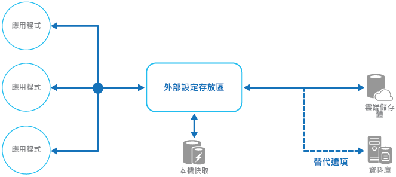

# <a name="external-configuration-store-pattern"></a><span data-ttu-id="3ab07-104">外部設定存放區模式</span><span class="sxs-lookup"><span data-stu-id="3ab07-104">External Configuration Store pattern</span></span>

[!INCLUDE [header](../_includes/header.md)]

<span data-ttu-id="3ab07-105">將設定資訊從應用程式部署套件移至集中位置。</span><span class="sxs-lookup"><span data-stu-id="3ab07-105">Move configuration information out of the application deployment package to a centralized location.</span></span> <span data-ttu-id="3ab07-106">如此會使得設定資料更易於管理和控制，並能跨應用程式和應用程式執行個體來共用設定資料。</span><span class="sxs-lookup"><span data-stu-id="3ab07-106">This can provide opportunities for easier management and control of configuration data, and for sharing configuration data across applications and application instances.</span></span>

## <a name="context-and-problem"></a><span data-ttu-id="3ab07-107">內容和問題</span><span class="sxs-lookup"><span data-stu-id="3ab07-107">Context and problem</span></span>

<span data-ttu-id="3ab07-108">大部分的應用程式執行階段環境都含有設定資訊，其保存在隨應用程式部署的檔案中。</span><span class="sxs-lookup"><span data-stu-id="3ab07-108">The majority of application runtime environments include configuration information that's held in files deployed with the application.</span></span> <span data-ttu-id="3ab07-109">在某些情況下，可以編輯這些檔案以變更部署後的應用程式行為。</span><span class="sxs-lookup"><span data-stu-id="3ab07-109">In some cases, it's possible to edit these files to change the application behavior after it's been deployed.</span></span> <span data-ttu-id="3ab07-110">不過，變更設定後需要重新部署應用程式，而且通常會導致無法接受的停機時間及其他系統管理額外負荷。</span><span class="sxs-lookup"><span data-stu-id="3ab07-110">However, changes to the configuration require the application be redeployed, often resulting in unacceptable downtime and other administrative overhead.</span></span>

<span data-ttu-id="3ab07-111">本機設定檔也會將設定限制在單一應用程式，但有時候跨多個應用程式共用設定是很有用的。</span><span class="sxs-lookup"><span data-stu-id="3ab07-111">Local configuration files also limit the configuration to a single application, but sometimes it would be useful to share configuration settings across multiple applications.</span></span> <span data-ttu-id="3ab07-112">範例包括資料庫連接字串、UI 佈景主題資訊，或一組相關應用程式所使用的佇列與儲存體 URL。</span><span class="sxs-lookup"><span data-stu-id="3ab07-112">Examples include database connection strings, UI theme information, or the URLs of queues and storage used by a related set of applications.</span></span>

<span data-ttu-id="3ab07-113">跨多個執行中的應用程式執行個體來管理本機設定變更是極具挑戰的，特別是雲端主控的案例。</span><span class="sxs-lookup"><span data-stu-id="3ab07-113">It's challenging to manage changes to local configurations across multiple running instances of the application, especially in a cloud-hosted scenario.</span></span> <span data-ttu-id="3ab07-114">它可能會導致在部署更新之際，執行個體會使用不同的組態設定。</span><span class="sxs-lookup"><span data-stu-id="3ab07-114">It can result in instances using different configuration settings while the update is being deployed.</span></span>

<span data-ttu-id="3ab07-115">此外，應用程式和元件的更新可能需要變更設定結構描述。</span><span class="sxs-lookup"><span data-stu-id="3ab07-115">In addition, updates to applications and components might require changes to configuration schemas.</span></span> <span data-ttu-id="3ab07-116">許多設定系統不支援不同版本的設定資訊。</span><span class="sxs-lookup"><span data-stu-id="3ab07-116">Many configuration systems don't support different versions of configuration information.</span></span>

## <a name="solution"></a><span data-ttu-id="3ab07-117">解決方法</span><span class="sxs-lookup"><span data-stu-id="3ab07-117">Solution</span></span>

<span data-ttu-id="3ab07-118">將設定資訊儲存在外部儲存體，並提供可迅速、有效地讀取和更新組態設定的介面。</span><span class="sxs-lookup"><span data-stu-id="3ab07-118">Store the configuration information in external storage, and provide an interface that can be used to quickly and efficiently read and update configuration settings.</span></span> <span data-ttu-id="3ab07-119">外部存放區的類型取決於應用程式的裝載和執行階段環境。</span><span class="sxs-lookup"><span data-stu-id="3ab07-119">The type of external store depends on the hosting and runtime environment of the application.</span></span> <span data-ttu-id="3ab07-120">在雲端主控的案例中，它通常是以雲端為基礎的儲存體服務，但也可能是主控資料庫或其他系統。</span><span class="sxs-lookup"><span data-stu-id="3ab07-120">In a cloud-hosted scenario it's typically a cloud-based storage service, but could be a hosted database or other system.</span></span>

<span data-ttu-id="3ab07-121">您為設定資訊選擇的備份存放區，應具有存取方式一致且易於使用的介面。</span><span class="sxs-lookup"><span data-stu-id="3ab07-121">The backing store you choose for configuration information should have an interface that provides consistent and easy-to-use access.</span></span> <span data-ttu-id="3ab07-122">它應該以正確型別和結構化的格式來公開資訊。</span><span class="sxs-lookup"><span data-stu-id="3ab07-122">It should expose the information in a correctly typed and structured format.</span></span> <span data-ttu-id="3ab07-123">實作可能也需要授權使用者的存取權以保護設定資料，並具備足夠的彈性以允許儲存多個版本的設定 (例如開發、預備或生產，包括其中每一種的多個發行版本)。</span><span class="sxs-lookup"><span data-stu-id="3ab07-123">The implementation might also need to authorize users’ access in order to protect configuration data, and be flexible enough to allow storage of multiple versions of the configuration (such as development, staging, or production, including multiple release versions of each one).</span></span>

> <span data-ttu-id="3ab07-124">許多內建設定系統會在應用程式啟動時讀取資料，並將資料快取於記憶體中，以提供快速存取並將對應用程式效能的影響降到最低。</span><span class="sxs-lookup"><span data-stu-id="3ab07-124">Many built-in configuration systems read the data when the application starts up, and cache the data in memory to provide fast access and minimize the impact on application performance.</span></span> <span data-ttu-id="3ab07-125">根據使用的備份存放區類型和此存放區的延遲而定，在外部設定存放區中實作快取機制可能會有幫助。</span><span class="sxs-lookup"><span data-stu-id="3ab07-125">Depending on the type of backing store used, and the latency of this store, it might be helpful to implement a caching mechanism within the external configuration store.</span></span> <span data-ttu-id="3ab07-126">如需詳細資訊，請參閱「 [快取指引](https://msdn.microsoft.com/library/dn589802.aspx)」。</span><span class="sxs-lookup"><span data-stu-id="3ab07-126">For more information, see the [Caching Guidance](https://msdn.microsoft.com/library/dn589802.aspx).</span></span> <span data-ttu-id="3ab07-127">此圖概要說明具有選擇性本機快取的外部設定存放區模式。</span><span class="sxs-lookup"><span data-stu-id="3ab07-127">The figure illustrates an overview of the External Configuration Store pattern with optional local cache.</span></span>



## <a name="issues-and-considerations"></a><span data-ttu-id="3ab07-129">問題和考量</span><span class="sxs-lookup"><span data-stu-id="3ab07-129">Issues and considerations</span></span>

<span data-ttu-id="3ab07-130">當您決定如何實作此模式時，請考慮下列幾點：</span><span class="sxs-lookup"><span data-stu-id="3ab07-130">Consider the following points when deciding how to implement this pattern:</span></span>

<span data-ttu-id="3ab07-131">選擇的備份存放區應提供可接受的效能、高可用性及穩定性，而且可在應用程式維護和管理程序中進行備份。</span><span class="sxs-lookup"><span data-stu-id="3ab07-131">Choose a backing store that offers acceptable performance, high availability, robustness, and can be backed up as part of the application maintenance and administration process.</span></span> <span data-ttu-id="3ab07-132">在雲端主控的應用程式中，使用雲端儲存體機制通常是符合這些需求的不錯選擇。</span><span class="sxs-lookup"><span data-stu-id="3ab07-132">In a cloud-hosted application, using a cloud storage mechanism is usually a good choice to meet these requirements.</span></span>

<span data-ttu-id="3ab07-133">備份存放區結構描述的設計，應使可保存的資訊類型具有彈性。</span><span class="sxs-lookup"><span data-stu-id="3ab07-133">Design the schema of the backing store to allow flexibility in the types of information it can hold.</span></span> <span data-ttu-id="3ab07-134">請確定它可滿足所有設定需求，例如具有型別的資料、設定的集合、設定的多個版本，以及使用它的應用程式所需的其他任何功能。</span><span class="sxs-lookup"><span data-stu-id="3ab07-134">Ensure that it provides for all configuration requirements such as typed data, collections of settings, multiple versions of settings, and any other features that the applications using it require.</span></span> <span data-ttu-id="3ab07-135">結構描述應可隨需求變更輕鬆擴充，以支援額外的設定。</span><span class="sxs-lookup"><span data-stu-id="3ab07-135">The schema should be easy to extend to support additional settings as requirements change.</span></span>

<span data-ttu-id="3ab07-136">請考慮備份存放區的實體功能、與設定資訊儲存方式的關聯，以及對效能的影響。</span><span class="sxs-lookup"><span data-stu-id="3ab07-136">Consider the physical capabilities of the backing store, how it relates to the way configuration information is stored, and the effects on performance.</span></span> <span data-ttu-id="3ab07-137">例如，儲存包含設定資訊的 XML 文件，將需要設定介面或應用程式來剖析文件，以讀取個別設定。</span><span class="sxs-lookup"><span data-stu-id="3ab07-137">For example, storing an XML document containing configuration information will require either the configuration interface or the application to parse the document in order to read individual settings.</span></span> <span data-ttu-id="3ab07-138">雖然快取設定有助於抵銷變慢的讀取效能，但會使更新設定更為複雜。</span><span class="sxs-lookup"><span data-stu-id="3ab07-138">It'll make updating a setting more complicated, though caching the settings can help to offset slower read performance.</span></span>

<span data-ttu-id="3ab07-139">請考慮設定介面如何允許控制組態設定的範圍與繼承。</span><span class="sxs-lookup"><span data-stu-id="3ab07-139">Consider how the configuration interface will permit control of the scope and inheritance of configuration settings.</span></span> <span data-ttu-id="3ab07-140">比方說，組態設定的範圍可能需分為組織、應用程式及電腦層級。</span><span class="sxs-lookup"><span data-stu-id="3ab07-140">For example, it might be a requirement to scope configuration settings at the organization, application, and the machine level.</span></span> <span data-ttu-id="3ab07-141">它可能需要支援不同範圍的存取權控制委派，或是拒絕或允許個別應用程式覆寫設定。</span><span class="sxs-lookup"><span data-stu-id="3ab07-141">It might need to support delegation of control over access to different scopes, and to prevent or allow individual applications to override settings.</span></span>

<span data-ttu-id="3ab07-142">請確定設定介面能夠以必要的格式 (例如具有型別的值、集合、索引鍵/值組或屬性包) 來公開設定資料。</span><span class="sxs-lookup"><span data-stu-id="3ab07-142">Ensure that the configuration interface can expose the configuration data in the required formats such as typed values, collections, key/value pairs, or property bags.</span></span>

<span data-ttu-id="3ab07-143">請考慮當設定包含錯誤或不存在於備份存放區中時，設定存放區介面將如何作用。</span><span class="sxs-lookup"><span data-stu-id="3ab07-143">Consider how the configuration store interface will behave when settings contain errors, or don't exist in the backing store.</span></span> <span data-ttu-id="3ab07-144">傳回預設設定並記錄錯誤可能是合適的作法。</span><span class="sxs-lookup"><span data-stu-id="3ab07-144">It might be appropriate to return default settings and log errors.</span></span> <span data-ttu-id="3ab07-145">也請考慮以下層面：例如組態設定索引鍵或名稱的大小寫之別、二進位資料的儲存和處理，以及 Null 或空值的處理方式。</span><span class="sxs-lookup"><span data-stu-id="3ab07-145">Also consider aspects such as the case sensitivity of configuration setting keys or names, the storage and handling of binary data, and the ways that null or empty values are handled.</span></span>

<span data-ttu-id="3ab07-146">請考慮如何保護設定資料，以便只允許適當的使用者和應用程式來存取。</span><span class="sxs-lookup"><span data-stu-id="3ab07-146">Consider how to protect the configuration data to allow access to only the appropriate users and applications.</span></span> <span data-ttu-id="3ab07-147">這可能是設定存放區介面中的一項功能，但也需確保若無適當權限，則無法直接存取備份存放區中的資料。</span><span class="sxs-lookup"><span data-stu-id="3ab07-147">This is likely a feature of the configuration store interface, but it's also necessary to ensure that the data in the backing store can't be accessed directly without the appropriate permission.</span></span> <span data-ttu-id="3ab07-148">請嚴格區分讀取和寫入設定資料所需的權限。</span><span class="sxs-lookup"><span data-stu-id="3ab07-148">Ensure strict separation between the permissions required to read and to write configuration data.</span></span> <span data-ttu-id="3ab07-149">也請考慮您需要加密部分或所有的組態設定，以及要如何實作於設定存放區介面中。</span><span class="sxs-lookup"><span data-stu-id="3ab07-149">Also consider whether you need to encrypt some or all of the configuration settings, and how this'll be implemented in the configuration store interface.</span></span>

<span data-ttu-id="3ab07-150">在執行階段變更應用程式行為的集中儲存設定極為重要，應使用和部署應用程式程式碼相同的機制來部署、更新和管理。</span><span class="sxs-lookup"><span data-stu-id="3ab07-150">Centrally stored configurations, which change application behavior during runtime, are critically important and should be deployed, updated, and managed using the same mechanisms as deploying application code.</span></span> <span data-ttu-id="3ab07-151">例如，可能會影響多個應用程式的變更必須使用完整的測試和分段部署方法來實行，以確定變更適用於使用此設定的所有應用程式。</span><span class="sxs-lookup"><span data-stu-id="3ab07-151">For example, changes that can affect more than one application must be carried out using a full test and staged deployment approach to ensure that the change is appropriate for all applications that use this configuration.</span></span> <span data-ttu-id="3ab07-152">如果系統管理員編輯了一項更新某個應用程式的設定，它可能會對使用相同設定的其他應用程式造成不良影響。</span><span class="sxs-lookup"><span data-stu-id="3ab07-152">If an administrator edits a setting to update one application, it could adversely impact other applications that use the same setting.</span></span>

<span data-ttu-id="3ab07-153">如果應用程式會快取設定資訊，則必須在設定變更時向應用程式發出警示。</span><span class="sxs-lookup"><span data-stu-id="3ab07-153">If an application caches configuration information, the application needs to be alerted if the configuration changes.</span></span> <span data-ttu-id="3ab07-154">在快取的設定資料上實作到期原則是可行的方法，如此一來，這項資訊就會自動定期重新整理，並會接收任何變更 (和採取行動)。</span><span class="sxs-lookup"><span data-stu-id="3ab07-154">It might be possible to implement an expiration policy over cached configuration data so that this information is automatically refreshed periodically and any changes picked up (and acted on).</span></span>

## <a name="when-to-use-this-pattern"></a><span data-ttu-id="3ab07-155">使用此模式的時機</span><span class="sxs-lookup"><span data-stu-id="3ab07-155">When to use this pattern</span></span>

<span data-ttu-id="3ab07-156">這種模式在下列情況中非常有用：</span><span class="sxs-lookup"><span data-stu-id="3ab07-156">This pattern is useful for:</span></span>

- <span data-ttu-id="3ab07-157">由多個應用程式和應用程式執行個體所共用的組態設定，或必須跨多個應用程式和應用程式執行個體來強制執行標準設定的狀況。</span><span class="sxs-lookup"><span data-stu-id="3ab07-157">Configuration settings that are shared between multiple applications and application instances, or where a standard configuration must be enforced across multiple applications and application instances.</span></span>

- <span data-ttu-id="3ab07-158">不支援所有必要組態設定的標準設定系統，像是儲存影像或複雜的資料類型。</span><span class="sxs-lookup"><span data-stu-id="3ab07-158">A standard configuration system that doesn't support all of the required configuration settings, such as storing images or complex data types.</span></span>

- <span data-ttu-id="3ab07-159">作為應用程式部分設定的互補存放區，可能允許應用程式覆寫部分或全部的集中儲存設定。</span><span class="sxs-lookup"><span data-stu-id="3ab07-159">As a complementary store for some of the settings for applications, perhaps allowing applications to override some or all of the centrally-stored settings.</span></span>

- <span data-ttu-id="3ab07-160">作為簡化管理多個應用程式的方式，以及透過記錄部分或所有類型的設定存放區存取，以監視組態設定的使用。</span><span class="sxs-lookup"><span data-stu-id="3ab07-160">As a way to simplify administration of multiple applications, and optionally for monitoring use of configuration settings by logging some or all types of access to the configuration store.</span></span>

## <a name="example"></a><span data-ttu-id="3ab07-161">範例</span><span class="sxs-lookup"><span data-stu-id="3ab07-161">Example</span></span>

<span data-ttu-id="3ab07-162">在 Microsoft Azure 主控的應用程式中，若要在外部儲存設定資訊，通常的選擇就是使用 Azure 儲存體。</span><span class="sxs-lookup"><span data-stu-id="3ab07-162">In a Microsoft Azure hosted application, a typical choice for storing configuration information externally is to use Azure Storage.</span></span> <span data-ttu-id="3ab07-163">這具有復原功能、提供高效能，而且會以自動容錯移轉複寫三次，以提供高可用性。</span><span class="sxs-lookup"><span data-stu-id="3ab07-163">This is resilient, offers high performance, and is replicated three times with automatic failover to offer high availability.</span></span> <span data-ttu-id="3ab07-164">Azure 資料表儲存體提供索引鍵/值存放區，具有針對值使用彈性結構描述的能力。</span><span class="sxs-lookup"><span data-stu-id="3ab07-164">Azure Table storage provides a key/value store with the ability to use a flexible schema for the values.</span></span> <span data-ttu-id="3ab07-165">Azure Blob 儲存體提供階層式的容器型存放區，可以在個別命名的 Blob 中保存任何資料類型。</span><span class="sxs-lookup"><span data-stu-id="3ab07-165">Azure Blob storage provides a hierarchical, container-based store that can hold any type of data in individually named blobs.</span></span>

<span data-ttu-id="3ab07-166">下列範例示範如何透過 Blob 儲存體實作設定存放區，以儲存和公開設定資訊。</span><span class="sxs-lookup"><span data-stu-id="3ab07-166">The following example shows how a configuration store can be implemented over Blob storage to store and expose configuration information.</span></span> <span data-ttu-id="3ab07-167">`BlobSettingsStore` 類別會將 Blob 儲存體抽象化以用於保存設定資訊，並會實作下列程式碼中顯示的 `ISettingsStore` 介面。</span><span class="sxs-lookup"><span data-stu-id="3ab07-167">The `BlobSettingsStore` class abstracts Blob storage for holding configuration information, and implements the `ISettingsStore` interface shown in the following code.</span></span>

> <span data-ttu-id="3ab07-168">此程式碼來自 [GitHub](https://github.com/mspnp/cloud-design-patterns/tree/master/external-configuration-store) \(英文\) 中 _ExternalConfigurationStore_ 解決方案的 _ExternalConfigurationStore.Cloud_ 專案。</span><span class="sxs-lookup"><span data-stu-id="3ab07-168">This code is provided in the _ExternalConfigurationStore.Cloud_ project in the _ExternalConfigurationStore_ solution, available from [GitHub](https://github.com/mspnp/cloud-design-patterns/tree/master/external-configuration-store).</span></span>

```csharp
public interface ISettingsStore
{
    Task<string> GetVersionAsync();

    Task<Dictionary<string, string>> FindAllAsync();
}
```

<span data-ttu-id="3ab07-169">這個介面會定義用來擷取和更新設定存放區中所保存組態設定的方法，並且包含一個版本號碼，可用來偵測最近是否修改過任何組態設定。</span><span class="sxs-lookup"><span data-stu-id="3ab07-169">This interface defines methods for retrieving and updating configuration settings held in the configuration store, and includes a version number that can be used to detect whether any configuration settings have been modified recently.</span></span> <span data-ttu-id="3ab07-170">`BlobSettingsStore` 類別使用 Blob 的 `ETag` 屬性來實作版本設定。</span><span class="sxs-lookup"><span data-stu-id="3ab07-170">The `BlobSettingsStore` class uses the `ETag` property of the blob to implement versioning.</span></span> <span data-ttu-id="3ab07-171">每次寫入 Blob 時，就會自動更新 `ETag` 屬性。</span><span class="sxs-lookup"><span data-stu-id="3ab07-171">The `ETag` property is updated automatically each time the blob is written.</span></span>

> <span data-ttu-id="3ab07-172">根據設計，這個簡單的解決方案會將所有組態設定公開為字串值，而非具有型別的值。</span><span class="sxs-lookup"><span data-stu-id="3ab07-172">By design, this simple solution exposes all configuration settings as string values rather than typed values.</span></span>

<span data-ttu-id="3ab07-173">`ExternalConfigurationManager` 類別提供 `BlobSettingsStore` 物件的包裝函式。</span><span class="sxs-lookup"><span data-stu-id="3ab07-173">The `ExternalConfigurationManager` class provides a wrapper around a `BlobSettingsStore` object.</span></span> <span data-ttu-id="3ab07-174">應用程式可以使用這個類別來儲存和擷取設定資訊。</span><span class="sxs-lookup"><span data-stu-id="3ab07-174">An application can use this class to store and retrieve configuration information.</span></span> <span data-ttu-id="3ab07-175">這個類別會使用 Microsoft [Reactive Extensions](https://msdn.microsoft.com/library/hh242985.aspx) 程式庫來公開透過實作 `IObservable` 介面對設定所做的任何變更。</span><span class="sxs-lookup"><span data-stu-id="3ab07-175">This class uses the Microsoft [Reactive Extensions](https://msdn.microsoft.com/library/hh242985.aspx) library to expose any changes made to the configuration through an implementation of the `IObservable` interface.</span></span> <span data-ttu-id="3ab07-176">如果設定是透過呼叫 `SetAppSetting` 方法來修改，就會引發 `Changed` 事件，而且將通知此事件的所有訂閱者。</span><span class="sxs-lookup"><span data-stu-id="3ab07-176">If a setting is modified by calling the `SetAppSetting` method, the `Changed` event is raised and all subscribers to this event will be notified.</span></span>

<span data-ttu-id="3ab07-177">請注意，所有設定也會快取到 `ExternalConfigurationManager` 類別內的 `Dictionary` 物件，以提供快速存取。</span><span class="sxs-lookup"><span data-stu-id="3ab07-177">Note that all settings are also cached in a `Dictionary` object inside the `ExternalConfigurationManager` class for fast access.</span></span> <span data-ttu-id="3ab07-178">用來擷取組態設定的 `GetSetting` 方法會從快取讀取資料。</span><span class="sxs-lookup"><span data-stu-id="3ab07-178">The `GetSetting` method used to retrieve a configuration setting reads the data from the cache.</span></span> <span data-ttu-id="3ab07-179">如果在快取中找不到設定，它會改從 `BlobSettingsStore` 物件中擷取。</span><span class="sxs-lookup"><span data-stu-id="3ab07-179">If the setting isn't found in the cache, it's retrieved from the `BlobSettingsStore` object instead.</span></span>

<span data-ttu-id="3ab07-180">`GetSettings` 方法會叫用 `CheckForConfigurationChanges` 方法來偵測 Blob 儲存體中的設定資訊是否已變更。</span><span class="sxs-lookup"><span data-stu-id="3ab07-180">The `GetSettings` method invokes the `CheckForConfigurationChanges` method to detect whether the configuration information in blob storage has changed.</span></span> <span data-ttu-id="3ab07-181">它的作法是檢查版本號碼，並將它與 `ExternalConfigurationManager` 物件所持有的目前版本號碼進行比較。</span><span class="sxs-lookup"><span data-stu-id="3ab07-181">It does this by examining the version number and comparing it with the current version number held by the `ExternalConfigurationManager` object.</span></span> <span data-ttu-id="3ab07-182">如果發生一或多個變更，就會引發 `Changed` 事件，並重新整理快取到 `Dictionary` 物件的組態設定。</span><span class="sxs-lookup"><span data-stu-id="3ab07-182">If one or more changes have occurred, the `Changed` event is raised and the configuration settings cached in the `Dictionary` object are refreshed.</span></span> <span data-ttu-id="3ab07-183">這是[另行快取模式](./cache-aside.md)的應用程式。</span><span class="sxs-lookup"><span data-stu-id="3ab07-183">This is an application of the [Cache-Aside pattern](./cache-aside.md).</span></span>

<span data-ttu-id="3ab07-184">下列程式碼範例示範如何實作 `Changed` 事件、`GetSettings` 方法和 `CheckForConfigurationChanges` 方法：</span><span class="sxs-lookup"><span data-stu-id="3ab07-184">The following code sample shows how the `Changed` event, the `GetSettings` method, and the `CheckForConfigurationChanges` method are implemented:</span></span>

```csharp
public class ExternalConfigurationManager : IDisposable
{
  // An abstraction of the configuration store.
  private readonly ISettingsStore settings;
  private readonly ISubject<KeyValuePair<string, string>> changed;
  ...
  private readonly ReaderWriterLockSlim settingsCacheLock = new ReaderWriterLockSlim();
  private readonly SemaphoreSlim syncCacheSemaphore = new SemaphoreSlim(1);  
  ...
  private Dictionary<string, string> settingsCache;
  private string currentVersion;
  ...
  public ExternalConfigurationManager(ISettingsStore settings, ...)
  {
    this.settings = settings;
    ...
  }
  ...
  public IObservable<KeyValuePair<string, string>> Changed => this.changed.AsObservable();
  ...

  public string GetAppSetting(string key)
  {
    ...
    // Try to get the value from the settings cache.
    // If there's a cache miss, get the setting from the settings store and refresh the settings cache.

    string value;
    try
    {
        this.settingsCacheLock.EnterReadLock();

        this.settingsCache.TryGetValue(key, out value);
    }
    finally
    {
        this.settingsCacheLock.ExitReadLock();
    }

    return value;
  }
  ...
  private void CheckForConfigurationChanges()
  {
    try
    {
        // It is assumed that updates are infrequent.
        // To avoid race conditions in refreshing the cache, synchronize access to the in-memory cache.
        await this.syncCacheSemaphore.WaitAsync();

        var latestVersion = await this.settings.GetVersionAsync();

        // If the versions are the same, nothing has changed in the configuration.
        if (this.currentVersion == latestVersion) return;

        // Get the latest settings from the settings store and publish changes.
        var latestSettings = await this.settings.FindAllAsync();

        // Refresh the settings cache.
        try
        {
            this.settingsCacheLock.EnterWriteLock();

            if (this.settingsCache != null)
            {
                //Notify settings changed
                latestSettings.Except(this.settingsCache).ToList().ForEach(kv => this.changed.OnNext(kv));
            }
            this.settingsCache = latestSettings;
        }
        finally
        {
            this.settingsCacheLock.ExitWriteLock();
        }

        // Update the current version.
        this.currentVersion = latestVersion;
    }
    catch (Exception ex)
    {
        this.changed.OnError(ex);
    }
    finally
    {
        this.syncCacheSemaphore.Release();
    }
  }
}
```

> <span data-ttu-id="3ab07-185">`ExternalConfigurationManager` 類別也提供一個名為 `Environment` 的屬性。</span><span class="sxs-lookup"><span data-stu-id="3ab07-185">The `ExternalConfigurationManager` class also provides a property named `Environment`.</span></span> <span data-ttu-id="3ab07-186">這個屬性支援在不同環境 (例如預備和生產環境) 中所執行應用程式的各種設定。</span><span class="sxs-lookup"><span data-stu-id="3ab07-186">This property supports varying configurations for an application running in different environments, such as staging and production.</span></span>

<span data-ttu-id="3ab07-187">`ExternalConfigurationManager` 物件也可定期查詢 `BlobSettingsStore` 物件是否有任何變更。</span><span class="sxs-lookup"><span data-stu-id="3ab07-187">An `ExternalConfigurationManager` object can also query the `BlobSettingsStore` object periodically for any changes.</span></span> <span data-ttu-id="3ab07-188">在下列程式碼中，`StartMonitor` 方法會定期呼叫 `CheckForConfigurationChanges` 以偵測變更，並引發 `Changed` 事件，如先前所述。</span><span class="sxs-lookup"><span data-stu-id="3ab07-188">In the following code, the `StartMonitor` method calls `CheckForConfigurationChanges` at an interval to detect any changes and raise the `Changed` event, as described earlier.</span></span>

```csharp
public class ExternalConfigurationManager : IDisposable
{
  ...
  private readonly ISubject<KeyValuePair<string, string>> changed;
  private Dictionary<string, string> settingsCache;
  private readonly CancellationTokenSource cts = new CancellationTokenSource();
  private Task monitoringTask;
  private readonly TimeSpan interval;

  private readonly SemaphoreSlim timerSemaphore = new SemaphoreSlim(1);
  ...
  public ExternalConfigurationManager(string environment) : this(new BlobSettingsStore(environment), TimeSpan.FromSeconds(15), environment)
  {
  }
  
  public ExternalConfigurationManager(ISettingsStore settings, TimeSpan interval, string environment)
  {
      this.settings = settings;
      this.interval = interval;
      this.CheckForConfigurationChangesAsync().Wait();
      this.changed = new Subject<KeyValuePair<string, string>>();
      this.Environment = environment;
  }
  ...
  /// <summary>
  /// Check to see if the current instance is monitoring for changes
  /// </summary>
  public bool IsMonitoring => this.monitoringTask != null && !this.monitoringTask.IsCompleted;

  /// <summary>
  /// Start the background monitoring for configuration changes in the central store
  /// </summary>
  public void StartMonitor()
  {
      if (this.IsMonitoring)
          return;

      try
      {
          this.timerSemaphore.Wait();

          // Check again to make sure we are not already running.
          if (this.IsMonitoring)
              return;

          // Start running our task loop.
          this.monitoringTask = ConfigChangeMonitor();
      }
      finally
      {
          this.timerSemaphore.Release();
      }
  }

  /// <summary>
  /// Loop that monitors for configuration changes
  /// </summary>
  /// <returns></returns>
  public async Task ConfigChangeMonitor()
  {
      while (!cts.Token.IsCancellationRequested)
      {
          await this.CheckForConfigurationChangesAsync();
          await Task.Delay(this.interval, cts.Token);
      }
  }

  /// <summary>
  /// Stop monitoring for configuration changes
  /// </summary>
  public void StopMonitor()
  {
      try
      {
          this.timerSemaphore.Wait();

          // Signal the task to stop.
          this.cts.Cancel();

          // Wait for the loop to stop.
          this.monitoringTask.Wait();

          this.monitoringTask = null;
      }
      finally
      {
          this.timerSemaphore.Release();
      }
  }

  public void Dispose()
  {
      this.cts.Cancel();
  }
  ...
}
```

<span data-ttu-id="3ab07-189">`ExternalConfigurationManager` 類別由如下所示的 `ExternalConfiguration` 類別具現化成單一執行個體。</span><span class="sxs-lookup"><span data-stu-id="3ab07-189">The `ExternalConfigurationManager` class is instantiated as a singleton instance by the `ExternalConfiguration` class shown below.</span></span>

```csharp
public static class ExternalConfiguration
{
    private static readonly Lazy<ExternalConfigurationManager> configuredInstance = new Lazy<ExternalConfigurationManager>(
        () =>
        {
            var environment = CloudConfigurationManager.GetSetting("environment");
            return new ExternalConfigurationManager(environment);
        });

    public static ExternalConfigurationManager Instance => configuredInstance.Value;
}
```

<span data-ttu-id="3ab07-190">下列程式碼來自 _ExternalConfigurationStore.Cloud_ 專案中的 `WorkerRole` 類別。</span><span class="sxs-lookup"><span data-stu-id="3ab07-190">The following code is taken from the `WorkerRole` class in the _ExternalConfigurationStore.Cloud_ project.</span></span> <span data-ttu-id="3ab07-191">它示範應用程式如何使用 `ExternalConfiguration` 類別來讀取設定。</span><span class="sxs-lookup"><span data-stu-id="3ab07-191">It shows how the application uses the `ExternalConfiguration` class to read a setting.</span></span>

```csharp
public override void Run()
{
  // Start monitoring configuration changes.
  ExternalConfiguration.Instance.StartMonitor();

  // Get a setting.
  var setting = ExternalConfiguration.Instance.GetAppSetting("setting1");
  Trace.TraceInformation("Worker Role: Get setting1, value: " + setting);

  this.completeEvent.WaitOne();
}
```

<span data-ttu-id="3ab07-192">下列程式碼同樣來自 `WorkerRole` 類別，顯示應用程式如何訂閱設定事件。</span><span class="sxs-lookup"><span data-stu-id="3ab07-192">The following code, also from the `WorkerRole` class, shows how the application subscribes to configuration events.</span></span>

```csharp
public override bool OnStart()
{
  ...
  // Subscribe to the event.
  ExternalConfiguration.Instance.Changed.Subscribe(
     m => Trace.TraceInformation("Configuration has changed. Key:{0} Value:{1}",
          m.Key, m.Value),
     ex => Trace.TraceError("Error detected: " + ex.Message));
  ...
}
```

## <a name="related-patterns-and-guidance"></a><span data-ttu-id="3ab07-193">相關的模式和指導方針</span><span class="sxs-lookup"><span data-stu-id="3ab07-193">Related patterns and guidance</span></span>

- <span data-ttu-id="3ab07-194">[GitHub](https://github.com/mspnp/cloud-design-patterns/tree/master/external-configuration-store) 上有提供示範此模式的範例。</span><span class="sxs-lookup"><span data-stu-id="3ab07-194">A sample that demonstrates this pattern is available on [GitHub](https://github.com/mspnp/cloud-design-patterns/tree/master/external-configuration-store).</span></span>
