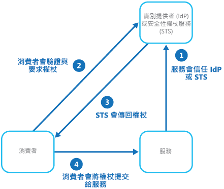
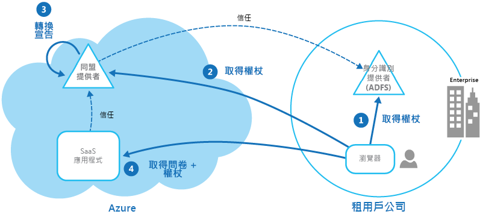

# 同盟身分識別模式Federated Identity pattern

[!INCLUDE [header](../_includes/header.md)]

將驗證委派給外部身分識別提供者。Delegate authentication to an external identity provider. 這可以簡化開發流程、將使用者系統管理需求降到最低，以及改善使用者的應用程式體驗。This can simplify development, minimize the requirement for user administration, and improve the user experience of the application.

## 內容和問題Context and problem

使用者通常需要使用與他們有業務往來的不同組織所提供和裝載的應用程式。Users typically need to work with multiple applications provided and hosted by different organizations they have a business relationship with. 系統可能會要求這些使用者針對每個應用程式使用特定 (且不同) 的認證。These users might be required to use specific (and different) credentials for each one. 這會：This can:

- **造成使用者體驗不連貫**。**Cause a disjointed user experience**. 當使用者有許多不同的認證時，常常會忘記登入認證。Users often forget sign-in credentials when they have many different ones.

- **暴露安全性弱點**。**Expose security vulnerabilities**. 當使用者離職時，必須立即將其帳戶取消佈建。When a user leaves the company the account must immediately be deprovisioned. 在大型組織中很容易忽略這一點。It's easy to overlook this in large organizations.

- **造成使用者管理複雜化**。**Complicate user management**. 系統管理員必須管理所有使用者的認證並執行額外的工作，例如提供密碼提醒。Administrators must manage credentials for all of the users, and perform additional tasks such as providing password reminders.

使用者通常偏好針對所有這些應用程式使用相同的認證。Users typically prefer to use the same credentials for all these applications.

## 方案Solution

實作可以使用同盟身分識別的驗證機制。Implement an authentication mechanism that can use federated identity. 將使用者驗證與應用程式程式碼分開，然後將驗證委派給信任的身分識別提供者。Separate user authentication from the application code, and delegate authentication to a trusted identity provider. 這可以簡化開發流程並可讓使用者使用更廣泛的身分識別提供者 (IdP) 來進行驗證，同時又可將系統管理額外負荷降到最低。This can simplify development and allow users to authenticate using a wider range of identity providers (IdP) while minimizing the administrative overhead. 它也可讓您明確地將驗證與授權分離。It also allows you to clearly decouple authentication from authorization.

信任的身分識別提供者包括公司目錄、內部部署同盟服務、業務合作夥伴所提供的其他安全性權杖服務 (STS)，或是能夠驗證具有 Microsoft、Google、Yahoo! 或 Facebook 等帳戶之使用者的社交身分識別提供者。The trusted identity providers include corporate directories, on-premises federation services, other security token services (STS) provided by business partners, or social identity providers that can authenticate users who have, for example, a Microsoft, Google, Yahoo!, or Facebook account.

下圖說明當用戶端應用程式需要存取要求驗證之服務時的「同盟身分識別」模式。The figure illustrates the Federated Identity pattern when a client application needs to access a service that requires authentication. 驗證會由與 STS 合作的 IdP 執行。The authentication is performed by an IdP that works in concert with an STS. IdP 會簽發提供受驗證使用者相關資訊的安全性權杖。The IdP issues security tokens that provide information about the authenticated user. 這項資訊 (稱為宣告) 包含使用者的身分識別，也可能包含其他資訊，例如角色成員資格和更細微的存取權限。This information, referred to as claims, includes the user’s identity, and might also include other information such as role membership and more granular access rights.

此模型通常稱為宣告型存取控制。This model is often called claims-based access control. 應用程式和服務會根據權杖所包含的宣告，授與對功能的存取權。Applications and services authorize access to features and functionality based on the claims contained in the token. 要求驗證的服務必須信任 IdP。The service that requires authentication must trust the IdP. 用戶端應用程式會聯繫執行驗證的 IdP。The client application contacts the IdP that performs the authentication. 如果驗證成功，IdP 就會傳回包含宣告的權杖，這些宣告可讓 STS (請注意，IdP 和 STS 可以是同一個服務) 識別使用者。If the authentication is successful, the IdP returns a token containing the claims that identify the user to the STS (note that the IdP and STS can be the same service). STS 可以根據預先定義的規則來轉換和擴大權杖中的宣告，然後再將權杖傳回給用戶端。The STS can transform and augment the claims in the token based on predefined rules, before returning it to the client. 用戶端應用程式可以接著將此權杖傳遞給服務作為其身分識別的證明。The client application can then pass this token to the service as proof of its identity.

> 信任鏈結中可能會有其他 STS。There might be additional STSs in the chain of trust. 例如，在稍後提到的案例中，內部部署 STS 會信任另一個負責存取身分識別提供者以驗證使用者的 STS。For example, in the scenario described later, an on-premises STS trusts another STS that is responsible for accessing an identity provider to authenticate the user. 此方法在有內部部署 STS 和目錄的企業案例中相當常見。This approach is common in enterprise scenarios where there's an on-premises STS and directory.

同盟驗證提供一個跨各種網域簽發信任身分識別的標準型解決方案，並且可支援單一登入。Federated authentication provides a standards-based solution to the issue of trusting identities across diverse domains, and can support single sign-on. 這在所有類型的應用程式中越來越常見，尤其是裝載於雲端的應用程式，因為它支援單一登入，而不需要透過網路直接連線到身分識別提供者。It's becoming more common across all types of applications, especially cloud-hosted applications, because it supports single sign-on without requiring a direct network connection to identity providers. 使用者不需要針對每個應用程式輸入認證。The user doesn't have to enter credentials for every application. 這可以提升安全性，因為無須建立存取許多不同應用程式所需的認證，同時也會向原始身分識別提供者以外的所有身分識別提供者隱藏使用者認證。This increases security because it prevents the creation of credentials required to access many different applications, and it also hides the user’s credentials from all but the original identity provider. 應用程式只會看到權杖內含的已驗證身分識別資訊。Applications see just the authenticated identity information contained within the token.

同盟身分識別還有一項主要優點，就是由身分識別提供者負責管理身分識別和認證。Federated identity also has the major advantage that management of the identity and credentials is the responsibility of the identity provider. 應用程式或服務不需要提供身分識別管理功能。The application or service doesn't need to provide identity management features. 此外，在公司案例中，公司目錄如果信任身分識別提供者，就不需要知道使用者的相關資訊。In addition, in corporate scenarios, the corporate directory doesn't need to know about the user if it trusts the identity provider. 這可免除管理目錄內使用者身分識別的所有系統管理額外負荷。This removes all the administrative overhead of managing the user identity within the directory.

## 問題和考量Issues and considerations

設計實作同盟驗證的應用程式時，請考量下列幾點：Consider the following when designing applications that implement federated authentication:

- 驗證可能為單一失敗點。Authentication can be a single point of failure. 如果您將應用程式部署至多個資料中心，請考慮將身分識別管理機制部署至相同的資料中心，以維持應用程式可靠性和可用性。If you deploy your application to multiple datacenters, consider deploying your identity management mechanism to the same datacenters to maintain application reliability and availability.

- 驗證工具可讓您根據驗證權杖內含的角色宣告來設定存取控制。Authentication tools make it possible to configure access control based on role claims contained in the authentication token. 這通常稱為角色型存取控制 (RBAC)，可允許以更細微的方式控制對功能和資源的存取。This is often referred to as role-based access control (RBAC), and it can allow a more granular level of control over access to features and resources.

- 與公司目錄不同，使用社交身分識別提供者的宣告型驗證通常除了電子郵件地址及可能還有名稱之外，不提供受驗證使用者的相關資訊。Unlike a corporate directory, claims-based authentication using social identity providers doesn't usually provide information about the authenticated user other than an email address, and perhaps a name. 有些社交身分識別提供者 (例如 Microsoft 帳戶) 只提供唯一識別碼。Some social identity providers, such as a Microsoft account, provide only a unique identifier. 應用程式通常需要維護已註冊使用者的一些相關資訊，並且要能夠將此資訊與權杖中宣告內含的識別碼做比對。The application usually needs to maintain some information on registered users, and be able to match this information to the identifier contained in the claims in the token. 一般而言，會在使用者第一次存取應用程式時，透過註冊執行此操作，然後在每次驗證後將資訊插入到權杖中作為額外的宣告。Typically this is done through registration when the user first accesses the application, and information is then injected into the token as additional claims after each authentication.

- 如果為 STS 設定的身分識別提供者有多個，就必須偵測應該將使用者重新導向到哪一個身分識別提供者來進行驗證。If there's more than one identity provider configured for the STS, it must detect which identity provider the user should be redirected to for authentication. 此程序稱為主領域探索。This process is called home realm discovery. STS 可能可以根據使用者提供的電子郵件地址或使用者名稱、使用者所存取之應用程式的子網域、使用者的 IP 位址範圍或儲存在使用者瀏覽器中的 Cookie 內容，自動執行此操作。The STS might be able to do this automatically based on an email address or user name that the user provides, a subdomain of the application that the user is accessing, the user’s IP address scope, or on the contents of a cookie stored in the user’s browser. 例如，如果使用者輸入 Microsoft 網域中的電子郵件地址 (例如 user@live.com)，STS 將會把使用者重新導向到 Microsoft 帳戶登入頁面。For example, if the user entered an email address in the Microsoft domain, such as user@live.com, the STS will redirect the user to the Microsoft account sign-in page. 在稍後瀏覽時，STS 可以使用 Cookie 來指出上次登入是使用 Microsoft 帳戶。On later visits, the STS could use a cookie to indicate that the last sign in was with a Microsoft account. 如果自動探索無法判斷主領域，STS 就會顯示主領域探索頁面，當中列出信任的身分識別提供者，使用者必須選取他們想要使用的身分識別提供者。If automatic discovery can't determine the home realm, the STS will display a home realm discovery page that lists the trusted identity providers, and the user must select the one they want to use.

## 使用此模式的時機When to use this pattern

此模式對於下列案例相當有用：This pattern is useful for scenarios such as:

- **企業中的單一登入**。**Single sign-on in the enterprise**. 在此案例中，您必須針對裝載在公司安全性界限外雲端中的公司應用程式驗證員工，而不要求他們每次瀏覽應用程式時都必須登入。In this scenario you need to authenticate employees for corporate applications that are hosted in the cloud outside the corporate security boundary, without requiring them to sign in every time they visit an application. 使用者體驗與使用內部部署應用程式時相同，其中使用者會在登入公司網路時進行驗證，之後便可存取所有相關的應用程式，而無須再次登入。The user experience is the same as when using on-premises applications where they're authenticated when signing in to a corporate network, and from then on have access to all relevant applications without needing to sign in again.

- **與多個合作夥伴搭配的同盟身分識別**。**Federated identity with multiple partners**. 在此案例中，您必須同時驗證公司員工和在公司目錄中沒有帳戶的業務合作夥伴。In this scenario you need to authenticate both corporate employees and business partners who don't have accounts in the corporate directory. 這在企業對企業應用程式、與協力廠商服務整合的應用程式中，以及在擁有不同 IT 系統的公司具有合併或共用資源的情況中，都相當常見。This is common in business-to-business applications, applications that integrate with third-party services, and where companies with different IT systems have merged or shared resources.

- **SaaS 應用程式中的同盟身分識別**。**Federated identity in SaaS applications**. 在此案例中，獨立軟體廠商會為多個用戶端或租用戶提供一個已經可供使用的服務。In this scenario independent software vendors provide a ready-to-use service for multiple clients or tenants. 每個租用戶皆使用一個適當的身分識別提供者來進行驗證。Each tenant authenticates using a suitable identity provider. 例如，企業用戶會使用其公司認證，而租用戶的取用者和用戶端則會使用其社交身分識別認證。For example, business users will use their corporate credentials, while consumers and clients of the tenant will use their social identity credentials.

此模式在下列情況下可能不是很有用：This pattern might not be useful in the following situations:

- 應用程式的所有使用者都可由一個身分識別提供者進行驗證，而無須使用任何其他身分識別提供者來進行驗證。All users of the application can be authenticated by one identity provider, and there's no requirement to authenticate using any other identity provider. 這在藉由 VPN 或 (在裝載於雲端的案例中) 透過內部部署目錄與應用程式之間的虛擬網路連線使用公司目錄 (可在應用程式內存取) 來進行驗證的商務應用程式中，是相當典型的情況。This is typical in business applications that use a corporate directory (accessible within the application) for authentication, by using a VPN, or (in a cloud-hosted scenario) through a virtual network connection between the on-premises directory and the application.

- 應用程式原先是使用不同的驗證機制來建立的 (也許是使用自訂使用者存放區)，或無法處理宣告型技術所使用的交涉標準。The application was originally built using a different authentication mechanism, perhaps with custom user stores, or doesn't have the capability to handle the negotiation standards used by claims-based technologies. 將宣告型驗證和存取控制整合至現有的應用程式中來加以改進可能相當複雜，而且可能不符合成本效益。Retrofitting claims-based authentication and access control into existing applications can be complex, and probably not cost effective.

## 範例Example

組織將多租用戶的軟體即服務 (SaaS) 應用程式裝載於 Microsoft Azure 中。An organization hosts a multi-tenant software as a service (SaaS) application in Microsoft Azure. 此應用程式包含租用戶可用來針對自己的使用者管理應用程式的網站。The application includes a website that tenants can use to manage the application for their own users. 此應用程式可讓租用戶使用當使用者由該組織自己的 Active Directory 驗證時「Active Directory 同盟服務」(ADFS) 所產生的同盟身分識別來存取網站。The application allows tenants to access the website by using a federated identity that is generated by Active Directory Federation Services (ADFS) when a user is authenticated by that organization’s own Active Directory.

下圖說明租用戶如何向自己的身分識別提供者 (在此案例中為 ADFS) 進行驗證 (步驟 1)。The figure shows how tenants authenticate with their own identity provider (step 1), in this case ADFS. 成功驗證租用戶之後，ADFS 會簽發權杖。After successfully authenticating a tenant, ADFS issues a token. 用戶端瀏覽器會將此權杖轉送給 SaaS 應用程式的同盟提供者，此提供者會信任租用戶的 ADFS 所簽發的權杖，以取回一個對 SaaS 同盟提供者有效的權杖 (步驟 2)。The client browser forwards this token to the SaaS application’s federation provider, which trusts tokens issued by the tenant’s ADFS, in order to get back a token that is valid for the SaaS federation provider (step 2). 必要時，SaaS 同盟提供者會先將權杖中的宣告轉換成應用程式能夠辨識的宣告 (步驟 3)，然後才將新權杖傳回給用戶端瀏覽器。If necessary, the SaaS federation provider performs a transformation on the claims in the token into claims that the application recognizes (step 3) before returning the new token to the client browser. 應用程式會信任 SaaS 同盟提供者所簽發的權杖，然後使用權杖中的宣告來套用授權規則 (步驟 4)。The application trusts tokens issued by the SaaS federation provider and uses the claims in the token to apply authorization rules (step 4).

租用戶不須記住個別的認證即可存取應用程式，而租用戶公司的系統管理員則可以在自己的 ADFS 中設定可存取應用程式的使用者清單。Tenants won't need to remember separate credentials to access the application, and an administrator at the tenant’s company can configure in its own ADFS the list of users that can access the application.

## 相關的指引Related guidance

- [Microsoft Azure Active DirectoryMicrosoft Azure Active Directory](https://azure.microsoft.com/services/active-directory/)
- [Active Directory Domain ServicesActive Directory Domain Services](https://msdn.microsoft.com/library/bb897402.aspx)
- [Active Directory 同盟服務](https://msdn.microsoft.com/library/bb897402.aspx) \(英文\)[Active Directory Federation Services](https://msdn.microsoft.com/library/bb897402.aspx)
- [Microsoft Azure 中多租用戶應用程式的身分識別管理Identity management for multitenant applications in Microsoft Azure](https://azure.microsoft.com/documentation/articles/guidance-multitenant-identity/)
- [Azure 中的多租用戶應用程式Multitenant Applications in Azure](https://azure.microsoft.com/documentation/articles/dotnet-develop-multitenant-applications/)
