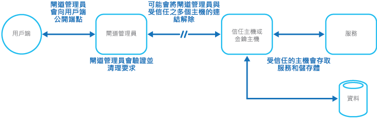

# 閘道管理員模式

[!INCLUDE [header](../_includes/header.md)]

可保護應用程式和服務，方法是使用專用的主機執行個體，其會作為用戶端和應用程式或服務之間的代理程式、驗證和處理要求，並在兩者之間傳遞要求和資料。 這可以提供一層額外的安全性，並可限制系統的受攻擊面。

## 內容和問題

應用程式透過接受和處理要求來向用戶端公開其功能。 在雲端裝載案例中，應用程式公開用戶端連線的端點，並通常包括可處理來自用戶端之要求的程式碼。 此程式碼會執行驗證、處理部分或全部要求，並可能代表用戶端存取儲存體和其他服務。

如果惡意使用者能夠入侵系統並存取應用程式的裝載環境，它使用的安全性機制 (例如，認證與儲存體金鑰) 和所存取的服務與資料都會遭到公開。 因此，惡意使用者將能任意存取機密資訊與其他服務。

## 解決方式

若要讓用戶端取得機密資訊與服務存取權的風險降至最低，可從處理要求和存取儲存體的程式碼分離會公開公用端點的主機或工作。 您可以使用會和用戶端互動的 façade 或專用工作，然後&mdash;也許透過去耦合介面&mdash;將要求遞交給將會處理該要求的主機或工作。 下圖提供此模式的高階概述。

閘道管理員模式可用來直接保護儲存體，或可作為更全面的 façade，用來保護應用程式的所有函式。 重要因素如下：

- **受控制的驗證。** 閘道管理員會驗證所有要求，並拒絕不符合驗證需求的所有要求。
- **風險受限且公開程度有限。** 閘道管理員無法存取受信任主機用來存取儲存體與服務的認證或金鑰。 如果閘道管理員遭到入侵，攻擊者不會取得這些認證或金鑰的存取權。
- **安全性恰到好處。** 閘道管理員要在有限權限模式中執行，而應用程式的其餘部分要在完全信任模式中執行，才能存取儲存體和服務。 如果閘道管理員遭到入侵，它無法直接存取應用程式服務或資料。

此模式就像是一般網路拓撲中的防火牆。 它允許閘道管理員檢查要求並決定是否將該要求傳遞至執行所需工作的信任主機 (有時稱為金鑰主機)。 這通常會要求閘道管理員驗證並處理要求內容之後，再決定是否傳遞給信任的主機。

## 問題和考量

當您決定如何實作此模式時，請考慮下列幾點：

- 確定閘道管理員傳遞要求的目標信任主機僅公開內部或受保護的端點，並且只和閘道管理員連線。 信任的主機不應公開任何外部端點或介面。
- 閘道管理員必須在有限權限模式中執行。 這通常表示要在個別的託管服務或虛擬機器中執行閘道管理員與信任主機。
- 閘道管理員不應執行和應用程式或服務相關的任何處理，或存取任何資料。 它單純用來驗證和處理要求。 信任主機可能需要額外執行要求驗證，但核心驗證應由閘道管理員執行。
- 儘可能在閘道管理員與信任主機或工作之間使用安全通訊通道 (HTTPS、SSL 或 TLS)。 然而，有些裝載環境在內部端點上並不支援 HTTPS。
- 對應用程式另外增加實作閘道管理員模式的一層，會需要額外的處理與網路通訊而可能對效能產生一些影響。
- 閘道管理員執行個體可能是單一失敗點。 若要將失敗的影響降到最低，請考慮部署額外的執行個體，並使用自動調整規模機制，以確保容量能夠維持可用性。

## 使用此模式的時機

這種模式在下列情況中非常有用：

- 處理機密資訊、公開必須提供高度保護以抵禦惡意攻擊的服務，或執行不應中斷之關鍵任務作業的的應用程式。
- 有必要和主要工作分開執行要求驗證，或集中管理此驗證以簡化維護和系統管理的分散式應用程式。

## 範例

在雲端裝載案例中，可以透過將閘道管理員角色或虛擬機器從信任角色與應用程式中的服務分離，來實作此模式。 使用內部端點、佇列或儲存體作為中繼通訊機制，即可達成此目的。 下圖示範使用內部端點。

## 相關的模式

實作閘道管理員模式時，也可能與[有限權限金鑰模式](valet-key.md)相關。 在閘道管理員與信任的角色之間通訊時，最好使用可限制存取資源權限的金鑰或權杖，來增強安全性。 描述如何使用權杖或金鑰為用戶端提供特定資源或服務的受限制直接存取。
