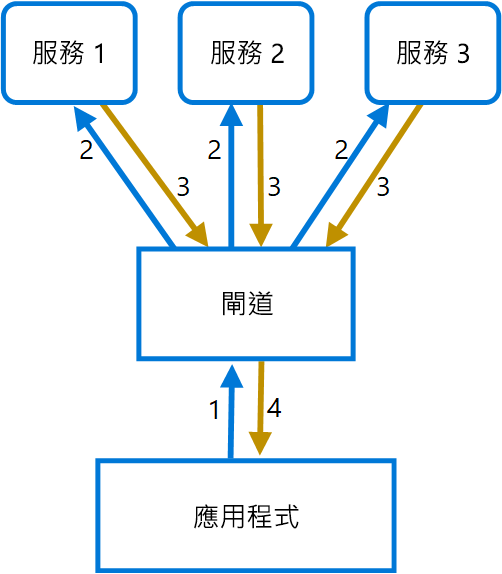

# <a name="gateway-aggregation-pattern"></a><span data-ttu-id="95342-104">閘道彙總模式</span><span class="sxs-lookup"><span data-stu-id="95342-104">Gateway Aggregation pattern</span></span>

<span data-ttu-id="95342-105">您可以使用閘道來將多個個別的要求彙總成單一要求。</span><span class="sxs-lookup"><span data-stu-id="95342-105">Use a gateway to aggregate multiple individual requests into a single request.</span></span> <span data-ttu-id="95342-106">當用戶端必須對不同的後端系統進行多個呼叫以執行作業時，此模式相當有用。</span><span class="sxs-lookup"><span data-stu-id="95342-106">This pattern is useful when a client must make multiple calls to different backend systems to perform an operation.</span></span>

## <a name="context-and-problem"></a><span data-ttu-id="95342-107">內容和問題</span><span class="sxs-lookup"><span data-stu-id="95342-107">Context and problem</span></span>

<span data-ttu-id="95342-108">若要執行單一工作，用戶端可能需要向各種後端服務進行多次呼叫。</span><span class="sxs-lookup"><span data-stu-id="95342-108">To perform a single task, a client may have to make multiple calls to various backend services.</span></span> <span data-ttu-id="95342-109">依賴許多服務執行工作的應用程式，必然會耗費資源於每個要求。</span><span class="sxs-lookup"><span data-stu-id="95342-109">An application that relies on many services to perform a task must expend resources on each request.</span></span> <span data-ttu-id="95342-110">當應用程式加入任何新功能或服務時，便需要額外的要求，也因此進一步增加了資源需求和網路呼叫。</span><span class="sxs-lookup"><span data-stu-id="95342-110">When any new feature or service is added to the application, additional requests are needed, further increasing resource requirements and network calls.</span></span> <span data-ttu-id="95342-111">用戶端與後端之間的對話，會對應用程式的效能和等級造成負面影響。</span><span class="sxs-lookup"><span data-stu-id="95342-111">This chattiness between a client and a backend can adversely impact the performance and scale of the application.</span></span>  <span data-ttu-id="95342-112">微服務架構使得這個問題更常見，因為應用程式建置於許多小型服務之上，自然會有更多數量的跨服務呼叫。</span><span class="sxs-lookup"><span data-stu-id="95342-112">Microservice architectures have made this problem more common, as applications built around many smaller services naturally have a higher amount of cross-service calls.</span></span>

<span data-ttu-id="95342-113">在下列圖表中，用戶端將要求傳送至每個服務 (1、2、3)。</span><span class="sxs-lookup"><span data-stu-id="95342-113">In the following diagram, the client sends requests to each service (1,2,3).</span></span> <span data-ttu-id="95342-114">每個服務會處理要求，並傳送回應給應用程式 (4、5、6)。</span><span class="sxs-lookup"><span data-stu-id="95342-114">Each service processes the request and sends the response back to the application (4,5,6).</span></span> <span data-ttu-id="95342-115">在通常具有高延遲的行動電話通訊網路上，以這種方式使用個別要求是缺乏效率的，並可能會導致連線中斷或未完成的要求。</span><span class="sxs-lookup"><span data-stu-id="95342-115">Over a cellular network with typically high latency, using individual requests in this manner is inefficient and could result in broken connectivity or incomplete requests.</span></span> <span data-ttu-id="95342-116">雖然可能會平行執行每個要求，但是應用程式必須在個別的連線上傳送、等待和處理每個要求的資料，因而提高了失敗的機率。</span><span class="sxs-lookup"><span data-stu-id="95342-116">While each request may be done in parallel, the application must send, wait, and process data for each request, all on separate connections, increasing the chance of failure.</span></span>


## <a name="solution"></a><span data-ttu-id="95342-118">解決方法</span><span class="sxs-lookup"><span data-stu-id="95342-118">Solution</span></span>

<span data-ttu-id="95342-119">使用閘道可減少用戶端與服務之間的對話。</span><span class="sxs-lookup"><span data-stu-id="95342-119">Use a gateway to reduce chattiness between the client and the services.</span></span> <span data-ttu-id="95342-120">閘道收到用戶端要求之後，將要求分派至不同的後端系統，然後將結果彙總後再傳送回要求的用戶端。</span><span class="sxs-lookup"><span data-stu-id="95342-120">The gateway receives client requests, dispatches requests to the various backend systems, and then aggregates the results and sends them back to the requesting client.</span></span>

<span data-ttu-id="95342-121">此模式可減少應用程式對後端服務的要求數目，並改善透過高延遲網路的應用程式效能。</span><span class="sxs-lookup"><span data-stu-id="95342-121">This pattern can reduce the number of requests that the application makes to backend services, and improve application performance over high-latency networks.</span></span>

<span data-ttu-id="95342-122">在下列圖表中，應用程式傳送要求至閘道 (1)。</span><span class="sxs-lookup"><span data-stu-id="95342-122">In the following diagram, the application sends a request to the gateway (1).</span></span> <span data-ttu-id="95342-123">此要求包含一組額外的要求。</span><span class="sxs-lookup"><span data-stu-id="95342-123">The request contains a package of additional requests.</span></span> <span data-ttu-id="95342-124">閘道會分解這些要求，並將之傳送至相關服務以處理個別要求 (2)。</span><span class="sxs-lookup"><span data-stu-id="95342-124">The gateway decomposes these and processes each request by sending it to the relevant service (2).</span></span> <span data-ttu-id="95342-125">每個服務會傳回一個回應給閘道 (3)。</span><span class="sxs-lookup"><span data-stu-id="95342-125">Each service returns a response to the gateway (3).</span></span> <span data-ttu-id="95342-126">閘道會合併來自每個服務的回應，並傳送回應給應用程式 (4)。</span><span class="sxs-lookup"><span data-stu-id="95342-126">The gateway combines the responses from each service and sends the response to the application (4).</span></span> <span data-ttu-id="95342-127">應用程式進行單一要求，並只會收到來自閘道的單一回應。</span><span class="sxs-lookup"><span data-stu-id="95342-127">The application makes a single request and receives only a single response from the gateway.</span></span>



## <a name="issues-and-considerations"></a><span data-ttu-id="95342-129">問題和考量</span><span class="sxs-lookup"><span data-stu-id="95342-129">Issues and considerations</span></span>

- <span data-ttu-id="95342-130">閘道不應引入跨後端服務的服務結合。</span><span class="sxs-lookup"><span data-stu-id="95342-130">The gateway should not introduce service coupling across the backend services.</span></span>
- <span data-ttu-id="95342-131">閘道應位於後端服務附近，以儘可能降低延遲。</span><span class="sxs-lookup"><span data-stu-id="95342-131">The gateway should be located near the backend services to reduce latency as much as possible.</span></span>
- <span data-ttu-id="95342-132">閘道服務可能會導致單一失敗點。</span><span class="sxs-lookup"><span data-stu-id="95342-132">The gateway service may introduce a single point of failure.</span></span> <span data-ttu-id="95342-133">請確定已適當地設計閘道，以符合您的應用程式可用性需求。</span><span class="sxs-lookup"><span data-stu-id="95342-133">Ensure the gateway is properly designed to meet your application's availability requirements.</span></span>
- <span data-ttu-id="95342-134">閘道可能會造成瓶頸。</span><span class="sxs-lookup"><span data-stu-id="95342-134">The gateway may introduce a bottleneck.</span></span> <span data-ttu-id="95342-135">請確定閘道有足夠的效能可處理負載，而且可以調整規模以符合您預期的成長。</span><span class="sxs-lookup"><span data-stu-id="95342-135">Ensure the gateway has adequate performance to handle load and can be scaled to meet your anticipated growth.</span></span>
- <span data-ttu-id="95342-136">對閘道執行負載測試，以確保不會導致一連串的服務失敗。</span><span class="sxs-lookup"><span data-stu-id="95342-136">Perform load testing against the gateway to ensure you don't introduce cascading failures for services.</span></span>
- <span data-ttu-id="95342-137">實作具有彈性的設計，使用如[艙壁模式][bulkhead]、[斷路][circuit-breaker]、[重試][retry]及「逾時」等技術。</span><span class="sxs-lookup"><span data-stu-id="95342-137">Implement a resilient design, using techniques such as [bulkheads][bulkhead], [circuit breaking][circuit-breaker], [retry][retry], and timeouts.</span></span>
- <span data-ttu-id="95342-138">如果一或多個服務呼叫時間過長，則可以接受逾時並傳回部分的資料。</span><span class="sxs-lookup"><span data-stu-id="95342-138">If one or more service calls takes too long, it may be acceptable to timeout and return a partial set of data.</span></span> <span data-ttu-id="95342-139">請考慮您的應用程式將如何處理此案例。</span><span class="sxs-lookup"><span data-stu-id="95342-139">Consider how your application will handle this scenario.</span></span>
- <span data-ttu-id="95342-140">使用非同步 I/O，以確保後端的延遲不會造成應用程式的效能問題。</span><span class="sxs-lookup"><span data-stu-id="95342-140">Use asynchronous I/O to ensure that a delay at the backend doesn't cause performance issues in the application.</span></span>
- <span data-ttu-id="95342-141">使用相互關聯識別碼來實作分散式追蹤，以追蹤每個個別呼叫。</span><span class="sxs-lookup"><span data-stu-id="95342-141">Implement distributed tracing using correlation IDs to track each individual call.</span></span>
- <span data-ttu-id="95342-142">監視要求計量和回應大小。</span><span class="sxs-lookup"><span data-stu-id="95342-142">Monitor request metrics and response sizes.</span></span>
- <span data-ttu-id="95342-143">請考慮傳回快取資料作為處理失敗時的容錯移轉策略。</span><span class="sxs-lookup"><span data-stu-id="95342-143">Consider returning cached data as a failover strategy to handle failures.</span></span>
- <span data-ttu-id="95342-144">請考慮將彙總服務置於閘道後方，而不是建置於閘道中。</span><span class="sxs-lookup"><span data-stu-id="95342-144">Instead of building aggregation into the gateway, consider placing an aggregation service behind the gateway.</span></span> <span data-ttu-id="95342-145">要求彙總可能會有不同於閘道中其他服務的資源需求，並可能影響閘道的路由和卸載功能。</span><span class="sxs-lookup"><span data-stu-id="95342-145">Request aggregation will likely have different resource requirements than other services in the gateway and may impact the gateway's routing and offloading functionality.</span></span>

## <a name="when-to-use-this-pattern"></a><span data-ttu-id="95342-146">使用此模式的時機</span><span class="sxs-lookup"><span data-stu-id="95342-146">When to use this pattern</span></span>

<span data-ttu-id="95342-147">使用此模式的時機包括：</span><span class="sxs-lookup"><span data-stu-id="95342-147">Use this pattern when:</span></span>

- <span data-ttu-id="95342-148">用戶端必須與多個後端服務通訊以執行作業。</span><span class="sxs-lookup"><span data-stu-id="95342-148">A client needs to communicate with multiple backend services to perform an operation.</span></span>
- <span data-ttu-id="95342-149">用戶端可能使用具有明顯延遲的網路，例如行動電話通訊網路。</span><span class="sxs-lookup"><span data-stu-id="95342-149">The client may use networks with significant latency, such as cellular networks.</span></span>

<span data-ttu-id="95342-150">此模式可能不適合下列時機︰</span><span class="sxs-lookup"><span data-stu-id="95342-150">This pattern may not be suitable when:</span></span>

- <span data-ttu-id="95342-151">您想要減少多個作業中用戶端與單一服務之間的呼叫數。</span><span class="sxs-lookup"><span data-stu-id="95342-151">You want to reduce the number of calls between a client and a single service across multiple operations.</span></span> <span data-ttu-id="95342-152">在該案例中，可能比較適合將批次作業加入服務。</span><span class="sxs-lookup"><span data-stu-id="95342-152">In that scenario, it may be better to add a batch operation to the service.</span></span>
- <span data-ttu-id="95342-153">用戶端或應用程式位於後端服務附近，且延遲不是重要因素。</span><span class="sxs-lookup"><span data-stu-id="95342-153">The client or application is located near the backend services and latency is not a significant factor.</span></span>

## <a name="example"></a><span data-ttu-id="95342-154">範例</span><span class="sxs-lookup"><span data-stu-id="95342-154">Example</span></span>

<span data-ttu-id="95342-155">下列範例說明如何使用 Lua 建立簡單的閘道彙總 NGINX 服務。</span><span class="sxs-lookup"><span data-stu-id="95342-155">The following example illustrates how to create a simple a gateway aggregation NGINX service using Lua.</span></span>

```lua
worker_processes  4;

events {
  worker_connections 1024;
}

http {
  server {
    listen 80;

    location = /batch {
      content_by_lua '
        ngx.req.read_body()

        -- read json body content
        local cjson = require "cjson"
        local batch = cjson.decode(ngx.req.get_body_data())["batch"]

        -- create capture_multi table
        local requests = {}
        for i, item in ipairs(batch) do
          table.insert(requests, {item.relative_url, { method = ngx.HTTP_GET}})
        end

        -- execute batch requests in parallel
        local results = {}
        local resps = { ngx.location.capture_multi(requests) }
        for i, res in ipairs(resps) do
          table.insert(results, {status = res.status, body = cjson.decode(res.body), header = res.header})
        end

        ngx.say(cjson.encode({results = results}))
      ';
    }

    location = /service1 {
      default_type application/json;
      echo '{"attr1":"val1"}';
    }

    location = /service2 {
      default_type application/json;
      echo '{"attr2":"val2"}';
    }
  }
}
```

## <a name="related-guidance"></a><span data-ttu-id="95342-156">相關的指引</span><span class="sxs-lookup"><span data-stu-id="95342-156">Related guidance</span></span>

- [<span data-ttu-id="95342-157">針對前端的後端模式</span><span class="sxs-lookup"><span data-stu-id="95342-157">Backends for Frontends pattern</span></span>](./backends-for-frontends.md)
- [<span data-ttu-id="95342-158">閘道卸載模式</span><span class="sxs-lookup"><span data-stu-id="95342-158">Gateway Offloading pattern</span></span>](./gateway-offloading.md)
- [<span data-ttu-id="95342-159">閘道路由模式</span><span class="sxs-lookup"><span data-stu-id="95342-159">Gateway Routing pattern</span></span>](./gateway-routing.md)

[bulkhead]: ./bulkhead.md
[circuit-breaker]: ./circuit-breaker.md
[retry]: ./retry.md