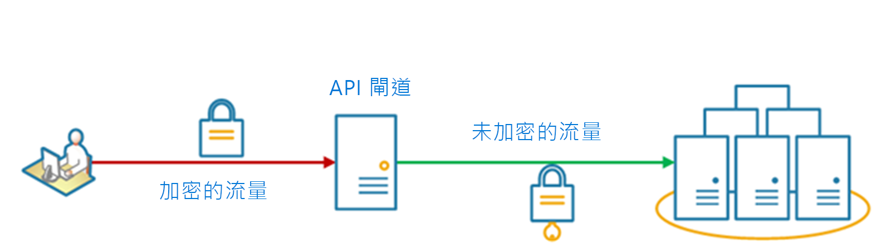

# <a name="gateway-offloading-pattern"></a><span data-ttu-id="54389-103">閘道卸載模式</span><span class="sxs-lookup"><span data-stu-id="54389-103">Gateway Offloading pattern</span></span>

<span data-ttu-id="54389-104">將共用或特殊服務功能卸載至閘道 Proxy。</span><span class="sxs-lookup"><span data-stu-id="54389-104">Offload shared or specialized service functionality to a gateway proxy.</span></span> <span data-ttu-id="54389-105">透過將共用服務功能 (例如 SSL 憑證的使用) 從應用程式的其他部分移動到閘道，此模式可以簡化應用程式開發。</span><span class="sxs-lookup"><span data-stu-id="54389-105">This pattern can simplify application development by moving shared service functionality, such as the use of SSL certificates, from other parts of the application into the gateway.</span></span>

## <a name="context-and-problem"></a><span data-ttu-id="54389-106">內容和問題</span><span class="sxs-lookup"><span data-stu-id="54389-106">Context and problem</span></span>

<span data-ttu-id="54389-107">某些功能常會在多個服務間使用，而這些功能都需要設定、管理和維護。</span><span class="sxs-lookup"><span data-stu-id="54389-107">Some features are commonly used across multiple services, and these features require configuration, management, and maintenance.</span></span> <span data-ttu-id="54389-108">隨著每個應用程式部署散發的共用或特殊服務會增加系統管理額外負荷，並增加部署錯誤的可能性。</span><span class="sxs-lookup"><span data-stu-id="54389-108">A shared or specialized service that is distributed with every application deployment increases the administrative overhead and increases the likelihood of deployment error.</span></span> <span data-ttu-id="54389-109">必須在共用該功能的所有服務上部署對共用功能的任何更新。</span><span class="sxs-lookup"><span data-stu-id="54389-109">Any updates to a shared feature must be deployed across all services that share that feature.</span></span>

<span data-ttu-id="54389-110">正確處理安全性問題 (權杖驗證、加密、SSL 憑證管理)，以及其他複雜工作可能需要小組成員具備高度特殊的技能。</span><span class="sxs-lookup"><span data-stu-id="54389-110">Properly handling security issues (token validation, encryption, SSL certificate management) and other complex tasks can require team members to have highly specialized skills.</span></span> <span data-ttu-id="54389-111">例如，必須在所有應用程式執行個體上設定和部署應用程式所需的憑證。</span><span class="sxs-lookup"><span data-stu-id="54389-111">For example, a certificate needed by an application must be configured and deployed on all application instances.</span></span> <span data-ttu-id="54389-112">對於每個新部署，必須管理憑證，以確保它不會過期。</span><span class="sxs-lookup"><span data-stu-id="54389-112">With each new deployment, the certificate must be managed to ensure that it does not expire.</span></span> <span data-ttu-id="54389-113">必須在每個應用程式部署上更新、測試及驗證即將到期的任何一般憑證。</span><span class="sxs-lookup"><span data-stu-id="54389-113">Any common certificate that is due to expire must be updated, tested, and verified on every application deployment.</span></span>

<span data-ttu-id="54389-114">其他常見的服務，例如驗證、授權、記錄、監視或[節流](./throttling.md)，在大量部署間可能難以實作和管理。</span><span class="sxs-lookup"><span data-stu-id="54389-114">Other common services such as authentication, authorization, logging, monitoring, or [throttling](./throttling.md) can be difficult to implement and manage across a large number of deployments.</span></span> <span data-ttu-id="54389-115">較好的方式是合併這種類型的功能，以減少額外負荷及錯誤的機會。</span><span class="sxs-lookup"><span data-stu-id="54389-115">It may be better to consolidate this type of functionality, in order to reduce overhead and the chance of errors.</span></span>

## <a name="solution"></a><span data-ttu-id="54389-116">方案</span><span class="sxs-lookup"><span data-stu-id="54389-116">Solution</span></span>

<span data-ttu-id="54389-117">將某些功能卸載至 API 閘道，特別是跨領域考量，例如憑證管理、驗證、SSL 終止、監視、通訊協定轉譯，或是節流。</span><span class="sxs-lookup"><span data-stu-id="54389-117">Offload some features into an API gateway, particularly cross-cutting concerns such as certificate management, authentication, SSL termination, monitoring, protocol translation, or throttling.</span></span> 

<span data-ttu-id="54389-118">下圖顯示會終止輸入 SSL 連線的 API 閘道。</span><span class="sxs-lookup"><span data-stu-id="54389-118">The following diagram shows an API gateway that terminates inbound SSL connections.</span></span> <span data-ttu-id="54389-119">它會代表來自 API 閘道任何 HTTP 伺服器上游的原始要求者要求資料。</span><span class="sxs-lookup"><span data-stu-id="54389-119">It requests data on behalf of the original requestor from any HTTP server upstream of the API gateway.</span></span>

 
 
<span data-ttu-id="54389-120">此模式的好處包括：</span><span class="sxs-lookup"><span data-stu-id="54389-120">Benefits of this pattern include:</span></span>

- <span data-ttu-id="54389-121">讓您不再需要散發及維護支援資源，例如 Web 伺服器憑證和安全網站的設定，簡化服務的開發。</span><span class="sxs-lookup"><span data-stu-id="54389-121">Simplify the development of services by removing the need to distribute and maintain supporting resources, such as web server certificates and configuration for secure websites.</span></span> <span data-ttu-id="54389-122">較簡單的設定會導致更易於管理和延展性，並可使服務升級更簡單。</span><span class="sxs-lookup"><span data-stu-id="54389-122">Simpler configuration results in easier management and scalability and makes service upgrades simpler.</span></span>

- <span data-ttu-id="54389-123">允許專用小組實作需要特殊專業技術的功能，例如安全性。</span><span class="sxs-lookup"><span data-stu-id="54389-123">Allow dedicated teams to implement features that require specialized expertise, such as security.</span></span> <span data-ttu-id="54389-124">這可讓您的核心小組專注於應用程式功能，將特殊化但跨領域考量留給相關的專家。</span><span class="sxs-lookup"><span data-stu-id="54389-124">This allows your core team to focus on the application functionality, leaving these specialized but cross-cutting concerns to the relevant experts.</span></span>

- <span data-ttu-id="54389-125">為要求和回應記錄和監視提供一些一致性。</span><span class="sxs-lookup"><span data-stu-id="54389-125">Provide some consistency for request and response logging and monitoring.</span></span> <span data-ttu-id="54389-126">即使未正確檢測服務，也可以設定閘道以確保最低層級的監視和記錄。</span><span class="sxs-lookup"><span data-stu-id="54389-126">Even if a service is not correctly instrumented, the gateway can be configured to ensure a minimum level of monitoring and logging.</span></span>

## <a name="issues-and-considerations"></a><span data-ttu-id="54389-127">問題和考量</span><span class="sxs-lookup"><span data-stu-id="54389-127">Issues and considerations</span></span>

- <span data-ttu-id="54389-128">確定 API 閘道高度可用且能夠從失敗復原。</span><span class="sxs-lookup"><span data-stu-id="54389-128">Ensure the API gateway is highly available and resilient to failure.</span></span> <span data-ttu-id="54389-129">執行 API 閘道的多個執行個體，以避免單一失敗點。</span><span class="sxs-lookup"><span data-stu-id="54389-129">Avoid single points of failure by running multiple instances of your API gateway.</span></span> 
- <span data-ttu-id="54389-130">請確定閘道已針對應用程式和端點的容量和調整需求設計。</span><span class="sxs-lookup"><span data-stu-id="54389-130">Ensure the gateway is designed for the capacity and scaling requirements of your application and endpoints.</span></span> <span data-ttu-id="54389-131">確定閘道不會成為應用程式的瓶頸，而且可以完全擴充。</span><span class="sxs-lookup"><span data-stu-id="54389-131">Make sure the gateway does not become a bottleneck for the application and is sufficiently scalable.</span></span>
- <span data-ttu-id="54389-132">只卸載整個應用程式使用的功能，例如安全性或資料傳輸。</span><span class="sxs-lookup"><span data-stu-id="54389-132">Only offload features that are used by the entire application, such as security or data transfer.</span></span>
- <span data-ttu-id="54389-133">永遠不應將商務邏輯卸載到 API 閘道。</span><span class="sxs-lookup"><span data-stu-id="54389-133">Business logic should never be offloaded to the API gateway.</span></span> 
- <span data-ttu-id="54389-134">如果您需要追蹤交易，請考慮針對記錄目的產生相互關聯識別碼。</span><span class="sxs-lookup"><span data-stu-id="54389-134">If you need to track transactions, consider generating correlation IDs for logging purposes.</span></span>

## <a name="when-to-use-this-pattern"></a><span data-ttu-id="54389-135">使用此模式的時機</span><span class="sxs-lookup"><span data-stu-id="54389-135">When to use this pattern</span></span>

<span data-ttu-id="54389-136">使用此模式的時機包括：</span><span class="sxs-lookup"><span data-stu-id="54389-136">Use this pattern when:</span></span>

- <span data-ttu-id="54389-137">應用程式部署具有共用問題，例如 SSL 憑證或加密。</span><span class="sxs-lookup"><span data-stu-id="54389-137">An application deployment has a shared concern such as SSL certificates or encryption.</span></span>
- <span data-ttu-id="54389-138">可能有不同資源需求 (例如：記憶體資源、儲存容量或網路連線) 的應用程式部署之間共通的功能。</span><span class="sxs-lookup"><span data-stu-id="54389-138">A feature that is common across application deployments that may have different resource requirements, such as memory resources, storage capacity or network connections.</span></span>
- <span data-ttu-id="54389-139">您想要將網路安全性、節流設定或其他網路界限考量之類問題的責任轉移給更特殊的小組。</span><span class="sxs-lookup"><span data-stu-id="54389-139">You wish to move the responsibility for issues such as network security, throttling, or other network boundary concerns to a more specialized team.</span></span>

<span data-ttu-id="54389-140">如果跨服務引入了結合，則此模式可能不適合。</span><span class="sxs-lookup"><span data-stu-id="54389-140">This pattern may not be suitable if it introduces coupling across services.</span></span>

## <a name="example"></a><span data-ttu-id="54389-141">範例</span><span class="sxs-lookup"><span data-stu-id="54389-141">Example</span></span>

<span data-ttu-id="54389-142">使用 Nginx 做為 SSL 卸載應用裝置，下列設定會終止連入的 SSL 連線，並將連線散發至三個上游 HTTP 伺服器的其中一個。</span><span class="sxs-lookup"><span data-stu-id="54389-142">Using Nginx as the SSL offload appliance, the following configuration terminates an inbound SSL connection and distributes the connection to one of three upstream HTTP servers.</span></span>

```
upstream iis {
        server  10.3.0.10    max_fails=3    fail_timeout=15s;
        server  10.3.0.20    max_fails=3    fail_timeout=15s;
        server  10.3.0.30    max_fails=3    fail_timeout=15s;
}

server {
        listen 443;
        ssl on;
        ssl_certificate /etc/nginx/ssl/domain.cer;
        ssl_certificate_key /etc/nginx/ssl/domain.key;

        location / {
                set $targ iis;
                proxy_pass http://$targ;
                proxy_set_header X-Forwarded-For $proxy_add_x_forwarded_for;
                proxy_set_header X-Forwarded-Proto https;
proxy_set_header X-Real-IP $remote_addr;
                proxy_set_header Host $host;
        }
}
```

## <a name="related-guidance"></a><span data-ttu-id="54389-143">相關的指引</span><span class="sxs-lookup"><span data-stu-id="54389-143">Related guidance</span></span>

- [<span data-ttu-id="54389-144">前端模式的範例</span><span class="sxs-lookup"><span data-stu-id="54389-144">Backends for Frontends pattern</span></span>](./backends-for-frontends.md)
- [<span data-ttu-id="54389-145">閘道彙總模式</span><span class="sxs-lookup"><span data-stu-id="54389-145">Gateway Aggregation pattern</span></span>](./gateway-aggregation.md)
- [<span data-ttu-id="54389-146">閘道路由模式</span><span class="sxs-lookup"><span data-stu-id="54389-146">Gateway Routing pattern</span></span>](./gateway-routing.md)

