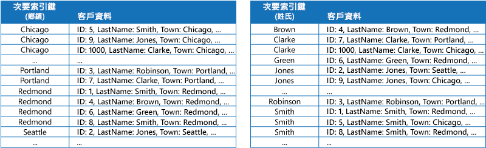
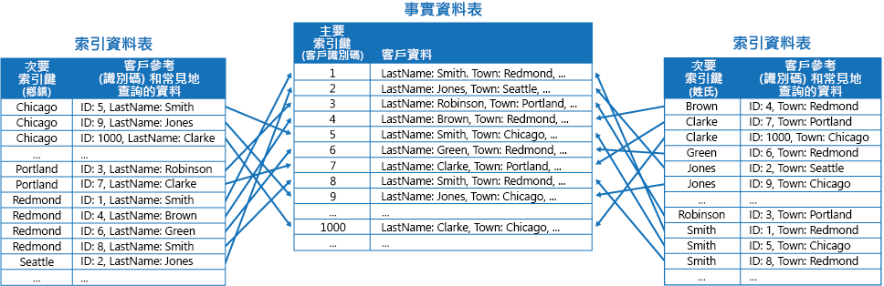
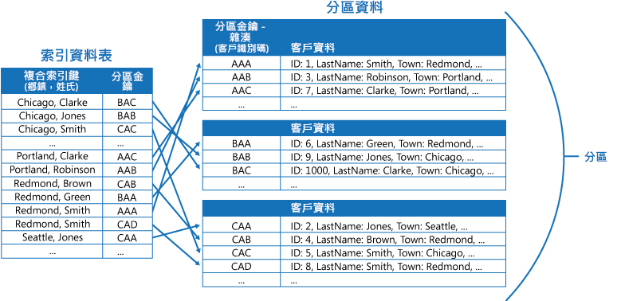
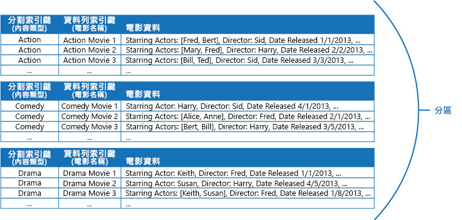
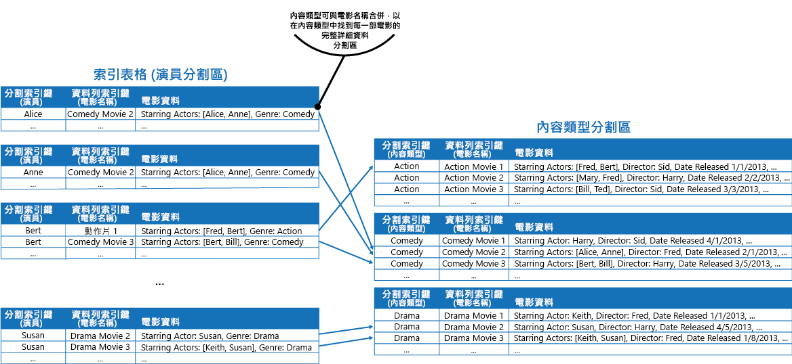

# 索引資料表模式Index Table pattern

[!INCLUDE [header](../_includes/header.md)]

針對資料存放區中查詢經常參考的欄位建立索引。Create indexes over the fields in data stores that are frequently referenced by queries. 此模式可以改進查詢效能，方法是讓應用程式更快找到要從資料存放區擷取的資料。This pattern can improve query performance by allowing applications to more quickly locate the data to retrieve from a data store.

## 內容和問題Context and problem

許多資料存放區會使用主索引鍵來組織實體集合的資料。Many data stores organize the data for a collection of entities using the primary key. 應用程式可以使用此索引鍵以找出並擷取資料。An application can use this key to locate and retrieve data. 此圖顯示保存客戶資訊的資料存放區範例。The figure shows an example of a data store holding customer information. 主索引鍵是客戶識別碼。The primary key is the Customer ID. 此圖顯示依主索引鍵 (客戶識別碼) 組織的客戶資訊。The figure shows customer information organized by the primary key (Customer ID).

主索引鍵對於根據此索引鍵的值擷取資料之查詢相當重要，如果應用程式必須根據某些其他欄位來擷取資料，則應用程式可能無法使用主索引鍵。While the primary key is valuable for queries that fetch data based on the value of this key, an application might not be able to use the primary key if it needs to retrieve data based on some other field. 在客戶範例中，如果應用程式單純藉由參考某些其他屬性的值 (例如客戶所在的城鎮) 來查詢資料，則應用程式無法使用客戶識別碼主索引鍵來擷取客戶。In the customers example, an application can't use the Customer ID primary key to retrieve customers if it queries data solely by referencing the value of some other attribute, such as the town in which the customer is located. 若要執行這類的查詢，應用程式必須擷取並檢查每個客戶記錄，這樣可能會讓處理程序變慢。To perform a query such as this, the application might have to fetch and examine every customer record, which could be a slow process.

許多關聯式資料庫管理系統支援次要索引。Many relational database management systems support secondary indexes. 次要索引是個別的資料結構，由一或多個非主要 (次要) 索引鍵欄位所組織，它會指出每個索引值的資料儲存之位置。A secondary index is a separate data structure that's organized by one or more nonprimary (secondary) key fields, and it indicates where the data for each indexed value is stored. 次要索引中的項目通常會依照次要索引鍵的值來儲存，以便快速查閱資料。The items in a secondary index are typically sorted by the value of the secondary keys to enable fast lookup of data. 這些索引通常會由資料庫管理系統自動維護。These indexes are usually maintained automatically by the database management system.

您可以建立您需要之數目的次要索引，以支援您的應用程式執行的不同查詢。You can create as many secondary indexes as you need to support the different queries that your application performs. 例如，在客戶識別碼是主索引鍵之關聯式資料庫的 [客戶] 資料表中，如果應用程式經常依據客戶所在的城鎮查閱客戶，則在城鎮欄位新增次要索引很有幫助。For example, in a Customers table in a relational database where the Customer ID is the primary key, it's beneficial to add a secondary index over the town field if the application frequently looks up customers by the town where they reside.

不過，雖然次要索引在關聯式系統中很常見，但是雲端應用程式所使用的大部分 NoSQL 資料存放區不提供對等的功能。However, although secondary indexes are common in relational systems, most NoSQL data stores used by cloud applications don't provide an equivalent feature.

## 方案Solution

如果資料存放區不支援次要索引，您可以藉由建立您自己的索引資料表，以手動模擬它們。If the data store doesn't support secondary indexes, you can emulate them manually by creating your own index tables. 索引資料表會依據指定的索引鍵來組織資料。An index table organizes the data by a specified key. 三個策略經常用於建構索引資料表，取決於所需的次要索引數目，以及應用程式執行之查詢的本質。Three strategies are commonly used for structuring an index table, depending on the number of secondary indexes that are required and the nature of the queries that an application performs.

第一個策略是複製每個索引資料表中的資料，但是依據不同索引鍵來組織 (完整反正規化)。The first strategy is to duplicate the data in each index table but organize it by different keys (complete denormalization). 下圖顯示索引資料表，依據 Town 和 LastName 來組織相同的客戶資訊。The next figure shows index tables that organize the same customer information by Town and LastName.

如果資料相較於使用每個索引鍵查詢的次數相對靜態，則此策略是適當的。This strategy is appropriate if the data is relatively static compared to the number of times it's queried using each key. 如果資料更加動態，維護每個索引資料表的處理額外負荷會變得太大而無法使用這種方法。If the data is more dynamic, the processing overhead of maintaining each index table becomes too large for this approach to be useful. 此外，如果資料量非常大，儲存重複資料所需的空間量也會非常大。Also, if the volume of data is very large, the amount of space required to store the duplicate data is significant.

第二個策略是建立依據不同索引鍵組織的正規化索引資料表，並且藉由使用主索引鍵來參考原始資料，而不是複製它，如下圖所示。The second strategy is to create normalized index tables organized by different keys and reference the original data by using the primary key rather than duplicating it, as shown in the following figure. 原始資料稱為事實資料表。The original data is called a fact table.

這個技術會節省空間，並減少維護重複資料的額外負荷。This technique saves space and reduces the overhead of maintaining duplicate data. 缺點是應用程式必須執行兩個查閱作業以使用次要索引鍵尋找資料。The disadvantage is that an application has to perform two lookup operations to find data using a secondary key. 它必須在索引資料表中尋找資料的主索引鍵，然後使用主索引鍵查閱事實資料表中的資料。It has to find the primary key for the data in the index table, and then use the primary key to look up the data in the fact table.

第三個策略是建立依據不同索引鍵 (經常複製擷取的欄位) 組織的部分正規化索引資料表。The third strategy is to create partially normalized index tables organized by different keys that duplicate frequently retrieved fields. 參考事實資料表以存取不常存取的欄位。Reference the fact table to access less frequently accessed fields. 下圖顯示經常存取資料如何在每個索引資料表中複製。The next figure shows how commonly accessed data is duplicated in each index table.

您可以使用這個策略，打破前兩個策略之間的平衡。With this strategy, you can strike a balance between the first two approaches. 空間與維護額外負荷不像複製整個資料集那麼大，經常查詢的資料可以藉由使用單一查閱來快速擷取。The data for common queries can be retrieved quickly by using a single lookup, while the space and maintenance overhead isn't as significant as duplicating the entire data set.

如果應用程式經常藉由指定值的組合來查詢資料 (例如，「尋找住在 Redmond 且姓氏為 Smith 的所有客戶」)，您可以實作索引資料表中項目的索引鍵，作為 Town 屬性和 LastName 屬性的串連。If an application frequently queries data by specifying a combination of values (for example, “Find all customers that live in Redmond and that have a last name of Smith”), you could implement the keys to the items in the index table as a concatenation of the Town attribute and the LastName attribute. 下圖顯示根據複合索引鍵的索引資料表。The next figure shows an index table based on composite keys. 索引鍵會依據 Town 排序，然後針對具有相同 Town 值的記錄依據 LastName 排序。The keys are sorted by Town, and then by LastName for records that have the same value for Town.

索引資料表可以透過分區化資料加速查詢作業，在分區索引鍵是雜湊時特別有用。Index tables can speed up query operations over sharded data, and are especially useful where the shard key is hashed. 下圖顯示範例，其中分區索引鍵是客戶識別碼的雜湊。The next figure shows an example where the shard key is a hash of the Customer ID. 索引資料表可以依據非雜湊值 (Town 和 LastName) 來組織資料，並提供雜湊分區索引鍵作為查閱資料。The index table can organize data by the nonhashed value (Town and LastName), and provide the hashed shard key as the lookup data. 如果應用程式必須擷取落在範圍內的資料，或者必須以非雜湊索引鍵的順序擷取資料，這樣可以讓應用程式免於重複計算雜湊索引鍵 (昂貴的作業)。This can save the application from repeatedly calculating hash keys (an expensive operation) if it needs to retrieve data that falls within a range, or it needs to fetch data in order of the nonhashed key. 例如，「尋找住在 Redmond 的所有客戶」這類的查詢可以藉由在索引資料表中找出相符項目以快速解析，這些項目會儲存在連續區塊中。For example, a query such as “Find all customers that live in Redmond” can be quickly resolved by locating the matching items in the index table, where they're all stored in a contiguous block. 然後，使用儲存在索引資料表中的分區索引鍵，遵循客戶資料的參考。Then, follow the references to the customer data using the shard keys stored in the index table.

## 問題和考量Issues and considerations

當您決定如何實作此模式時，請考慮下列幾點：Consider the following points when deciding how to implement this pattern:

- 維護次要索引的額外負荷可能相當巨大。The overhead of maintaining secondary indexes can be significant. 您必須分析及了解應用程式使用的查詢。You must analyze and understand the queries that your application uses. 只有在索引資料表會經常使用時才建立索引資料表。Only create index tables when they're likely to be used regularly. 請勿建立理論式索引資料表來支援應用程式不會執行，或只是偶爾執行的查詢。Don't create speculative index tables to support queries that an application doesn't perform, or performs only occasionally.
- 複製索引資料表中的資料，會增加維護資料多個複本所需之儲存體成本和工作的巨大額外負荷。Duplicating data in an index table can add significant overhead in storage costs and the effort required to maintain multiple copies of data.
- 以參考原始資料的正規化結構實作索引資料表，需要應用程式執行兩個查閱作業來尋找資料。Implementing an index table as a normalized structure that references the original data requires an application to perform two lookup operations to find data. 第一個作業會搜尋索引資料表以擷取主索引鍵，第二個作業會使用主索引鍵來擷取資料。The first operation searches the index table to retrieve the primary key, and the second uses the primary key to fetch the data.
- 如果系統在非常大的資料集上併入一些索引資料表，會難以在索引資料表與原始資料之間維護一致性。If a system incorporates a number of index tables over very large data sets, it can be difficult to maintain consistency between index tables and the original data. 也許可以憑藉最終一致性模型來設計應用程式。It might be possible to design the application around the eventual consistency model. 例如，若要插入、更新或刪除資料，應用程式可以將訊息張貼至佇列，並讓個別工作執行作業及維護會以非同步方式參考這個資料的索引資料表。For example, to insert, update, or delete data, an application could post a message to a queue and let a separate task perform the operation and maintain the index tables that reference this data asynchronously. 如需實作最終一致性的詳細資訊，請參閱[資料一致性入門](https://msdn.microsoft.com/library/dn589800.aspx)。For more information about implementing eventual consistency, see the [Data Consistency Primer](https://msdn.microsoft.com/library/dn589800.aspx).

   >  Microsoft Azure 儲存體資料表針對相同資料分割 (稱為實體群組交易) 中保存的資料之變更，支援交易式更新。Microsoft Azure storage tables support transactional updates for changes made to data held in the same partition (referred to as entity group transactions). 如果您可以在相同資料分割中儲存事實資料表以及一或多個索引資料表的資料，可以使用這項功能來協助確保一致性。If you can store the data for a fact table and one or more index tables in the same partition, you can use this feature to help ensure consistency.

- 索引資料表本身可能是資料分割或分區化。Index tables might themselves be partitioned or sharded.

## 使用此模式的時機When to use this pattern

使用此模式以在應用程式經常需要使用主索引鍵 (或分區索引鍵) 以外的索引鍵擷取資料時，改善查詢效能。Use this pattern to improve query performance when an application frequently needs to retrieve data by using a key other than the primary (or shard) key.

此模式可能不適合下列時機︰This pattern might not be useful when:

- 資料是暫時性的。Data is volatile. 索引資料表會非常快過期，使其沒有效率，或者讓維護索引資料表的額外負荷超過使用它所能帶來的效益。An index table can become out of date very quickly, making it ineffective or making the overhead of maintaining the index table greater than any savings made by using it.
- 選取作為索引資料表之次要索引鍵的欄位沒有區別，而且只能有一小組的值 (例如性別)。A field selected as the secondary key for an index table is nondiscriminating and can only have a small set of values (for example, gender).
- 選取作為索引資料表之次要索引鍵的欄位資料值平衡有高度偏差。The balance of the data values for a field selected as the secondary key for an index table are highly skewed. 例如，如果 90% 的記錄在欄位中包含相同值，則建立及維護索引資料表以根據此欄位查閱資料，會建立比循序掃描資料更多的額外負荷。For example, if 90% of the records contain the same value in a field, then creating and maintaining an index table to look up data based on this field might create more overhead than scanning sequentially through the data. 不過，如果非常頻繁地查詢位於剩餘 10% 記錄中的目標值，則索引很有用。However, if queries very frequently target values that lie in the remaining 10%, this index can be useful. 您應該了解您的應用程式執行的查詢，以及查詢的執行頻率。You should understand the queries that your application is performing, and how frequently they're performed.

## 範例Example

Azure 儲存體資料表為在雲端中執行的應用程式，提供可高度擴充的索引鍵/值資料存放區。Azure storage tables provide a highly scalable key/value data store for applications running in the cloud. 應用程式藉由指定索引鍵來儲存和擷取資料值。Applications store and retrieve data values by specifying a key. 資料值可以包含多個欄位，但是資料項目的結構對於資料表儲存體是不透明的，只會將資料項目處理為位元組陣列。The data values can contain multiple fields, but the structure of a data item is opaque to table storage, which simply handles a data item as an array of bytes.

Azure 儲存體資料表也支援分區化。Azure storage tables also support sharding. 分區化索引鍵包含兩個元素，資料分割索引鍵和資料列索引鍵。The sharding key includes two elements, a partition key and a row key. 具有相同資料分割索引鍵的項目會儲存在相同資料分割 (分區)，且項目是以資料列索引鍵順序儲存在分區內。Items that have the same partition key are stored in the same partition (shard), and the items are stored in row key order within a shard. 資料表儲存體已針對執行查詢最佳化，該查詢會擷取落在資料分割內資料列索引鍵值連續範圍的資料。Table storage is optimized for performing queries that fetch data falling within a contiguous range of row key values within a partition. 如果您建置會在 Azure 資料表中儲存資訊的雲端應用程式，您應該在建構資料時，將此功能謹記在心。If you're building cloud applications that store information in Azure tables, you should structure your data with this feature in mind.

例如，請考慮儲存電影相關資訊的應用程式。For example, consider an application that stores information about movies. 應用程式經常依據內容類型 (動作、紀錄、歷史、喜劇、戲劇等等) 查詢電影。The application frequently queries movies by genre (action, documentary, historical, comedy, drama, and so on). 您可以為每個內容類型建立具有資料分割的 Azure 資料表，方法是使用內容類型作為資料分割索引鍵，指定電影名稱作為資料列索引鍵，如下圖所示。You could create an Azure table with partitions for each genre by using the genre as the partition key, and specifying the movie name as the row key, as shown in the next figure.

如果應用程式也必須依據主演演員來查詢電影，則這個方法比較沒有效率。This approach is less effective if the application also needs to query movies by starring actor. 在此情況下，您可以建立不同的 Azure 資料表作為索引資料表。In this case, you can create a separate Azure table that acts as an index table. 資料分割索引鍵是演員，資料列索引鍵是電影名稱。The partition key is the actor and the row key is the movie name. 每個演員的資料會儲存在不同的資料分割。The data for each actor will be stored in separate partitions. 如果有一位以上的電影明星，相同電影會出現在多個資料分割中。If a movie stars more than one actor, the same movie will occur in multiple partitions.

您可以使用每個資料分割保存的值來複製電影資料，方法是採用上述「解決方案」一節中描述的第一個方法。You can duplicate the movie data in the values held by each partition by adopting the first approach described in the Solution section above. 不過，很可能每部電影都會複寫數次 (每位演員一次)，因此以下做法可能更有效率：部分反正規化資料以支援最常用的查詢 (例如其他演員的名稱)，並讓應用程式擷取任何剩餘的詳細資料，方法是包含所需的資料分割索引鍵，以在內容類型資料分割中尋找完整資訊。However, it's likely that each movie will be replicated several times (once for each actor), so it might be more efficient to partially denormalize the data to support the most common queries (such as the names of the other actors) and enable an application to retrieve any remaining details by including the partition key necessary to find the complete information in the genre partitions. 這個方法會在「解決方案」一節中的第三個選項說明。This approach is described by the third option in the Solution section. 下圖顯示這個方法。The next figure shows this approach.

## 相關的模式和指導方針Related patterns and guidance

實作此模式時，下列模式和指導方針可能也相關：The following patterns and guidance might also be relevant when implementing this pattern:

- [資料一致性入門](https://msdn.microsoft.com/library/dn589800.aspx)。[Data Consistency Primer](https://msdn.microsoft.com/library/dn589800.aspx). 索引資料表必須隨著資料索引變更維護。An index table must be maintained as the data that it indexes changes. 在雲端中，可能無法或不適合執行在修改資料的相同交易中更新索引的作業。In the cloud, it might not be possible or appropriate to perform operations that update an index as part of the same transaction that modifies the data. 在此情況下，最終一致方法比較適合。In that case, an eventually consistent approach is more suitable. 提供關於最終一致性問題的資訊。Provides information on the issues surrounding eventual consistency.
- [分區化模式](https://msdn.microsoft.com/library/dn589797.aspx)。[Sharding pattern](https://msdn.microsoft.com/library/dn589797.aspx). 索引資料表模式經常與使用分區的資料分割搭配使用。The Index Table pattern is frequently used in conjunction with data partitioned by using shards. 分區化模式會提供有關如何將資料存放區分割成分區集的詳細資訊。The Sharding pattern provides more information on how to divide a data store into a set of shards.
- [具體化檢視模式](materialized-view.md)。[Materialized View pattern](materialized-view.md). 並非索引資料以支援彙總資料的查詢，可能更適合建立資料的具體化檢視。Instead of indexing data to support queries that summarize data, it might be more appropriate to create a materialized view of the data. 描述如何藉由對資料產生預先填入的檢視來支援有效率的摘要查詢。Describes how to support efficient summary queries by generating prepopulated views over data.
