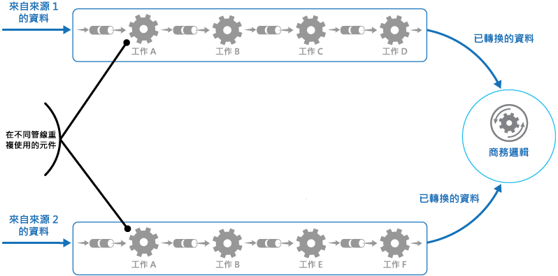

# <a name="pipes-and-filters-pattern"></a><span data-ttu-id="902dc-104">管道與篩選器模式</span><span class="sxs-lookup"><span data-stu-id="902dc-104">Pipes and Filters pattern</span></span>

[!INCLUDE [header](../_includes/header.md)]

<span data-ttu-id="902dc-105">將執行複雜處理程序的工作，分解成一系列可重複使用的個別元素。</span><span class="sxs-lookup"><span data-stu-id="902dc-105">Decompose a task that performs complex processing into a series of separate elements that can be reused.</span></span> <span data-ttu-id="902dc-106">這樣可以藉由讓執行處理的工作元素個別部署和調整，來改善效能、延展性及重複使用性。</span><span class="sxs-lookup"><span data-stu-id="902dc-106">This can improve performance, scalability, and reusability by allowing task elements that perform the processing to be deployed and scaled independently.</span></span>

## <a name="context-and-problem"></a><span data-ttu-id="902dc-107">內容和問題</span><span class="sxs-lookup"><span data-stu-id="902dc-107">Context and problem</span></span>

<span data-ttu-id="902dc-108">應用程式可能需要在其處理的資訊上，執行具有不同複雜度的各種工作。</span><span class="sxs-lookup"><span data-stu-id="902dc-108">An application is required to perform a variety of tasks of varying complexity on the information that it processes.</span></span> <span data-ttu-id="902dc-109">有一項實作應用程式簡單但具彈性的方法，此方法為將這項處理序作為整合模組執行。</span><span class="sxs-lookup"><span data-stu-id="902dc-109">A straightforward but inflexible approach to implementing an application is to perform this processing as a monolithic module.</span></span> <span data-ttu-id="902dc-110">不過，這種方法可能會降低重構程式碼、最佳化它，或在應用程式的其他位置需要相同處理程序的部分時，重複使用它的機會。</span><span class="sxs-lookup"><span data-stu-id="902dc-110">However, this approach is likely to reduce the opportunities for refactoring the code, optimizing it, or reusing it if parts of the same processing are required elsewhere within the application.</span></span>

<span data-ttu-id="902dc-111">此圖說明使用整合型方法處理資料的問題。</span><span class="sxs-lookup"><span data-stu-id="902dc-111">The figure illustrates the issues with processing data using the monolithic approach.</span></span> <span data-ttu-id="902dc-112">應用程式會從兩個來源接收及處理資料。</span><span class="sxs-lookup"><span data-stu-id="902dc-112">An application receives and processes data from two sources.</span></span> <span data-ttu-id="902dc-113">每個來源的資料是由執行一系列工作的個別模組處理以轉換此資料，再將結果傳遞至應用程式的商務邏輯。</span><span class="sxs-lookup"><span data-stu-id="902dc-113">The data from each source is processed by a separate module that performs a series of tasks to transform this data, before passing the result to the business logic of the application.</span></span>


<span data-ttu-id="902dc-115">整合型模組執行的某些工作在功能上十分相似，但是模組已個別設計。</span><span class="sxs-lookup"><span data-stu-id="902dc-115">Some of the tasks that the monolithic modules perform are functionally very similar, but the modules have been designed separately.</span></span> <span data-ttu-id="902dc-116">實作工作的程式碼在模組中會緊密結合，開發時稍微或完全沒有考量重複使用或延展性。</span><span class="sxs-lookup"><span data-stu-id="902dc-116">The code that implements the tasks is closely coupled in a module, and has been developed with little or no thought given to reuse or scalability.</span></span>

<span data-ttu-id="902dc-117">不過，每個模組執行的處理工作，或每個工作的部署需求，會隨著商務需求更新而變更。</span><span class="sxs-lookup"><span data-stu-id="902dc-117">However, the processing tasks performed by each module, or the deployment requirements for each task, could change as business requirements are updated.</span></span> <span data-ttu-id="902dc-118">某些工作可能是計算密集型，而且可以從在功能強大的硬體上執行而獲益，其他工作則可能不需要如此昂貴的資源。</span><span class="sxs-lookup"><span data-stu-id="902dc-118">Some tasks might be compute intensive and could benefit from running on powerful hardware, while others might not require such expensive resources.</span></span> <span data-ttu-id="902dc-119">此外，未來可能需要其他處理程序，或者處理執行之工作的順序可能會變更。</span><span class="sxs-lookup"><span data-stu-id="902dc-119">Also, additional processing might be required in the future, or the order in which the tasks performed by the processing could change.</span></span> <span data-ttu-id="902dc-120">解決方案需要能夠解決這些問題，而且增加程式碼重複使用的可能性。</span><span class="sxs-lookup"><span data-stu-id="902dc-120">A solution is required that addresses these issues, and increases the possibilities for code reuse.</span></span>

## <a name="solution"></a><span data-ttu-id="902dc-121">解決方法</span><span class="sxs-lookup"><span data-stu-id="902dc-121">Solution</span></span>

<span data-ttu-id="902dc-122">將每個串流所需的處理程序細分為一組個別元件 (或篩選器)，各個執行單一工作。</span><span class="sxs-lookup"><span data-stu-id="902dc-122">Break down the processing required for each stream into a set of separate components (or filters), each performing a single task.</span></span> <span data-ttu-id="902dc-123">藉由標準化每個元件接收和傳送之資料的格式，這些篩選器可以一起合併到管道中。</span><span class="sxs-lookup"><span data-stu-id="902dc-123">By standardizing the format of the data that each component receives and sends, these filters can be combined together into a pipeline.</span></span> <span data-ttu-id="902dc-124">這有助於避免重複的程式碼，並且在處理需求變更時，輕鬆地移除、取代或整合其他元件。</span><span class="sxs-lookup"><span data-stu-id="902dc-124">This helps to avoid duplicating code, and makes it easy to remove, replace, or integrate additional components if the processing requirements change.</span></span> <span data-ttu-id="902dc-125">下圖顯示使用管道和篩選器實作的解決方案。</span><span class="sxs-lookup"><span data-stu-id="902dc-125">The next figure shows a solution implemented using pipes and filters.</span></span>




<span data-ttu-id="902dc-127">處理單一要求所需的時間取決於管道中最慢篩選器的速度。</span><span class="sxs-lookup"><span data-stu-id="902dc-127">The time it takes to process a single request depends on the speed of the slowest filter in the pipeline.</span></span> <span data-ttu-id="902dc-128">一或多個篩選器可能是瓶頸，特別是當特定資料來源的串流中出現大量要求時。</span><span class="sxs-lookup"><span data-stu-id="902dc-128">One or more filters could be a bottleneck, especially if a large number of requests appear in a stream from a particular data source.</span></span> <span data-ttu-id="902dc-129">管道結構的主要優點是，它會提供機會來平行執行緩慢篩選器的執行個體，讓系統分散負載並改善輸送量。</span><span class="sxs-lookup"><span data-stu-id="902dc-129">A key advantage of the pipeline structure is that it provides opportunities for running parallel instances of slow filters, enabling the system to spread the load and improve throughput.</span></span>

<span data-ttu-id="902dc-130">構成管道的篩選器可以在不同的機器上執行，讓它們能夠獨立調整並且利用許多雲端環境都會提供的彈性。</span><span class="sxs-lookup"><span data-stu-id="902dc-130">The filters that make up a pipeline can run on different machines, enabling them to be scaled independently and take advantage of the elasticity that many cloud environments provide.</span></span> <span data-ttu-id="902dc-131">計算密集型篩選器可以在高效能硬體上執行，而要求較少的其他篩選器可以裝載在成本較低的商用硬體上。</span><span class="sxs-lookup"><span data-stu-id="902dc-131">A filter that is computationally intensive can run on high performance hardware, while other less demanding filters can be hosted on less expensive commodity hardware.</span></span> <span data-ttu-id="902dc-132">篩選器甚至不需要位於相同資料中心或地理位置，讓管線中的每個元素可以在接近其查詢資源的環境中執行。</span><span class="sxs-lookup"><span data-stu-id="902dc-132">The filters don't even have to be in the same data center or geographical location, which allows each element in a pipeline to run in an environment that is close to the resources it requires.</span></span>  <span data-ttu-id="902dc-133">下一張圖表顯示套用至來源 1 資料之管線的範例。</span><span class="sxs-lookup"><span data-stu-id="902dc-133">The next figure shows an example applied to the pipeline for the data from Source 1.</span></span>


<span data-ttu-id="902dc-135">如果篩選器的輸入和輸出結構化為串流，可能可以平行執行每個篩選器的處理。</span><span class="sxs-lookup"><span data-stu-id="902dc-135">If the input and output of a filter are structured as a stream, it's possible to perform the processing for each filter in parallel.</span></span> <span data-ttu-id="902dc-136">管線中的第一個篩選器可以啟動其工作並且輸出其結果，在第一個篩選器完成其工作之前，會直接傳遞給順序的下一個篩選器。</span><span class="sxs-lookup"><span data-stu-id="902dc-136">The first filter in the pipeline can start its work and output its results, which are passed directly on to the next filter in the sequence before the first filter has completed its work.</span></span>

<span data-ttu-id="902dc-137">另一個優點是此模型可以提供的復原。</span><span class="sxs-lookup"><span data-stu-id="902dc-137">Another benefit is the resiliency that this model can provide.</span></span> <span data-ttu-id="902dc-138">如果篩選器失敗，或者它執行所在的機器再也無法使用，管線可以重新排程執行篩選器的工作，並且將此工作導向至元件的另一個執行個體。</span><span class="sxs-lookup"><span data-stu-id="902dc-138">If a filter fails or the machine it's running on is no longer available, the pipeline can reschedule the work that the filter was performing and direct this work to another instance of the component.</span></span> <span data-ttu-id="902dc-139">單一篩選器失敗不一定會導致整個管線失敗。</span><span class="sxs-lookup"><span data-stu-id="902dc-139">Failure of a single filter doesn't necessarily result in failure of the entire pipeline.</span></span>

<span data-ttu-id="902dc-140">搭配[補償交易模式](compensating-transaction.md)使用管道和篩選器模式，是實作分散式交易的另一個方法。</span><span class="sxs-lookup"><span data-stu-id="902dc-140">Using the Pipes and Filters pattern in conjunction with the [Compensating Transaction pattern](compensating-transaction.md) is an alternative approach to implementing distributed transactions.</span></span> <span data-ttu-id="902dc-141">分散式交易可以細分成個別、可補償工作，每個工作都可以藉由使用會實作補償交易模式的篩選器來實作。</span><span class="sxs-lookup"><span data-stu-id="902dc-141">A distributed transaction can be broken down into separate, compensable tasks, each of which can be implemented by using a filter that also implements the Compensating Transaction pattern.</span></span> <span data-ttu-id="902dc-142">管線中的篩選器可以實作為個別裝載工作，與它們維護的資料緊密執行。</span><span class="sxs-lookup"><span data-stu-id="902dc-142">The filters in a pipeline can be implemented as separate hosted tasks running close to the data that they maintain.</span></span>

## <a name="issues-and-considerations"></a><span data-ttu-id="902dc-143">問題和考量</span><span class="sxs-lookup"><span data-stu-id="902dc-143">Issues and considerations</span></span>

<span data-ttu-id="902dc-144">當您在決定如何實作此模式時，應考慮下列幾點：</span><span class="sxs-lookup"><span data-stu-id="902dc-144">You should consider the following points when deciding how to implement this pattern:</span></span>
- <span data-ttu-id="902dc-145">**複雜度**。</span><span class="sxs-lookup"><span data-stu-id="902dc-145">**Complexity**.</span></span> <span data-ttu-id="902dc-146">此模式提供的增強彈性也會帶來複雜性，特別是當管線中的篩選器分散到不同伺服器時。</span><span class="sxs-lookup"><span data-stu-id="902dc-146">The increased flexibility that this pattern provides can also introduce complexity, especially if the filters in a pipeline are distributed across different servers.</span></span>

- <span data-ttu-id="902dc-147">**可靠性**。</span><span class="sxs-lookup"><span data-stu-id="902dc-147">**Reliability**.</span></span> <span data-ttu-id="902dc-148">使用基礎結構，確保管線中篩選器之間流動的資料不會遺失。</span><span class="sxs-lookup"><span data-stu-id="902dc-148">Use an infrastructure that ensures that data flowing between filters in a pipeline won't be lost.</span></span>

- <span data-ttu-id="902dc-149">**等冪**。</span><span class="sxs-lookup"><span data-stu-id="902dc-149">**Idempotency**.</span></span> <span data-ttu-id="902dc-150">如果管線中的篩選器在收到訊息之後失敗，且工作重新排程至篩選器的另一個執行個體，部分工作可能已經完成。</span><span class="sxs-lookup"><span data-stu-id="902dc-150">If a filter in a pipeline fails after receiving a message and the work is rescheduled to another instance of the filter, part of the work might have already been completed.</span></span> <span data-ttu-id="902dc-151">如果此工作會更新全域狀態 (例如儲存在資料庫中的資訊) 的某些層面，就無法重複相同的更新。</span><span class="sxs-lookup"><span data-stu-id="902dc-151">If this work updates some aspect of the global state (such as information stored in a database), the same update could be repeated.</span></span> <span data-ttu-id="902dc-152">如果篩選器在將其結果張貼至管線中的下一個篩選器之後，但是在表示成功完成其工作之前失敗，可能會發生類似問題。</span><span class="sxs-lookup"><span data-stu-id="902dc-152">A similar issue might occur if a filter fails after posting its results to the next filter in the pipeline, but before indicating that it's completed its work successfully.</span></span> <span data-ttu-id="902dc-153">在這些情況下，相同工作會由篩選器的另一個執行個體重複，導致相同結果張貼兩次。</span><span class="sxs-lookup"><span data-stu-id="902dc-153">In these cases, the same work could be repeated by another instance of the filter, causing the same results to be posted twice.</span></span> <span data-ttu-id="902dc-154">這樣可能會導致管線中的後續篩選器處理相同資料兩次。</span><span class="sxs-lookup"><span data-stu-id="902dc-154">This could result in subsequent filters in the pipeline processing the same data twice.</span></span> <span data-ttu-id="902dc-155">因此管線中的篩選器應該設計為等冪。</span><span class="sxs-lookup"><span data-stu-id="902dc-155">Therefore filters in a pipeline should be designed to be idempotent.</span></span> <span data-ttu-id="902dc-156">如需詳細資訊，請參閱 Jonathan Oliver 部落格上的[等冪模式](https://blog.jonathanoliver.com/idempotency-patterns/)。</span><span class="sxs-lookup"><span data-stu-id="902dc-156">For more information see [Idempotency Patterns](https://blog.jonathanoliver.com/idempotency-patterns/) on Jonathan Oliver’s blog.</span></span>

- <span data-ttu-id="902dc-157">**重複訊息**。</span><span class="sxs-lookup"><span data-stu-id="902dc-157">**Repeated messages**.</span></span> <span data-ttu-id="902dc-158">如果管線中的篩選器在將訊息張貼至管線的下一個階段之後失敗，篩選器的另一個執行個體可能會執行，它會將相同訊息的複本張貼至管線。</span><span class="sxs-lookup"><span data-stu-id="902dc-158">If a filter in a pipeline fails after posting a message to the next stage of the pipeline, another instance of the filter might be run, and it'll post a copy of the same message to the pipeline.</span></span> <span data-ttu-id="902dc-159">這可能會導致相同訊息的兩個執行個體傳遞至下一個篩選器。</span><span class="sxs-lookup"><span data-stu-id="902dc-159">This could cause two instances of the same message to be passed to the next filter.</span></span> <span data-ttu-id="902dc-160">若要避免這個問題，管線應該偵測並排除重複的訊息。</span><span class="sxs-lookup"><span data-stu-id="902dc-160">To avoid this, the pipeline should detect and eliminate duplicate messages.</span></span>

    >  <span data-ttu-id="902dc-161">如果您藉由使用訊息佇列 (例如 Microsoft Azure 服務匯流排佇列) 來實作管線，訊息佇列基礎結構可能會提供自動重複訊息偵測和移除。</span><span class="sxs-lookup"><span data-stu-id="902dc-161">If you're implementing the pipeline by using message queues (such as Microsoft Azure Service Bus queues), the message queuing infrastructure might provide automatic duplicate message detection and removal.</span></span>

- <span data-ttu-id="902dc-162">**內容和狀態**。</span><span class="sxs-lookup"><span data-stu-id="902dc-162">**Context and state**.</span></span> <span data-ttu-id="902dc-163">在管線中，每個篩選基本上是在隔離狀態執行，不應該假設它的叫用方式。</span><span class="sxs-lookup"><span data-stu-id="902dc-163">In a pipeline, each filter essentially runs in isolation and shouldn't make any assumptions about how it was invoked.</span></span> <span data-ttu-id="902dc-164">這表示每個篩選器應該提供足夠內容，以執行其工作。</span><span class="sxs-lookup"><span data-stu-id="902dc-164">This means that each filter should be provided with sufficient context to perform its work.</span></span> <span data-ttu-id="902dc-165">此內容可以包含大量狀態資訊。</span><span class="sxs-lookup"><span data-stu-id="902dc-165">This context could include a large amount of state information.</span></span>

## <a name="when-to-use-this-pattern"></a><span data-ttu-id="902dc-166">使用此模式的時機</span><span class="sxs-lookup"><span data-stu-id="902dc-166">When to use this pattern</span></span>

<span data-ttu-id="902dc-167">使用此模式的時機包括：</span><span class="sxs-lookup"><span data-stu-id="902dc-167">Use this pattern when:</span></span>
- <span data-ttu-id="902dc-168">應用程式所需的處理可以輕易地細分為一組獨立的步驟。</span><span class="sxs-lookup"><span data-stu-id="902dc-168">The processing required by an application can easily be broken down into a set of independent steps.</span></span>

- <span data-ttu-id="902dc-169">應用程式所執行的處理步驟有不同的延展性需求。</span><span class="sxs-lookup"><span data-stu-id="902dc-169">The processing steps performed by an application have different scalability requirements.</span></span>

    >  <span data-ttu-id="902dc-170">可以在相同處理中將應該調整的篩選器群組在一起。</span><span class="sxs-lookup"><span data-stu-id="902dc-170">It's possible to group filters that should scale together in the same process.</span></span> <span data-ttu-id="902dc-171">如需詳細資訊，請參閱[計算資源彙總模式](compute-resource-consolidation.md)。</span><span class="sxs-lookup"><span data-stu-id="902dc-171">For more information, see the [Compute Resource Consolidation pattern](compute-resource-consolidation.md).</span></span>

- <span data-ttu-id="902dc-172">需要彈性才能重新排序應用程式執行的處理步驟，或者新增和移除步驟的功能。</span><span class="sxs-lookup"><span data-stu-id="902dc-172">Flexibility is required to allow reordering of the processing steps performed by an application, or the capability to add and remove steps.</span></span>

- <span data-ttu-id="902dc-173">系統可以受益於將步驟的處理程序分配給不同的伺服器。</span><span class="sxs-lookup"><span data-stu-id="902dc-173">The system can benefit from distributing the processing for steps across different servers.</span></span>

- <span data-ttu-id="902dc-174">可靠的解決方案是在處理資料的同時，將步驟中失敗的影響降至最低。</span><span class="sxs-lookup"><span data-stu-id="902dc-174">A reliable solution is required that minimizes the effects of failure in a step while data is being processed.</span></span>

<span data-ttu-id="902dc-175">此模式可能不適合下列時機︰</span><span class="sxs-lookup"><span data-stu-id="902dc-175">This pattern might not be useful when:</span></span>
- <span data-ttu-id="902dc-176">應用程式執行的處理步驟不是獨立的，或者必須在相同交易中一起執行。</span><span class="sxs-lookup"><span data-stu-id="902dc-176">The processing steps performed by an application aren't independent, or they have to be performed together as part of the same transaction.</span></span>

- <span data-ttu-id="902dc-177">步驟所需之內容或狀態資訊的數量，會讓這個方法的效率不佳。</span><span class="sxs-lookup"><span data-stu-id="902dc-177">The amount of context or state information required by a step makes this approach inefficient.</span></span> <span data-ttu-id="902dc-178">可能可以改為將狀態資訊保存到資料庫，但是如果資料庫上的額外負載會造成過多的爭用，則不要使用這個策略。</span><span class="sxs-lookup"><span data-stu-id="902dc-178">It might be possible to persist state information to a database instead, but don't use this strategy if the additional load on the database causes excessive contention.</span></span>

## <a name="example"></a><span data-ttu-id="902dc-179">範例</span><span class="sxs-lookup"><span data-stu-id="902dc-179">Example</span></span>

<span data-ttu-id="902dc-180">您可以使用一系列訊息佇列，提供實作管線所需的基礎結構。</span><span class="sxs-lookup"><span data-stu-id="902dc-180">You can use a sequence of message queues to provide the infrastructure required to implement a pipeline.</span></span> <span data-ttu-id="902dc-181">初始訊息佇列會接收未處理的訊息。</span><span class="sxs-lookup"><span data-stu-id="902dc-181">An initial message queue receives unprocessed messages.</span></span> <span data-ttu-id="902dc-182">實作為篩選器工作以接聽此佇列上訊息的元件，會執行其工作，然後將轉換的訊息張貼至序列中的下一個佇列。</span><span class="sxs-lookup"><span data-stu-id="902dc-182">A component implemented as a filter task listens for a message on this queue, performs its work, and then posts the transformed message to the next queue in the sequence.</span></span> <span data-ttu-id="902dc-183">另一個篩選器工作可以接聽此佇列上的訊息、加以處理，將結果張貼至另一個佇列，依此類推，直到完整轉換的資料出現在佇列中的最後一個訊息。</span><span class="sxs-lookup"><span data-stu-id="902dc-183">Another filter task can listen for messages on this queue, process them, post the results to another queue, and so on until the fully transformed data appears in the final message in the queue.</span></span> <span data-ttu-id="902dc-184">下圖說明使用訊息佇列來實作管線。</span><span class="sxs-lookup"><span data-stu-id="902dc-184">The next figure illustrates implementing a pipeline using message queues.</span></span>


<span data-ttu-id="902dc-186">如果您在 Azure 上建置解決方案，您可以使用服務匯流排佇列以提供可靠且可調整的佇列機制。</span><span class="sxs-lookup"><span data-stu-id="902dc-186">If you're building a solution on Azure you can use Service Bus queues to provide a reliable and scalable queuing mechanism.</span></span> <span data-ttu-id="902dc-187">`ServiceBusPipeFilter` 類別在下方以 C# 表示，示範如何實作篩選器，從佇列接收輸入訊息、處理這些訊息，然後將結果張貼至另一個佇列。</span><span class="sxs-lookup"><span data-stu-id="902dc-187">The `ServiceBusPipeFilter` class shown below in C# demonstrates how you can implement a filter that receives input messages from a queue, processes these messages, and posts the results to another queue.</span></span>

>  <span data-ttu-id="902dc-188">`ServiceBusPipeFilter` 類別是在可從 [GitHub](https://github.com/mspnp/cloud-design-patterns/tree/master/pipes-and-filters) 取得的 PipesAndFilters.Shared 專案中定義。</span><span class="sxs-lookup"><span data-stu-id="902dc-188">The `ServiceBusPipeFilter` class is defined in the PipesAndFilters.Shared project available from [GitHub](https://github.com/mspnp/cloud-design-patterns/tree/master/pipes-and-filters).</span></span>

```csharp
public class ServiceBusPipeFilter
{
  ...
  private readonly string inQueuePath;
  private readonly string outQueuePath;
  ...
  private QueueClient inQueue;
  private QueueClient outQueue;
  ...

  public ServiceBusPipeFilter(..., string inQueuePath, string outQueuePath = null)
  {
     ...
     this.inQueuePath = inQueuePath;
     this.outQueuePath = outQueuePath;
  }

  public void Start()
  {
    ...
    // Create the outbound filter queue if it doesn't exist.
    ...
    this.outQueue = QueueClient.CreateFromConnectionString(...);

    ...
    // Create the inbound and outbound queue clients.
    this.inQueue = QueueClient.CreateFromConnectionString(...);
  }

  public void OnPipeFilterMessageAsync(
    Func<BrokeredMessage, Task<BrokeredMessage>> asyncFilterTask, ...)
  {
    ...

    this.inQueue.OnMessageAsync(
      async (msg) =>
    {
      ...
      // Process the filter and send the output to the
      // next queue in the pipeline.
      var outMessage = await asyncFilterTask(msg);

      // Send the message from the filter processor
      // to the next queue in the pipeline.
      if (outQueue != null)
      {
        await outQueue.SendAsync(outMessage);
      }

      // Note: There's a chance that the same message could be sent twice
      // or that a message gets processed by an upstream or downstream
      // filter at the same time.
      // This would happen in a situation where processing of a message was
      // completed, it was sent to the next pipe/queue, and then failed
      // to complete when using the PeekLock method.
      // Idempotent message processing and concurrency should be considered
      // in a real-world implementation.
    },
    options);
  }

  public async Task Close(TimeSpan timespan)
  {
    // Pause the processing threads.
    this.pauseProcessingEvent.Reset();

    // There's no clean approach for waiting for the threads to complete
    // the processing. This example simply stops any new processing, waits
    // for the existing thread to complete, then closes the message pump
    // and finally returns.
    Thread.Sleep(timespan);

    this.inQueue.Close();
    ...
  }

  ...
}
```

<span data-ttu-id="902dc-189">`ServiceBusPipeFilter` 類別中的 `Start` 方法會連線到一組輸入和輸出佇列，而 `Close` 方法則會與輸入佇列中斷連線。</span><span class="sxs-lookup"><span data-stu-id="902dc-189">The `Start` method in the `ServiceBusPipeFilter` class connects to a pair of input and output queues, and the `Close` method disconnects from the input queue.</span></span> <span data-ttu-id="902dc-190">`OnPipeFilterMessageAsync` 方法會執行訊息的實際處理，這個方法的 `asyncFilterTask` 參數會指定要執行的處理。</span><span class="sxs-lookup"><span data-stu-id="902dc-190">The `OnPipeFilterMessageAsync` method performs the actual processing of messages, the `asyncFilterTask` parameter to this method specifies the processing to be performed.</span></span> <span data-ttu-id="902dc-191">`OnPipeFilterMessageAsync` 方法會等候輸入佇列上的內送郵件，執行 `asyncFilterTask` 參數在每次訊息抵達時指定的程式碼，然後將結果張貼到輸出佇列。</span><span class="sxs-lookup"><span data-stu-id="902dc-191">The `OnPipeFilterMessageAsync` method waits for incoming messages on the input queue, runs the code specified by the `asyncFilterTask` parameter over each message as it arrives, and posts the results to the output queue.</span></span> <span data-ttu-id="902dc-192">佇列本身是由建構函式指定。</span><span class="sxs-lookup"><span data-stu-id="902dc-192">The queues themselves are specified by the constructor.</span></span>

<span data-ttu-id="902dc-193">範例解決方案會在一組背景工作角色中實作篩選器。</span><span class="sxs-lookup"><span data-stu-id="902dc-193">The sample solution implements filters in a set of worker roles.</span></span> <span data-ttu-id="902dc-194">每個背景工作角色可以獨立調整，根據其執行之商務處理的複雜性，或處理所需的資源。</span><span class="sxs-lookup"><span data-stu-id="902dc-194">Each worker role can be scaled independently, depending on the complexity of the business processing that it performs or the resources required for processing.</span></span> <span data-ttu-id="902dc-195">此外，每個背景工作角色的多個執行個體可以平行執行以改善輸送量。</span><span class="sxs-lookup"><span data-stu-id="902dc-195">Additionally, multiple instances of each worker role can be run in parallel to improve throughput.</span></span>

<span data-ttu-id="902dc-196">下列程式碼會示範名為 `PipeFilterARoleEntry` 的 Azure 背景工作角色，在範例解決方案中的 PipeFilterA 專案中定義。</span><span class="sxs-lookup"><span data-stu-id="902dc-196">The following code shows an Azure worker role named `PipeFilterARoleEntry`, defined in the PipeFilterA project in the sample solution.</span></span>

```csharp
public class PipeFilterARoleEntry : RoleEntryPoint
{
  ...
  private ServiceBusPipeFilter pipeFilterA;

  public override bool OnStart()
  {
    ...
    this.pipeFilterA = new ServiceBusPipeFilter(
      ...,
      Constants.QueueAPath,
      Constants.QueueBPath);

    this.pipeFilterA.Start();
    ...
  }

  public override void Run()
  {
    this.pipeFilterA.OnPipeFilterMessageAsync(async (msg) =>
    {
      // Clone the message and update it.
      // Properties set by the broker (Deliver count, enqueue time, ...)
      // aren't cloned and must be copied over if required.
      var newMsg = msg.Clone();

      await Task.Delay(500); // DOING WORK

      Trace.TraceInformation("Filter A processed message:{0} at {1}",
        msg.MessageId, DateTime.UtcNow);

      newMsg.Properties.Add(Constants.FilterAMessageKey, "Complete");

      return newMsg;
    });

    ...
  }

  ...
}
```

<span data-ttu-id="902dc-197">這個角色包含 `ServiceBusPipeFilter` 物件。</span><span class="sxs-lookup"><span data-stu-id="902dc-197">This role contains a `ServiceBusPipeFilter` object.</span></span> <span data-ttu-id="902dc-198">角色中的 `OnStart` 方法會連線到佇列，以接收輸入訊息和張貼輸出訊息 (佇列的名稱是在 `Constants` 類別中定義)。</span><span class="sxs-lookup"><span data-stu-id="902dc-198">The `OnStart` method in the role connects to the queues for receiving input messages and posting output messages (the names of the queues are defined in the `Constants` class).</span></span> <span data-ttu-id="902dc-199">`Run` 方法會叫用 `OnPipeFilterMessagesAsync` 方法，以在收到的每個訊息上執行一些處理 (在此範例中，處理是由等候一段簡短時間來模擬)。</span><span class="sxs-lookup"><span data-stu-id="902dc-199">The `Run` method invokes the `OnPipeFilterMessagesAsync` method to perform some processing on each message that's received (in this example, the processing is simulated by waiting for a short period of time).</span></span> <span data-ttu-id="902dc-200">當處理完成時，會建構包含結果的新訊息 (在此情況下，輸入訊息具有新增的自訂屬性)，然後此訊息會張貼至輸出佇列。</span><span class="sxs-lookup"><span data-stu-id="902dc-200">When processing is complete, a new message is constructed containing the results (in this case, the input message has a custom property added), and this message is posted to the output queue.</span></span>

<span data-ttu-id="902dc-201">範例程式碼在 PipeFilterB 專案中包含名為 `PipeFilterBRoleEntry` 的另一個背景工作角色。</span><span class="sxs-lookup"><span data-stu-id="902dc-201">The sample code contains another worker role named `PipeFilterBRoleEntry` in the PipeFilterB project.</span></span> <span data-ttu-id="902dc-202">這個角色類似於 `PipeFilterARoleEntry`，不同之處在於它會在 `Run` 方法中執行不同的處理。</span><span class="sxs-lookup"><span data-stu-id="902dc-202">This role is similar to `PipeFilterARoleEntry` except that it performs different processing in the `Run` method.</span></span> <span data-ttu-id="902dc-203">在範例解決方案中，這兩個角色合併以建構管線，`PipeFilterARoleEntry` 角色的輸出佇列是 `PipeFilterBRoleEntry` 角色的輸入佇列。</span><span class="sxs-lookup"><span data-stu-id="902dc-203">In the example solution, these two roles are combined to construct a pipeline, the output queue for the `PipeFilterARoleEntry` role is the input queue for the `PipeFilterBRoleEntry` role.</span></span>

<span data-ttu-id="902dc-204">範例解決方案也會提供兩個額外的角色，名為 `InitialSenderRoleEntry` (在 InitialSender 專案中) 和 `FinalReceiverRoleEntry` (在 FinalReceiver 專案中)。</span><span class="sxs-lookup"><span data-stu-id="902dc-204">The sample solution also provides two additional roles named `InitialSenderRoleEntry` (in the InitialSender project) and `FinalReceiverRoleEntry` (in the FinalReceiver project).</span></span> <span data-ttu-id="902dc-205">`InitialSenderRoleEntry` 角色在管線中提供初始訊息。</span><span class="sxs-lookup"><span data-stu-id="902dc-205">The `InitialSenderRoleEntry` role provides the initial message in the pipeline.</span></span> <span data-ttu-id="902dc-206">`OnStart` 方法連線到單一佇列，`Run` 方法將方法張貼到此佇列。</span><span class="sxs-lookup"><span data-stu-id="902dc-206">The `OnStart` method connects to a single queue and the `Run` method posts a method to this queue.</span></span> <span data-ttu-id="902dc-207">此佇列是 `PipeFilterARoleEntry` 角色所使用的輸入佇列，因此將訊息張貼給它會導致訊息由 `PipeFilterARoleEntry` 角色接收及處理。</span><span class="sxs-lookup"><span data-stu-id="902dc-207">This queue is the input queue used by the `PipeFilterARoleEntry` role, so posting a message to it causes the message to be received and processed by the `PipeFilterARoleEntry` role.</span></span> <span data-ttu-id="902dc-208">然後已處理的訊息會通過 `PipeFilterBRoleEntry` 角色。</span><span class="sxs-lookup"><span data-stu-id="902dc-208">The processed message then passes through the `PipeFilterBRoleEntry` role.</span></span>

<span data-ttu-id="902dc-209">`FinalReceiveRoleEntry` 角色的輸入佇列是 `PipeFilterBRoleEntry` 角色的輸出佇列。</span><span class="sxs-lookup"><span data-stu-id="902dc-209">The input queue for the `FinalReceiveRoleEntry` role is the output queue for the `PipeFilterBRoleEntry` role.</span></span> <span data-ttu-id="902dc-210">`FinalReceiveRoleEntry` 角色中的 `Run` 方法，如下所示，會接收訊息及執行某些最終處理。</span><span class="sxs-lookup"><span data-stu-id="902dc-210">The `Run` method in the `FinalReceiveRoleEntry` role, shown below, receives the message and performs some final processing.</span></span> <span data-ttu-id="902dc-211">然後它會將管線中篩選器新增的自訂屬性值寫入至追蹤輸出。</span><span class="sxs-lookup"><span data-stu-id="902dc-211">Then it writes the values of the custom properties added by the filters in the pipeline to the trace output.</span></span>

```csharp
public class FinalReceiverRoleEntry : RoleEntryPoint
{
  ...
  // Final queue/pipe in the pipeline to process data from.
  private ServiceBusPipeFilter queueFinal;

  public override bool OnStart()
  {
    ...
    // Set up the queue.
    this.queueFinal = new ServiceBusPipeFilter(...,Constants.QueueFinalPath);
    this.queueFinal.Start();
    ...
  }

  public override void Run()
  {
    this.queueFinal.OnPipeFilterMessageAsync(
      async (msg) =>
      {
        await Task.Delay(500); // DOING WORK

        // The pipeline message was received.
        Trace.TraceInformation(
          "Pipeline Message Complete - FilterA:{0} FilterB:{1}",
          msg.Properties[Constants.FilterAMessageKey],
          msg.Properties[Constants.FilterBMessageKey]);

        return null;
      });
    ...
  }

  ...
}
```

## <a name="related-patterns-and-guidance"></a><span data-ttu-id="902dc-212">相關的模式和指導方針</span><span class="sxs-lookup"><span data-stu-id="902dc-212">Related patterns and guidance</span></span>

<span data-ttu-id="902dc-213">實作此模式時，下列模式和指導方針可能也相關：</span><span class="sxs-lookup"><span data-stu-id="902dc-213">The following patterns and guidance might also be relevant when implementing this pattern:</span></span>
- <span data-ttu-id="902dc-214">[GitHub](https://github.com/mspnp/cloud-design-patterns/tree/master/pipes-and-filters) 上有提供示範此模式的範例。</span><span class="sxs-lookup"><span data-stu-id="902dc-214">A sample that demonstrates this pattern is available on [GitHub](https://github.com/mspnp/cloud-design-patterns/tree/master/pipes-and-filters).</span></span>
- <span data-ttu-id="902dc-215">[競爭取用者模式](competing-consumers.md)。</span><span class="sxs-lookup"><span data-stu-id="902dc-215">[Competing Consumers pattern](competing-consumers.md).</span></span> <span data-ttu-id="902dc-216">管線可以包含一或多個篩選器的多個執行個體。</span><span class="sxs-lookup"><span data-stu-id="902dc-216">A pipeline can contain multiple instances of one or more filters.</span></span> <span data-ttu-id="902dc-217">這個方法對於執行緩慢篩選器的平行執行個體很有用，讓系統分散負載及改善輸送量。</span><span class="sxs-lookup"><span data-stu-id="902dc-217">This approach is useful for running parallel instances of slow filters, enabling the system to spread the load and improve throughput.</span></span> <span data-ttu-id="902dc-218">篩選器的每個執行個體會與其他執行個體爭用輸入，篩選器的兩個執行個體應該不能處理相同的資料。</span><span class="sxs-lookup"><span data-stu-id="902dc-218">Each instance of a filter will compete for input with the other instances, two instances of a filter shouldn't be able to process the same data.</span></span> <span data-ttu-id="902dc-219">提供這個方法的說明。</span><span class="sxs-lookup"><span data-stu-id="902dc-219">Provides an explanation of this approach.</span></span>
- <span data-ttu-id="902dc-220">[計算資源彙總模式](compute-resource-consolidation.md)。</span><span class="sxs-lookup"><span data-stu-id="902dc-220">[Compute Resource Consolidation pattern](compute-resource-consolidation.md).</span></span> <span data-ttu-id="902dc-221">可以在相同處理中將應該調整的篩選器群組在一起。</span><span class="sxs-lookup"><span data-stu-id="902dc-221">It might be possible to group filters that should scale together into the same process.</span></span> <span data-ttu-id="902dc-222">提供有關此策略之優點和權衡取捨的詳細資訊。</span><span class="sxs-lookup"><span data-stu-id="902dc-222">Provides more information about the benefits and tradeoffs of this strategy.</span></span>
- <span data-ttu-id="902dc-223">[補償交易模式](compensating-transaction.md)。</span><span class="sxs-lookup"><span data-stu-id="902dc-223">[Compensating Transaction pattern](compensating-transaction.md).</span></span> <span data-ttu-id="902dc-224">篩選器可以實作為可反轉的作業，或者具有補償作業的作業，在失敗時將狀態還原為先前版本。</span><span class="sxs-lookup"><span data-stu-id="902dc-224">A filter can be implemented as an operation that can be reversed, or that has a compensating operation that restores the state to a previous version in the event of a failure.</span></span> <span data-ttu-id="902dc-225">說明如何實作這個作業以維護或達到最終一致性。</span><span class="sxs-lookup"><span data-stu-id="902dc-225">Explains how this can be implemented to maintain or achieve eventual consistency.</span></span>
- <span data-ttu-id="902dc-226">Jonathan Oliver 部落格上的[等冪模式](https://blog.jonathanoliver.com/idempotency-patterns/)。</span><span class="sxs-lookup"><span data-stu-id="902dc-226">[Idempotency Patterns](https://blog.jonathanoliver.com/idempotency-patterns/) on Jonathan Oliver’s blog.</span></span>
