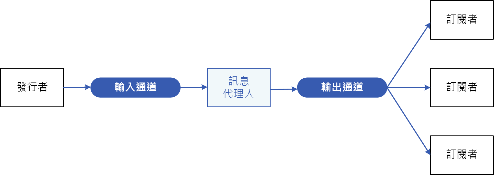
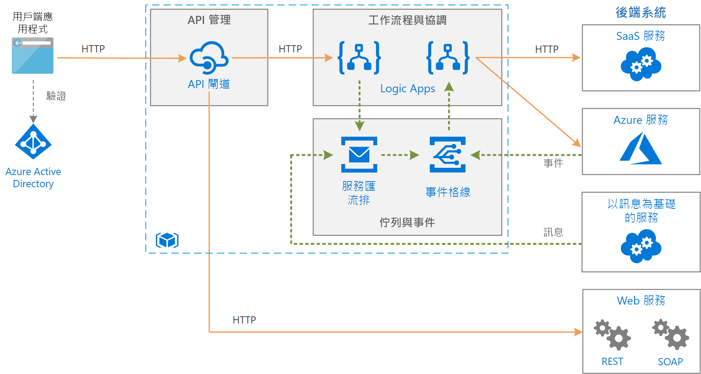

# 發行者-訂閱者模式

讓應用程式能夠非同步地向多個感興趣的取用者宣告事件，而不需要將傳送者與取用者結合。

**也稱為**：發佈/訂閱傳訊

## 內容和問題

在雲端式和分散式應用程式中，系統的元件常需要在發生事件時提供資訊給其他元件。

非同步傳訊是分離傳送者與取用者，並避免在傳送者等候回應時加以封鎖的有效方式。 不過，讓每個取用者使用專用訊息佇列的做法，並無法有效地擴充至許多取用者。 此外，某些取用者可能只對某部分的資訊感興趣。 傳送者如何將事件宣告給所有感興趣的取用者，而不需要知道他們的身分識別？

## 解決方法

導入非同步傳訊子系統，其中包括下列各項：

- 傳送者所使用的輸入傳訊通道。 傳送者可使用已知的訊息格式將事件封裝到訊息中，並透過輸入通道傳送這些訊息。 採用此模式的傳送者也稱為*發行者*。

  > [!NOTE]
  > *訊息*是資料的封包。 *事件*是一種訊息，可向其他元件通知有變更或動作發生的相關資訊。

- 每個取用者會有一個輸出傳訊通道。 取用者也稱為*訂閱者*。

- 將每則訊息從輸入通道複製到輸出通道，讓所有對該訊息感興趣的訂閱者取得訊息的機制。 這項作業通常由訊息代理程式或事件匯流排之類的媒介處理。

下列圖表顯示此模式的邏輯元件：

 
發佈/訂閱傳訊具有下列優點：

- 它可分離仍需要進行通訊的子系統。 子系統可以分開管理，而訊息即使在一或多個接收者離線時仍可受到適當管理。

- 它可增加延展性，並改善傳送者的回應能力。 傳送者可以將單一訊息快速傳送至輸入通道，然後返回其核心處理職責。 傳訊基礎結構負責確保訊息會傳遞給感興趣的訂閱者。

- 它可提升可靠性。 非同步傳訊可協助應用程式在增加的負載下仍繼續順暢地執行，並更有效地處理間歇性失敗。

- 它可支援延後或排程的處理。 訂閱者可等到離峰時間再收取訊息，或者，訊息可根據特定排程進行路由或處理。

- 它可讓使用不同平台、程式設計語言或通訊協定的系統輕易整合，並且可輕易整合內部部署系統與雲端中執行的應用程式。

- 它有助於執行整個企業的非同步工作流程。

- 它能夠提高可測試性。 在整體的整合測試策略之中，可同時監視通道以及檢查或記錄訊息。

- 它可區隔應用程式的關注點。 每個應用程式都可以專注於其核心功能，而由傳訊基礎結構負責處理可靠地將訊息路由至多個取用者所需的一切事務。 

## 問題和考量

當您決定如何實作此模式時，請考慮下列幾點：

- **現有技術。** 強烈建議您使用支援發佈-訂閱模型的可用傳訊產品和服務，而不要自行建置。 在 Azure 中，請考慮使用[服務匯流排](/azure/service-bus-messaging/)或[事件方格](/azure/event-grid/)。 其他可用於發佈/訂閱傳訊的技術包含 Redis、RabbitMQ 及 Apache Kafka。

- **訂閱處理。** 傳訊基礎結構必須提供取用者可用來訂閱或取消訂閱可用通道的機制。

- **安全性。** 對任何訊息通道的連線都必須受到安全性原則的限制，以防止未經授權的使用者或應用程式竊聽。

- **訊息子集。** 訂閱者通常只會對發行者所分送的某部分訊息感興趣。 傳訊服務通常可讓訂閱者依據下列條件縮小收到訊息集的範圍：

  - **主題。** 每個主題都有專用的輸出通道，而每個取用者可以訂閱所有相關的主題。
  - **內容篩選。** 訊息會根據每個訊息的內容受到檢查和進行分送。 每個訂閱者均可指定他感興趣的內容。

- **萬用字元訂閱者。** 請考慮允許訂閱者透過萬用字元訂閱多個主題。

- **雙向通訊。** 發佈-訂閱系統中的通道會被視為單向。 如果特定訂閱者都需要傳送通知或傳回狀態給發行者，請考慮使用[要求/回覆模式](http://www.enterpriseintegrationpatterns.com/patterns/messaging/RequestReply.html)。 此模式會使用一個通道將訊息傳送給訂閱者，並使用另一個回覆通道與發行者通訊。

- **訊息排序。** 取用者執行個體接收訊息的順序並不一定，而且不一定會反映訊息的建立順序。 設計系統時，請確保訊息處理為等冪方式，以避免對訊息處理順序有依賴性。

- **訊息優先順序。** 有些解決方案可能會需要以特定順序處理訊息。 [優先順序佇列模式](priority-queue.md)提供可確保特定訊息會在其他訊息之前傳遞的機制。

- **有害訊息。** 訊息格式不正確，或工作需要存取的資源無法使用，可能會導致服務執行個體失敗。 系統應避免讓這類訊息傳回至佇列。 系統應擷取這些訊息的詳細資料並儲存到其他位置，以視需要對它們進行分析。

- **重複訊息。** 相同的訊息可能會傳送多次。 例如，傳送者有可能在張貼訊息後作業失敗。 然後，傳送者的新執行個體可能會啟動並重複傳訊。 傳訊基礎結構應根據訊息識別碼實作重複訊息偵測和移除 (也稱為刪除重複訊息)，以提供「最多一次」的訊息傳遞。

- **訊息到期。** 訊息可能會有有限的存留期。 訊息若未在這段時間內處理，則可能不再具有相關性，而應予以捨棄。 傳送者可以在訊息的資料中指定到期時間。 接收者可以先檢查此資訊，再決定是否要執行與訊息相關聯的商務邏輯。

- **訊息排程。** 訊息可能會暫時禁止傳送，而在特定日期和時間之前不會進行處理。 接收者在此時間之前應該不會收到訊息。

## 使用此模式的時機

使用此模式的時機包括：

- 應用程式需要將訊息廣播給大量取用者。

- 應用程式需要與一或多個獨立開發的應用程式或服務通訊，且此類應用程式或服務可能使用不同的平台、程式設計語言和通訊協定。

- 應用程式可傳送訊息給取用者資訊，而不需要取用者提供即時回應。

- 要整合的系統依設計可支援其資料的最終一致性模型。

- 應用程式需要將資訊傳達給多個取用者，而這些取用者可能具有與傳送者不同的可用性需求或執行時間排程。

此模式可能不適合下列時機︰

- 應用程式只有少數取用者需要與產生端應用程式截然不同的資訊。

- 應用程式需要與取用者進行近乎即時的互動。

## 範例

下圖顯示使用服務匯流排來協調工作流程，並使用事件方格通知子系統有事件發生的企業整合架構。 如需詳細資訊，請參閱[使用訊息佇列和事件在 Azure 上的企業整合](../reference-architectures/enterprise-integration/queues-events.md)。

## 相關的模式和指導方針

下列是實作此模式時可能相關的模式和指導方針：

- [在傳遞訊息的 Azure 服務之間進行選擇](/azure/event-grid/compare-messaging-services)。

- [事件驅動架構樣式](../guide/architecture-styles/event-driven.md)是使用發佈/訂閱傳訊的架構樣式。

- [非同步傳訊入門](https://msdn.microsoft.com/library/dn589781.aspx)。 訊息佇列是非同步通訊機制。 如果取用者服務需要傳送回覆至應用程式，可能必須實作某種形式的回應訊息。 「非同步傳訊入門」提供如何使用訊息佇列實作要求/回覆訊息的資訊。

- [觀察者模式](https://en.wikipedia.org/wiki/Observer_pattern)。 發佈-訂閱模式透過非同步傳訊將來自觀察者的主題分離，以觀察者模式作為其建置基礎。

- [訊息代理程式模式](https://en.wikipedia.org/wiki/Message_broker)。 許多支援發佈-訂閱模式的傳訊子系統都會透過訊息代理程式進行實作。
