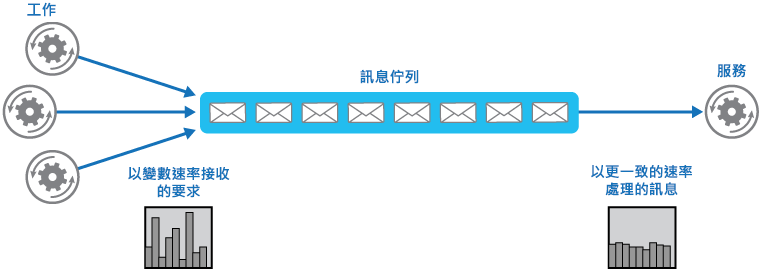
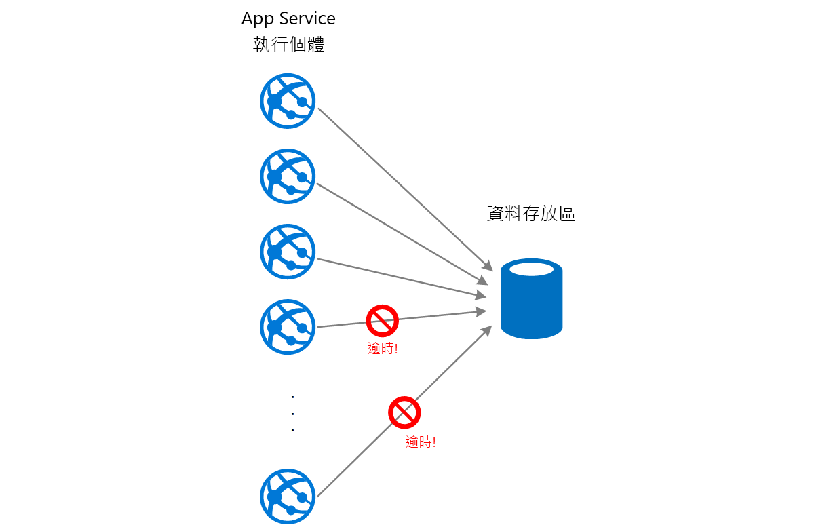
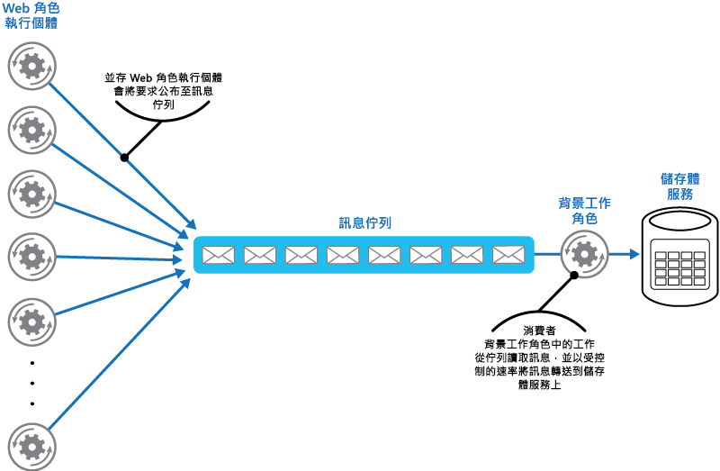

# 佇列型負載調節模式Queue-Based Load Leveling pattern

[!INCLUDE [header](../_includes/header.md)]

使用佇列來作為工作與其所叫用服務之間的緩衝區，以緩和導致服務失敗或工作逾時之間歇性的繁重負載。這可協助將需求尖峰對工作及服務之可用性和回應性的影響降到最低。Use a queue that acts as a buffer between a task and a service it invokes in order to smooth intermittent heavy loads that can cause the service to fail or the task to time out. This can help to minimize the impact of peaks in demand on availability and responsiveness for both the task and the service.

## 內容和問題Context and problem

許多雲端解決方案都涉及執行叫用服務的工作。Many solutions in the cloud involve running tasks that invoke services. 在此環境中，如果服務受間歇性的繁重負載限制，就可能造成效能或可靠性問題。In this environment, if a service is subjected to intermittent heavy loads, it can cause performance or reliability issues.

服務可以與使用它的工作屬於同一個解決方案，也可以是提供對常用資源 (例如快取或儲存體服務) 之存取權的協力廠商服務。A service could be part of the same solution as the tasks that use it, or it could be a third-party service providing access to frequently used resources such as a cache or a storage service. 如果一些同時執行的工作使用相同的服務，則可能在任何時間都很難預測對該服務的要求量。If the same service is used by a number of tasks running concurrently, it can be difficult to predict the volume of requests to the service at any time.

服務可能會經歷造成它多載的需求尖峰，而無法及時回應要求。A service might experience peaks in demand that cause it to overload and be unable to respond to requests in a timely manner. 讓大量的並行要求湧入服務時，如果服務無法處理這些要求所造成的爭用，就也可能導致服務失敗。Flooding a service with a large number of concurrent requests can also result in the service failing if it's unable to handle the contention these requests cause.

## 解決方法Solution

重構解決方案並在工作與服務之間導入佇列。Refactor the solution and introduce a queue between the task and the service. 工作與服務會以非同步方式執行。The task and the service run asynchronously. 工作會將包含服務所需資料的訊息張貼至佇列。The task posts a message containing the data required by the service to a queue. 佇列會作為緩衝區來儲存訊息，直到服務擷取該訊息為止。The queue acts as a buffer, storing the message until it's retrieved by the service. 服務會從佇列擷取訊息，然後處理這些訊息。The service retrieves the messages from the queue and processes them. 來自一些工作的要求 (可能以高變動的速率產生) 可以透過相同的訊息佇列傳遞給服務。Requests from a number of tasks, which can be generated at a highly variable rate, can be passed to the service through the same message queue. 下圖顯示如何使用佇列來調節服務上的負載。This figure shows using a queue to level the load on a service.

佇列會將工作與服務分離，服務可以用自己的步調來處理訊息，而不需顧及來自並行工作的要求量。The queue decouples the tasks from the service, and the service can handle the messages at its own pace regardless of the volume of requests from concurrent tasks. 此外，在工作將訊息張貼至佇列時，如果服務無法供使用，也不會對工作造成延遲。Additionally, there's no delay to a task if the service isn't available at the time it posts a message to the queue.

此模式提供下列優點：This pattern provides the following benefits:

- 它可協助將可用性提升到最高，因為在服務增加的延遲對應用程式不會有立即且直接的影響，即使服務無法供使用或目前並沒有在處理訊息，應用程式仍可繼續將訊息張貼至佇列。It can help to maximize availability because delays arising in services won't have an immediate and direct impact on the application, which can continue to post messages to the queue even when the service isn't available or isn't currently processing messages.
- 它可協助將延展性擴充到最大，因為佇列數目和服務數目都可因應需求進行調整。It can help to maximize scalability because both the number of queues and the number of services can be varied to meet demand.
- 它可協助控制成本，因為只需部署適當數目的服務執行個體來滿足平均負載需求即可，無須考慮尖峰負載需求。It can help to control costs because the number of service instances deployed only have to be adequate to meet average load rather than the peak load.

    >  有些服務會在需求達到臨界值時實作節流，超出此臨界值時系統可能就會發生失敗。Some services implement throttling when demand reaches a threshold beyond which the system could fail. 節流會縮減可用的功能。Throttling can reduce the functionality available. 您可以搭配這些服務實作負載調節，以確保不會達到此臨界值。You can implement load leveling with these services to ensure that this threshold isn't reached.

## 問題和考量Issues and considerations

當您決定如何實作此模式時，請考慮下列幾點：Consider the following points when deciding how to implement this pattern:

- 必須實作應用程式邏輯來控制服務處理訊息的速率，以避免超出目標資源負荷。It's necessary to implement application logic that controls the rate at which services handle messages to avoid overwhelming the target resource. 避免將需求尖峰傳遞到下一個系統階段。Avoid passing spikes in demand to the next stage of the system. 測試負載中的系統以確保它提供所需的調節，並調整處理訊息的佇列數目和服務執行個體數目以達到此目的。Test the system under load to ensure that it provides the required leveling, and adjust the number of queues and the number of service instances that handle messages to achieve this.
- 訊息佇列是一種單向通訊機制。Message queues are a one-way communication mechanism. 如果工作預期要從服務收到回覆，可能就必須實作可供服務用來傳送回應的機制。If a task expects a reply from a service, it might be necessary to implement a mechanism that the service can use to send a response. 如需詳細資訊，請參閱[非同步傳訊入門](https://msdn.microsoft.com/library/dn589781.aspx) \(英文\)。For more information, see the [Asynchronous Messaging Primer](https://msdn.microsoft.com/library/dn589781.aspx).
- 對接聽佇列上要求的服務套用自動調整時，請小心。Be careful if you apply autoscaling to services that are listening for requests on the queue. 這可能導致對這些服務所共用之任何資源發生爭用的情況增加，而降低使用佇列來調節負載的效果。This can result in increased contention for any resources that these services share and diminish the effectiveness of using the queue to level the load.

## 使用此模式的時機When to use this pattern

如果應用程式使用受多載限制的服務，就適用此模式。This pattern is useful to any application that uses services that are subject to overloading.

如果應用程式預期要在最短的延遲時間內從服務收到回應，則不適用此模式。This pattern isn't useful if the application expects a response from the service with minimal latency.

## 範例Example

Microsoft Azure Web 角色會使用個別的儲存體服務來儲存資料。A Microsoft Azure web role stores data using a separate storage service. 如果有大量 Web 角色執行個體同時執行，儲存體服務回應要求的速度可能會不夠快，而無法防止這些要求發生逾時或失敗。If a large number of instances of the web role run concurrently, it's possible that the storage service will be unable to respond to requests quickly enough to prevent these requests from timing out or failing. 下圖說明來自 Web 角色執行個體的大量並行要求導致超出服務負荷。This figure highlights a service being overwhelmed by a large number of concurrent requests from instances of a web role.

若要解決此問題，您可以使用佇列來調節 Web 角色執行個體與儲存體服務之間的負載。To resolve this, you can use a queue to level the load between the web role instances and the storage service. 不過，儲存體服務的設計是會接受同步要求，無法輕易修改來讀取訊息和管理輸送量。However, the storage service is designed to accept synchronous requests and can't be easily modified to read messages and manage throughput. 您可以導入背景工作角色來作為 Proxy 服務，以從佇列接收要求再將要求轉送給儲存體服務。You can introduce a worker role to act as a proxy service that receives requests from the queue and forwards them to the storage service. 背景工作角色中的應用程式邏輯可以控制將要求傳遞給儲存體服務的速率，以防止超出儲存體服務負荷。The application logic in the worker role can control the rate at which it passes requests to the storage service to prevent the storage service from being overwhelmed. 下圖說明如何使用佇列和背景工作角色來調節 Web 角色執行個體與服務之間的負載。This figure illustrates using a queue and a worker role to level the load between instances of the web role and the service.

## 相關的模式和指導方針Related patterns and guidance

實作此模式時，下列模式和指導方針可能也相關：The following patterns and guidance might also be relevant when implementing this pattern:

- [非同步傳訊入門](https://msdn.microsoft.com/library/dn589781.aspx)。[Asynchronous Messaging Primer](https://msdn.microsoft.com/library/dn589781.aspx). 訊息佇列原本就是非同步的。Message queues are inherently asynchronous. 如果將工作從與服務直接通訊改成使用訊息佇列，可能就必須重新設計工作中的應用程式邏輯。It might be necessary to redesign the application logic in a task if it's adapted from communicating directly with a service to using a message queue. 同樣地，可能必須重構服務以從訊息佇列接受要求。Similarly, it might be necessary to refactor a service to accept requests from a message queue. 或者，也可以實作 Proxy 服務，如範例中所述。Alternatively, it might be possible to implement a proxy service, as described in the example.
- [競爭取用者模式](competing-consumers.md)。[Competing Consumers pattern](competing-consumers.md). 您可以執行多個服務執行個體，每個執行個體都作為來自負載調節佇列的訊息取用者。It might be possible to run multiple instances of a service, each acting as a message consumer from the load-leveling queue. 您可以使用此方法來調整接收訊息並將訊息傳遞給服務的速率。You can use this approach to adjust the rate at which messages are received and passed to a service.
- [節流模式](throttling.md)。[Throttling pattern](throttling.md). 有一個搭配服務實作節流的簡單方式，就是使用佇列型負載調節，然後透過訊息佇列將所有要求路由傳送至服務。A simple way to implement throttling with a service is to use queue-based load leveling and route all requests to a service through a message queue. 服務可以用確保服務所需資源不會耗盡且可減少可能發生之爭用情況的速率來處理要求。The service can process requests at a rate that ensures that resources required by the service aren't exhausted, and to reduce the amount of contention that could occur.
- [佇列服務概念](https://msdn.microsoft.com/library/azure/dd179353.aspx) \(英文\)。[Queue Service Concepts](https://msdn.microsoft.com/library/azure/dd179353.aspx). 有關 Azure 應用程式中選擇傳訊和佇列機制的資訊。Information about choosing a messaging and queuing mechanism in Azure applications.
