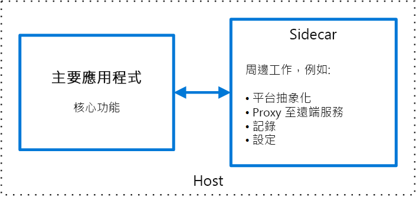

# 側車模式

將應用程式的元件部署到個別的處理序或容器，以提供隔離和封裝。 此模式也可讓應用程式由異質元件和技術組成。

此模式名為「側車」，因為它類似於加裝到機車的「側車」。 在此模式中，側車會附加至父系應用程式，並為應用程式提供支援的功能。 側車也會共用與父系應用程式相同的生命週期，隨著父系應用程式而建立和停用。 側車模式有時稱為 Sidekick (好友) 模式，是一種分解模式。

## 內容和問題

應用程式和服務通常需要相關的功能，例如監視、記錄、設定及網路服務。 這些週邊工作可實作為個別的元件或服務。

如果它們會緊密整合到應用程式，就可以和應用程式在相同的處理序中執行，以便有效率地使用共用資源。 不過，這也表示它們未隔離，若這些元件的其中一個中斷，便可能會影響其他元件或整個應用程式。 此外，它們通常需使用和父系應用程式相同的語言來實作。 因此，元件和應用程式彼此具有緊密的相依關係。

如果應用程式分解成多個服務，每個服務就能使用不同的語言和技術來建置。 雖然這可提供更多彈性，但也表示每個元件有自己的相依性，而且需要特定語言程式庫來存取基礎平台和與父系應用程式共用的所有資源。 此外，將這些功能部署為個別的服務，可能會增加應用程式延遲。 管理這些特定語言介面的程式碼和相依性也會大幅提高複雜性，特別是針對裝載、部署和管理等方面。

## 解決方法

將一組相關工作與主要應用程式放在相同位置，但將它們放在自己的處理序或容器內，可為平台服務提供跨語言的同質介面。

側車服務不一定是應用程式的一部分，但會連線到應用程式。 它會隨著父系應用程式移動。 側車是隨主要應用程式部署的支援處理序或服務。 側車是加裝在機車上，每部機車都能有專屬的側車。 同樣地，側車服務和其父系應用程式有相同的生命週期。 對於應用程式的每個執行個體，側車的執行個體會隨之部署並裝載。

使用側車模式的優點包括：

- 側車的執行階段環境和程式設計語言與主要應用程式是分開的，因此不需針對每一種語言開發一個側車。

- 側車可以和主要應用程式存取相同的資源。 例如，側車可以監視側車和主要應用程式所使用的系統資源。

- 因為側車鄰近主要應用程式，當兩者之間進行通訊時，沒有明顯的延遲。

- 即使應用程式不提供擴充性機制，您也可以在和主要應用程式相同的主機或子容器中將側車附加為處理序，以擴充應用程式功能。

側車模式通常與容器搭配使用，因而稱為側車容器或 Sidekick 容器。

## 問題和考量

- 請考慮將用來部署服務、處理序或容器的部署和封裝格式。 容器特別適合側車模式。
- 在設計側車服務時，請小心決定處理序間通訊機制。 除非無法滿足效能需求，否則請嘗試使用不受限於特定語言或架構的技術。
- 將功能放入側車之前，請考慮改用個別服務或更傳統的精靈是否會更好。
- 也請考慮功能是否可實作為程式庫，或使用傳統的擴充機制來實作。 特定語言程式庫可能有更深層的整合和較少的網路額外負荷。

## 使用此模式的時機

使用此模式的時機包括：

- 您的主要應用程式使用一組異質的語言和架構。 位於側車服務中的元件，可供使用不同架構以不同語言撰寫的應用程式使用。
- 元件由遠端團隊或不同的組織所擁有。
- 元件或功能必須位於和應用程式相同的主機
- 您需要會與主要應用程式共用整個生命週期的服務，但服務可獨立更新。
- 您需要對特定資源或元件有更細微的資源限制控制。 例如，您可能要限制特定元件所使用的記憶體數量。 您可以將元件部署為側車，並以獨立於主要應用程式的方式管理記憶體使用量。

此模式可能不適合下列時機︰

- 處理序間通訊需要最佳化時。 父系應用程式與側車服務之間的通訊包含一些額外負荷，尤其是呼叫中的延遲。 這可能不是對話式介面可接受的。
- 對小型應用程式而言，並不值得為了隔離的優點而付出為每個執行個體部署側車服務的資源成本。
- 當服務必須以不同於或獨立於主要應用程式的方式調整時。 如果是這樣，可能比較適合將功能部署為個別服務。

## 範例

側車模式適用於許多情況。 一些常見的範例包括：

- 基礎結構 API。 基礎結構的開發小組建立連同每個應用程式一起部署的服務 (而不是特定語言的用戶端程式庫)，以存取基礎結構。 服務會以側車模式載入，並為下列基礎結構服務提供通用層：記錄、環境資料、設定存放區、探索、健康狀態檢查和看門狗服務。 側車也會監視父系應用程式的主機環境和處理序 (或容器)，並將資訊記錄到集中式服務。
- 管理 NGINX/HAProxy。 連同監視環境狀態的側車服務一起部署 NGINX，然後更新 NGINX 設定檔，並在需要變更狀態時回收處理序。
- Ambassador (外交官) 側車。 部署[大使](./ambassador.md)服務作為側車。 應用程式會透過 Ambassador 進行呼叫，並由 Ambassador 處理要求記錄、路由、斷路及其他連線相關功能。
- 卸載 Proxy。 將 NGINX Proxy 放在 node.js 服務執行個體前端，以處理針對服務提供靜態檔案內容。

## 相關的指引

- [大使模式](./ambassador.md)
