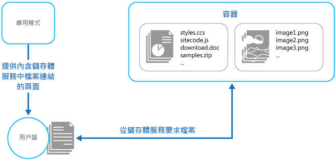

# <a name="static-content-hosting-pattern"></a><span data-ttu-id="7b8ce-104">靜態內容裝載模式</span><span class="sxs-lookup"><span data-stu-id="7b8ce-104">Static Content Hosting pattern</span></span>

[!INCLUDE [header](../_includes/header.md)]

<span data-ttu-id="7b8ce-105">將靜態內容部署到可以直接將其傳遞給用戶端的雲端式儲存體服務。</span><span class="sxs-lookup"><span data-stu-id="7b8ce-105">Deploy static content to a cloud-based storage service that can deliver them directly to the client.</span></span> <span data-ttu-id="7b8ce-106">這可以降低對潛在昂貴之計算執行個體的需求。</span><span class="sxs-lookup"><span data-stu-id="7b8ce-106">This can reduce the need for potentially expensive compute instances.</span></span>

## <a name="context-and-problem"></a><span data-ttu-id="7b8ce-107">內容和問題</span><span class="sxs-lookup"><span data-stu-id="7b8ce-107">Context and problem</span></span>

<span data-ttu-id="7b8ce-108">Web 應用程式通常包含靜態內容的某些元素。</span><span class="sxs-lookup"><span data-stu-id="7b8ce-108">Web applications typically include some elements of static content.</span></span> <span data-ttu-id="7b8ce-109">這個靜態內容可能包括 HTML 頁面及其他資源，例如用戶端可用的影像和文件，無論是作為 HTML 網頁的一部分 (如內嵌影像、樣式表和用戶端 JavaScript 檔案)，或是作為個別的下載項目 (例如 PDF 文件)。</span><span class="sxs-lookup"><span data-stu-id="7b8ce-109">This static content might include HTML pages and other resources such as images and documents that are available to the client, either as part of an HTML page (such as inline images, style sheets, and client-side JavaScript files) or as separate downloads (such as PDF documents).</span></span>

<span data-ttu-id="7b8ce-110">雖然 Web 伺服器已調整成透過有效率的動態網頁程式碼執行和輸出快取來最佳化要求，但仍然需要處理下載靜態內容的要求。</span><span class="sxs-lookup"><span data-stu-id="7b8ce-110">Although web servers are well tuned to optimize requests through efficient dynamic page code execution and output caching, they still have to handle requests to download static content.</span></span> <span data-ttu-id="7b8ce-111">這會取用通常可以更加適當使用的處理週期。</span><span class="sxs-lookup"><span data-stu-id="7b8ce-111">This consumes processing cycles that could often be put to better use.</span></span>

## <a name="solution"></a><span data-ttu-id="7b8ce-112">解決方式</span><span class="sxs-lookup"><span data-stu-id="7b8ce-112">Solution</span></span>

<span data-ttu-id="7b8ce-113">在大部分的雲端裝載環境中，透過在儲存體服務中尋找應用程式的部分資源和靜態網頁，可以將計算執行個體的需求降到最低 (例如，使用較小的執行個體或較少的執行個體)。</span><span class="sxs-lookup"><span data-stu-id="7b8ce-113">In most cloud hosting environments it's possible to minimize the need for compute instances (for example, use a smaller instance or fewer instances), by locating some of an application’s resources and static pages in a storage service.</span></span> <span data-ttu-id="7b8ce-114">雲端裝載儲存體的成本通常遠低於計算執行個體的成本。</span><span class="sxs-lookup"><span data-stu-id="7b8ce-114">The cost for cloud-hosted storage is typically much less than for compute instances.</span></span>

<span data-ttu-id="7b8ce-115">在儲存體服務中裝載應用程式的某些部分時，主要考量因素與應用程式部署以及保護不打算提供給匿名使用者使用的資源有關。</span><span class="sxs-lookup"><span data-stu-id="7b8ce-115">When hosting some parts of an application in a storage service, the main considerations are related to deployment of the application and to securing resources that aren't intended to be available to anonymous users.</span></span>

## <a name="issues-and-considerations"></a><span data-ttu-id="7b8ce-116">問題和考量</span><span class="sxs-lookup"><span data-stu-id="7b8ce-116">Issues and considerations</span></span>

<span data-ttu-id="7b8ce-117">當您決定如何實作此模式時，請考慮下列幾點：</span><span class="sxs-lookup"><span data-stu-id="7b8ce-117">Consider the following points when deciding how to implement this pattern:</span></span>

- <span data-ttu-id="7b8ce-118">裝載的儲存體服務必須公開使用者可以存取，以便下載靜態資源的 HTTP 端點。</span><span class="sxs-lookup"><span data-stu-id="7b8ce-118">The hosted storage service must expose an HTTP endpoint that users can access to download the static resources.</span></span> <span data-ttu-id="7b8ce-119">某些儲存體服務也支援 HTTPS，因此可以將資源裝載在需要 SSL 的儲存體服務中。</span><span class="sxs-lookup"><span data-stu-id="7b8ce-119">Some storage services also support HTTPS, so it's possible to host resources in storage services that require SSL.</span></span>

- <span data-ttu-id="7b8ce-120">為了獲得最大效能和可用性，請考慮使用內容傳遞網路 (CDN) 快取全球各地多個資料中心中之儲存體容器的內容。</span><span class="sxs-lookup"><span data-stu-id="7b8ce-120">For maximum performance and availability, consider using a content delivery network (CDN) to cache the contents of the storage container in multiple datacenters around the world.</span></span> <span data-ttu-id="7b8ce-121">但是，您可能需要支付使用 CDN 的費用。</span><span class="sxs-lookup"><span data-stu-id="7b8ce-121">However, you'll likely have to pay for using the CDN.</span></span>

- <span data-ttu-id="7b8ce-122">儲存體帳戶依預設通常會進行異地複寫，針對可能會影響資料中心的事件提供復原功能。</span><span class="sxs-lookup"><span data-stu-id="7b8ce-122">Storage accounts are often geo-replicated by default to provide resiliency against events that might affect a datacenter.</span></span> <span data-ttu-id="7b8ce-123">這表示 IP 位址可能會變更，但 URL 將會維持不變。</span><span class="sxs-lookup"><span data-stu-id="7b8ce-123">This means that the IP address might change, but the URL will remain the same.</span></span>

- <span data-ttu-id="7b8ce-124">當某些內容位於儲存體帳戶中，而其他內容位於裝載的計算執行個體中時，部署應用程式並對其進行更新將變得更具挑戰性。</span><span class="sxs-lookup"><span data-stu-id="7b8ce-124">When some content is located in a storage account and other content is in a hosted compute instance it becomes more challenging to deploy an application and to update it.</span></span> <span data-ttu-id="7b8ce-125">您可能必須執行個別的部署，並對應用程式和內容進行版本化，以便更輕鬆地管理&mdash;特別是當靜態內容包含指令碼檔案或 UI 元件時。</span><span class="sxs-lookup"><span data-stu-id="7b8ce-125">You might have to perform separate deployments, and version the application and content to manage it more easily&mdash;especially when the static content includes script files or UI components.</span></span> <span data-ttu-id="7b8ce-126">但是，如果只需要更新靜態資源，則只需將其上傳至儲存體帳戶，而不需要重新部署應用程式套件。</span><span class="sxs-lookup"><span data-stu-id="7b8ce-126">However, if only static resources have to be updated, they can simply be uploaded to the storage account without needing to redeploy the application package.</span></span>

- <span data-ttu-id="7b8ce-127">儲存體服務可能不支援使用自訂網域名稱。</span><span class="sxs-lookup"><span data-stu-id="7b8ce-127">Storage services might not support the use of custom domain names.</span></span> <span data-ttu-id="7b8ce-128">在此情況下，就必須在連結中指定資源的完整 URL，因為它們將位於與含有連結之動態產生內容不同的網域中。</span><span class="sxs-lookup"><span data-stu-id="7b8ce-128">In this case it's necessary to specify the full URL of the resources in links because they'll be in a different domain from the dynamically-generated content containing the links.</span></span>

- <span data-ttu-id="7b8ce-129">儲存體容器必須設定公用讀取權限，但一定要確保它們未設定公用寫入權限，以避免使用者上傳內容。</span><span class="sxs-lookup"><span data-stu-id="7b8ce-129">The storage containers must be configured for public read access, but it's vital to ensure that they aren't configured for public write access to prevent users being able to upload content.</span></span> <span data-ttu-id="7b8ce-130">請考慮使用有限權限金鑰或權杖來控制對不應該匿名存取存取存取存取存取存取存取存取存取存取存取存取存取存取存取存取存取之資源的存取&mdash;如需詳細資訊，請參閱[有限權限金鑰模式](valet-key.md)。</span><span class="sxs-lookup"><span data-stu-id="7b8ce-130">Consider using a valet key or token to control access to resources that shouldn't be available anonymously&mdash;see the [Valet Key pattern](valet-key.md) for more information.</span></span>

## <a name="when-to-use-this-pattern"></a><span data-ttu-id="7b8ce-131">使用此模式的時機</span><span class="sxs-lookup"><span data-stu-id="7b8ce-131">When to use this pattern</span></span>

<span data-ttu-id="7b8ce-132">這種模式在下列情況中非常有用：</span><span class="sxs-lookup"><span data-stu-id="7b8ce-132">This pattern is useful for:</span></span>

- <span data-ttu-id="7b8ce-133">將包含一些靜態資源之網站和應用程式的託管成本降至最低。</span><span class="sxs-lookup"><span data-stu-id="7b8ce-133">Minimizing the hosting cost for websites and applications that contain some static resources.</span></span>

- <span data-ttu-id="7b8ce-134">將僅由靜態內容和資源組成之網站的託管成本降至最低。</span><span class="sxs-lookup"><span data-stu-id="7b8ce-134">Minimizing the hosting cost for websites that consist of only static content and resources.</span></span> <span data-ttu-id="7b8ce-135">根據主機服務提供者儲存體系統的功能，在儲存體帳戶中完全代管完整的靜態網站是有可能的。</span><span class="sxs-lookup"><span data-stu-id="7b8ce-135">Depending on the capabilities of the hosting provider’s storage system, it might be possible to entirely host a fully static website in a storage account.</span></span>

- <span data-ttu-id="7b8ce-136">公開在其他代管環境或內部部署伺服器中執行之應用程式的靜態資源和內容。</span><span class="sxs-lookup"><span data-stu-id="7b8ce-136">Exposing static resources and content for applications running in other hosting environments or on-premises servers.</span></span>

- <span data-ttu-id="7b8ce-137">使用內容傳遞網路快取全球各地多個資料中心中之儲存體帳戶的內容，查找多個地理區域中的內容。</span><span class="sxs-lookup"><span data-stu-id="7b8ce-137">Locating content in more than one geographical area using a content delivery network that caches the contents of the storage account in multiple datacenters around the world.</span></span>

- <span data-ttu-id="7b8ce-138">監視成本和頻寬使用量。</span><span class="sxs-lookup"><span data-stu-id="7b8ce-138">Monitoring costs and bandwidth usage.</span></span> <span data-ttu-id="7b8ce-139">針對部分或全部靜態內容使用不同的儲存體帳戶，可使成本更容易與代管和執行階段成本分開。</span><span class="sxs-lookup"><span data-stu-id="7b8ce-139">Using a separate storage account for some or all of the static content allows the costs to be more easily separated from hosting and runtime costs.</span></span>

<span data-ttu-id="7b8ce-140">此模式在下列情況下可能不是很有用：</span><span class="sxs-lookup"><span data-stu-id="7b8ce-140">This pattern might not be useful in the following situations:</span></span>

- <span data-ttu-id="7b8ce-141">應用程式在將靜態內容傳遞給用戶端之前，需要對其進行一些處理。</span><span class="sxs-lookup"><span data-stu-id="7b8ce-141">The application needs to perform some processing on the static content before delivering it to the client.</span></span> <span data-ttu-id="7b8ce-142">例如，可能需要在文件加上時間戳記。</span><span class="sxs-lookup"><span data-stu-id="7b8ce-142">For example, it might be necessary to add a timestamp to a document.</span></span>

- <span data-ttu-id="7b8ce-143">靜態內容的量非常小。</span><span class="sxs-lookup"><span data-stu-id="7b8ce-143">The volume of static content is very small.</span></span> <span data-ttu-id="7b8ce-144">從不同的儲存體擷取此內容的負擔，可能超過將它從計算資源中區隔出來的成本優勢。</span><span class="sxs-lookup"><span data-stu-id="7b8ce-144">The overhead of retrieving this content from separate storage can outweigh the cost benefit of separating it out from the compute resource.</span></span>

## <a name="example"></a><span data-ttu-id="7b8ce-145">範例</span><span class="sxs-lookup"><span data-stu-id="7b8ce-145">Example</span></span>

<span data-ttu-id="7b8ce-146">Azure Blob 儲存體中的靜態內容可以直接透過網頁瀏覽器存取。</span><span class="sxs-lookup"><span data-stu-id="7b8ce-146">Static content located in Azure Blob storage can be accessed directly by a web browser.</span></span> <span data-ttu-id="7b8ce-147">Azure 在儲存體上提供一個可公開給用戶端的 HTTP 型介面。</span><span class="sxs-lookup"><span data-stu-id="7b8ce-147">Azure provides an HTTP-based interface over storage that can be publicly exposed to clients.</span></span> <span data-ttu-id="7b8ce-148">例如，Azure Blob 儲存體容器中的內容會使用下列格式的 URL 來公開：</span><span class="sxs-lookup"><span data-stu-id="7b8ce-148">For example, content in an Azure Blob storage container is exposed using a URL with the following form:</span></span>

`http://[ storage-account-name ].blob.core.windows.net/[ container-name ]/[ file-name ]`


<span data-ttu-id="7b8ce-149">上傳內容時，必須建立一或多個 Blob 容器來保存檔案和文件。</span><span class="sxs-lookup"><span data-stu-id="7b8ce-149">When uploading the content it's necessary to create one or more blob containers to hold the files and documents.</span></span> <span data-ttu-id="7b8ce-150">請注意，新的容器的預設權限為「私人」，您必須將其變更為「公開」以允許用戶端存取內容。</span><span class="sxs-lookup"><span data-stu-id="7b8ce-150">Note that the default permission for a new container is Private, and you must change this to Public to allow clients to access the contents.</span></span> <span data-ttu-id="7b8ce-151">如果有必要避免匿名存取內容，則可以實作[有限權限金鑰模式](valet-key.md)，要求使用者必須出示有效權杖才能下載資源。</span><span class="sxs-lookup"><span data-stu-id="7b8ce-151">If it's necessary to protect the content from anonymous access, you can implement the [Valet Key pattern](valet-key.md) so users must present a valid token to download the resources.</span></span>

> <span data-ttu-id="7b8ce-152">[Blob 服務概念](https://msdn.microsoft.com/library/azure/dd179376.aspx)包含 Blob 儲存體的相關資訊，以及您可以存取並使用它的方式。</span><span class="sxs-lookup"><span data-stu-id="7b8ce-152">[Blob Service Concepts](https://msdn.microsoft.com/library/azure/dd179376.aspx) has information about blob storage, and the ways that you can access and use it.</span></span>

<span data-ttu-id="7b8ce-153">每一頁中的連結都會指定資源的 URL，而用戶端會直接從儲存體服務存取它。</span><span class="sxs-lookup"><span data-stu-id="7b8ce-153">The links in each page will specify the URL of the resource and the client will access it directly from the storage service.</span></span> <span data-ttu-id="7b8ce-154">此圖說明直接從儲存體服務傳遞應用程式的靜態部分。</span><span class="sxs-lookup"><span data-stu-id="7b8ce-154">The figure illustrates delivering static parts of an application directly from a storage service.</span></span>




<span data-ttu-id="7b8ce-156">傳遞至用戶端的頁面中的連結，必須指定 Blob 容器及資源的完整 URL。</span><span class="sxs-lookup"><span data-stu-id="7b8ce-156">The links in the pages delivered to the client must specify the full URL of the blob container and resource.</span></span> <span data-ttu-id="7b8ce-157">例如，包含公用容器中之影像連結的頁面，可能包含以下的 HTML。</span><span class="sxs-lookup"><span data-stu-id="7b8ce-157">For example, a page that contains a link to an image in a public container might contain the following HTML.</span></span>

```html

```

> <span data-ttu-id="7b8ce-158">如果使用有限權限金鑰 (例如 Azure 共用存取簽章) 保護資源，此簽章必須包含在連結中的 URL。</span><span class="sxs-lookup"><span data-stu-id="7b8ce-158">If the resources are protected by using a valet key, such as an Azure shared access signature, this signature must be included in the URLs in the links.</span></span>

<span data-ttu-id="7b8ce-159">從 [GitHub](https://github.com/mspnp/cloud-design-patterns/tree/master/static-content-hosting) 可以找到一個名為 StaticContentHosting 的解決方案，該解決方案示範如何針對靜態資源使用外部儲存體。</span><span class="sxs-lookup"><span data-stu-id="7b8ce-159">A solution named StaticContentHosting that demonstrates using external storage for static resources is available from [GitHub](https://github.com/mspnp/cloud-design-patterns/tree/master/static-content-hosting).</span></span> <span data-ttu-id="7b8ce-160">StaticContentHosting.Cloud 專案包含指定儲存體帳戶的設定檔，以及包含靜態內容的容器。</span><span class="sxs-lookup"><span data-stu-id="7b8ce-160">The StaticContentHosting.Cloud project contains configuration files that specify the storage account and container that holds the static content.</span></span>

```xml
<Setting name="StaticContent.StorageConnectionString"
         value="UseDevelopmentStorage=true" />
<Setting name="StaticContent.Container" value="static-content" />
```

<span data-ttu-id="7b8ce-161">StaticContentHosting.Web 專案之 Settings.cs 檔案中的 `Settings` 類別包含數種方法，可擷取這些值並建立包含雲端儲存體帳戶容器 URL 的字串值。</span><span class="sxs-lookup"><span data-stu-id="7b8ce-161">The `Settings` class in the file Settings.cs of the StaticContentHosting.Web project contains methods to extract these values and build a string value containing the cloud storage account container URL.</span></span>

```csharp
public class Settings
{
  public static string StaticContentStorageConnectionString {
    get
    {
      return RoleEnvironment.GetConfigurationSettingValue(
                              "StaticContent.StorageConnectionString");
    }
  }

  public static string StaticContentContainer
  {
    get
    {
      return RoleEnvironment.GetConfigurationSettingValue("StaticContent.Container");
    }
  }

  public static string StaticContentBaseUrl
  {
    get
    {
      var account = CloudStorageAccount.Parse(StaticContentStorageConnectionString);

      return string.Format("{0}/{1}", account.BlobEndpoint.ToString().TrimEnd('/'),
                                      StaticContentContainer.TrimStart('/'));
    }
  }
}
```

<span data-ttu-id="7b8ce-162">StaticContentUrlHtmlHelper.cs 檔案中的 `StaticContentUrlHtmlHelper` 類別會公開一個名為 `StaticContentUrl` 的方法，該方法會產生包含雲端儲存體帳戶路徑的 URL (如果傳遞給它的 URL 以 ASP.NET 根路徑字元 (~) 為開頭)。</span><span class="sxs-lookup"><span data-stu-id="7b8ce-162">The `StaticContentUrlHtmlHelper` class in the file StaticContentUrlHtmlHelper.cs exposes a method named `StaticContentUrl` that generates a URL containing the path to the cloud storage account if the URL passed to it starts with the ASP.NET root path character (~).</span></span>

```csharp
public static class StaticContentUrlHtmlHelper
{
  public static string StaticContentUrl(this HtmlHelper helper, string contentPath)
  {
    if (contentPath.StartsWith("~"))
    {
      contentPath = contentPath.Substring(1);
    }

    contentPath = string.Format("{0}/{1}", Settings.StaticContentBaseUrl.TrimEnd('/'),
                                contentPath.TrimStart('/'));

    var url = new UrlHelper(helper.ViewContext.RequestContext);

    return url.Content(contentPath);
  }
}
```

<span data-ttu-id="7b8ce-163">Views\Home 資料夾中的 Index.cshtml 檔案包含使用 `StaticContentUrl` 方法為其 `src` 屬性建立 URL 的影像元素。</span><span class="sxs-lookup"><span data-stu-id="7b8ce-163">The file Index.cshtml in the Views\Home folder contains an image element that uses the `StaticContentUrl` method to create the URL for its `src` attribute.</span></span>

```html

```

## <a name="related-patterns-and-guidance"></a><span data-ttu-id="7b8ce-164">相關的模式和指導方針</span><span class="sxs-lookup"><span data-stu-id="7b8ce-164">Related patterns and guidance</span></span>

- <span data-ttu-id="7b8ce-165">[GitHub](https://github.com/mspnp/cloud-design-patterns/tree/master/static-content-hosting) \(英文\) 上有提供示範此模式的範例。</span><span class="sxs-lookup"><span data-stu-id="7b8ce-165">A sample that demonstrates this pattern is available on [GitHub](https://github.com/mspnp/cloud-design-patterns/tree/master/static-content-hosting).</span></span>
- <span data-ttu-id="7b8ce-166">[有限權限金鑰模式](valet-key.md)。</span><span class="sxs-lookup"><span data-stu-id="7b8ce-166">[Valet Key pattern](valet-key.md).</span></span> <span data-ttu-id="7b8ce-167">如果目標資源不應該提供給匿名使用者使用，則必須在保存靜態內容的存放區上實作安全性。</span><span class="sxs-lookup"><span data-stu-id="7b8ce-167">If the target resources aren't supposed to be available to anonymous users it's necessary to implement security over the store that holds the static content.</span></span> <span data-ttu-id="7b8ce-168">描述如何使用權杖或金鑰為用戶端提供特定資源或服務 (例如雲端裝載儲存體服務) 的受限制直接存取。</span><span class="sxs-lookup"><span data-stu-id="7b8ce-168">Describes how to use a token or key that provides clients with restricted direct access to a specific resource or service such as a cloud-hosted storage service.</span></span>
- <span data-ttu-id="7b8ce-169">Infosys 部落格上的[在 Azure 上部署靜態網站的有效方法](http://www.infosysblogs.com/microsoft/2010/06/an_efficient_way_of_deploying.html) \(英文\)。</span><span class="sxs-lookup"><span data-stu-id="7b8ce-169">[An efficient way of deploying a static web site on Azure](http://www.infosysblogs.com/microsoft/2010/06/an_efficient_way_of_deploying.html) on the Infosys blog.</span></span>
- <span data-ttu-id="7b8ce-170">[Blob 服務概念](https://msdn.microsoft.com/library/azure/dd179376.aspx) \(英文\)</span><span class="sxs-lookup"><span data-stu-id="7b8ce-170">[Blob Service Concepts](https://msdn.microsoft.com/library/azure/dd179376.aspx)</span></span>
