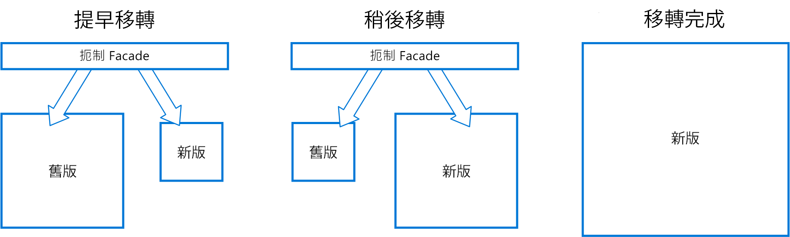

# 扼制模式Strangler pattern

透過將功能的特定片段逐漸取代成新的應用程式和服務，來逐步移轉舊有系統。Incrementally migrate a legacy system by gradually replacing specific pieces of functionality with new applications and services. 隨著舊有系統的功能被取代，新系統最終會取代舊系統所有的功能，扼制舊系統或功能，讓您將它解除任務。As features from the legacy system are replaced, the new system eventually replaces all of the old system's features, strangling the old system and allowing you to decommission it. 

## 內容和問題Context and problem

隨著系統老化，開發工具、裝載技術、甚至是建置它們的系統架構，都可能變得越來越過時。As systems age, the development tools, hosting technology, and even system architectures they were built on can become increasingly obsolete. 因為新的特色與功能加入，這些應用程式的複雜性會大幅增加，使其更難以維護或加入新功能。As new features and functionality are added, the complexity of these applications can increase dramatically, making them harder to maintain or add new features to.

完全取代複雜的系統可能會是個大工程。Completely replacing a complex system can be a huge undertaking. 通常，您將需要漸進式移轉到新的系統，同時保留舊系統來處理尚未移轉的功能。Often, you will need a gradual migration to a new system, while keeping the old system to handle features that haven't been migrated yet. 但是，執行兩個不同版本的應用程式，表示用戶端必須知道特定功能在哪裡。However, running two separate versions of an application means that clients have to know where particular features are located. 每次移轉功能或服務時，需要讓用戶端知道新的位置。Every time a feature or service is migrated, clients need to be updated to point to the new location.

## 方案Solution

將功能的特定片段逐漸取代成新的應用程式和服務。Incrementally replace specific pieces of functionality with new applications and services. 建立 façade 來攔截送至後端舊系統的要求。Create a façade that intercepts requests going to the backend legacy system. façade 會將這些要求路由傳送至舊版應用程式或新的服務。The façade routes these requests either to the legacy application or the new services. 現有功能可以逐漸移轉至新系統，取用者可以繼續使用相同的介面，不會察覺任何移轉的發生。Existing features can be migrated to the new system gradually, and consumers can continue using the same interface, unaware that any migration has taken place.

  

此模式有助於將移轉的風險降至最低，並將開發分散在一段時間內。This pattern helps to minimize risk from the migration, and spread the development effort over time. 利用 façade 安全地將使用者路由至正確的應用程式，以您喜歡的步調將功能加入新的系統，同時確保舊版應用程式仍持續運作。With the façade safely routing users to the correct application, you can add functionality to the new system at whatever pace you like, while ensuring the legacy application continues to function. 經過一段時間，當功能都移轉到新的系統，舊系統終將被「扼制」，且不再需要它。Over time, as features are migrated to the new system, the legacy system is eventually "strangled" and is no longer necessary. 完成此程序之後，可以安全地淘汰舊系統。Once this process is complete, the legacy system can safely be retired.

## 問題和考量Issues and considerations

- 請考慮如何處理新舊系統可能同時使用的服務和資料存放區。Consider how to handle services and data stores that are potentially used by both new and legacy systems. 確定兩者可以同時存取這些資源。Make sure both can access these resources side-by-side.
- 建構新應用程式和服務的方式，使它們在未來的扼制移轉中可以輕鬆地被攔截和取代。Structure new applications and services in a way that they can easily be intercepted and replaced in future strangler migrations.
- 在某些時候，當移轉完成時，抑制 façade 將會消失或演變成舊版用戶端的配接器。At some point, when the migration is complete, the strangler façade will either go away or evolve into an adaptor for legacy clients.
- 請確定 façade 跟得上移轉。Make sure the façade keeps up with the migration.
- 請確定外觀就不會成為單點失敗或效能瓶頸。Make sure the façade doesn't become a single point of failure or a performance bottleneck.

## 使用此模式的時機When to use this pattern

逐漸將後端應用程式移轉至新架構時，請使用此模式。Use this pattern when gradually migrating a back-end application to a new architecture.

此模式可能不適合下列時機：This pattern may not be suitable:

- 當無法攔截送到後端系統的要求。When requests to the back-end system cannot be intercepted.
- 整批取代的複雜度較低的小型系統。For smaller systems where the complexity of wholesale replacement is low.

## 相關的指引Related guidance

- [防損毀層模式Anti-Corruption Layer pattern](./anti-corruption-layer.md)
- [閘道路由模式Gateway Routing pattern](./gateway-routing.md)

 

