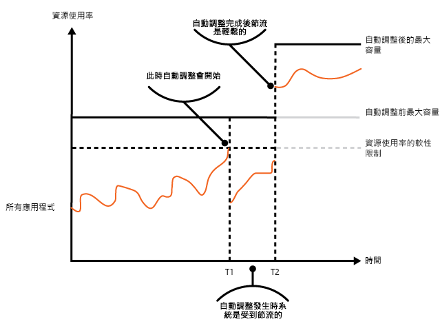

# 節流模式

[!INCLUDE [header](../_includes/header.md)]

控制應用程式執行個體、個別租用戶或整個服務所使用的資源耗用量。 這可以讓系統繼續運作，並符合服務等級協定，即使需求量的增加對資源造成極大的負載。

## 內容和問題

雲端應用程式的負載通常會隨時間而不同，視作用中使用者數目或他們所執行的活動類型而定。 例如，營業時間期間可能會有較多的使用者處於作用中狀態，或系統可能需要在每月底執行耗費大量行運算能力的分析。 可能也會有突然且非預期的活動量暴增。 如果系統的處理需求超過可用的資源量，系統可能會有效能不彰的問題，甚至可能失敗。 如果系統必須符合服務等級協定，則必定不可發生這類失敗。

視應用程式的商業目標而定，有許多不同的策略可以處理雲端上變化的負載。 其中一個策略是使用自動調整，讓佈建的資源能滿足在任何給定時間的使用者需求。 此策略有持續滿足使用者需求且同時最佳化執行成本的潛力。 雖然自動調整可以觸發額外資源的佈建，但此佈建不是即時的。 如果要求快速地成長，可能有一段時間會是資源不足的狀態。

## 方案

自動調整的一個替代策略是允許應用程式使用有所限制的資源，到達上限之後就會將它們節流。 系統應該監視它使用資源的情況，如此一來，當使用量超過閾值時，系統就能將來自一或多個使用者的要求節流。 這樣能讓系統持續運作且符合任何既有的服務等級協定 (SLA)。 如需監視資源使用量的詳細資訊，請參閱[檢測和遙測指導方針](https://msdn.microsoft.com/library/dn589775.aspx) \(英文\)。

系統可以實作數種節流策略，包括：

- 如果個別使用者在一段給定的時間內存取系統 API 的頻率為每秒 n 次以上，則拒絕該使用者的要求。 此作法需要系統對執行應用程式的每個租用戶或使用者的資源使用量進行計量。 如需詳細資訊，請參閱[服務計量指導方針](https://msdn.microsoft.com/library/dn589796.aspx) \(英文\)。

- 將所選的非必要服務的功能停用或降級，使必要的服務有足夠的資源可以順利執行。 例如，若應用程式正在串流處理視訊輸出，它可以切換成較低的解析度。

- 使用負載調節來緩解活動量 ([佇列型負載調節模式](queue-based-load-leveling.md)中涵蓋此方法的詳細資訊)。 在多租用戶環境中，此方法會降低每個租用戶的效能。 如果系統必須支援使用不同 SLA 的混合租用戶，高重要性租用戶的工作可能會立即執行。 其他租用戶的要求可能先擱置，等到待辦項目不緊迫時再處理。 [優先順序佇列模式][]可用來協助實作此方法。

- 延遲代表低優先順序應用程式或租用戶所執行的作業。 可以暫停或限制這些作業，並產生例外狀況來通知租用戶系統正在忙碌，會稍後再嘗試該作業。

此圖形顯示應用程式的資源使用 (由記憶體、CPU、頻寬和其他因素組成) 對時間的面積圖，該應用程式使用三個功能。 功能 (feature) 是功能 (functionality) 的區域，例如執行一組特定工作的元件、一段執行複雜運算的程式碼，或是提供記憶體內快取等服務的元素。 這些功能已加上標籤 A、B 和 C。

> 緊鄰功能線底下的面積表示當應用程式叫用此功能時所使用的資源。 例如，Feature A 線底下的面積顯示利用 Feature A 的應用程式所使用的資源，而 Feature A 和 Feature B 兩線之間的面積表示叫用 Feature B 的應用程式所使用的資源。彙總每個功能的面積則顯示系統的總資源使用。

上圖說明延遲作業的影響。 就在 T1 時間點之前，配置給所有使用這些功能之應用程式的總資源達到閾值 (資源使用的限制)。 此時，應用程式有耗盡可用資源的風險。 在此系統中，Feature B 的重要性低於 Feature A 或 Feature C，因此它被暫時停用並釋放它正在使用的資源。 在 T1 和 T2 時間點之間，使用 Feature A 和 Feature C 的應用程式繼續正常執行。 最後，這兩個功能的資源使用減少到足以再次啟用 Feature B 的程度 (於 T2 時間點)。

也可以將自動調整和節流方法結合，讓應用程式保持回應且符合 SLA。 如果預期要求會維持在大量，節流提供在系統相應放大時的暫時性解決方案。此時，系統的完整功能可以被還原。

下一張圖顯示系統內所有執行中應用程式之整體資源使用對時間的面積圖，並說明節流如何與自動調整結合。

在 T1 時間點，到達指定資源使用量彈性限制的閾值。 此時，系統可以開始相應放大。不過，若新的資源無法快速地變得可供使用，則現有資源可能會耗盡，而且系統可能會失敗。 為了防止發生此情況，系統會暫時地節流 (如先前所述)。 當自動調整完成且額外資源可供使用時，就可以將節流放寬。

## 問題和考量

當您在決定如何實作此模式時，應考慮下列幾點：

- 進行應用程式節流以及要使用的策略，是影響整個系統設計的架構性決策。 應在應用程式設計流程的初期考慮節流功能，因為實作系統之後就不容易加入此功能。

- 節流必須快速地執行。 系統必須能夠偵測活動的增加，並據以採取動作。 系統必須也能在負載減少之後，快速地還原到原始的狀態。 這需要持續地擷取及監視適當的效能資料。

- 如果服務需要暫時拒絕使用者的要求，它應該傳回特定的錯誤碼，這樣用戶端應用程式才了解某個要求被拒絕的原因是系統正在節流。 用戶端應用程式可以等待一段時間後再重試要求。

- 節流可以做為系統在自動調整時的暫時性措施。 在某些情況下，例如活動突然暴增且不預期會持續，則直接節流是最好的方法，而非進行調整。因為調整可能會大幅提高執行成本。

- 如果將節流做為系統在自動調整時的暫時性措施，且資源需求非常快速地成長，則系統可能無法持續運作 &mdash; 即使正在節流模式中運作。 如果無法接受此情況，請考慮維持較大的保留容量，並設定更積極的自動調整。

## 使用此模式的時機

使用此模式：

- 為確保系統持續符合服務等級協定。

- 為防止單一租用戶壟斷應用程式提供的資源。

- 為處理活動的暴增。

- 為透過限制維持系統運作所需的資源等級最大值，協助將系統成本最佳化。

## 範例

最後一張圖說明如何在多租用戶系統中實作節流。 來自各租用戶組織的使用者存取託管在雲端的應用程式，使用它來填寫並提交問卷。 該應用程式包含檢測設備，可監視使用者提交要求到應用程式的頻率。

為了防止某個租用戶的使用者影響應用程式對所有使用者的回應性和可用性，所以對來自任一租用戶的使用者每秒可提交之要求數目套用限制。 應用程式會封鎖超過此限制的要求。

## 相關的模式和指導方針

在實作此模式時，下列模式和指導方針也可能有所關聯：
- [檢測和遙測指引](https://msdn.microsoft.com/library/dn589775.aspx)。 節流是根據所收集有關服務使用程度的資訊來進行。 描述如何產生及擷取自訂監視資訊。
- [服務計量指導方針](https://msdn.microsoft.com/library/dn589796.aspx) \(英文\)。 描述如何對服務使用進行計量，以了解服務的使用狀況。 此資訊對於決定如何對服務進行節流非常有用。
- [自動調整指導方針](https://msdn.microsoft.com/library/dn589774.aspx) \(英文\)。 節流可以做為系統在自動調整時，或是要移除系統自動調整需求時的過渡措施。 包含自動調整策略的資訊。
- [佇列型負載調節模式](queue-based-load-leveling.md)。 佇列型負載調節是常用來實作節流的機制。 佇列可以當作減緩應用程式送出的要求傳遞到服務之速率的緩衝區。
- [優先順序佇列模式][]。 系統可以使用優先順序佇列來當作其節流策略，以維持關鍵或高重要性應用程式的效能，同時降低較不重要的應用程式的效能。

[優先順序佇列模式]: priority-queue.md