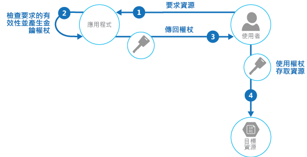

# <a name="valet-key-pattern"></a><span data-ttu-id="c511e-104">Valet 金鑰模式</span><span class="sxs-lookup"><span data-stu-id="c511e-104">Valet Key pattern</span></span>

[!INCLUDE [header](../_includes/header.md)]

<span data-ttu-id="c511e-105">使用為用戶端提供特定資源之有限直接存取權的權杖，以便卸載來自應用程式的資料轉送。</span><span class="sxs-lookup"><span data-stu-id="c511e-105">Use a token that provides clients with restricted direct access to a specific resource, in order to offload data transfer from the application.</span></span> <span data-ttu-id="c511e-106">在使用雲端裝載儲存體系統或佇列的應用程式中特別有用，而且可以最小化成本及最大化延展性和效能。</span><span class="sxs-lookup"><span data-stu-id="c511e-106">This is particularly useful in applications that use cloud-hosted storage systems or queues, and can minimize cost and maximize scalability and performance.</span></span>

## <a name="context-and-problem"></a><span data-ttu-id="c511e-107">內容和問題</span><span class="sxs-lookup"><span data-stu-id="c511e-107">Context and problem</span></span>

<span data-ttu-id="c511e-108">用戶端程式和網頁瀏覽器通常需要從應用程式的儲存體讀取和寫入檔案或資料串流。</span><span class="sxs-lookup"><span data-stu-id="c511e-108">Client programs and web browsers often need to read and write files or data streams to and from an application’s storage.</span></span> <span data-ttu-id="c511e-109">一般而言，應用程式會處理資料的移動 &mdash; 藉由從儲存體擷取並串流至用戶端，或是藉由從用戶端讀取已上傳的串流，並將其儲存在資料存放區。</span><span class="sxs-lookup"><span data-stu-id="c511e-109">Typically, the application will handle the movement of the data &mdash; either by fetching it from storage and streaming it to the client, or by reading the uploaded stream from the client and storing it in the data store.</span></span> <span data-ttu-id="c511e-110">不過，這個方法會吸收寶貴的資源，例如計算、記憶體和頻寬。</span><span class="sxs-lookup"><span data-stu-id="c511e-110">However, this approach absorbs valuable resources such as compute, memory, and bandwidth.</span></span>

<span data-ttu-id="c511e-111">資料存放區具備直接處理資料上傳和下載的能力，不需要應用程式執行任何處理來移動此資料。</span><span class="sxs-lookup"><span data-stu-id="c511e-111">Data stores have the ability to handle upload and download of data directly, without requiring that the application perform any processing to move this data.</span></span> <span data-ttu-id="c511e-112">但是，通常需要用戶端具有存放區之安全性認證的存取權。</span><span class="sxs-lookup"><span data-stu-id="c511e-112">But, this typically requires the client to have access to the security credentials for the store.</span></span> <span data-ttu-id="c511e-113">這可以是一個有用方法，最小化資料轉送成本和相應放大的需求，並且最大化效能。</span><span class="sxs-lookup"><span data-stu-id="c511e-113">This can be a useful technique to minimize data transfer costs and the requirement to scale out the application, and to maximize performance.</span></span> <span data-ttu-id="c511e-114">但是，這意味著應用程式再也無法管理資料的安全性。</span><span class="sxs-lookup"><span data-stu-id="c511e-114">It means, though, that the application is no longer able to manage the security of the data.</span></span> <span data-ttu-id="c511e-115">用戶端連線到資料存放區進行直接存取之後，應用程式就無法作為閘道管理員。</span><span class="sxs-lookup"><span data-stu-id="c511e-115">After the client has a connection to the data store for direct access, the application can't act as the gatekeeper.</span></span> <span data-ttu-id="c511e-116">它再也無法控制處理，且無法阻止資料存放區的後續上傳或下載。</span><span class="sxs-lookup"><span data-stu-id="c511e-116">It's no longer in control of the process and can't prevent subsequent uploads or downloads from the data store.</span></span>

<span data-ttu-id="c511e-117">這個方法在需要服務不受信任用戶端的分散式系統中不實際。</span><span class="sxs-lookup"><span data-stu-id="c511e-117">This isn't a realistic approach in distributed systems that need to serve untrusted clients.</span></span> <span data-ttu-id="c511e-118">相反地，應用程式必須能夠以細微的方式安全地控制資料的存取權，但是仍然減少透過設定此連線在伺服器上造成的負載，然後允許用戶端直接與資料存放區通訊，來執行必要的讀取或寫入作業。</span><span class="sxs-lookup"><span data-stu-id="c511e-118">Instead, applications must be able to securely control access to data in a granular way, but still reduce the load on the server by setting up this connection and then allowing the client to communicate directly with the data store to perform the required read or write operations.</span></span>

## <a name="solution"></a><span data-ttu-id="c511e-119">解決方法</span><span class="sxs-lookup"><span data-stu-id="c511e-119">Solution</span></span>

<span data-ttu-id="c511e-120">您必須解決控制資料存放區存取權的問題，該存放區無法管理用戶端的驗證和授權。</span><span class="sxs-lookup"><span data-stu-id="c511e-120">You need to resolve the problem of controlling access to a data store where the store can't manage authentication and authorization of clients.</span></span> <span data-ttu-id="c511e-121">一個典型的解決方案是限制資料存放區公用連線的存取權，並且為用戶端提供資料存放區可以驗證的金鑰或權杖。</span><span class="sxs-lookup"><span data-stu-id="c511e-121">One typical solution is to restrict access to the data store’s public connection and provide the client with a key or token that the data store can validate.</span></span>

<span data-ttu-id="c511e-122">此金鑰或權杖通常稱為 Valet 金鑰。</span><span class="sxs-lookup"><span data-stu-id="c511e-122">This key or token is usually referred to as a valet key.</span></span> <span data-ttu-id="c511e-123">它提供特定資源的有限時間存取權，並且只允許預先定義的作業，例如儲存體或佇列的讀取和寫入作業，或網頁瀏覽器中的上傳和下載作業。</span><span class="sxs-lookup"><span data-stu-id="c511e-123">It provides time-limited access to specific resources and allows only predefined operations such as reading and writing to storage or queues, or uploading and downloading in a web browser.</span></span> <span data-ttu-id="c511e-124">應用程式可以快速且輕易地建立 Valet 金鑰，並且核發給用戶端裝置和網頁瀏覽器，讓用戶端執行必要的作業，而不需要應用程式直接處理資料轉送。</span><span class="sxs-lookup"><span data-stu-id="c511e-124">Applications can create and issue valet keys to client devices and web browsers quickly and easily, allowing clients to perform the required operations without requiring the application to directly handle the data transfer.</span></span> <span data-ttu-id="c511e-125">這樣會從應用程式和伺服器移除處理額外負荷，以及對效能和延展性的影響。</span><span class="sxs-lookup"><span data-stu-id="c511e-125">This removes the processing overhead, and the impact on performance and scalability, from the application and the server.</span></span>

<span data-ttu-id="c511e-126">用戶端會使用此權杖，只在特定期間存取資料存放區中的特定資源，而且具有存取權限的特定限制，如下圖所示。</span><span class="sxs-lookup"><span data-stu-id="c511e-126">The client uses this token to access a specific resource in the data store for only a specific period, and with specific restrictions on access permissions, as shown in the figure.</span></span> <span data-ttu-id="c511e-127">在指定期間之後，金鑰就無效，且不允許存取資源。</span><span class="sxs-lookup"><span data-stu-id="c511e-127">After the specified period, the key becomes invalid and won't allow access to the resource.</span></span>



<span data-ttu-id="c511e-129">可以設定具有其他相依性的金鑰，例如資料的範圍。</span><span class="sxs-lookup"><span data-stu-id="c511e-129">It's also possible to configure a key that has other dependencies, such as the scope of the data.</span></span> <span data-ttu-id="c511e-130">例如，依據資料存放區功能而定，金鑰可以指定資料存放區中完整的資料表，或僅指定資料表中的特定資料列。</span><span class="sxs-lookup"><span data-stu-id="c511e-130">For example, depending on the data store capabilities, the key can specify a complete table in a data store, or only specific rows in a table.</span></span> <span data-ttu-id="c511e-131">在雲端儲存體系統中，金鑰可以指定容器或僅指定容器內的特定項目。</span><span class="sxs-lookup"><span data-stu-id="c511e-131">In cloud storage systems the key can specify a container, or just a specific item within a container.</span></span>

<span data-ttu-id="c511e-132">金鑰也可以由應用程式判定為無效。</span><span class="sxs-lookup"><span data-stu-id="c511e-132">The key can also be invalidated by the application.</span></span> <span data-ttu-id="c511e-133">如果用戶端通知伺服器資料轉送作業已完成，這個方法很有用。</span><span class="sxs-lookup"><span data-stu-id="c511e-133">This is a useful approach if the client notifies the server that the data transfer operation is complete.</span></span> <span data-ttu-id="c511e-134">然後伺服器可以將該金鑰判定為無效，以避免進一歩的存取。</span><span class="sxs-lookup"><span data-stu-id="c511e-134">The server can then invalidate that key to prevent further access.</span></span>

<span data-ttu-id="c511e-135">使用此模式可以簡化資源存取權的管理，因為不需要建立和驗證使用者、授與權限，然後再次移除使用者。</span><span class="sxs-lookup"><span data-stu-id="c511e-135">Using this pattern can simplify managing access to resources because there's no requirement to create and authenticate a user, grant permissions, and then remove the user again.</span></span> <span data-ttu-id="c511e-136">也可以輕易地限制位置、權限以及有效期間 &mdash; 所有作業都藉由只在執行階段產生金鑰來完成。</span><span class="sxs-lookup"><span data-stu-id="c511e-136">It also makes it easy to limit the location, the permission, and the validity period&mdash;all by simply generating a key at runtime.</span></span> <span data-ttu-id="c511e-137">重要的因素是限制有效期間，特別是資源的位置，盡可能靠近以讓收件者針對預期的用途使用它。</span><span class="sxs-lookup"><span data-stu-id="c511e-137">The important factors are to limit the validity period, and especially the location of the resource, as tightly as possible so that the recipient can only use it for the intended purpose.</span></span>

## <a name="issues-and-considerations"></a><span data-ttu-id="c511e-138">問題和考量</span><span class="sxs-lookup"><span data-stu-id="c511e-138">Issues and considerations</span></span>

<span data-ttu-id="c511e-139">當您決定如何實作此模式時，請考慮下列幾點：</span><span class="sxs-lookup"><span data-stu-id="c511e-139">Consider the following points when deciding how to implement this pattern:</span></span>

<span data-ttu-id="c511e-140">**管理金鑰的有效狀態和期間**。</span><span class="sxs-lookup"><span data-stu-id="c511e-140">**Manage the validity status and period of the key**.</span></span> <span data-ttu-id="c511e-141">如果遭到外洩或洩露，金鑰可以有效地將目標項目解除鎖定，讓它能夠在有效期間被惡意使用。</span><span class="sxs-lookup"><span data-stu-id="c511e-141">If leaked or compromised, the key effectively unlocks the target item and makes it available for malicious use during the validity period.</span></span> <span data-ttu-id="c511e-142">金鑰通常會撤銷或停用，取決於發出方式。</span><span class="sxs-lookup"><span data-stu-id="c511e-142">A key can usually be revoked or disabled, depending on how it was issued.</span></span> <span data-ttu-id="c511e-143">伺服器端原則可以變更，或者將它簽署的伺服器金鑰判定為無效。</span><span class="sxs-lookup"><span data-stu-id="c511e-143">Server-side policies can be changed or, the server key it was signed with can be invalidated.</span></span> <span data-ttu-id="c511e-144">指定簡短有效期間以最小化資料存放區發生未經授權作業的風險。</span><span class="sxs-lookup"><span data-stu-id="c511e-144">Specify a short validity period to minimize the risk of allowing unauthorized operations to take place against the data store.</span></span> <span data-ttu-id="c511e-145">不過，如果有效期間太短，用戶端可能無法在金鑰到期之前完成作業。</span><span class="sxs-lookup"><span data-stu-id="c511e-145">However, if the validity period is too short, the client might not be able to complete the operation before the key expires.</span></span> <span data-ttu-id="c511e-146">如果需要受保護資源的多重存取，允許授權的使用者在有效期間到期之前更新金鑰。</span><span class="sxs-lookup"><span data-stu-id="c511e-146">Allow authorized users to renew the key before the validity period expires if multiple accesses to the protected resource are required.</span></span>

<span data-ttu-id="c511e-147">**控制金鑰提供的存取層級**。</span><span class="sxs-lookup"><span data-stu-id="c511e-147">**Control the level of access the key will provide**.</span></span> <span data-ttu-id="c511e-148">一般而言，金鑰應該允許使用者只能執行完成作業所需的動作，例如，如果用戶端應該不能將資料上傳到資料存放區，則只允許唯讀存取。</span><span class="sxs-lookup"><span data-stu-id="c511e-148">Typically, the key should allow the user to only perform the actions necessary to complete the operation, such as read-only access if the client shouldn't be able to upload data to the data store.</span></span> <span data-ttu-id="c511e-149">針對檔案上傳，通常會指定提供唯寫權限的金鑰，以及位置和有效期間。</span><span class="sxs-lookup"><span data-stu-id="c511e-149">For file uploads, it's common to specify a key that provides write-only permission, as well as the location and the validity period.</span></span> <span data-ttu-id="c511e-150">請務必正確地指定要套用金鑰的資源或一組資源。</span><span class="sxs-lookup"><span data-stu-id="c511e-150">It's critical to accurately specify the resource or the set of resources to which the key applies.</span></span>

<span data-ttu-id="c511e-151">**考量如何控制使用者的行為**。</span><span class="sxs-lookup"><span data-stu-id="c511e-151">**Consider how to control users’ behavior**.</span></span> <span data-ttu-id="c511e-152">實作此模式表示遺失使用者授與存取權之資源的控制權。</span><span class="sxs-lookup"><span data-stu-id="c511e-152">Implementing this pattern means some loss of control over the resources users are granted access to.</span></span> <span data-ttu-id="c511e-153">可以施加的控制權層級受限於服務或目標資料存放區可用之原則和權限的功能。</span><span class="sxs-lookup"><span data-stu-id="c511e-153">The level of control that can be exerted is limited by the capabilities of the policies and permissions available for the service or the target data store.</span></span> <span data-ttu-id="c511e-154">例如，通常無法建立金鑰，限制要寫入儲存體的資料大小，或金鑰可用來存取檔案的次數。</span><span class="sxs-lookup"><span data-stu-id="c511e-154">For example, it's usually not possible to create a key that limits the size of the data to be written to storage, or the number of times the key can be used to access a file.</span></span> <span data-ttu-id="c511e-155">這會導致資料轉送的龐大非預期成本，即使由預期的用戶端使用，而且可能會由造成重複上傳或下載之程式碼中的錯誤所導致。</span><span class="sxs-lookup"><span data-stu-id="c511e-155">This can result in huge unexpected costs for data transfer, even when used by the intended client, and might be caused by an error in the code that causes repeated upload or download.</span></span> <span data-ttu-id="c511e-156">若要限制檔案可以上傳的次數，在可行時強制用戶端於一個作業完成時通知應用程式。</span><span class="sxs-lookup"><span data-stu-id="c511e-156">To limit the number of times a file can be uploaded, where possible, force the client to notify the application when one operation has completed.</span></span> <span data-ttu-id="c511e-157">例如，某些資料存放區會引發事件，應用程式程式碼可用來監視作業以及控制使用者行為。</span><span class="sxs-lookup"><span data-stu-id="c511e-157">For example, some data stores raise events the application code can use to monitor operations and control user behavior.</span></span> <span data-ttu-id="c511e-158">不過，很難在其中一個租用戶中所有使用者都使用相同金鑰的多租用戶案例中，強制執行個別使用者的配額。</span><span class="sxs-lookup"><span data-stu-id="c511e-158">However, it's hard to enforce quotas for individual users in a multi-tenant scenario where the same key is used by all the users from one tenant.</span></span>

<span data-ttu-id="c511e-159">**驗證及選擇性處理所有上傳的資料**。</span><span class="sxs-lookup"><span data-stu-id="c511e-159">**Validate, and optionally sanitize, all uploaded data**.</span></span> <span data-ttu-id="c511e-160">取得金鑰存取權的惡意使用者可以上傳設計來危害系統的資料。</span><span class="sxs-lookup"><span data-stu-id="c511e-160">A malicious user that gains access to the key could upload data designed to compromise the system.</span></span> <span data-ttu-id="c511e-161">或者，授權的使用者可能上傳無效的資料，在處理時可能會導致錯誤或系統失敗。</span><span class="sxs-lookup"><span data-stu-id="c511e-161">Alternatively, authorized users might upload data that's invalid and, when processed, could result in an error or system failure.</span></span> <span data-ttu-id="c511e-162">若要防止此問題，請確定驗證所有上傳的資料，並檢查是否有惡意內容，然後再使用。</span><span class="sxs-lookup"><span data-stu-id="c511e-162">To protect against this, ensure that all uploaded data is validated and checked for malicious content before use.</span></span>

<span data-ttu-id="c511e-163">**稽核所有作業**。</span><span class="sxs-lookup"><span data-stu-id="c511e-163">**Audit all operations**.</span></span> <span data-ttu-id="c511e-164">許多金鑰型機制可以記錄作業，例如上傳、下載及失敗。</span><span class="sxs-lookup"><span data-stu-id="c511e-164">Many key-based mechanisms can log operations such as uploads, downloads, and failures.</span></span> <span data-ttu-id="c511e-165">這些記錄通常可以併入稽核處理程序，如果使用者根據檔案大小或資料磁碟區付費，也用於計費。</span><span class="sxs-lookup"><span data-stu-id="c511e-165">These logs can usually be incorporated into an audit process, and also used for billing if the user is charged based on file size or data volume.</span></span> <span data-ttu-id="c511e-166">使用記錄來偵測可能是由金鑰提供者的問題或意外移除預存存取原則所造成的驗證失敗。</span><span class="sxs-lookup"><span data-stu-id="c511e-166">Use the logs to detect authentication failures that might be caused by issues with the key provider, or accidental removal of a stored access policy.</span></span>

<span data-ttu-id="c511e-167">**安全地傳遞金鑰**。</span><span class="sxs-lookup"><span data-stu-id="c511e-167">**Deliver the key securely**.</span></span> <span data-ttu-id="c511e-168">它可以內嵌在使用者於網頁中啟動的 URL，或者可以在伺服器重新導向作業中使用，讓下載自動發生。</span><span class="sxs-lookup"><span data-stu-id="c511e-168">It can be embedded in a URL that the user activates in a web page, or it can be used in a server redirection operation so that the download occurs automatically.</span></span> <span data-ttu-id="c511e-169">一律使用 HTTPS 以透過安全通道傳遞金鑰。</span><span class="sxs-lookup"><span data-stu-id="c511e-169">Always use HTTPS to deliver the key over a secure channel.</span></span>

<span data-ttu-id="c511e-170">**保護傳輸中的敏感性資料**。</span><span class="sxs-lookup"><span data-stu-id="c511e-170">**Protect sensitive data in transit**.</span></span> <span data-ttu-id="c511e-171">透過應用程式傳遞的敏感性資料通常會使用 SSL 或 TLS，應該針對直接存取資料存放區的用戶端強制執行。</span><span class="sxs-lookup"><span data-stu-id="c511e-171">Sensitive data delivered through the application will usually take place using SSL or TLS, and this should be enforced for clients accessing the data store directly.</span></span>

<span data-ttu-id="c511e-172">實作此模式時應該注意的其他問題如下：</span><span class="sxs-lookup"><span data-stu-id="c511e-172">Other issues to be aware of when implementing this pattern are:</span></span>

- <span data-ttu-id="c511e-173">如果用戶端尚未或無法通知伺服器作業已完成，則唯一的限制是金鑰的到期時間，應用程式無法執行稽核作業，例如計算上傳或下載次數，或者防止多重上傳或下載。</span><span class="sxs-lookup"><span data-stu-id="c511e-173">If the client doesn't, or can't, notify the server of completion of the operation, and the only limit is the expiration period of the key, the application won't be able to perform auditing operations such as counting the number of uploads or downloads, or preventing multiple uploads or downloads.</span></span>

- <span data-ttu-id="c511e-174">可以產生之金鑰原則的彈性可能會有所限制。</span><span class="sxs-lookup"><span data-stu-id="c511e-174">The flexibility of key policies that can be generated might be limited.</span></span> <span data-ttu-id="c511e-175">例如，某些機制只允許使用時控的到期時間。</span><span class="sxs-lookup"><span data-stu-id="c511e-175">For example, some mechanisms only allow the use of a timed expiration period.</span></span> <span data-ttu-id="c511e-176">其他機制則無法指定足夠的讀取/寫入權限細微性。</span><span class="sxs-lookup"><span data-stu-id="c511e-176">Others aren't able to specify a sufficient granularity of read/write permissions.</span></span>

- <span data-ttu-id="c511e-177">如果已指定金鑰或權杖有效期間的開始時間，請確定它稍早於目前的伺服器時間，以允許用戶端時鐘可能會稍微不同步。</span><span class="sxs-lookup"><span data-stu-id="c511e-177">If the start time for the key or token validity period is specified, ensure that it's a little earlier than the current server time to allow for client clocks that might be slightly out of synchronization.</span></span> <span data-ttu-id="c511e-178">如果未指定，預設值通常是目前的伺服器時間。</span><span class="sxs-lookup"><span data-stu-id="c511e-178">The default, if not specified, is usually the current server time.</span></span>

- <span data-ttu-id="c511e-179">包含金鑰的 URL 會記錄在伺服器記錄檔中。</span><span class="sxs-lookup"><span data-stu-id="c511e-179">The URL containing the key will be recorded in server log files.</span></span> <span data-ttu-id="c511e-180">金鑰通常會在記錄檔用於分析之前到期，請確保您限制它們的存取權。</span><span class="sxs-lookup"><span data-stu-id="c511e-180">While the key will typically have expired before the log files are used for analysis, ensure that you limit access to them.</span></span> <span data-ttu-id="c511e-181">如果記錄資料傳輸到監視系統或儲存在另一個位置，請考慮實作延遲以防止金鑰外洩，直到它們的有效期間到期。</span><span class="sxs-lookup"><span data-stu-id="c511e-181">If log data is transmitted to a monitoring system or stored in another location, consider implementing a delay to prevent leakage of keys until after their validity period has expired.</span></span>

- <span data-ttu-id="c511e-182">如果用戶端程式碼是在網頁瀏覽器中執行，瀏覽器可能需要支援跨原始來源資源共用 (CORS)，讓網頁瀏覽器內執行的程式碼可以從服務分頁的不同網域中存取資料。</span><span class="sxs-lookup"><span data-stu-id="c511e-182">If the client code runs in a web browser, the browser might need to support cross-origin resource sharing (CORS) to enable code that executes within the web browser to access data in a different domain from the one that served the page.</span></span> <span data-ttu-id="c511e-183">某些較舊的瀏覽器和某些資料存放區不支援 CORS，在這些瀏覽器中執行的程式碼也許可以使用 Valet 金鑰來提供不同網域中資料的存取權，例如雲端儲存體帳戶。</span><span class="sxs-lookup"><span data-stu-id="c511e-183">Some older browsers and some data stores don't support CORS, and code that runs in these browsers might be able to use a valet key to provide access to data in a different domain, such as a cloud storage account.</span></span>

## <a name="when-to-use-this-pattern"></a><span data-ttu-id="c511e-184">使用此模式的時機</span><span class="sxs-lookup"><span data-stu-id="c511e-184">When to use this pattern</span></span>

<span data-ttu-id="c511e-185">此模式在下列情況下很有用：</span><span class="sxs-lookup"><span data-stu-id="c511e-185">This pattern is useful for the following situations:</span></span>

- <span data-ttu-id="c511e-186">為了最小化資源負載，以及最大化效能和延展性。</span><span class="sxs-lookup"><span data-stu-id="c511e-186">To minimize resource loading and maximize performance and scalability.</span></span> <span data-ttu-id="c511e-187">使用 Valet 金鑰不需要鎖定資源、不需要遠端伺服器呼叫、沒有可發出 Valet 金鑰數目的限制，而且它會避免透過應用程式程式碼執行資料轉送所造成的單一失敗點。</span><span class="sxs-lookup"><span data-stu-id="c511e-187">Using a valet key doesn't require the resource to be locked, no remote server call is required, there's no limit on the number of valet keys that can be issued, and it avoids a single point of failure resulting from performing the data transfer through the application code.</span></span> <span data-ttu-id="c511e-188">建立 Valet 金鑰通常是使用金鑰簽署字串的簡單密碼編譯作業。</span><span class="sxs-lookup"><span data-stu-id="c511e-188">Creating a valet key is typically a simple cryptographic operation of signing a string with a key.</span></span>

- <span data-ttu-id="c511e-189">為了最小化營運成本。</span><span class="sxs-lookup"><span data-stu-id="c511e-189">To minimize operational cost.</span></span> <span data-ttu-id="c511e-190">啟用存放區和佇列的直接存取具有資源和成本效益，可導致較少的網路來回行程，並且可能會減少所需的計算資源數目。</span><span class="sxs-lookup"><span data-stu-id="c511e-190">Enabling direct access to stores and queues is resource and cost efficient, can result in fewer network round trips, and might allow for a reduction in the number of compute resources required.</span></span>

- <span data-ttu-id="c511e-191">當用戶端定期上傳或下載資料時，特別是在大型磁碟區或每個作業牽涉到大型檔案時。</span><span class="sxs-lookup"><span data-stu-id="c511e-191">When clients regularly upload or download data, particularly where there's a large volume or when each operation involves large files.</span></span>

- <span data-ttu-id="c511e-192">當應用程式由於裝載限制或成本考量，具有有限的計算資源可用時。</span><span class="sxs-lookup"><span data-stu-id="c511e-192">When the application has limited compute resources available, either due to hosting limitations or cost considerations.</span></span> <span data-ttu-id="c511e-193">在此案例中，如果有許多並行資料上傳或下載，模式甚至更有幫助，因為它會減輕應用程式處理資料轉送的壓力。</span><span class="sxs-lookup"><span data-stu-id="c511e-193">In this scenario, the pattern is even more helpful if there are many concurrent data uploads or downloads because it relieves the application from handling the data transfer.</span></span>

- <span data-ttu-id="c511e-194">當資料儲存在遠端資料存放區或不同資料中心時。</span><span class="sxs-lookup"><span data-stu-id="c511e-194">When the data is stored in a remote data store or a different datacenter.</span></span> <span data-ttu-id="c511e-195">如果需要應用程式作為閘道管理員，可能會針對在資料中心之間傳送資料，或跨用戶端與應用程式之間的公用或私人網路，然後在應用程式和與資料存放區之間，所造成的額外頻寬計費。</span><span class="sxs-lookup"><span data-stu-id="c511e-195">If the application was required to act as a gatekeeper, there might be a charge for the additional bandwidth of transferring the data between datacenters, or across public or private networks between the client and the application, and then between the application and the data store.</span></span>

<span data-ttu-id="c511e-196">此模式在下列情況下可能不是很有用：</span><span class="sxs-lookup"><span data-stu-id="c511e-196">This pattern might not be useful in the following situations:</span></span>

- <span data-ttu-id="c511e-197">如果應用程式在資料儲存之前或傳送到用戶端之前，必須在資料上執行某些工作。</span><span class="sxs-lookup"><span data-stu-id="c511e-197">If the application must perform some task on the data before it's stored or before it's sent to the client.</span></span> <span data-ttu-id="c511e-198">例如，如果應用程式需要執行驗證、記錄存取成功，或在資料上執行轉換。</span><span class="sxs-lookup"><span data-stu-id="c511e-198">For example, if the application needs to perform validation, log access success, or execute a transformation on the data.</span></span> <span data-ttu-id="c511e-199">不過，某些資料存放區與用戶端可以交涉並執行簡單的轉換，例如壓縮和解壓縮 (舉例來說，網頁瀏覽器通常可以處理 GZip 格式)。</span><span class="sxs-lookup"><span data-stu-id="c511e-199">However, some data stores and clients are able to negotiate and carry out simple transformations such as compression and decompression (for example, a web browser can usually handle GZip formats).</span></span>

- <span data-ttu-id="c511e-200">如果現有應用程式的設計讓併入模式變得困難。</span><span class="sxs-lookup"><span data-stu-id="c511e-200">If the design of an existing application makes it difficult to incorporate the pattern.</span></span> <span data-ttu-id="c511e-201">使用此模式通常針對傳送及接收資料需要不同的架構式方法。</span><span class="sxs-lookup"><span data-stu-id="c511e-201">Using this pattern typically requires a different architectural approach for delivering and receiving data.</span></span>

- <span data-ttu-id="c511e-202">如果需要維護稽核記錄或控制資料轉送作業的執行次數，且使用中的 Valet 金鑰機制不支援伺服器可用來管理這些作業的通知。</span><span class="sxs-lookup"><span data-stu-id="c511e-202">If it's necessary to maintain audit trails or control the number of times a data transfer operation is executed, and the valet key mechanism in use doesn't support notifications that the server can use to manage these operations.</span></span>

- <span data-ttu-id="c511e-203">如果必須限制資料大小，特別是在上傳作業期間。</span><span class="sxs-lookup"><span data-stu-id="c511e-203">If it's necessary to limit the size of the data, especially during upload operations.</span></span> <span data-ttu-id="c511e-204">針對應用程式這個問題的唯一解決方案是在作業完成之後檢查資料大小，或在指定期間之後檢查上傳大小，或者依排程檢查。</span><span class="sxs-lookup"><span data-stu-id="c511e-204">The only solution to this is for the application to check the data size after the operation is complete, or check the size of uploads after a specified period or on a scheduled basis.</span></span>

## <a name="example"></a><span data-ttu-id="c511e-205">範例</span><span class="sxs-lookup"><span data-stu-id="c511e-205">Example</span></span>

<span data-ttu-id="c511e-206">Azure 支援 Azure 儲存體上的共用存取簽章，以對 blob、資料表和佇列中的資料進行細微存取控制，同時適用於服務匯流排佇列和主題。</span><span class="sxs-lookup"><span data-stu-id="c511e-206">Azure supports shared access signatures on Azure Storage for granular access control to data in blobs, tables, and queues, and for Service Bus queues and topics.</span></span> <span data-ttu-id="c511e-207">共用存取簽章權杖可以設定為提供特定資料表的特定存取權限，例如讀取、寫入、更新和刪除；資料表內的金鑰範圍；佇列；blob；或 blob 容器。</span><span class="sxs-lookup"><span data-stu-id="c511e-207">A shared access signature token can be configured to provide specific access rights such as read, write, update, and delete to a specific table; a key range within a table; a queue; a blob; or a blob container.</span></span> <span data-ttu-id="c511e-208">有效性可以是指定時間週期或者沒有時間限制。</span><span class="sxs-lookup"><span data-stu-id="c511e-208">The validity can be a specified time period or with no time limit.</span></span>

<span data-ttu-id="c511e-209">Azure 共用存取簽章也支援伺服器預存存取原則，可與特定資源 (例如資料表或 blob) 相關聯。</span><span class="sxs-lookup"><span data-stu-id="c511e-209">Azure shared access signatures also support server-stored access policies that can be associated with a specific resource such as a table or blob.</span></span> <span data-ttu-id="c511e-210">相較於應用程式產生的共用存取簽章權杖，這項功能提供額外的控制和彈性，應該盡可能使用。</span><span class="sxs-lookup"><span data-stu-id="c511e-210">This feature provides additional control and flexibility compared to application-generated shared access signature tokens, and should be used whenever possible.</span></span> <span data-ttu-id="c511e-211">伺服器預存原則中定義的設定可以變更，而且會反映在權杖中而不需要發出新的權杖，但是如果沒有發出新的權杖就無法變更權杖中定義的設定。</span><span class="sxs-lookup"><span data-stu-id="c511e-211">Settings defined in a server-stored policy can be changed and are reflected in the token without requiring a new token to be issued, but settings defined in the token can't be changed without issuing a new token.</span></span> <span data-ttu-id="c511e-212">這個方法也可以在權杖過期之前撤銷有效的共用存取簽章權杖。</span><span class="sxs-lookup"><span data-stu-id="c511e-212">This approach also makes it possible to revoke a valid shared access signature token before it's expired.</span></span>

> <span data-ttu-id="c511e-213">如需詳細資訊，請參閱 MSDN 上的[簡介資料表 SAS (共用存取簽章)、佇列 SAS 以及 Blob SAS 的更新](https://blogs.msdn.microsoft.com/windowsazurestorage/2012/06/12/introducing-table-sas-shared-access-signature-queue-sas-and-update-to-blob-sas/)和[使用共用存取簽章](https://azure.microsoft.com/documentation/articles/storage-dotnet-shared-access-signature-part-1/)。</span><span class="sxs-lookup"><span data-stu-id="c511e-213">For more information see [Introducing Table SAS (Shared Access Signature), Queue SAS and update to Blob SAS](https://blogs.msdn.microsoft.com/windowsazurestorage/2012/06/12/introducing-table-sas-shared-access-signature-queue-sas-and-update-to-blob-sas/) and [Using Shared Access Signatures](https://azure.microsoft.com/documentation/articles/storage-dotnet-shared-access-signature-part-1/) on MSDN.</span></span>

<span data-ttu-id="c511e-214">下列程式碼示範如何建立有效期為五分鐘的共用存取簽章權杖。</span><span class="sxs-lookup"><span data-stu-id="c511e-214">The following code shows how to create a shared access signature token that's valid for five minutes.</span></span> <span data-ttu-id="c511e-215">`GetSharedAccessReferenceForUpload` 方法會傳回共用存取簽章權杖，可用來將檔案上傳至 Azure Blob 儲存體。</span><span class="sxs-lookup"><span data-stu-id="c511e-215">The `GetSharedAccessReferenceForUpload` method returns a shared access signatures token that can be used to upload a file to Azure Blob Storage.</span></span>

```csharp
public class ValuesController : ApiController
{
  private readonly CloudStorageAccount account;
  private readonly string blobContainer;
  ...
  /// <summary>
  /// Return a limited access key that allows the caller to upload a file
  /// to this specific destination for a defined period of time.
  /// </summary>
  private StorageEntitySas GetSharedAccessReferenceForUpload(string blobName)
  {
    var blobClient = this.account.CreateCloudBlobClient();
    var container = blobClient.GetContainerReference(this.blobContainer);

    var blob = container.GetBlockBlobReference(blobName);

    var policy = new SharedAccessBlobPolicy
    {
      Permissions = SharedAccessBlobPermissions.Write,

      // Specify a start time five minutes earlier to allow for client clock skew.
      SharedAccessStartTime = DateTime.UtcNow.AddMinutes(-5),

      // Specify a validity period of five minutes starting from now.
      SharedAccessExpiryTime = DateTime.UtcNow.AddMinutes(5)
    };

    // Create the signature.
    var sas = blob.GetSharedAccessSignature(policy);

    return new StorageEntitySas
    {
      BlobUri = blob.Uri,
      Credentials = sas,
      Name = blobName
    };
  }

  public struct StorageEntitySas
  {
    public string Credentials;
    public Uri BlobUri;
    public string Name;
  }
}
```

> <span data-ttu-id="c511e-216">ValetKey 解決方案中可用的完整範例可以從 [GitHub](https://github.com/mspnp/cloud-design-patterns/tree/master/valet-key) 下載。</span><span class="sxs-lookup"><span data-stu-id="c511e-216">The complete sample is available in the ValetKey solution available for download from [GitHub](https://github.com/mspnp/cloud-design-patterns/tree/master/valet-key).</span></span> <span data-ttu-id="c511e-217">此解決方案中的 ValetKey.Web 專案包含 Web 應用程式，其中包含如上所示的 `ValuesController` 類別。</span><span class="sxs-lookup"><span data-stu-id="c511e-217">The ValetKey.Web project in this solution contains a web application that includes the `ValuesController` class shown above.</span></span> <span data-ttu-id="c511e-218">使用此 Web 應用程式來擷取共用存取簽章並且將檔案上傳至 blob 儲存體的範例用戶端應用程式，可用於 ValetKey.Client 專案。</span><span class="sxs-lookup"><span data-stu-id="c511e-218">A sample client application that uses this web application to retrieve a shared access signatures key and upload a file to blob storage is available in the ValetKey.Client project.</span></span>

## <a name="next-steps"></a><span data-ttu-id="c511e-219">後續步驟</span><span class="sxs-lookup"><span data-stu-id="c511e-219">Next steps</span></span>

<span data-ttu-id="c511e-220">實作此模式時，下列模式和指導方針可能也相關：</span><span class="sxs-lookup"><span data-stu-id="c511e-220">The following patterns and guidance might also be relevant when implementing this pattern:</span></span>
- <span data-ttu-id="c511e-221">[GitHub](https://github.com/mspnp/cloud-design-patterns/tree/master/valet-key) 上有提供示範此模式的範例。</span><span class="sxs-lookup"><span data-stu-id="c511e-221">A sample that demonstrates this pattern is available on [GitHub](https://github.com/mspnp/cloud-design-patterns/tree/master/valet-key).</span></span>
- <span data-ttu-id="c511e-222">[閘道管理員模式](gatekeeper.md)。</span><span class="sxs-lookup"><span data-stu-id="c511e-222">[Gatekeeper pattern](gatekeeper.md).</span></span> <span data-ttu-id="c511e-223">此模式可以與 Valet 金鑰模式搭配使用，以保護應用程式和服務，方法是使用專用的主機執行個體，其會作為用戶端和應用程式或服務之間的代理程式。</span><span class="sxs-lookup"><span data-stu-id="c511e-223">This pattern can be used in conjunction with the Valet Key pattern to protect applications and services by using a dedicated host instance that acts as a broker between clients and the application or service.</span></span> <span data-ttu-id="c511e-224">閘道管理員會驗證和處理要求，並在用戶端與應用程式之間傳遞要求和資料。</span><span class="sxs-lookup"><span data-stu-id="c511e-224">The gatekeeper validates and sanitizes requests, and passes requests and data between the client and the application.</span></span> <span data-ttu-id="c511e-225">可以提供一層額外的安全性，並且減少系統的受攻擊面。</span><span class="sxs-lookup"><span data-stu-id="c511e-225">Can provide an additional layer of security, and reduce the attack surface of the system.</span></span>
- <span data-ttu-id="c511e-226">[靜態內容裝載模式](static-content-hosting.md)。</span><span class="sxs-lookup"><span data-stu-id="c511e-226">[Static Content Hosting pattern](static-content-hosting.md).</span></span> <span data-ttu-id="c511e-227">描述如何將靜態資源部署至雲端型儲存體服務，該服務可以將這些資源直接傳遞至用戶端，以減少昂貴計算執行個體的需求。</span><span class="sxs-lookup"><span data-stu-id="c511e-227">Describes how to deploy static resources to a cloud-based storage service that can deliver these resources directly to the client to reduce the requirement for expensive compute instances.</span></span> <span data-ttu-id="c511e-228">當資源不是作為公用使用時，Valet 金鑰模式可用來保護其安全。</span><span class="sxs-lookup"><span data-stu-id="c511e-228">Where the resources aren't intended to be publicly available, the Valet Key pattern can be used to secure them.</span></span>
- [<span data-ttu-id="c511e-229">簡介資料表 SAS (共用存取簽章)、佇列 SAS 以及 Blob SAS 的更新</span><span class="sxs-lookup"><span data-stu-id="c511e-229">Introducing Table SAS (Shared Access Signature), Queue SAS and update to Blob SAS</span></span>](https://blogs.msdn.microsoft.com/windowsazurestorage/2012/06/12/introducing-table-sas-shared-access-signature-queue-sas-and-update-to-blob-sas/)
- [<span data-ttu-id="c511e-230">使用共用存取簽章</span><span class="sxs-lookup"><span data-stu-id="c511e-230">Using Shared Access Signatures</span></span>](https://azure.microsoft.com/documentation/articles/storage-dotnet-shared-access-signature-part-1/)
- [<span data-ttu-id="c511e-231">使用服務匯流排的共用存取簽章驗證</span><span class="sxs-lookup"><span data-stu-id="c511e-231">Shared Access Signature Authentication with Service Bus</span></span>](https://azure.microsoft.com/documentation/articles/service-bus-shared-access-signature-authentication/)
