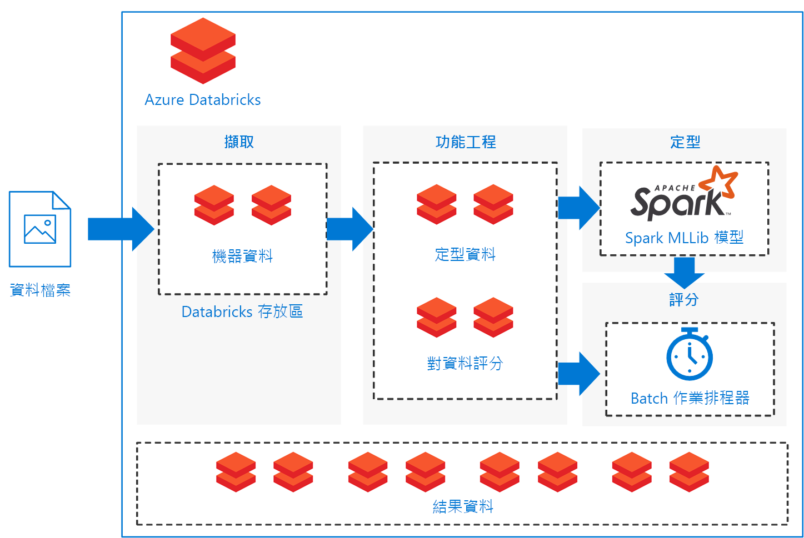

# 在 Azure Databricks 上的 Spark 機器學習服務的批次評分模型Batch scoring of Spark machine learning models on Azure Databricks

此參考架構說明如何建置可調整的解決方案，使用 Azure Databricks (以 Apache Spark 為基礎，並已針對 Azure 最佳化的分析平台) 對排程上的 Apache Spark 分類模型進行批次評分。This reference architecture shows how to build a scalable solution for batch scoring an Apache Spark classification model on a schedule using Azure Databricks, an Apache Spark-based analytics platform optimized for Azure. 此方案可作為範本，並可廣泛用於其他不同情況。The solution can be used as a template that can be generalized to other scenarios.

此架構的參考實作可在  [GitHub][github] 上取得。A reference implementation for this architecture is available on [GitHub][github].

**案例**：資產密集型產業的企業希望能最大限度地降低及縮短與非預期機械故障有關的成本和停機時間。**Scenario**: A business in an asset-heavy industry wants to minimize the costs and downtime associated with unexpected mechanical failures. 他們可以使用從機器收集的 IoT 數據，建立預測性維護模型。Using IoT data collected from their machines, they can create a predictive maintenance model. 此模型讓企業能夠主動維護元件，並在它們故障之前預先修復。This model enables the business to maintain components proactively and repair them before they fail. 企業可以將機械元件物盡其用，藉此控制並縮短停機時間。By maximizing mechanical component use, they can control costs and reduce downtime.

預測性維護模型會從機器收集資料，並保留元件故障的歷史範例。A predictive maintenance model collects data from the machines and retains historical examples of component failures. 然後，就可以使用模型監視元件的目前狀態，並預測指定元件是否很快就會故障。The model can then be used to monitor the current state of the components and predict if a given component will fail in the near future. 如需一般使用案例和模型建立方式，請參閱[適用於預測性維護解決方案的 Azure AI 指南][ai-guide]。For common use cases and modeling approaches, see [Azure AI guide for predictive maintenance solutions][ai-guide].

此參考架構適用於當有元件機器的新資料出現時就會觸發的工作負載。This reference architecture is designed for workloads that are triggered by the presence of new data from the component machines. 處理程序包含下列步驟：Processing involves the following steps:

1. 將資料從外部資料存放區內嵌到 Azure Databricks 資料存放區。Ingest the data from the external data store onto an Azure Databricks data store.

2. 透過將資料轉換為訓練資料集，然後建置 Spark MLlib 模型來訓練機器學習模型。Train a machine learning model by transforming the data into a training data set, then building a Spark MLlib model. MLlib包含最常用的機器學習算法和已最佳化的公用程式，以利用 Spark 資料擴充性功能。MLlib consists of most common machine learning algorithms and utilities optimized to take advantage of Spark data scalability capabilities.

3. 透過將資料轉換成計分資料集，以套用訓練模型來預測 (分類) 元件故障。Apply the trained model to predict (classify) component failures by transforming the data into a scoring data set. 運用 Spark MLLib 模型為資料評分。Score the data with the Spark MLLib model.

4. 將結果儲存在後期處理耗用的 Databricks 資料存放區。Store results on the Databricks data store for post-processing consumption.

 [GitHub][github] 中提供了 Notebooks 以執行這些工作。Notebooks are provided on [GitHub][github] to perform each of these tasks.

## 架構Architecture

此架構定義了完整包含在 [Azure Databricks] [databricks] (根據一組循序執行的 [notebooks][notebooks]) 內的資料流程。The architecture defines a data flow that is entirely contained within [Azure Databricks][databricks] based on a set of sequentially executed [notebooks][notebooks]. 它是由下列元件組成：It consists of the following components:

**[Data files][github]**。**[Data files][github]**. 參考實作使用包含在五個靜態資料檔案中的資組一組模擬資料集。The reference implementation uses a simulated data set contained in five static data files.

**[Ingestion][notebooks]**。**[Ingestion][notebooks]**. 資料擷取 Notebook 會將輸入資料檔案下載到 Databricks 資料集的集合中。The data ingestion notebook downloads the input data files into a collection of Databricks data sets. 在真實案例中，來自 IoT 裝置的資料會串流到 Databricks 可存取的儲存體，例如 Azure SQL Server 或 Azure Blob 儲存體。In a real-world scenario, data from IoT devices would stream onto Databricks-accessible storage such as Azure SQL Server or Azure Blob storage. Databricks 支援多個 [data sources][data-sources]。Databricks supports multiple [data sources][data-sources].

**訓練管線**。**Training pipeline**. 此 Notebook 會執行功能工程設計 Notebook，以從擷取的資料建立分析資料集。This notebook executes the feature engineering notebook to create an analysis data set from the ingested data. 接著它會使用 [Apache Spark MLlib][mllib] 可調整機器學習程式庫，執行可將機器學習模型定型的模型建置 Notebook。It then executes a model building notebook that trains the machine learning model using the [Apache Spark MLlib][mllib] scalable machine learning library.

**評分管線**。**Scoring pipeline**. 此 Notebook 會執行功能工程設計 Notebook，以從擷取的資料建立評分資料集，然後執行評分 Notebook。This notebook executes the feature engineering notebook to create scoring data set from the ingested data and executes the scoring notebook. 評分 Notebook 會使用定型的 [Spark MLlib][mllib-spark] 模型，以針對評分資料集中的觀測產生預測模型。The scoring notebook uses the trained [Spark MLlib][mllib-spark] model to generate predictions for the observations in the scoring data set. 預測會儲存在結果存放區，這是 Databricks 資料存放區中的新資料集。The predictions are stored in the results store, a new data set on the Databricks data store.

**排程器**。**Scheduler**. 已排程的 Databricks [job][job] 會使用 Spark 模型處理批次評分。A scheduled Databricks [job][job] handles batch scoring with the Spark model. 作業會執行評分管道 Notebook，通過 Notebook 參數傳遞變數引數，以指定詳細資料以構建評分資料集，以及指定儲存結果資料集的位置。The job executes the scoring pipeline notebook, passing variable arguments through notebook parameters to specify the details for constructing the scoring data set and where to store the results data set.

此案例會建構為管線流程。The scenario is constructed as a pipeline flow. 每個筆記本已每項作業的批次設定進行最佳化：擷取、功能工程設計、模型建置，以及模型評分。Each notebook is optimized to perform in a batch setting for each of the operations: ingestion, feature engineering, model building, and model scorings. 為實現此目的，功能工程設計 Notebook 的設計目的即在於針對任何定型、校準、測試或評分作業產生通用資料集。To accomplish this, the feature engineering notebook is designed to generate a general data set for any of the training, calibration, testing, or scoring operations. 在此案例中，我們針對這些作業使用暫時分割策略，讓 Notebook 參數能夠用來設定日期範圍篩選。In this scenario, we use a temporal split strategy for these operations, so the notebook parameters are used to set date-range filtering.

由於此案例會建立批次管線，因此我們會提供一組選擇性檢查 Notebook 來探索管線 Notebook 的輸出。Because the scenario creates a batch pipeline, we provide a set of optional examination notebooks to explore the output of the pipeline notebooks. 您可以在 GitHub 存放庫中上找到這些項目：You can find these in the GitHub repository:

- `1a_raw-data_exploring`
- `2a_feature_exploration`
- `2b_model_testing`
- `3b_model_scoring_evaluation`

## 建議Recommendations

設定 Databricks 可讓您能夠載入及部署定型的模型，以搭配使用新資料來進行預測。Databricks is set up so you can load and deploy your trained models to make predictions with new data. 我們針對此案例使用 Databricks 的原因在於它提供了以下額外優點：We used Databricks for this scenario because it provides these additional advantages:

- 使用 Azure Active Directory 認證支援單一登入。Single sign-on support using Azure Active Directory credentials.
- 可針對生產環境管線執行作業的作業排程器。Job scheduler to execute jobs for production pipelines.
- 使用共同作業、儀表板、REST API 的完整互動式 Notebook。Fully interactive notebook with collaboration, dashboards, REST APIs.
- 可以調整成任何規模的無限制叢集。Unlimited clusters that can scale to any size.
- 進階安全性、角色型存取控制和稽核記錄。Advanced security, role-based access controls, and audit logs.

若要與 Azure Databricks 服務互動，請使用網頁瀏覽器中的 Databricks [Workspace][workspace] 介面，或 [command-line interface][cli] (CLI)。To interact with the Azure Databricks service, use the Databricks [Workspace][workspace] interface in a web browser or the [command-line interface][cli] (CLI). 從支援 Python 2.7.9 至 3.6 的任何平台存取 Databricks CLI。Access the Databricks CLI from any platform that supports Python 2.7.9 to 3.6.

參考實作會使用 [notebooks][notebooks] 依序執行工作。The reference implementation uses [notebooks][notebooks] to execute tasks in sequence. 每個 Notebook 都會將中繼資料成品 (定型、測試、評分或結果資料集) 儲存至相同的資料存放區作為輸入資料。Each notebook stores intermediate data artifacts (training, test, scoring, or results data sets) to the same data store as the input data. 目標是要讓您能夠輕鬆地依據自己的特定使用情況運用資料。The goal is to make it easy for you to use it as needed in your particular use case. 在實務上，您會將資料來源連線至 Azure Databricks 執行個體，讓 Notebook 能夠直接在您的儲存體中讀取及寫入。In practice, you would connect your data source to your Azure Databricks instance for the notebooks to read and write directly back into your storage.

您可以視需要透過 Databricks 使用者介面、資料存放區，或 Databricks [CLI][cli] 監視作業執行。You can monitor job execution through the Databricks user interface, the data store, or the Databricks [CLI][cli] as necessary. 使用 Databricks 提供的 [event log][log] 和其他 [metrics][metrics] 監視叢集。Monitor the cluster using the [event log][log] and other [metrics][metrics] that Databricks provides.

## 效能考量Performance considerations

Azure Databricks 叢集預設啟用自動調整規模功能，因此 Databricks 會在執行階段期間，動態重新配置背景工作角色，以考量您的作業特性。An Azure Databricks cluster enables autoscaling by default so that during runtime, Databricks dynamically reallocates workers to account for the characteristics of your job. 您管線的特定部分可能會比其他部分需要更多運算需求。Certain parts of your pipeline may be more computationally demanding than others. Databricks 會在作業的這些階段期間新增其他背景工作角色 (並在不再需要時將它們移除)。Databricks adds additional workers during these phases of your job (and removes them when they’re no longer needed). 自動調整規模可讓您更輕鬆地達到高[叢集使用率][cluster]，因為您不需要佈建叢集以配合工作負載。Autoscaling makes it easier to achieve high [cluster utilization][cluster], because you don’t need to provision the cluster to match a workload.

此外，可使用 [Azure Data Factory][adf] 搭配 Azure Databricks 開發更複雜的排程式管線。Additionally, more complex scheduled pipelines can be developed by using [Azure Data Factory][adf] with Azure Databricks.

## 儲存體考量Storage considerations

在此參考實作中，資料會直接儲存在 Databricks 儲存體內，以簡化程序。In this reference implementation, the data is stored directly within Databricks storage for simplicity. 但是，在生產環境設定中，資料可以儲存在雲端資料存放區，例如 [Azure Blob 儲存體][blob]。In a production setting, however, the data can be stored on cloud data storage such as [Azure Blob Storage][blob]. [Databricks][databricks-connect] 也支援 Azure Data Lake Store、Azure SQL 資料倉儲、Azure Cosmos DB、Apache Kafka 和 Hadoop。[Databricks][databricks-connect] also supports Azure Data Lake Store, Azure SQL Data Warehouse, Azure Cosmos DB, Apache Kafka, and Hadoop.

## 成本考量Cost considerations

Azure Databricks 是包含相關成本的進階 Spark 供應項目。Azure Databricks is a premium Spark offering with an associated cost. 此外，也有標準和進階 Databricks [定價層][pricing]。In addition, there are standard and premium Databricks [pricing tiers][pricing].

針對此案例，標準定價層已足夠。For this scenario, the standard pricing tier is sufficient. 不過如果您的特定應用程式需要自動調整叢集，以處理較大的工作負載或互動式 Databricks 儀表板，進階層級可能會進一步提高成本。However, if your specific application requires automatically scaling clusters to handle larger workloads or interactive Databricks dashboards, the premium level could increase costs further.

解決方案 Notebook 可在任何以 Spark 為基礎的平台上執行，只需最少的編輯即可移除 Databricks 特定封裝。The solution notebooks can run on any Spark-based platform with minimal edits to remove the Databricks-specific packages. 請參閱下列適用於各種 Azure 平台的類似解決方案：See the following similar solutions for various Azure platforms:

- [Azure Machine Learning Studio 中的 Python][python-aml][Python on Azure Machine Learning Studio][python-aml]
- [SQL Server R Services][sql-r][SQL Server R services][sql-r]
- [Azure 資料科學虛擬機器上的 PySpark][py-dvsm][PySpark on an Azure Data Science Virtual Machine][py-dvsm]

## 部署解決方案Deploy the solution

若要部署此參考架構，請依照  [GitHub][github] 儲存機制中描述的步驟，在 Azure Databricks 上的批次中，針對評分 Spark 模型建置可調整規模的解決方案。To deploy this reference architecture, follow the steps described in the [GitHub][github] repository to build a scalable solution for scoring Spark models in batch on Azure Databricks.

## 相關架構Related architectures

我們也已經建置使用 Spark 的參考架構，搭配離線、預先計算的分數建置 [即時建議系統][recommendation]。We have also built a reference architecture that uses Spark for building [real-time recommendation systems][recommendation] with offline, pre-computed scores. 這些建議系統是以批次方式處理分數的常見案例。These recommendation systems are common scenarios where scores are batch-processed.

[adf]: https://azure.microsoft.com/blog/operationalize-azure-databricks-notebooks-using-data-factory/
[ai-guide]: /azure/machine-learning/team-data-science-process/cortana-analytics-playbook-predictive-maintenance
[blob]: https://docs.databricks.com/spark/latest/data-sources/azure/azure-storage.html
[cli]: https://docs.databricks.com/user-guide/dev-tools/databricks-cli.html
[cluster]: https://docs.azuredatabricks.net/user-guide/clusters/sizing.html
[databricks]: /azure/azure-databricks/
[databricks-connect]: /azure/azure-databricks/databricks-connect-to-data-sources
[data-sources]: https://docs.databricks.com/spark/latest/data-sources/index.html
[github]: https://github.com/Azure/BatchSparkScoringPredictiveMaintenance
[job]: https://docs.databricks.com/user-guide/jobs.html
[log]: https://docs.databricks.com/user-guide/clusters/event-log.html
[metrics]: https://docs.databricks.com/user-guide/clusters/metrics.html
[mllib]: https://docs.databricks.com/spark/latest/mllib/index.html
[mllib-spark]: https://docs.databricks.com/spark/latest/mllib/index.html#apache-spark-mllib
[notebooks]: https://docs.databricks.com/user-guide/notebooks/index.html
[pricing]: https://azure.microsoft.com/en-us/pricing/details/databricks/
[python-aml]: https://gallery.azure.ai/Notebook/Predictive-Maintenance-Modelling-Guide-Python-Notebook-1
[py-dvsm]: https://gallery.azure.ai/Tutorial/Predictive-Maintenance-using-PySpark
[recommendation]: /azure/architecture/reference-architectures/ai/real-time-recommendation
[sql-r]: https://gallery.azure.ai/Tutorial/Predictive-Maintenance-Modeling-Guide-using-SQL-R-Services-1
[workspace]: https://docs.databricks.com/user-guide/workspace.html
