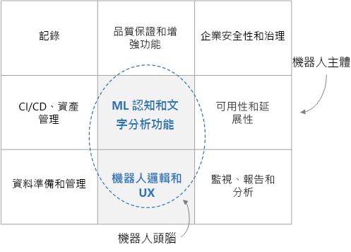

# 企業級交談式聊天機器人

此參考架構說明如何使用 [Azure Bot Framework][bot-framework] 組建企業級交談式聊天機器人。 每個聊天機器人都不同，但有一些常見的模式、工作流程和技術需要注意。 特別是針對提供企業工作負載的聊天機器人，除了核心功能之外，還有許多設計考量。 本文章涵蓋最重要的設計層面，並介紹組建耐用、安全且主動學習之聊天機器人所需的工具。

[![架構圖][0]][0]

此架構中使用的最佳做法範例是完全開放的原始碼，並在 [GitHub][git-repo-base] 提供。 

## 架構

這裡顯示的架構會使用下列 Azure 服務。 您自己的聊天機器人可能無法使用所有這些服務，或可能會納入其他服務。

### 聊天機器人邏輯和使用者體驗

- **[Bot Framework Service] [ bot-framework-service]**  (BFS)。 此服務會將您的聊天機器人連線至通訊應用程式 Cortana、Facebook、Messenger 或 Slack。 它協助您的聊天機器人與使用者之間的通訊。
- **[Azure App Service][app-service]**。 聊天機器人邏輯裝載於 Azure App Service 中。

### 聊天機器人認知和智慧

- **[Language Understanding][luis]** (LUIS)。 [Azure 認知服務][cognitive-services]的一部分，LUIS 可讓您的聊天機器人藉由識別使用者意圖和實體了解自然語言。
- **[Azure 搜尋服務][search]**。 Azure 搜尋服務是受控服務，其提供可快速搜尋的文件索引。
- **[QnA Maker][qna-maker]**。 QnA Maker 是一項雲端式 API 服務，可對您的資料建立交談式的問答層。 通常，它會隨著半結構化內容一起載入，例如常見問題集。 您可以使用它來建立知識庫，以回答自然語言問題。
- **[Web 應用程式][webapp]**. 如果您的聊天機器人需要現有服務未提供的 AI 解決方案，則您可以實作自己的自訂 AI，並將其裝載為 Web 應用程式。 這會提供一個 Web 端點，供您的聊天機器人呼叫。

### 資料擷取

聊天機器人將會依賴必須擷取和準備的未經處理資料。 請考慮下列任何選項來協調此程序：

- **[Azure Data Factory][data-factory]**。 Data Factory 可協調並自動化資料移動和資料轉換。
- **[Logic Apps][logic-apps]**。 Logic Apps 是一個無伺服器平台，用於組建可整合應用程式、資料和服務的工作流程。 Logic Apps 為許多應用程式提供資料連接器，包括 Office 365。
- **[Azure Functions][functions]**。 您可以使用 Azure Functions 來撰寫自訂的無伺服器程式碼，其由[觸發程序][ functions-triggers] &mdash;叫用，例如，每當文件新增至 Blob 儲存體或 Cosmos DB 時即會叫用。

### 記錄和監視

- **[Application Insights][app-insights]**。 使用 Application Insights 來記錄聊天機器人用於監視、 診斷和分析用途的 bot 應用程式計量。
- **[Azure Blob 儲存體][blob]**。 Blob 儲存體已針對儲存大量非結構化資料最佳化。
- **[Cosmos DB][cosmosdb]**。 Cosmos DB 非常適合於儲存半結構化的記錄資料，例如交談。
- **[Power BI][power-bi]**。 您可以使用 Power BI，為您的聊天機器人建立監視儀表板。

### 安全性與治理

- **[Azure Active Directory][aad]** (Azure AD)。 使用者會透過識別提供者 (例如 Azure AD) 進行驗證。 聊天機器人服務會處理驗證流程與 OAuth 權杖管理。 請參閱[透過 Azure Bot 服務將驗證新增至您的聊天機器人][bot-authentication]。
- **[Azure Key Vault][key-vault]**。 使用 Key Vault 儲存認證和其他祕密。

### 品質保證和增強功能

- **[Azure DevOps][devops]**。 提供許多服務進行應用程式管理，包括原始檔控制、組建、測試、部署和專案追蹤。
- **[VS Code][vscode]** 適合於應用程式開發的輕量型程式碼編輯器。 您可以使用任何其他具有類似功能的 IDE。

## 設計考量

就高階來說，交談式聊天機器人可以分成聊天機器人功能 (「大腦」) 和一組周圍需求 (「身體」)。 大腦包含網域感知元件，包括聊天機器人邏輯和 ML 功能。 其他元件為網域不可知的，並會處理非功能性需求，例如 CI/CD、品質保證和安全性。

在深入了解此架構的細節之前，讓我們從通過設計的每個子元件的資料流程開始。 資料流程包含使用者起始和系統起始的資料流程。

### 使用者訊息流程

**驗證**。 使用者開始使用其與機器人的通訊通道所提供的任何機制自行驗證。 聊天機器人架構支援許多通訊通道，包括 Cortana、Microsoft Teams、Facebook Messenger、Kik 和 Slack。 如需通道清單，請參閱[將聊天機器人連線到通道](/azure/bot-service/bot-service-manage-channels)。 當您使用 Azure Bot 服務建立聊天機器人時，會自動設定[網路聊天][webchat]。 此通道可讓使用者在網頁中直接與您的聊天機器人互動。 您也可以使用 [Direct Line](/azure/bot-service/bot-service-channel-connect-directline) 通道，將聊天機器人連線到自訂應用程式。 使用者的身分識別是用來提供角色型存取控制，以及提供個人化的內容。

**使用者訊息**。 驗證後，使用者會傳送一則訊息至聊天機器人。 聊天機器人會讀取訊息，並將其路由傳送至自然語言理解服務，例如 [LUIS](/azure/cognitive-services/luis/)。 此步驟會取得**意圖** (使用者想要做什麼) 和**實體** (使用者感興趣的事物)。 然後，聊天機器人會組建一個查詢，其會傳遞至提供資訊的服務，例如 [Azure 搜尋服務][ search]進行文件擷取、[QnA Maker](https://www.qnamaker.ai/) 取得常見問題集，或自訂知識庫。 聊天機器人會使用這些結果來建構回應。 若要為指定的查詢提供最佳結果，聊天機器人可能會對這些遠端服務進行數次來回呼叫。

**回應**。 此時，聊天機器人已判定最佳回應，並將其傳送給使用者。 如果最佳比對答案的信心分數很低，則回應可能是解疑問題或聊天機器人可能無法充分回應的確認。

**記錄**。 當收到使用者要求或回應時，所有交談動作都應該記錄至記錄存放區，連同效能計量和來自外部服務的一般錯誤。 稍後診斷問題並改善系統時，這些記錄很有用。

**意見反應**。 另一個好做法是收集使用者意見反應和滿意度分數。 作為機器人最終回應的後續動作，機器人應該要求使用者對於回覆做出滿意度評價。 意見反應可以協助您解決自然語言理解的冷啟動問題，並持續提高回應的精確度。

### 系統資料流程

**ETL**。 聊天機器人會依賴後端 ETL 程序從未經處理資料擷取的資訊與知識。 此資料可能是結構化 (SQL 資料庫)、半結構化 (CRM 系統、常見問題集) 或非結構化 (Word 文件、PDF、Web 記錄)。 ETL 子系統會依固定排程擷取資料。 內容會進行轉換並擴充，然後載入至中繼資料存放區，例如 Cosmos DB 或 Azure Blob 儲存體。

然後，中繼存放區中的資料會進行索引編製並存入 Azure 搜尋服務進行文件擷取、載入至 QnA Maker 以建立問答配對，或載入至自訂 Web 應用程式進行非結構化文字處理。 資料也會用來定型 LUIS 模型，以取得意圖和進行實體擷取。

**品質保證**。 交談記錄用來診斷並修正錯誤、提供如何使用聊天機器人的見解，以及追蹤整體效能。 意見反應資料有助於重新定型 AI 模型，以提高聊天機器人效能。

## 建立 Bot

甚至在您撰寫一行程式碼之前，請務必撰寫功能規格，讓開發小組清楚知道預期機器人做什麼。 規格應該包括合理全方位的使用者輸入清單，以及在各種知識領域中預期的聊天機器人回應。 這份即時文件將是開發和測試您的聊天機器人的寶貴指南。

### 擷取資料

接下來，找出可讓機器人以智慧方式與使用者互動的資料來源。 如先前所述，這些資料來源可以包含結構化、半結構化或非結構化資料集。 當您開始使用時，好方法是對中央存放區 (例如 Cosmos DB 或 Azure 儲存體) 進行資料的一次性複製。 當您繼續，您應該建立要保留這項資料目前的自動的資料管線擷取。 自動擷取管線的選項包括 Data Factory、Functions 和 Logic Apps。 根據資料存放區和結構描述，您可能使用這些方法的組合。

開始使用時，使用 Azure 入口網站手動建立 Azure 資源，這是合理的作法。 稍後，您應該仔細考慮如何自動部署這些資源。

### 核心聊天機器人邏輯與 UX

一旦有了一種規格和一些資料，就可以開始將您的聊天機器人付諸實現。 讓我們專注於核心聊天機器人邏輯。 這是處理與使用者交談的程式碼，包括路由邏輯、解疑邏輯和記錄。 開始熟悉 [Bot Framework][bot-framework]，包括：

- 架構中使用的基本概念和術語，尤指[交談][回合]和[活動]。
- [Bot Connector 服務](/azure/bot-service/rest-api/bot-framework-rest-connector-quickstart)，處理聊天機器人與您通道之間的網路。
- 如何維護交談[狀態](/azure/bot-service/bot-builder-concept-state)，放在記憶體中還是更適合放在存放區中，例如 Azure Blob 儲存體或 Azure Cosmos DB。
- [中介軟體](/azure/bot-service/bot-builder-basics#middleware)，以及如何使用它來連結您的聊天機器人與外部服務，例如認知服務。

如需豐富的[使用者體驗](/azure/bot-service/bot-service-design-user-experience)，有許多選項。

- 您可以使用[卡](/azure/bot-service/bot-service-design-user-experience#cards)，來包含按鈕、影像、浮動切換和功能表。
- 聊天機器人可以支援語音。
- 您甚至可以將聊天機器人內嵌在應用程式或網站，並使用其裝載所在應用程式的功能。

若要開始，您可以使用 [Azure Bot Service](/azure/bot-service/bot-service-quickstart) 來線上組建聊天機器人，從可用的 C# 和 Node.js 範本中選取。 不過，當您的聊天機器人越來越複雜時，您將需要在本機建立聊天機器人，然後將其部署至 Web。 選擇 IDE (例如 Visual Studio 或 Visual Studio Code) 和程式設計語言。 SDK 提供下列語言版本：

- [C#](https://github.com/microsoft/botbuilder-dotnet)
- [JavaScript](https://github.com/microsoft/botbuilder-js)
- [Java](https://github.com/microsoft/botbuilder-java) (預覽)
- [Python](https://github.com/microsoft/botbuilder-python) (預覽)

做為起點，您可以針對使用 Azure Bot Service 建立的聊天機器人下載原始程式碼。 您也可以找到[範例程式碼](https://github.com/Microsoft/BotBuilder-Samples/blob/master/README.md)，從簡單的回應聊天機器人到更複雜且與各種 AI 服務整合的聊天機器人。

### 在您的聊天機器人中加入智慧

針對具有適當定義之命令清單的簡單聊天機器人，您可以使用規則型方法，透過 regex 剖析使用者輸入。 這具有確定性和可理解的優勢。 不過，當您的聊天機器人需要理解其他自然語言訊息的意圖和實體時，有 AI 服務可以提供協助。

- LUIS 是特別設計來理解使用者意圖和實體。 您利用相關[使用者輸入](/azure/cognitive-services/luis/luis-concept-utterance)和所需回應的中等大小集合將其定型，而且它會傳回使用者特定訊息的意圖和實體。

- Azure 搜尋服務可以與 LUIS 一起運作。 使用 Azure 搜尋服務，您可以對所有的相關資料建立可搜尋索引。 聊天機器人會查詢這些索引，以取得 LUIS 所擷取的實體。 Azure 搜尋服務也支援[同義字][synonyms]，這可擴大正確的字對應網。

- QnA Maker 是另一種服務，其設計來針對指定的問題傳回答案。 它通常是透過半結構化資料 (例如常見問題集) 來定型。

您的聊天機器人可以使用其他 AI 服務，來進一步豐富使用者體驗。 [預先建置 AI 的認知服務套件](https://azure.microsoft.com/en-us/services/cognitive-services/?v=18.44a) 服務 (包括 LUIS 和 QnA Maker) 具有視覺、語音、語言、搜尋和定位的服務。 您可以快速新增功能，例如語言翻譯、拼字檢查、情感分析、OCR、定位感知，以及內容仲裁等功能。 這些服務可以做為聊天機器人中的中介軟體模組連接起來，來更自然且更有智慧地與使用者動互動。

另一個選項是整合自己的自訂 AI 服務。 這種方法更複雜，但在機器學習演算法、定型和模型方面為您提供完整的彈性。 例如，您可以實作自己的主題模型化，並使用 [LDA] [ lda] 這類演算法來尋找類似或相關文件。 有一個不錯的方法，就是將您的自訂 AI 解決方案公開為 Web 服務端點，並從核心聊天機器人邏輯中呼叫端點。 Web 服務可以裝載於 VM 叢集中的 App Service。 [Azure Machine Learning] [ aml] 提供多個服務和程式庫，以協助您[定型](https://github.com/Azure/MachineLearningNotebooks/tree/master/how-to-use-azureml/training)和[部署](https://github.com/Azure/MachineLearningNotebooks/tree/master/how-to-use-azureml/deployment)您的模型。

## 品質保證和增強功能

**記錄**。 記錄使用者與機器人的交談，包括基礎效能計量和任何錯誤。 這些記錄在偵錯問題、了解使用者互動，以及改善系統方面非常有用。 不同的資料存放區可能適用於不同類型的記錄。 例如，考慮 Application Insights 用於 Web 記錄、Cosmos DB 用於交談，以及 Azure 儲存體用於大型承載。 請參閱[直接寫入 Azure 儲存體][transcript-storage]。

**意見反應**。 也請務必了解滿意的使用者如何與其聊天機器人互動。 如果您有一筆使用者意見反應的記錄，則可以使用此資料，致力於改善某些互動，並重新定型 AI 模型以提高效能。 使用意見反應來重新定型您系統中的模型，例如 LUIS。

**測試**。 測試聊天機器人包括單元測試、整合測試、迴歸測試和功能測試。 進行測試時，建議您記錄來自外部服務 (例如 Azure 搜尋服務或 QnA Maker) 的實際 HTTP 回應，讓它們可在單元測試期間播放，而無需對外部服務進行實際的網路呼叫。

>[!NOTE]
> 若要在這些區域中進行開發，請查看 [Botbuilder Utils for JavaScript][git-repo-base]。 此存放庫包含使用 [Microsoft Bot Framework v4] [ bot-framework] 組建並執行 Node.js 之聊天機器人的範例公用程式碼。 包括下列套件：
>
> - [Cosmos DB 記錄存放區][cosmosdb-logger]。 顯示如何在 Cosmos DB 儲存和查詢聊天機器人記錄。
> - [Application Insights 記錄存放區][appinsights-logger]。 顯示如何在 Application Insights 儲存和查詢聊天機器人記錄。
> - [Feedback Collection Middleware][feedback-util]。 為聊天機器人提供使用者意見反應要求機制的範例中介軟體。
> - [Http Test Recorder][testing util]。 記錄來自聊天機器人外部服務的 HTTP 流量。 它預先建置 LUIS、Azure 搜尋服務和 QnAMaker 的支援，但提供擴充功能以支援任何服務。 這可協助您自動測試聊天機器人。
>
> 這些套件是以公用程式範例程式碼形式提供，且未隨附任何支援或更新保證。

## 可用性考量

向聊天機器人推出新功能或錯誤修正時，最好使用多個部署環境，例如暫存和生產環境。 使用來自 [Azure DevOps][devops] 的部署[位置][slots]可讓您執行這項操作，而不需要停機。 您可以在暫存環境中測試最新升級，然後再將它們切換至生產環境。 在處理負載方面，App Service 的設計旨在手動或自動相應增加或減小。 因為您的聊天機器人裝載於 Microsoft 的全球資料中心基礎結構中，所以 App Service SLA 會承諾高可用性。

## 安全性考量

如同任何其他應用程式，聊天機器人可以設計來正確處理敏感性資料。 因此，限制誰可以登入和使用聊天機器人。 也會根據使用者的身分識別或角色限制可以存取哪些資料。 使用 Azure AD 進行身分識別和存取控制，以及使用 Key Vault 來管理金鑰和祕密。

## 管理性考量

### 監視和報告

一旦您的聊天機器人在生產環境中執行，就需要 DevOps 團隊來保持這種方式。 持續監視系統，以確保聊天機器人以尖峰效能操作。 使用傳送至 Application Insights 或 Cosmos DB 的記錄來建立監視儀表板，方法為使用 Application Insights 本身、Power BI 或自訂的 Web 應用程式儀表板。 如果發生嚴重錯誤或效能低於可接受的閾值，請將警示傳送至 DevOps 團隊。

### 自動部署資源

聊天機器人本身只是大型系統的一部分，此系統會為其提供最新資料，並確保其正常運作。 所有其他 Azure 資源 &mdash;資料協調流程服務 (例如 Data Factory)、儲存體服務 (例如 Cosmos DB) 等等&mdash; 必須加以部署。 Azure Resource Manager 提供一致的管理層，您可以透過 Azure 入口網站、PowerShell 或 Azure CLI 來存取。 如需速度與一致性，最好使用其中一種方法，將您的部署自動化。

### 持續聊天機器人部署

您可以從 IDE 或從命令列直接部署聊天機器人，例如 Azure CLI 邏輯。 不過，當您的聊天機器人成熟時，最好利用 CI/CD 解決方案 (例如 Azure DevOps) 來使用持續部署程序，如[設定持續部署](/azure/bot-service/bot-service-build-continuous-deployment)所述。 這是一種很好的方法，可以減輕在近乎生產環境中測試機器人中新功能和修正的摩擦。 具有多個部署環境 (通常至少有暫存和生產環境) 也是個不錯的主意。 Azure DevOps 支援這個方法。

<!-- links -->

[0]: ./_images/conversational-bot.png
[aad]: /azure/active-directory/
[活動]: /azure/bot-service/rest-api/bot-framework-rest-connector-activities
[aml]: /azure/machine-learning/service/
[app-insights]: /azure/azure-monitor/app/app-insights-overview
[app-service]: /azure/app-service/
[blob]: /azure/storage/blobs/storage-blobs-introduction
[bot-authentication]: /azure/bot-service/bot-builder-authentication
[bot-framework]: https://dev.botframework.com/
[bot-framework-service]: /azure/bot-service/bot-builder-basics
[cognitive-services]: /azure/cognitive-services/welcome
[交談]: /azure/bot-service/bot-service-design-conversation-flow
[cosmosdb]: /azure/cosmos-db/
[data-factory]: /azure/data-factory/
[data-factory-ref-arch]: ../data/enterprise-bi-adf.md
[devops]: https://azure.microsoft.com/solutions/devops/
[functions]: /azure/azure-functions/
[functions-triggers]: /azure/azure-functions/functions-triggers-bindings
[git-repo-appinsights-logger]: https://github.com/Microsoft/botbuilder-utils-js/tree/master/packages/botbuilder-transcript-app-insights
[git-repo-base]: https://github.com/Microsoft/botbuilder-utils-js
[git-repo-cosmosdb-logger]: https://github.com/Microsoft/botbuilder-utils-js/tree/master/packages/botbuilder-transcript-cosmosdb
[git-repo-feedback-util]: https://github.com/Microsoft/botbuilder-utils-js/tree/master/packages/botbuilder-feedback
[git-repo-testing-util]: https://github.com/Microsoft/botbuilder-utils-js/tree/master/packages/botbuilder-http-test-recorder
[testing-util]: https://github.com/Microsoft/botbuilder-utils-js/tree/master/packages/botbuilder-http-test-recorder
[key-vault]: /azure/key-vault/
[lda]: https://wikipedia.org/wiki/Latent_Dirichlet_allocation/
[logic-apps]: /azure/logic-apps/logic-apps-overview
[luis]: /azure/cognitive-services/luis/
[power-bi]: /power-bi/
[qna-maker]: /azure/cognitive-services/QnAMaker/
[search]: /azure/search/
[slots]: /azure/app-service/deploy-staging-slots/
[synonyms]: /azure/search/search-synonyms
[transcript-storage]: /azure/bot-service/bot-builder-howto-v4-storage
[回合]: /azure/bot-service/bot-builder-basics#defining-a-turn
[vscode]: https://azure.microsoft.com/products/visual-studio-code/
[webapp]: /azure/app-service/overview
[webchat]: /azure/bot-service/bot-service-channel-connect-webchat?view=azure-bot-service-4.0/

[cosmosdb-logger]: https://github.com/Microsoft/botbuilder-utils-js/tree/master/packages/botbuilder-transcript-cosmosdb
[appinsights-logger]: https://github.com/Microsoft/botbuilder-utils-js/tree/master/packages/botbuilder-transcript-app-insights
[feedback-util]: https://github.com/Microsoft/botbuilder-utils-js/tree/master/packages/botbuilder-feedback
[testing util]: https://github.com/Microsoft/botbuilder-utils-js/tree/master/packages/botbuilder-http-test-recorder

