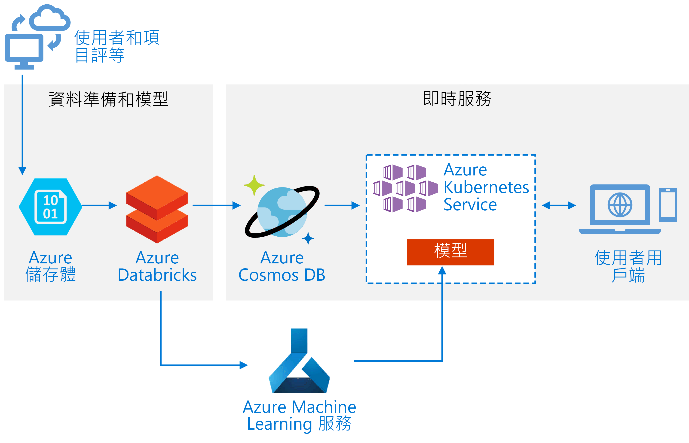
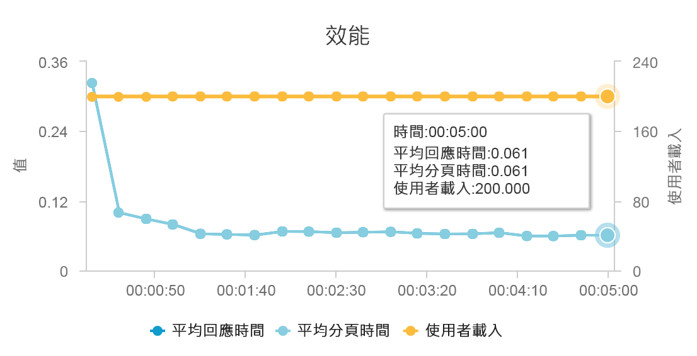
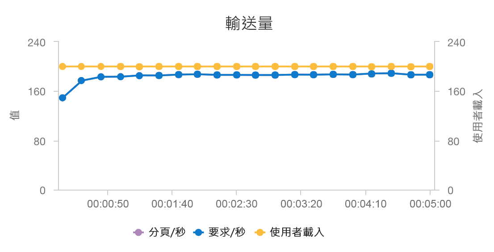

# 在 Azure 上建置即時建議 APIBuild a real-time recommendation API on Azure

此參考架構會示範如何使用 Azure Databricks 定型建議模型，並使用 Azure Cosmos DB、Azure Machine Learning 和 Azure Kubernetes Service (AKS) 將其部署為 API。This reference architecture shows how to train a recommendation model using Azure Databricks and deploy it as an API by using Azure Cosmos DB, Azure Machine Learning, and Azure Kubernetes Service (AKS). 此架構可廣泛用在大部分的建議引擎案例，包括產品、電影和新聞的建議。This architecture can be generalized for most recommendation engine scenarios, including recommendations for products, movies, and news.

此架構的參考實作可在 [GitHub][als-example] 上取得。A reference implementation for this architecture is available on [GitHub][als-example].

**案例**：媒體組織想要提供電影或影片建議給其使用者。**Scenario**: A media organization wants to provide movie or video recommendations to its users. 藉由提供個人化的建議，組織就可達成數個商務目標，包括增加的點擊率、增加的網站參與度和更高的使用者滿意度。By providing personalized recommendations, the organization meets several business goals, including increased click-through rates, increased engagement on site, and higher user satisfaction.

此參考架構適用於定型和部署即時建議服務 API，而這可為特定使用者提供前 10 個電影建議。This reference architecture is for training and deploying a real-time recommender service API that can provide the top 10 movie recommendations for a given user.

此建議模型的資料流程如下所示：The data flow for this recommendation model is as follows:

1. 追蹤使用者行為。Track user behaviors. 例如，當使用者對影片進行評等，或是按一下產品或新聞文章時，後端服務可能會加以記錄。For example, a backend service might log when a user rates a movie or clicks a product or news article.

2. 將資料從可用的[資料來源][data-source]載入至 Azure Databricks。Load the data into Azure Databricks from an available [data source][data-source].

3. 準備資料，並將資料分割成訓練集和測試集來定型模型。Prepare the data and split it into training and testing sets to train the model. ([本指南][guide]會說明資料分割選項。)([This guide][guide] describes options for splitting data.)

4. 對資料套用 [Spark 協同篩選][als]模型。Fit the [Spark Collaborative Filtering][als] model to the data.

5. 使用評等和排名計量來評估模型的品質。Evaluate the quality of the model using rating and ranking metrics. ([本指南][eval-guide]會提供用來評估您建議程式的計量相關資料。)([This guide][eval-guide] provides details about the metrics you can evaluate your recommender on.)

6. 預先計算每個使用者和存放區的前 10 個建議，並作為 Azure Cosmos DB 中的快取。Precompute the top 10 recommendations per user and store as a cache in Azure Cosmos DB.

7. 使用 Azure Machine Learning API 將 API 服務部署至 AKS，以將 API 容器化並對其進行部署。Deploy an API service to AKS using the Azure Machine Learning APIs to containerize and deploy the API.

8. 當後端服務取得使用者的要求時，呼叫 AKS 中裝載的建議 API 來取得前 10 個建議，並向使用者顯示這些建議。When the backend service gets a request from a user, call the recommendations API hosted in AKS to get the top 10 recommendations and display them to the user.

## 架構Architecture

此架構由下列元件組成：This architecture consists of the following components:

[Azure Databricks][databricks]。[Azure Databricks][databricks]. Databricks 是開發環境，用來準備輸入資料和定型 Spark 叢集上的建議程式模型。Databricks is a development environment used to prepare input data and train the recommender model on a Spark cluster. Azure Databricks 也會提供可在 Notebook 上執行和共同作業的互動式工作區，以進行任何資料處理或機器學習工作。Azure Databricks also provides an interactive workspace to run and collaborate on notebooks for any data processing or machine learning tasks.

[Azure Kubernetes Service][aks] (AKS)。[Azure Kubernetes Service][aks] (AKS). AKS 會用來部署及操作化 Kubernetes 叢集上的機器學習模型服務 API。AKS is used to deploy and operationalize a machine learning model service API on a Kubernetes cluster. AKS 會裝載容器化的模型，並提供符合輸送量需求的延展性、身分識別和存取管理，以及記錄和健康情況監視。AKS hosts the containerized model, providing scalability that meets your throughput requirements, identity and access management, and logging and health monitoring.

[Azure Cosmos DB][cosmosdb]。[Azure Cosmos DB][cosmosdb]. Cosmos DB 是全域分散式資料庫服務，用來儲存每個使用者的前 10 個建議電影。Cosmos DB is a globally distributed database service used to store the top 10 recommended movies for each user. Azure Cosmos DB 十分適用於此案例，因為其提供低延遲 (第 99 個百分位數上的 10 毫秒) 來讀取指定使用者的前幾個建議項目。Azure Cosmos DB is well-suited for this scenario, because it provides low latency (10 ms at 99th percentile) to read the top recommended items for a given user.

[Azure Machine Learning 服務][mls]。[Azure Machine Learning Service][mls]. 這項服務可用來追蹤和管理機器學習模型，然後將這些模型封裝並部署至可調整的 AKS 環境。This service is used to track and manage machine learning models, and then package and deploy these models to a scalable AKS environment.

[Microsoft Recommenders][github]。[Microsoft Recommenders][github]. 此開放原始碼存放庫包含公用程式的程式碼和範例，可協助使用者開始建置、評估和操作化建議系統。This open-source repository contains utility code and samples to help users get started in building, evaluating, and operationalizing a recommender system.

## 效能考量Performance considerations

效能是即時建議的主要考量，因為建議通常會落在網站上使用者所提要求的關鍵路徑上。Performance is a primary consideration for real-time recommendations, because recommendations usually fall in the critical path of the request a user makes on your site.

結合 AKS 和 Azure Cosmos DB 可讓此架構提供好的起點，並以最少的額外負荷為中型工作負載提供建議項目。The combination of AKS and Azure Cosmos DB enables this architecture to provide a good starting point to provide recommendations for a medium-sized workload with minimal overhead. 在有 200 個並行使用者的負載測試中，此架構以大約 60 毫秒的延遲中位數提供建議項目，並以每秒 180 個要求的輸送量執行。Under a load test with 200 concurrent users, this architecture provides recommendations at a median latency of about 60 ms and performs at a throughput of 180 requests per second. 負載測試會針對預設的部署組態執行 (3 x D3 v2 AKS 叢集，包含 12 個 vCPU、42 GB 記憶體和為 Azure Cosmos DB 佈建的每秒 11,000 個[要求單位 (RU)][ru])。The load test was run against the default deployment configuration (a 3x D3 v2 AKS cluster with 12 vCPUs, 42 GB of memory, and 11,000 [Request Units (RUs) per second][ru] provisioned for Azure Cosmos DB).

之所以建議使用 Azure Cosmos DB，是因為其具有周全的全域散發功能，以及滿足任何資料庫需求的實用性。Azure Cosmos DB is recommended for its turnkey global distribution and usefulness in meeting any database requirements your app has. 如需稍微[更快的延遲][latency]，請考慮使用 [Azure Redis 快取][redis]來處理查閱作業，而不是使用 Azure Cosmos DB。For slightly [faster latency][latency], consider using [Azure Redis Cache][redis] instead of Azure Cosmos DB to serve lookups. 若系統高度依賴後端存放區中的資料，則 Redis 快取可提升該系統的效能。Redis Cache can improve performance of systems that rely highly on data in back-end stores.

## 延展性考量Scalability considerations

如果您不打算使用 Spark，或者您的工作負載較小且不需要散發功能，那麼請考慮使用[資料科學虛擬機器][dsvm] (DSVM)，而不是 Azure Databricks。If you don't plan to use Spark, or you have a smaller workload where you don't need distribution, consider using [Data Science Virtual Machine][dsvm] (DSVM) instead of Azure Databricks. DSVM 是 Azure 虛擬機器，內含機器學習服務和資料科學的深度學習架構和工具。DSVM is an Azure virtual machine with deep learning frameworks and tools for machine learning and data science. 如同 Azure Databricks，在 DSVM 中建立的任何模型都可以透過 Azure Machine Learning 成為 AKS 上可操作的服務。As with Azure Databricks, any model you create in a DSVM can be operationalized as a service on AKS via Azure Machine Learning.

在訓練期間，您可以在 Azure Databricks 中佈建更大的固定大小 Spark 叢集，或設定[自動調整][autoscaling]。During training, provision a larger fixed-size Spark cluster in Azure Databricks or configure [autoscaling][autoscaling]. 啟用自動調整時，Databricks 會監視您叢集上的負載，並根據需求來進行相應增加或減少。When autoscaling is enabled, Databricks monitors the load on your cluster and scales up and downs when required. 如果您有大量資料，而且您想要減少準備資料或建立工作模型所需的時間，請佈建或擴充為較大的叢集。Provision or scale out a larger cluster if you have a large data size and you want to reduce the amount of time it takes for data preparation or modeling tasks.

調整 AKS 叢集以符合您的效能和輸送量需求。Scale the AKS cluster to meet your performance and throughput requirements. 為充分利用叢集，請謹慎地相應增加 [Pod][scale] 數目，並調整叢集的[節點][nodes]，以符合您服務的需求。Take care to scale up the number of [pods][scale] to fully utilize the cluster, and to scale the [nodes][nodes] of the cluster to meet the demand of your service. 若要深入了解如何調整叢集，以符合建議服務的效能和輸送量需求，請參閱[調整 Azure Container Service 叢集][blog]\(英文\)。For more information on how to scale your cluster to meet the performance and throughput requirements of your recommender service, see [Scaling Azure Container Service Clusters][blog].

若要管理 Azure Cosmos DB 效能，請評估每秒所需的讀取次數，並佈建所需的[每秒 RU][ru] (輸送量) 數量。To manage Azure Cosmos DB performance, estimate the number of reads required per second, and provision the number of [RUs per second][ru] (throughput) needed. 使用[資料分割與水平調整][partition-data]的最佳做法。Use best practices for [partitioning and horizontal scaling][partition-data].

## 成本考量Cost considerations

此案例中的主要成本動因為：The main drivers of cost in this scenario are:

- 訓練所需的 Azure Databricks 叢集大小。The Azure Databricks cluster size required for training.
- 為符合您效能需求所需的 AKS 叢集大小。The AKS cluster size required to meet your performance requirements.
- 為符合您效能需求所佈建的 Azure Cosmos DB RU。Azure Cosmos DB RUs provisioned to meet your performance requirements.

藉由減少重新定型的頻率和關閉不使用的 Spark 叢集來管理 Azure Databricks 成本。Manage the Azure Databricks costs by retraining less frequently and turning off the Spark cluster when not in use. AKS 和 Azure Cosmos DB 的成本會與您網站所需的效能與輸送量密切相關，並會根據您網站的流量來相應增加和減少。The AKS and Azure Cosmos DB costs are tied to the throughput and performance required by your site and will scale up and down depending on the volume of traffic to your site.

## 部署解決方案Deploy the solution

若要部署此架構，請遵循**Azure Databricks**中的指示[安裝程式文件][setup]。To deploy this architecture, follow the **Azure Databricks** instructions in the [setup document][setup]. 簡單地說，指示會要求您必須：Briefly, the instructions require you to:

1. 建立 [Azure Databricks 工作區][workspace]。Create an [Azure Databricks workspace][workspace].

1. 建立新叢集使用 Azure Databricks 中的下列組態：Create a new cluster with the following configuration in Azure Databricks:

    - 叢集模式：標準Cluster mode: Standard
    - Databricks 執行階段版本：4.3 （包含 Apache Spark 2.3.1，Scala 2.11）Databricks Runtime Version: 4.3 (includes Apache Spark 2.3.1, Scala 2.11)
    - Python 版本：3Python Version: 3
    - 驅動程式類型：Standard\_DS3\_v2Driver Type: Standard\_DS3\_v2
    - 背景工作角色類型：Standard\_DS3\_v2 (按照需求決定最小值和最大值)Worker Type: Standard\_DS3\_v2 (min and max as required)
    - 自動終止：(按照需求)Auto Termination: (as required)
    - Spark 組態：(按照需求)Spark Config: (as required)
    - 環境變數：(按照需求)Environment Variables: (as required)

1. 建立個人存取權杖內[Azure Databricks 工作區][workspace]。Create a personal access token within the [Azure Databricks workspace][workspace]. 請參閱 Azure Databricks 的驗證[文件][ adbauthentication]如需詳細資訊。See the Azure Databricks authentication [documentation][adbauthentication] for details.

1. 複製品[Microsoft Recommender] [ github]存放庫到環境，您可以在其中執行指令碼 （例如本機電腦）。Clone the [Microsoft Recommenders][github] repository into an environment where you can execute scripts (e.g. your local computer).

1. 請遵循**快速安裝**安裝程式指示[安裝相關的程式庫][ setup]在 Azure Databricks 上。Follow the **Quick install** setup instructions to [install the relevant libraries][setup] on Azure Databricks.

1. 請遵循**快速安裝**安裝程式指示[準備運算化的 Azure Databricks][setupo16n]。Follow the **Quick install** setup instructions to [prepare Azure Databricks for operationalization][setupo16n].

1. 匯入[ALS 電影運算化 notebook] [ als-example]到工作區。Import the [ALS Movie Operationalization notebook][als-example] into your workspace. 登入您的 Azure Databricks 工作區之後，執行下列作業：After logging into your Azure Databricks Workspace, do the following:

    a.a. 按一下 **首頁**工作區的左邊。Click **Home** on the left side of the workspace.

    b.b. 以滑鼠右鍵按一下您的主目錄中的泛空白字元。Right-click on white space in your home directory. 選取 [匯入]。Select **Import**.

    c.c. 選取  **URL**，並將下列內容貼入的文字欄位： `https://github.com/Microsoft/Recommenders/blob/master/notebooks/05_operationalize/als_movie_o16n.ipynb`Select **URL**, and paste the following into the text field: `https://github.com/Microsoft/Recommenders/blob/master/notebooks/05_operationalize/als_movie_o16n.ipynb`

    d.d. 按一下 [匯入] 。Click **Import**.

1. 開啟 Azure Databricks 中的 notebook，並將連接設定的叢集。Open the notebook within Azure Databricks and attach the configured cluster.

1. 執行 notebook 建立建立建議 API 所需的 Azure 資源，提供指定使用者的前 10 個電影建議。Run the notebook to create the Azure resources required to create a recommendation API that provides the top-10 movie recommendations for a given user.

## 相關架構Related architectures

我們也已建置使用 Spark 與 Azure Databricks 的參考架構，執行排定的 [批次評分程序][batch-scoring]。We have also built a reference architecture that uses Spark and Azure Databricks to execute scheduled [batch-scoring processes][batch-scoring]. 請參閱該參考架構，以了解定期產生新建議的建議方法。See that reference architecture to understand a recommended approach for generating new recommendations routinely.

<!-- links -->
[aci]: /azure/container-instances/container-instances-overview
[aad]: /azure/active-directory-b2c/active-directory-b2c-overview
[adbauthentication]: https://docs.azuredatabricks.net/api/latest/authentication.html#generate-a-token
[aks]: /azure/aks/intro-kubernetes
[als]: https://spark.apache.org/docs/latest/ml-collaborative-filtering.html
[als-example]: https://github.com/Microsoft/Recommenders/blob/master/notebooks/05_operationalize/als_movie_o16n.ipynb
[autoscaling]: https://docs.azuredatabricks.net/user-guide/clusters/sizing.html
[autoscale]: https://docs.azuredatabricks.net/user-guide/clusters/sizing.html#autoscaling
[availability]: /azure/architecture/checklist/availability
[batch-scoring]: /azure/architecture/reference-architectures/ai/batch-scoring-databricks
[blob]: /azure/storage/blobs/storage-blobs-introduction
[blog]: https://blogs.technet.microsoft.com/machinelearning/2018/03/20/scaling-azure-container-service-cluster/
[clusters]: https://docs.azuredatabricks.net/user-guide/clusters/configure.html
[cosmosdb]: /azure/cosmos-db/introduction
[data-source]: https://docs.azuredatabricks.net/spark/latest/data-sources/index.html
[databricks]: /azure/azure-databricks/what-is-azure-databricks
[dsvm]: /azure/machine-learning/data-science-virtual-machine/overview
[dsvm-ubuntu]: /azure/machine-learning/data-science-virtual-machine/dsvm-ubuntu-intro
[eval-guide]: https://github.com/Microsoft/Recommenders/blob/master/notebooks/03_evaluate/evaluation.ipynb
[free]: https://azure.microsoft.com/free/?WT.mc_id=A261C142F
[github]: https://github.com/Microsoft/Recommenders
[guide]: https://github.com/Microsoft/Recommenders/blob/master/notebooks/01_prepare_data/data_split.ipynb
[latency]: https://github.com/jessebenson/azure-performance
[mls]: /azure/machine-learning/service/
[n-tier]: /azure/architecture/reference-architectures/n-tier/n-tier-cassandra
[ndcg]: https://en.wikipedia.org/wiki/Discounted_cumulative_gain
[nodes]: /azure/aks/scale-cluster
[notebook]: https://github.com/Microsoft/Recommenders/notebooks/00_quick_start/als_pyspark_movielens.ipynb
[partition-data]: /azure/cosmos-db/partition-data
[redis]: /azure/redis-cache/cache-overview
[regions]: https://azure.microsoft.com/global-infrastructure/services/?products=virtual-machines&regions=all
[resiliency]: /azure/architecture/resiliency/
[ru]: /azure/cosmos-db/request-units
[sec-docs]: /azure/security/
[setup]: https://github.com/Microsoft/Recommenders/blob/master/SETUP.md#repository-installation
[setupo16n]: https://github.com/Microsoft/Recommenders/blob/master/SETUP.md#prepare-azure-databricks-for-operationalization
[scale]: /azure/aks/tutorial-kubernetes-scale
[sla]: https://azure.microsoft.com/support/legal/sla/virtual-machines/v1_8/
[vm-size]: /azure/virtual-machines/virtual-machines-linux-change-vm-size
[workspace]: https://docs.azuredatabricks.net/getting-started/index.html
