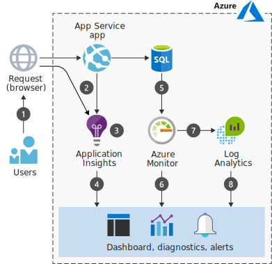

# Azure 上的 Web 應用程式監視

Azure 平台即服務 (PaaS) 供應項目可為您管理計算資源，並且改變您監視部署的方式。 Azure 包含多項監視服務，各自會執行特定的角色。 這些服務可共同提供一套全面性解決方案，以便收集、分析來自您的應用程式和所用 Azure 資源的遙測，並採取行動。

此案例說明您可以使用的監視服務，以及描述可搭配多個資料來源使用的資料流程模型。 說到監視，許多工具和服務都會使用 Azure 部署。 在此案例中，我們明確地選擇立即可用的服務，因為這些服務取用方便。 本文稍後會討論其他監視選項。

## 相關使用案例

其他相關的使用案例包括：

- 檢測用於監視遙測的 Web 應用程式。
- 針對 Azure 上部署的應用程式收集前端和後端遙測。
- 監視與 Azure 上的服務相關聯的計量和配額。

## 架構

此案例會使用受控 Azure 環境來裝載應用程式和資料層。 整個案例的資料流程如下所示：

1. 使用者會與應用程式互動。
2. 瀏覽器和應用程式服務會發出遙測。
3. Application Insights 會收集及分析應用程式健康情況、效能和使用量資料。
4. 開發人員與系統管理員可以檢閱健康情況、效能及使用量資訊。
5. Azure SQL Database 會發出遙測。
6. Azure 監視器會收集並分析基礎結構計量與配額。
7. Log Analytics 會收集及分析記錄與計量。
8. 開發人員與系統管理員可以檢閱健康情況、效能及使用量資訊。

### 元件

- [Azure App Service](/azure/app-service/) 是一項 PaaS 服務，可在受控虛擬機器中建置及裝載應用程式。 系統會為您管理應用程式執行所在的基礎計算基礎結構。 App Service 可供監視資源使用量配額和應用程式計量、記錄診斷資訊，以及根據計量發出警示。 更棒的是，您可以使用 Application Insights 來建立[可用性測試][availability-tests]，以從不同的區域測試您的應用程式。
- [Application Insights][application-insights] 是開發人員所適用的可延伸「應用程式效能管理」(APM) 服務，可支援多個平台。 它可監視應用程式、偵測應用程式異常行為 (例如效能不佳與失敗)，以及將遙測傳送至 Azure 入口網站。 Application Insights 也可用於記錄、分散式追蹤和自訂應用程式計量。
- [Azure 監視器][azure-monitor]可針對 Azure 中的大多數服務提供基本等級的基礎結構[計量與記錄][metrics]。 您有數種方式可與計量互動，包括在 Azure 入口網站中製作計量圖表、透過 REST API 存取計量，或使用 PowerShell 或 CLI 查詢計量。 Azure 監視器也會將其資料直接提供給 [Log Analytics 和其他服務]，您可在其中查詢資料並將它與內部部署環境或雲端中其他來源的資料結合。
- [Log Analytics][log-analytics] 可協助將 Application Insights 所收集的使用量和效能資料與支援應用程式之所有 Azure 資源的組態和效能資料相互關聯。 此案例會使用 [Azure Log Analytics 代理程式][Azure Log Analytics agent]將 SQL Server 稽核記錄推送到 Log Analytics。 您可以在 Azure 入口網站的 Log Analytics 刀鋒視窗中撰寫查詢及檢視資料。

## 考量

建議做法是在開發期間使用 [Application Insights SDK][Application Insights SDKs] 將 Application Insights 新增至您的程式碼，以及針對每個應用程式加以自訂。 這些開放原始碼 SDK 可供大部分的應用程式架構使用。 若要擴充及控制您所收集的資料，請將用於測試和生產部署的兩個 SDK 併入您的開發程序中。 主要需求是讓應用程式能夠直接或間接檢視使用網際網路對應位址裝載的 Application Insights 擷取端點。 然後，您可以新增遙測，或擴充現有的遙測集合。

執行階段監視是另一個簡單的開始使用方法。 所收集的遙測必須透過組態檔控制。 例如，您可以包含可啟用 [Application Insights 狀態監視器][Application Insights Status Monitor] 等工具的執行階段方法，以將 SDK 部署到正確的資料夾，並新增正確的組態以開始監視。

如同 Application Insights，Log Analytics 會提供一些工具，以便[分析不同來源的資料][analyzing data across sources]建立複雜的查詢，以及在指定的情況中[傳送主動式警示][sending proactive alerts]。 您也可以在 [Azure 入口網站][the Azure portal]中檢視遙測。 Log Analytics 不僅可增加現有監視服務 (例如 [Azure 監視器][azure-monitor]) 的價值，還可監視內部部署環境。

Application Insights 和 Log Analytics 均使用 [Azure Log Analytics 查詢語言][Azure Log Analytics Query Language]。 您也可以使用[跨資源查詢](https://azure.microsoft.com/blog/query-across-resources)，在單一查詢中分析 Application Insights 和 Log Analytics 收集的遙測。

Azure 監視器、Application Insights 及 Log Analytics 全都會傳送[警示](/azure/monitoring-and-diagnostics/monitoring-overview-alerts)。 例如，Azure 監視器會對平台層級計量 (例如 CPU 使用率) 發出警示，而 Application Insights 會對應用程式層級計量 (例如伺服器回應時間) 發出警示。 Azure 監視器會對 Azure 活動記錄中的新事件發出警示，而 Log Analytics 可針對設定要使用它的服務，發出有關計量或事件資料的警示。 [Azure 監視器中的整合警示](/azure/monitoring-and-diagnostics/monitoring-overview-unified-alerts)是 Azure 中一項新的統一警示體驗，其使用不同的分類法。

### 替代項目

本文說明具有熱門功能且方便使用的監視選項，但您有許多選擇，包括用來建立自己的記錄機制的選項。 建議做法是當您在解決方案中建置階層時，新增監視服務。 以下是一些可能的擴充功能和替代項目：

- 使用[適用於 Grafana 的 Azure 監視器資料來源][Azure Monitor Data Source For Grafana]，在 Grafana 中合併 Azure 監視器和 Application Insights 計量。
- [Data Dog][data-dog] 可當作 Azure 監視器的連接器
- 使用 [Azure 自動化][Azure Automation]自動執行監視功能。
- 新增與 [ITSM 解決方案][ITSM solutions]的通訊。
- 使用[管理解決方案][management solution]擴充 Log Analytics。

### 延展性和可用性

此案例大部分著重於用來監視的 PaaS 解決方案，因為它們方便為您處理可用性和延展性，而且受服務等級協定 (SLA) 支援。 例如，App Services 會針對其可用性提供保證的 [SLA][SLA]。

Application Insights 會[限制][app-insights-limits]每秒可處理的要求數目。 如果您超過要求限制，則可能遇到訊息節流。 若要避免節流，請實作[篩選][message-filtering]或[取樣][message-sampling]，以降低資料速率

不過，您所執行的應用程式的高可用性考量是開發人員的責任。 比方說，如需縮放的相關資訊，請參閱基本 Web 應用程式參考架構中的[延展性考量](#scalability-considerations)一節。 部署應用程式之後，您可以使用 Application Insights 設定測試來[監視其可用性][monitor its availability]。

### 安全性

敏感性資訊與合規性需求會影響資料的收集、保留和儲存。 深入了解 [Application Insights][application-insights] 和 [Log Analytics][log-analytics] 處理遙測的方式。

下列安全性考量可能也適用：

- 如果開發人員能夠收集自己的資料或擴充現有的遙測，請開發一個方案來處理個人資訊。
- 請考慮資料保留期。 例如 Application Insights 可保留遙測資料 90 天。 使用 Microsoft Power BI、連續匯出或 REST API，封存您想要長時間存取的資料。 適用儲存體費率。
- 限制 Azure 資源的存取，以控制資料的存取，以及誰可以檢視來自特定應用程式的遙測。 若要協助鎖定監視遙測的存取，請參閱 [Application Insights 中的資源、角色及存取控制][Resources, roles, and access control in Application Insights]。
- 請考慮是否在應用程式程式碼中控制讀取/寫入存取，以防止使用者新增版本或標籤標記來限制從應用程式擷取資料。 使用 Application Insights，無法控制已傳送到資源的個別資料項目，因此如果使用者有任何資料的存取權，他們就可以存取個別資源中的所有資料。
- 新增[治理](/azure/security/governance-in-azure)機制，視需要對 Azure 資源強制執行原則或成本控制。 例如，使用 Log Analytics 進行安全性相關監視 (例如原則和角色型存取控制)，或使用 [Azure 原則](/azure/azure-policy/azure-policy-introduction)來建立、指派及管理原則定義。
- 若要監視潛在的安全性問題，並集中檢視 Azure 資源的安全性狀態，請考慮使用 [Azure 資訊安全中心](/azure/security-center/security-center-intro)。

## 價格

監視費用可能會快速增加，因此請考慮提前付款定價、了解您所監視的項目，以及檢查與每項服務相關聯的費用。 Azure 監視器會免費提供[基本計量][ basic metrics]，然而 [Application Insights][application-insights-pricing] 和 [Log Analytics][log-analytics] 的監視成本是以擷取的資料量和您所執行的測試數目為基礎。

若要協助您開始使用，請使用[定價計算機][ pricing]來估計成本。 若要查看定價如何針對特定使用案例而變更，請變更各種選項，以符合您預期的部署。

在偵測期間以及在您發佈應用程式之後，來自 Application Insights 的遙測會傳送至 Azure 入口網站。 基於測試目的，以及為了避免產生費用，檢測的遙測資料數量有限。 若要新增更多指標，您可以提出遙測限制。 如需更精細的控制，請參閱[在 Application Insights 中取樣][Sampling in Application Insights]。

在部署之後，您可以觀看效能指標的[即時計量資料流][Live Metrics Stream]。 此資料不會儲存起來 (&mdash;您正在檢視即時計量&mdash;)，但是可以收集遙測，以便稍後分析。 即時資料流資料免費。

Log Analytics 會依擷取至服務的資料 GB 量來計費。 每月擷取至 Azure Log Analytics 服務的前 5 GB 資料為免費提供，而且資料會在 Log Analytics 工作區中免費保留 31 天。

## 後續步驟

請參閱下列資源，其設計訴求是要協助您開始使用自己的監視解決方案：

[基本 Web 應用程式參考架構][Basic web application reference architecture]

[開始監視 ASP.NET Web 應用程式][Start monitoring your ASP.NET Web Application]

[收集關於 Azure 虛擬機器的資料][Collect data about Azure Virtual Machines]

## 相關資源

[監視 Azure 應用程式和資源][Monitoring Azure applications and resources]

[使用 Azure Application Insights 尋找並診斷執行階段例外狀況][Find and diagnose run-time exceptions with Azure Application Insights]

<!-- links -->
[architecture]: ./images/architecture-diagram-app-monitoring.svg
[availability-tests]: /azure/application-insights/app-insights-monitor-web-app-availability
[application-insights]: /azure/application-insights/app-insights-overview
[azure-monitor]: /azure/monitoring-and-diagnostics/monitoring-overview-azure-monitor
[metrics]: /azure/monitoring-and-diagnostics/monitoring-supported-metrics
[Log Analytics 和其他服務]: /azure/log-analytics/log-analytics-azure-storage
[log-analytics]: /azure/log-analytics/log-analytics-overview
[Azure Log Analytics agent]: https://blogs.msdn.microsoft.com/sqlsecurity/2017/12/28/azure-log-analytics-oms-agent-now-collects-sql-server-audit-logs/
[application-insights-pricing]: https://azure.microsoft.com/pricing/details/application-insights/
[Application Insights SDKs]: /azure/application-insights/app-insights-asp-net
[Application Insights Status Monitor]: https://azure.microsoft.com/updates/application-insights-status-monitor-and-sdk-updated/
[analyzing data across sources]: /azure/log-analytics/log-analytics-dashboards
[sending proactive alerts]: /azure/log-analytics/log-analytics-alerts
[the Azure portal]: /azure/log-analytics/log-analytics-tutorial-dashboards
[Azure Log Analytics Query Language]: https://docs.loganalytics.io/docs/Learn
[cross-resource queries]: https://azure.microsoft.com/blog/query-across-resources/
[alerts]: /azure/monitoring-and-diagnostics/monitoring-overview-alerts
[Alerts (Preview)]: /azure/monitoring-and-diagnostics/monitoring-overview-unified-alerts
[Azure Monitor Data Source For Grafana]: https://grafana.com/plugins/grafana-azure-monitor-datasource
[Azure Automation]: /azure/automation/automation-intro
[ITSM solutions]: https://azure.microsoft.com/blog/itsm-connector-for-azure-is-now-generally-available/
[management solution]: /azure/monitoring/monitoring-solutions
[SLA]: https://azure.microsoft.com/support/legal/sla/app-service/v1_4/
[monitor its availability]: /azure/application-insights/app-insights-monitor-web-app-availability
[Resources, roles, and access control in Application Insights]: /azure/application-insights/app-insights-resources-roles-access-control
[basic metrics]: /azure/monitoring-and-diagnostics/monitoring-supported-metrics
[pricing]: https://azure.microsoft.com/pricing/calculator/#log-analyticsc126d8c1-ec9c-4e5b-9b51-4db95d06a9b1
[Sampling in Application Insights]: /azure/application-insights/app-insights-sampling
[Live Metrics Stream]: /azure/application-insights/app-insights-live-stream
[Basic web application reference architecture]: /azure/architecture/reference-architectures/app-service-web-app/basic-web-app#scalability-considerations
[Start monitoring your ASP.NET Web Application]: /azure/application-insights/quick-monitor-portal
[Collect data about Azure Virtual Machines]: /azure/log-analytics/log-analytics-quick-collect-azurevm
[Monitoring Azure applications and resources]: /azure/monitoring-and-diagnostics/monitoring-overview
[Find and diagnose run-time exceptions with Azure Application Insights]: /azure/application-insights/app-insights-tutorial-runtime-exceptions
[data-dog]: https://www.datadoghq.com/blog/azure-monitoring-enhancements/
[app-insights-limits]: /azure/azure-subscription-service-limits#application-insights-limits
[message-filtering]: /azure/application-insights/app-insights-api-filtering-sampling
[message-sampling]: /azure/application-insights/app-insights-sampling
