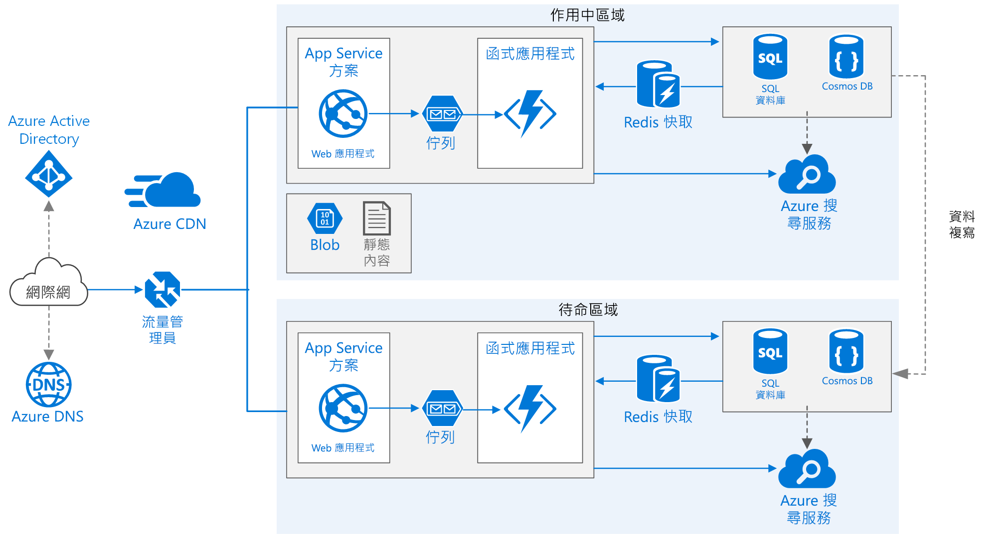

# <a name="run-a-web-application-in-multiple-azure-regions-for-high-availability"></a><span data-ttu-id="1f443-103">在多個 Azure 區域中執行 Web 應用程式以獲得高可用性</span><span class="sxs-lookup"><span data-stu-id="1f443-103">Run a web application in multiple Azure regions for high availability</span></span>

<span data-ttu-id="1f443-104">此參考架構示範如何在多個區域中執行 Azure App Service 應用程式以實現高可用性。</span><span class="sxs-lookup"><span data-stu-id="1f443-104">This reference architecture shows how to run an Azure App Service application in multiple regions to achieve high availability.</span></span>



<span data-ttu-id="1f443-106">下載這個架構的 [Visio 檔案][visio-download]。</span><span class="sxs-lookup"><span data-stu-id="1f443-106">*Download a [Visio file][visio-download] of this architecture.*</span></span>

## <a name="architecture"></a><span data-ttu-id="1f443-107">架構</span><span class="sxs-lookup"><span data-stu-id="1f443-107">Architecture</span></span>

<span data-ttu-id="1f443-108">此架構是根據[增進 Web 應用程式中的延展性][guidance-web-apps-scalability] 中的架構而建置。</span><span class="sxs-lookup"><span data-stu-id="1f443-108">This architecture builds on the one shown in [Improve scalability in a web application][guidance-web-apps-scalability].</span></span> <span data-ttu-id="1f443-109">主要差別在於：</span><span class="sxs-lookup"><span data-stu-id="1f443-109">The main differences are:</span></span>

- <span data-ttu-id="1f443-110">**主要和次要區域**。</span><span class="sxs-lookup"><span data-stu-id="1f443-110">**Primary and secondary regions**.</span></span> <span data-ttu-id="1f443-111">此架構使用兩個區域以實現更高的可用性。</span><span class="sxs-lookup"><span data-stu-id="1f443-111">This architecture uses two regions to achieve higher availability.</span></span> <span data-ttu-id="1f443-112">應用程式會部署到每個區域。</span><span class="sxs-lookup"><span data-stu-id="1f443-112">The application is deployed to each region.</span></span> <span data-ttu-id="1f443-113">正常作業期間，會將網路流量路由傳送到主要區域。</span><span class="sxs-lookup"><span data-stu-id="1f443-113">During normal operations, network traffic is routed to the primary region.</span></span> <span data-ttu-id="1f443-114">如果主要區域變得無法使用，就會將流量流量傳送到次要區域。</span><span class="sxs-lookup"><span data-stu-id="1f443-114">If the primary region becomes unavailable, traffic is routed to the secondary region.</span></span>
- <span data-ttu-id="1f443-115">**Azure DNS**。</span><span class="sxs-lookup"><span data-stu-id="1f443-115">**Azure DNS**.</span></span> <span data-ttu-id="1f443-116">[Azure DNS][azure-dns] 是 DNS 網域的主機服務，採用 Microsoft Azure 基礎結構提供名稱解析。</span><span class="sxs-lookup"><span data-stu-id="1f443-116">[Azure DNS][azure-dns] is a hosting service for DNS domains, providing name resolution using Microsoft Azure infrastructure.</span></span> <span data-ttu-id="1f443-117">只要將您的網域裝載於 Azure，就可以像管理其他 Azure 服務一樣，使用相同的認證、API、工具和計費方式來管理 DNS 記錄。</span><span class="sxs-lookup"><span data-stu-id="1f443-117">By hosting your domains in Azure, you can manage your DNS records using the same credentials, APIs, tools, and billing as your other Azure services.</span></span>
- <span data-ttu-id="1f443-118">**Azure 流量管理員**。</span><span class="sxs-lookup"><span data-stu-id="1f443-118">**Azure Traffic Manager**.</span></span> <span data-ttu-id="1f443-119">[流量管理員][traffic-manager]會將傳入要求路由傳送到主要區域。</span><span class="sxs-lookup"><span data-stu-id="1f443-119">[Traffic Manager][traffic-manager] routes incoming requests to the primary region.</span></span> <span data-ttu-id="1f443-120">如果應用程式執行的區域變得無法使用，流量管理員就會容錯移轉到次要區域。</span><span class="sxs-lookup"><span data-stu-id="1f443-120">If the application running that region becomes unavailable, Traffic Manager fails over to the secondary region.</span></span>
- <span data-ttu-id="1f443-121">SQL Database 和 Cosmos DB 的**異地複寫**。</span><span class="sxs-lookup"><span data-stu-id="1f443-121">**Geo-replication** of SQL Database and Cosmos DB.</span></span>

<span data-ttu-id="1f443-122">多區域架構可以提供比部署到單一區域更高的可用性。</span><span class="sxs-lookup"><span data-stu-id="1f443-122">A multi-region architecture can provide higher availability than deploying to a single region.</span></span> <span data-ttu-id="1f443-123">如果區域中斷會影響主要區域，您可以使用[流量管理員][traffic-manager]容錯移轉到次要區域。</span><span class="sxs-lookup"><span data-stu-id="1f443-123">If a regional outage affects the primary region, you can use [Traffic Manager][traffic-manager] to fail over to the secondary region.</span></span> <span data-ttu-id="1f443-124">如果應用程式的個別子系統失敗，此架構也可以提供協助。</span><span class="sxs-lookup"><span data-stu-id="1f443-124">This architecture can also help if an individual subsystem of the application fails.</span></span>

<span data-ttu-id="1f443-125">有數種一般方法可用來跨區域實現高可用性：</span><span class="sxs-lookup"><span data-stu-id="1f443-125">There are several general approaches to achieving high availability across regions:</span></span>

- <span data-ttu-id="1f443-126">搭配熱待命的主動/被動。</span><span class="sxs-lookup"><span data-stu-id="1f443-126">Active/passive with hot standby.</span></span> <span data-ttu-id="1f443-127">流量會傳送到其中一個區域，而另一個區域會以熱待命模式等候。</span><span class="sxs-lookup"><span data-stu-id="1f443-127">Traffic goes to one region, while the other waits on hot standby.</span></span> <span data-ttu-id="1f443-128">熱待命表示次要區域中隨時都已配置 VM 且正在執行中。</span><span class="sxs-lookup"><span data-stu-id="1f443-128">Hot standby means the VMs in the secondary region are allocated and running at all times.</span></span>
- <span data-ttu-id="1f443-129">搭配冷待命的主動/被動。</span><span class="sxs-lookup"><span data-stu-id="1f443-129">Active/passive with cold standby.</span></span> <span data-ttu-id="1f443-130">流量會傳送到其中一個區域，而另一個區域會以冷待命模式等候。</span><span class="sxs-lookup"><span data-stu-id="1f443-130">Traffic goes to one region, while the other waits on cold standby.</span></span> <span data-ttu-id="1f443-131">冷待命表示在需要容錯移轉之前，不會在次要區域中配置 VM。</span><span class="sxs-lookup"><span data-stu-id="1f443-131">Cold standby means the VMs in the secondary region are not allocated until needed for failover.</span></span> <span data-ttu-id="1f443-132">此方式的執行成本較小，但在失敗發生時通常需要較久的時間才能上線。</span><span class="sxs-lookup"><span data-stu-id="1f443-132">This approach costs less to run, but will generally take longer to come online during a failure.</span></span>
- <span data-ttu-id="1f443-133">主動/主動。</span><span class="sxs-lookup"><span data-stu-id="1f443-133">Active/active.</span></span> <span data-ttu-id="1f443-134">兩個區域均為主動，而且要求會在它們之間負載平衡。</span><span class="sxs-lookup"><span data-stu-id="1f443-134">Both regions are active, and requests are load balanced between them.</span></span> <span data-ttu-id="1f443-135">如果其中一個區域變成無法使用，就會將它從輪替中剔除。</span><span class="sxs-lookup"><span data-stu-id="1f443-135">If one region becomes unavailable, it is taken out of rotation.</span></span>

<span data-ttu-id="1f443-136">此參考架構著重於搭配熱待命的主動/被動，使用流量管理員進行容錯移轉。</span><span class="sxs-lookup"><span data-stu-id="1f443-136">This reference architecture focuses on active/passive with hot standby, using Traffic Manager for failover.</span></span>

## <a name="recommendations"></a><span data-ttu-id="1f443-137">建議</span><span class="sxs-lookup"><span data-stu-id="1f443-137">Recommendations</span></span>

<span data-ttu-id="1f443-138">您的需求可能和此處所述的架構不同。</span><span class="sxs-lookup"><span data-stu-id="1f443-138">Your requirements might differ from the architecture described here.</span></span> <span data-ttu-id="1f443-139">以本節的建議作為起點。</span><span class="sxs-lookup"><span data-stu-id="1f443-139">Use the recommendations in this section as a starting point.</span></span>

### <a name="regional-pairing"></a><span data-ttu-id="1f443-140">區域配對</span><span class="sxs-lookup"><span data-stu-id="1f443-140">Regional pairing</span></span>

<span data-ttu-id="1f443-141">每個 Azure 區域都會與相同地理位置內的另一個區域配對。</span><span class="sxs-lookup"><span data-stu-id="1f443-141">Each Azure region is paired with another region within the same geography.</span></span> <span data-ttu-id="1f443-142">通常會從相同區域配對選擇區域 (例如，美國東部 2 和美國中部)。</span><span class="sxs-lookup"><span data-stu-id="1f443-142">In general, choose regions from the same regional pair (for example, East US 2 and Central US).</span></span> <span data-ttu-id="1f443-143">這樣做的優點包括：</span><span class="sxs-lookup"><span data-stu-id="1f443-143">Benefits of doing so include:</span></span>

- <span data-ttu-id="1f443-144">如果發生大範圍中斷，至少優先復原每個配對中的一個區域。</span><span class="sxs-lookup"><span data-stu-id="1f443-144">If there is a broad outage, recovery of at least one region out of every pair is prioritized.</span></span>
- <span data-ttu-id="1f443-145">已計劃的 Azure 系統更新會循序在配對區域中展開，將可能的停機時間降到最低。</span><span class="sxs-lookup"><span data-stu-id="1f443-145">Planned Azure system updates are rolled out to paired regions sequentially to minimize possible downtime.</span></span>
- <span data-ttu-id="1f443-146">在大部分情況下，區域配對會位於相同的地理位置，以符合資料落地需求。</span><span class="sxs-lookup"><span data-stu-id="1f443-146">In most cases, regional pairs reside within the same geography to meet data residency requirements.</span></span>

<span data-ttu-id="1f443-147">不過，請確定這兩個區域均支援您應用程式所需的所有 Azure 服務。</span><span class="sxs-lookup"><span data-stu-id="1f443-147">However, make sure that both regions support all of the Azure services needed for your application.</span></span> <span data-ttu-id="1f443-148">請參閱[依區域提供的服務][services-by-region]。</span><span class="sxs-lookup"><span data-stu-id="1f443-148">See [Services by region][services-by-region].</span></span> <span data-ttu-id="1f443-149">如需區域配對的詳細資訊，請參閱[商務持續性和災害復原 (BCDR)：Azure 配對的區域][regional-pairs]。</span><span class="sxs-lookup"><span data-stu-id="1f443-149">For more information about regional pairs, see [Business continuity and disaster recovery (BCDR): Azure Paired Regions][regional-pairs].</span></span>

### <a name="resource-groups"></a><span data-ttu-id="1f443-150">資源群組</span><span class="sxs-lookup"><span data-stu-id="1f443-150">Resource groups</span></span>

<span data-ttu-id="1f443-151">請考慮將主要區域、次要區域、流量管理員放在不同的[資源群組][resource groups]中。</span><span class="sxs-lookup"><span data-stu-id="1f443-151">Consider placing the primary region, secondary region, and Traffic Manager into separate [resource groups][resource groups].</span></span> <span data-ttu-id="1f443-152">這可讓您將部署至每個區域的資源當做單一集合來管理。</span><span class="sxs-lookup"><span data-stu-id="1f443-152">This lets you manage the resources deployed to each region as a single collection.</span></span>

### <a name="traffic-manager-configuration"></a><span data-ttu-id="1f443-153">流量管理員設定</span><span class="sxs-lookup"><span data-stu-id="1f443-153">Traffic Manager configuration</span></span>

<span data-ttu-id="1f443-154">**路由**。</span><span class="sxs-lookup"><span data-stu-id="1f443-154">**Routing**.</span></span> <span data-ttu-id="1f443-155">流量管理員支援數個[路由演算法][tm-routing]。</span><span class="sxs-lookup"><span data-stu-id="1f443-155">Traffic Manager supports several [routing algorithms][tm-routing].</span></span> <span data-ttu-id="1f443-156">針對本文所述的案例，請使用「優先順序」路由 (先前稱為「容錯移轉」路由)。</span><span class="sxs-lookup"><span data-stu-id="1f443-156">For the scenario described in this article, use *priority* routing (formerly called *failover* routing).</span></span> <span data-ttu-id="1f443-157">使用此設定，流量管理員會將所有要求傳送到主要區域，除非該區域的端點變成無法連線。</span><span class="sxs-lookup"><span data-stu-id="1f443-157">With this setting, Traffic Manager sends all requests to the primary region unless the endpoint for that region becomes unreachable.</span></span> <span data-ttu-id="1f443-158">那時，就會自動容錯移轉到次要區域。</span><span class="sxs-lookup"><span data-stu-id="1f443-158">At that point, it automatically fails over to the secondary region.</span></span> <span data-ttu-id="1f443-159">請參閱[設定容錯移轉路由方法][tm-configure-failover]。</span><span class="sxs-lookup"><span data-stu-id="1f443-159">See [Configure Failover routing method][tm-configure-failover].</span></span>

<span data-ttu-id="1f443-160">**健康情況探查**。</span><span class="sxs-lookup"><span data-stu-id="1f443-160">**Health probe**.</span></span> <span data-ttu-id="1f443-161">流量管理員會使用 HTTP (或 HTTPS) 探查來監視每個端點區域的可用性。</span><span class="sxs-lookup"><span data-stu-id="1f443-161">Traffic Manager uses an HTTP (or HTTPS) probe to monitor the availability of each endpoint.</span></span> <span data-ttu-id="1f443-162">探查會提供容錯移轉到次要區域的測試結果 (通過/失敗) 給流量管理員。</span><span class="sxs-lookup"><span data-stu-id="1f443-162">The probe gives Traffic Manager a pass/fail test for failing over to the secondary region.</span></span> <span data-ttu-id="1f443-163">運作方式是將要求傳送至指定的 URL 路徑。</span><span class="sxs-lookup"><span data-stu-id="1f443-163">It works by sending a request to a specified URL path.</span></span> <span data-ttu-id="1f443-164">如果在逾時期間內得到非 200 的回應，則探查失敗。</span><span class="sxs-lookup"><span data-stu-id="1f443-164">If it gets a non-200 response within a timeout period, the probe fails.</span></span> <span data-ttu-id="1f443-165">四次失敗的要求之後，流量管理員會將端點標示為降級，並容錯移轉至另一個端點。</span><span class="sxs-lookup"><span data-stu-id="1f443-165">After four failed requests, Traffic Manager marks the endpoint as degraded and fails over to the other endpoint.</span></span> <span data-ttu-id="1f443-166">如需詳細資訊，請參閱[流量管理員端點監視和容錯移轉][tm-monitoring]。</span><span class="sxs-lookup"><span data-stu-id="1f443-166">For details, see [Traffic Manager endpoint monitoring and failover][tm-monitoring].</span></span>

<span data-ttu-id="1f443-167">最佳做法是，建立健康情況探查端點來報告應用程式的整體健康情況，並使用此端點進行健康情況探查。</span><span class="sxs-lookup"><span data-stu-id="1f443-167">As a best practice, create a health probe endpoint that reports the overall health of the application and use this endpoint for the health probe.</span></span> <span data-ttu-id="1f443-168">端點應該檢查關鍵性的相依性，例如 App Service 應用程式、儲存體佇列、SQL Database。</span><span class="sxs-lookup"><span data-stu-id="1f443-168">The endpoint should check critical dependencies such as the App Service apps, storage queue, and SQL Database.</span></span> <span data-ttu-id="1f443-169">否則，探查可能會在應用程式的關鍵組件真的失敗時報告端點狀況良好。</span><span class="sxs-lookup"><span data-stu-id="1f443-169">Otherwise, the probe might report a healthy endpoint when critical parts of the application are actually failing.</span></span>

<span data-ttu-id="1f443-170">另一方面，請勿使用健康情況探查來檢查較低優先順序的服務。</span><span class="sxs-lookup"><span data-stu-id="1f443-170">On the other hand, don't use the health probe to check lower priority services.</span></span> <span data-ttu-id="1f443-171">例如，如果電子郵件服務已關閉，應用程式可以切換至第二個提供者或只是稍後再傳送電子郵件。</span><span class="sxs-lookup"><span data-stu-id="1f443-171">For example, if an email service goes down the application can switch to a second provider or just send emails later.</span></span> <span data-ttu-id="1f443-172">其優先順序不足以高到要將應用程式容錯移轉。</span><span class="sxs-lookup"><span data-stu-id="1f443-172">This is not a high enough priority to cause the application to fail over.</span></span> <span data-ttu-id="1f443-173">如需詳細資訊，請參閱[健康情況端點監視模式][health-endpoint-monitoring-pattern]。</span><span class="sxs-lookup"><span data-stu-id="1f443-173">For more information, see [Health Endpoint Monitoring Pattern][health-endpoint-monitoring-pattern].</span></span>

### <a name="sql-database"></a><span data-ttu-id="1f443-174">SQL Database</span><span class="sxs-lookup"><span data-stu-id="1f443-174">SQL Database</span></span>

<span data-ttu-id="1f443-175">使用[作用中地理複寫][sql-replication] 在不同區域中建立可讀取的次要複本。</span><span class="sxs-lookup"><span data-stu-id="1f443-175">Use [Active Geo-Replication][sql-replication] to create a readable secondary replica in a different region.</span></span> <span data-ttu-id="1f443-176">最多可以有四個可讀取的次要複本。</span><span class="sxs-lookup"><span data-stu-id="1f443-176">You can have up to four readable secondary replicas.</span></span> <span data-ttu-id="1f443-177">若您的主要資料庫失敗，或是需要離線，請容錯移轉至次要資料庫。</span><span class="sxs-lookup"><span data-stu-id="1f443-177">Fail over to a secondary database if your primary database fails or needs to be taken offline.</span></span> <span data-ttu-id="1f443-178">您可以為任何彈性資料庫集區中的任何資料庫設定作用中異地複寫。</span><span class="sxs-lookup"><span data-stu-id="1f443-178">Active Geo-Replication can be configured for any database in any elastic database pool.</span></span>

### <a name="cosmos-db"></a><span data-ttu-id="1f443-179">Cosmos DB</span><span class="sxs-lookup"><span data-stu-id="1f443-179">Cosmos DB</span></span>

<span data-ttu-id="1f443-180">Cosmos DB 支援跨多個主要區域 (多個寫入區域) 的異地複寫。</span><span class="sxs-lookup"><span data-stu-id="1f443-180">Cosmos DB supports geo-replication across regions with multi-master (multiple write regions).</span></span> <span data-ttu-id="1f443-181">或者，您可以將一個區域指定為可寫入區域，將其他區域指定為唯讀複本。</span><span class="sxs-lookup"><span data-stu-id="1f443-181">Alternatively, you can designate one region as the writable region and the others as read-only replicas.</span></span> <span data-ttu-id="1f443-182">如果發生區域性中斷，您可以選取另一個區域作為寫入區域，達成容錯移轉。</span><span class="sxs-lookup"><span data-stu-id="1f443-182">If there is a regional outage, you can fail over by selecting another region to be the write region.</span></span> <span data-ttu-id="1f443-183">用戶端 SDK 會自動傳送寫入要求到目前的寫入區域，因此您不需要在容錯移轉之後更新用戶端設定。</span><span class="sxs-lookup"><span data-stu-id="1f443-183">The client SDK automatically sends write requests to the current write region, so you don't need to update the client configuration after a failover.</span></span> <span data-ttu-id="1f443-184">如需詳細資訊，請參閱[透過 Azure Cosmos DB 進行全域資料散發][cosmosdb-geo]。</span><span class="sxs-lookup"><span data-stu-id="1f443-184">For more information, see [Global data distribution with Azure Cosmos DB][cosmosdb-geo].</span></span>

> [!NOTE]
> <span data-ttu-id="1f443-185">所有複本皆隸屬於相同資源群組。</span><span class="sxs-lookup"><span data-stu-id="1f443-185">All of the replicas belong to the same resource group.</span></span>
>

### <a name="storage"></a><span data-ttu-id="1f443-186">儲存體</span><span class="sxs-lookup"><span data-stu-id="1f443-186">Storage</span></span>

<span data-ttu-id="1f443-187">若是 Azure 儲存體，請使用[讀取權限異地備援儲存體 (RA-GRS)][ra-grs]。</span><span class="sxs-lookup"><span data-stu-id="1f443-187">For Azure Storage, use [read-access geo-redundant storage][ra-grs] (RA-GRS).</span></span> <span data-ttu-id="1f443-188">使用 RA-GRS 儲存體，資料會複寫到次要區域。</span><span class="sxs-lookup"><span data-stu-id="1f443-188">With RA-GRS storage, the data is replicated to a secondary region.</span></span> <span data-ttu-id="1f443-189">您透過不同的端點，對次要區域中的資料有唯讀存取權。</span><span class="sxs-lookup"><span data-stu-id="1f443-189">You have read-only access to the data in the secondary region through a separate endpoint.</span></span> <span data-ttu-id="1f443-190">如果發生區域性中斷或災害，Azure 儲存體團隊可能會決定執行地理容錯移轉到次要區域。</span><span class="sxs-lookup"><span data-stu-id="1f443-190">If there is a regional outage or disaster, the Azure Storage team might decide to perform a geo-failover to the secondary region.</span></span> <span data-ttu-id="1f443-191">此種容錯移轉不需要客戶動作。</span><span class="sxs-lookup"><span data-stu-id="1f443-191">There is no customer action required for this failover.</span></span>

<span data-ttu-id="1f443-192">若是佇列儲存體，請在次要區域中建立備份佇列。</span><span class="sxs-lookup"><span data-stu-id="1f443-192">For Queue storage, create a backup queue in the secondary region.</span></span> <span data-ttu-id="1f443-193">在容錯移轉期間，應用程式可以使用備份佇列，直到主要區域再次變為可使用為止。</span><span class="sxs-lookup"><span data-stu-id="1f443-193">During failover, the app can use the backup queue until the primary region becomes available again.</span></span> <span data-ttu-id="1f443-194">這樣一來，應用程式仍然可以處理新的要求。</span><span class="sxs-lookup"><span data-stu-id="1f443-194">That way, the application can still process new requests.</span></span>

## <a name="availability-considerations---traffic-manager"></a><span data-ttu-id="1f443-195">可用性考量 - 流量管理員</span><span class="sxs-lookup"><span data-stu-id="1f443-195">Availability considerations - Traffic Manager</span></span>

<span data-ttu-id="1f443-196">如果主要區域變得無法使用，流量管理員就會自動容錯移轉到次要區域。</span><span class="sxs-lookup"><span data-stu-id="1f443-196">Traffic Manager automatically fails over if the primary region becomes unavailable.</span></span> <span data-ttu-id="1f443-197">當流量管理員容錯移轉時，用戶端會有一段時間無法連線到應用程式。</span><span class="sxs-lookup"><span data-stu-id="1f443-197">When Traffic Manager fails over, there is a period of time when clients cannot reach the application.</span></span> <span data-ttu-id="1f443-198">持續時間受到下列因素影響：</span><span class="sxs-lookup"><span data-stu-id="1f443-198">The duration is affected by the following factors:</span></span>

- <span data-ttu-id="1f443-199">健康情況探查必須偵測到主要區域已變成無法連線。</span><span class="sxs-lookup"><span data-stu-id="1f443-199">The health probe must detect that the primary data center has become unreachable.</span></span>
- <span data-ttu-id="1f443-200">網域名稱系統 (DNS) 伺服器必須針對 IP 位址更新快取的 DNS 記錄，這取決於 DNS 存留時間 (TTL)。</span><span class="sxs-lookup"><span data-stu-id="1f443-200">Domain name service (DNS) servers must update the cached DNS records for the IP address, which depends on the DNS time-to-live (TTL).</span></span> <span data-ttu-id="1f443-201">預設的 TTL 是 300 秒 (5 分鐘)，但是當您建立流量管理員設定檔時，您可以設定此值。</span><span class="sxs-lookup"><span data-stu-id="1f443-201">The default TTL is 300 seconds (5 minutes), but you can configure this value when you create the Traffic Manager profile.</span></span>

<span data-ttu-id="1f443-202">如需詳細資料，請參閱[關於流量管理員監視][tm-monitoring]。</span><span class="sxs-lookup"><span data-stu-id="1f443-202">For details, see [About Traffic Manager Monitoring][tm-monitoring].</span></span>

<span data-ttu-id="1f443-203">流量管理員也可能是這套系統中的失敗點。</span><span class="sxs-lookup"><span data-stu-id="1f443-203">Traffic Manager is a possible failure point in the system.</span></span> <span data-ttu-id="1f443-204">如果此服務失敗，用戶端就無法在當機期間存取您的應用程式。</span><span class="sxs-lookup"><span data-stu-id="1f443-204">If the service fails, clients cannot access your application during the downtime.</span></span> <span data-ttu-id="1f443-205">檢閱[流量管理員服務等級協定 (SLA)][tm-sla]，判斷單獨使用流量管理員是否符合您獲得高可用性的業務需求。</span><span class="sxs-lookup"><span data-stu-id="1f443-205">Review the [Traffic Manager service level agreement (SLA)][tm-sla] and determine whether using Traffic Manager alone meets your business requirements for high availability.</span></span> <span data-ttu-id="1f443-206">如果沒有，請考慮新增另一個流量管理解決方案作為容錯回復。</span><span class="sxs-lookup"><span data-stu-id="1f443-206">If not, consider adding another traffic management solution as a fallback.</span></span> <span data-ttu-id="1f443-207">如果 Azure 流量管理員服務失敗，請變更您在 DNS 中的正式名稱 (CNAME) 記錄，以指向其他流量管理服務。</span><span class="sxs-lookup"><span data-stu-id="1f443-207">If the Azure Traffic Manager service fails, change your canonical name (CNAME) records in DNS to point to the other traffic management service.</span></span> <span data-ttu-id="1f443-208">此步驟必須手動執行，而且在傳播 DNS 變更之前，將無法使用您的應用程式。</span><span class="sxs-lookup"><span data-stu-id="1f443-208">This step must be performed manually, and your application will be unavailable until the DNS changes are propagated.</span></span>

## <a name="availability-considerations---sql-database"></a><span data-ttu-id="1f443-209">可用性考量 - SQL Database</span><span class="sxs-lookup"><span data-stu-id="1f443-209">Availability Considerations - SQL Database</span></span>

<span data-ttu-id="1f443-210">SQL Database 的復原點目標 (RPO) 和 預估復原時間 (ERT) 記載於[使用 Azure SQL Database 的商務持續性概觀][sql-rpo]。</span><span class="sxs-lookup"><span data-stu-id="1f443-210">The recovery point objective (RPO) and estimated recovery time (ERT) for SQL Database are documented in [Overview of business continuity with Azure SQL Database][sql-rpo].</span></span>

## <a name="availability-considerations---storage"></a><span data-ttu-id="1f443-211">可用性考量 - 儲存體</span><span class="sxs-lookup"><span data-stu-id="1f443-211">Availability Considerations - Storage</span></span>

<span data-ttu-id="1f443-212">RA-GRS 儲存體提供持久儲存體，但請務必了解中斷期間可能發生的情況：</span><span class="sxs-lookup"><span data-stu-id="1f443-212">RA-GRS storage provides durable storage, but it's important to understand what can happen during an outage:</span></span>

- <span data-ttu-id="1f443-213">如果儲存體中斷，您會有一段時間不具有寫入資料的權限。</span><span class="sxs-lookup"><span data-stu-id="1f443-213">If a storage outage occurs, there will be a period of time when you don't have write-access to the data.</span></span> <span data-ttu-id="1f443-214">在中斷期間，您仍可讀取次要端點。</span><span class="sxs-lookup"><span data-stu-id="1f443-214">You can still read from the secondary endpoint during the outage.</span></span>
- <span data-ttu-id="1f443-215">如果區域性中斷或災害影響了主要位置，且無法復原該處的資料，Azure 儲存體團隊可能會決定執行地理容錯移轉到次要區域。</span><span class="sxs-lookup"><span data-stu-id="1f443-215">If a regional outage or disaster affects the primary location and the data there cannot be recovered, the Azure Storage team may decide to perform a geo-failover to the secondary region.</span></span>
- <span data-ttu-id="1f443-216">資料複寫到次要區域會以非同步方式執行。</span><span class="sxs-lookup"><span data-stu-id="1f443-216">Data replication to the secondary region is performed asynchronously.</span></span> <span data-ttu-id="1f443-217">因此，執行地理容錯移轉時，如果無法從主要區域復原資料，則可能會遺失某些資料。</span><span class="sxs-lookup"><span data-stu-id="1f443-217">Therefore, if a geo-failover is performed, some data loss is possible if the data can't be recovered from the primary region.</span></span>
- <span data-ttu-id="1f443-218">暫時性的失敗 (例如網路中斷) 不會觸發儲存體容錯移轉。</span><span class="sxs-lookup"><span data-stu-id="1f443-218">Transient failures, such as a network outage, will not trigger a storage failover.</span></span> <span data-ttu-id="1f443-219">將您的應用程式設計為具有經歷暫時性失敗的彈性。</span><span class="sxs-lookup"><span data-stu-id="1f443-219">Design your application to be resilient to transient failures.</span></span> <span data-ttu-id="1f443-220">可能的緩和措施：</span><span class="sxs-lookup"><span data-stu-id="1f443-220">Possible mitigations:</span></span>

  - <span data-ttu-id="1f443-221">從次要地區讀取。</span><span class="sxs-lookup"><span data-stu-id="1f443-221">Read from the secondary region.</span></span>
  - <span data-ttu-id="1f443-222">暫時切換到另一個儲存體帳戶進行新的寫入作業 (例如，將訊息排入佇列)。</span><span class="sxs-lookup"><span data-stu-id="1f443-222">Temporarily switch to another storage account for new write operations (for example, to queue messages).</span></span>
  - <span data-ttu-id="1f443-223">從次要區域將資料複製到另一個儲存體帳戶。</span><span class="sxs-lookup"><span data-stu-id="1f443-223">Copy data from the secondary region to another storage account.</span></span>
  - <span data-ttu-id="1f443-224">提供的功能會減少，直到系統容錯回復。</span><span class="sxs-lookup"><span data-stu-id="1f443-224">Provide reduced functionality until the system fails back.</span></span>

<span data-ttu-id="1f443-225">如需詳細資訊，請參閱[如果 Azure 儲存體發生中斷怎麼辦][storage-outage]。</span><span class="sxs-lookup"><span data-stu-id="1f443-225">For more information, see [What to do if an Azure Storage outage occurs][storage-outage].</span></span>

## <a name="manageability-considerations---traffic-manager"></a><span data-ttu-id="1f443-226">管理性考量 - 流量管理員</span><span class="sxs-lookup"><span data-stu-id="1f443-226">Manageability Considerations - Traffic Manager</span></span>

<span data-ttu-id="1f443-227">如果流量管理員容錯移轉，我們建議執行手動容錯回復，而不是實作自動容錯回復。</span><span class="sxs-lookup"><span data-stu-id="1f443-227">If Traffic Manager fails over, we recommend performing a manual failback rather than implementing an automatic failback.</span></span> <span data-ttu-id="1f443-228">或者，您可以建立應用程式會在區域之間來回翻轉的情況。</span><span class="sxs-lookup"><span data-stu-id="1f443-228">Otherwise, you can create a situation where the application flips back and forth between regions.</span></span> <span data-ttu-id="1f443-229">請確認所有的應用程式子系統狀況良好，然後再進行容錯回復。</span><span class="sxs-lookup"><span data-stu-id="1f443-229">Verify that all application subsystems are healthy before failing back.</span></span>

<span data-ttu-id="1f443-230">請注意，流量管理員預設會自動容錯回復。</span><span class="sxs-lookup"><span data-stu-id="1f443-230">Note that Traffic Manager automatically fails back by default.</span></span> <span data-ttu-id="1f443-231">若要避免這個問題，請在容錯移轉事件之後，手動降低主要區域的優先順序。</span><span class="sxs-lookup"><span data-stu-id="1f443-231">To prevent this, manually lower the priority of the primary region after a failover event.</span></span> <span data-ttu-id="1f443-232">例如，假設主要區域是優先順序 1，而次要為優先順序 2。</span><span class="sxs-lookup"><span data-stu-id="1f443-232">For example, suppose the primary region is priority 1 and the secondary is priority 2.</span></span> <span data-ttu-id="1f443-233">在容錯移轉之後，將主要區域設定為優先順序 3，以防止自動容錯回復。</span><span class="sxs-lookup"><span data-stu-id="1f443-233">After a failover, set the primary region to priority 3, to prevent automatic failback.</span></span> <span data-ttu-id="1f443-234">當您準備好切換回來時，將優先順序更新為 1。</span><span class="sxs-lookup"><span data-stu-id="1f443-234">When you are ready to switch back, update the priority to 1.</span></span>

<span data-ttu-id="1f443-235">下列命令會更新優先順序。</span><span class="sxs-lookup"><span data-stu-id="1f443-235">The following commands update the priority.</span></span>

### <a name="powershell"></a><span data-ttu-id="1f443-236">PowerShell</span><span class="sxs-lookup"><span data-stu-id="1f443-236">PowerShell</span></span>

```powershell
$endpoint = Get-AzureRmTrafficManagerEndpoint -Name <endpoint> -ProfileName <profile> -ResourceGroupName <resource-group> -Type AzureEndpoints
$endpoint.Priority = 3
Set-AzureRmTrafficManagerEndpoint -TrafficManagerEndpoint $endpoint
```

<span data-ttu-id="1f443-237">如需詳細資訊，請參閱 [Azure 流量管理員 Cmdlet][tm-ps]。</span><span class="sxs-lookup"><span data-stu-id="1f443-237">For more information, see [Azure Traffic Manager Cmdlets][tm-ps].</span></span>

### <a name="azure-cli"></a><span data-ttu-id="1f443-238">Azure CLI</span><span class="sxs-lookup"><span data-stu-id="1f443-238">Azure CLI</span></span>

```azurecli
az network traffic-manager endpoint update --resource-group <resource-group> --profile-name <profile> \
    --name <endpoint-name> --type azureEndpoints --priority 3
```

## <a name="manageability-considerations---sql-database"></a><span data-ttu-id="1f443-239">管理性考量 - SQL Database</span><span class="sxs-lookup"><span data-stu-id="1f443-239">Manageability Considerations - SQL Database</span></span>

<span data-ttu-id="1f443-240">如果主要資料庫失敗，手動容錯移轉到次要資料庫。</span><span class="sxs-lookup"><span data-stu-id="1f443-240">If the primary database fails, perform a manual failover to the secondary database.</span></span> <span data-ttu-id="1f443-241">請參閱[還原 Azure SQL Database 或容錯移轉到次要資料庫][sql-failover]。</span><span class="sxs-lookup"><span data-stu-id="1f443-241">See [Restore an Azure SQL Database or failover to a secondary][sql-failover].</span></span> <span data-ttu-id="1f443-242">次要資料庫會維持唯讀狀態，直到您容錯移轉。</span><span class="sxs-lookup"><span data-stu-id="1f443-242">The secondary database remains read-only until you fail over.</span></span>

<!-- links -->

[azure-sql-db]: https://azure.microsoft.com/documentation/services/sql-database/
[azure-dns]: /azure/dns/dns-overview
[cosmosdb-geo]: /azure/cosmos-db/distribute-data-globally
[guidance-web-apps-scalability]: ./scalable-web-app.md
[health-endpoint-monitoring-pattern]: https://msdn.microsoft.com/library/dn589789.aspx
[ra-grs]: /azure/storage/storage-redundancy#read-access-geo-redundant-storage
[regional-pairs]: /azure/best-practices-availability-paired-regions
[resource groups]: /azure/azure-resource-manager/resource-group-overview#resource-groups
[services-by-region]: https://azure.microsoft.com/regions/#services
[sql-failover]: /azure/sql-database/sql-database-disaster-recovery
[sql-replication]: /azure/sql-database/sql-database-geo-replication-overview
[sql-rpo]: /azure/sql-database/sql-database-business-continuity#sql-database-features-that-you-can-use-to-provide-business-continuity
[storage-outage]: /azure/storage/storage-disaster-recovery-guidance
[tm-configure-failover]: /azure/traffic-manager/traffic-manager-configure-failover-routing-method
[tm-monitoring]: /azure/traffic-manager/traffic-manager-monitoring
[tm-ps]: /powershell/module/azurerm.trafficmanager
[tm-routing]: /azure/traffic-manager/traffic-manager-routing-methods
[tm-sla]: https://azure.microsoft.com/support/legal/sla/traffic-manager
[traffic-manager]: https://azure.microsoft.com/services/traffic-manager
[visio-download]: https://archcenter.blob.core.windows.net/cdn/app-service-reference-architectures.vsdx
